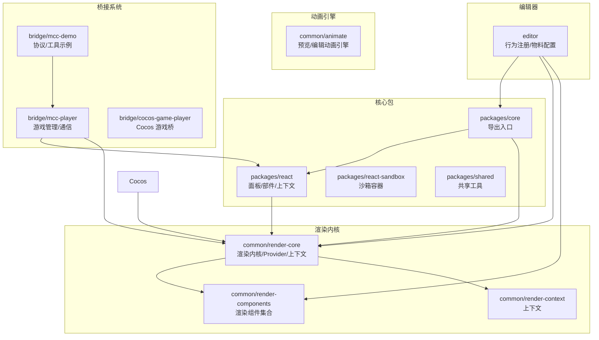
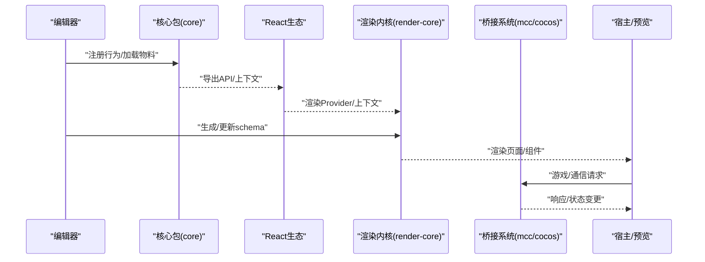
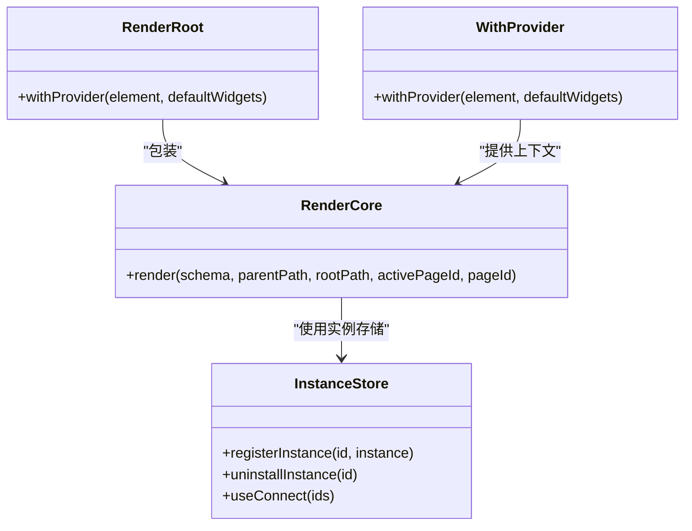
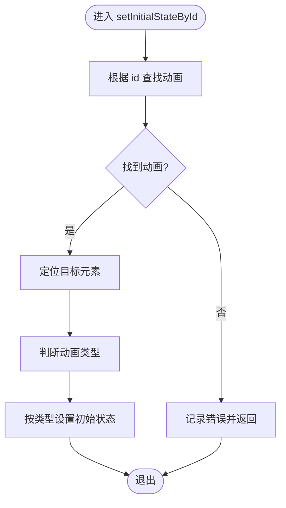
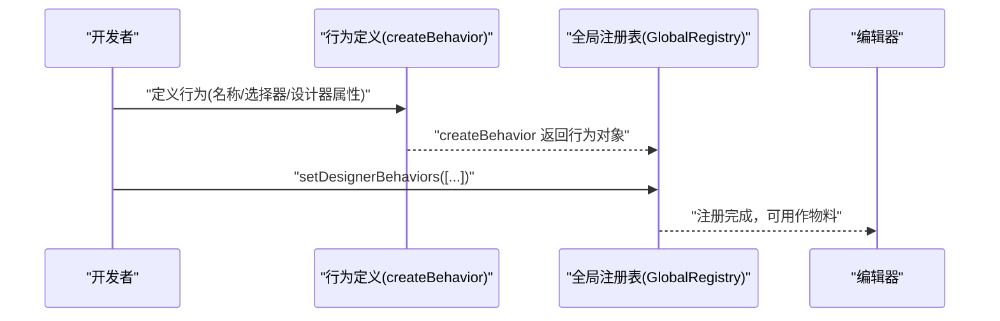
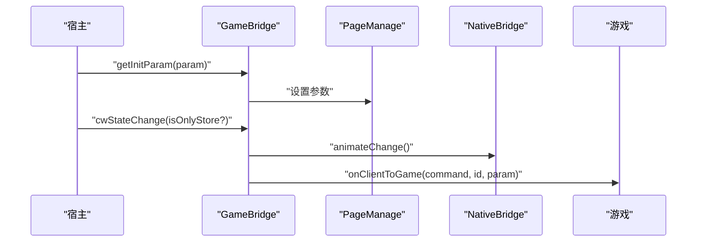
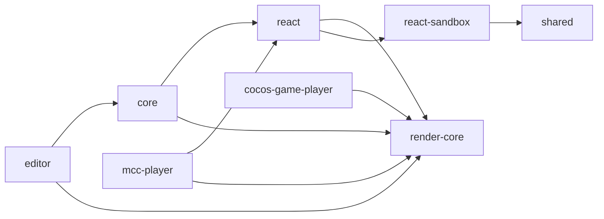

# API 参考

<cite>
**本文引用的文件**
- [packages/core/src/index.ts](file://packages/core/src/index.ts)
- [packages/react/src/index.ts](file://packages/react/src/index.ts)
- [packages/react-sandbox/src/index.ts](file://packages/react-sandbox/src/index.ts)
- [packages/shared/src/index.ts](file://packages/shared/src/index.ts)
- [common/render-core/index.tsx](file://common/render-core/index.tsx)
- [common/render-core/models/context.ts](file://common/render-core/models/context.ts)
- [common/render-core/models/withProvider.tsx](file://common/render-core/models/withProvider.tsx)
- [common/render-components/src/index.ts](file://common/render-components/src/index.ts)
- [common/render-context/src/index.ts](file://common/render-context/src/index.ts)
- [common/animate/src/engine/preview.ts](file://common/animate/src/engine/preview.ts)
- [common/animate/src/index.ts](file://common/animate/src/index.ts)
- [editor/src/RegistryBehaviors.ts](file://editor/src/RegistryBehaviors.ts)
- [bridge/mcc-player/src/components/game-manage/gameBridge.ts](file://bridge/mcc-player/src/components/game-manage/gameBridge.ts)
- [bridge/mcc-player/src/components/service/index.ts](file://bridge/mcc-player/src/components/service/index.ts)
- [bridge/mcc-player/gameStatic/game-container.html](file://bridge/mcc-player/gameStatic/game-container.html)
- [bridge/cocos-game-player/assets/frame/index.js](file://bridge/cocos-game-player/assets/frame/index.js)
- [bridge/cocos-game-player/webgl-debug.js](file://bridge/cocos-game-player/webgl-debug.js)
- [bridge/mcc-demo/src/pomelo/index.ts](file://bridge/mcc-demo/src/pomelo/index.ts)
- [bridge/mcc-demo/src/utils/protocol.ts](file://bridge/mcc-demo/src/utils/protocol.ts)
- [bridge/mcc-demo/src/utils/index.ts](file://bridge/mcc-demo/src/utils/index.ts)
- [project-analysis/01_项目亮点总结.md](file://project-analysis/01_项目亮点总结.md)
- [project-analysis/05_高频面试问题.md](file://project-analysis/05_高频面试问题.md)
- [project-analysis/08_工程化能力分析.md](file://project-analysis/08_工程化能力分析.md)
</cite>

## 目录
1. [简介](#简介)
2. [项目结构](#项目结构)
3. [核心组件](#核心组件)
4. [架构总览](#架构总览)
5. [详细组件分析](#详细组件分析)
6. [依赖分析](#依赖分析)
7. [性能考虑](#性能考虑)
8. [故障排查指南](#故障排查指南)
9. [结论](#结论)
10. [附录](#附录)

## 简介
本参考文档面向 Slides Engine 的使用者与维护者，系统梳理并说明以下内容：
- 核心 API：渲染内核、行为注册、沙箱容器等
- 组件 API：渲染组件集合、上下文与 Provider 包装
- 工具函数与配置项：共享工具、事件与布局辅助
- 渲染引擎 API：渲染方法、事件回调、状态查询
- 桥接系统 API：游戏管理、通信协议与数据交换格式
- TypeScript 类型与接口说明
- 最佳实践与常见错误处理

## 项目结构
Slides Engine 采用多包工作区组织，核心模块按职责拆分为 packages、common、editor、bridge 等目录。下图展示主要模块与关系：

图表来源
- [packages/core/src/index.ts:1-16](file://packages/core/src/index.ts#L1-L16)
- [packages/react/src/index.ts:1-11](file://packages/react/src/index.ts#L1-L11)
- [packages/react-sandbox/src/index.ts:1-133](file://packages/react-sandbox/src/index.ts#L1-L133)
- [packages/shared/src/index.ts:1-19](file://packages/shared/src/index.ts#L1-L19)
- [common/render-core/index.tsx:1-76](file://common/render-core/index.tsx#L1-L76)
- [common/render-components/src/index.ts](file://common/render-components/src/index.ts)
- [common/render-context/src/index.ts](file://common/render-context/src/index.ts)
- [common/animate/src/index.ts](file://common/animate/src/index.ts)
- [editor/src/RegistryBehaviors.ts:1-69](file://editor/src/RegistryBehaviors.ts#L1-L69)
- [bridge/mcc-player/src/components/game-manage/gameBridge.ts:1-35](file://bridge/mcc-player/src/components/game-manage/gameBridge.ts#L1-L35)
- [bridge/cocos-game-player/assets/frame/index.js:1816-1852](file://bridge/cocos-game-player/assets/frame/index.js#L1816-L1852)
- [bridge/mcc-demo/src/pomelo/index.ts](file://bridge/mcc-demo/src/pomelo/index.ts)

章节来源
- [packages/core/src/index.ts:1-16](file://packages/core/src/index.ts#L1-L16)
- [packages/react/src/index.ts:1-11](file://packages/react/src/index.ts#L1-L11)
- [packages/react-sandbox/src/index.ts:1-133](file://packages/react-sandbox/src/index.ts#L1-L133)
- [packages/shared/src/index.ts:1-19](file://packages/shared/src/index.ts#L1-L19)
- [common/render-core/index.tsx:1-76](file://common/render-core/index.tsx#L1-L76)
- [common/render-components/src/index.ts](file://common/render-components/src/index.ts)
- [common/render-context/src/index.ts](file://common/render-context/src/index.ts)
- [common/animate/src/index.ts](file://common/animate/src/index.ts)
- [editor/src/RegistryBehaviors.ts:1-69](file://editor/src/RegistryBehaviors.ts#L1-L69)
- [bridge/mcc-player/src/components/game-manage/gameBridge.ts:1-35](file://bridge/mcc-player/src/components/game-manage/gameBridge.ts#L1-L35)
- [bridge/cocos-game-player/assets/frame/index.js:1816-1852](file://bridge/cocos-game-player/assets/frame/index.js#L1816-L1852)
- [bridge/mcc-demo/src/pomelo/index.ts](file://bridge/mcc-demo/src/pomelo/index.ts)

## 核心组件
本节概述 Slides Engine 的核心 API 与能力边界。

- 核心导出与全局挂载
  - packages/core 提供统一导出，并在浏览器环境下将核心对象挂载至全局命名空间，便于外部访问。
  - 适合在 iframe 或宿主环境中通过全局变量进行能力发现与调用。

- React 生态与沙箱
  - packages/react 提供面板、部件、上下文、钩子、模拟器等，支撑编辑器与预览。
  - packages/react-sandbox 提供沙箱容器，隔离样式与脚本，支持注入主题与布局上下文。

- 共享工具
  - packages/shared 提供事件、滚动、订阅、坐标、类型、UID、克隆、观察者、空闲调度等基础能力。

- 渲染内核
  - common/render-core 提供渲染入口、Provider 包装、上下文存储、内置小部件等。
  - 支持基于 schema 的递归渲染与属性排序，具备受控组件实例注册与卸载机制。

- 动画引擎
  - common/animate 提供预览/编辑阶段的动画控制能力，支持按动画类型设置初始/结束状态。

- 编辑器行为注册
  - editor 通过 RegistryBehaviors 将 Root、Card、Shape、Game 等行为注册到全局注册表，形成可拖拽、可配置的物料体系。

章节来源
- [packages/core/src/index.ts:1-16](file://packages/core/src/index.ts#L1-L16)
- [packages/react/src/index.ts:1-11](file://packages/react/src/index.ts#L1-L11)
- [packages/react-sandbox/src/index.ts:1-133](file://packages/react-sandbox/src/index.ts#L1-L133)
- [packages/shared/src/index.ts:1-19](file://packages/shared/src/index.ts#L1-L19)
- [common/render-core/index.tsx:1-76](file://common/render-core/index.tsx#L1-L76)
- [common/animate/src/engine/preview.ts:525-594](file://common/animate/src/engine/preview.ts#L525-L594)
- [editor/src/RegistryBehaviors.ts:1-69](file://editor/src/RegistryBehaviors.ts#L1-L69)

## 架构总览
下图展示编辑器、渲染内核、桥接系统与宿主之间的交互关系：

图表来源
- [packages/core/src/index.ts:1-16](file://packages/core/src/index.ts#L1-L16)
- [packages/react/src/index.ts:1-11](file://packages/react/src/index.ts#L1-L11)
- [common/render-core/index.tsx:1-76](file://common/render-core/index.tsx#L1-L76)
- [bridge/mcc-player/src/components/game-manage/gameBridge.ts:1-35](file://bridge/mcc-player/src/components/game-manage/gameBridge.ts#L1-L35)

## 详细组件分析

### 核心 API（packages/core）
- 能力概览
  - 统一导出核心模块，挂载至全局命名空间，便于跨环境发现与使用。
  - 适用于在 iframe 或宿主环境中通过全局变量访问 Designable.Core。

- 使用建议
  - 在宿主或预览环境中优先通过全局命名空间获取核心能力，避免重复打包。
  - 注意模块热替换与导出兼容性，确保在不同运行时保持一致行为。

章节来源
- [packages/core/src/index.ts:1-16](file://packages/core/src/index.ts#L1-L16)

### React 生态 API（packages/react）
- 能力概览
  - 面板、部件、上下文、钩子、容器、模拟器等，覆盖编辑器 UI 与交互。
  - 与渲染内核配合，提供可配置的渲染上下文与小部件集合。

- 使用建议
  - 在自定义面板中优先使用提供的上下文与钩子，保证与编辑器状态一致。
  - 小部件与面板尽量遵循约定式结构，便于注册与复用。

章节来源
- [packages/react/src/index.ts:1-11](file://packages/react/src/index.ts#L1-L11)

### 沙箱容器 API（packages/react-sandbox）
- 能力概览
  - 提供 useSandbox/useSandboxScope/renderSandboxContent 等能力，用于在 iframe 内创建隔离的渲染环境。
  - 支持注入 CSS/JS 资源、主题变量与布局上下文，提升预览一致性。

- 参数与返回
  - useSandbox(props: ISandboxProps): 返回 iframe 引用
  - useSandboxScope(): 返回沙箱作用域
  - renderSandboxContent(render): 在沙箱根节点渲染内容
  - Sandbox(props): 组件形式的 iframe 容器

- 使用建议
  - 在预览或演示场景中使用 Sandbox，确保样式与脚本隔离。
  - 注意生命周期与内存回收，避免 iframe 移除后仍持有引用。

章节来源
- [packages/react-sandbox/src/index.ts:11-133](file://packages/react-sandbox/src/index.ts#L11-L133)

### 共享工具 API（packages/shared）
- 能力概览
  - 事件、滚动、订阅、坐标、类型、UID、克隆、观察者、空闲调度、元素检测、全局 polyfill 等。
  - 为编辑器与渲染内核提供通用基础设施。

- 使用建议
  - 在自定义扩展中优先使用共享工具，降低重复造轮子的成本。
  - 对于性能敏感路径，关注空闲调度与观察者模式的使用。

章节来源
- [packages/shared/src/index.ts:1-19](file://packages/shared/src/index.ts#L1-L19)

### 渲染内核 API（common/render-core）
- 能力概览
  - RenderCore：根据 schema 递归渲染，支持属性排序与路径传递。
  - RenderRoot：基于 Provider 的根渲染器，注入内置小部件。
  - withProvider：包装任意组件，合并默认与自定义 widgets/methods/globalProps/globalConfig。
  - 上下文与实例管理：受控组件注册/卸载、实例映射、连接指定实例 ID 列表。

- 关键类型
  - schemaIF：描述 UI 组件的 schema 结构，包含 ui:widget、props、properties、widgetType、id 等。
  - RenderItemProps：渲染项属性，包含 schema、路径、活动页 ID、页面 ID 等。

- 使用建议
  - 在自定义组件中遵循 schema 规范，确保 RenderCore 能正确渲染。
  - 使用 withProvider 注入全局配置，避免重复传递 props。

图表来源
- [common/render-core/index.tsx:28-76](file://common/render-core/index.tsx#L28-L76)
- [common/render-core/models/withProvider.tsx:1-31](file://common/render-core/models/withProvider.tsx#L1-L31)
- [common/render-core/models/context.ts:95-140](file://common/render-core/models/context.ts#L95-L140)

章节来源
- [common/render-core/index.tsx:1-76](file://common/render-core/index.tsx#L1-L76)
- [common/render-core/models/withProvider.tsx:1-31](file://common/render-core/models/withProvider.tsx#L1-L31)
- [common/render-core/models/context.ts:95-140](file://common/render-core/models/context.ts#L95-L140)

### 渲染组件 API（common/render-components）
- 能力概览
  - 提供图像、视频等渲染组件的基础实现与类型定义，便于在 schema 中直接使用。
  - 与渲染内核协同，实现组件级渲染与样式控制。

- 使用建议
  - 在 schema 中引用对应组件类型，确保渲染内核能够正确解析与渲染。
  - 注意资源加载与跨域策略，避免预览时出现资源不可用。

章节来源
- [common/render-components/src/index.ts](file://common/render-components/src/index.ts)

### 渲染上下文 API（common/render-context）
- 能力概览
  - 提供渲染上下文的导出与封装，便于在组件树中传递配置与方法。

- 使用建议
  - 在自定义组件中通过上下文读取全局配置，避免硬编码与重复传参。

章节来源
- [common/render-context/src/index.ts](file://common/render-context/src/index.ts)

### 动画引擎 API（common/animate）
- 能力概览
  - 预览动画引擎支持按动画类型设置初始/结束状态，便于在预览与编辑阶段控制动画表现。
  - 提供根据动画 ID 查询与设置状态的能力。

- 关键方法
  - setInitialStateById(id): 根据动画 ID 设置初始状态
  - setEndStateById(id): 根据动画 ID 设置结束状态
  - setInitialState(animate): 根据动画对象设置初始状态

- 使用建议
  - 在预览阶段通过 setInitialState/setEndState 控制动画起止，提升交互体验。
  - 注意动画类型枚举与目标元素选择器的一致性。

图表来源
- [common/animate/src/engine/preview.ts:525-594](file://common/animate/src/engine/preview.ts#L525-L594)

章节来源
- [common/animate/src/engine/preview.ts:525-594](file://common/animate/src/engine/preview.ts#L525-L594)
- [common/animate/src/index.ts](file://common/animate/src/index.ts)

### 行为注册 API（editor/RegistryBehaviors）
- 能力概览
  - 通过 createBehavior 定义行为，使用 GlobalRegistry.setDesignerBehaviors 注册到全局。
  - 支持设计器属性、国际化文案、属性 schema 等配置。

- 关键点
  - RootBehavior：根组件行为，支持拖拽与样式设置。
  - 其他行为：Card、MarkGroup、Shape、Image、Text、Video、Audio、RichText、Camera、Game 等。

- 使用建议
  - 新增组件时，先定义行为并生成属性 schema，再注册到全局注册表。
  - 国际化文案与属性名称保持一致，便于多语言支持。

图表来源
- [editor/src/RegistryBehaviors.ts:1-69](file://editor/src/RegistryBehaviors.ts#L1-L69)

章节来源
- [editor/src/RegistryBehaviors.ts:1-69](file://editor/src/RegistryBehaviors.ts#L1-L69)

### 桥接系统 API（bridge/mcc-player）
- 能力概览
  - GameBridge：游戏桥接核心，负责与原生/服务端通信、状态同步、消息分发。
  - Service 层：课件状态变更、初始化参数设置、与原生桥接联动。
  - 页面管理：课程/页面状态与参数传递。
  - 游戏容器：提供 iframe 容器与消息通道，承载游戏资源。

- 关键接口
  - GameBridge
    - 属性：nativeBridge、pageManager、initParams、interactInfo、storeData、gameUrl、gameFrameDone、isBeWatched、gameStartExtraData
    - 方法：onClientToGame(command, id, param)、cwStateChange(isOnlyStore?)、getInitParam(param)
  - Service
    - 方法：cwStateChange、onClientToGame、getInitParam
  - 页面容器
    - game-container.html：提供 iframe 容器与消息脚本

- 使用建议
  - 在宿主环境中通过 GameBridge 与原生/服务端通信，避免直接操作 DOM。
  - 初始化参数通过 getInitParam 注入，确保后续流程一致。
  - 状态变更通过 cwStateChange 触发，必要时只存储不上报服务端。

图表来源
- [bridge/mcc-player/src/components/game-manage/gameBridge.ts:1-35](file://bridge/mcc-player/src/components/game-manage/gameBridge.ts#L1-L35)
- [bridge/mcc-player/src/components/service/index.ts:728-780](file://bridge/mcc-player/src/components/service/index.ts#L728-L780)
- [bridge/mcc-player/gameStatic/game-container.html:1-34](file://bridge/mcc-player/gameStatic/game-container.html#L1-L34)

章节来源
- [bridge/mcc-player/src/components/game-manage/gameBridge.ts:1-35](file://bridge/mcc-player/src/components/game-manage/gameBridge.ts#L1-L35)
- [bridge/mcc-player/src/components/service/index.ts:728-780](file://bridge/mcc-player/src/components/service/index.ts#L728-L780)
- [bridge/mcc-player/gameStatic/game-container.html:1-34](file://bridge/mcc-player/gameStatic/game-container.html#L1-L34)

### Cocos 游戏桥 API（bridge/cocos-game-player）
- 能力概览
  - 提供游戏消息类型常量与调试工具，支持游戏框架事件与状态同步。
  - 包含 WebGL 调试辅助脚本，便于开发与问题定位。

- 关键点
  - FrameMsgType：定义游戏交互与同步相关消息类型，如切换游戏、心跳、停止、初始化等。
  - 调试脚本：提供 WebGL 状态重置与错误影射，辅助定位图形问题。

- 使用建议
  - 在集成 Cocos 游戏时，严格遵循消息类型与生命周期，避免状态错乱。
  - 开发阶段启用调试脚本，上线前关闭以减少开销。

章节来源
- [bridge/cocos-game-player/assets/frame/index.js:1816-1852](file://bridge/cocos-game-player/assets/frame/index.js#L1816-L1852)
- [bridge/cocos-game-player/webgl-debug.js:386-418](file://bridge/cocos-game-player/webgl-debug.js#L386-L418)

### 协议与工具（bridge/mcc-demo）
- 能力概览
  - pomelo 示例：演示与服务端通信的典型流程。
  - protocol 工具：定义通信协议与消息格式。
  - 通用工具：UUID、URL 参数解析、远程资源检查等。

- 使用建议
  - 在新功能中复用现有协议与工具，保持与服务端的一致性。
  - 对网络请求与解析过程加入错误处理与重试策略。

章节来源
- [bridge/mcc-demo/src/pomelo/index.ts](file://bridge/mcc-demo/src/pomelo/index.ts)
- [bridge/mcc-demo/src/utils/protocol.ts](file://bridge/mcc-demo/src/utils/protocol.ts)
- [bridge/mcc-demo/src/utils/index.ts](file://bridge/mcc-demo/src/utils/index.ts)

## 依赖分析
- 模块耦合
  - packages/core 为核心入口，被 packages/react 与 common/render-core 依赖。
  - packages/react-sandbox 依赖 packages/shared 与 packages/react，用于沙箱与主题注入。
  - editor 依赖 core 与 render-core，通过行为注册形成物料体系。
  - bridge/mcc-player 依赖 react 与 render-core，承载游戏与通信能力。

- 外部依赖与集成点
  - 微前端宿主：通过 microApp 与 PostMessageClient 实现跨窗口通信。
  - WebGL 调试：cocos-game-player 提供调试脚本，辅助图形问题定位。

图表来源
- [packages/core/src/index.ts:1-16](file://packages/core/src/index.ts#L1-L16)
- [packages/react/src/index.ts:1-11](file://packages/react/src/index.ts#L1-L11)
- [packages/react-sandbox/src/index.ts:1-133](file://packages/react-sandbox/src/index.ts#L1-L133)
- [packages/shared/src/index.ts:1-19](file://packages/shared/src/index.ts#L1-L19)
- [common/render-core/index.tsx:1-76](file://common/render-core/index.tsx#L1-L76)
- [bridge/mcc-player/src/components/game-manage/gameBridge.ts:1-35](file://bridge/mcc-player/src/components/game-manage/gameBridge.ts#L1-L35)
- [bridge/cocos-game-player/assets/frame/index.js:1816-1852](file://bridge/cocos-game-player/assets/frame/index.js#L1816-L1852)

章节来源
- [packages/core/src/index.ts:1-16](file://packages/core/src/index.ts#L1-L16)
- [packages/react/src/index.ts:1-11](file://packages/react/src/index.ts#L1-L11)
- [packages/react-sandbox/src/index.ts:1-133](file://packages/react-sandbox/src/index.ts#L1-L133)
- [packages/shared/src/index.ts:1-19](file://packages/shared/src/index.ts#L1-L19)
- [common/render-core/index.tsx:1-76](file://common/render-core/index.tsx#L1-L76)
- [bridge/mcc-player/src/components/game-manage/gameBridge.ts:1-35](file://bridge/mcc-player/src/components/game-manage/gameBridge.ts#L1-L35)
- [bridge/cocos-game-player/assets/frame/index.js:1816-1852](file://bridge/cocos-game-player/assets/frame/index.js#L1816-L1852)

## 性能考虑
- 撤销与快照
  - 使用空闲调度合并连续操作，减少主线程阻塞；对离散操作（如 blur、drop 结束）可同步推进以满足“每步可撤销”的需求。
  - 历史快照最大数量需权衡内存占用与回溯步数，教学场景通常无需过大容量。

- 序列化与渲染
  - 对整树序列化进行性能剖析，对比 JSON.stringify 与结构化克隆，探索 Worker 序列化、子树增量快照与关键帧+操作日志混合方案。

- 跨窗口通信
  - postMessage 无统一错误码，需结合 store 状态与 try/catch 实现显式错误提示与重试策略。
  - 在宿主未注入时尽早 feature-detect，避免运行期暴露问题。

章节来源
- [project-analysis/05_高频面试问题.md:124-143](file://project-analysis/05_高频面试问题.md#L124-L143)
- [project-analysis/08_工程化能力分析.md:47-56](file://project-analysis/08_工程化能力分析.md#L47-L56)

## 故障排查指南
- 握手与通信
  - 必须在 iframe load 之后建立消息通道，否则远端句柄无效。
  - microApp 与 BroadcastChannel 分支需明确区分：前者用于真实微前端宿主，后者用于本地/预览模拟与多窗口广播。

- 多引擎上下文
  - React 树中仅允许存在一个 DesignerEngineContext，否则会抛错，防止状态串台。

- 游戏加载与提示
  - 编辑器侧监听超时与 error 事件，Toast 提示并允许重新选择游戏资源，避免逻辑分散在多处 postMessage。

- WebGL 问题定位
  - 使用 cocos-game-player 的调试脚本重置 WebGL 状态并影射错误，辅助定位图形层问题。

章节来源
- [project-analysis/01_项目亮点总结.md:67-71](file://project-analysis/01_项目亮点总结.md#L67-L71)
- [project-analysis/05_高频面试问题.md:116-119](file://project-analysis/05_高频面试问题.md#L116-L119)
- [project-analysis/08_工程化能力分析.md:47-56](file://project-analysis/08_工程化能力分析.md#L47-L56)
- [bridge/cocos-game-player/webgl-debug.js:386-418](file://bridge/cocos-game-player/webgl-debug.js#L386-L418)

## 结论
Slides Engine 通过清晰的模块划分与开放的 API 设计，实现了编辑器、渲染内核、桥接系统与宿主环境的高效协作。建议在扩展新能力时：
- 优先使用共享工具与 Provider 包装，降低耦合度
- 严格遵循行为注册与 schema 规范，确保渲染一致性
- 在桥接系统中统一协议与错误处理，保障跨端稳定性
- 结合性能剖析与工程化能力，持续优化用户体验

## 附录
- 最佳实践
  - 在宿主环境中通过全局命名空间访问核心能力，避免重复打包
  - 使用沙箱容器隔离预览环境，确保样式与脚本互不影响
  - 在动画控制中按类型设置初始/结束状态，提升预览一致性
  - 在桥接系统中集中处理通信与状态变更，避免逻辑分散

- 常见错误
  - 握手时机不当导致远端句柄无效
  - 多个 DesignerEngineContext 导致状态串台
  - 跨窗口通信未做错误回传与重试
  - 游戏加载失败未做显式提示与重试