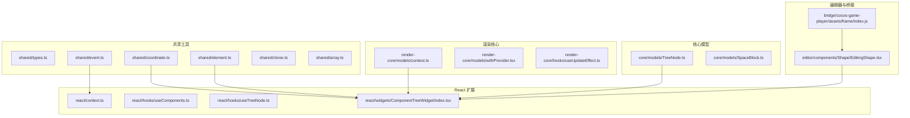
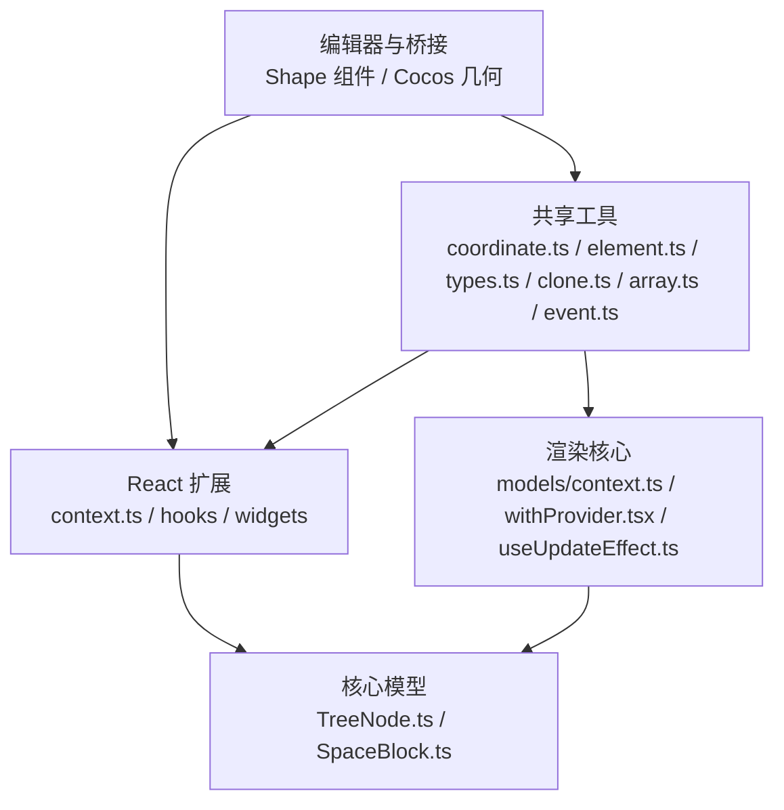
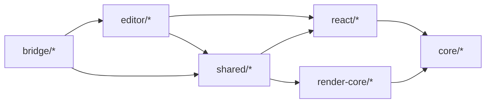
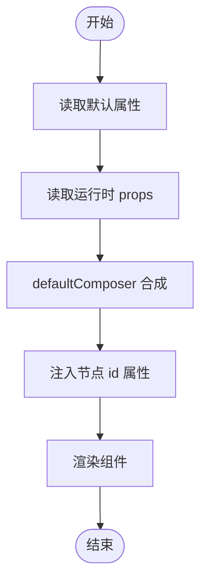

# 工具 API

<cite>
**本文引用的文件**
- [packages/shared/src/coordinate.ts](file://packages/shared/src/coordinate.ts)
- [packages/shared/src/element.ts](file://packages/shared/src/element.ts)
- [packages/shared/src/types.ts](file://packages/shared/src/types.ts)
- [packages/shared/src/event.ts](file://packages/shared/src/event.ts)
- [packages/shared/src/clone.ts](file://packages/shared/src/clone.ts)
- [packages/shared/src/array.ts](file://packages/shared/src/array.ts)
- [packages/react/src/context.ts](file://packages/react/src/context.ts)
- [packages/react/src/hooks/useComponents.ts](file://packages/react/src/hooks/useComponents.ts)
- [packages/react/src/hooks/useTreeNode.ts](file://packages/react/src/hooks/useTreeNode.ts)
- [common/render-core/models/context.ts](file://common/render-core/models/context.ts)
- [common/render-core/models/withProvider.tsx](file://common/render-core/models/withProvider.tsx)
- [common/render-core/hooks/useUpdateEffect.ts](file://common/render-core/hooks/useUpdateEffect.ts)
- [packages/core/src/models/TreeNode.ts](file://packages/core/src/models/TreeNode.ts)
- [packages/core/src/models/SpaceBlock.ts](file://packages/core/src/models/SpaceBlock.ts)
- [packages/react/src/widgets/ComponentTreeWidget/index.tsx](file://packages/react/src/widgets/ComponentTreeWidget/index.tsx)
- [editor/src/components/Shape/EditingShape.tsx](file://editor/src/components/Shape/EditingShape.tsx)
- [bridge/cocos-game-player/assets/frame/index.js](file://bridge/cocos-game-player/assets/frame/index.js)
</cite>

## 目录
1. [简介](#简介)
2. [项目结构](#项目结构)
3. [核心组件](#核心组件)
4. [架构总览](#架构总览)
5. [详细组件分析](#详细组件分析)
6. [依赖分析](#依赖分析)
7. [性能考量](#性能考量)
8. [故障排查指南](#故障排查指南)
9. [结论](#结论)
10. [附录](#附录)

## 简介
本文件为 Slides Engine 工具系统提供全面的 API 参考，覆盖以下主题：
- 渲染工具 API：坐标转换、尺寸计算与布局算法
- 组件工具 API：组件属性处理、样式计算与事件绑定工具
- 形状工具 API：几何计算、路径生成与碰撞检测工具
- 共享工具 API：通用类型定义、工具函数与辅助方法
- React 扩展工具 API：Hooks、Context 与组件增强工具
- 完整函数签名、参数说明与使用示例，包含常见场景与最佳实践

## 项目结构
工具相关代码主要分布在以下模块：
- packages/shared：通用类型、事件、克隆、数组与几何坐标工具
- packages/react：React 扩展工具（Context、Hooks、组件树渲染）
- common/render-core：受控组件上下文、实例注册与资源上报
- packages/core：节点模型与空间块等核心模型
- editor：编辑器中的形状组件与设计器行为
- bridge：桥接层的几何与碰撞工具（如 Cocos 引擎）

图表来源
- [packages/shared/src/coordinate.ts:1-634](file://packages/shared/src/coordinate.ts#L1-L634)
- [packages/shared/src/element.ts:1-145](file://packages/shared/src/element.ts#L1-L145)
- [packages/shared/src/event.ts:1-380](file://packages/shared/src/event.ts#L1-L380)
- [packages/react/src/context.ts:1-34](file://packages/react/src/context.ts#L1-L34)
- [packages/react/src/hooks/useComponents.ts:1-4](file://packages/react/src/hooks/useComponents.ts#L1-L4)
- [packages/react/src/hooks/useTreeNode.ts:1-7](file://packages/react/src/hooks/useTreeNode.ts#L1-L7)
- [packages/react/src/widgets/ComponentTreeWidget/index.tsx:47-115](file://packages/react/src/widgets/ComponentTreeWidget/index.tsx#L47-L115)
- [common/render-core/models/context.ts:1-226](file://common/render-core/models/context.ts#L1-L226)
- [common/render-core/models/withProvider.tsx:1-31](file://common/render-core/models/withProvider.tsx#L1-L31)
- [common/render-core/hooks/useUpdateEffect.ts:1-20](file://common/render-core/hooks/useUpdateEffect.ts#L1-L20)
- [packages/core/src/models/TreeNode.ts:120-169](file://packages/core/src/models/TreeNode.ts#L120-L169)
- [packages/core/src/models/SpaceBlock.ts:123-137](file://packages/core/src/models/SpaceBlock.ts#L123-L137)
- [editor/src/components/Shape/EditingShape.tsx:35-103](file://editor/src/components/Shape/EditingShape.tsx#L35-L103)
- [bridge/cocos-game-player/assets/frame/index.js:3276-3455](file://bridge/cocos-game-player/assets/frame/index.js#L3276-L3455)

章节来源
- [packages/shared/src/index.ts:1-18](file://packages/shared/src/index.ts#L1-L18)

## 核心组件
- 坐标与几何工具：Point、Rect、LineSegment、矩形关系判断、象限与距离计算、边界线段、吸附与合并线段等
- 元素布局与变换工具：元素外宽计算、布局方向推断、平移/旋转/缩放解析
- 类型与工具：通用类型判断、浅拷贝/深拷贝、数组/对象遍历与聚合
- 事件系统：事件驱动器、批量事件、订阅与解绑、容器附加/分离
- React 扩展：Context、Hooks、组件树渲染与属性合成
- 渲染核心：实例注册、资源上报、全局状态与 Provider 包装
- 编辑器与桥接：形状组件设计元数据、Cocos 几何与碰撞工具

章节来源
- [packages/shared/src/coordinate.ts:1-634](file://packages/shared/src/coordinate.ts#L1-L634)
- [packages/shared/src/element.ts:1-145](file://packages/shared/src/element.ts#L1-L145)
- [packages/shared/src/types.ts:1-28](file://packages/shared/src/types.ts#L1-L28)
- [packages/shared/src/clone.ts:1-97](file://packages/shared/src/clone.ts#L1-L97)
- [packages/shared/src/array.ts:1-302](file://packages/shared/src/array.ts#L1-L302)
- [packages/shared/src/event.ts:1-380](file://packages/shared/src/event.ts#L1-L380)
- [packages/react/src/context.ts:1-34](file://packages/react/src/context.ts#L1-L34)
- [packages/react/src/hooks/useComponents.ts:1-4](file://packages/react/src/hooks/useComponents.ts#L1-L4)
- [packages/react/src/hooks/useTreeNode.ts:1-7](file://packages/react/src/hooks/useTreeNode.ts#L1-L7)
- [common/render-core/models/context.ts:1-226](file://common/render-core/models/context.ts#L1-L226)
- [common/render-core/models/withProvider.tsx:1-31](file://common/render-core/models/withProvider.tsx#L1-L31)
- [packages/core/src/models/TreeNode.ts:120-169](file://packages/core/src/models/TreeNode.ts#L120-L169)
- [packages/core/src/models/SpaceBlock.ts:123-137](file://packages/core/src/models/SpaceBlock.ts#L123-L137)
- [editor/src/components/Shape/EditingShape.tsx:35-103](file://editor/src/components/Shape/EditingShape.tsx#L35-L103)
- [bridge/cocos-game-player/assets/frame/index.js:3276-3455](file://bridge/cocos-game-player/assets/frame/index.js#L3276-L3455)

## 架构总览
工具系统围绕“共享工具 + React 扩展 + 渲染核心 + 编辑器/桥接”分层组织，形成可复用的几何计算、事件驱动、组件属性合成与实例管理能力。

图表来源
- [packages/shared/src/coordinate.ts:1-634](file://packages/shared/src/coordinate.ts#L1-L634)
- [packages/shared/src/element.ts:1-145](file://packages/shared/src/element.ts#L1-L145)
- [packages/shared/src/types.ts:1-28](file://packages/shared/src/types.ts#L1-L28)
- [packages/shared/src/clone.ts:1-97](file://packages/shared/src/clone.ts#L1-L97)
- [packages/shared/src/array.ts:1-302](file://packages/shared/src/array.ts#L1-L302)
- [packages/shared/src/event.ts:1-380](file://packages/shared/src/event.ts#L1-L380)
- [packages/react/src/context.ts:1-34](file://packages/react/src/context.ts#L1-L34)
- [packages/react/src/widgets/ComponentTreeWidget/index.tsx:47-115](file://packages/react/src/widgets/ComponentTreeWidget/index.tsx#L47-L115)
- [common/render-core/models/context.ts:1-226](file://common/render-core/models/context.ts#L1-L226)
- [common/render-core/models/withProvider.tsx:1-31](file://common/render-core/models/withProvider.tsx#L1-L31)
- [packages/core/src/models/TreeNode.ts:120-169](file://packages/core/src/models/TreeNode.ts#L120-L169)
- [packages/core/src/models/SpaceBlock.ts:123-137](file://packages/core/src/models/SpaceBlock.ts#L123-L137)
- [editor/src/components/Shape/EditingShape.tsx:35-103](file://editor/src/components/Shape/EditingShape.tsx#L35-L103)
- [bridge/cocos-game-player/assets/frame/index.js:3276-3455](file://bridge/cocos-game-player/assets/frame/index.js#L3276-L3455)

## 详细组件分析

### 渲染工具 API（坐标、尺寸与布局）
- 几何数据结构与判断
  - 数据结构：Point、Rect、LineSegment、IRect、IPoint、ISize、ILineSegment
  - 判断函数：isRect、isPoint、isLineSegment
- 矩形关系与距离
  - isPointInRect、isEqualRect、getRectPoints、isRectInRect、isCrossRectInRect
  - calcQuadrantOfPointToRect、calcDistanceOfPointToRect、calcDistancePointToEdge、calcRelativeOfPointToRect
- 边界与吸附
  - calcEdgeLinesOfRect、calcRectOfAxisLineSegment、calcOffsetOfSnapLineSegmentToEdge
  - calcDistanceOfSnapLineToEdges、calcClosestEdges、calcCombineSnapLineSegment
- 矩形绘制与包围
  - calcBoundingRect、calcRectByStartEndPoint
- 空间块与对称块
  - calcSpaceBlockOfRect、SpaceBlock.isometrics
- 元素布局与变换
  - calcElementOuterWidth、calcElementLayout（基于 display/flex/grid/float 等推断水平/垂直布局）
  - calcElementTranslate、calcElementRotate、calcElementScale（从 transform 或 offsetLeft/Top 解析）

使用示例（场景）
- 场景一：拖拽框选生成矩形并计算包围盒
  - 步骤：收集起点与终点 → calcRectByStartEndPoint → calcBoundingRect
- 场景二：吸附对齐
  - 步骤：计算目标与参考矩形的吸附线段 → calcOffsetOfSnapLineSegmentToEdge
- 场景三：元素布局方向判断
  - 步骤：calcElementLayout → 根据返回值决定横向/纵向排列策略

章节来源
- [packages/shared/src/coordinate.ts:1-634](file://packages/shared/src/coordinate.ts#L1-L634)
- [packages/shared/src/element.ts:1-145](file://packages/shared/src/element.ts#L1-L145)
- [packages/core/src/models/SpaceBlock.ts:123-137](file://packages/core/src/models/SpaceBlock.ts#L123-L137)

### 组件工具 API（属性、样式与事件）
- 组件树渲染与属性合成
  - 组件树渲染：ComponentTreeWidget 将节点树渲染为 React 组件，支持默认属性、设计器属性与运行时 props 合成
  - 属性合成：通过 defaultComposer 合并 defaultProps、getComponentProps 返回值与运行时 props，并注入节点标识
- 上下文与 Hooks
  - DesignerComponentsContext、TreeNodeContext、DesignerEngineContext、WorkspaceContext
  - useComponents、useTreeNode
- 实例注册与资源上报（渲染核心）
  - useConnect：按 id 获取受控组件实例映射，仅在目标实例变化时触发重渲染
  - useInstanceStore：registerInstance/uninstallInstance 管理实例映射
  - useReport：资源上报（添加/更新/移除），配合资源状态枚举
- 更新效果 Hook
  - useUpdateEffect：跳过首次挂载，仅在依赖更新时执行副作用

使用示例（场景）
- 场景一：在编辑器中渲染组件树并注入节点 id
  - 步骤：ComponentTreeWidget 渲染根节点 → TreeNodeWidget 递归渲染子节点 → 渲染组件时注入 nodeIdAttrName
- 场景二：受控组件上报实例与资源
  - 步骤：组件初始化时 registerInstance → 通过 useConnect 获取实例 → 使用 useReport 上报资源状态

章节来源
- [packages/react/src/widgets/ComponentTreeWidget/index.tsx:47-115](file://packages/react/src/widgets/ComponentTreeWidget/index.tsx#L47-L115)
- [packages/react/src/context.ts:1-34](file://packages/react/src/context.ts#L1-L34)
- [packages/react/src/hooks/useComponents.ts:1-4](file://packages/react/src/hooks/useComponents.ts#L1-L4)
- [packages/react/src/hooks/useTreeNode.ts:1-7](file://packages/react/src/hooks/useTreeNode.ts#L1-L7)
- [common/render-core/models/context.ts:95-151](file://common/render-core/models/context.ts#L95-L151)
- [common/render-core/hooks/useUpdateEffect.ts:1-20](file://common/render-core/hooks/useUpdateEffect.ts#L1-L20)

### 形状工具 API（几何、路径与碰撞）
- 编辑器形状组件
  - EditingShape 定义了形状组件的设计元数据（propsSchema、defaultProps、getComponentProps）与本地化设置
- 桥接几何工具（Cocos）
  - 点到直线垂点、延长线上的点、两线段交点、浮点加法、随机数组元素、整数限制等
  - 适用于游戏或复杂图形场景下的几何计算与碰撞检测

使用示例（场景）
- 场景一：根据鼠标轨迹生成形状并进行碰撞检测
  - 步骤：记录起点/终点 → 生成形状矩形 → 使用桥接几何工具计算交点/垂点 → 判断是否命中

章节来源
- [editor/src/components/Shape/EditingShape.tsx:35-103](file://editor/src/components/Shape/EditingShape.tsx#L35-L103)
- [bridge/cocos-game-player/assets/frame/index.js:3276-3455](file://bridge/cocos-game-player/assets/frame/index.js#L3276-L3455)

### 共享工具 API（类型、函数与辅助）
- 类型判断
  - isFn、isWindow、isHTMLElement、isArr、isPlainObj、isStr、isBool、isNum、isObj、isRegExp、isValid、isValidNumber
- 深浅拷贝
  - shallowClone、clone（支持原生对象、Promise、Date、RegExp、File/FileList、URL 等）
- 数组/对象工具
  - toArr、each/map/reduce/every/some/find/findIndex/includes/includesWith、flat
- 事件系统
  - EventDriver 基类：addEventListener/removeEventListener/batchAddEventListener/batchRemoveEventListener
  - Event 引擎：attachEvents/detachEvents、subscribe/subscribeTo/subscribeWith
  - 支持 onlyOne/onlyParent/onlyChild 模式与批量事件

使用示例（场景）
- 场景一：安全深拷贝对象（过滤特定字段）
  - 步骤：clone(obj, (val, key) => shouldKeep(key)) → 保留需要的字段
- 场景二：批量绑定窗口事件并去重
  - 步骤：EventDriver.batchAddEventListener('resize', handler, { mode: 'onlyOne' })

章节来源
- [packages/shared/src/types.ts:1-28](file://packages/shared/src/types.ts#L1-L28)
- [packages/shared/src/clone.ts:1-97](file://packages/shared/src/clone.ts#L1-L97)
- [packages/shared/src/array.ts:1-302](file://packages/shared/src/array.ts#L1-L302)
- [packages/shared/src/event.ts:1-380](file://packages/shared/src/event.ts#L1-L380)

### React 扩展工具 API（Hooks、Context 与组件增强）
- Context
  - DesignerComponentsContext：设计器组件注册表
  - TreeNodeContext：当前树节点上下文
  - DesignerEngineContext、DesignerLayoutContext、WorkspaceContext：引擎、布局与工作区上下文
- Hooks
  - useComponents：获取设计器组件映射
  - useTreeNode：获取当前树节点
- 组件增强
  - withProvider：将 widgets/methods/globalProps/globalConfig 注入到组件树
- 组件树渲染
  - ComponentTreeWidget：递归渲染节点树，注入节点 id 与默认样式

使用示例（场景）
- 场景一：在自定义组件中读取设计器组件映射
  - 步骤：const components = useComponents() → 根据 componentName 渲染具体组件
- 场景二：通过 Provider 注入全局配置
  - 步骤：withProvider(MyComponent, defaultWidgets) → 在组件内消费 ConfigContext

章节来源
- [packages/react/src/context.ts:1-34](file://packages/react/src/context.ts#L1-L34)
- [packages/react/src/hooks/useComponents.ts:1-4](file://packages/react/src/hooks/useComponents.ts#L1-L4)
- [packages/react/src/hooks/useTreeNode.ts:1-7](file://packages/react/src/hooks/useTreeNode.ts#L1-L7)
- [common/render-core/models/withProvider.tsx:1-31](file://common/render-core/models/withProvider.tsx#L1-L31)
- [packages/react/src/widgets/ComponentTreeWidget/index.tsx:47-115](file://packages/react/src/widgets/ComponentTreeWidget/index.tsx#L47-L115)

## 依赖分析
- 组件耦合与内聚
  - 共享工具模块提供高内聚的几何与类型工具，被 React 扩展与渲染核心广泛复用
  - React 扩展通过 Context/Hooks 低耦合地访问核心模型与渲染上下文
  - 编辑器与桥接层独立于核心，通过共享工具与事件系统进行协作
- 外部依赖与集成点
  - hox：用于全局状态 store（useResourceStore/useInstanceStore）
  - globalThisPolyfill：跨环境事件目标解析
  - Cocos 桥接：frame/index.js 提供几何与碰撞工具

图表来源
- [packages/shared/src/coordinate.ts:1-634](file://packages/shared/src/coordinate.ts#L1-L634)
- [packages/shared/src/event.ts:1-380](file://packages/shared/src/event.ts#L1-L380)
- [common/render-core/models/context.ts:1-226](file://common/render-core/models/context.ts#L1-L226)
- [packages/react/src/widgets/ComponentTreeWidget/index.tsx:47-115](file://packages/react/src/widgets/ComponentTreeWidget/index.tsx#L47-L115)
- [editor/src/components/Shape/EditingShape.tsx:35-103](file://editor/src/components/Shape/EditingShape.tsx#L35-L103)
- [bridge/cocos-game-player/assets/frame/index.js:3276-3455](file://bridge/cocos-game-player/assets/frame/index.js#L3276-L3455)

## 性能考量
- 事件系统
  - 使用 onlyOne/onlyParent/onlyChild 模式避免重复监听
  - 批量事件接口减少重复 add/remove 次数
- 渲染与状态
  - useConnect 仅在指定实例变化时触发重渲染，降低无关更新
  - useUpdateEffect 跳过首次挂载副作用，避免不必要的初始化开销
- 几何计算
  - 合理使用吸附与边界线段计算，避免在高频事件中重复计算
  - 对矩形包围盒与距离计算进行缓存或节流

## 故障排查指南
- 事件未触发或重复绑定
  - 检查 EventDriver.add/remove 是否正确传入 mode 参数
  - 确认批量事件是否已调用 batchRemoveEventListener 清理
- 组件未按预期渲染
  - 检查 ComponentTreeWidget 的 props 合成顺序与节点隐藏标志
  - 确认 useTreeNode 返回的节点上下文是否正确
- 实例未注册或上报无效
  - 确保在组件初始化阶段调用 registerInstance
  - 检查 useConnect 的 id 列表与实例映射键一致
- 几何计算异常
  - 校验输入矩形与点坐标是否合法
  - 注意象限与距离计算的敏感度参数

章节来源
- [packages/shared/src/event.ts:158-230](file://packages/shared/src/event.ts#L158-L230)
- [packages/react/src/widgets/ComponentTreeWidget/index.tsx:47-115](file://packages/react/src/widgets/ComponentTreeWidget/index.tsx#L47-L115)
- [common/render-core/models/context.ts:99-140](file://common/render-core/models/context.ts#L99-L140)
- [packages/shared/src/coordinate.ts:104-220](file://packages/shared/src/coordinate.ts#L104-L220)

## 结论
本工具系统通过共享几何与类型工具、React 扩展上下文与 Hooks、渲染核心的实例与资源管理，以及编辑器与桥接层的协作，提供了完整而高效的开发体验。建议在实际使用中遵循“最小依赖、批量事件、按需渲染”的原则，结合本文档的 API 规范与最佳实践，提升系统的稳定性与性能。

## 附录
- 常见流程图（组件属性合成）

图表来源
- [packages/react/src/widgets/ComponentTreeWidget/index.tsx:47-77](file://packages/react/src/widgets/ComponentTreeWidget/index.tsx#L47-L77)