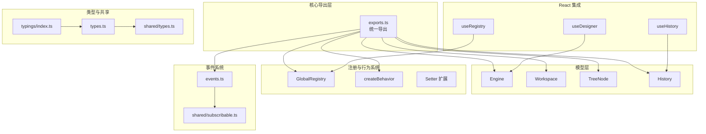
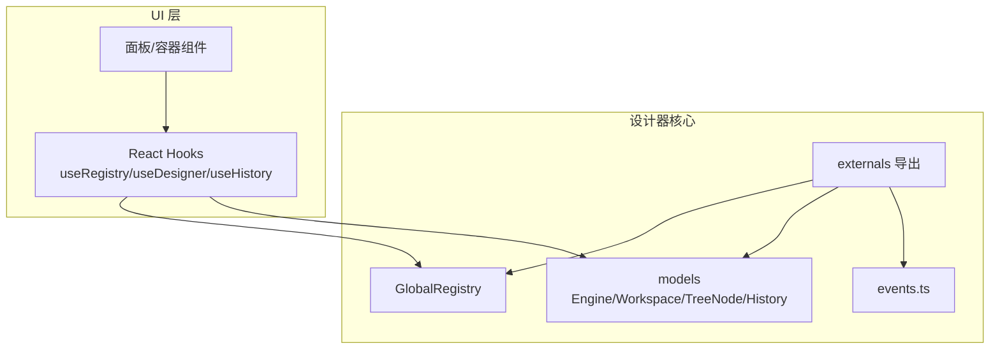
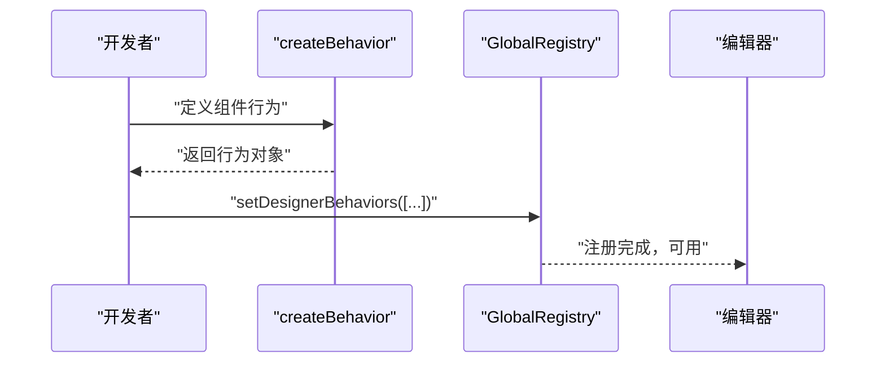
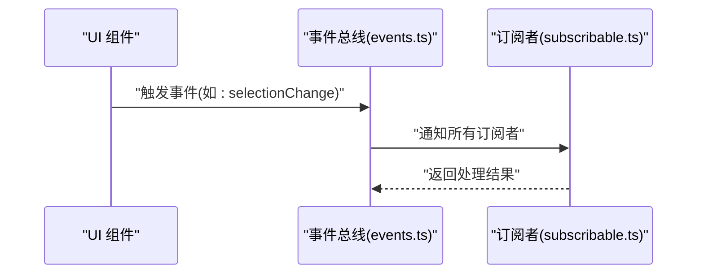
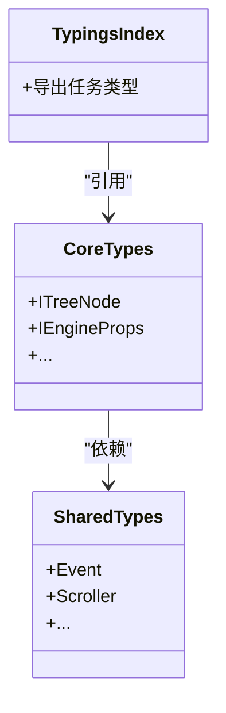
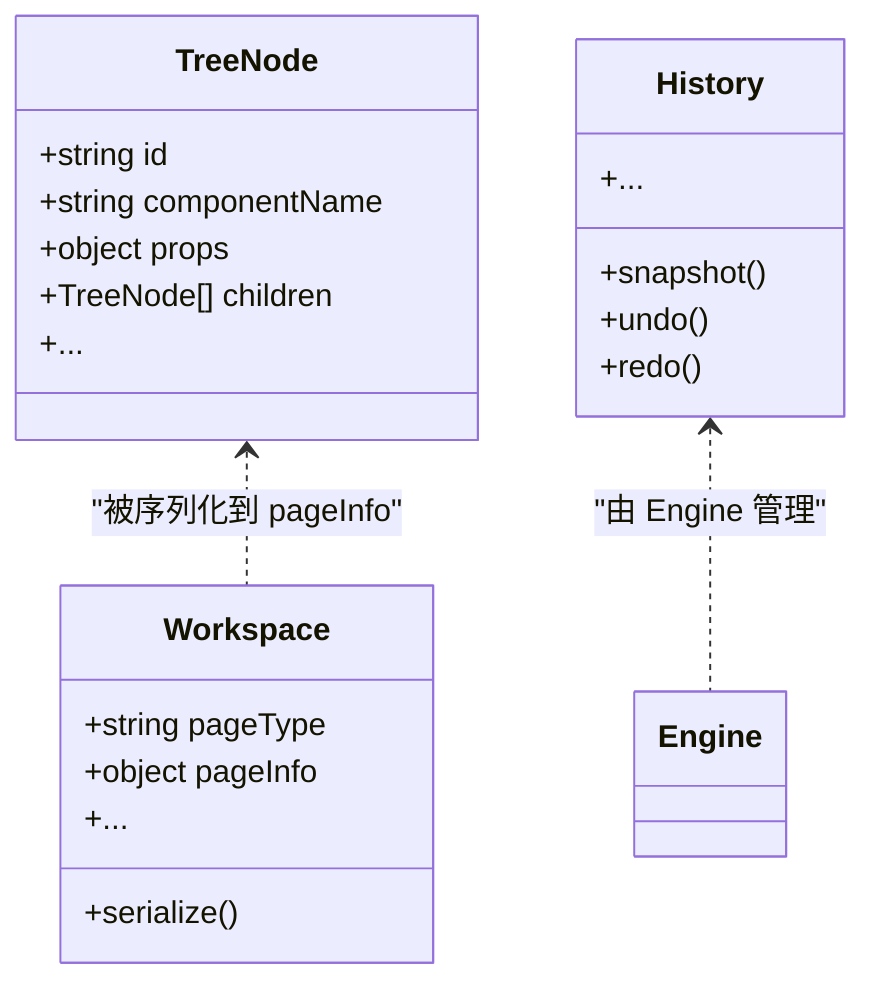
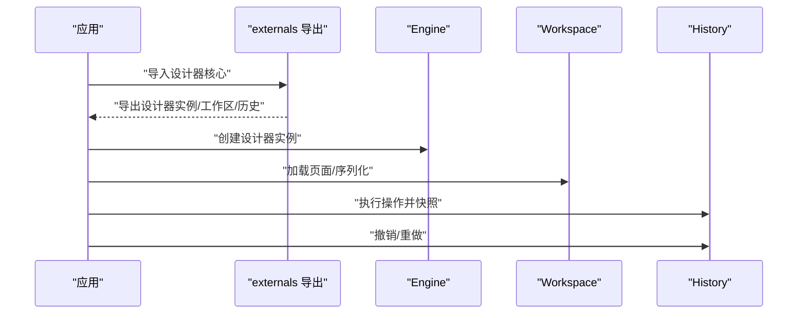
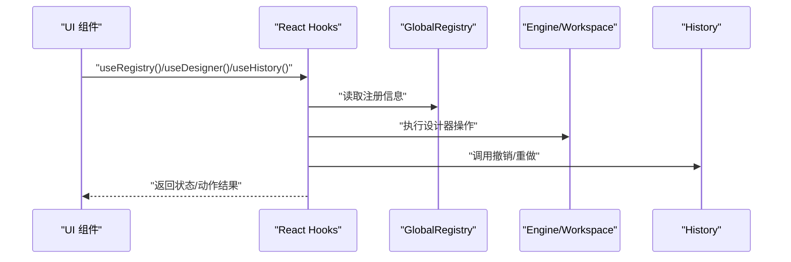
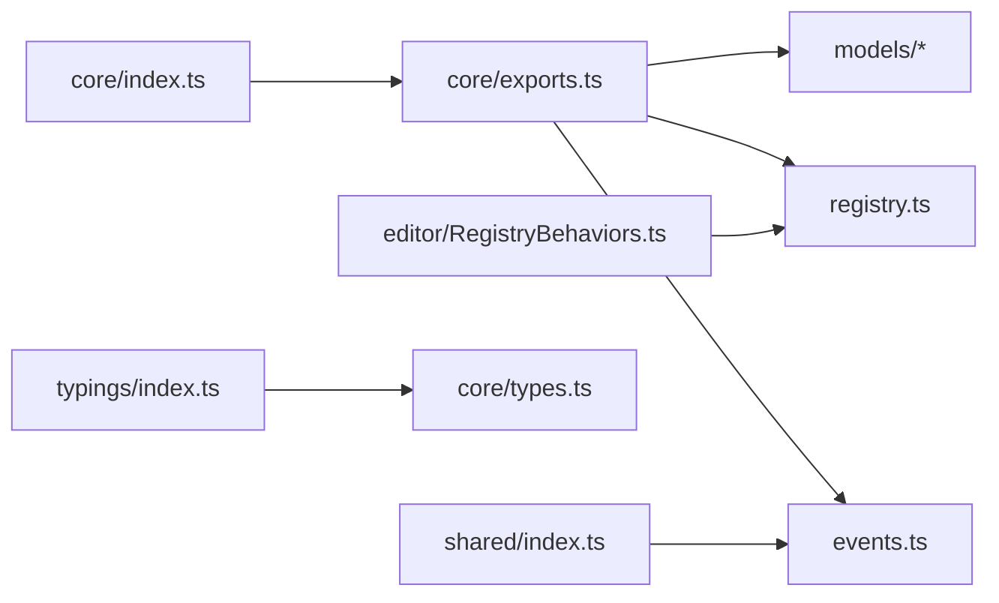

# 核心 API

<cite>
**本文引用的文件**
- [packages/core/src/index.ts](file://packages/core/src/index.ts)
- [packages/core/src/exports.ts](file://packages/core/src/exports.ts)
- [packages/core/src/models/index.ts](file://packages/core/src/models/index.ts)
- [packages/core/src/models/TreeNode.ts](file://packages/core/src/models/TreeNode.ts)
- [packages/core/src/models/Workspace.ts](file://packages/core/src/models/Workspace.ts)
- [packages/core/src/models/History.ts](file://packages/core/src/models/History.ts)
- [packages/core/src/registry.ts](file://packages/core/src/registry.ts)
- [packages/core/src/events.ts](file://packages/core/src/events.ts)
- [packages/core/src/types.ts](file://packages/core/src/types.ts)
- [packages/react/src/index.ts](file://packages/react/src/index.ts)
- [packages/react/src/hooks/useRegistry.ts](file://packages/react/src/hooks/useRegistry.ts)
- [packages/react/src/hooks/useDesigner.ts](file://packages/react/src/hooks/useDesigner.ts)
- [packages/react/src/hooks/useHistory.ts](file://packages/react/src/hooks/useHistory.ts)
- [packages/shared/src/index.ts](file://packages/shared/src/index.ts)
- [packages/shared/src/event.ts](file://packages/shared/src/event.ts)
- [packages/shared/src/subscribable.ts](file://packages/shared/src/subscribable.ts)
- [packages/shared/src/types.ts](file://packages/shared/src/types.ts)
- [packages/typings/index.ts](file://packages/typings/index.ts)
- [editor/src/RegistryBehaviors.ts](file://editor/src/RegistryBehaviors.ts)
</cite>

## 目录
1. [引言](#引言)
2. [项目结构](#项目结构)
3. [核心组件](#核心组件)
4. [架构总览](#架构总览)
5. [详细组件分析](#详细组件分析)
6. [依赖分析](#依赖分析)
7. [性能考虑](#性能考虑)
8. [故障排查指南](#故障排查指南)
9. [结论](#结论)
10. [附录](#附录)

## 引言
本文件面向 Slides Engine 的“设计器核心 API”，聚焦以下主题：
- 设计器核心 API：组件注册接口、行为注册系统、事件系统与类型定义
- externals 导出的核心功能：设计器实例创建、工作区管理、操作历史与撤销/重做
- registry 系统：组件注册、行为注册、资源注册与 Setter 扩展机制
- models 数据模型：TreeNode、Schema、PageInfo 等核心数据结构
- TypeScript 接口定义与使用示例：参数类型、返回值、错误处理

目标是帮助开发者快速理解并正确使用 Slides Engine 的核心能力，覆盖从“如何注册一个组件”到“如何管理历史与撤销”的完整流程。

## 项目结构
Slides Engine 的核心 API 主要由以下模块构成：
- 核心导出层：通过 exports 统一导出 externals、registry、models、events、types
- 模型层：Engine、Workspace、TreeNode、History 等核心数据结构与行为
- 注册与行为系统：GlobalRegistry、createBehavior、Setter 扩展
- 事件系统：基于订阅/发布模式的事件总线
- React 集成：hooks 与容器组件，桥接设计器与 UI 层
- 类型与共享工具：统一的类型定义与通用工具

图表来源
- [packages/core/src/exports.ts:1-5](file://packages/core/src/exports.ts#L1-L5)
- [packages/core/src/models/index.ts:1-14](file://packages/core/src/models/index.ts#L1-L14)
- [packages/core/src/registry.ts](file://packages/core/src/registry.ts)
- [packages/core/src/events.ts](file://packages/core/src/events.ts)
- [packages/shared/src/subscribable.ts](file://packages/shared/src/subscribable.ts)
- [packages/react/src/hooks/useRegistry.ts](file://packages/react/src/hooks/useRegistry.ts)
- [packages/react/src/hooks/useDesigner.ts](file://packages/react/src/hooks/useDesigner.ts)
- [packages/react/src/hooks/useHistory.ts](file://packages/react/src/hooks/useHistory.ts)
- [packages/core/src/types.ts](file://packages/core/src/types.ts)
- [packages/shared/src/types.ts](file://packages/shared/src/types.ts)
- [packages/typings/index.ts:1-1](file://packages/typings/index.ts#L1-L1)

章节来源
- [packages/core/src/exports.ts:1-5](file://packages/core/src/exports.ts#L1-L5)
- [packages/core/src/models/index.ts:1-14](file://packages/core/src/models/index.ts#L1-L14)

## 核心组件
本节概述设计器核心 API 的关键组成与职责：
- externals：对外统一导出，包含设计器实例、工作区、历史与撤销等能力
- registry：全局注册中心，负责行为、组件、Setter 的注册与扩展
- models：核心数据模型，承载树结构、工作区、历史等状态
- events：事件系统，提供订阅/发布机制用于解耦交互
- types：类型定义，确保跨包契约一致

章节来源
- [packages/core/src/exports.ts:1-5](file://packages/core/src/exports.ts#L1-L5)
- [packages/core/src/registry.ts](file://packages/core/src/registry.ts)
- [packages/core/src/models/index.ts:1-14](file://packages/core/src/models/index.ts#L1-L14)
- [packages/core/src/events.ts](file://packages/core/src/events.ts)
- [packages/core/src/types.ts](file://packages/core/src/types.ts)

## 架构总览
Slides Engine 的设计器核心采用“模型驱动 + 注册中心 + 事件总线”的架构：
- 模型层：Engine、Workspace、TreeNode、History 等作为状态载体
- 注册层：GlobalRegistry 提供行为与 Setter 的集中注册入口
- 事件层：events.ts 与 shared/subscribable.ts 提供事件订阅/发布能力
- React 层：hooks 与容器组件将设计器能力暴露给 UI

图表来源
- [packages/core/src/exports.ts:1-5](file://packages/core/src/exports.ts#L1-L5)
- [packages/core/src/registry.ts](file://packages/core/src/registry.ts)
- [packages/core/src/models/index.ts:1-14](file://packages/core/src/models/index.ts#L1-L14)
- [packages/core/src/events.ts](file://packages/core/src/events.ts)
- [packages/react/src/hooks/useRegistry.ts](file://packages/react/src/hooks/useRegistry.ts)
- [packages/react/src/hooks/useDesigner.ts](file://packages/react/src/hooks/useDesigner.ts)
- [packages/react/src/hooks/useHistory.ts](file://packages/react/src/hooks/useHistory.ts)

## 详细组件分析

### 组件注册接口与行为注册系统
- createBehavior：用于定义组件的行为（选择器、设计器属性、国际化文案等）
- GlobalRegistry：集中注册行为与 Setter，支持扩展与覆盖
- 编辑器侧示例：通过 RegistryBehaviors.ts 将多种行为一次性注册到 GlobalRegistry

图表来源
- [editor/src/RegistryBehaviors.ts:1-69](file://editor/src/RegistryBehaviors.ts#L1-L69)
- [packages/core/src/registry.ts](file://packages/core/src/registry.ts)

章节来源
- [editor/src/RegistryBehaviors.ts:1-69](file://editor/src/RegistryBehaviors.ts#L1-L69)
- [packages/core/src/registry.ts](file://packages/core/src/registry.ts)

### 事件系统
- events.ts：定义事件常量与事件总线
- shared/subscribable.ts：提供订阅/发布能力，支持多处监听与解绑
- 使用场景：节点选中、拖拽、键盘快捷键、视口变化等

图表来源
- [packages/core/src/events.ts](file://packages/core/src/events.ts)
- [packages/shared/src/subscribable.ts](file://packages/shared/src/subscribable.ts)

章节来源
- [packages/core/src/events.ts](file://packages/core/src/events.ts)
- [packages/shared/src/subscribable.ts](file://packages/shared/src/subscribable.ts)

### 类型定义与共享工具
- core/types.ts：核心类型定义（如 ITreeNode、IEngineProps 等）
- shared/types.ts：通用类型（如 Event、Scroller 等）
- typings/index.ts：任务相关类型入口
- 作用：确保跨包契约一致，避免类型漂移

图表来源
- [packages/core/src/types.ts](file://packages/core/src/types.ts)
- [packages/shared/src/types.ts](file://packages/shared/src/types.ts)
- [packages/typings/index.ts:1-1](file://packages/typings/index.ts#L1-L1)

章节来源
- [packages/core/src/types.ts](file://packages/core/src/types.ts)
- [packages/shared/src/types.ts](file://packages/shared/src/types.ts)
- [packages/typings/index.ts:1-1](file://packages/typings/index.ts#L1-L1)

### models 数据模型
- TreeNode：组件树节点，包含 componentName、props、children、id 等
- Workspace：工作区，承载页面信息与序列化能力
- History：操作历史，支持快照与撤销/重做
- 其他模型：Engine、Screen、Cursor、Operation、Viewport、Selection、MoveHelper、Keyboard、Shortcut 等

图表来源
- [packages/core/src/models/TreeNode.ts](file://packages/core/src/models/TreeNode.ts)
- [packages/core/src/models/Workspace.ts](file://packages/core/src/models/Workspace.ts)
- [packages/core/src/models/History.ts](file://packages/core/src/models/History.ts)

章节来源
- [packages/core/src/models/TreeNode.ts](file://packages/core/src/models/TreeNode.ts)
- [packages/core/src/models/Workspace.ts](file://packages/core/src/models/Workspace.ts)
- [packages/core/src/models/History.ts](file://packages/core/src/models/History.ts)

### externals 导出与设计器实例
- externals 统一导出设计器核心能力，便于外部直接使用
- 设计器实例创建：通过导出的工厂或构造函数创建 Engine/Workspace
- 工作区管理：加载/保存页面、序列化/反序列化
- 操作历史与撤销/重做：History 快照与回放

图表来源
- [packages/core/src/exports.ts:1-5](file://packages/core/src/exports.ts#L1-L5)
- [packages/core/src/models/index.ts:1-14](file://packages/core/src/models/index.ts#L1-L14)
- [packages/core/src/models/History.ts](file://packages/core/src/models/History.ts)

章节来源
- [packages/core/src/exports.ts:1-5](file://packages/core/src/exports.ts#L1-L5)
- [packages/core/src/models/index.ts:1-14](file://packages/core/src/models/index.ts#L1-L14)
- [packages/core/src/models/History.ts](file://packages/core/src/models/History.ts)

### React 集成与 Hooks
- useRegistry：获取注册中心能力，便于在 UI 中访问行为与 Setter
- useDesigner：获取设计器实例，进行画布操作
- useHistory：获取历史管理能力，实现撤销/重做

图表来源
- [packages/react/src/hooks/useRegistry.ts](file://packages/react/src/hooks/useRegistry.ts)
- [packages/react/src/hooks/useDesigner.ts](file://packages/react/src/hooks/useDesigner.ts)
- [packages/react/src/hooks/useHistory.ts](file://packages/react/src/hooks/useHistory.ts)
- [packages/react/src/index.ts:1-11](file://packages/react/src/index.ts#L1-L11)

章节来源
- [packages/react/src/hooks/useRegistry.ts](file://packages/react/src/hooks/useRegistry.ts)
- [packages/react/src/hooks/useDesigner.ts](file://packages/react/src/hooks/useDesigner.ts)
- [packages/react/src/hooks/useHistory.ts](file://packages/react/src/hooks/useHistory.ts)
- [packages/react/src/index.ts:1-11](file://packages/react/src/index.ts#L1-L11)

## 依赖分析
- packages/core/src/index.ts：将 Designable.Core 挂载到 globalThis，便于浏览器环境直接使用
- packages/shared/src/index.ts：导出事件、坐标、UID、观察者等通用能力
- packages/typings/index.ts：任务相关类型入口
- editor/src/RegistryBehaviors.ts：集中注册行为，体现“行为集中注册”的设计思想

图表来源
- [packages/core/src/index.ts:1-16](file://packages/core/src/index.ts#L1-L16)
- [packages/core/src/exports.ts:1-5](file://packages/core/src/exports.ts#L1-L5)
- [packages/shared/src/index.ts:1-19](file://packages/shared/src/index.ts#L1-L19)
- [packages/typings/index.ts:1-1](file://packages/typings/index.ts#L1-L1)
- [editor/src/RegistryBehaviors.ts:1-69](file://editor/src/RegistryBehaviors.ts#L1-L69)

章节来源
- [packages/core/src/index.ts:1-16](file://packages/core/src/index.ts#L1-L16)
- [packages/shared/src/index.ts:1-19](file://packages/shared/src/index.ts#L1-L19)
- [packages/typings/index.ts:1-1](file://packages/typings/index.ts#L1-L1)
- [editor/src/RegistryBehaviors.ts:1-69](file://editor/src/RegistryBehaviors.ts#L1-L69)

## 性能考虑
- 树状态采用响应式库，高频、深层嵌套、局部字段变更场景下减少无效渲染
- 撤销/重做基于 History 快照，避免 Redux 时间旅行带来的额外开销
- 建议：在扩展新物料时尽量复用现有行为与 Setter，减少重复计算与渲染

## 故障排查指南
- 行为未生效：检查是否已通过 GlobalRegistry.setDesignerBehaviors 注册
- Setter 无法显示：确认 Setter 是否正确注册且与组件 propsSchema 对应
- 撤销/重做异常：检查 History 快照时机与操作是否符合预期
- 类型报错：核对 core/types.ts 与 shared/types.ts 的类型一致性

章节来源
- [packages/core/src/registry.ts](file://packages/core/src/registry.ts)
- [packages/core/src/models/History.ts](file://packages/core/src/models/History.ts)
- [packages/core/src/types.ts](file://packages/core/src/types.ts)
- [packages/shared/src/types.ts](file://packages/shared/src/types.ts)

## 结论
Slides Engine 的设计器核心 API 以“模型 + 注册 + 事件 + 类型”为核心，提供了高内聚、低耦合的设计器能力。通过 GlobalRegistry 与 createBehavior，开发者可以快速扩展组件与行为；通过 History 与事件系统，实现了可靠的撤销/重做与交互解耦。配合 React Hooks，可在 UI 层高效集成这些能力。

## 附录
- 外部挂载：core/index.ts 将 Designable.Core 挂载至 globalThis，便于浏览器直接使用
- 类型入口：core/types.ts 与 shared/types.ts 提供统一类型定义
- 任务类型：typings/index.ts 作为任务相关类型的入口

章节来源
- [packages/core/src/index.ts:1-16](file://packages/core/src/index.ts#L1-L16)
- [packages/core/src/types.ts](file://packages/core/src/types.ts)
- [packages/shared/src/types.ts](file://packages/shared/src/types.ts)
- [packages/typings/index.ts:1-1](file://packages/typings/index.ts#L1-L1)