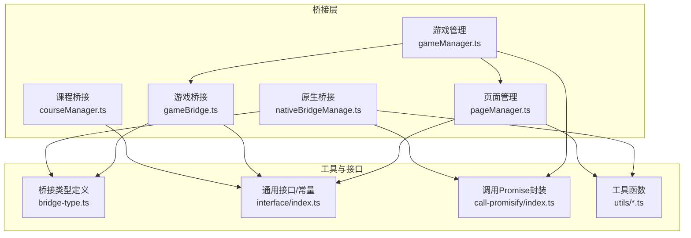
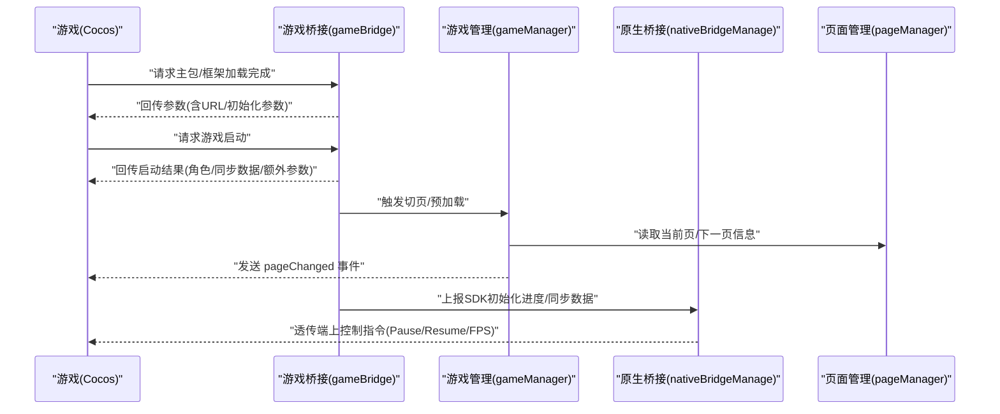
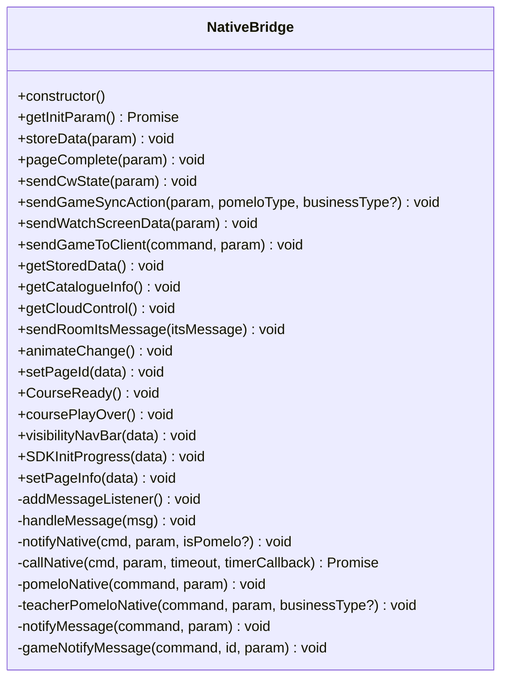
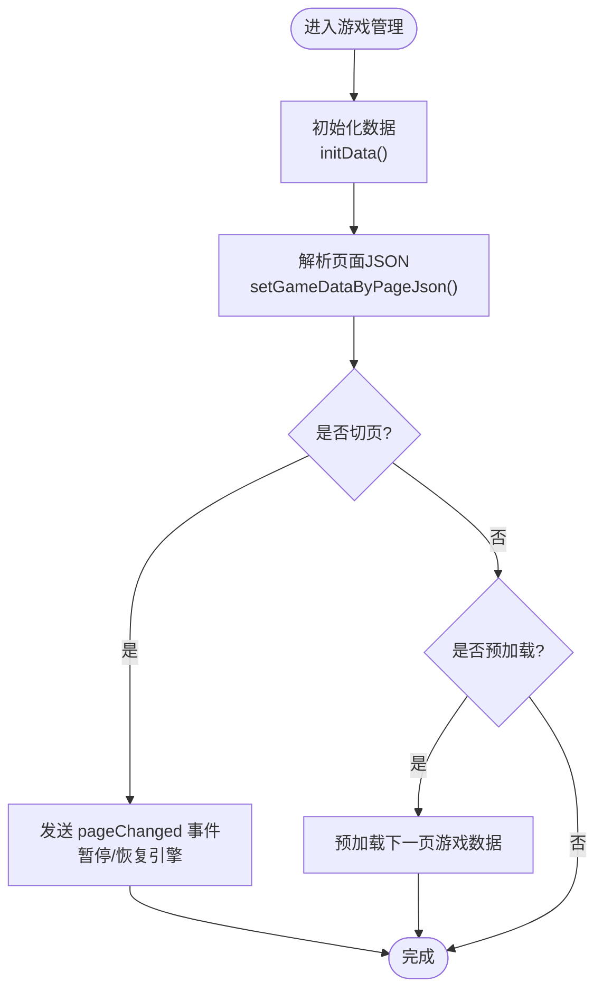
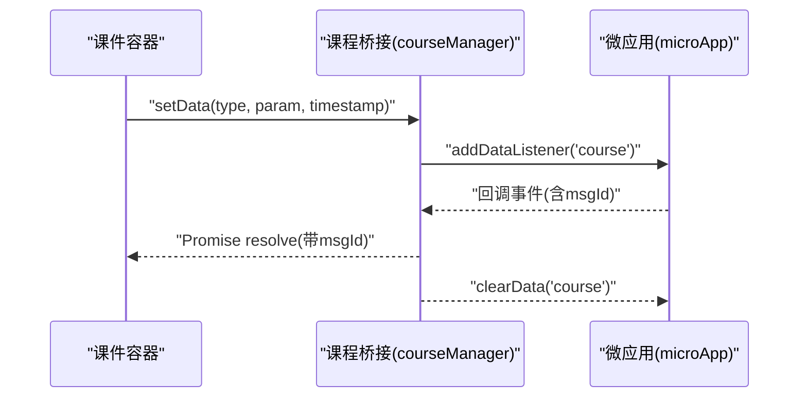
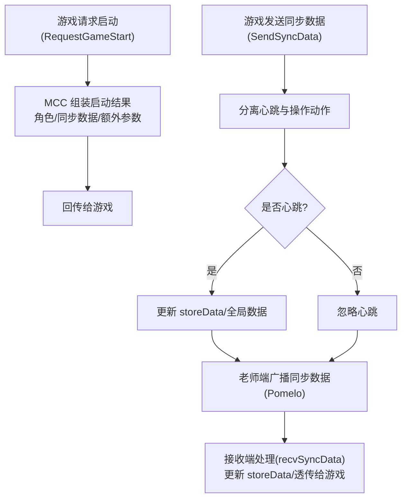
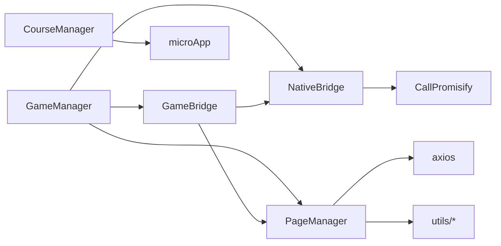

# 桥接 API

<cite>
**本文引用的文件**
- [nativeBridgeManage.ts](file://bridge/mcc-player/src/components/native-bridge/nativeBridgeManage.ts)
- [bridge-type.ts](file://bridge/mcc-player/src/components/native-bridge/bridge-type.ts)
- [gameBridge.ts](file://bridge/mcc-player/src/components/game-manage/gameBridge.ts)
- [gameManager.ts](file://bridge/mcc-player/src/components/game-manage/gameManager.ts)
- [courseManager.ts](file://bridge/mcc-player/src/components/course-bridge/courseManager.ts)
- [type.ts](file://bridge/mcc-player/src/components/course-bridge/type.ts)
- [pageManager.ts](file://bridge/mcc-player/src/components/page/pageManager.ts)
- [type.ts](file://bridge/mcc-player/src/components/page/type.ts)
- [const.ts](file://bridge/mcc-player/src/components/page/const.ts)
- [index.ts](file://bridge/mcc-player/src/interface/index.ts)
- [call-promisify/index.ts](file://bridge/mcc-player/src/libs/call-promisify/index.ts)
- [protocol.ts](file://bridge/mcc-player/src/utils/protocol.ts)
- [utils.ts](file://bridge/mcc-player/src/utils/utils.ts)
</cite>

## 目录
1. [简介](#简介)
2. [项目结构](#项目结构)
3. [核心组件](#核心组件)
4. [架构总览](#架构总览)
5. [详细组件分析](#详细组件分析)
6. [依赖关系分析](#依赖关系分析)
7. [性能考量](#性能考量)
8. [故障排查指南](#故障排查指南)
9. [结论](#结论)
10. [附录](#附录)

## 简介
本文件为 Slides Engine 桥接系统的详细 API 参考文档，聚焦于三类桥接能力：
- 原生桥接 API：nativeBridgeManage 的接口方法、消息传递协议与状态同步机制
- 游戏管理 API：GameManager 的接口规范、游戏启动、暂停与销毁流程
- 课程桥接 API：courseManager 的课程管理接口、页面切换与数据传输方法
并补充 Cocos 游戏桥接通信协议、桥接配置项、回调与错误处理机制，以及跨应用通信最佳实践与性能优化建议。

## 项目结构
桥接系统主要位于 bridge/mcc-player 模块，围绕“页面管理”“课程桥接”“原生桥接”“游戏桥接/管理”“工具库”“通用接口与常量”展开。关键文件如下：
- 原生桥接：nativeBridgeManage.ts、bridge-type.ts
- 游戏桥接/管理：gameBridge.ts、gameManager.ts
- 课程桥接：courseManager.ts、type.ts
- 页面管理：pageManager.ts、type.ts、const.ts
- 通用接口与常量：interface/index.ts、utils/protocol.ts、utils/utils.ts
- 异步调用封装：libs/call-promisify/index.ts

图表来源
- [nativeBridgeManage.ts:1-395](file://bridge/mcc-player/src/components/native-bridge/nativeBridgeManage.ts#L1-L395)
- [bridge-type.ts:1-73](file://bridge/mcc-player/src/components/native-bridge/bridge-type.ts#L1-L73)
- [gameBridge.ts:1-388](file://bridge/mcc-player/src/components/game-manage/gameBridge.ts#L1-L388)
- [gameManager.ts:1-368](file://bridge/mcc-player/src/components/game-manage/gameManager.ts#L1-L368)
- [courseManager.ts:1-117](file://bridge/mcc-player/src/components/course-bridge/courseManager.ts#L1-L117)
- [pageManager.ts:1-498](file://bridge/mcc-player/src/components/page/pageManager.ts#L1-L498)
- [call-promisify/index.ts:1-80](file://bridge/mcc-player/src/libs/call-promisify/index.ts#L1-L80)
- [interface/index.ts:1-71](file://bridge/mcc-player/src/interface/index.ts#L1-L71)
- [utils.ts:1-143](file://bridge/mcc-player/src/utils/utils.ts#L1-L143)

章节来源
- [nativeBridgeManage.ts:1-395](file://bridge/mcc-player/src/components/native-bridge/nativeBridgeManage.ts#L1-L395)
- [bridge-type.ts:1-73](file://bridge/mcc-player/src/components/native-bridge/bridge-type.ts#L1-L73)
- [gameBridge.ts:1-388](file://bridge/mcc-player/src/components/game-manage/gameBridge.ts#L1-L388)
- [gameManager.ts:1-368](file://bridge/mcc-player/src/components/game-manage/gameManager.ts#L1-L368)
- [courseManager.ts:1-117](file://bridge/mcc-player/src/components/course-bridge/courseManager.ts#L1-L117)
- [pageManager.ts:1-498](file://bridge/mcc-player/src/components/page/pageManager.ts#L1-L498)
- [call-promisify/index.ts:1-80](file://bridge/mcc-player/src/libs/call-promisify/index.ts#L1-L80)
- [interface/index.ts:1-71](file://bridge/mcc-player/src/interface/index.ts#L1-L71)
- [utils.ts:1-143](file://bridge/mcc-player/src/utils/utils.ts#L1-L143)

## 核心组件
- 原生桥接（nativeBridgeManage）
  - 提供与端侧（App/Web）双向通信能力，支持消息监听、Promise 化调用、Pomelo 透传、事件分发与状态上报
  - 关键职责：初始化参数获取、课件/游戏状态上报、页面切换、SDK 进度上报、数据存储与拉取、Pomelo 消息转发
- 游戏桥接（gameBridge）
  - 作为游戏与 MCC 的中转层，负责游戏生命周期事件、同步数据处理、互动状态管理、端到游戏消息透传
  - 关键职责：主包/框架加载完成通知、游戏启动参数回传、同步数据广播与接收、互动授权/取消授权、端上控制指令透传
- 游戏管理（gameManager）
  - 负责游戏资源路径解析、游戏页数据构建、切页与预加载、与页面管理协同、上报埋点与状态同步
  - 关键职责：游戏页数据装配、URL 参数构造、切页时暂停/恢复引擎、上报 SDK 进度、获取看屏数据
- 课程桥接（courseManager）
  - 与课件容器通信，实现页面切换、状态恢复、尺寸调整、消息中转与 UID 设置
  - 关键职责：设置课件页 ID、恢复课件状态、页面可用性标记、尺寸变更、消息接收与 UID 设置
- 页面管理（pageManager）
  - 负责目录与页面 JSON 的拉取与缓存、本地/远程资源选择、全局数据注入、埋点上报
  - 关键职责：目录数据组装、页面 JSON 拉取、本地/远程资源回退策略、全局数据映射、埋点参数构造

章节来源
- [nativeBridgeManage.ts:26-395](file://bridge/mcc-player/src/components/native-bridge/nativeBridgeManage.ts#L26-L395)
- [gameBridge.ts:22-388](file://bridge/mcc-player/src/components/game-manage/gameBridge.ts#L22-L388)
- [gameManager.ts:65-368](file://bridge/mcc-player/src/components/game-manage/gameManager.ts#L65-L368)
- [courseManager.ts:13-117](file://bridge/mcc-player/src/components/course-bridge/courseManager.ts#L13-L117)
- [pageManager.ts:17-498](file://bridge/mcc-player/src/components/page/pageManager.ts#L17-L498)

## 架构总览
桥接系统采用“事件驱动 + Promise 化调用”的通信模式，原生桥接负责消息路由与协议转换，游戏桥接负责游戏生命周期与同步数据处理，课程桥接负责课件容器交互，页面管理负责资源与目录管理。

图表来源
- [gameBridge.ts:59-110](file://bridge/mcc-player/src/components/game-manage/gameBridge.ts#L59-L110)
- [gameManager.ts:199-260](file://bridge/mcc-player/src/components/game-manage/gameManager.ts#L199-L260)
- [nativeBridgeManage.ts:144-205](file://bridge/mcc-player/src/components/native-bridge/nativeBridgeManage.ts#L144-L205)
- [pageManager.ts:17-498](file://bridge/mcc-player/src/components/page/pageManager.ts#L17-L498)

## 详细组件分析

### 原生桥接 API（nativeBridgeManage）
- 消息监听与路由
  - 监听 Web/App 两种来源的消息，统一解析为事件并分发
  - 支持 onEvent 与 pomeloMessage 两类消息类型
- Promise 化调用
  - callNative 发起调用并等待响应，内置超时与回调
  - callPromisify 统一封装 Promise 记录、解析与拒绝
- Pomelo 透传
  - sendGameSyncAction 支持普通同步与教师端看屏透传
  - sendRoomItsMessage、animateChange、setPageId 等通过 pomelo 发送
- 事件分发
  - notifyMessage 分发通用事件
  - gameNotifyMessage 透传端上给游戏的消息
- 状态上报与控制
  - SDKInitProgress 上报 SDK 加载进度，避免重复上报
  - CourseReady、coursePlayOver、visibilityNavBar、pageComplete 等控制与状态上报
  - sendWatchScreenData 获取看屏数据，供端上查看学生游戏

图表来源
- [nativeBridgeManage.ts:26-395](file://bridge/mcc-player/src/components/native-bridge/nativeBridgeManage.ts#L26-L395)

章节来源
- [nativeBridgeManage.ts:50-90](file://bridge/mcc-player/src/components/native-bridge/nativeBridgeManage.ts#L50-L90)
- [nativeBridgeManage.ts:156-175](file://bridge/mcc-player/src/components/native-bridge/nativeBridgeManage.ts#L156-L175)
- [nativeBridgeManage.ts:182-205](file://bridge/mcc-player/src/components/native-bridge/nativeBridgeManage.ts#L182-L205)
- [nativeBridgeManage.ts:254-262](file://bridge/mcc-player/src/components/native-bridge/nativeBridgeManage.ts#L254-L262)
- [nativeBridgeManage.ts:375-388](file://bridge/mcc-player/src/components/native-bridge/nativeBridgeManage.ts#L375-L388)

### 游戏管理 API（GameManager）
- 初始化与数据装配
  - initData 根据目录构建游戏页映射
  - setGameDataByPageJson 解析页面 JSON，填充模板/游戏包信息
- 切页与预加载
  - changeGamePage 发送 pageChanged 事件，暂停/恢复引擎，上报埋点
  - preloadGame 预加载下一页游戏数据
- 资源路径与 URL 参数
  - getPublicBundleUrl/getSubGameBundleUrl 解析公共模块与子游戏包地址
  - getGameUrlParams 组装框架/公共模块/CDN/初始化参数
- 看屏数据
  - getWatchScreenData 汇总当前页游戏数据与同步数据，供端上查看

图表来源
- [gameManager.ts:99-124](file://bridge/mcc-player/src/components/game-manage/gameManager.ts#L99-L124)
- [gameManager.ts:130-176](file://bridge/mcc-player/src/components/game-manage/gameManager.ts#L130-L176)
- [gameManager.ts:199-260](file://bridge/mcc-player/src/components/game-manage/gameManager.ts#L199-L260)
- [gameManager.ts:265-277](file://bridge/mcc-player/src/components/game-manage/gameManager.ts#L265-L277)
- [gameManager.ts:337-347](file://bridge/mcc-player/src/components/game-manage/gameManager.ts#L337-L347)

章节来源
- [gameManager.ts:99-176](file://bridge/mcc-player/src/components/game-manage/gameManager.ts#L99-L176)
- [gameManager.ts:199-260](file://bridge/mcc-player/src/components/game-manage/gameManager.ts#L199-L260)
- [gameManager.ts:265-277](file://bridge/mcc-player/src/components/game-manage/gameManager.ts#L265-L277)
- [gameManager.ts:337-365](file://bridge/mcc-player/src/components/game-manage/gameManager.ts#L337-L365)

### 课程桥接 API（courseManager）
- 事件监听与 Promise 化
  - addEventListener 监听课件容器消息，支持 msgId 回调
- 页面切换与状态恢复
  - setPageId、recoverCWState、SetPageUseAble、ResizeCW、transferMessageReceive、setUid
- 通用参数
  - getCommonParams 注入时间戳等公共参数

图表来源
- [courseManager.ts:20-47](file://bridge/mcc-player/src/components/course-bridge/courseManager.ts#L20-L47)
- [courseManager.ts:54-115](file://bridge/mcc-player/src/components/course-bridge/courseManager.ts#L54-L115)

章节来源
- [courseManager.ts:20-47](file://bridge/mcc-player/src/components/course-bridge/courseManager.ts#L20-L47)
- [courseManager.ts:54-115](file://bridge/mcc-player/src/components/course-bridge/courseManager.ts#L54-L115)

### Cocos 游戏桥接通信协议
- 事件类型与消息格式
  - 游戏向 MCC：RequestMainGameInitDone、RequestFrameGameInitDone、SendSyncData、RequestGameStart、RequestGameToClient、SetNextPageId、GetInitParam、EventTracking
  - 游戏向端侧：PauseOrResumeGame、SetGameFPS、OnInteractAction（由 MCC 处理后透传）
- 数据交换规范
  - 同步数据包含 actions 列表，心跳动作单独标识，其余为操作动作
  - 老师端广播同步数据，被授权学生在看屏时将同步数据透传至教师端
- 状态同步机制
  - 本地互动：使用 localStorage 保存/读取同步数据
  - 服务器同步：全局数据中携带 gameSyncData，立即上报并更新 storeData

图表来源
- [gameBridge.ts:89-110](file://bridge/mcc-player/src/components/game-manage/gameBridge.ts#L89-L110)
- [gameBridge.ts:116-163](file://bridge/mcc-player/src/components/game-manage/gameBridge.ts#L116-L163)
- [gameBridge.ts:169-189](file://bridge/mcc-player/src/components/game-manage/gameBridge.ts#L169-L189)
- [gameBridge.ts:194-212](file://bridge/mcc-player/src/components/game-manage/gameBridge.ts#L194-L212)
- [gameBridge.ts:229-234](file://bridge/mcc-player/src/components/game-manage/gameBridge.ts#L229-L234)

章节来源
- [gameBridge.ts:89-110](file://bridge/mcc-player/src/components/game-manage/gameBridge.ts#L89-L110)
- [gameBridge.ts:116-163](file://bridge/mcc-player/src/components/game-manage/gameBridge.ts#L116-L163)
- [gameBridge.ts:169-189](file://bridge/mcc-player/src/components/game-manage/gameBridge.ts#L169-L189)
- [gameBridge.ts:194-212](file://bridge/mcc-player/src/components/game-manage/gameBridge.ts#L194-L212)
- [gameBridge.ts:229-234](file://bridge/mcc-player/src/components/game-manage/gameBridge.ts#L229-L234)

## 依赖关系分析
- 组件耦合
  - gameManager 依赖 gameBridge、pageManager、nativeBridgeManage
  - gameBridge 依赖 nativeBridgeManage、pageManager、interface 常量
  - courseManager 依赖 microApp 与 call-promisify
  - pageManager 依赖 axios、utils、interface
- 外部依赖
  - microApp：跨应用通信与全局数据
  - axios：远程资源拉取
  - events：事件发射器（原生桥接、课程桥接）

图表来源
- [gameManager.ts:65-368](file://bridge/mcc-player/src/components/game-manage/gameManager.ts#L65-L368)
- [gameBridge.ts:22-388](file://bridge/mcc-player/src/components/game-manage/gameBridge.ts#L22-L388)
- [courseManager.ts:13-117](file://bridge/mcc-player/src/components/course-bridge/courseManager.ts#L13-L117)
- [pageManager.ts:17-498](file://bridge/mcc-player/src/components/page/pageManager.ts#L17-L498)
- [nativeBridgeManage.ts:26-395](file://bridge/mcc-player/src/components/native-bridge/nativeBridgeManage.ts#L26-L395)
- [call-promisify/index.ts:1-80](file://bridge/mcc-player/src/libs/call-promisify/index.ts#L1-L80)
- [utils.ts:1-143](file://bridge/mcc-player/src/utils/utils.ts#L1-L143)

章节来源
- [gameManager.ts:65-368](file://bridge/mcc-player/src/components/game-manage/gameManager.ts#L65-L368)
- [gameBridge.ts:22-388](file://bridge/mcc-player/src/components/game-manage/gameBridge.ts#L22-L388)
- [courseManager.ts:13-117](file://bridge/mcc-player/src/components/course-bridge/courseManager.ts#L13-L117)
- [pageManager.ts:17-498](file://bridge/mcc-player/src/components/page/pageManager.ts#L17-L498)
- [nativeBridgeManage.ts:26-395](file://bridge/mcc-player/src/components/native-bridge/nativeBridgeManage.ts#L26-L395)

## 性能考量
- 资源加载与回退
  - 本地优先，远程回退，多 CDN 主机轮询，失败自动切换
- 请求并发与缓存
  - 页面 JSON 按目录并发拉取，命中全局数据则直接返回
- 事件与消息
  - 使用 Promise 化调用与超时控制，避免阻塞
- 埋点与日志
  - 统一构造公共参数，批量上报频率可控

章节来源
- [pageManager.ts:403-415](file://bridge/mcc-player/src/components/page/pageManager.ts#L403-L415)
- [pageManager.ts:426-465](file://bridge/mcc-player/src/components/page/pageManager.ts#L426-L465)
- [call-promisify/index.ts:11-20](file://bridge/mcc-player/src/libs/call-promisify/index.ts#L11-L20)
- [pageManager.ts:490-496](file://bridge/mcc-player/src/components/page/pageManager.ts#L490-L496)

## 故障排查指南
- 超时与回调
  - callNative 超时触发 timerCallback，可通过日志定位
- 消息格式
  - handleMessage 自动尝试 JSON 解析，非 JSON 直接透传
- 本地/远程资源不可用
  - pageManager 在本地资源不可用时自动回退远程，多主机轮询
- 事件未到达
  - 确认 addDataListener/addMessageListener 是否正确注册
- 看屏数据为空
  - 确认 getWatchScreenData 中同步数据是否与当前页匹配

章节来源
- [call-promisify/index.ts:11-20](file://bridge/mcc-player/src/libs/call-promisify/index.ts#L11-L20)
- [nativeBridgeManage.ts:65-90](file://bridge/mcc-player/src/components/native-bridge/nativeBridgeManage.ts#L65-L90)
- [pageManager.ts:274-306](file://bridge/mcc-player/src/components/page/pageManager.ts#L274-L306)
- [courseManager.ts:20-47](file://bridge/mcc-player/src/components/course-bridge/courseManager.ts#L20-L47)
- [nativeBridgeManage.ts:234-234](file://bridge/mcc-player/src/components/native-bridge/nativeBridgeManage.ts#L234-L234)

## 结论
本桥接系统通过原生桥接、游戏桥接与管理、课程桥接与页面管理的协同，实现了课件与游戏在 MCC 中的稳定运行与高效通信。其消息协议清晰、状态同步可靠、错误处理完备，并具备良好的性能与可维护性。

## 附录

### 桥接配置选项与回调
- 初始化参数（InitParam）
  - 宽高、角色、直播/用户/设备信息、本地根目录、帧率、是否先导课、环境与课堂形态等
- SDK 初始化进度（INIT_STEP）
  - 起始、各阶段进度与完成态
- 课程/游戏事件常量
  - 课程事件与命令、游戏事件与命令、通用通知事件名

章节来源
- [interface/index.ts:17-36](file://bridge/mcc-player/src/interface/index.ts#L17-L36)
- [interface/index.ts:42-52](file://bridge/mcc-player/src/interface/index.ts#L42-L52)
- [type.ts:1-55](file://bridge/mcc-player/src/components/course-bridge/type.ts#L1-L55)
- [bridge-type.ts:56-73](file://bridge/mcc-player/src/components/native-bridge/bridge-type.ts#L56-L73)

### 跨应用通信最佳实践
- 使用 microApp.setData/addDataListener 实现异步回调
- 统一消息格式与事件名，避免歧义
- 对关键调用增加超时与重试策略
- 本地/远程资源切换时保持一致性与幂等性

章节来源
- [courseManager.ts:20-47](file://bridge/mcc-player/src/components/course-bridge/courseManager.ts#L20-L47)
- [nativeBridgeManage.ts:156-175](file://bridge/mcc-player/src/components/native-bridge/nativeBridgeManage.ts#L156-L175)
- [pageManager.ts:120-154](file://bridge/mcc-player/src/components/page/pageManager.ts#L120-L154)