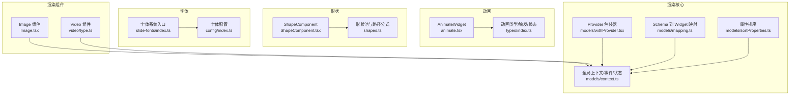
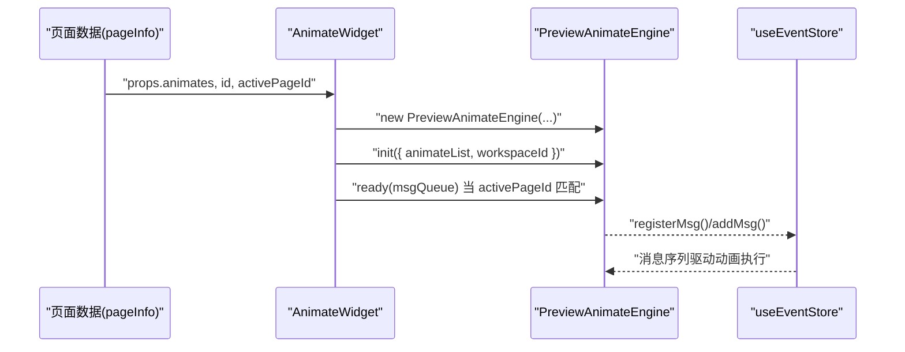
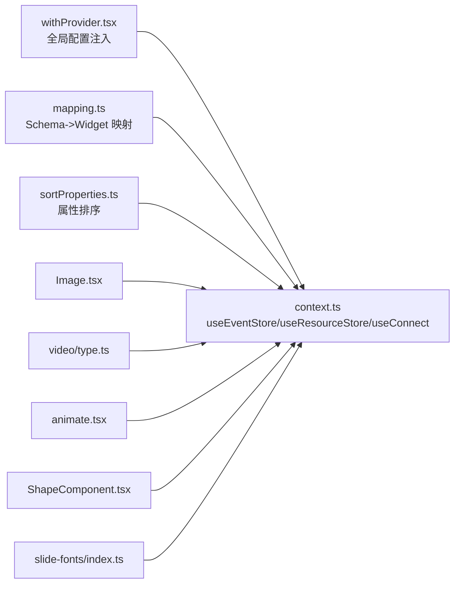

# 组件 API

<cite>
**本文引用的文件**
- [Image.tsx](file://common/render-components/src/image/Image.tsx)
- [type.ts（图像）](file://common/render-components/src/image/type.ts)
- [type.ts（视频）](file://common/render-components/src/video/type.ts)
- [index.ts（渲染组件入口）](file://common/render-components/src/index.ts)
- [animate.tsx](file://common/animate/src/componments/animate.tsx)
- [types/index.ts](file://common/animate/src/types/index.ts)
- [ShapeComponent.tsx](file://common/slide-shape/src/component/ShapeComponent.tsx)
- [shapes.ts](file://common/slide-shape/src/utils/shapes.ts)
- [index.ts（字体系统）](file://common/slide-fonts/index.ts)
- [config/index.ts](file://common/slide-fonts/config/index.ts)
- [context.ts](file://common/render-core/models/context.ts)
- [mapping.ts](file://common/render-core/models/mapping.ts)
- [sortProperties.ts](file://common/render-core/models/sortProperties.ts)
- [withProvider.tsx](file://common/render-core/models/withProvider.tsx)
</cite>

## 目录
1. [简介](#简介)
2. [项目结构](#项目结构)
3. [核心组件](#核心组件)
4. [架构总览](#架构总览)
5. [详细组件分析](#详细组件分析)
6. [依赖关系分析](#依赖关系分析)
7. [性能考量](#性能考量)
8. [故障排查指南](#故障排查指南)
9. [结论](#结论)
10. [附录](#附录)

## 简介
本文件为 Slides Engine 组件系统的“组件 API”参考文档，覆盖以下主题：
- 渲染组件 API：Image、Video、Text（富文本）、Shape（几何图形）等
- 动画组件 API：动画定义、播放控制与事件回调
- 形状组件 API：几何图形创建、配置与样式设置
- 字体系统 API：字体加载、配置与渲染选项
- 组件属性清单、默认值与可选参数
- 组件生命周期钩子、事件处理与状态管理

## 项目结构
Slides Engine 采用多包（monorepo）组织，核心渲染与编辑能力分布在多个公共包中：
- common/render-components：图像与视频渲染组件
- common/animate：动画引擎与组件
- common/slide-shape：形状组件与路径公式
- common/slide-fonts：字体加载与降级策略
- common/render-core：渲染上下文、事件与状态管理

图表来源
- [Image.tsx:1-48](file://common/render-components/src/image/Image.tsx#L1-L48)
- [type.ts（视频）:1-29](file://common/render-components/src/video/type.ts#L1-L29)
- [animate.tsx:1-36](file://common/animate/src/componments/animate.tsx#L1-L36)
- [types/index.ts:1-164](file://common/animate/src/types/index.ts#L1-L164)
- [ShapeComponent.tsx:1-114](file://common/slide-shape/src/component/ShapeComponent.tsx#L1-L114)
- [shapes.ts:1-1151](file://common/slide-shape/src/utils/shapes.ts#L1-L1151)
- [index.ts（字体系统）:1-71](file://common/slide-fonts/index.ts#L1-L71)
- [config/index.ts:1-31](file://common/slide-fonts/config/index.ts#L1-L31)
- [context.ts:1-226](file://common/render-core/models/context.ts#L1-L226)
- [mapping.ts:1-92](file://common/render-core/models/mapping.ts#L1-L92)
- [sortProperties.ts:1-29](file://common/render-core/models/sortProperties.ts#L1-L29)
- [withProvider.tsx:1-31](file://common/render-core/models/withProvider.tsx#L1-L31)

章节来源
- [index.ts（渲染组件入口）:1-3](file://common/render-components/src/index.ts#L1-L3)

## 核心组件
本节概述各组件的职责与关键 API。

- Image 组件
  - 负责多候选 URL 的容错加载、错误回退与事件回调
  - 支持本地回退地址与样式透传
- Video 组件
  - 提供资源数据、事件存储、全局配置等上下文属性
- AnimateWidget 组件
  - 将页面级动画列表接入预览动画引擎，支持自动/点击/并行/串行触发
- ShapeComponent 组件
  - 基于形状池与路径公式生成 SVG 路径，支持编辑态与预览态
- 字体系统
  - 提供字体家族选项生成、@font-face 样式注入与降级策略

章节来源
- [Image.tsx:1-48](file://common/render-components/src/image/Image.tsx#L1-L48)
- [type.ts（图像）:1-122](file://common/render-components/src/image/type.ts#L1-L122)
- [type.ts（视频）:1-29](file://common/render-components/src/video/type.ts#L1-L29)
- [animate.tsx:1-36](file://common/animate/src/componments/animate.tsx#L1-L36)
- [types/index.ts:1-164](file://common/animate/src/types/index.ts#L1-L164)
- [ShapeComponent.tsx:1-114](file://common/slide-shape/src/component/ShapeComponent.tsx#L1-L114)
- [shapes.ts:1-1151](file://common/slide-shape/src/utils/shapes.ts#L1-L1151)
- [index.ts（字体系统）:1-71](file://common/slide-fonts/index.ts#L1-L71)
- [config/index.ts:1-31](file://common/slide-fonts/config/index.ts#L1-L31)

## 架构总览
渲染核心通过 Provider 将全局配置、方法与上下文注入组件树；组件通过 useConnect/useReport/useEventStore 等 Hook 访问全局状态与事件序列；动画组件通过 AnimateWidget 将页面动画数据交由引擎处理；形状组件通过形状池与路径公式动态生成 SVG；字体系统负责注入 @font-face 并提供降级策略。

图表来源
- [animate.tsx:15-36](file://common/animate/src/componments/animate.tsx#L15-L36)
- [types/index.ts:141-164](file://common/animate/src/types/index.ts#L141-L164)
- [context.ts:158-225](file://common/render-core/models/context.ts#L158-L225)

## 详细组件分析

### Image 组件 API
- 组件名称：ImageComponent
- 文件位置：common/render-components/src/image/Image.tsx
- 外部依赖：资源存在性检测工具（远程资源容错）

属性接口（IImageProps）
- onLoad(url: string) -> 任意返回值：图片加载成功回调
- onError(event) -> 任意返回值：图片加载失败回调
- urls: string[]：候选图片地址数组（按顺序尝试）
- style?: React.CSSProperties：透传给 img 的样式
- localUrl?: string：本地回退地址（当远程均不可用时使用）

资源状态接口（IResourceStateProps）
- url?: string：当前使用的资源地址
- status: 'pending' | 'success' | 'error'：资源加载状态
- state: 'normal' | 'active'：组件当前状态
- error?: string：加载失败原因
- type: 'image' | 'video'：资源类型
- mode: 'edit' | 'preview'：编辑/预览模式
- id: string：组件 ID

LD 图像属性接口（ILdImageProps）
- mode: 'edit' | 'preview'
- visible: boolean
- width?: number | string
- height?: number | string
- className?: string
- style?: CSSProperties
- src: string
- alt?: string
- preview?: boolean
- fallback?: string
- placeholder?: boolean
- resourceStateChange(event?): void
- onError?(event?): void
- onLoad?(event?): void
- onLoadStart?(event?): void
- onUnmount?(event?): void
- onMount?(event?): void
- onUpdate?(event?): void
- onRender?(event?): void

默认值与可选参数
- 默认无默认值；建议显式提供 src、width、height、mode
- 当 urls 均不可用且提供 localUrl 时，使用 localUrl

生命周期与事件
- 加载开始：onLoadStart
- 加载成功：onLoad
- 加载失败：onError
- 卸载：onUnmount
- 首次挂载：onMount
- 更新：onUpdate
- 渲染完成：onRender

错误处理
- 当 urls 中所有地址均不可用时，触发 onError 回调

章节来源
- [Image.tsx:4-48](file://common/render-components/src/image/Image.tsx#L4-L48)
- [type.ts（图像）:33-122](file://common/render-components/src/image/type.ts#L33-L122)

### Video 组件 API
- 文件位置：common/render-components/src/video/type.ts
- 关键属性（IComponentProps）
  - useConnect?: 任意
  - useReport?: 任意
  - useEventStore?: 任意
  - md52Url?: 任意
  - src?: 任意
  - id: string：组件 ID
  - mode: 任意：编辑/预览模式
  - pageId: string：页面 ID
  - style?: 任意：样式
  - title?: string：标题
  - children?: 任意：子节点
  - setDefaultName?: 任意
  - globalProps: 任意
  - globalConfig: 任意
  - useResourceData: 任意
  - treeNodeProps: 任意
  - info: 任意
  - setLoading?: React.Dispatch<React.SetStateAction<boolean>>
  - activePageId?: string
  - sendLog?: 任意

说明
- Video 组件通过上下文属性与资源状态协同工作，支持加载状态反馈与日志上报

章节来源
- [type.ts（视频）:2-29](file://common/render-components/src/video/type.ts#L2-L29)

### AnimateWidget 组件 API
- 文件位置：common/animate/src/componments/animate.tsx
- 外部依赖：PreviewAnimateEngine、动画类型枚举、状态常量

属性接口（AnimateWidgetProps）
- useEventStore: 任意：事件存储 Hook
- sendChangeMessage?: 任意：变更消息发送
- pageInfo: 任意：页面信息（含 props.animates）
- activePageId: string：当前激活页面 ID
- sendLog?: 任意：日志发送

动画类型与触发
- AnimationType：Entrance（入场）、Exit（出场）、Emphasis（强调）
- AnimationDirection：通用、上下左右及对角、X/Y 轴
- AnimationTrigger：Auto（自动）、Click（点击）、Parallel（并行）、Serial（串行）
- AnimationStatus：Pending、Running、Paused、Stopped、Finished

动画对象（IAnimate）
- id: string
- sort?: number
- target: string
- type: AnimationType
- name: string
- trigger: AnimationTrigger
- triggerSource: string
- direction: AnimationDirection
- duration: number（秒）
- delay: number（秒）
- status?: AnimationStatus

生命周期与控制
- 初始化：根据 pageInfo.props.animates 调用引擎 init
- 就绪：activePageId 匹配时调用 ready(msgQueue)
- 控制：通过事件存储 registerMsg/register 控制动画执行

章节来源
- [animate.tsx:7-36](file://common/animate/src/componments/animate.tsx#L7-L36)
- [types/index.ts:6-164](file://common/animate/src/types/index.ts#L6-L164)

### ShapeComponent 组件 API
- 文件位置：common/slide-shape/src/component/ShapeComponent.tsx
- 外部依赖：形状池与路径公式（SHAPE_ARRAY、SHAPE_PATH_FORMULAS）

属性接口（ShapeComponentIF）
- useConnect: 任意
- useReport: 任意
- id: string
- pageId: string
- shapeKey: string：形状标识（来自形状池）
- style: 任意：组件样式
- mode: string：编辑/预览模式
- treeNodeProps: 任意：树节点属性
- 其他：setDefaultName、initStyleProps、styleMapProps

渲染流程
- 编辑态：绘制 SVG 路径，支持可编辑形状的关键点调整
- 预览态：输出 SVG 路径，应用初始样式与样式映射

样式与属性
- 样式字段：fill、borderStyle、borderColor、borderWidth、strokeDasharray 等
- viewBox 与路径：基于 SHAPE_PATH_FORMULAS 动态计算

章节来源
- [ShapeComponent.tsx:3-114](file://common/slide-shape/src/component/ShapeComponent.tsx#L3-L114)
- [shapes.ts:1-1151](file://common/slide-shape/src/utils/shapes.ts#L1-L1151)

### 字体系统 API
- 文件位置：common/slide-fonts/index.ts、common/slide-fonts/config/index.ts

字体格式枚举（FontFormatCollection）
- woff、woff2、ttf、svg

字体配置（IConfig）
- version: string
- fileName: string
- fontName: string
- fontFamily: string
- downgrade?: string[]
- fallback?: boolean

API
- createFontFamilyOptions(): 生成字体家族选项（label/value 对）
- fontBootstrap(config[], baseDir, fontFormatList[]): 注入 @font-face 样式至 head
- fontConfigList: 导出配置列表

章节来源
- [index.ts（字体系统）:5-71](file://common/slide-fonts/index.ts#L5-L71)
- [config/index.ts:1-31](file://common/slide-fonts/config/index.ts#L1-L31)

## 依赖关系分析
渲染核心提供统一的上下文与事件机制，组件通过 Hook 访问全局状态与事件队列；动画组件依赖事件存储进行消息注册与派发；形状组件依赖形状池与路径公式；字体系统依赖配置生成 @font-face 并注入样式。

图表来源
- [context.ts:1-226](file://common/render-core/models/context.ts#L1-L226)
- [mapping.ts:1-92](file://common/render-core/models/mapping.ts#L1-L92)
- [sortProperties.ts:1-29](file://common/render-core/models/sortProperties.ts#L1-L29)
- [withProvider.tsx:1-31](file://common/render-core/models/withProvider.tsx#L1-L31)
- [Image.tsx:1-48](file://common/render-components/src/image/Image.tsx#L1-L48)
- [type.ts（视频）:1-29](file://common/render-components/src/video/type.ts#L1-L29)
- [animate.tsx:1-36](file://common/animate/src/componments/animate.tsx#L1-L36)
- [ShapeComponent.tsx:1-114](file://common/slide-shape/src/component/ShapeComponent.tsx#L1-L114)
- [index.ts（字体系统）:1-71](file://common/slide-fonts/index.ts#L1-L71)

## 性能考量
- Image 组件
  - 多候选 URL 容错加载，建议合理设置超时与重试间隔，避免阻塞渲染
  - 使用本地回退地址减少失败率
- 动画组件
  - 仅在 activePageId 匹配时初始化与就绪，避免无关页面动画占用资源
  - 并行/串行触发策略应结合页面复杂度选择
- 形状组件
  - 可编辑形状的路径公式计算应在尺寸变化时缓存或节流
- 字体系统
  - @font-face 注入一次性完成，避免重复注入
  - 降级字体链路需考虑网络与兼容性

## 故障排查指南
- Image 组件
  - 现象：图片始终加载失败
  - 排查：检查 urls 是否为空、超时与重试参数是否合理、是否提供 localUrl
  - 参考：[Image.tsx:15-39](file://common/render-components/src/image/Image.tsx#L15-L39)
- 动画组件
  - 现象：动画不触发或状态异常
  - 排查：确认 pageInfo.props.animates 是否存在、activePageId 是否匹配、事件存储是否正确注册
  - 参考：[animate.tsx:21-34](file://common/animate/src/componments/animate.tsx#L21-L34)
- 形状组件
  - 现象：SVG 路径不正确或样式异常
  - 排查：确认 shapeKey 是否存在于形状池、width/height 是否合法、路径公式是否支持可编辑
  - 参考：[ShapeComponent.tsx:46-61](file://common/slide-shape/src/component/ShapeComponent.tsx#L46-L61)
- 字体系统
  - 现象：字体未生效或降级失败
  - 排查：确认 fontBootstrap 是否执行、baseDir 与 fileName 是否正确、降级链是否完整
  - 参考：[index.ts（字体系统）:60-68](file://common/slide-fonts/index.ts#L60-L68)

章节来源
- [Image.tsx:15-39](file://common/render-components/src/image/Image.tsx#L15-L39)
- [animate.tsx:21-34](file://common/animate/src/componments/animate.tsx#L21-L34)
- [ShapeComponent.tsx:46-61](file://common/slide-shape/src/component/ShapeComponent.tsx#L46-L61)
- [index.ts（字体系统）:60-68](file://common/slide-fonts/index.ts#L60-L68)

## 结论
本文件梳理了 Slides Engine 组件系统的渲染组件、动画组件、形状组件与字体系统的 API 与使用要点。通过统一的渲染核心上下文与事件机制，组件能够高效协作，实现复杂的页面渲染与交互体验。建议在实际使用中关注资源加载容错、动画触发策略与形状路径计算性能，并合理配置字体降级链路。

## 附录

### 组件属性与默认值速查
- Image 组件
  - 必填：src、urls、mode
  - 可选：style、localUrl、onLoad、onError
  - 默认：无默认值，建议显式提供
- Video 组件
  - 必填：id、pageId、mode
  - 可选：style、src、setLoading、activePageId、sendLog
- AnimateWidget 组件
  - 必填：pageInfo、useEventStore、activePageId
  - 可选：sendChangeMessage、sendLog
- ShapeComponent 组件
  - 必填：id、pageId、shapeKey、style、mode
  - 可选：treeNodeProps、setDefaultName、initStyleProps、styleMapProps
- 字体系统
  - 必填：config、baseDir、fontFormatList
  - 可选：通过配置项指定降级链

### 生命周期与事件处理
- Image 组件事件：onLoadStart → onLoad/onError → onRender（可选）
- Video 组件事件：加载状态与资源上报（通过上下文属性）
- AnimateWidget 事件：通过事件存储 registerMsg/register 控制动画执行
- ShapeComponent 生命周期：注册实例、编辑/预览渲染
- 字体系统：fontBootstrap 注入样式，createFontFamilyOptions 生成选项

章节来源
- [type.ts（图像）:93-122](file://common/render-components/src/image/type.ts#L93-L122)
- [type.ts（视频）:2-29](file://common/render-components/src/video/type.ts#L2-L29)
- [animate.tsx:15-36](file://common/animate/src/componments/animate.tsx#L15-L36)
- [ShapeComponent.tsx:34-44](file://common/slide-shape/src/component/ShapeComponent.tsx#L34-L44)
- [index.ts（字体系统）:21-71](file://common/slide-fonts/index.ts#L21-L71)