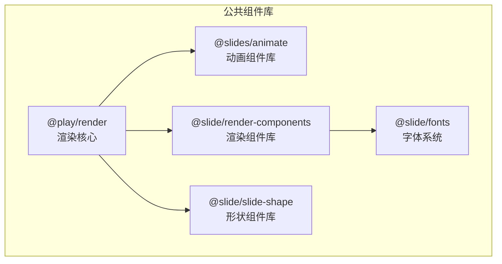
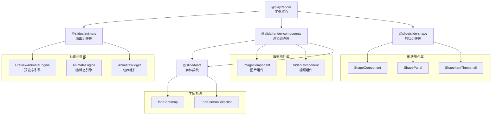
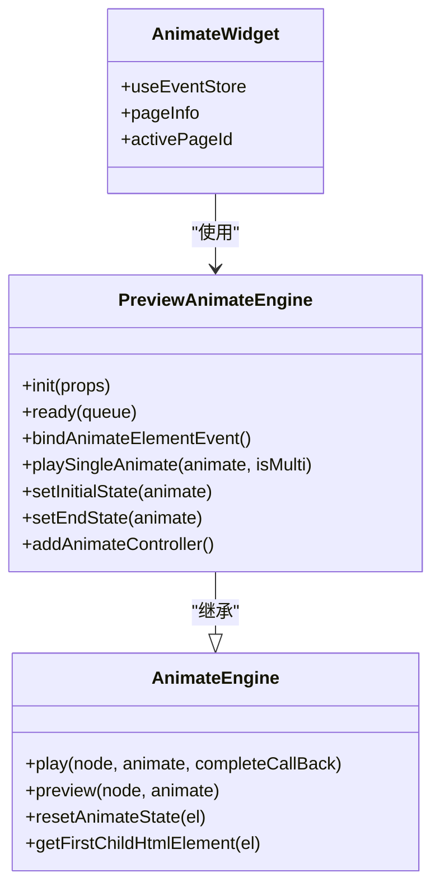
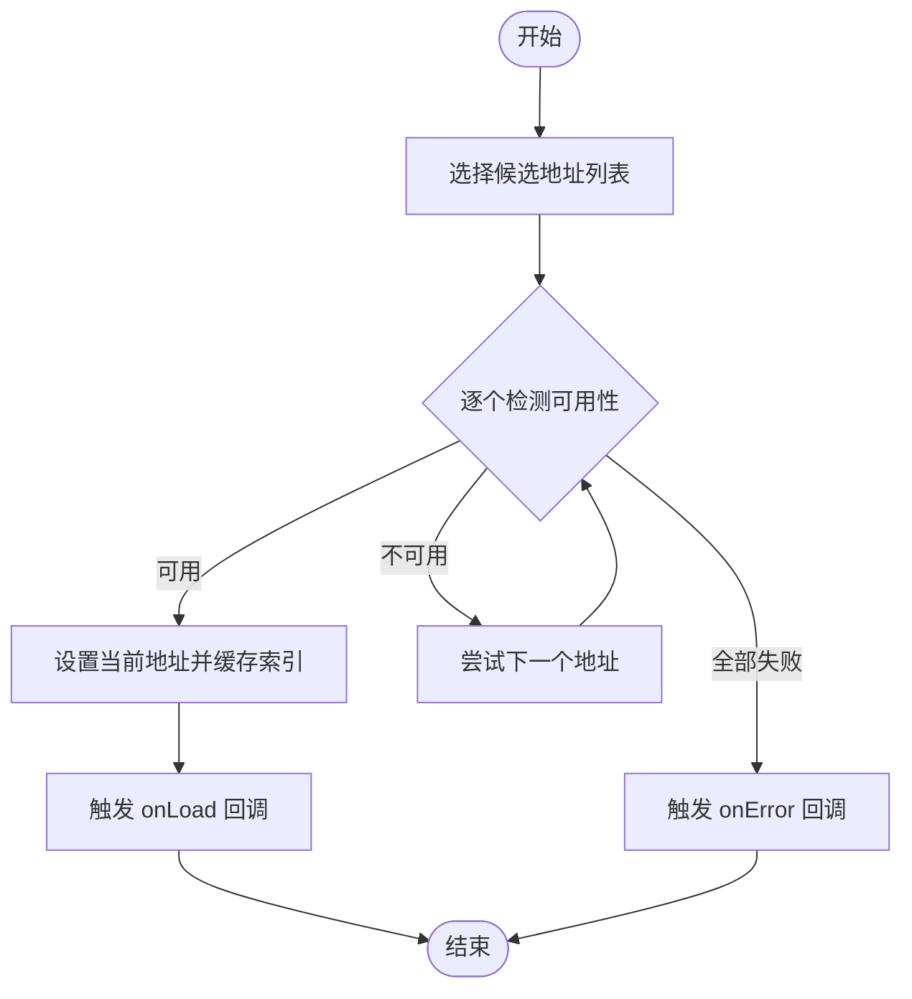
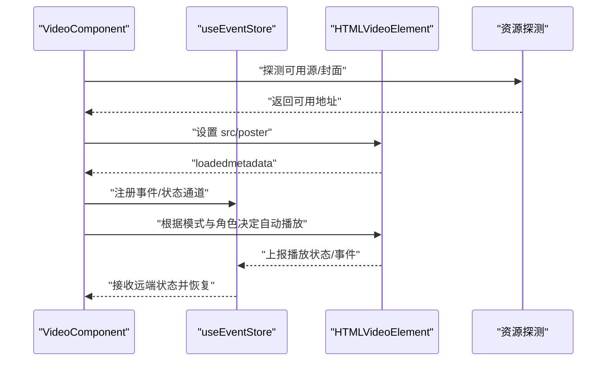
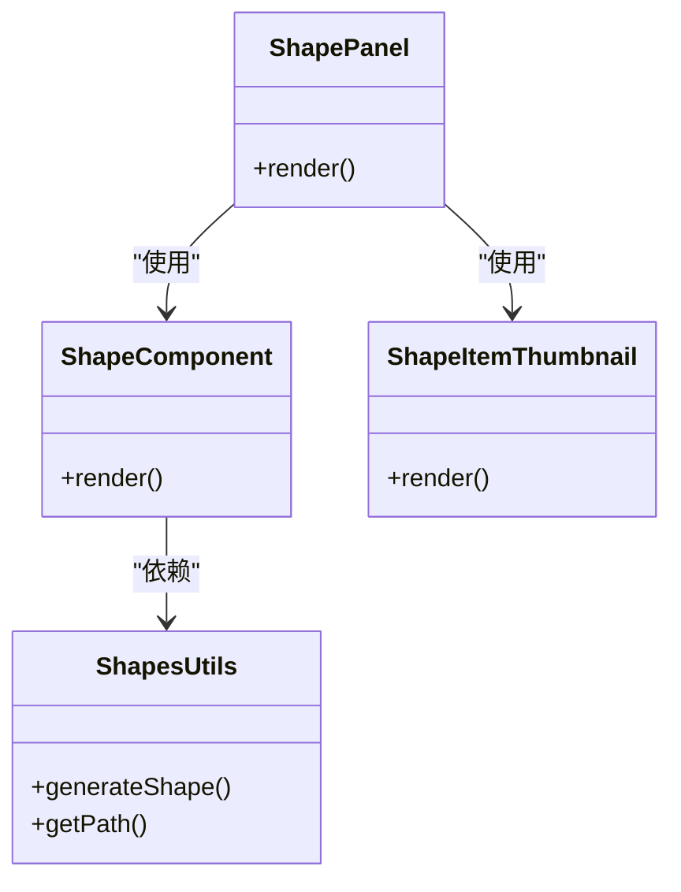
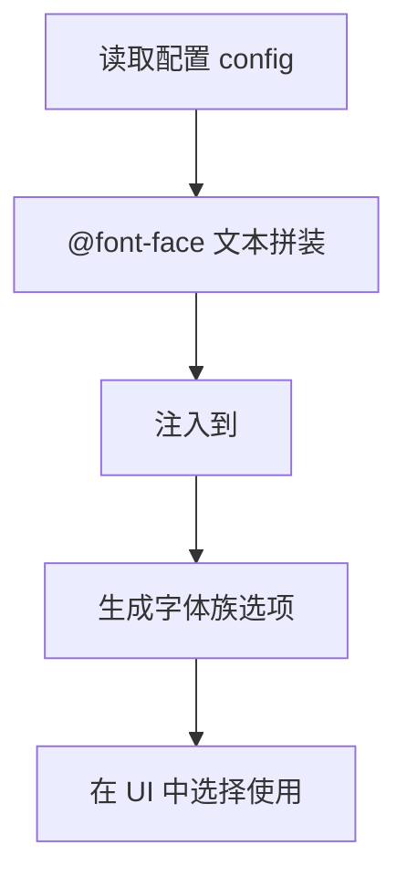
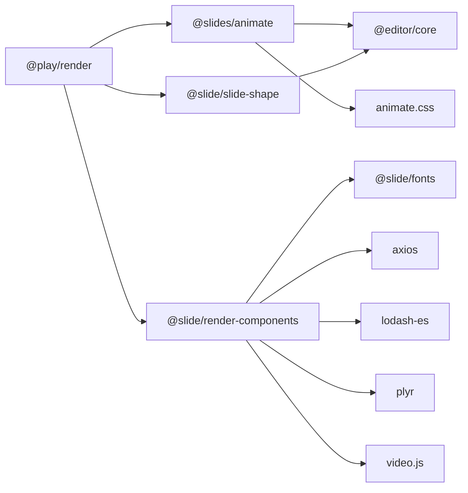

# 公共组件库

<cite>
**本文引用的文件**
- [common/animate/src/index.ts](file://common/animate/src/index.ts)
- [common/animate/src/engine/index.ts](file://common/animate/src/engine/index.ts)
- [common/animate/src/engine/edit.ts](file://common/animate/src/engine/edit.ts)
- [common/animate/src/engine/preview.ts](file://common/animate/src/engine/preview.ts)
- [common/animate/src/componments/animate.tsx](file://common/animate/src/componments/animate.tsx)
- [common/animate/src/componments/constant.ts](file://common/animate/src/componments/constant.ts)
- [common/animate/src/types/index.ts](file://common/animate/src/types/index.ts)
- [common/animate/src/utils/index.ts](file://common/animate/src/utils/index.ts)
- [common/render-components/src/index.ts](file://common/render-components/src/index.ts)
- [common/render-components/src/image/Image.tsx](file://common/render-components/src/image/Image.tsx)
- [common/render-components/src/video/index.tsx](file://common/render-components/src/video/index.tsx)
- [common/render-components/src/video/type.ts](file://common/render-components/src/video/type.ts)
- [common/render-components/src/video/const.ts](file://common/render-components/src/video/const.ts)
- [common/render-components/src/video/index.css](file://common/render-components/src/video/index.css)
- [common/render-components/src/utils/index.ts](file://common/render-components/src/utils/index.ts)
- [common/render-context/src/index.ts](file://common/render-context/src/index.ts)
- [common/render-core/index.tsx](file://common/render-core/index.tsx)
- [common/slide-shape/src/index.ts](file://common/slide-shape/src/index.ts)
- [common/slide-shape/src/component/ShapeComponent.tsx](file://common/slide-shape/src/component/ShapeComponent.tsx)
- [common/slide-shape/src/component/ShapePanel.tsx](file://common/slide-shape/src/component/ShapePanel.tsx)
- [common/slide-shape/src/component/ShapeItemThumbnail.tsx](file://common/slide-shape/src/component/ShapeItemThumbnail.tsx)
- [common/slide-shape/src/utils/shapes.ts](file://common/slide-shape/src/utils/shapes.ts)
- [common/slide-shape/src/utils/index.ts](file://common/slide-shape/src/utils/index.ts)
- [common/slide-fonts/index.ts](file://common/slide-fonts/index.ts)
- [common/slide-fonts/config/index.ts](file://common/slide-fonts/config/index.ts)
- [common/render-core/package.json](file://common/render-core/package.json)
- [common/animate/package.json](file://common/animate/package.json)
- [common/render-components/package.json](file://common/render-components/package.json)
- [common/slide-shape/package.json](file://common/slide-shape/package.json)
- [common/slide-fonts/package.json](file://common/slide-fonts/package.json)
</cite>

## 目录
1. [简介](#简介)
2. [项目结构](#项目结构)
3. [核心组件](#核心组件)
4. [架构总览](#架构总览)
5. [详细组件分析](#详细组件分析)
6. [依赖关系分析](#依赖关系分析)
7. [性能考量](#性能考量)
8. [故障排查指南](#故障排查指南)
9. [结论](#结论)
10. [附录](#附录)

## 简介
本文件面向 Slides Engine 公共组件库，系统化梳理并说明以下组件体系的设计理念与使用方式：
- 动画组件库：提供动画定义、播放控制与效果定制，支持编辑态与预览态双引擎。
- 渲染组件库：提供图片与视频等媒体组件，具备容错加载、信令同步与播放状态管理。
- 形状组件库：提供几何图形生成、样式定制与交互面板，便于在课件中快速构建图形元素。
- 字体系统：提供字体加载、@font-face 注入与降级策略，确保跨浏览器一致性。

同时给出最佳实践、性能优化建议、使用示例与扩展开发指南，帮助开发者高效集成与二次开发。

## 项目结构
公共组件库以多包形式组织，采用工作区（workspace）统一管理，核心模块如下：
- @slides/animate：动画引擎与组件封装，包含编辑态与预览态引擎、动画常量与类型定义。
- @slide/render-components：渲染组件集合，包含图片与视频组件及工具函数。
- @play/render：渲染核心，聚合各子组件并提供上下文与桥接能力。
- @slide/slide-shape：形状组件库，提供图形组件与工具函数。
- @slide/fonts：字体系统，负责字体加载与降级策略。

图表来源
- [common/render-core/package.json:12-18](file://common/render-core/package.json#L12-L18)
- [common/animate/package.json:12-15](file://common/animate/package.json#L12-L15)
- [common/render-components/package.json:13-18](file://common/render-components/package.json#L13-L18)
- [common/slide-shape/package.json:12-16](file://common/slide-shape/package.json#L12-L16)
- [common/slide-fonts/package.json:1-13](file://common/slide-fonts/package.json#L1-L13)

章节来源
- [common/render-core/package.json:1-33](file://common/render-core/package.json#L1-L33)
- [common/animate/package.json:1-18](file://common/animate/package.json#L1-L18)
- [common/render-components/package.json:1-23](file://common/render-components/package.json#L1-L23)
- [common/slide-shape/package.json:1-30](file://common/slide-shape/package.json#L1-L30)
- [common/slide-fonts/package.json:1-13](file://common/slide-fonts/package.json#L1-L13)

## 核心组件
- 动画组件库
  - 提供动画定义、播放控制与效果定制，支持编辑态与预览态双引擎，内置事件与状态管理。
  - 关键入口与导出见：[common/animate/src/index.ts:1-7](file://common/animate/src/index.ts#L1-L7)
  - 预览态引擎：[common/animate/src/engine/preview.ts:1-755](file://common/animate/src/engine/preview.ts#L1-L755)
  - 编辑态引擎：[common/animate/src/engine/edit.ts:1-120](file://common/animate/src/engine/edit.ts#L1-L120)
  - 动画组件封装：[common/animate/src/componments/animate.tsx:1-36](file://common/animate/src/componments/animate.tsx#L1-L36)
  - 类型与常量：[common/animate/src/types/index.ts](file://common/animate/src/types/index.ts)、[common/animate/src/componments/constant.ts](file://common/animate/src/componments/constant.ts)

- 渲染组件库
  - 图片组件：支持多候选地址探测、超时与重试、错误回退与加载回调。
    - 组件实现：[common/render-components/src/image/Image.tsx:1-48](file://common/render-components/src/image/Image.tsx#L1-L48)
  - 视频组件：基于 Video.js/plyr，支持多源切换、封面图容错、自动播放策略、信令同步与播放状态恢复。
    - 组件实现：[common/render-components/src/video/index.tsx:1-472](file://common/render-components/src/video/index.tsx#L1-L472)
    - 类型定义：[common/render-components/src/video/type.ts](file://common/render-components/src/video/type.ts)
    - 常量与事件：[common/render-components/src/video/const.ts](file://common/render-components/src/video/const.ts)
    - 样式：[common/render-components/src/video/index.css](file://common/render-components/src/video/index.css)
  - 导出入口：[common/render-components/src/index.ts:1-3](file://common/render-components/src/index.ts#L1-L3)

- 形状组件库
  - 提供图形组件、面板与缩略图，提供形状工具函数与索引入口。
    - 组件入口：[common/slide-shape/src/index.ts:1-2](file://common/slide-shape/src/index.ts#L1-L2)
    - 形状组件：[common/slide-shape/src/component/ShapeComponent.tsx](file://common/slide-shape/src/component/ShapeComponent.tsx)
    - 形状面板：[common/slide-shape/src/component/ShapePanel.tsx](file://common/slide-shape/src/component/ShapePanel.tsx)
    - 缩略图组件：[common/slide-shape/src/component/ShapeItemThumbnail.tsx](file://common/slide-shape/src/component/ShapeItemThumbnail.tsx)
    - 工具函数：[common/slide-shape/src/utils/shapes.ts](file://common/slide-shape/src/utils/shapes.ts)、[common/slide-shape/src/utils/index.ts](file://common/slide-shape/src/utils/index.ts)

- 字体系统
  - 提供字体格式枚举、@font-face 注入、降级策略与配置列表。
    - 实现：[common/slide-fonts/index.ts:1-71](file://common/slide-fonts/index.ts#L1-L71)
    - 配置：[common/slide-fonts/config/index.ts](file://common/slide-fonts/config/index.ts)

章节来源
- [common/animate/src/index.ts:1-7](file://common/animate/src/index.ts#L1-L7)
- [common/animate/src/engine/preview.ts:1-755](file://common/animate/src/engine/preview.ts#L1-L755)
- [common/animate/src/engine/edit.ts:1-120](file://common/animate/src/engine/edit.ts#L1-L120)
- [common/animate/src/componments/animate.tsx:1-36](file://common/animate/src/componments/animate.tsx#L1-L36)
- [common/render-components/src/index.ts:1-3](file://common/render-components/src/index.ts#L1-L3)
- [common/render-components/src/image/Image.tsx:1-48](file://common/render-components/src/image/Image.tsx#L1-L48)
- [common/render-components/src/video/index.tsx:1-472](file://common/render-components/src/video/index.tsx#L1-L472)
- [common/slide-shape/src/index.ts:1-2](file://common/slide-shape/src/index.ts#L1-L2)
- [common/slide-shape/src/component/ShapeComponent.tsx](file://common/slide-shape/src/component/ShapeComponent.tsx)
- [common/slide-shape/src/component/ShapePanel.tsx](file://common/slide-shape/src/component/ShapePanel.tsx)
- [common/slide-shape/src/component/ShapeItemThumbnail.tsx](file://common/slide-shape/src/component/ShapeItemThumbnail.tsx)
- [common/slide-fonts/index.ts:1-71](file://common/slide-fonts/index.ts#L1-L71)

## 架构总览
渲染核心通过工作区聚合各子组件，形成统一的渲染管线；动画组件库与渲染组件库分别承担“表现层”和“行为层”的职责，形状组件库与字体系统提供基础素材与样式支撑。

图表来源
- [common/render-core/package.json:12-18](file://common/render-core/package.json#L12-L18)
- [common/animate/src/engine/index.ts:1-2](file://common/animate/src/engine/index.ts#L1-L2)
- [common/animate/src/componments/animate.tsx:1-36](file://common/animate/src/componments/animate.tsx#L1-L36)
- [common/render-components/src/index.ts:1-3](file://common/render-components/src/index.ts#L1-L3)
- [common/slide-shape/src/index.ts:1-2](file://common/slide-shape/src/index.ts#L1-L2)
- [common/slide-fonts/index.ts:1-71](file://common/slide-fonts/index.ts#L1-L71)

## 详细组件分析

### 动画组件库
- 设计理念
  - 将动画定义与播放控制解耦，通过“类型 + 名称 + 方向 + 参数”描述动画，统一由引擎解析与执行。
  - 预览态与编辑态分离：预览态负责交互触发、串并联编排与状态持久；编辑态负责单次播放与样式注入。
- 关键流程
  - 初始化：按触发源分组，将自动播放动画置于末尾，建立目标元素与触发源映射。
  - 播放：根据触发类型串并联播放，支持延迟、节流与状态广播。
  - 结束：根据动画类型设置元素可见性与最终状态，推进下一个动画或等待下一次触发。
- 使用要点
  - 通过 AnimateWidget 将页面动画数据接入预览引擎，结合 useEventStore 的消息注册实现跨端信令。
  - 在编辑态使用 AnimateEngine.preview 或 play 方法进行演示播放。
- 扩展建议
  - 新增动画类型时，需在动画配置表中补充对应条目，并在引擎中完善样式拼装与状态处理。

图表来源
- [common/animate/src/engine/edit.ts:1-120](file://common/animate/src/engine/edit.ts#L1-L120)
- [common/animate/src/engine/preview.ts:1-755](file://common/animate/src/engine/preview.ts#L1-L755)
- [common/animate/src/componments/animate.tsx:1-36](file://common/animate/src/componments/animate.tsx#L1-L36)

章节来源
- [common/animate/src/engine/edit.ts:1-120](file://common/animate/src/engine/edit.ts#L1-L120)
- [common/animate/src/engine/preview.ts:1-755](file://common/animate/src/engine/preview.ts#L1-L755)
- [common/animate/src/componments/animate.tsx:1-36](file://common/animate/src/componments/animate.tsx#L1-L36)

### 渲染组件库

#### 图片组件
- 功能特性
  - 多候选地址探测：逐个检测可用资源，提升加载成功率。
  - 容错与回退：超时与重试策略，失败后回调 onError。
  - 加载回调：成功时回调 onLoad，传递当前有效地址。
- 使用示例路径
  - 组件定义：[common/render-components/src/image/Image.tsx:1-48](file://common/render-components/src/image/Image.tsx#L1-L48)

图表来源
- [common/render-components/src/image/Image.tsx:15-39](file://common/render-components/src/image/Image.tsx#L15-L39)

章节来源
- [common/render-components/src/image/Image.tsx:1-48](file://common/render-components/src/image/Image.tsx#L1-L48)

#### 视频组件
- 功能特性
  - 多源切换与封面容错：自动选择可用源与封面，失败时轮询重试。
  - 自动播放策略：根据角色与模式决定是否自动播放，先导课模式下可见性变化时自动播放/暂停。
  - 信令同步：通过 useEventStore 注册事件与状态通道，实现跨端播放状态同步与恢复。
  - 播放状态恢复：在 canPlay 后根据远端状态恢复播放、音量、静音与时间轴。
- 使用示例路径
  - 组件实现：[common/render-components/src/video/index.tsx:1-472](file://common/render-components/src/video/index.tsx#L1-L472)
  - 类型定义：[common/render-components/src/video/type.ts](file://common/render-components/src/video/type.ts)
  - 常量与事件：[common/render-components/src/video/const.ts](file://common/render-components/src/video/const.ts)
  - 样式：[common/render-components/src/video/index.css](file://common/render-components/src/video/index.css)

图表来源
- [common/render-components/src/video/index.tsx:340-375](file://common/render-components/src/video/index.tsx#L340-L375)
- [common/render-components/src/video/index.tsx:438-455](file://common/render-components/src/video/index.tsx#L438-L455)

章节来源
- [common/render-components/src/video/index.tsx:1-472](file://common/render-components/src/video/index.tsx#L1-L472)
- [common/render-components/src/video/type.ts](file://common/render-components/src/video/type.ts)
- [common/render-components/src/video/const.ts](file://common/render-components/src/video/const.ts)
- [common/render-components/src/video/index.css](file://common/render-components/src/video/index.css)

### 形状组件库
- 设计理念
  - 以“组件 + 面板 + 工具函数”的结构组织，提供可拖拽、可配置的几何图形。
  - 通过统一的形状工具函数生成路径与样式，支持缩略图与预览。
- 使用要点
  - 通过 ShapePanel 展示形状面板，ShapeComponent 作为渲染容器，ShapeItemThumbnail 提供缩略图。
  - 形状工具函数提供几何计算与路径生成，便于扩展自定义形状。
- 扩展建议
  - 新增形状时，在工具函数中添加生成逻辑，并在面板中注册展示项。

图表来源
- [common/slide-shape/src/component/ShapePanel.tsx](file://common/slide-shape/src/component/ShapePanel.tsx)
- [common/slide-shape/src/component/ShapeComponent.tsx](file://common/slide-shape/src/component/ShapeComponent.tsx)
- [common/slide-shape/src/component/ShapeItemThumbnail.tsx](file://common/slide-shape/src/component/ShapeItemThumbnail.tsx)
- [common/slide-shape/src/utils/shapes.ts](file://common/slide-shape/src/utils/shapes.ts)

章节来源
- [common/slide-shape/src/index.ts:1-2](file://common/slide-shape/src/index.ts#L1-L2)
- [common/slide-shape/src/component/ShapePanel.tsx](file://common/slide-shape/src/component/ShapePanel.tsx)
- [common/slide-shape/src/component/ShapeComponent.tsx](file://common/slide-shape/src/component/ShapeComponent.tsx)
- [common/slide-shape/src/component/ShapeItemThumbnail.tsx](file://common/slide-shape/src/component/ShapeItemThumbnail.tsx)
- [common/slide-shape/src/utils/shapes.ts](file://common/slide-shape/src/utils/shapes.ts)

### 字体系统
- 设计理念
  - 通过配置文件声明字体元信息，运行时动态注入 @font-face，支持多种格式与降级策略。
  - 提供字体族选项生成与配置列表，便于在 UI 中选择与回退。
- 使用要点
  - 调用 fontBootstrap 注入字体样式至 head。
  - 使用 createFontFamilyOptions 生成下拉选项，值为“主字体,降级字体列表”。
- 扩展建议
  - 新增字体时在配置中添加条目，并提供多格式资源以提升兼容性。

图表来源
- [common/slide-fonts/index.ts:44-68](file://common/slide-fonts/index.ts#L44-L68)

章节来源
- [common/slide-fonts/index.ts:1-71](file://common/slide-fonts/index.ts#L1-L71)
- [common/slide-fonts/config/index.ts](file://common/slide-fonts/config/index.ts)

## 依赖关系分析
- 包依赖
  - @play/render 依赖 @slides/animate、@slide/render-components、@slide/slide-shape，以及 hox/swiper 等运行时依赖。
  - @slides/animate 依赖 @editor/core、animate.css 与 reactive-react。
  - @slide/render-components 依赖 axios、lodash-es、plyr、video.js。
  - @slide/slide-shape 依赖 @editor/core、react、react-dom。
  - @slide/fonts 为纯 TS/JS 工具包，无运行时依赖。
- 内部耦合
  - 渲染核心聚合各子组件，形成统一入口；动画组件通过预览引擎与渲染上下文对接。
  - 渲染组件依赖字体系统提供的样式注入能力，确保字体加载与降级策略生效。

图表来源
- [common/render-core/package.json:12-18](file://common/render-core/package.json#L12-L18)
- [common/animate/package.json:12-15](file://common/animate/package.json#L12-L15)
- [common/render-components/package.json:13-18](file://common/render-components/package.json#L13-L18)
- [common/slide-shape/package.json:12-16](file://common/slide-shape/package.json#L12-L16)
- [common/slide-fonts/package.json:1-13](file://common/slide-fonts/package.json#L1-L13)

章节来源
- [common/render-core/package.json:1-33](file://common/render-core/package.json#L1-L33)
- [common/animate/package.json:1-18](file://common/animate/package.json#L1-L18)
- [common/render-components/package.json:1-23](file://common/render-components/package.json#L1-L23)
- [common/slide-shape/package.json:1-30](file://common/slide-shape/package.json#L1-L30)
- [common/slide-fonts/package.json:1-13](file://common/slide-fonts/package.json#L1-L13)

## 性能考量
- 动画组件
  - 预览态避免顺序播放阻塞，优先使用并行动画与延迟合并，减少 DOM 重排。
  - 使用事件监听一次性绑定，避免重复绑定导致的内存泄漏。
- 渲染组件
  - 图片组件采用超时与重试策略，降低首屏失败率；视频组件对 canPlay 做节流上报，避免频繁信令。
  - 视频组件在页面不可见时暂停播放，可见时再恢复，降低后台消耗。
- 形状组件
  - 使用路径生成与缓存策略，避免重复计算；缩略图采用轻量渲染。
- 字体系统
  - 通过 font-display: swap 与多格式资源，缩短首字渲染时间；降级策略减少回流风险。

## 故障排查指南
- 动画组件
  - 症状：动画不触发或报错“动画不存在”。排查点：确认动画类型与名称匹配，检查动画配置表与方向参数。
  - 症状：预览态无法串联动画。排查点：检查触发源映射与排序索引，确认自动播放动画已移至末尾。
- 渲染组件
  - 症状：图片加载失败。排查点：检查候选地址列表与网络可达性，确认超时与重试参数合理。
  - 症状：视频无法播放或状态不同步。排查点：确认 canPlay 事件是否触发，检查信令通道注册与恢复逻辑。
- 形状组件
  - 症状：形状不显示或样式异常。排查点：检查路径生成逻辑与容器尺寸，确认缩略图与主图一致。
- 字体系统
  - 症状：字体未生效或闪烁。排查点：确认 @font-face 注入顺序与格式支持，检查降级字体链路。

章节来源
- [common/animate/src/engine/edit.ts:12-30](file://common/animate/src/engine/edit.ts#L12-L30)
- [common/animate/src/engine/preview.ts:138-158](file://common/animate/src/engine/preview.ts#L138-L158)
- [common/render-components/src/image/Image.tsx:15-39](file://common/render-components/src/image/Image.tsx#L15-L39)
- [common/render-components/src/video/index.tsx:340-375](file://common/render-components/src/video/index.tsx#L340-L375)
- [common/slide-fonts/index.ts:44-68](file://common/slide-fonts/index.ts#L44-L68)

## 结论
Slides Engine 公共组件库以清晰的分层与模块化设计，覆盖动画、渲染、形状与字体四大领域。通过统一的渲染核心与工作区管理，开发者可在不同模式（编辑/预览/播放）下稳定地组合与扩展组件，满足复杂课件场景下的表现与交互需求。建议在实际项目中遵循本文的最佳实践与性能优化建议，结合扩展指南持续迭代组件能力。

## 附录
- 使用示例路径
  - 动画组件：[common/animate/src/componments/animate.tsx:15-36](file://common/animate/src/componments/animate.tsx#L15-L36)
  - 图片组件：[common/render-components/src/image/Image.tsx:12-48](file://common/render-components/src/image/Image.tsx#L12-L48)
  - 视频组件：[common/render-components/src/video/index.tsx:16-472](file://common/render-components/src/video/index.tsx#L16-L472)
  - 形状组件：[common/slide-shape/src/component/ShapePanel.tsx](file://common/slide-shape/src/component/ShapePanel.tsx)
  - 字体系统：[common/slide-fonts/index.ts:60-68](file://common/slide-fonts/index.ts#L60-L68)
- 扩展开发指南
  - 动画：在动画配置表新增条目，完善引擎解析与状态处理。
  - 渲染：在渲染组件中增加容错与日志埋点，确保跨端一致性。
  - 形状：在工具函数中扩展路径生成，完善面板与缩略图。
  - 字体：在配置中新增字体条目，提供多格式资源与降级策略。