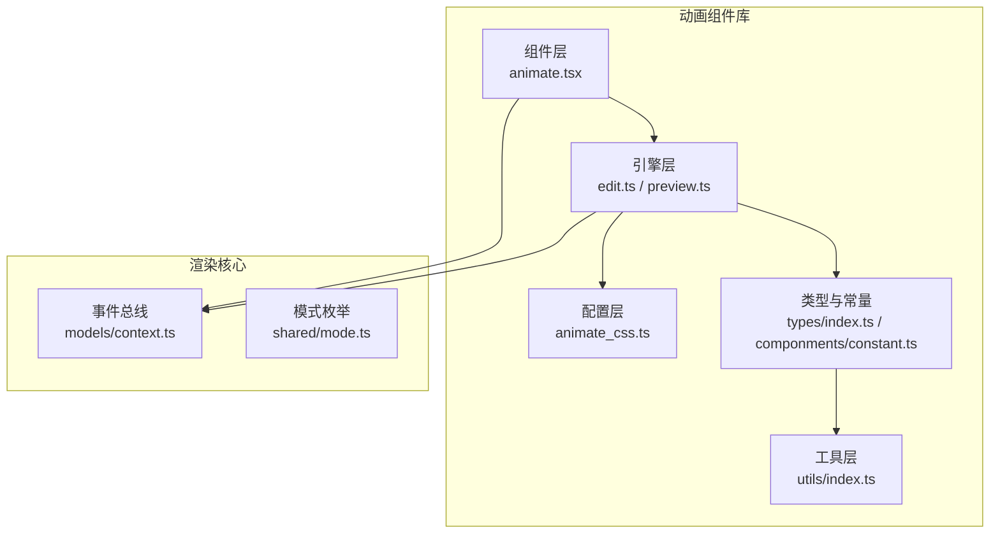
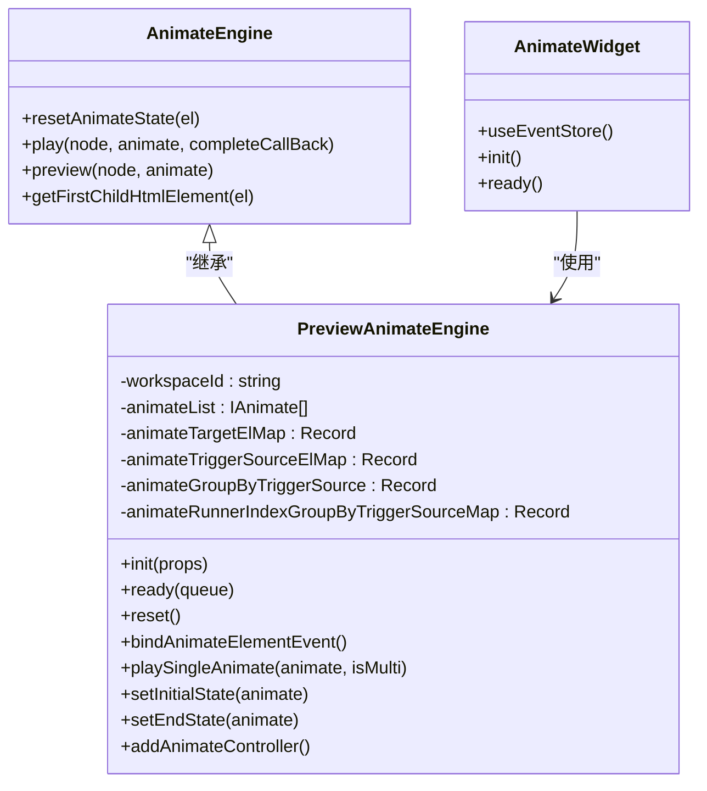
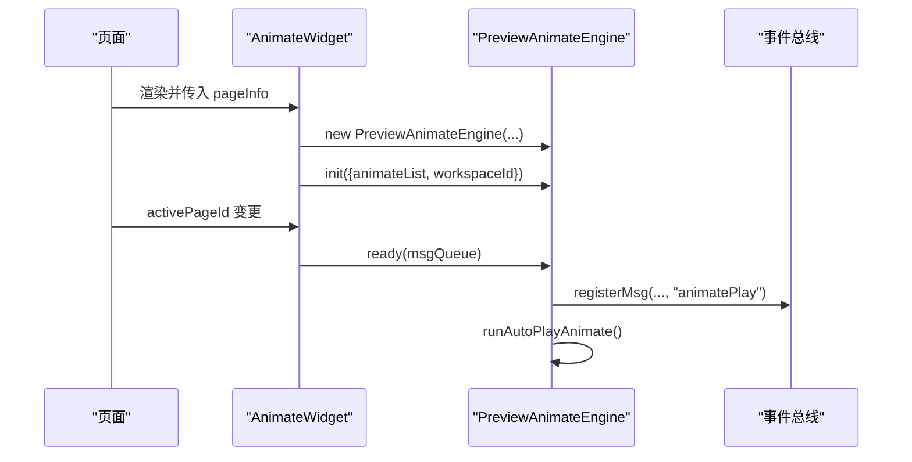
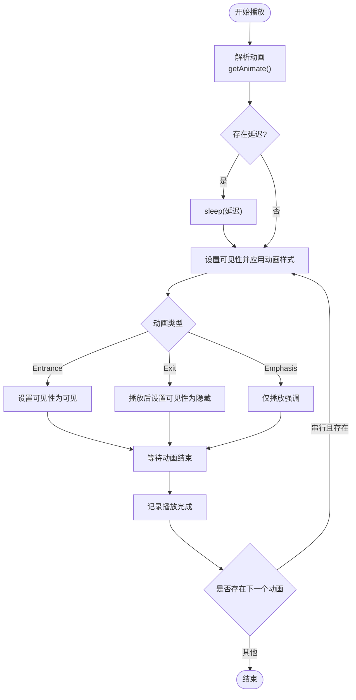
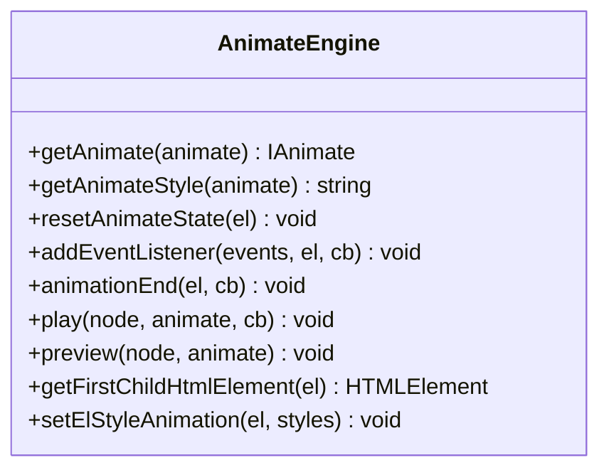
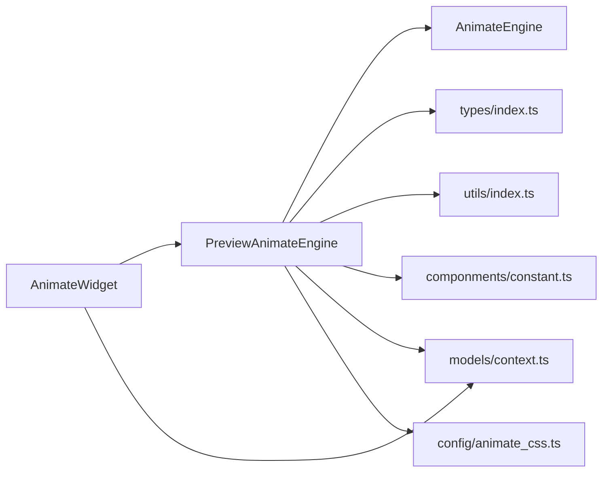

# 动画组件库

<cite>
**本文档引用的文件**
- [animate.tsx](file://common/animate/src/componments/animate.tsx)
- [constant.ts](file://common/animate/src/componments/constant.ts)
- [animate_css.ts](file://common/animate/src/config/animate_css.ts)
- [edit.ts](file://common/animate/src/engine/edit.ts)
- [preview.ts](file://common/animate/src/engine/preview.ts)
- [index.ts](file://common/animate/src/engine/index.ts)
- [index.ts](file://common/animate/src/types/index.ts)
- [index.ts](file://common/animate/src/utils/index.ts)
- [package.json](file://common/animate/package.json)
- [AnimationWidget.tsx](file://task/src/pages/Preview/components/PreviewInner/AnimationWidget.tsx)
- [Animation.tsx](file://task/src/pages/Preview/components/PreviewInner/Animation.tsx)
- [context.ts](file://common/render-core/models/context.ts)
- [mode.ts](file://common/render-core/shared/mode.ts)
</cite>

## 目录
1. [简介](#简介)
2. [项目结构](#项目结构)
3. [核心组件](#核心组件)
4. [架构总览](#架构总览)
5. [详细组件分析](#详细组件分析)
6. [依赖关系分析](#依赖关系分析)
7. [性能考量](#性能考量)
8. [故障排查指南](#故障排查指南)
9. [结论](#结论)
10. [附录](#附录)

## 简介
本动画组件库提供一套完整的“动画定义系统 + 播放控制引擎 + 效果定制功能”，覆盖编辑态与预览态两种模式，支持入场、出场、强调三类动画，以及自动、点击、并行、串行等触发方式。通过统一的动画常量、类型定义与 CSS 动画配置，实现从页面级动画编排到运行时播放控制的完整链路。

## 项目结构
动画组件库位于 common/animate，主要由以下模块组成：
- 组件层：导出可直接使用的动画组件包装器，负责接入播放控制引擎与事件总线
- 引擎层：包含编辑态与预览态两类动画引擎，分别处理静态演示与交互播放
- 配置层：内置基于 animate.css 的动画常量与分组
- 类型与常量：统一的动画枚举、触发方式、状态与日志常量
- 工具层：按触发源对动画进行分组等辅助逻辑
- 集成层：与渲染核心的事件总线、页面上下文集成

图表来源
- [animate.tsx:15-36](file://common/animate/src/componments/animate.tsx#L15-L36)
- [edit.ts:5-120](file://common/animate/src/engine/edit.ts#L5-L120)
- [preview.ts:15-111](file://common/animate/src/engine/preview.ts#L15-L111)
- [animate_css.ts:1-514](file://common/animate/src/config/animate_css.ts#L1-L514)
- [index.ts:1-164](file://common/animate/src/types/index.ts#L1-L164)
- [index.ts:1-16](file://common/animate/src/utils/index.ts#L1-L16)
- [context.ts:158-225](file://common/render-core/models/context.ts#L158-L225)

章节来源
- [package.json:1-18](file://common/animate/package.json#L1-L18)

## 核心组件
- 动画组件包装器：负责在页面渲染后初始化预览引擎、绑定事件、触发自动播放
- 预览动画引擎：继承自编辑引擎，扩展了按触发源分组、事件绑定、自动播放、状态广播等功能
- 编辑动画引擎：提供动画解析、样式拼装、DOM 事件监听与播放控制的基础能力
- 动画常量与类型：统一的动画类型、方向、触发方式、状态与日志常量
- CSS 动画配置：内置 animate.css 动画名、方向映射与默认参数
- 工具函数：按触发源对动画进行分组

章节来源
- [animate.tsx:15-36](file://common/animate/src/componments/animate.tsx#L15-L36)
- [preview.ts:15-111](file://common/animate/src/engine/preview.ts#L15-L111)
- [edit.ts:5-120](file://common/animate/src/engine/edit.ts#L5-L120)
- [index.ts:1-164](file://common/animate/src/types/index.ts#L1-L164)
- [animate_css.ts:1-514](file://common/animate/src/config/animate_css.ts#L1-L514)
- [index.ts:1-16](file://common/animate/src/utils/index.ts#L1-L16)

## 架构总览
动画组件库采用“组件包装器 + 引擎 + 配置 + 类型”的分层设计。组件包装器负责生命周期与事件总线对接；引擎负责解析动画、生成样式、绑定 DOM 事件、控制播放顺序；配置层提供动画名与方向映射；类型层统一约束数据结构；工具层提供分组与排序逻辑。

图表来源
- [edit.ts:5-120](file://common/animate/src/engine/edit.ts#L5-L120)
- [preview.ts:15-111](file://common/animate/src/engine/preview.ts#L15-L111)
- [animate.tsx:15-36](file://common/animate/src/componments/animate.tsx#L15-L36)

## 详细组件分析

### 组件包装器：AnimateWidget
- 职责
  - 在页面渲染后初始化预览动画引擎
  - 将页面级动画配置传入引擎
  - 在当前页激活时触发 ready，开始自动播放或等待交互
- 关键行为
  - 通过 useEventStore 获取 registerMsg、msgQueue 等事件总线能力
  - 初始化 PreviewAnimateEngine 并调用 init/ready
  - 依赖 pageInfo.props.animates 作为动画数据源

图表来源
- [animate.tsx:15-36](file://common/animate/src/componments/animate.tsx#L15-L36)
- [AnimationWidget.tsx:6-29](file://task/src/pages/Preview/components/PreviewInner/AnimationWidget.tsx#L6-L29)
- [preview.ts:90-116](file://common/animate/src/engine/preview.ts#L90-L116)
- [context.ts:191-214](file://common/render-core/models/context.ts#L191-L214)

章节来源
- [animate.tsx:15-36](file://common/animate/src/componments/animate.tsx#L15-L36)
- [AnimationWidget.tsx:6-29](file://task/src/pages/Preview/components/PreviewInner/AnimationWidget.tsx#L6-L29)

### 预览动画引擎：PreviewAnimateEngine
- 初始化与状态
  - init：接收动画列表与工作区 ID，按触发源分组，建立目标元素与触发源元素映射，设置初始状态，绑定事件，注册控制器
  - ready：在页面激活时执行自动播放队列
- 播放控制
  - playSingleAnimate：解析动画、处理延迟、记录索引、按类型调用对应播放方法，并在动画结束后回调
  - 支持并行动画：根据触发方式收集同批动画并发播放
  - 串行/并行/自动/点击：依据触发方式与排序决定播放顺序
- 状态管理
  - setInitialState/setEndState：根据动画类型设置元素可见性与透明度
  - addAnimateController：注册“播放”和“状态”两类事件，实现跨组件信令与状态同步
- 日志埋点
  - sendLog：在播放与信令收发处打点，便于追踪动画生命周期

图表来源
- [preview.ts:291-359](file://common/animate/src/engine/preview.ts#L291-L359)
- [preview.ts:464-498](file://common/animate/src/engine/preview.ts#L464-L498)
- [preview.ts:699-754](file://common/animate/src/engine/preview.ts#L699-L754)

章节来源
- [preview.ts:15-111](file://common/animate/src/engine/preview.ts#L15-L111)
- [preview.ts:166-175](file://common/animate/src/engine/preview.ts#L166-L175)
- [preview.ts:291-359](file://common/animate/src/engine/preview.ts#L291-L359)
- [preview.ts:464-498](file://common/animate/src/engine/preview.ts#L464-L498)
- [preview.ts:699-754](file://common/animate/src/engine/preview.ts#L699-L754)

### 编辑动画引擎：AnimateEngine
- 基础能力
  - getAnimate：根据动画类型与方向选择具体动画名
  - getAnimateStyle：拼装 animation 属性字符串
  - resetAnimateState：重置元素透明度与动画属性
  - animationEnd：统一封装动画结束事件监听
- 预览接口
  - preview：隐藏节点、解析动画并播放，完成后清理状态
- DOM 辅助
  - getFirstChildHtmlElement：获取容器首个子元素
  - setElStyleAnimation：设置标准与 WebKit 前缀的 animation

图表来源
- [edit.ts:5-120](file://common/animate/src/engine/edit.ts#L5-L120)

章节来源
- [edit.ts:5-120](file://common/animate/src/engine/edit.ts#L5-L120)

### 动画常量与类型定义
- 动画类型：Entrance、Exit、Emphasis
- 动画方向：General、Up/Down/Left/Right、X/Y、多向组合
- 触发方式：Auto、Click、Parallel、Serial
- 动画状态：Pending、Running、Paused、Stopped、Finished
- 日志常量：事件名与动作枚举，用于埋点统计

章节来源
- [index.ts:6-138](file://common/animate/src/types/index.ts#L6-L138)
- [constant.ts:1-36](file://common/animate/src/componments/constant.ts#L1-L36)

### CSS 动画配置与类型定义
- IBaseAnimation/IAnimation：定义动画基础字段与扩展字段（时长、延迟、次数、无限循环）
- 分组结构：按 AnimationType 划分为 Entrance、Exit、Emphasis 三类
- 方向映射：每类动画提供多方向变体，如 fadeInUp、zoomInLeft 等
- 默认参数：统一提供 duration/delay/count/infinite 的默认值

章节来源
- [animate_css.ts:3-26](file://common/animate/src/config/animate_css.ts#L3-L26)
- [animate_css.ts:28-497](file://common/animate/src/config/animate_css.ts#L28-L497)
- [animate_css.ts:499-514](file://common/animate/src/config/animate_css.ts#L499-L514)

### 工具函数：按触发源分组
- getAnimateGroupByTriggerSource：将动画列表按 triggerSource 分组，便于按触发源组织播放队列

章节来源
- [index.ts:1-16](file://common/animate/src/utils/index.ts#L1-L16)

## 依赖关系分析
- 组件包装器依赖预览引擎与事件总线
- 预览引擎依赖编辑引擎、类型定义、工具函数与日志常量
- 配置层提供动画名与方向映射，供引擎解析使用
- 渲染核心提供事件总线与全局状态管理

图表来源
- [animate.tsx:15-36](file://common/animate/src/componments/animate.tsx#L15-L36)
- [preview.ts:15-111](file://common/animate/src/engine/preview.ts#L15-L111)
- [edit.ts:5-120](file://common/animate/src/engine/edit.ts#L5-L120)
- [index.ts:1-164](file://common/animate/src/types/index.ts#L1-L164)
- [index.ts:1-16](file://common/animate/src/utils/index.ts#L1-L16)
- [constant.ts:1-36](file://common/animate/src/componments/constant.ts#L1-L36)
- [context.ts:158-225](file://common/render-core/models/context.ts#L158-L225)
- [animate_css.ts:1-514](file://common/animate/src/config/animate_css.ts#L1-L514)

章节来源
- [package.json:12-16](file://common/animate/package.json#L12-L16)
- [context.ts:158-225](file://common/render-core/models/context.ts#L158-L225)

## 性能考量
- DOM 操作最小化
  - 使用 setProperty 设置 animation 与 visibility，避免频繁重排
  - 复用样式字符串，减少重复计算
- 事件监听优化
  - 使用 { passive: true, once: true } 降低事件开销
  - 仅在必要时绑定 click 事件，避免全局监听
- 播放顺序控制
  - 串行播放时等待上一动画结束再启动下一动画，避免叠加冲突
  - 并行动画批量播放，减少多次样式切换
- 自动播放去重
  - 通过播放记录数组避免重复触发同一动画
- 延迟处理
  - 使用 Promise 实现非阻塞 sleep，避免主线程卡顿

## 故障排查指南
- 动画不生效
  - 检查目标元素是否存在：查询选择器需匹配到 preview-id
  - 确认动画类型与方向映射正确
  - 查看控制台错误提示，确认动画名是否存在于配置
- 触发无响应
  - 确认 bindAnimateElementEvent 是否已绑定到工作区容器
  - 检查事件冒泡与阻止传播逻辑
- 自动播放异常
  - 检查 ready 调用时机与 msgQueue 状态
  - 确认自动动画是否被标记为已播放
- 状态不同步
  - 检查 addAnimateController 是否正确注册“播放”和“状态”两类事件
  - 核对 registerMsg 的参数与 pageId 匹配

章节来源
- [preview.ts:194-221](file://common/animate/src/engine/preview.ts#L194-L221)
- [preview.ts:228-247](file://common/animate/src/engine/preview.ts#L228-L247)
- [preview.ts:699-754](file://common/animate/src/engine/preview.ts#L699-L754)

## 结论
该动画组件库通过清晰的分层设计与完善的事件机制，实现了从动画定义到播放控制的全链路能力。编辑态与预览态的差异化处理满足了不同场景需求，结合 animate.css 的丰富动画库与统一的类型体系，能够高效构建复杂页面动画体验。

## 附录

### 使用示例（步骤说明）
- 基础动画
  - 在页面数据中添加 animates 数组，包含目标元素 ID、动画类型、名称与触发方式
  - 在页面渲染后初始化 AnimateWidget，传入 pageInfo 与事件总线
  - 预览引擎将自动解析并按触发方式播放
- 复合动画
  - 通过 Parallel/Serial 组合多段动画，实现复杂序列
  - 使用 Auto 与 Click 混合触发，提升交互灵活性
- 自定义动画效果
  - 在配置层扩展 IAnimationBaseGroup 与 IAnimationGroup
  - 保持 name/value/type/directions 的一致性，确保引擎解析正常

章节来源
- [animate.tsx:15-36](file://common/animate/src/componments/animate.tsx#L15-L36)
- [preview.ts:90-116](file://common/animate/src/engine/preview.ts#L90-L116)
- [animate_css.ts:28-497](file://common/animate/src/config/animate_css.ts#L28-L497)