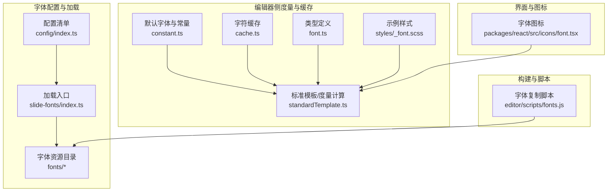
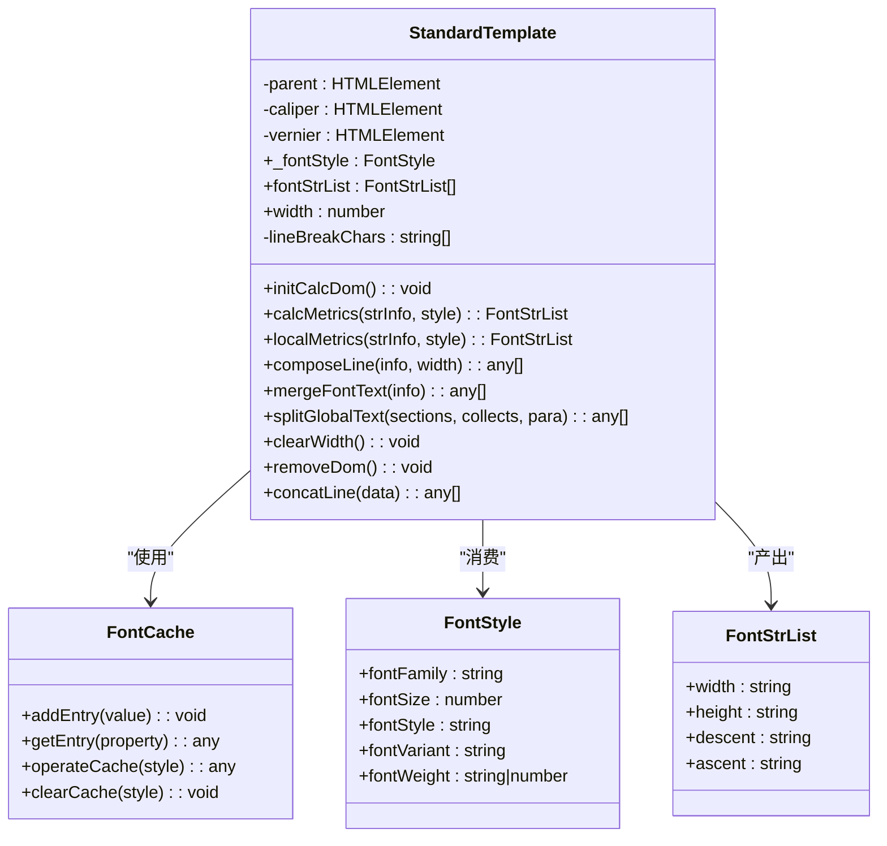
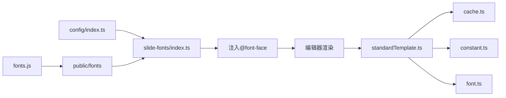

# 字体系统

<cite>
**本文引用的文件**
- [common/slide-fonts/index.ts](file://common/slide-fonts/index.ts)
- [common/slide-fonts/config/index.ts](file://common/slide-fonts/config/index.ts)
- [common/slide-fonts/fonts/](file://common/slide-fonts/fonts/)
- [common/slide-editor/src/components/Input/utils/cache.ts](file://common/slide-editor/src/components/Input/utils/cache.ts)
- [common/slide-editor/src/components/Input/utils/standardTemplate.ts](file://common/slide-editor/src/components/Input/utils/standardTemplate.ts)
- [common/slide-editor/src/components/Input/utils/constant.ts](file://common/slide-editor/src/components/Input/utils/constant.ts)
- [common/slide-editor/src/type/font.ts](file://common/slide-editor/src/type/font.ts)
- [common/slide-editor/src/styles/_font.scss](file://common/slide-editor/src/styles/_font.scss)
- [editor/scripts/fonts.js](file://editor/scripts/fonts.js)
- [packages/react/src/icons/font.tsx](file://packages/react/src/icons/font.tsx)
</cite>

## 目录
1. [简介](#简介)
2. [项目结构](#项目结构)
3. [核心组件](#核心组件)
4. [架构总览](#架构总览)
5. [详细组件分析](#详细组件分析)
6. [依赖关系分析](#依赖关系分析)
7. [性能考量](#性能考量)
8. [故障排除指南](#故障排除指南)
9. [结论](#结论)
10. [附录](#附录)

## 简介
本文件系统性梳理并说明本仓库中的字体系统设计与实现，涵盖以下方面：
- 设计目标：提供中英文字体统一管理、跨平台一致的排版体验、可扩展的内置字体与第三方字体集成。
- 字体管理机制：字体加载（@font-face）、缓存（字符级度量缓存）、使用优化（按需计算、缩放与容错）。
- 字体配置：字体路径配置、字体族定义、样式应用规则与降级策略。
- 内置字体：宋体、仿宋等中文字体的集成与应用。
- 性能优化：预加载、按需加载、缓存复用与DOM计算优化。
- 实际示例：字体选择、样式定制与兼容性处理。
- 扩展方法：自定义字体与第三方字体的接入流程。
- 故障排除：常见问题定位与调试建议。

## 项目结构
围绕字体系统的关键目录与文件如下：
- 字体配置与加载
  - 字体配置清单：common/slide-fonts/config/index.ts
  - 字体加载入口：common/slide-fonts/index.ts
  - 字体资源目录：common/slide-fonts/fonts/
- 编辑器侧字体度量与缓存
  - 默认字体与常量：common/slide-editor/src/components/Input/utils/constant.ts
  - 字符度量与缓存：common/slide-editor/src/components/Input/utils/cache.ts、standardTemplate.ts
  - 字体类型定义：common/slide-editor/src/type/font.ts
  - 示例样式：common/slide-editor/src/styles/_font.scss
- 构建与脚本
  - 字体资源复制脚本：editor/scripts/fonts.js
- 图标与界面
  - 字体相关图标：packages/react/src/icons/font.tsx

图表来源
- [common/slide-fonts/config/index.ts:1-31](file://common/slide-fonts/config/index.ts#L1-L31)
- [common/slide-fonts/index.ts:1-71](file://common/slide-fonts/index.ts#L1-L71)
- [common/slide-editor/src/components/Input/utils/constant.ts:1-51](file://common/slide-editor/src/components/Input/utils/constant.ts#L1-L51)
- [common/slide-editor/src/components/Input/utils/cache.ts:1-72](file://common/slide-editor/src/components/Input/utils/cache.ts#L1-L72)
- [common/slide-editor/src/components/Input/utils/standardTemplate.ts:1-464](file://common/slide-editor/src/components/Input/utils/standardTemplate.ts#L1-L464)
- [common/slide-editor/src/type/font.ts:1-17](file://common/slide-editor/src/type/font.ts#L1-L17)
- [common/slide-editor/src/styles/_font.scss:1-13](file://common/slide-editor/src/styles/_font.scss#L1-L13)
- [editor/scripts/fonts.js:1-28](file://editor/scripts/fonts.js#L1-L28)
- [packages/react/src/icons/font.tsx:1-17](file://packages/react/src/icons/font.tsx#L1-L17)

章节来源
- [common/slide-fonts/config/index.ts:1-31](file://common/slide-fonts/config/index.ts#L1-L31)
- [common/slide-fonts/index.ts:1-71](file://common/slide-fonts/index.ts#L1-L71)
- [common/slide-editor/src/components/Input/utils/constant.ts:1-51](file://common/slide-editor/src/components/Input/utils/constant.ts#L1-L51)
- [common/slide-editor/src/components/Input/utils/cache.ts:1-72](file://common/slide-editor/src/components/Input/utils/cache.ts#L1-L72)
- [common/slide-editor/src/components/Input/utils/standardTemplate.ts:1-464](file://common/slide-editor/src/components/Input/utils/standardTemplate.ts#L1-L464)
- [common/slide-editor/src/type/font.ts:1-17](file://common/slide-editor/src/type/font.ts#L1-L17)
- [common/slide-editor/src/styles/_font.scss:1-13](file://common/slide-editor/src/styles/_font.scss#L1-L13)
- [editor/scripts/fonts.js:1-28](file://editor/scripts/fonts.js#L1-L28)
- [packages/react/src/icons/font.tsx:1-17](file://packages/react/src/icons/font.tsx#L1-L17)

## 核心组件
- 字体配置与加载
  - 配置清单：定义字体名称、文件名、字体族、降级字体与是否回退等元信息。
  - 加载入口：根据配置生成@font-face声明并注入页面样式，支持多格式（woff/woff2/ttf/svg）。
- 字体缓存与度量
  - 字符级缓存：以字体族、粗细、样式、字号为键，缓存字符的宽高、上下行距等度量。
  - 标准模板：通过隐藏DOM节点测量字符真实宽高，结合缓存提升排版效率。
- 默认字体与样式
  - 默认字体族组合（含内置中文字体），统一字号、行高、颜色等基础样式。
  - 示例样式文件展示如何引入第三方字体。
- 构建脚本
  - 复制第三方字体资源到公共目录，便于发布与CDN分发。

章节来源
- [common/slide-fonts/config/index.ts:1-31](file://common/slide-fonts/config/index.ts#L1-L31)
- [common/slide-fonts/index.ts:1-71](file://common/slide-fonts/index.ts#L1-L71)
- [common/slide-editor/src/components/Input/utils/cache.ts:1-72](file://common/slide-editor/src/components/Input/utils/cache.ts#L1-L72)
- [common/slide-editor/src/components/Input/utils/standardTemplate.ts:1-464](file://common/slide-editor/src/components/Input/utils/standardTemplate.ts#L1-L464)
- [common/slide-editor/src/components/Input/utils/constant.ts:1-51](file://common/slide-editor/src/components/Input/utils/constant.ts#L1-L51)
- [common/slide-editor/src/styles/_font.scss:1-13](file://common/slide-editor/src/styles/_font.scss#L1-L13)
- [editor/scripts/fonts.js:1-28](file://editor/scripts/fonts.js#L1-L28)

## 架构总览
字体系统由“配置—加载—缓存—度量—渲染”链路构成，核心交互如下：

图表来源
- [common/slide-fonts/config/index.ts:1-31](file://common/slide-fonts/config/index.ts#L1-L31)
- [common/slide-fonts/index.ts:60-68](file://common/slide-fonts/index.ts#L60-L68)
- [common/slide-editor/src/components/Input/utils/standardTemplate.ts:371-423](file://common/slide-editor/src/components/Input/utils/standardTemplate.ts#L371-L423)
- [common/slide-editor/src/components/Input/utils/cache.ts:26-70](file://common/slide-editor/src/components/Input/utils/cache.ts#L26-L70)

## 详细组件分析

### 组件A：字体配置与加载（slide-fonts）
- 职责
  - 定义字体元信息（名称、文件名、字体族、降级、回退）。
  - 生成@font-face样式文本并注入页面，支持多种字体格式。
- 关键点
  - 字体格式映射：将枚举映射为CSS可用的格式标识。
  - 多格式拼接：同一字体的不同格式以逗号分隔，增强兼容性。
  - 入口函数：创建style节点并挂载到head，完成全局字体注册。

图表来源
- [common/slide-fonts/index.ts:32-58](file://common/slide-fonts/index.ts#L32-L58)
- [common/slide-fonts/index.ts:60-68](file://common/slide-fonts/index.ts#L60-L68)

章节来源
- [common/slide-fonts/config/index.ts:1-31](file://common/slide-fonts/config/index.ts#L1-L31)
- [common/slide-fonts/index.ts:1-71](file://common/slide-fonts/index.ts#L1-L71)

### 组件B：字符度量与缓存（standardTemplate + cache）
- 职责
  - 使用隐藏DOM节点动态测量字符的真实宽高与上下行距。
  - 基于缓存避免重复测量，显著降低计算开销。
- 关键点
  - 缩放因子：将字号放大若干倍再缩放显示，减少浮点误差。
  - 缓存键：以字体族、粗细、样式、字号组合生成唯一键。
  - 行拆分：按容器宽度拆分行，保证英文单词连续性与中文字符独立性。

图表来源
- [common/slide-editor/src/components/Input/utils/standardTemplate.ts:26-464](file://common/slide-editor/src/components/Input/utils/standardTemplate.ts#L26-L464)
- [common/slide-editor/src/components/Input/utils/cache.ts:26-70](file://common/slide-editor/src/components/Input/utils/cache.ts#L26-L70)
- [common/slide-editor/src/type/font.ts:7-17](file://common/slide-editor/src/type/font.ts#L7-L17)

章节来源
- [common/slide-editor/src/components/Input/utils/standardTemplate.ts:1-464](file://common/slide-editor/src/components/Input/utils/standardTemplate.ts#L1-L464)
- [common/slide-editor/src/components/Input/utils/cache.ts:1-72](file://common/slide-editor/src/components/Input/utils/cache.ts#L1-L72)
- [common/slide-editor/src/type/font.ts:1-17](file://common/slide-editor/src/type/font.ts#L1-L17)

### 组件C：默认字体与样式（constant + scss）
- 职责
  - 提供默认字体族组合（含内置中文字体），统一字号、行高、颜色等。
  - 示例样式文件展示如何引入第三方字体。
- 关键点
  - 默认字体族：优先内置中文字体，确保中文场景一致性。
  - 白空格策略：保留空白字符以便精确计算宽度。
  - 示例样式：演示@font-face的外部字体引入方式。

章节来源
- [common/slide-editor/src/components/Input/utils/constant.ts:30-41](file://common/slide-editor/src/components/Input/utils/constant.ts#L30-L41)
- [common/slide-editor/src/styles/_font.scss:1-13](file://common/slide-editor/src/styles/_font.scss#L1-L13)

### 组件D：构建与脚本（fonts.js）
- 职责
  - 将第三方字体资源从模块目录复制到公共发布目录，便于CDN分发。
- 关键点
  - 递归复制：目录与文件分别处理。
  - 目标路径：public/fonts，便于静态资源访问。

章节来源
- [editor/scripts/fonts.js:1-28](file://editor/scripts/fonts.js#L1-L28)

### 组件E：图标与界面（font.tsx）
- 职责
  - 提供字体相关的UI图标，辅助字体设置面板与工具栏。
- 关键点
  - SVG路径：用于绘制加粗、斜体、常规等字体样式的图标。

章节来源
- [packages/react/src/icons/font.tsx:1-17](file://packages/react/src/icons/font.tsx#L1-L17)

## 依赖关系分析
- 配置到加载
  - 配置清单被加载入口读取，生成@font-face并注入页面。
- 加载到渲染
  - 页面具备字体后，编辑器通过标准模板进行字符度量与排版。
- 度量到缓存
  - 标准模板调用缓存模块，命中则返回，未命中则测量并写入缓存。
- 构建到发布
  - 构建脚本复制字体资源到公共目录，确保运行时可访问。

图表来源
- [common/slide-fonts/config/index.ts:1-31](file://common/slide-fonts/config/index.ts#L1-L31)
- [common/slide-fonts/index.ts:60-68](file://common/slide-fonts/index.ts#L60-L68)
- [common/slide-editor/src/components/Input/utils/standardTemplate.ts:371-423](file://common/slide-editor/src/components/Input/utils/standardTemplate.ts#L371-L423)
- [common/slide-editor/src/components/Input/utils/cache.ts:26-70](file://common/slide-editor/src/components/Input/utils/cache.ts#L26-L70)
- [common/slide-editor/src/components/Input/utils/constant.ts:30-41](file://common/slide-editor/src/components/Input/utils/constant.ts#L30-L41)
- [common/slide-editor/src/type/font.ts:7-17](file://common/slide-editor/src/type/font.ts#L7-L17)
- [editor/scripts/fonts.js:1-28](file://editor/scripts/fonts.js#L1-L28)

章节来源
- [common/slide-fonts/index.ts:1-71](file://common/slide-fonts/index.ts#L1-L71)
- [common/slide-editor/src/components/Input/utils/standardTemplate.ts:1-464](file://common/slide-editor/src/components/Input/utils/standardTemplate.ts#L1-L464)
- [common/slide-editor/src/components/Input/utils/cache.ts:1-72](file://common/slide-editor/src/components/Input/utils/cache.ts#L1-L72)
- [editor/scripts/fonts.js:1-28](file://editor/scripts/fonts.js#L1-L28)

## 性能考量
- 字体加载
  - 多格式支持：@font-face中声明多种格式，提高兼容性与加载成功率。
  - 预加载策略：在应用启动阶段尽早注入@font-face，减少首次渲染阻塞。
- 字符度量
  - 缩放因子：将字号放大若干倍再缩放显示，降低浮点误差导致的排版偏差。
  - 缓存命中：以字体族+粗细+样式+字号为键，避免重复DOM测量。
  - 行拆分优化：英文单词连续性保障与中文字符独立性兼顾，减少重排。
- 资源分发
  - 构建复制：将字体资源复制到公共目录，配合CDN加速与缓存策略。

章节来源
- [common/slide-fonts/index.ts:32-58](file://common/slide-fonts/index.ts#L32-L58)
- [common/slide-editor/src/components/Input/utils/standardTemplate.ts:371-423](file://common/slide-editor/src/components/Input/utils/standardTemplate.ts#L371-L423)
- [common/slide-editor/src/components/Input/utils/cache.ts:26-70](file://common/slide-editor/src/components/Input/utils/cache.ts#L26-L70)
- [editor/scripts/fonts.js:1-28](file://editor/scripts/fonts.js#L1-L28)

## 故障排除指南
- 字体未生效
  - 检查@font-face是否成功注入head。
  - 确认字体文件路径与格式正确，多格式声明齐全。
  - 参考：[common/slide-fonts/index.ts:60-68](file://common/slide-fonts/index.ts#L60-L68)
- 中文显示异常或排版错位
  - 确认默认字体族包含内置中文字体，必要时调整降级顺序。
  - 参考：[common/slide-editor/src/components/Input/utils/constant.ts:30-41](file://common/slide-editor/src/components/Input/utils/constant.ts#L30-L41)
- 字符度量不准或抖动
  - 检查缩放因子与DOM测量逻辑，确认缓存键覆盖所有影响因素。
  - 参考：[common/slide-editor/src/components/Input/utils/standardTemplate.ts:371-423](file://common/slide-editor/src/components/Input/utils/standardTemplate.ts#L371-L423)
- 第三方字体无法加载
  - 确认构建脚本已复制字体到public/fonts，并检查CDN可达性。
  - 参考：[editor/scripts/fonts.js:1-28](file://editor/scripts/fonts.js#L1-L28)
- 英文单词被错误拆分
  - 检查行拆分算法对特殊字符的判断与回溯逻辑。
  - 参考：[common/slide-editor/src/components/Input/utils/standardTemplate.ts:109-177](file://common/slide-editor/src/components/Input/utils/standardTemplate.ts#L109-L177)

## 结论
本字体系统通过“配置—加载—缓存—度量—渲染”的完整链路，实现了中英文字体的一致性与高性能排版。内置中文字体与第三方字体均可无缝集成；字符级缓存与DOM测量优化有效降低了计算成本；多格式@font-face与构建脚本提升了兼容性与可维护性。建议在生产环境中结合CDN与缓存策略进一步优化首屏加载与渲染性能。

## 附录
- 字体配置清单字段说明
  - version：版本号
  - fileName：字体文件名（不含扩展名）
  - fontName：字体显示名称
  - fontFamily：CSS字体族名
  - downgrade：降级字体列表（优先级从左到右）
  - fallback：是否启用回退策略
- 使用示例路径
  - 注入@font-face：[common/slide-fonts/index.ts:60-68](file://common/slide-fonts/index.ts#L60-L68)
  - 默认字体族与样式：[common/slide-editor/src/components/Input/utils/constant.ts:30-41](file://common/slide-editor/src/components/Input/utils/constant.ts#L30-L41)
  - 字符度量与缓存：[common/slide-editor/src/components/Input/utils/standardTemplate.ts:371-423](file://common/slide-editor/src/components/Input/utils/standardTemplate.ts#L371-L423)
  - 第三方字体引入示例：[common/slide-editor/src/styles/_font.scss:1-13](file://common/slide-editor/src/styles/_font.scss#L1-L13)
  - 字体资源复制脚本：[editor/scripts/fonts.js:1-28](file://editor/scripts/fonts.js#L1-L28)