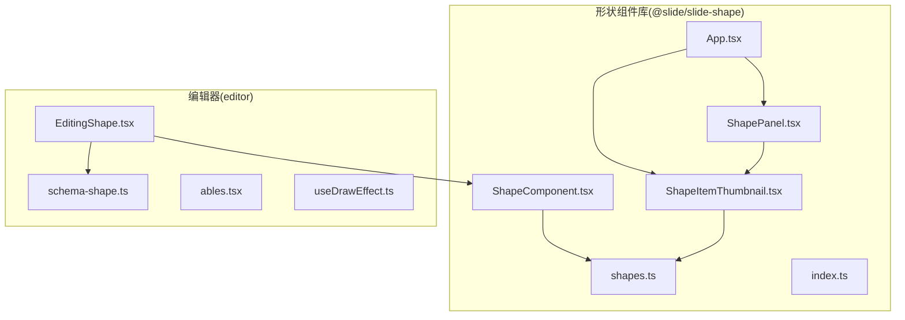
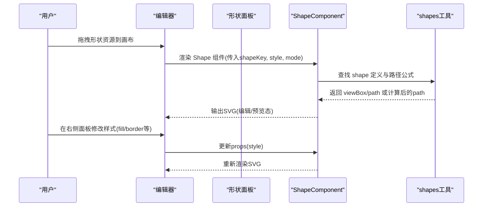
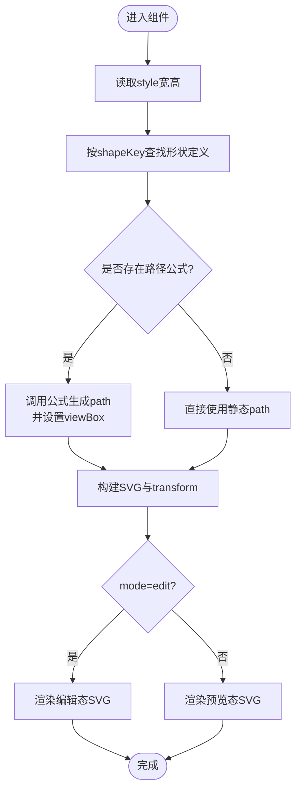
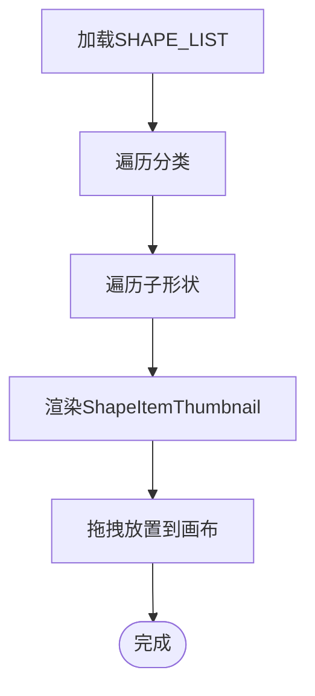
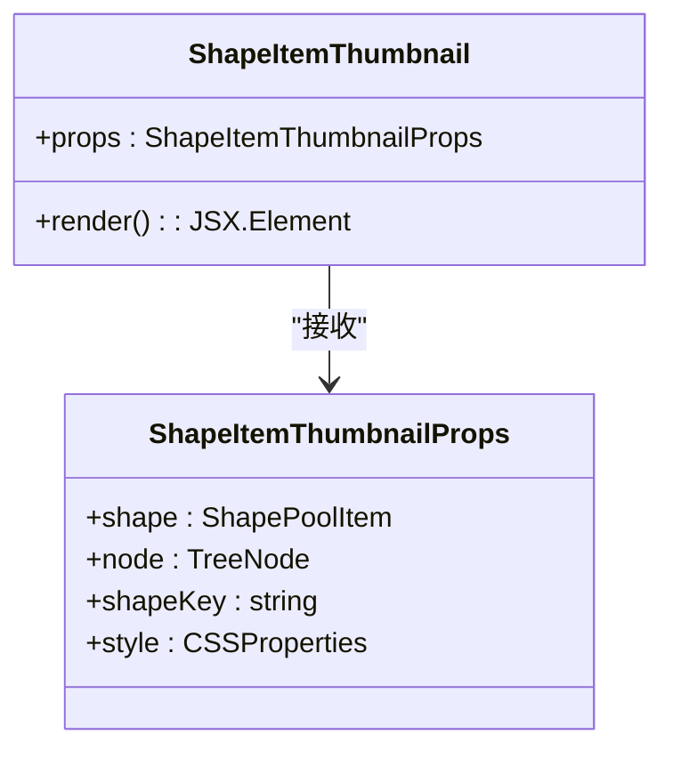
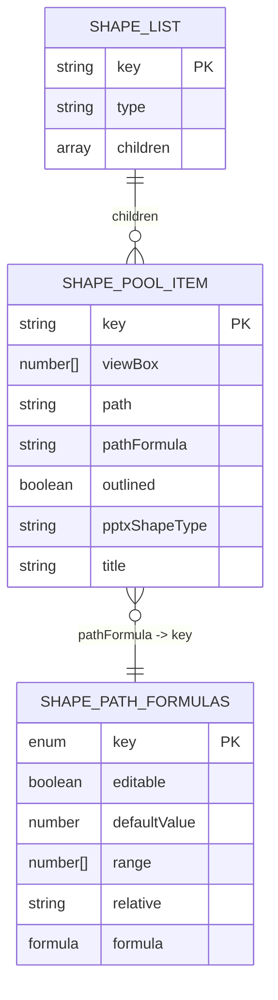
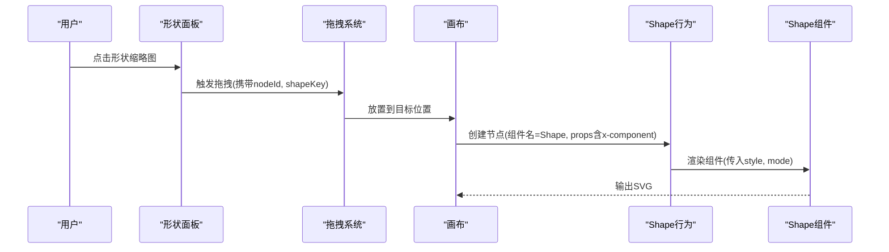
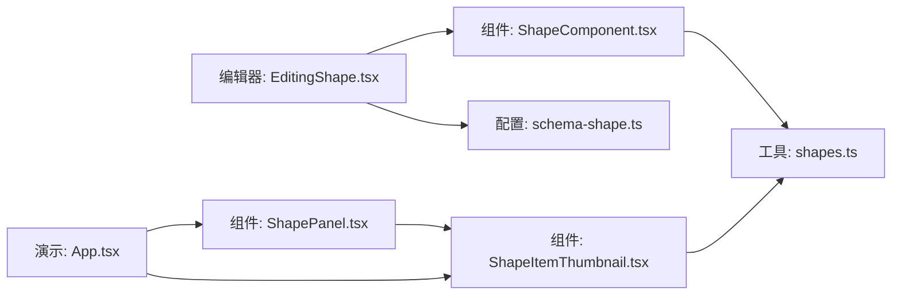

# 形状组件库

<cite>
**本文引用的文件**
- [ShapeComponent.tsx](file://common/slide-shape/src/component/ShapeComponent.tsx)
- [ShapePanel.tsx](file://common/slide-shape/src/component/ShapePanel.tsx)
- [ShapeItemThumbnail.tsx](file://common/slide-shape/src/component/ShapeItemThumbnail.tsx)
- [shapes.ts](file://common/slide-shape/src/utils/shapes.ts)
- [index.ts](file://common/slide-shape/src/index.ts)
- [App.tsx](file://common/slide-shape/src/App.tsx)
- [package.json](file://common/slide-shape/package.json)
- [EditingShape.tsx](file://editor/src/components/Shape/EditingShape.tsx)
- [schema-shape.ts](file://editor/src/components/_config/schema-shape.ts)
- [ables.tsx](file://editor/src/components/Moveable/ables.tsx)
- [useDrawEffect.ts](file://editor/src/components/draw/useDrawEffect.ts)
</cite>

## 目录
1. [简介](#简介)
2. [项目结构](#项目结构)
3. [核心组件](#核心组件)
4. [架构总览](#架构总览)
5. [详细组件分析](#详细组件分析)
6. [依赖分析](#依赖分析)
7. [性能考虑](#性能考虑)
8. [故障排查指南](#故障排查指南)
9. [结论](#结论)
10. [附录](#附录)

## 简介
本文件为“形状组件库”的完整技术文档，面向编辑器与预览渲染两端，系统性阐述形状组件的设计理念、几何图形系统、生成算法与样式定制能力；并提供从形状选择、编辑到布局调整的使用方法，说明形状面板的实现方式（列表、缩略图与交互），解析形状工具函数（路径公式、尺寸换算与可编辑参数），给出基础几何、自定义形状与复杂组合的实际应用示例，并总结性能优化与渲染机制，最后提供扩展开发指南与自定义形状实现步骤。

## 项目结构
形状组件库位于 common/slide-shape，采用“组件 + 工具函数 + 面板”分层组织，配合编辑器侧行为与资源注册，形成从“选择/拖拽”到“渲染/编辑”的闭环。

图表来源
- [ShapeComponent.tsx:1-114](file://common/slide-shape/src/component/ShapeComponent.tsx#L1-L114)
- [ShapePanel.tsx:1-33](file://common/slide-shape/src/component/ShapePanel.tsx#L1-L33)
- [ShapeItemThumbnail.tsx:1-47](file://common/slide-shape/src/component/ShapeItemThumbnail.tsx#L1-L47)
- [shapes.ts:1-120](file://common/slide-shape/src/utils/shapes.ts#L1-L120)
- [index.ts:1-2](file://common/slide-shape/src/index.ts#L1-L2)
- [App.tsx:1-41](file://common/slide-shape/src/App.tsx#L1-L41)
- [EditingShape.tsx:1-103](file://editor/src/components/Shape/EditingShape.tsx#L1-L103)
- [schema-shape.ts:1-34](file://editor/src/components/_config/schema-shape.ts#L1-L34)
- [ables.tsx:1-183](file://editor/src/components/Moveable/ables.tsx#L1-L183)
- [useDrawEffect.ts:1-48](file://editor/src/components/draw/useDrawEffect.ts#L1-L48)

章节来源
- [package.json:1-30](file://common/slide-shape/package.json#L1-L30)

## 核心组件
- 形状组件：根据传入的 shapeKey 与容器尺寸，动态计算 SVG 路径并渲染，支持编辑态与预览态差异化渲染。
- 形状面板：按分类展示形状集合，每个形状以缩略图形式呈现，便于快速选择。
- 形状缩略图：以固定尺寸的 SVG 展示单个形状，用于面板浏览与拖拽放置。
- 形状工具：集中管理所有形状的 viewBox、路径与可编辑路径公式，提供统一的生成与换算接口。

章节来源
- [ShapeComponent.tsx:1-114](file://common/slide-shape/src/component/ShapeComponent.tsx#L1-L114)
- [ShapePanel.tsx:1-33](file://common/slide-shape/src/component/ShapePanel.tsx#L1-L33)
- [ShapeItemThumbnail.tsx:1-47](file://common/slide-shape/src/component/ShapeItemThumbnail.tsx#L1-L47)
- [shapes.ts:1-120](file://common/slide-shape/src/utils/shapes.ts#L1-L120)

## 架构总览
编辑器通过行为与资源注册将“形状”挂载为可拖拽组件；选中后右侧属性面板提供样式设置；渲染端根据组件模式（编辑/预览）与样式数据生成最终 SVG 输出。

图表来源
- [EditingShape.tsx:79-103](file://editor/src/components/Shape/EditingShape.tsx#L79-L103)
- [ShapeComponent.tsx:15-114](file://common/slide-shape/src/component/ShapeComponent.tsx#L15-L114)
- [shapes.ts:51-322](file://common/slide-shape/src/utils/shapes.ts#L51-L322)

## 详细组件分析

### 形状组件（ShapeComponent）
- 功能要点
  - 接收 useConnect/useReport、节点 id/pageId、shapeKey、style、mode 等参数。
  - 编辑态注册实例并设置默认名称；预览态合并样式映射。
  - 根据容器宽高与路径公式计算最终 path 与 viewBox 缩放矩阵。
  - 支持边框样式（实线/虚线）、填充色、非均匀缩放下的矢量效果。
- 关键流程
  - 读取 style.width/height，转为数值参与计算。
  - 依据 shapeKey 查找 shape 定义，若存在 pathFormula 则调用公式生成 path。
  - 计算 transform 缩放比例，确保路径按 viewBox 正确适配容器。
  - 根据 mode 渲染编辑态或预览态 SVG。

图表来源
- [ShapeComponent.tsx:46-114](file://common/slide-shape/src/component/ShapeComponent.tsx#L46-L114)
- [shapes.ts:51-322](file://common/slide-shape/src/utils/shapes.ts#L51-L322)

章节来源
- [ShapeComponent.tsx:1-114](file://common/slide-shape/src/component/ShapeComponent.tsx#L1-L114)

### 形状面板（ShapePanel）
- 功能要点
  - 从 shapes.ts 读取 SHAPE_LIST，按分类渲染。
  - 每个分类下以 Flex 布局展示多个形状缩略图。
  - 将节点上下文与 shapeKey 传递给缩略图，便于拖拽放置。
- 交互特性
  - 缩略图 hover 时边框高亮，提升选择反馈。

图表来源
- [ShapePanel.tsx:7-32](file://common/slide-shape/src/component/ShapePanel.tsx#L7-L32)
- [shapes.ts:323-800](file://common/slide-shape/src/utils/shapes.ts#L323-L800)

章节来源
- [ShapePanel.tsx:1-33](file://common/slide-shape/src/component/ShapePanel.tsx#L1-L33)

### 形状缩略图（ShapeItemThumbnail）
- 功能要点
  - 固定 18x18 的 SVG 视口，按 shape.viewBox 进行等比缩放。
  - 支持 outline 样式切换，便于在面板中区分描边/填充型形状。
  - 通过 data-* 属性携带节点 id 与 shapeKey，供拖拽放置使用。

图表来源
- [ShapeItemThumbnail.tsx:5-47](file://common/slide-shape/src/component/ShapeItemThumbnail.tsx#L5-L47)

章节来源
- [ShapeItemThumbnail.tsx:1-47](file://common/slide-shape/src/component/ShapeItemThumbnail.tsx#L1-L47)

### 几何图形系统与路径公式（shapes）
- 设计理念
  - 以“形状池”统一管理所有形状，每项包含 viewBox、path 或 pathFormula。
  - 可编辑形状通过公式参数驱动路径变化，支持相对值与范围控制。
- 数据结构
  - ShapePoolItem：描述单个形状的关键元数据。
  - SHAPE_LIST：按分类组织的形状集合。
  - SHAPE_PATH_FORMULAS：可编辑形状的公式集，含默认值、范围、相对参考与计算函数。
- 典型形状类型
  - 圆角矩形系列、切角系列、消息气泡、L 形、环形、三角形、平行四边形、梯形、指示器、星形、月亮等。
- 使用方式
  - 编辑态：通过公式参数实时重算 path。
  - 预设路径：直接使用静态 path，适合无需参数化的形状。

图表来源
- [shapes.ts:1-120](file://common/slide-shape/src/utils/shapes.ts#L1-L120)
- [shapes.ts:323-800](file://common/slide-shape/src/utils/shapes.ts#L323-L800)
- [shapes.ts:51-322](file://common/slide-shape/src/utils/shapes.ts#L51-L322)

章节来源
- [shapes.ts:1-120](file://common/slide-shape/src/utils/shapes.ts#L1-L120)
- [shapes.ts:323-800](file://common/slide-shape/src/utils/shapes.ts#L323-L800)
- [shapes.ts:51-322](file://common/slide-shape/src/utils/shapes.ts#L51-L322)

### 编辑器集成与使用方法
- 行为与资源注册
  - 编辑器通过 createBehavior 与 createResource 将“形状”注册为可选资源与可编辑组件。
  - 设计器属性 schema 由基础信息与形状样式两部分组成，支持颜色与边框样式设置。
- 选中与属性面板
  - 选中画布中的形状节点时，右侧表单同步显示并可修改样式。
- 拖拽与放置
  - 形状面板中的缩略图通过 data-* 属性携带节点 id 与 shapeKey，拖拽至画布后生成对应组件。

图表来源
- [EditingShape.tsx:79-103](file://editor/src/components/Shape/EditingShape.tsx#L79-L103)
- [schema-shape.ts:7-17](file://editor/src/components/_config/schema-shape.ts#L7-L17)
- [ShapeItemThumbnail.tsx:20-24](file://common/slide-shape/src/component/ShapeItemThumbnail.tsx#L20-L24)

章节来源
- [EditingShape.tsx:1-103](file://editor/src/components/Shape/EditingShape.tsx#L1-L103)
- [schema-shape.ts:1-34](file://editor/src/components/_config/schema-shape.ts#L1-L34)

### 布局与交互增强
- 移动与复制
  - 通过 Moveable 扩展提供拖拽、复制、删除等交互按钮，支持批量操作与动画联动清理。
- 绘制辅助
  - useDrawEffect 提供矩形绘制的起点、移动与结束状态，便于与形状选择结合使用。

章节来源
- [ables.tsx:114-183](file://editor/src/components/Moveable/ables.tsx#L114-L183)
- [useDrawEffect.ts:1-48](file://editor/src/components/draw/useDrawEffect.ts#L1-L48)

## 依赖分析
- 内部依赖
  - ShapeComponent 依赖 shapes 工具（路径公式与形状定义）。
  - ShapePanel/ShapeItemThumbnail 依赖 shapes 的形状池与缩略图渲染。
- 外部依赖
  - @slide/slide-shape 依赖 @editor/core（实例注册与连接）、React 生态。
- 编辑器侧依赖
  - 编辑器通过 createBehavior/createResource 将组件接入设计器工作流。

图表来源
- [EditingShape.tsx:1-103](file://editor/src/components/Shape/EditingShape.tsx#L1-L103)
- [ShapeComponent.tsx:1-114](file://common/slide-shape/src/component/ShapeComponent.tsx#L1-L114)
- [ShapePanel.tsx:1-33](file://common/slide-shape/src/component/ShapePanel.tsx#L1-L33)
- [ShapeItemThumbnail.tsx:1-47](file://common/slide-shape/src/component/ShapeItemThumbnail.tsx#L1-L47)
- [shapes.ts:1-120](file://common/slide-shape/src/utils/shapes.ts#L1-L120)
- [App.tsx:1-41](file://common/slide-shape/src/App.tsx#L1-L41)

章节来源
- [package.json:12-16](file://common/slide-shape/package.json#L12-L16)

## 性能考虑
- 渲染优化
  - 使用 viewBox 与 scale 缩放，避免逐像素重绘；矢量路径在缩放时保持清晰。
  - 预览态禁用事件穿透，减少不必要的交互开销。
- 计算优化
  - 可编辑形状通过公式缓存与范围限制，避免重复计算与无效参数。
  - 仅在尺寸或参数变化时更新 path，减少 DOM 重排。
- 交互优化
  - 缩略图固定尺寸，降低面板滚动与重绘压力。
  - 批量操作（复制/删除）时同步清理动画关联，避免冗余状态。

[本节为通用性能建议，不直接分析具体文件]

## 故障排查指南
- 形状不显示或变形
  - 检查 shapeKey 是否正确，确认 shapes 中存在对应定义。
  - 确认容器宽高是否为有效数值，组件会基于数值进行 viewBox 缩放。
- 边框/填充异常
  - 检查样式属性（fill、borderStyle、borderWidth、borderColor）是否正确传入。
  - 预览态与编辑态样式差异可通过 initStyleProps/styleMapProps 区分处理。
- 拖拽放置失败
  - 确认缩略图 data-* 属性（data-designer-source-id、data-shape-key）已正确设置。
  - 检查编辑器行为注册与资源创建是否生效。

章节来源
- [ShapeComponent.tsx:62-114](file://common/slide-shape/src/component/ShapeComponent.tsx#L62-L114)
- [ShapeItemThumbnail.tsx:20-24](file://common/slide-shape/src/component/ShapeItemThumbnail.tsx#L20-L24)
- [EditingShape.tsx:79-103](file://editor/src/components/Shape/EditingShape.tsx#L79-L103)

## 结论
形状组件库以“形状池 + 路径公式”的设计实现了高扩展性的几何图形系统，既能覆盖常见基础形状，也能通过可编辑参数生成定制化图形。编辑器侧通过行为与资源注册无缝接入，配合面板与缩略图实现高效选择与放置；渲染端在编辑态与预览态分别优化，兼顾交互体验与性能表现。整体方案具备良好的可维护性与扩展性，适合进一步引入复杂图形组合与动画联动。

[本节为总结性内容，不直接分析具体文件]

## 附录

### 实际应用示例
- 基础几何图形
  - 使用内置形状 key（如圆角矩形、椭圆、三角形、平行四边形、梯形等）直接渲染。
- 自定义形状
  - 在 shapes 中新增 ShapePoolItem，提供 viewBox 与 path；或定义 pathFormula 以支持参数化。
- 复杂图形组合
  - 通过多个形状叠加与布局调整，结合 Moveable 的移动/复制/删除能力实现复杂组合。

章节来源
- [shapes.ts:323-800](file://common/slide-shape/src/utils/shapes.ts#L323-L800)
- [ables.tsx:114-183](file://editor/src/components/Moveable/ables.tsx#L114-L183)

### 扩展开发指南与自定义形状实现
- 新增形状步骤
  - 在 shapes.ts 的 SHAPE_LIST 中添加新条目，设置 key、viewBox、path 或 pathFormula。
  - 若为可编辑形状，完善 SHAPE_PATH_FORMULAS 中的公式与默认值、范围、相对参考。
- 面板展示
  - 形状面板自动读取 SHAPE_LIST 并渲染；如需特殊标题或属性，可在定义中补充字段。
- 编辑器接入
  - 如需在编辑器中作为资源使用，参照 EditingShape.tsx 的 createResource 与 createBehavior 模式注册。
- 样式定制
  - 通过右侧属性面板设置 fill、stroke、borderWidth、borderStyle 等，编辑态即时生效。

章节来源
- [shapes.ts:1-120](file://common/slide-shape/src/utils/shapes.ts#L1-L120)
- [shapes.ts:323-800](file://common/slide-shape/src/utils/shapes.ts#L323-L800)
- [EditingShape.tsx:79-103](file://editor/src/components/Shape/EditingShape.tsx#L79-L103)
- [schema-shape.ts:7-17](file://editor/src/components/_config/schema-shape.ts#L7-L17)