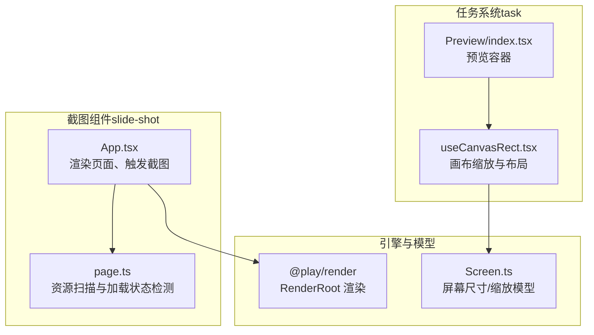
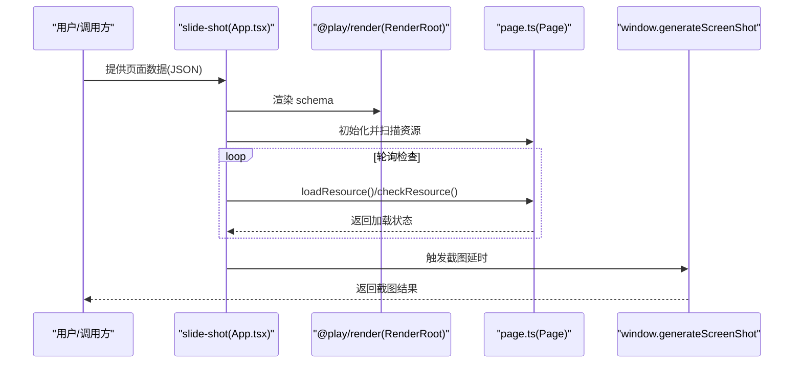
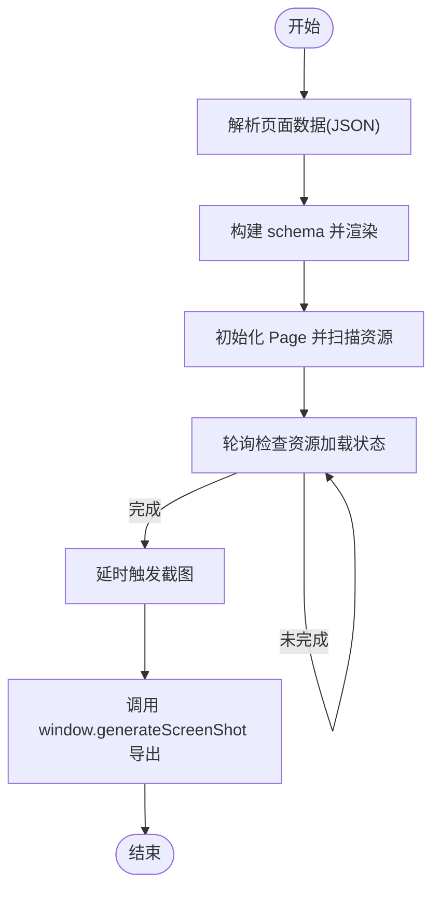
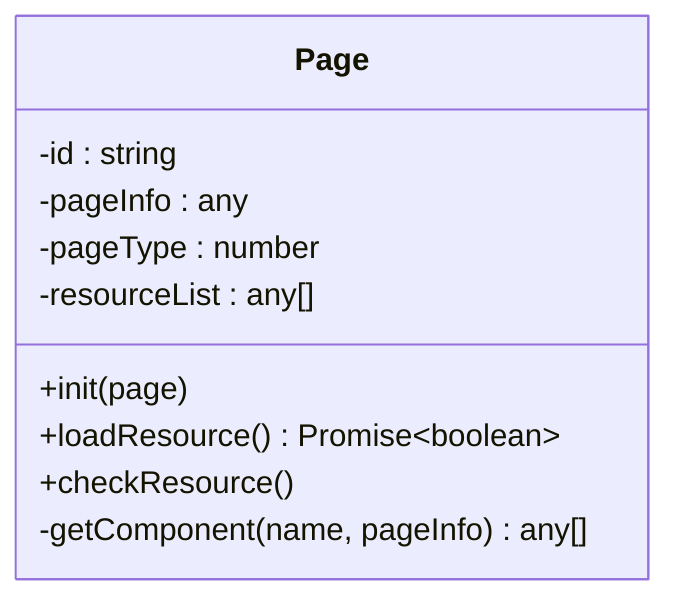
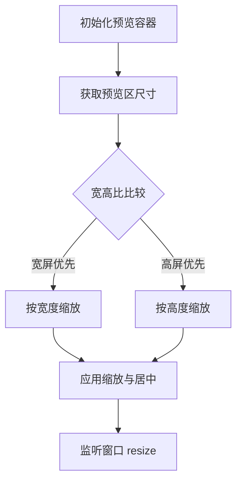
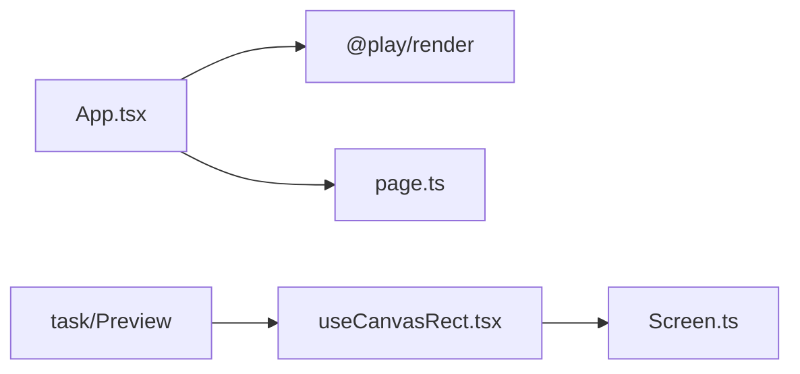

# 截图组件

<cite>
**本文引用的文件**
- [App.tsx](file://common/slide-shot/src/App.tsx)
- [page.ts](file://common/slide-shot/src/page.ts)
- [package.json](file://common/slide-shot/package.json)
- [README.md](file://common/slide-shot/README.md)
- [index.tsx](file://task/src/pages/Main/components/Preview/index.tsx)
- [useCanvasRect.tsx](file://task/src/pages/Main/components/hooks/useCanvasRect.tsx)
- [Screen.ts](file://packages/core/src/models/Screen.ts)
</cite>

## 目录
1. [简介](#简介)
2. [项目结构](#项目结构)
3. [核心组件](#核心组件)
4. [架构总览](#架构总览)
5. [详细组件分析](#详细组件分析)
6. [依赖分析](#依赖分析)
7. [性能考虑](#性能考虑)
8. [故障排查指南](#故障排查指南)
9. [结论](#结论)
10. [附录](#附录)

## 简介
本组件用于在课件预览场景中进行截图，覆盖“课件截图、预览生成、内容保存”等典型需求。其设计目标是：在渲染完成后确保所有资源（如图片、视频封面）已就绪，再触发截图流程；通过延迟与轮询机制保障截图质量；并提供可扩展的截图入口，便于集成到编辑器或任务系统中。

## 项目结构
- 组件位于 common/slide-shot，采用 React + Vite 构建，依赖 @play/render 进行页面渲染。
- 任务系统（task）中提供预览容器与画布缩放控制，为截图提供稳定的 DOM 基础。
- 截图流程的关键点在于：等待资源加载完成 → 触发外部截图函数 → 导出结果。

**图表来源**
- [App.tsx:1-272](file://common/slide-shot/src/App.tsx#L1-L272)
- [page.ts:1-92](file://common/slide-shot/src/page.ts#L1-L92)
- [index.tsx:1-21](file://task/src/pages/Main/components/Preview/index.tsx#L1-L21)
- [useCanvasRect.tsx:1-90](file://task/src/pages/Main/components/hooks/useCanvasRect.tsx#L1-L90)
- [Screen.ts:1-83](file://packages/core/src/models/Screen.ts#L1-L83)

**章节来源**
- [App.tsx:1-272](file://common/slide-shot/src/App.tsx#L1-L272)
- [page.ts:1-92](file://common/slide-shot/src/page.ts#L1-L92)
- [package.json:1-33](file://common/slide-shot/package.json#L1-L33)
- [README.md:1-31](file://common/slide-shot/README.md#L1-L31)
- [index.tsx:1-21](file://task/src/pages/Main/components/Preview/index.tsx#L1-L21)
- [useCanvasRect.tsx:1-90](file://task/src/pages/Main/components/hooks/useCanvasRect.tsx#L1-L90)
- [Screen.ts:1-83](file://packages/core/src/models/Screen.ts#L1-L83)

## 核心组件
- 页面渲染与截图触发
  - 通过 @play/render 的 RenderRoot 渲染 schema，挂载自定义组件 Resource 负责资源加载与截图触发。
  - 在资源加载完成后，读取背景图或图片元素，确认加载完成后再调用 window.generateScreenShot 触发截图。
- 资源加载状态检测
  - Page 类负责扫描页面中的图片/视频组件，维护 loaded 状态，并通过轮询检查 img.complete 判断是否加载完成。
- 预览与画布布局
  - 任务系统提供 Preview 容器与 useCanvasRect 钩子，控制画布缩放与居中，保证截图区域稳定。

**章节来源**
- [App.tsx:140-187](file://common/slide-shot/src/App.tsx#L140-L187)
- [page.ts:53-90](file://common/slide-shot/src/page.ts#L53-L90)
- [index.tsx:1-21](file://task/src/pages/Main/components/Preview/index.tsx#L1-L21)
- [useCanvasRect.tsx:12-89](file://task/src/pages/Main/components/hooks/useCanvasRect.tsx#L12-L89)

## 架构总览
截图组件的整体工作流如下：
- 初始化：解析传入的页面数据，构建 schema 并渲染。
- 资源准备：扫描页面组件，记录待加载资源；轮询检查加载状态。
- 截图触发：当资源全部就绪后，延时触发 window.generateScreenShot。
- 结果输出：由外部实现负责将当前画布内容导出为图片。

**图表来源**
- [App.tsx:140-187](file://common/slide-shot/src/App.tsx#L140-L187)
- [page.ts:53-90](file://common/slide-shot/src/page.ts#L53-L90)

## 详细组件分析

### 组件 A：App.tsx（渲染与截图触发）
- 职责
  - 解析页面数据，构建 schema 并渲染。
  - 通过 Resource 子组件等待资源加载完成，再触发截图。
  - 处理背景图与资源映射，确保截图可见。
- 关键流程
  - 数据准备：从 window.json 解析页面结构，提取资源列表并映射 CDN 地址。
  - 渲染：RenderRoot 渲染 schema，注入自定义组件与全局配置。
  - 资源加载：Resource 组件初始化 Page 实例，扫描 Img/Video 组件，轮询检查加载状态。
  - 截图：资源就绪后延时调用 window.generateScreenShot。

**图表来源**
- [App.tsx:140-187](file://common/slide-shot/src/App.tsx#L140-L187)
- [page.ts:53-90](file://common/slide-shot/src/page.ts#L53-L90)

**章节来源**
- [App.tsx:1-272](file://common/slide-shot/src/App.tsx#L1-L272)

### 组件 B：page.ts（资源扫描与加载检测）
- 职责
  - 扫描页面中的指定组件类型（如 Img/Video），记录加载状态。
  - 提供轮询接口，检查 img.complete 或空缺资源，判断是否全部加载完成。
- 设计要点
  - 递归遍历页面树，收集符合条件的组件节点。
  - 通过 DOM 查询对应元素，判断图片是否加载完成。
  - 以固定间隔轮询，避免阻塞主线程。

**图表来源**
- [page.ts:1-92](file://common/slide-shot/src/page.ts#L1-L92)

**章节来源**
- [page.ts:1-92](file://common/slide-shot/src/page.ts#L1-L92)

### 组件 C：任务系统预览（Preview 与 useCanvasRect）
- 职责
  - 提供预览容器与画布缩放控制，确保截图区域大小与比例稳定。
- 关键点
  - 计算容器尺寸与缩放比例，设置 transform 缩放内容。
  - 监听窗口 resize，动态调整布局。

**图表来源**
- [useCanvasRect.tsx:57-89](file://task/src/pages/Main/components/hooks/useCanvasRect.tsx#L57-L89)

**章节来源**
- [index.tsx:1-21](file://task/src/pages/Main/components/Preview/index.tsx#L1-L21)
- [useCanvasRect.tsx:1-90](file://task/src/pages/Main/components/hooks/useCanvasRect.tsx#L1-L90)
- [Screen.ts:1-83](file://packages/core/src/models/Screen.ts#L1-L83)

## 依赖分析
- 内部依赖
  - @play/render：负责将 schema 渲染为页面，提供 RenderRoot。
  - 自定义组件 Resource：负责资源加载与截图触发。
- 外部依赖
  - 任务系统（task）：提供预览容器与画布缩放钩子，保证截图稳定性。
- 版本与脚手架
  - 使用 Vite + React + TypeScript 构建，遵循现代前端工程实践。

**图表来源**
- [App.tsx:1-272](file://common/slide-shot/src/App.tsx#L1-L272)
- [page.ts:1-92](file://common/slide-shot/src/page.ts#L1-L92)
- [index.tsx:1-21](file://task/src/pages/Main/components/Preview/index.tsx#L1-L21)
- [useCanvasRect.tsx:1-90](file://task/src/pages/Main/components/hooks/useCanvasRect.tsx#L1-L90)
- [Screen.ts:1-83](file://packages/core/src/models/Screen.ts#L1-L83)

**章节来源**
- [package.json:1-33](file://common/slide-shot/package.json#L1-L33)

## 性能考虑
- 轮询策略
  - 采用固定间隔轮询检查资源加载状态，避免频繁重绘与阻塞主线程。
- 延迟触发
  - 在资源就绪后增加短延迟再触发截图，确保最终渲染完成。
- 画布缩放
  - 通过 transform 缩放内容而非改变真实尺寸，降低重排成本。
- 资源映射
  - 将背景图与资源列表映射到 CDN，减少跨域与网络抖动对截图的影响。

**章节来源**
- [page.ts:53-90](file://common/slide-shot/src/page.ts#L53-L90)
- [App.tsx:140-187](file://common/slide-shot/src/App.tsx#L140-L187)
- [useCanvasRect.tsx:12-89](file://task/src/pages/Main/components/hooks/useCanvasRect.tsx#L12-L89)

## 故障排查指南
- 截图为空或部分缺失
  - 检查资源是否全部加载完成（轮询返回 true）。
  - 确认背景图与资源映射路径正确。
- 截图比例异常
  - 检查预览容器尺寸与缩放逻辑，确保 transform 缩放一致。
- 截图时机过早
  - 增加延时或提升轮询频率，确保最终渲染完成。
- 外部截图函数未定义
  - 确保 window.generateScreenShot 已在运行环境中定义并可用。

**章节来源**
- [App.tsx:140-187](file://common/slide-shot/src/App.tsx#L140-L187)
- [page.ts:53-90](file://common/slide-shot/src/page.ts#L53-L90)
- [useCanvasRect.tsx:12-89](file://task/src/pages/Main/components/hooks/useCanvasRect.tsx#L12-L89)

## 结论
该截图组件通过“渲染 + 资源检测 + 延迟触发”的方式，在保证截图质量的同时，具备良好的可扩展性。结合任务系统的画布缩放与布局控制，能够稳定地生成高质量的课件截图，满足预览与保存场景的需求。

## 附录

### 使用方法与参数说明
- 截图区域选择
  - 通过预览容器与缩放钩子确定截图区域，确保包含所有关键元素。
- 图像质量设置
  - 可在外部截图实现中配置导出质量参数（例如 JPEG 压缩率、PNG 无损等）。
- 导出格式配置
  - 支持 PNG/JPEG 等常见格式，具体取决于外部实现。

### 实际应用示例
- 自动截图
  - 在资源加载完成后自动触发 window.generateScreenShot。
- 手动截图
  - 通过按钮或快捷键触发截图流程。
- 批量处理
  - 循环渲染多个页面 schema，逐个触发截图并保存。

### 兼容性与浏览器支持
- 依赖现代浏览器的 Canvas API 与 DOM 查询能力。
- 对于旧版浏览器，需提供必要的 polyfill 与降级方案（如 Promise、fetch、Canvas API 兼容库）。

### 扩展开发指南
- 自定义截图入口
  - 在 App.tsx 中扩展 Resource 组件，增加更多触发条件或回调。
- 自定义图像处理
  - 在 window.generateScreenShot 中加入裁剪、水印、格式转换等逻辑。
- 性能优化建议
  - 合理设置轮询间隔与延时，避免过度占用主线程。
  - 对大图资源进行懒加载与缓存，减少重复请求。