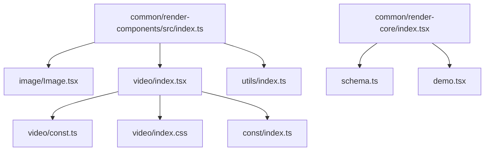
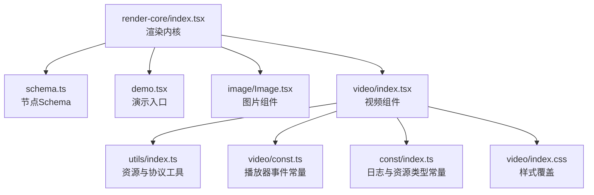
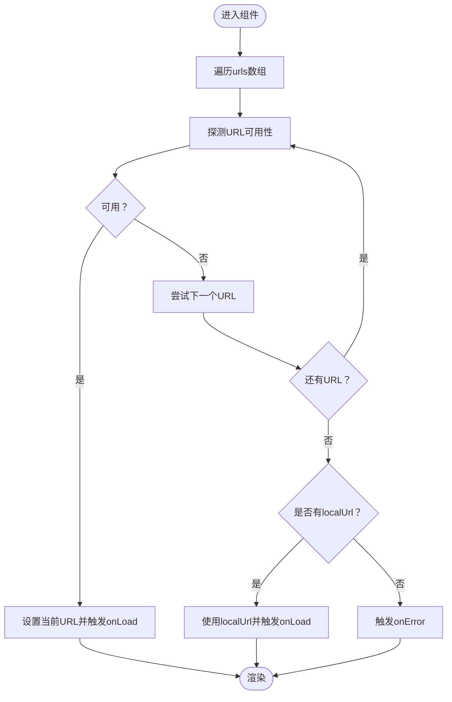
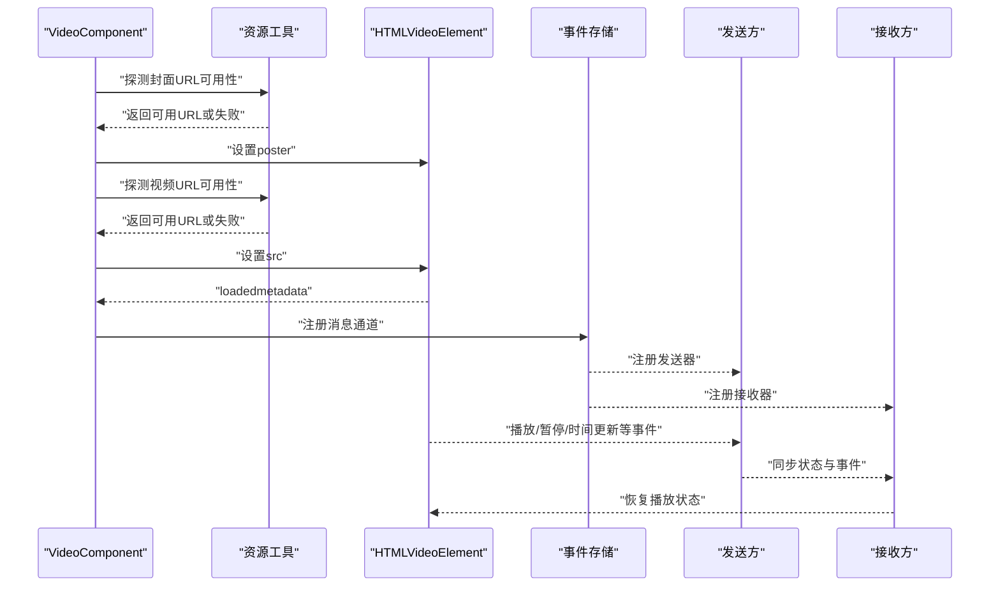
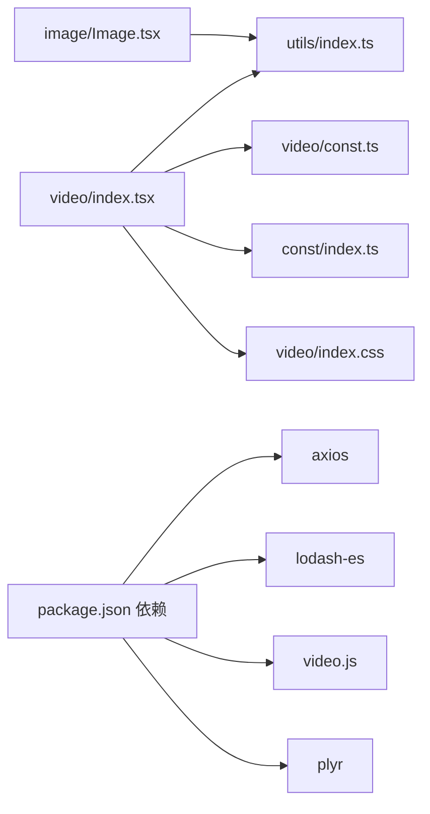

# 渲染组件库

<cite>
**本文引用的文件**
- [common/render-components/src/index.ts](file://common/render-components/src/index.ts)
- [common/render-components/src/image/Image.tsx](file://common/render-components/src/image/Image.tsx)
- [common/render-components/src/image/type.ts](file://common/render-components/src/image/type.ts)
- [common/render-components/src/video/index.tsx](file://common/render-components/src/video/index.tsx)
- [common/render-components/src/video/type.ts](file://common/render-components/src/video/type.ts)
- [common/render-components/src/video/const.ts](file://common/render-components/src/video/const.ts)
- [common/render-components/src/video/index.css](file://common/render-components/src/video/index.css)
- [common/render-components/src/utils/index.ts](file://common/render-components/src/utils/index.ts)
- [common/render-components/src/const/index.ts](file://common/render-components/src/const/index.ts)
- [common/render-components/package.json](file://common/render-components/package.json)
- [common/render-core/index.tsx](file://common/render-core/index.tsx)
- [common/render-core/schema.ts](file://common/render-core/schema.ts)
- [common/render-core/demo.tsx](file://common/render-core/demo.tsx)
</cite>

## 目录
1. [简介](#简介)
2. [项目结构](#项目结构)
3. [核心组件](#核心组件)
4. [架构总览](#架构总览)
5. [组件详解](#组件详解)
6. [依赖关系分析](#依赖关系分析)
7. [性能考量](#性能考量)
8. [故障排查指南](#故障排查指南)
9. [结论](#结论)
10. [附录](#附录)

## 简介
本渲染组件库面向富页面与课件场景，提供图片与视频两类渲染组件，强调：
- 资源容错与多链路加载（本地优先、远程回退）
- 视频播放控制、状态同步与事件上报
- 通用属性与事件处理机制
- 性能优化策略（懒加载、缓存与内存管理）
- 错误处理与兼容性处理

## 项目结构
渲染组件库位于 common/render-components，核心导出入口统一从 index.ts 导出图片与视频组件及工具方法；视频组件内部引入样式与常量定义；图片组件依赖通用工具进行资源可用性检测。

**图表来源**
- [common/render-components/src/index.ts:1-3](file://common/render-components/src/index.ts#L1-L3)
- [common/render-components/src/image/Image.tsx:1-48](file://common/render-components/src/image/Image.tsx#L1-L48)
- [common/render-components/src/video/index.tsx:1-472](file://common/render-components/src/video/index.tsx#L1-L472)
- [common/render-components/src/video/const.ts:1-28](file://common/render-components/src/video/const.ts#L1-L28)
- [common/render-components/src/video/index.css:1-4](file://common/render-components/src/video/index.css#L1-L4)
- [common/render-components/src/const/index.ts:1-29](file://common/render-components/src/const/index.ts#L1-L29)
- [common/render-core/index.tsx:1-76](file://common/render-core/index.tsx#L1-L76)
- [common/render-core/schema.ts:1-145](file://common/render-core/schema.ts#L1-L145)
- [common/render-core/demo.tsx:1-33](file://common/render-core/demo.tsx#L1-L33)

**章节来源**
- [common/render-components/src/index.ts:1-3](file://common/render-components/src/index.ts#L1-L3)
- [common/render-components/package.json:1-23](file://common/render-components/package.json#L1-L23)

## 核心组件
- 图片组件：支持多URL容错加载、错误回退、本地/远程优先策略、加载与错误事件回调。
- 视频组件：基于 video.js/plyr 的播放器封装，支持封面图与视频源的多链路选择、自动播放控制、播放状态与事件的跨端同步、埋点上报、以及 iOS 兼容处理。

**章节来源**
- [common/render-components/src/image/Image.tsx:12-48](file://common/render-components/src/image/Image.tsx#L12-L48)
- [common/render-components/src/video/index.tsx:16-472](file://common/render-components/src/video/index.tsx#L16-L472)

## 架构总览
渲染组件库与渲染内核协同工作：渲染内核负责根据 schema 渲染组件树，渲染组件库提供具体组件实现与工具方法。

**图表来源**
- [common/render-core/index.tsx:1-76](file://common/render-core/index.tsx#L1-L76)
- [common/render-core/schema.ts:1-145](file://common/render-core/schema.ts#L1-L145)
- [common/render-core/demo.tsx:1-33](file://common/render-core/demo.tsx#L1-L33)
- [common/render-components/src/image/Image.tsx:1-48](file://common/render-components/src/image/Image.tsx#L1-L48)
- [common/render-components/src/video/index.tsx:1-472](file://common/render-components/src/video/index.tsx#L1-L472)
- [common/render-components/src/utils/index.ts:1-236](file://common/render-components/src/utils/index.ts#L1-L236)
- [common/render-components/src/video/const.ts:1-28](file://common/render-components/src/video/const.ts#L1-L28)
- [common/render-components/src/const/index.ts:1-29](file://common/render-components/src/const/index.ts#L1-L29)
- [common/render-components/src/video/index.css:1-4](file://common/render-components/src/video/index.css#L1-L4)

## 组件详解

### 图片组件（ImageComponent）
- 设计目标
  - 在多候选URL中按序探测可用资源，优先本地、其次远程，提升加载成功率与稳定性。
  - 提供加载完成与错误回调，便于上层统计与降级处理。
- 关键能力
  - 多URL容错加载：逐个校验URL可达性，成功即停止并触发onLoad。
  - 错误回退：当前URL不可用时自动尝试下一个URL，直至耗尽或成功。
  - 本地资源兜底：支持传入localUrl作为最终兜底。
  - 事件回调：onLoad与onError分别在成功与失败时触发。
- 通用属性与事件
  - 属性：urls（字符串数组）、localUrl（可选）、style（样式对象）、onLoad（成功回调）、onError（错误回调）。
  - 事件：组件内部在img元素上绑定onLoad与onError，向上抛出对应事件。
- 使用示例
  - 基础用法：传入urls数组与onLoad/onError，组件自动选择可用URL并渲染。
  - 高级配置：结合全局配置与资源列表，动态生成urls；在onError中进行二次容错或上报。
  - 自定义样式：通过style传入宽高、边距等CSS属性。
- 性能与兼容
  - 资源探测采用HEAD请求并带超时与重试，避免阻塞主线程。
  - 仅在有可用URL时渲染img，减少无效DOM节点。
- 错误处理
  - 当所有候选URL均不可用时，触发onError；建议在上层进行降级或提示。

**图表来源**
- [common/render-components/src/image/Image.tsx:15-34](file://common/render-components/src/image/Image.tsx#L15-L34)
- [common/render-components/src/utils/index.ts:129-157](file://common/render-components/src/utils/index.ts#L129-L157)

**章节来源**
- [common/render-components/src/image/Image.tsx:12-48](file://common/render-components/src/image/Image.tsx#L12-L48)
- [common/render-components/src/image/type.ts:3-32](file://common/render-components/src/image/type.ts#L3-L32)
- [common/render-components/src/utils/index.ts:129-157](file://common/render-components/src/utils/index.ts#L129-L157)

### 视频组件（VideoComponent）
- 设计目标
  - 提供稳定、可控的视频播放体验，支持封面图与视频源的多链路选择、自动播放策略、跨端状态同步与事件上报。
- 实现要点
  - 多链路资源选择：先取本地路径，再拼接CDN路径，形成候选URL序列，逐一探测可用性。
  - 封面图与视频源：分别维护posterIndexRef与sourceIndexRef，失败时轮询下一链路。
  - 自动播放控制：根据角色（sender/edit/preview）与页面可见性、先导课模式决定是否自动播放。
  - 状态同步与事件上报：监听播放器事件，周期性上报状态；接收远端指令恢复播放状态。
  - iOS兼容：截断视频时长以规避最后一帧黑屏问题。
- 通用属性与事件
  - 属性：useEventStore、id、mode、pageId、style、title、children、setDefaultValue、src、globalConfig、globalProps、info、activePageId、sendLog等。
  - 事件：播放、暂停、结束、全屏、音量变化、拖拽完成、时间更新等，均通过常量集合定义。
- 使用示例
  - 基础用法：传入src与资源列表，组件自动选择可用封面与视频源并渲染。
  - 高级配置：结合全局配置与资源数据，动态生成urls；在sendLog中记录加载与事件。
  - 自定义样式：通过style传入容器宽高与布局样式。
- 性能与兼容
  - 节流上报：时间更新事件采用节流，降低频繁上报带来的开销。
  - iOS兼容：截断时长并禁用原生全屏按钮，避免黑屏与UI冲突。
- 错误处理
  - 资源加载失败时记录埋点并尝试切换链路；若全部失败，需在上层进行提示或降级。

**图表来源**
- [common/render-components/src/video/index.tsx:340-375](file://common/render-components/src/video/index.tsx#L340-L375)
- [common/render-components/src/video/index.tsx:341-355](file://common/render-components/src/video/index.tsx#L341-L355)
- [common/render-components/src/video/index.tsx:438-455](file://common/render-components/src/video/index.tsx#L438-L455)
- [common/render-components/src/video/const.ts:1-28](file://common/render-components/src/video/const.ts#L1-L28)

**章节来源**
- [common/render-components/src/video/index.tsx:16-472](file://common/render-components/src/video/index.tsx#L16-L472)
- [common/render-components/src/video/type.ts:2-29](file://common/render-components/src/video/type.ts#L2-L29)
- [common/render-components/src/video/const.ts:1-28](file://common/render-components/src/video/const.ts#L1-L28)
- [common/render-components/src/video/index.css:1-4](file://common/render-components/src/video/index.css#L1-L4)
- [common/render-components/src/utils/index.ts:159-208](file://common/render-components/src/utils/index.ts#L159-L208)

## 依赖关系分析
- 组件依赖
  - 图片组件依赖工具模块进行资源探测。
  - 视频组件依赖工具模块进行资源探测、时长获取与URL拼装，依赖常量定义事件集合与日志枚举，依赖样式覆盖全屏按钮。
- 外部依赖
  - axios：用于HEAD探测资源可用性。
  - lodash-es：提供节流工具。
  - video.js/plyr：提供播放器能力（视频组件内部引入）。

**图表来源**
- [common/render-components/src/image/Image.tsx:1-48](file://common/render-components/src/image/Image.tsx#L1-L48)
- [common/render-components/src/video/index.tsx:1-472](file://common/render-components/src/video/index.tsx#L1-L472)
- [common/render-components/src/utils/index.ts:1-236](file://common/render-components/src/utils/index.ts#L1-L236)
- [common/render-components/src/video/const.ts:1-28](file://common/render-components/src/video/const.ts#L1-L28)
- [common/render-components/src/const/index.ts:1-29](file://common/render-components/src/const/index.ts#L1-L29)
- [common/render-components/src/video/index.css:1-4](file://common/render-components/src/video/index.css#L1-L4)
- [common/render-components/package.json:13-21](file://common/render-components/package.json#L13-L21)

**章节来源**
- [common/render-components/package.json:13-21](file://common/render-components/package.json#L13-L21)

## 性能考量
- 懒加载与延迟初始化
  - 视频组件在非当前页时重置currentTime并暂停，减少后台消耗；自动播放仅在当前页且满足条件时启用。
- 资源探测与重试
  - 图片与视频均采用HEAD探测，支持超时与重试参数，避免长时间阻塞。
- 节流与批量上报
  - 时间更新事件采用节流，降低上报频率与计算开销。
- 内存管理
  - 组件卸载时移除事件监听，避免内存泄漏；播放器实例在必要时重置状态。
- 缓存与CDN
  - 通过多CDN链路与本地路径组合，提升命中率与加载速度；建议上层配合浏览器缓存策略。

**章节来源**
- [common/render-components/src/video/index.tsx:63-77](file://common/render-components/src/video/index.tsx#L63-L77)
- [common/render-components/src/video/index.tsx:152-167](file://common/render-components/src/video/index.tsx#L152-L167)
- [common/render-components/src/utils/index.ts:129-157](file://common/render-components/src/utils/index.ts#L129-L157)

## 故障排查指南
- 图片无法加载
  - 检查urls数组是否为空或全部不可用；确认localUrl是否正确传入；查看onError回调中的错误信息。
  - 参考资源探测与错误回退流程。
- 视频无法播放
  - 确认src与资源列表匹配；检查封面与视频源的探测结果；查看自动播放策略是否启用。
  - 关注页面可见性与先导课模式对自动播放的影响。
- 事件不同步
  - 确认事件存储已注册发送与接收器；检查节流阈值与上报时机。
- iOS黑屏或全屏异常
  - 确认时长截断逻辑与样式覆盖已生效；避免原生全屏按钮冲突。

**章节来源**
- [common/render-components/src/image/Image.tsx:28-34](file://common/render-components/src/image/Image.tsx#L28-L34)
- [common/render-components/src/video/index.tsx:80-97](file://common/render-components/src/video/index.tsx#L80-L97)
- [common/render-components/src/video/index.tsx:104-118](file://common/render-components/src/video/index.tsx#L104-L118)
- [common/render-components/src/video/index.css:1-4](file://common/render-components/src/video/index.css#L1-L4)

## 结论
渲染组件库通过“本地优先、远程回退”的资源策略与完善的事件同步机制，为富页面与课件场景提供了稳定可靠的图片与视频渲染能力。配合性能优化与兼容性处理，可在复杂网络环境下保持良好的用户体验。

## 附录
- 组件使用参考
  - 渲染内核与Schema：参考渲染内核入口与Schema定义，了解组件如何被渲染与挂载。
  - 示例入口：参考渲染内核demo，快速验证组件渲染效果。

**章节来源**
- [common/render-core/index.tsx:67-76](file://common/render-core/index.tsx#L67-L76)
- [common/render-core/schema.ts:42-121](file://common/render-core/schema.ts#L42-L121)
- [common/render-core/demo.tsx:14-31](file://common/render-core/demo.tsx#L14-L31)