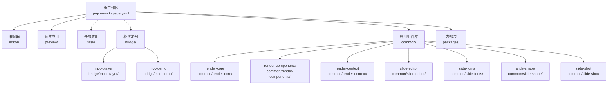
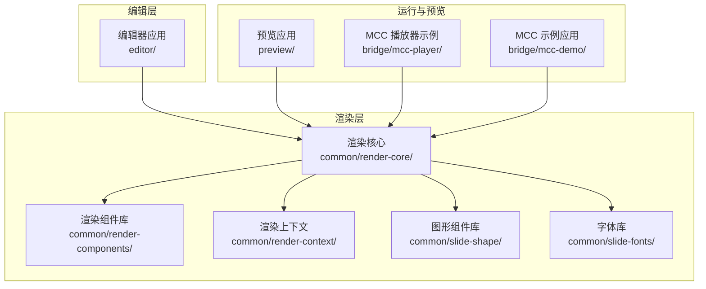
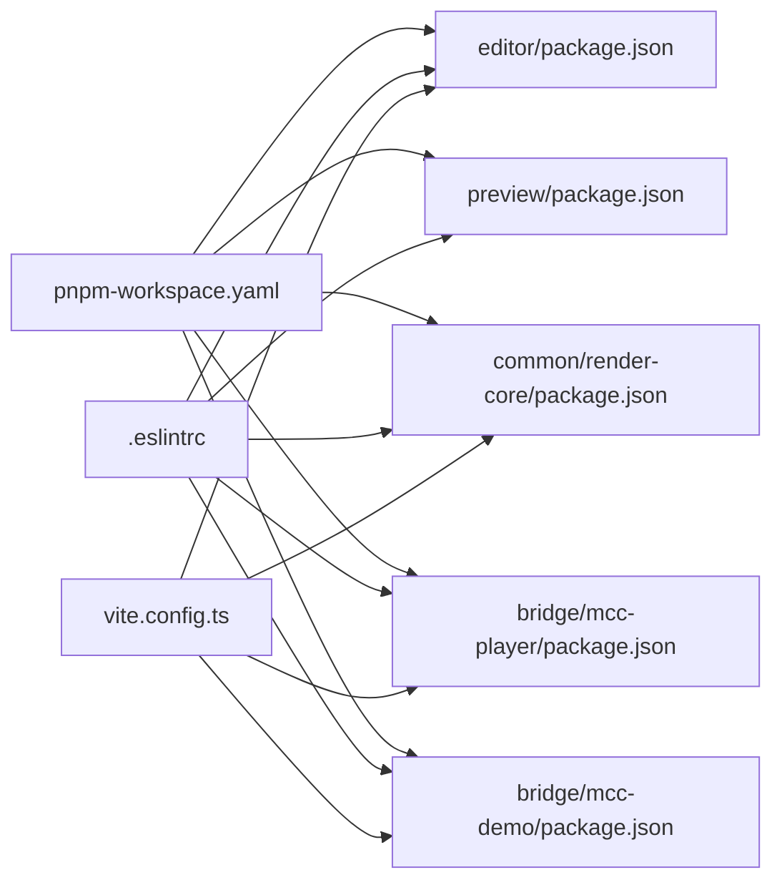

# 开发指南

<cite>
**本文引用的文件**
- [package.json](file://package.json)
- [pnpm-workspace.yaml](file://pnpm-workspace.yaml)
- [vite.config.ts](file://vite.config.ts)
- [tsconfig.json](file://tsconfig.json)
- [.eslintrc](file://.eslintrc)
- [bridge/mcc-player/package.json](file://bridge/mcc-player/package.json)
- [bridge/mcc-player/vite.config.ts](file://bridge/mcc-player/vite.config.ts)
- [bridge/mcc-demo/package.json](file://bridge/mcc-demo/package.json)
- [bridge/mcc-demo/vite.config.ts](file://bridge/mcc-demo/vite.config.ts)
- [common/render-core/package.json](file://common/render-core/package.json)
- [common/render-core/vite.config.ts](file://common/render-core/vite.config.ts)
- [preview/package.json](file://preview/package.json)
</cite>

## 目录
1. [简介](#简介)
2. [项目结构](#项目结构)
3. [核心组件](#核心组件)
4. [架构总览](#架构总览)
5. [详细组件分析](#详细组件分析)
6. [依赖分析](#依赖分析)
7. [性能考虑](#性能考虑)
8. [故障排除指南](#故障排除指南)
9. [结论](#结论)
10. [附录](#附录)

## 简介
本开发指南面向 Slides Engine 项目的开发者与维护者，覆盖开发环境搭建、IDE 配置建议、调试工具与开发服务器使用、开发规范与编码标准、调试技巧与性能优化、测试策略与质量保证流程、版本控制与发布流程，以及常见问题的诊断与解决方案。文档以仓库现有配置与脚本为基础，结合多包工作区（pnpm workspaces）组织方式，帮助团队快速达成一致的开发体验与交付质量。

## 项目结构
Slides Engine 采用 monorepo 多包工作区组织，根目录通过 pnpm 工作区声明多个子包，包括编辑器、渲染核心、预览、桥接示例等模块。各子包拥有独立的构建配置与脚本，便于按需启动与开发。

图表来源
- [pnpm-workspace.yaml:1-7](file://pnpm-workspace.yaml#L1-L7)

章节来源
- [pnpm-workspace.yaml:1-7](file://pnpm-workspace.yaml#L1-L7)

## 核心组件
- 多包工作区与脚本
  - 根 package.json 声明工作区与常用脚本，如 play、preview、render-core、mcc-player、mcc-demo 的本地开发命令。
  - 各子包 package.json 提供独立的构建、预览、上传、热更新等脚本，便于模块化开发与发布。
- 构建与开发服务器
  - Vite React 配置统一，部分子包自定义了别名、服务端口、构建产物目录与 sourcemap 等。
  - Webpack 配置存在于 preview 应用，包含 Jest 测试、Babel 转换、Source Map 等。
- 规范与工具链
  - ESLint 与 TypeScript ESLint 插件启用，规则覆盖 React、TS、Prettier，部分文件类型（Markdown）有专门覆盖规则。
  - Husky 预安装钩子，配合 Commitlint 使用（配置文件存在但未在仓库中展示）。

章节来源
- [package.json:1-58](file://package.json#L1-L58)
- [vite.config.ts:1-8](file://vite.config.ts#L1-L8)
- [tsconfig.json:1-21](file://tsconfig.json#L1-L21)
- [.eslintrc:1-64](file://.eslintrc#L1-L64)

## 架构总览
整体由“编辑器”“渲染核心”“预览应用”“桥接示例”“通用组件库”“内部包”组成。编辑器负责内容创作与页面管理；渲染核心提供可复用的渲染组件与上下文；预览应用用于演示与验证；桥接示例展示如何接入外部运行时或游戏引擎；通用组件库沉淀通用 UI 与业务组件；内部包承载共享类型与工具。

图表来源
- [common/render-core/package.json:1-33](file://common/render-core/package.json#L1-L33)
- [preview/package.json:1-168](file://preview/package.json#L1-L168)
- [bridge/mcc-player/package.json:1-72](file://bridge/mcc-player/package.json#L1-L72)
- [bridge/mcc-demo/package.json:1-39](file://bridge/mcc-demo/package.json#L1-L39)

## 详细组件分析

### 编辑器应用（editor）
- 功能定位：演示与编辑 Slides 内容，提供资源管理、组件设置、页面树等能力。
- 关键特性：
  - 通过 Vite 启动开发服务器，支持多模式构建与热更新。
  - 依赖渲染核心与通用组件库，形成“编辑器 -> 渲染核心 -> 组件库”的依赖链。
  - 提供字体复制脚本与 PWA 相关插件，便于离线与缓存优化。
- 开发与调试：
  - 使用 Vite 开发服务器，端口与主机可通过子包配置调整。
  - 可结合浏览器开发者工具进行断点调试与网络监控。
- 发布与热更新：
  - 支持版本设置、构建与热更新脚本，便于灰度与线上发布。

章节来源
- [editor/package.json:1-64](file://editor/package.json#L1-L64)

### 渲染核心（common/render-core）
- 功能定位：提供可复用的渲染组件、上下文与模型，作为编辑器与预览的基础。
- 关键特性：
  - 通过 Vite demo 启动演示页面，便于组件验证。
  - 依赖通用组件库与动画库，形成组件复用闭环。
- 开发与调试：
  - 使用 Vite demo 路径进行本地验证，结合组件 Storybook 或示例页面进行交互测试。
- 性能优化：
  - 通过拆分与懒加载减少首屏体积，结合 Source Map 定位性能热点。

章节来源
- [common/render-core/package.json:1-33](file://common/render-core/package.json#L1-L33)
- [common/render-core/vite.config.ts:1-11](file://common/render-core/vite.config.ts#L1-L11)

### 预览应用（preview）
- 功能定位：独立的预览页面，验证渲染结果与交互效果。
- 关键特性：
  - 使用 Webpack 与 Jest 进行构建与测试，支持 Source Map 与覆盖率收集。
  - 配置了 Babel、PostCSS、Tailwind 等生态工具，满足样式与兼容性需求。
- 测试策略：
  - Jest 配置覆盖源码路径、测试匹配规则、环境与转换器，确保前端测试一致性。
- 发布流程：
  - 提供构建、上传、更新与打包脚本，支持生产与测试环境区分。

章节来源
- [preview/package.json:1-168](file://preview/package.json#L1-L168)

### 桥接示例（bridge/mcc-player 与 bridge/mcc-demo）
- 功能定位：演示如何在不同运行时（如 MCC）中集成 Slides Engine 的播放与渲染能力。
- 关键特性：
  - mcc-player：自定义构建输出目录、sourcemap、严格端口与主机绑定，便于内网联调。
  - mcc-demo：集成 React、Legacy 兼容、AutoImport、组件自动注册等插件，提升开发效率。
- 开发与调试：
  - 通过各自 Vite 配置启动开发服务器，结合浏览器与 Node 调试工具定位问题。
- 发布与热更新：
  - 提供构建、上传、热更新与替换文件脚本，支持多环境发布。

章节来源
- [bridge/mcc-player/package.json:1-72](file://bridge/mcc-player/package.json#L1-L72)
- [bridge/mcc-player/vite.config.ts:1-31](file://bridge/mcc-player/vite.config.ts#L1-L31)
- [bridge/mcc-demo/package.json:1-39](file://bridge/mcc-demo/package.json#L1-L39)
- [bridge/mcc-demo/vite.config.ts:1-50](file://bridge/mcc-demo/vite.config.ts#L1-L50)

### 通用组件库（common/*）
- 功能定位：沉淀通用 UI 组件、上下文、形状与字体等，供编辑器与渲染核心复用。
- 关键特性：
  - render-components、render-context、slide-shape、slide-fonts 等模块化封装。
  - 通过工作区版本前缀（workspace:^）实现版本对齐与增量升级。
- 开发与调试：
  - 在 render-core 的 demo 中引入验证，或单独启动各模块的 demo 页面。

章节来源
- [common/render-core/package.json:1-33](file://common/render-core/package.json#L1-L33)

## 依赖分析
- 工作区与版本管理
  - pnpm-workspace.yaml 声明工作区范围，确保跨包依赖解析与版本对齐。
  - 各子包通过 workspace 前缀引用内部包，避免重复安装与版本漂移。
- 构建工具链
  - Vite 作为主要开发与构建工具，统一 React 与 TS/TSX 支持。
  - preview 使用 Webpack 与 Jest，覆盖测试与 Source Map 场景。
- 规范与质量
  - ESLint 与 TypeScript ESLint 插件开启，规则覆盖 React、TS、Prettier。
  - 部分文件类型（如 Markdown）有专门覆盖规则，降低噪音与提升一致性。

图表来源
- [pnpm-workspace.yaml:1-7](file://pnpm-workspace.yaml#L1-L7)
- [.eslintrc:1-64](file://.eslintrc#L1-L64)
- [vite.config.ts:1-8](file://vite.config.ts#L1-L8)

章节来源
- [pnpm-workspace.yaml:1-7](file://pnpm-workspace.yaml#L1-L7)
- [.eslintrc:1-64](file://.eslintrc#L1-L64)
- [vite.config.ts:1-8](file://vite.config.ts#L1-L8)

## 性能考虑
- 构建与打包
  - 合理配置 sourcemap 与产物目录，平衡调试成本与体积。
  - 对于大型应用（如 preview），优先使用 Source Map 与代码分割，减少首屏加载时间。
- 运行时优化
  - 在编辑器与渲染核心中避免不必要的重渲染，结合 React DevTools 分析组件更新。
  - 对图片、视频等静态资源进行压缩与懒加载，减少带宽占用。
- 调试与分析
  - 使用浏览器性能面板与内存快照定位卡顿与内存泄漏。
  - 结合 Source Map 与断点调试，定位异步逻辑与事件循环中的性能瓶颈。

## 故障排除指南
- 开发服务器无法启动
  - 检查端口占用与 host 绑定，必要时调整子包 Vite 配置中的 server.port/host。
  - 若使用严格端口，确保端口未被占用。
- 构建失败或产物异常
  - 确认各子包的构建脚本与 Rollup/Vite 配置是否正确。
  - 对于 preview，检查 Webpack 配置与 Jest 转换器是否匹配当前依赖。
- 依赖解析错误
  - 确保 pnpm-workspace.yaml 范围包含相关包，并执行 pnpm install。
  - 检查 workspace 前缀与版本号是否一致。
- Lint 报错
  - 根据 .eslintrc 规则修正未使用变量、TS 类型约束等问题。
  - 对 Markdown 文件的覆盖规则进行针对性修复。

章节来源
- [bridge/mcc-player/vite.config.ts:1-31](file://bridge/mcc-player/vite.config.ts#L1-L31)
- [bridge/mcc-demo/vite.config.ts:1-50](file://bridge/mcc-demo/vite.config.ts#L1-L50)
- [preview/package.json:1-168](file://preview/package.json#L1-L168)
- [.eslintrc:1-64](file://.eslintrc#L1-L64)

## 结论
本指南基于仓库现有配置与脚本，梳理了 Slides Engine 的多包工作区结构、开发与构建工具链、规范与质量保障流程，并提供了调试与性能优化建议。建议团队在日常开发中遵循统一的脚本与配置，持续完善测试与发布流程，以保障交付质量与迭代效率。

## 附录

### 开发环境搭建与 IDE 配置建议
- 包管理器
  - 使用 pnpm 并启用工作区，确保跨包依赖解析与版本对齐。
- 编辑器与插件
  - VSCode 推荐安装 ESLint、Prettier、TypeScript TSServer 插件，启用保存时格式化。
- 调试工具
  - 浏览器开发者工具：断点、网络、性能、内存快照。
  - Node 调试：针对构建脚本与上传/热更新脚本进行断点调试。
- 开发服务器
  - 使用各子包的 dev/preview 脚本启动本地服务，必要时调整端口与 host。

章节来源
- [package.json:1-58](file://package.json#L1-L58)
- [bridge/mcc-player/package.json:1-72](file://bridge/mcc-player/package.json#L1-L72)
- [bridge/mcc-demo/package.json:1-39](file://bridge/mcc-demo/package.json#L1-L39)

### 开发规范与编码标准
- 代码风格
  - 使用 ESLint 与 TypeScript ESLint 插件，遵循 React 与 TS 规范。
- 命名约定
  - 组件与文件采用 PascalCase；常量使用 UPPER_SNAKE_CASE；变量使用 camelCase。
- 注释规范
  - 函数与复杂逻辑添加注释，说明输入、输出与边界条件；公共 API 保持文档清晰。
- 文件类型覆盖
  - Markdown 文件有专门的 ESLint 覆盖规则，降低噪音并保持一致性。

章节来源
- [.eslintrc:1-64](file://.eslintrc#L1-L64)

### 测试策略与质量保证流程
- 单元测试
  - preview 使用 Jest，配置了测试匹配规则、环境与转换器，确保覆盖率与稳定性。
- 集成测试与端到端测试
  - 建议在编辑器与预览应用之间增加 E2E 测试，验证页面渲染与交互一致性。
- 质量门禁
  - 在 CI 中执行 lint、类型检查与测试，失败即阻断合并。

章节来源
- [preview/package.json:108-168](file://preview/package.json#L108-L168)

### 版本控制与发布流程
- Git 工作流
  - 建议采用 feature 分支开发，主分支保护与 PR 审查，提交信息遵循 Conventional Commits。
- 分支管理
  - 主干分支用于稳定发布，功能分支隔离开发，hotfix 分支快速修复。
- 发布策略
  - 使用各子包的 release/build/upload 脚本，区分测试与生产环境，记录版本号与变更日志。

章节来源
- [bridge/mcc-player/package.json:1-72](file://bridge/mcc-player/package.json#L1-L72)
- [bridge/mcc-demo/package.json:1-39](file://bridge/mcc-demo/package.json#L1-L39)
- [preview/package.json:1-168](file://preview/package.json#L1-L168)