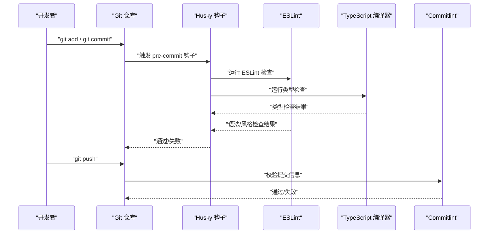
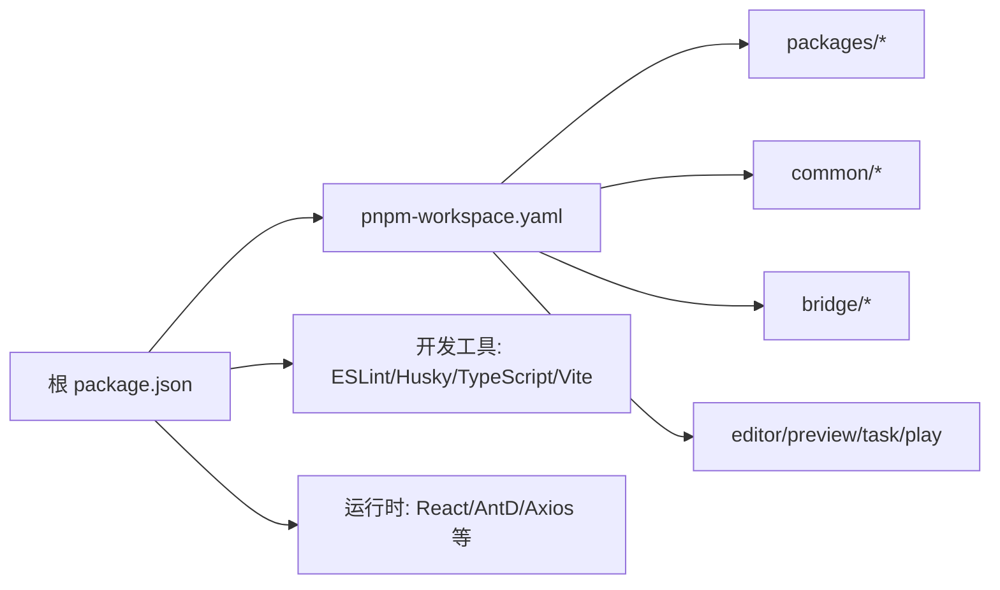

# 开发规范

<cite>
**本文引用的文件**
- [.eslintrc](file://.eslintrc)
- [commitlint.config.cjs](file://commitlint.config.cjs)
- [package.json](file://package.json)
- [pnpm-workspace.yaml](file://pnpm-workspace.yaml)
- [tsconfig.json](file://tsconfig.json)
- [tsconfig.node.json](file://tsconfig.node.json)
- [.gitignore](file://.gitignore)
- [bridge/mcc-player/.eslintrc.cjs](file://bridge/mcc-player/.eslintrc.cjs)
- [common/render-core/.eslintrc.cjs](file://common/render-core/.eslintrc.cjs)
- [task/src/store/models/task.ts](file://task/src/store/models/task.ts)
- [editor/src/utils/common.ts](file://editor/src/utils/common.ts)
- [bridge/cocos-game-player/index.js](file://bridge/cocos-game-player/index.js)
- [bridge/cocos-game-player/application.js](file://bridge/cocos-game-player/application.js)
- [bridge/cocos-game-player/style.css](file://bridge/cocos-game-player/style.css)
- [bridge/cocos-game-player/webgl-debug.js](file://bridge/cocos-game-player/webgl-debug.js)
- [bridge/mcc-demo/vite.config.ts](file://bridge/mcc-demo/vite.config.ts)
- [bridge/mcc-player/vite.config.ts](file://bridge/mcc-player/vite.config.ts)
- [common/render-core/vite.config.ts](file://common/render-core/vite.config.ts)
- [common/slide-editor/vite.config.ts](file://common/slide-editor/vite.config.ts)
- [preview/vite.config.ts](file://preview/vite.config.ts)
- [task/vite.config.ts](file://task/vite.config.ts)
- [play/src/App.tsx](file://play/src/App.tsx)
- [play/src/main.tsx](file://play/src/main.tsx)
- [play/src/vite-env.d.ts](file://play/src/vite-env.d.ts)
- [play/src/components/content.tsx](file://play/src/components/content.tsx)
- [play/src/index.css](file://play/src/index.css)
- [play/src/main.tsx](file://play/src/main.tsx)
- [play/src/vite-env.d.ts](file://play/src/vite-env.d.ts)
- [play/src/App.tsx](file://play/src/App.tsx)
- [play/src/components/content.tsx](file://play/src/components/content.tsx)
- [play/src/index.css](file://play/src/index.css)
- [play/src/main.tsx](file://play/src/main.tsx)
- [play/src/vite-env.d.ts](file://play/src/vite-env.d.ts)
- [play/src/App.tsx](file://play/src/App.tsx)
- [play/src/components/content.tsx](file://play/src/components/content.tsx)
- [play/src/index.css](file://play/src/index.css)
- [play/src/main.tsx](file://play/src/main.tsx)
- [play/src/vite-env.d.ts](file://play/src/vite-env.d.ts)
- [play/src/App.tsx](file://play/src/App.tsx)
- [play/src/components/content.tsx](file://play/src/components/content.tsx)
- [play/src/index.css](file://play/src/index.css)
- [play/src/main.tsx](file://play/src/main.tsx)
- [play/src/vite-env.d.ts](file://play/src/vite-env.d.ts)
- [play/src/App.tsx](file://play/src/App.tsx)
- [play/src/components/content.tsx](file://play/src/components/content.tsx)
- [play/src/index.css](file://play/src/index.css)
- [play/src/main.tsx](file://play/src/main.tsx)
- [play/src/vite-env.d.ts](file://play/src/vite-env.d.ts)
- [play/src/App.tsx](file://play/src/App.tsx)
- [play/src/components/content.tsx](file://play/src/components/content.tsx)
- [play/src/index.css](file://play/src/index.css)
- [play/src/main.tsx](file://play/src/main.tsx)
- [play/src/vite-env.d.ts](file://play/src/vite-env.d.ts)
- [play/src/App.tsx](file://play/src/App.tsx)
- [play/src/components/content.tsx](file://play/src/components/content.tsx)
- [play/src/index.css](file://play/src/index.css)
- [play/src/main.tsx](file://play/src/main.tsx)
- [play/src/vite-env.d.ts](file://play/src/v......)
</cite>

## 目录
1. [引言](#引言)
2. [项目结构](#项目结构)
3. [核心组件](#核心组件)
4. [架构总览](#架构总览)
5. [详细组件分析](#详细组件分析)
6. [依赖分析](#依赖分析)
7. [性能考虑](#性能考虑)
8. [故障排查指南](#故障排查指南)
9. [结论](#结论)
10. [附录](#附录)

## 引言
本开发规范面向 Slides Engine 项目，旨在统一团队在代码风格、类型系统、提交与审查流程、以及工程化工具链上的实践，确保多包协作（monorepo）下的可维护性与一致性。本文档基于仓库中现有的 ESLint、Commitlint、Husky、TypeScript 等配置进行提炼，并结合各模块的实际实现给出落地建议。

## 项目结构
Slides Engine 采用 pnpm workspaces 的 monorepo 结构，根目录通过工作区配置聚合多个子包与应用，便于统一脚本、依赖与构建流程。

```mermaid
graph TB
root["根项目<br/>package.json<br/>pnpm-workspace.yaml"] --> editor["editor 应用"]
root --> preview["preview 应用"]
root --> task["task 应用"]
root --> play["play 应用"]
root --> bridge["bridge 桥接层"]
root --> common["common 公共库"]
root --> packages["packages 内部包"]
root --> serverless["serverless 截图服务"]
bridge --> bridge_mcc_player["bridge/mcc-player"]
bridge --> bridge_mcc_demo["bridge/mcc-demo"]
bridge --> bridge_cocos["bridge/cocos-game-player"]
common --> common_render_core["common/render-core"]
common --> common_render_components["common/render-components"]
common --> common_slide_editor["common/slide-editor"]
common --> common_slide_shape["common/slide-shape"]
common --> common_slide_shot["common/slide-shot"]
common --> common_animate["common/animate"]
common --> common_render_context["common/render-context"]
common --> common_slide_fonts["common/slide-fonts"]
packages --> pkg_core["packages/core"]
packages --> pkg_react["packages/react"]
packages --> pkg_react_sandbox["packages/react-sandbox"]
packages --> pkg_react_settings_form["packages/react-settings-form"]
packages --> pkg_shared["packages/shared"]
packages --> pkg_typings["packages/typings"]
```

图表来源
- [pnpm-workspace.yaml](file://pnpm-workspace.yaml)
- [package.json](file://package.json)

章节来源
- [pnpm-workspace.yaml](file://pnpm-workspace.yaml)
- [package.json](file://package.json)

## 核心组件
本节聚焦于与开发规范直接相关的核心工具链与配置：

- ESLint 与 TypeScript 集成：根级配置启用 React、TypeScript 插件，并通过 Prettier 规则统一格式化；部分子包自定义了更严格的规则（如分号策略）。
- Commitlint：继承 conventional 提交规范，保证提交信息风格一致。
- Husky：通过根脚本安装钩子，用于在提交前执行检查。
- TypeScript 编译选项：统一 JSX、模块解析、目标等编译行为，便于跨包一致性。

章节来源
- [.eslintrc](file://.eslintrc)
- [bridge/mcc-player/.eslintrc.cjs](file://bridge/mcc-player/.eslintrc.cjs)
- [common/render-core/.eslintrc.cjs](file://common/render-core/.eslintrc.cjs)
- [commitlint.config.cjs](file://commitlint.config.cjs)
- [package.json](file://package.json)
- [tsconfig.json](file://tsconfig.json)

## 架构总览
下图展示开发阶段的关键工具链交互：开发者在本地修改代码后，通过 Husky 钩子触发 ESLint、类型检查与测试；提交时由 Commitlint 校验提交信息是否符合约定式规范；最终推送至远端仓库。

图表来源
- [package.json](file://package.json)
- [commitlint.config.cjs](file://commitlint.config.cjs)

## 详细组件分析

### ESLint 规则与代码风格
- 根配置要点
  - 启用 React、TypeScript 插件与 Prettier 集成，统一格式化与风格。
  - 关闭部分严格规则以提升开发体验（如模块边界类型声明、TS 的 any 使用、某些 React 校验），同时保留未使用变量等关键规则。
  - Markdown 文件支持：对文档中的代码块启用独立规则集，避免对正文产生干扰。
- 子包差异化
  - bridge/mcc-player：允许常量导出，放宽刷新规则，TS 中对 any 的限制关闭。
  - common/render-core：显式开启分号相关规则，强调语句结尾风格一致性。
- 命名约定与注释建议
  - 命名：函数/变量使用小驼峰；类/接口使用大驼峰；常量全大写并以下划线分隔；文件夹与模块名使用小驼峰或名词复数形式。
  - 注释：公共 API 与复杂逻辑需提供清晰注释；变更日志与作者信息可参考现有文件头部注释模板。
  - 导出：统一使用命名导出或默认导出，避免混用；导出入口文件应集中管理。
- 缩进与空行
  - 统一使用 2 空格缩进；函数体、控制块、对象字面量内部换行与空行保持一致；数组/对象最后一个元素后不添加逗号。
- 类型安全
  - 优先使用明确类型，避免 any；在第三方库或动态场景下谨慎使用 any 并添加注释说明原因。
  - 对外暴露的函数/方法尽量声明返回值与参数类型，减少隐式推断带来的风险。

章节来源
- [.eslintrc](file://.eslintrc)
- [bridge/mcc-player/.eslintrc.cjs](file://bridge/mcc-player/.eslintrc.cjs)
- [common/render-core/.eslintrc.cjs](file://common/render-core/.eslintrc.cjs)
- [editor/src/utils/common.ts](file://editor/src/utils/common.ts)

### TypeScript 使用规范与类型定义最佳实践
- 编译选项
  - JSX 使用 react-jsx；模块解析 node；目标 ES5；启用装饰器与迭代降级；允许 JSON 模块；严格无用局部变量。
- 类型组织
  - 在 packages/typings 或各包内提供共享类型定义；对外 API 明确导出类型；避免在公共接口中使用 any。
- 类型安全
  - 优先使用联合类型、映射类型、条件类型表达业务约束；对可选属性使用 ?；对只读集合使用 readonly。
- 工具类型
  - 合理使用 Partial、Required、Pick、Omit 等工具类型；对复杂类型拆分为多个小类型组合，提升可读性与复用性。
- 泛型
  - 函数与组件泛型需提供合理约束；避免滥用 any；必要时使用 infer 推导类型。

章节来源
- [tsconfig.json](file://tsconfig.json)
- [tsconfig.node.json](file://tsconfig.node.json)
- [task/src/store/models/task.ts](file://task/src/store/models/task.ts)

### Git 提交规范与 Commitlint 配置
- 规范内容
  - 采用 Conventional Commits，包含 type、scope、subject 等字段；描述简洁明了，必要时补充动机与影响。
- 配置
  - 继承 @commitlint/config-conventional，确保团队遵循统一风格。
- 建议
  - feat：新增功能；fix：修复缺陷；docs：仅文档改动；style：不影响逻辑的样式调整；refactor：重构但不增删功能；perf：性能优化；test：新增/修改测试；chore：构建流程、依赖管理等改动。
  - 当改动涉及多个包时，在 scope 中体现受影响范围；在 subject 中简述变更点。

章节来源
- [commitlint.config.cjs](file://commitlint.config.cjs)

### Husky 钩子与提交前检查流程
- 安装与初始化
  - 通过根脚本安装 Husky；在本地首次提交前确保已执行安装命令。
- 常见检查项
  - 运行 ESLint，修复可自动修复的问题；执行 TypeScript 类型检查；运行单元测试与集成测试；确保无未处理的警告。
- 失败处理
  - 若任一检查失败，阻断提交并提示修复；修复后再重新提交。
- 可选增强
  - 可增加覆盖率阈值检查、打包体积对比、依赖审计等步骤，视项目规模与质量目标而定。

章节来源
- [package.json](file://package.json)

### 代码审查标准与 Pull Request 规范
- PR 要求
  - 必须关联 Issue 或需求背景；标题清晰描述变更目的；描述中包含变更动机、方案对比、风险评估与回滚预案。
  - 代码必须通过 ESLint、类型检查与测试；新增功能附带单元测试；复杂逻辑附带注释或设计说明。
- 审查清单
  - 代码风格与可读性：命名、注释、缩进、空行是否符合规范。
  - 类型安全：是否存在 any；类型定义是否准确；泛型使用是否合理。
  - 性能与资源：是否存在内存泄漏风险；异步操作是否正确处理；资源释放是否及时。
  - 兼容性：是否破坏既有 API；是否需要版本号升级；是否影响其他包。
- 审查反馈
  - 优先解决阻塞性问题；对可选优化建议以“建议”形式提出；鼓励在审查过程中进行讨论与知识分享。

章节来源
- [.eslintrc](file://.eslintrc)
- [bridge/mcc-player/.eslintrc.cjs](file://bridge/mcc-player/.eslintrc.cjs)
- [common/render-core/.eslintrc.cjs](file://common/render-core/.eslintrc.cjs)
- [tsconfig.json](file://tsconfig.json)

### 项目特定的架构约束与设计原则
- 分层与职责
  - 渲染层（common/render-core、common/render-components）：负责通用渲染与组件抽象，避免业务耦合。
  - 编辑器层（editor）：专注课件编辑与交互，输出标准化数据结构供播放层消费。
  - 播放层（preview、play、task）：负责课件播放与交互，按需加载资源与桥接外部能力。
  - 桥接层（bridge）：封装与外部引擎（如 Cocos）的交互，隔离差异。
- 数据流
  - 单向数据流：编辑器生成状态，通过标准化模型传递给播放层；播放层通过事件与桥接层通信。
  - 类型驱动：所有跨层数据均以 TypeScript 类型约束，减少运行期错误。
- 可扩展性
  - 插件化：通过插件注册机制扩展新组件与行为；桥接层以接口抽象适配不同引擎。
  - 资源管理：统一资源路径与加载策略，支持热更新与离线缓存。
- 可观测性
  - 日志：统一日志接口与级别；关键路径埋点上报；错误边界捕获异常。
  - 性能：关键指标监控（首屏、帧率、资源加载耗时）；定期性能回归测试。

章节来源
- [common/render-core/vite.config.ts](file://common/render-core/vite.config.ts)
- [common/slide-editor/vite.config.ts](file://common/slide-editor/vite.config.ts)
- [preview/vite.config.ts](file://preview/vite.config.ts)
- [task/vite.config.ts](file://task/vite.config.ts)
- [bridge/mcc-player/vite.config.ts](file://bridge/mcc-player/vite.config.ts)
- [bridge/mcc-demo/vite.config.ts](file://bridge/mcc-demo/vite.config.ts)

## 依赖分析
- 工作区聚合
  - pnpm-workspace.yaml 聚合 packages/*、editor、common/*、preview、task、bridge/*，形成统一的 monorepo。
- 顶层依赖
  - React、Ant Design、Axios、Spark MD5 等作为跨包依赖；TypeScript、ESLint、Husky、Vite 等作为开发工具。
- 子包依赖
  - 各子包根据职责引入必要依赖，避免重复与冲突；通过工作区共享依赖降低体积。

图表来源
- [package.json](file://package.json)
- [pnpm-workspace.yaml](file://pnpm-workspace.yaml)

章节来源
- [package.json](file://package.json)
- [pnpm-workspace.yaml](file://pnpm-workspace.yaml)

## 性能考虑
- 构建与打包
  - 使用 Vite 进行快速开发与生产构建；按需加载与懒加载策略减少首屏负担。
- 运行时性能
  - 渲染层避免频繁重排与重绘；使用事件节流与防抖；资源压缩与缓存策略。
- 监控与回归
  - 建立性能基线与回归测试；对关键指标设置阈值告警。

## 故障排查指南
- 提交被拒绝
  - 检查 ESLint 报错与类型错误；修复后再次提交；确认 Husky 钩子已安装。
- 类型错误
  - 检查 tsconfig 编译选项与类型导入；确保第三方库类型定义存在或提供自定义声明。
- 资源加载失败
  - 检查资源路径与打包产物；确认静态资源目录与别名配置正确。
- 浏览器兼容性
  - 检查目标环境与 polyfill；必要时引入降级方案。

章节来源
- [package.json](file://package.json)
- [tsconfig.json](file://tsconfig.json)
- [.gitignore](file://.gitignore)

## 结论
通过统一 ESLint 与 TypeScript 配置、规范化提交与审查流程、以及明确的架构约束，Slides Engine 能够在多包协作下保持高质量与高效率。建议团队持续完善工具链与文档，逐步引入更多自动化检查与可观测性手段，保障长期演进。

## 附录
- 常用脚本
  - 根脚本提供各子应用启动命令；通过 prepare 安装 Husky 钩子。
- 示例文件
  - 编辑器工具函数展示了命名与注释风格；Cocos 桥接层提供了静态资源与样式组织思路。
- 版本与兼容
  - TypeScript 目标为 ES5；React 版本与生态保持同步；Vite 作为构建工具稳定迭代。

章节来源
- [package.json](file://package.json)
- [editor/src/utils/common.ts](file://editor/src/utils/common.ts)
- [bridge/cocos-game-player/index.js](file://bridge/cocos-game-player/index.js)
- [bridge/cocos-game-player/application.js](file://bridge/cocos-game-player/application.js)
- [bridge/cocos-game-player/style.css](file://bridge/cocos-game-player/style.css)
- [bridge/cocos-game-player/webgl-debug.js](file://bridge/cocos-game-player/webgl-debug.js)