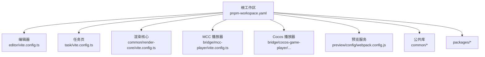
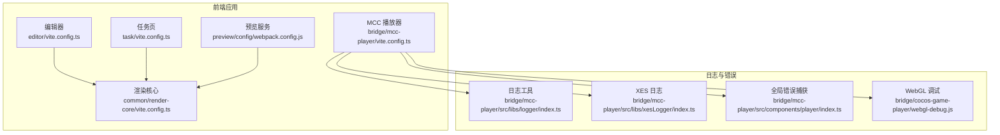
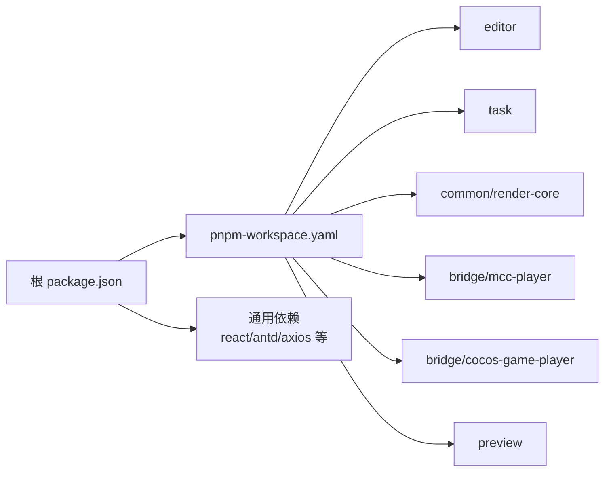

# 故障排除

<cite>
**本文引用的文件**
- [package.json](file://package.json)
- [pnpm-workspace.yaml](file://pnpm-workspace.yaml)
- [vite.config.ts](file://vite.config.ts)
- [tsconfig.json](file://tsconfig.json)
- [editor/vite.config.ts](file://editor/vite.config.ts)
- [task/vite.config.ts](file://task/vite.config.ts)
- [bridge/mcc-player/vite.config.ts](file://bridge/mcc-player/vite.config.ts)
- [common/render-core/vite.config.ts](file://common/render-core/vite.config.ts)
- [bridge/mcc-player/src/libs/logger/index.ts](file://bridge/mcc-player/src/libs/logger/index.ts)
- [bridge/mcc-player/src/libs/xesLogger/index.ts](file://bridge/mcc-player/src/libs/xesLogger/index.ts)
- [bridge/mcc-player/src/components/player/index.ts](file://bridge/mcc-player/src/components/player/index.ts)
- [bridge/cocos-game-player/webgl-debug.js](file://bridge/cocos-game-player/webgl-debug.js)
- [bridge/cocos-game-player/index.html](file://bridge/cocos-game-player/index.html)
- [bridge/cocos-game-player/src/system.bundle.js](file://bridge/cocos-game-player/src/system.bundle.js)
- [bridge/cocos-game-player/assets/frame/index.js](file://bridge/cocos-game-player/assets/frame/index.js)
- [bridge/cocos-game-player/assets/main/index.js](file://bridge/cocos-game-player/assets/main/index.js)
- [bridge/cocos-game-player/index.js](file://bridge/cocos-game-player/index.js)
- [bridge/cocos-game-player/src/chunks/bundle.js](file://bridge/cocos-game-player/src/chunks/bundle.js)
- [preview/config/webpack.config.js](file://preview/config/webpack.config.js)
- [preview/scripts/build.js](file://preview/scripts/build.js)
- [preview/scripts/start.js](file://preview/scripts/start.js)
- [preview/scripts/test.js](file://preview/scripts/test.js)
- [project-analysis/04_性能优化分析.md](file://project-analysis/04_性能优化分析.md)
</cite>

## 目录
1. [简介](#简介)
2. [项目结构](#项目结构)
3. [核心组件](#核心组件)
4. [架构总览](#架构总览)
5. [详细组件分析](#详细组件分析)
6. [依赖关系分析](#依赖关系分析)
7. [性能考虑](#性能考虑)
8. [故障排除指南](#故障排除指南)
9. [结论](#结论)
10. [附录](#附录)

## 简介
本指南面向 Slides Engine 项目的开发与运维人员，聚焦于系统性的问题诊断与故障排除方法。内容覆盖编译错误、运行时异常、性能问题、日志分析与错误追踪、第三方依赖冲突排查、以及紧急情况下的快速恢复与降级策略。文档以仓库现有实现为依据，结合各子系统的配置与日志机制，给出可操作的定位步骤与修复建议。

## 项目结构
Slides Engine 采用 pnpm workspace 多包管理模式，根目录通过工作区配置统一管理多个前端应用与公共库。关键模块包括：
- 编辑器：基于 Vite 的富文本与组件编辑界面，具备 PWA 与代理配置。
- 任务页：课程与任务预览页面，包含代理与环境变量目录配置。
- 渲染核心：通用渲染组件与上下文，使用 React 与 Vite。
- 播放器桥接：Cocos 游戏播放器与 MCC 播放器，包含日志与 WebGL 调试工具。
- 预览服务：独立的预览应用，包含构建脚本与 Webpack 配置。
- 分析文档：性能优化与工程化能力分析文档。

图表来源
- [pnpm-workspace.yaml:1-7](file://pnpm-workspace.yaml#L1-L7)
- [editor/vite.config.ts:1-76](file://editor/vite.config.ts#L1-L76)
- [task/vite.config.ts:1-37](file://task/vite.config.ts#L1-L37)
- [common/render-core/vite.config.ts:1-11](file://common/render-core/vite.config.ts#L1-L11)
- [bridge/mcc-player/vite.config.ts:1-31](file://bridge/mcc-player/vite.config.ts#L1-L31)
- [preview/config/webpack.config.js](file://preview/config/webpack.config.js)

章节来源
- [pnpm-workspace.yaml:1-7](file://pnpm-workspace.yaml#L1-L7)
- [package.json:1-58](file://package.json#L1-L58)

## 核心组件
- 构建与打包
  - 各应用使用 Vite 或 Webpack 进行开发与生产构建，部分应用启用 PWA、代理与 CommonJS 支持。
  - 渲染核心与编辑器使用 React 插件；任务页与播放器使用基础 React 插件或自定义插件链。
- 日志与错误捕获
  - 播放器侧提供统一日志工具与 XES 日志封装，支持 info/warn/error/detail 级别输出。
  - 全局错误与未处理 Promise 拒绝事件捕获，统一写入日志。
- WebGL 调试
  - 提供 WebGL 上下文包装器，在每次调用后检查错误码，便于定位图形相关问题。
- Cocos 桥接
  - 包含 SystemJS 加载与错误提示、资源加载与生命周期事件日志、WebGL 上下文丢失处理等。

章节来源
- [editor/vite.config.ts:16-76](file://editor/vite.config.ts#L16-L76)
- [task/vite.config.ts:1-37](file://task/vite.config.ts#L1-L37)
- [common/render-core/vite.config.ts:1-11](file://common/render-core/vite.config.ts#L1-L11)
- [bridge/mcc-player/vite.config.ts:1-31](file://bridge/mcc-player/vite.config.ts#L1-L31)
- [bridge/mcc-player/src/libs/logger/index.ts:159-190](file://bridge/mcc-player/src/libs/logger/index.ts#L159-L190)
- [bridge/mcc-player/src/libs/xesLogger/index.ts:159-190](file://bridge/mcc-player/src/libs/xesLogger/index.ts#L159-L190)
- [bridge/mcc-player/src/components/player/index.ts:239-283](file://bridge/mcc-player/src/components/player/index.ts#L239-L283)
- [bridge/cocos-game-player/webgl-debug.js:315-384](file://bridge/cocos-game-player/webgl-debug.js#L315-L384)
- [bridge/cocos-game-player/index.html:343](file://bridge/cocos-game-player/index.html#L343)
- [bridge/cocos-game-player/src/system.bundle.js:179](file://bridge/cocos-game-player/src/system.bundle.js#L179)

## 架构总览
整体由多应用协作构成：编辑器负责内容创作，任务页承载课程与任务预览，渲染核心提供通用组件，播放器桥接负责游戏与动画播放，预览服务提供独立的预览能力。日志与错误捕获贯穿播放器与 Cocos 桥接，WebGL 调试工具用于图形层问题定位。

图表来源
- [editor/vite.config.ts:16-76](file://editor/vite.config.ts#L16-L76)
- [task/vite.config.ts:1-37](file://task/vite.config.ts#L1-L37)
- [common/render-core/vite.config.ts:1-11](file://common/render-core/vite.config.ts#L1-L11)
- [bridge/mcc-player/vite.config.ts:1-31](file://bridge/mcc-player/vite.config.ts#L1-L31)
- [bridge/mcc-player/src/libs/logger/index.ts:159-190](file://bridge/mcc-player/src/libs/logger/index.ts#L159-L190)
- [bridge/mcc-player/src/libs/xesLogger/index.ts:159-190](file://bridge/mcc-player/src/libs/xesLogger/index.ts#L159-L190)
- [bridge/mcc-player/src/components/player/index.ts:239-283](file://bridge/mcc-player/src/components/player/index.ts#L239-L283)
- [bridge/cocos-game-player/webgl-debug.js:315-384](file://bridge/cocos-game-player/webgl-debug.js#L315-L384)

## 详细组件分析

### 编辑器（editor）
- 关键特性
  - PWA 注册与自动更新、字体资源缓存策略、CommonJS 支持、HTTPS 证书。
  - 开发服务器代理至测试 API 域名，便于联调。
- 常见问题
  - 代理不通：检查代理目标域名与变更源设置。
  - PWA 缓存导致页面不更新：清理浏览器缓存或禁用 PWA。
  - CommonJS 依赖：确保已启用对应插件。
- 诊断步骤
  - 确认代理配置生效与网络连通性。
  - 查看控制台与网络面板错误。
  - 切换到无 PWA 环境验证问题是否复现。

章节来源
- [editor/vite.config.ts:16-76](file://editor/vite.config.ts#L16-L76)

### 任务页（task）
- 关键特性
  - 多代理前缀映射，支持测试与线上接口切换。
  - 环境变量目录配置，便于区分不同环境。
- 常见问题
  - 接口 404/跨域：确认代理 rewrite 与目标地址。
  - 环境变量未生效：检查 envDir 与变量命名。
- 诊断步骤
  - 使用浏览器开发者工具 Network 面板确认请求是否命中代理。
  - 校验环境变量读取逻辑与后端返回状态。

章节来源
- [task/vite.config.ts:1-37](file://task/vite.config.ts#L1-L37)

### 渲染核心（common/render-core）
- 关键特性
  - 基于 React 的通用组件与上下文，使用 Vite 构建。
- 常见问题
  - 组件未渲染：检查 Provider 注入与上下文消费。
  - 构建产物缺失：确认入口与输出目录配置。
- 诊断步骤
  - 在编辑器或任务页中引入该包进行联调。
  - 对比本地与生产构建产物差异。

章节来源
- [common/render-core/vite.config.ts:1-11](file://common/render-core/vite.config.ts#L1-L11)

### MCC 播放器（bridge/mcc-player）
- 关键特性
  - 自定义 Vite 配置，输出目录按版本号组织，开启 Source Map。
  - 统一日志与 XES 日志封装，支持多级别输出。
  - 全局错误与未处理 Promise 拒绝捕获，统一上报。
- 常见问题
  - 日志缺失：检查日志前缀与级别过滤。
  - 错误未上报：确认全局事件监听是否注册。
  - 构建体积大：关闭 sourcemap 或启用压缩。
- 诊断步骤
  - 打开浏览器控制台，观察日志输出与错误堆栈。
  - 使用日志工具打印关键路径参数，定位异常发生点。

章节来源
- [bridge/mcc-player/vite.config.ts:1-31](file://bridge/mcc-player/vite.config.ts#L1-L31)
- [bridge/mcc-player/src/libs/logger/index.ts:159-190](file://bridge/mcc-player/src/libs/logger/index.ts#L159-L190)
- [bridge/mcc-player/src/libs/xesLogger/index.ts:159-190](file://bridge/mcc-player/src/libs/xesLogger/index.ts#L159-L190)
- [bridge/mcc-player/src/components/player/index.ts:239-283](file://bridge/mcc-player/src/components/player/index.ts#L239-L283)

### Cocos 播放器（bridge/cocos-game-player）
- 关键特性
  - SystemJS 导入映射与错误提示。
  - WebGL 上下文包装器，自动检测错误码并输出详细信息。
  - HTML 层对 WebGL 上下文丢失事件的处理与错误输出。
- 常见问题
  - WebGL 上下文丢失：检查设备驱动与显存占用。
  - SystemJS 导入失败：核对导入映射与目标路径。
  - 控制台大量错误日志：启用 WebGL 调试包装器定位具体调用。
- 诊断步骤
  - 在 index.html 中启用 WebGL 调试包装器，观察错误来源函数名与参数。
  - 检查 SystemJS 报错信息与 JSON 格式有效性。
  - 监控 WebGL 上下文丢失事件，触发重置流程。

章节来源
- [bridge/cocos-game-player/webgl-debug.js:315-384](file://bridge/cocos-game-player/webgl-debug.js#L315-L384)
- [bridge/cocos-game-player/index.html:343](file://bridge/cocos-game-player/index.html#L343)
- [bridge/cocos-game-player/src/system.bundle.js:179](file://bridge/cocos-game-player/src/system.bundle.js#L179)
- [bridge/cocos-game-player/assets/frame/index.js:3438-3541](file://bridge/cocos-game-player/assets/frame/index.js#L3438-L3541)
- [bridge/cocos-game-player/assets/main/index.js:73](file://bridge/cocos-game-player/assets/main/index.js#L73)

### 预览服务（preview）
- 关键特性
  - 独立的 Webpack 配置与脚本，包含构建、启动与测试脚本。
- 常见问题
  - 构建失败：检查入口与输出目录权限。
  - 启动报错：确认端口占用与依赖安装。
- 诊断步骤
  - 使用构建脚本生成 dist 并在静态服务器中验证。
  - 测试脚本用于单元测试与覆盖率收集。

章节来源
- [preview/config/webpack.config.js](file://preview/config/webpack.config.js)
- [preview/scripts/build.js](file://preview/scripts/build.js)
- [preview/scripts/start.js](file://preview/scripts/start.js)
- [preview/scripts/test.js](file://preview/scripts/test.js)

## 依赖关系分析
- 工作区范围
  - 根工作区声明了 packages、editor、common、preview、task、bridge 等范围，确保 pnpm 正确解析依赖。
- 构建工具链
  - Vite 与 React 插件在多数应用中使用；编辑器额外启用 PWA、Basic SSL、CommonJS。
  - TypeScript 与 ESLint 配置位于根目录，影响所有子包的类型与规范校验。
- 第三方依赖
  - axios、antd、react、react-dom 等为通用依赖；播放器侧有自定义日志与 XES 日志封装。
- 可能的冲突点
  - React 版本不一致导致的重复打包或运行时异常。
  - 多个应用同时使用不同版本的 Vite 插件，需统一版本或明确隔离。

图表来源
- [package.json:1-58](file://package.json#L1-L58)
- [pnpm-workspace.yaml:1-7](file://pnpm-workspace.yaml#L1-L7)

章节来源
- [package.json:1-58](file://package.json#L1-L58)
- [pnpm-workspace.yaml:1-7](file://pnpm-workspace.yaml#L1-L7)

## 性能考虑
- 优化方向
  - 代码分割与懒加载：利用 Vite 的动态导入与手动分块策略减少首屏体积。
  - 缓存策略：编辑器 PWA 字体缓存与静态资源缓存，提升二次访问速度。
  - 构建产物分析：对比 sourcemap 与压缩开关对体积与调试的影响。
- 实践建议
  - 在播放器与 Cocos 桥接中避免不必要的日志输出，降低主线程压力。
  - WebGL 调试仅在开发阶段启用，生产关闭以减少性能损耗。
  - 对大型资源采用 CDN 与懒加载策略，配合预览服务进行离线缓存验证。

章节来源
- [project-analysis/04_性能优化分析.md](file://project-analysis/04_性能优化分析.md)
- [editor/vite.config.ts:40-70](file://editor/vite.config.ts#L40-L70)
- [bridge/mcc-player/vite.config.ts:16-24](file://bridge/mcc-player/vite.config.ts#L16-L24)

## 故障排除指南

### 一、编译错误
- 症状
  - Vite/Webpack 报错、模块解析失败、类型检查失败。
- 快速定位
  - 检查根 tsconfig 与各应用 vite.config 是否存在语法错误或插件冲突。
  - 确认 pnpm workspace 范围内依赖是否正确安装。
- 处理步骤
  - 清理 node_modules 与 pnpm-store，重新安装依赖。
  - 逐项注释插件，定位引发冲突的插件或配置段。
  - 校验路径别名与导入映射，确保与实际文件结构一致。

章节来源
- [vite.config.ts:1-8](file://vite.config.ts#L1-L8)
- [tsconfig.json:1-21](file://tsconfig.json#L1-L21)
- [pnpm-workspace.yaml:1-7](file://pnpm-workspace.yaml#L1-L7)

### 二、运行时异常
- 全局错误捕获
  - 播放器组件已实现 window.onerror 与 window.onunhandledrejection 的统一捕获，并通过日志工具输出。
- 诊断流程
  - 打开浏览器控制台，查看错误级别与堆栈信息。
  - 使用日志工具在关键路径打印参数，缩小问题范围。
  - 若为 WebGL 相关错误，启用 WebGL 调试包装器获取具体调用与参数。
- 建议
  - 生产环境保留错误捕获，但避免输出敏感信息。
  - 对 Promise 拒绝统一处理，记录原因与上下文。

章节来源
- [bridge/mcc-player/src/components/player/index.ts:239-283](file://bridge/mcc-player/src/components/player/index.ts#L239-L283)
- [bridge/mcc-player/src/libs/logger/index.ts:159-190](file://bridge/mcc-player/src/libs/logger/index.ts#L159-L190)
- [bridge/cocos-game-player/webgl-debug.js:315-384](file://bridge/cocos-game-player/webgl-debug.js#L315-L384)

### 三、性能问题
- 症状
  - 页面卡顿、首屏加载慢、GPU 占用高。
- 诊断与优化
  - 使用浏览器性能面板分析主线程与 GPU 使用。
  - 对播放器与 Cocos 桥接中的日志输出进行分级，避免高频 detail 输出。
  - 启用 PWA 缓存与字体缓存，减少网络抖动影响。
  - 在构建配置中评估 sourcemap 与压缩策略对性能与调试的影响。

章节来源
- [project-analysis/04_性能优化分析.md](file://project-analysis/04_性能优化分析.md)
- [editor/vite.config.ts:40-70](file://editor/vite.config.ts#L40-L70)
- [bridge/mcc-player/vite.config.ts:16-24](file://bridge/mcc-player/vite.config.ts#L16-L24)

### 四、日志分析与错误追踪
- 日志工具
  - 统一日志封装支持 info/warn/error/detail 级别输出，便于按严重程度筛选。
  - XES 日志封装提供统一格式，便于后续采集与检索。
- 追踪方法
  - 在关键业务路径打印上下文参数与时间戳。
  - 结合浏览器控制台与网络面板，定位请求失败与资源加载异常。
  - 对全局错误与未处理 Promise 拒绝进行统一上报，形成错误画像。

章节来源
- [bridge/mcc-player/src/libs/logger/index.ts:159-190](file://bridge/mcc-player/src/libs/logger/index.ts#L159-L190)
- [bridge/mcc-player/src/libs/xesLogger/index.ts:159-190](file://bridge/mcc-player/src/libs/xesLogger/index.ts#L159-L190)
- [bridge/mcc-player/src/components/player/index.ts:239-283](file://bridge/mcc-player/src/components/player/index.ts#L239-L283)

### 五、第三方依赖冲突
- 常见场景
  - React 版本不一致导致的重复打包或运行时异常。
  - 多个应用使用不同版本的 Vite 插件，造成构建行为差异。
- 解决思路
  - 统一 React 与相关生态依赖版本，确保主包与子包一致。
  - 明确各应用的插件版本，必要时在根目录 pinning。
  - 使用 pnpm 的 peerDependencies 规则，避免悬挂依赖。

章节来源
- [package.json:24-56](file://package.json#L24-L56)
- [pnpm-workspace.yaml:1-7](file://pnpm-workspace.yaml#L1-L7)

### 六、紧急恢复与降级策略
- 快速回滚
  - 使用构建脚本生成上一个稳定版本的 dist，临时替换当前发布产物。
  - 对编辑器与任务页，临时关闭 PWA 或禁用字体缓存，验证问题是否与缓存相关。
- 降级策略
  - 播放器侧关闭 WebGL 调试与高频日志输出，降低性能消耗。
  - Cocos 桥接在 WebGL 上下文丢失时，触发重置流程并提示用户刷新页面。
- 临时修复
  - 通过代理绕过异常接口，使用本地 mock 数据维持功能可用性。

章节来源
- [preview/scripts/build.js](file://preview/scripts/build.js)
- [bridge/cocos-game-player/index.html:343](file://bridge/cocos-game-player/index.html#L343)
- [bridge/cocos-game-player/assets/main/index.js:73](file://bridge/cocos-game-player/assets/main/index.js#L73)

## 结论
本指南基于仓库现有实现，提供了从构建、运行到性能与日志的全链路故障排除方法。建议在日常开发中：
- 保持依赖版本统一与配置最小化；
- 在播放器与 Cocos 桥接中合理使用日志与调试工具；
- 借助 PWA 与缓存策略提升用户体验；
- 建立标准化的错误捕获与上报流程，持续优化性能与稳定性。

## 附录
- 常用命令
  - 启动编辑器：在根目录执行相应脚本，进入对应工作目录。
  - 预览与播放器：分别使用各自应用的启动脚本。
- 参考配置
  - Vite 与 Webpack 配置文件路径与关键字段，便于快速比对。

章节来源
- [package.json:16-22](file://package.json#L16-L22)
- [vite.config.ts:1-8](file://vite.config.ts#L1-L8)
- [preview/config/webpack.config.js](file://preview/config/webpack.config.js)