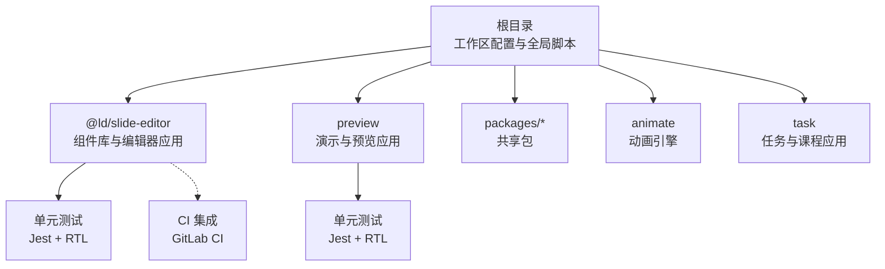
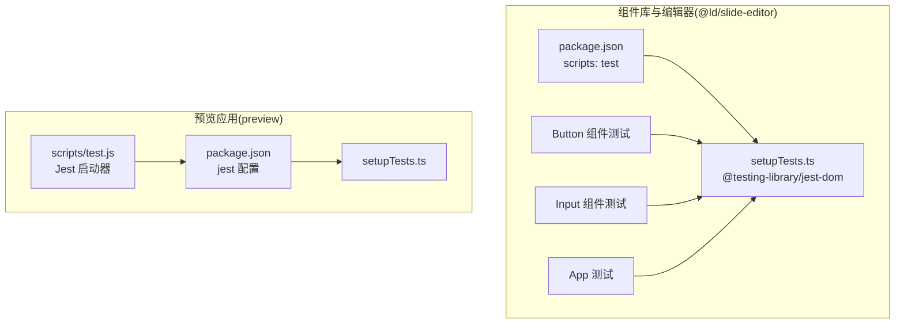
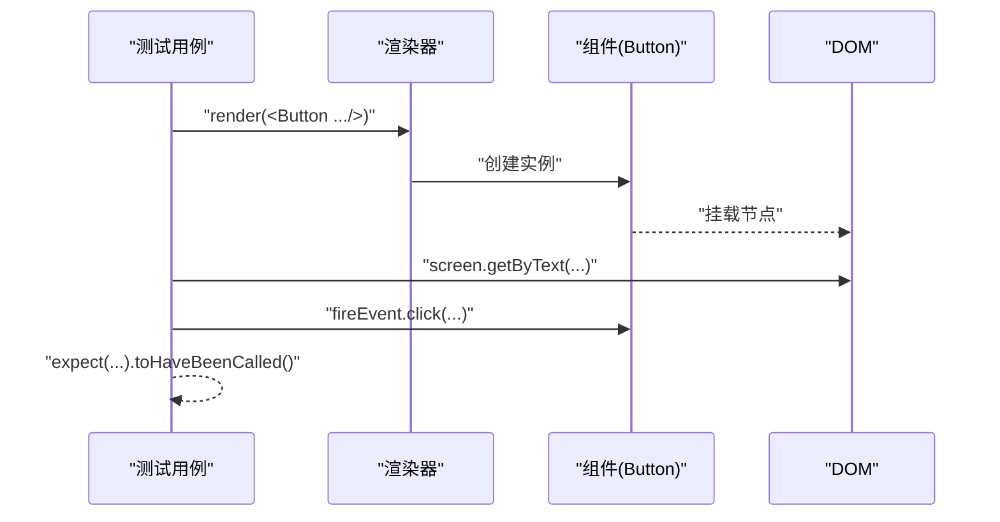
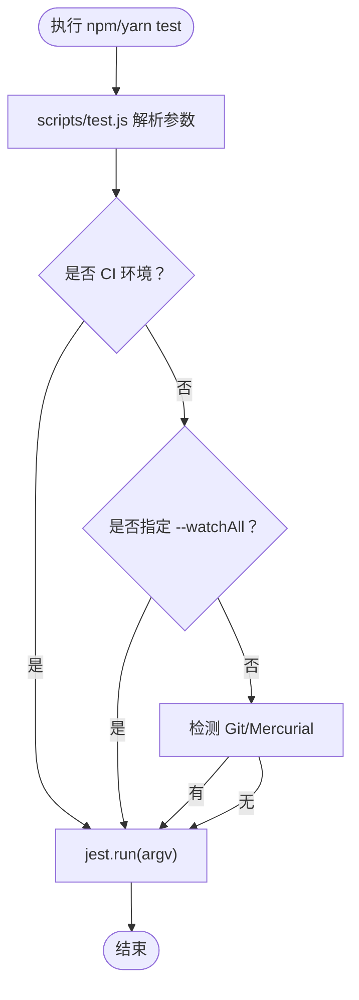
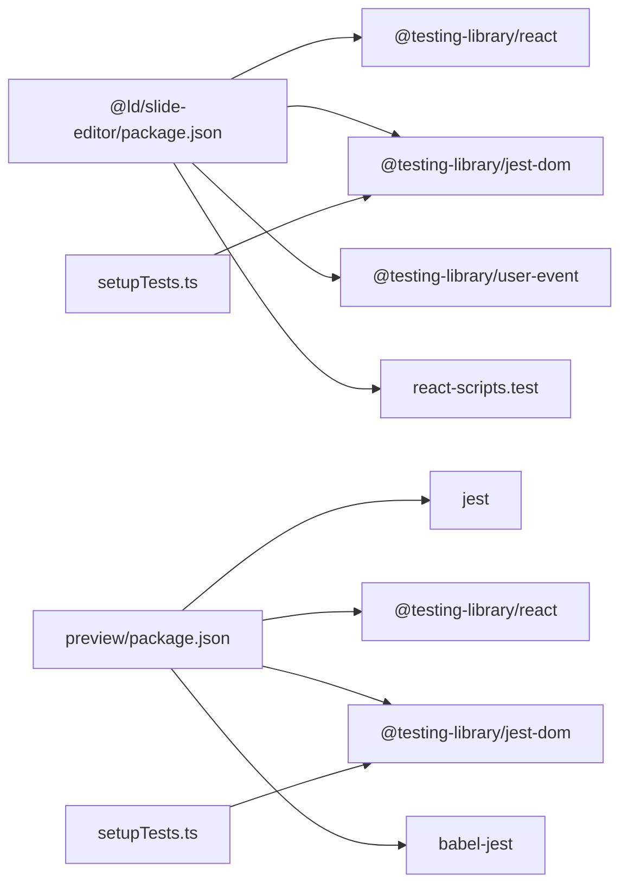

# 测试策略

<cite>
**本文引用的文件**
- [package.json](file://package.json)
- [common/slide-editor/package.json](file://common/slide-editor/package.json)
- [common/slide-editor/src/setupTests.ts](file://common/slide-editor/src/setupTests.ts)
- [common/slide-editor/src/App.test.tsx](file://common/slide-editor/src/App.test.tsx)
- [common/slide-editor/src/components/Button/button.test.tsx](file://common/slide-editor/src/components/Button/button.test.tsx)
- [common/slide-editor/src/components/Input/input.test.tsx](file://common/slide-editor/src/components/Input/input.test.tsx)
- [preview/package.json](file://preview/package.json)
- [preview/src/setupTests.ts](file://preview/src/setupTests.ts)
- [preview/scripts/test.js](file://preview/scripts/test.js)
- [common/slide-editor/gitlab-ci.yml](file://common/slide-editor/gitlab-ci.yml)
</cite>

## 目录
1. [引言](#引言)
2. [项目结构](#项目结构)
3. [核心组件](#核心组件)
4. [架构总览](#架构总览)
5. [详细组件分析](#详细组件分析)
6. [依赖分析](#依赖分析)
7. [性能考虑](#性能考虑)
8. [故障排查指南](#故障排查指南)
9. [结论](#结论)
10. [附录](#附录)

## 引言
本测试策略面向 Slides Engine 项目，旨在建立覆盖单元测试、集成测试与端到端测试的完整质量保证体系。文档聚焦以下方面：
- 测试框架与配置：Jest、React Testing Library（RTL）等在各子项目的落地方式
- 组件测试、API 测试与用户交互测试最佳实践
- 覆盖率要求与持续集成中的测试流程
- 自动化测试脚本与测试数据管理
- 测试环境搭建与测试报告生成

## 项目结构
Slides Engine 采用多包工作区（workspace）组织，核心与编辑器、预览、动画等模块相对独立，便于分别制定测试策略与执行。

图表来源
- [package.json:1-58](file://package.json#L1-L58)
- [common/slide-editor/package.json:1-96](file://common/slide-editor/package.json#L1-L96)
- [preview/package.json:1-168](file://preview/package.json#L1-L168)

章节来源
- [package.json:1-58](file://package.json#L1-L58)
- [common/slide-editor/package.json:1-96](file://common/slide-editor/package.json#L1-L96)
- [preview/package.json:1-168](file://preview/package.json#L1-L168)

## 核心组件
- 测试框架与运行器
  - Jest：作为默认测试运行器，负责测试发现、执行与断言
  - React Testing Library：用于渲染与查询 DOM，强调从用户角度验证行为
- 设置与初始化
  - setupTests.ts：统一注入 @testing-library/jest-dom 等匹配器与全局设置
  - jest 配置：定义 roots、collectCoverageFrom、testEnvironment、transform、moduleNameMapper 等
- 脚本与 CI
  - preview/scripts/test.js：封装测试启动逻辑，支持 watch/watchAll 模式
  - common/slide-editor/gitlab-ci.yml：示例 CI 阶段与任务（可按需启用）

章节来源
- [common/slide-editor/src/setupTests.ts:1-6](file://common/slide-editor/src/setupTests.ts#L1-L6)
- [preview/src/setupTests.ts:1-6](file://preview/src/setupTests.ts#L1-L6)
- [preview/package.json:108-158](file://preview/package.json#L108-L158)
- [preview/scripts/test.js:1-53](file://preview/scripts/test.js#L1-L53)
- [common/slide-editor/gitlab-ci.yml:1-56](file://common/slide-editor/gitlab-ci.yml#L1-L56)

## 架构总览
下图展示测试栈在不同模块中的落地方式与交互关系：

图表来源
- [common/slide-editor/package.json:37-48](file://common/slide-editor/package.json#L37-L48)
- [common/slide-editor/src/setupTests.ts:1-6](file://common/slide-editor/src/setupTests.ts#L1-L6)
- [common/slide-editor/src/components/Button/button.test.tsx:1-57](file://common/slide-editor/src/components/Button/button.test.tsx#L1-L57)
- [common/slide-editor/src/components/Input/input.test.tsx:1-12](file://common/slide-editor/src/components/Input/input.test.tsx#L1-L12)
- [common/slide-editor/src/App.test.tsx:1-10](file://common/slide-editor/src/App.test.tsx#L1-L10)
- [preview/package.json:108-158](file://preview/package.json#L108-L158)
- [preview/src/setupTests.ts:1-6](file://preview/src/setupTests.ts#L1-L6)
- [preview/scripts/test.js:18-52](file://preview/scripts/test.js#L18-L52)

## 详细组件分析

### 组件测试：Button 与 Input
- 测试目标
  - 验证按钮渲染、样式类名、禁用状态与点击事件
  - 验证输入框渲染与禁用状态
- 关键点
  - 使用 render 与 screen 查询元素
  - 使用 fireEvent 触发用户交互
  - 断言 DOM 属性与回调调用次数
- 示例路径
  - [common/slide-editor/src/components/Button/button.test.tsx:1-57](file://common/slide-editor/src/components/Button/button.test.tsx#L1-L57)
  - [common/slide-editor/src/components/Input/input.test.tsx:1-12](file://common/slide-editor/src/components/Input/input.test.tsx#L1-L12)

图表来源
- [common/slide-editor/src/components/Button/button.test.tsx:25-35](file://common/slide-editor/src/components/Button/button.test.tsx#L25-L35)

章节来源
- [common/slide-editor/src/components/Button/button.test.tsx:1-57](file://common/slide-editor/src/components/Button/button.test.tsx#L1-L57)
- [common/slide-editor/src/components/Input/input.test.tsx:1-12](file://common/slide-editor/src/components/Input/input.test.tsx#L1-L12)

### 应用级测试：App
- 测试目标
  - 验证应用入口渲染内容与文本存在性
- 示例路径
  - [common/slide-editor/src/App.test.tsx:1-10](file://common/slide-editor/src/App.test.tsx#L1-L10)

章节来源
- [common/slide-editor/src/App.test.tsx:1-10](file://common/slide-editor/src/App.test.tsx#L1-L10)

### 预览应用测试配置与运行
- Jest 配置要点
  - roots、collectCoverageFrom、setupFilesAfterEnv、testEnvironment、transform、moduleNameMapper
- 测试脚本
  - scripts/test.js：根据 CI 环境决定 watch/watchAll 行为，并调用 jest.run(argv)
- 示例路径
  - [preview/package.json:108-158](file://preview/package.json#L108-L158)
  - [preview/scripts/test.js:1-53](file://preview/scripts/test.js#L1-L53)

图表来源
- [preview/scripts/test.js:40-52](file://preview/scripts/test.js#L40-L52)

章节来源
- [preview/package.json:108-158](file://preview/package.json#L108-L158)
- [preview/scripts/test.js:1-53](file://preview/scripts/test.js#L1-L53)

### 持续集成与覆盖率
- CI 阶段建议
  - 构建阶段：安装依赖、构建产物
  - 测试阶段：运行单元测试与覆盖率收集
  - 打包镜像/部署阶段：按需执行
- 覆盖率配置
  - preview 的 jest 配置中包含 collectCoverageFrom，可按需调整排除规则
- 示例路径
  - [common/slide-editor/gitlab-ci.yml:1-56](file://common/slide-editor/gitlab-ci.yml#L1-L56)
  - [preview/package.json:112-115](file://preview/package.json#L112-L115)

章节来源
- [common/slide-editor/gitlab-ci.yml:1-56](file://common/slide-editor/gitlab-ci.yml#L1-L56)
- [preview/package.json:112-115](file://preview/package.json#L112-L115)

## 依赖分析
- 组件库与编辑器
  - 依赖 @testing-library/react、@testing-library/jest-dom、@testing-library/user-event
  - 使用 react-scripts test 作为测试命令
- 预览应用
  - 直接依赖 jest、@testing-library/react、@testing-library/jest-dom
  - 自行维护 jest 配置与自定义测试脚本
- 共同点
  - 均通过 setupTests.ts 注入 @testing-library/jest-dom
  - 均以 jsdom 作为测试环境

图表来源
- [common/slide-editor/package.json:9-35](file://common/slide-editor/package.json#L9-L35)
- [common/slide-editor/src/setupTests.ts:1-6](file://common/slide-editor/src/setupTests.ts#L1-L6)
- [preview/package.json:16-74](file://preview/package.json#L16-L74)
- [preview/src/setupTests.ts:1-6](file://preview/src/setupTests.ts#L1-L6)

章节来源
- [common/slide-editor/package.json:9-35](file://common/slide-editor/package.json#L9-L35)
- [preview/package.json:16-74](file://preview/package.json#L16-L74)
- [common/slide-editor/src/setupTests.ts:1-6](file://common/slide-editor/src/setupTests.ts#L1-L6)
- [preview/src/setupTests.ts:1-6](file://preview/src/setupTests.ts#L1-L6)

## 性能考虑
- 测试隔离与快速反馈
  - 单元测试应避免外部依赖，必要时使用内存替身或假数据
  - 使用快照测试减少渲染断言复杂度
- 渲染与交互模拟
  - 对于复杂动画或网络请求，优先使用 jest.mock 或拦截请求
- 覆盖率与性能平衡
  - 在保证关键路径覆盖率的前提下，避免过度测试导致 CI 时间过长

## 故障排查指南
- 常见问题
  - 测试环境未正确注入：确认 setupTests.ts 是否被加载
  - DOM 匹配失败：检查选择器与期望文本是否一致
  - CI 中 watch 模式异常：确认 scripts/test.js 的 watch 判定逻辑
- 排查步骤
  - 在本地使用 --watchAll 运行测试，观察失败用例
  - 使用最小化用例复现问题，逐步缩小范围
  - 检查 jest 配置中的 transform、moduleNameMapper 是否影响模块解析

章节来源
- [preview/scripts/test.js:40-52](file://preview/scripts/test.js#L40-L52)
- [preview/package.json:122-140](file://preview/package.json#L122-L140)

## 结论
本策略基于现有 Jest 与 React Testing Library 配置，明确了组件测试、应用测试与 CI 流程的关键实践。建议在后续迭代中：
- 明确覆盖率门槛并纳入 CI 校验
- 将 E2E 测试纳入 CI 阶段，结合浏览器自动化工具
- 规范测试数据管理与 mock 策略，提升稳定性与可重复性

## 附录

### 测试类型与实施要点
- 单元测试
  - 面向组件与工具函数，使用 RTL 渲染与断言
  - 示例路径：[common/slide-editor/src/components/Button/button.test.tsx:1-57](file://common/slide-editor/src/components/Button/button.test.tsx#L1-L57)
- 集成测试
  - 面向页面与路由组合场景，验证上下文与状态流
  - 建议在 preview 或 task 应用中补充
- 端到端测试
  - 建议引入浏览器自动化工具，覆盖真实用户路径

### 测试脚本与命令
- 组件库与编辑器
  - 测试命令：react-scripts test
  - 示例路径：[common/slide-editor/package.json:44](file://common/slide-editor/package.json#L44)
- 预览应用
  - 测试命令：node scripts/test.js
  - 示例路径：[preview/package.json:80](file://preview/package.json#L80)

### 测试环境与报告
- 环境
  - jsdom 作为测试 DOM 环境
  - setupTests.ts 注入 @testing-library/jest-dom
- 报告
  - 可在 jest 配置中启用覆盖率输出与报告格式化

章节来源
- [preview/package.json:122-157](file://preview/package.json#L122-L157)
- [common/slide-editor/src/setupTests.ts:1-6](file://common/slide-editor/src/setupTests.ts#L1-L6)
- [preview/src/setupTests.ts:1-6](file://preview/src/setupTests.ts#L1-L6)