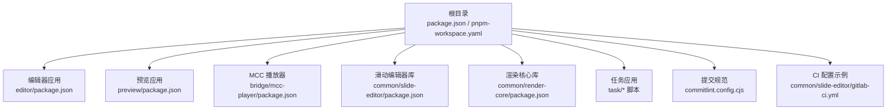
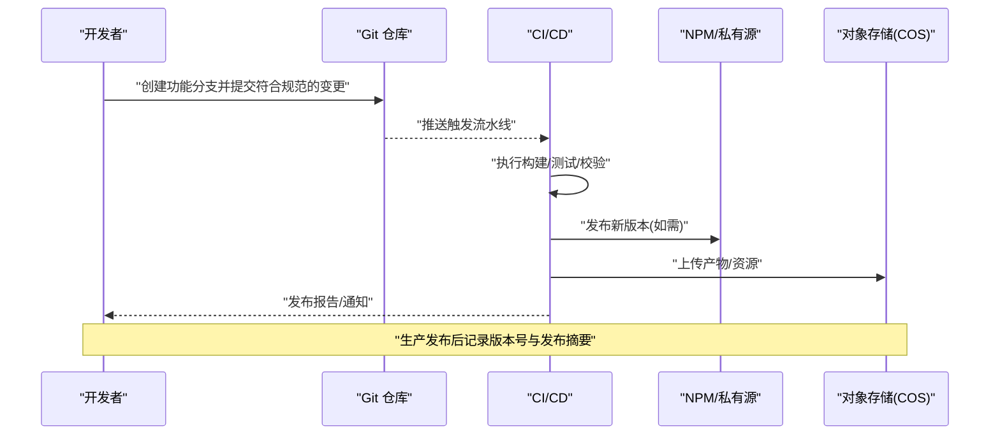
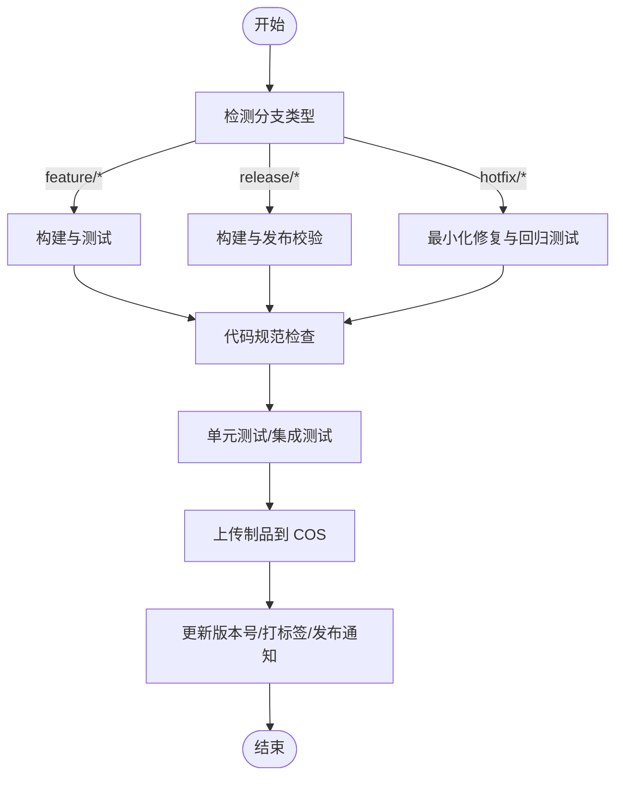
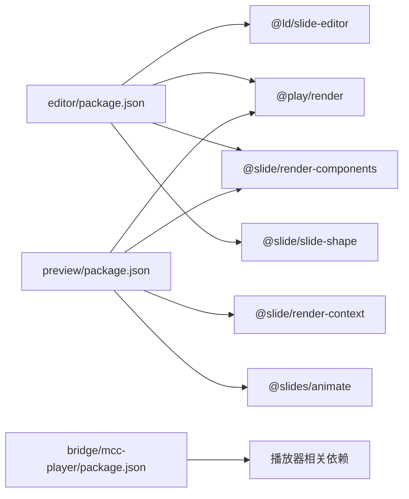

# 版本控制与发布

<cite>
**本文引用的文件**
- [package.json](file://package.json)
- [pnpm-workspace.yaml](file://pnpm-workspace.yaml)
- [commitlint.config.cjs](file://commitlint.config.cjs)
- [.gitignore](file(.gitignore)
- [common/slide-editor/gitlab-ci.yml](file://common/slide-editor/gitlab-ci.yml)
- [task/scripts/release.cjs](file://task/scripts/release.cjs)
- [task/scripts/setVersion.cjs](file://task/scripts/setVersion.cjs)
- [task/scripts/updateVersion.cjs](file://task/scripts/updateVersion.cjs)
- [bridge/mcc-player/src/script/publish.config.json](file://bridge/mcc-player/src/script/publish.config.json)
- [common/slide-editor/package.json](file://common/slide-editor/package.json)
- [common/render-core/package.json](file://common/render-core/package.json)
- [preview/package.json](file://preview/package.json)
- [bridge/mcc-player/package.json](file://bridge/mcc-player/package.json)
- [editor/package.json](file://editor/package.json)
</cite>

## 目录
1. [引言](#引言)
2. [项目结构](#项目结构)
3. [核心组件](#核心组件)
4. [架构总览](#架构总览)
5. [详细组件分析](#详细组件分析)
6. [依赖关系分析](#依赖关系分析)
7. [性能考虑](#性能考虑)
8. [故障排查指南](#故障排查指南)
9. [结论](#结论)
10. [附录](#附录)

## 引言
本文件面向 Slides Engine 项目的版本控制与发布流程，目标是建立规范的 Git 工作流、分支管理策略、语义化版本控制（SemVer）与版本号管理规则，并结合现有仓库中的脚本与配置，给出可落地的自动化发布流程与 CI/CD 建议。同时涵盖包管理器工作区配置、依赖管理、发布前检查清单、质量门禁、回滚策略与紧急修复流程。

## 项目结构
Slides Engine 采用 monorepo 架构，使用 pnpm workspaces 管理多包工作区，根目录的 package.json 定义了全局脚本与依赖，pnpm-workspace.yaml 描述了工作区范围；各子包（如 editor、preview、bridge/mcc-player、common/* 等）各自维护独立的 package.json 与构建/发布脚本。

图表来源
- [package.json:1-58](file://package.json#L1-L58)
- [pnpm-workspace.yaml:1-7](file://pnpm-workspace.yaml#L1-L7)
- [editor/package.json:1-64](file://editor/package.json#L1-L64)
- [preview/package.json:1-168](file://preview/package.json#L1-L168)
- [bridge/mcc-player/package.json:1-72](file://bridge/mcc-player/package.json#L1-L72)
- [common/slide-editor/package.json:1-96](file://common/slide-editor/package.json#L1-L96)
- [common/render-core/package.json:1-33](file://common/render-core/package.json#L1-L33)
- [commitlint.config.cjs:1-4](file://commitlint.config.cjs#L1-L4)
- [common/slide-editor/gitlab-ci.yml:1-76](file://common/slide-editor/gitlab-ci.yml#L1-L76)

章节来源
- [package.json:1-58](file://package.json#L1-L58)
- [pnpm-workspace.yaml:1-7](file://pnpm-workspace.yaml#L1-L7)

## 核心组件
- 提交信息规范：通过 commitlint 继承 conventional 规范，确保提交信息具备可读性与可解析性，便于自动生成变更日志与触发版本号升级。
- 包管理器与工作区：pnpm workspaces 管理多包依赖与内部版本锁定；workspace:^ 语义用于跨包版本约束。
- 发布脚本与工具链：task/scripts 下的 setVersion、updateVersion、release 脚本负责版本号更新与资源上传；preview/bridge/mcc-player 等包内也内置 release/upload/update 脚本。
- CI/CD：仓库中存在 GitLab CI 示例文件，可作为后续集成参考。

章节来源
- [commitlint.config.cjs:1-4](file://commitlint.config.cjs#L1-L4)
- [pnpm-workspace.yaml:1-7](file://pnpm-workspace.yaml#L1-L7)
- [task/scripts/setVersion.cjs:1-61](file://task/scripts/setVersion.cjs#L1-L61)
- [task/scripts/updateVersion.cjs:1-50](file://task/scripts/updateVersion.cjs#L1-L50)
- [task/scripts/release.cjs:1-67](file://task/scripts/release.cjs#L1-L67)
- [preview/package.json:76-88](file://preview/package.json#L76-L88)
- [bridge/mcc-player/package.json:5-16](file://bridge/mcc-player/package.json#L5-L16)

## 架构总览
下图展示版本控制与发布的关键流程：从分支策略与提交规范，到版本号管理、构建与上传、以及发布后的验证与回滚。

图表来源
- [commitlint.config.cjs:1-4](file://commitlint.config.cjs#L1-L4)
- [preview/package.json:76-88](file://preview/package.json#L76-L88)
- [bridge/mcc-player/package.json:11-16](file://bridge/mcc-player/package.json#L11-L16)
- [task/scripts/release.cjs:1-67](file://task/scripts/release.cjs#L1-L67)

## 详细组件分析

### Git 工作流与分支管理策略
- 分支命名与用途
  - develop：日常开发分支，合并稳定特性后进入 release。
  - release/x.y：发布分支，仅做最小化修复与版本号标注，完成后合并至 main/master 并打标签。
  - main/master：受保护分支，禁止直接推送，必须通过 PR 合并。
  - hotfix/x.y.z：紧急修复分支，从对应标签或 main 派生，修复后同时合并回 main/master 与 release 分支。
  - feature/*：功能开发分支，基于 develop 创建，完成评审后合并回 develop。
- 合并与保护
  - main/master 设置为保护分支，开启管理员强制推送限制与 CI 必须通过等规则。
  - PR 合并要求：代码审查通过、CI 成功、无冲突、提交信息符合规范。
- 提交信息规范
  - 使用 conventional 提交类型（feat、fix、docs、style、refactor、perf、test、build、ci、chore、revert），配合 commitlint 校验。

章节来源
- [commitlint.config.cjs:1-4](file://commitlint.config.cjs#L1-L4)

### 语义化版本控制与版本号管理
- 版本号规则
  - 采用语义化版本：主版本.次版本.修订号（x.y.z）。遵循以下原则：
    - 主版本：破坏性变更
    - 次版本：向后兼容的功能新增
    - 修订：向后兼容的问题修正
- 版本号来源与更新
  - 子包各自维护独立版本号（如 preview/package.json 中的 version 字段）。
  - 通过脚本交互式输入或调用接口更新版本号，确保一致性与可追溯性。
- 版本号同步
  - 对于 workspace 内部依赖，使用 workspace:^ 保持版本对齐；对外发布时统一提升版本并同步更新依赖版本。

章节来源
- [preview/package.json](file://preview/package.json#L3)
- [common/slide-editor/package.json](file://common/slide-editor/package.json#L3)
- [common/render-core/package.json](file://common/render-core/package.json#L3)
- [task/scripts/setVersion.cjs:1-61](file://task/scripts/setVersion.cjs#L1-L61)
- [task/scripts/updateVersion.cjs:1-50](file://task/scripts/updateVersion.cjs#L1-L50)

### 自动化发布流程与 CI/CD 配置
- 发布脚本
  - 版本号更新：setVersion 脚本支持交互式输入与接口查询/更新版本号。
  - 发布上传：release 脚本将 dist 下的产物按版本号目录结构上传至对象存储（COS），支持 test/prod 环境。
  - 应用层发布：preview/bridge/mcc-player 等包提供 release/upload/update 脚本，结合环境配置文件实现一键发布。
- CI/CD 建议
  - 参考仓库中的 GitLab CI 示例，定义 stages：build/test/build and push docker image/deploy；按分支触发不同阶段。
  - 在 CI 中集成：安装依赖、单元测试、构建产物、上传制品、更新版本号（如需）、打标签与发布通知。
  - 质量门禁：覆盖率阈值、ESLint/TypeScript 检查、安全扫描、SonarQube（示例中已预留）。

图表来源
- [common/slide-editor/gitlab-ci.yml:1-76](file://common/slide-editor/gitlab-ci.yml#L1-L76)
- [task/scripts/release.cjs:1-67](file://task/scripts/release.cjs#L1-L67)
- [preview/package.json:76-88](file://preview/package.json#L76-L88)
- [bridge/mcc-player/package.json:11-16](file://bridge/mcc-player/package.json#L11-L16)

章节来源
- [task/scripts/release.cjs:1-67](file://task/scripts/release.cjs#L1-L67)
- [preview/package.json:76-88](file://preview/package.json#L76-L88)
- [bridge/mcc-player/package.json:11-16](file://bridge/mcc-player/package.json#L11-L16)
- [common/slide-editor/gitlab-ci.yml:1-76](file://common/slide-editor/gitlab-ci.yml#L1-L76)

### 包管理器工作区配置与依赖管理
- 工作区范围
  - pnpm-workspace.yaml 明确列出 packages/*、editor、common/*、preview、task、bridge/* 等路径，统一由 pnpm 管理依赖与链接。
- 内部依赖与版本锁定
  - 子包通过 workspace:^ 依赖其他包，保证版本一致性；对外依赖遵循 SemVer。
- 依赖安装与构建
  - 各包内 scripts 定义了 dev/build/test 等命令，结合 pnpm 与 Vite/Rollup 等工具链完成构建与打包。

章节来源
- [pnpm-workspace.yaml:1-7](file://pnpm-workspace.yaml#L1-L7)
- [common/render-core/package.json:12-16](file://common/render-core/package.json#L12-L16)
- [preview/package.json:10-14](file://preview/package.json#L10-L14)
- [bridge/mcc-player/package.json:1-72](file://bridge/mcc-player/package.json#L1-L72)

### 发布前检查清单与质量门禁
- 代码质量
  - ESLint/TS 检查通过；无未处理的告警。
  - 单元测试与关键集成测试通过，覆盖率达标。
- 文档与变更
  - 更新 CHANGELOG，记录本次发布的主要变更与破坏性改动。
  - 提交信息符合 conventional 规范。
- 安全与合规
  - 依赖漏洞扫描通过；敏感信息未泄露。
- 发布验证
  - 在测试环境验证构建产物可用性与关键功能；必要时进行 A/B 或灰度发布。
- 质量门禁建议
  - PR 必须通过 CI；main/master 合并需至少两名维护者批准；自动打标签与发布通知。

章节来源
- [commitlint.config.cjs:1-4](file://commitlint.config.cjs#L1-L4)
- [common/slide-editor/gitlab-ci.yml:28-37](file://common/slide-editor/gitlab-ci.yml#L28-L37)

### 回滚策略与紧急修复流程
- 回滚策略
  - 若生产出现严重问题，优先采用“反向提交”或“版本回退”：
    - 对象存储回滚：将上一版本产物重新指向当前域名路径。
    - 应用层回滚：切换到上一稳定版本的构建产物。
    - 数据库/接口不兼容时，保留兼容层或降级接口。
- 紧急修复流程
  - 从最近一次稳定标签创建 hotfix 分支，修复后在测试环境验证，再合并回 main/master 与 release 分支并打新标签。
  - 发布 hotfix 版本时，严格控制变更范围，避免引入新功能。

章节来源
- [bridge/mcc-player/src/script/publish.config.json:1-16](file://bridge/mcc-player/src/script/publish.config.json#L1-L16)
- [preview/package.json:81-88](file://preview/package.json#L81-L88)

## 依赖关系分析
Slides Engine 的包之间存在清晰的依赖关系：应用层（editor、preview、bridge/mcc-player）依赖公共库（common/*、@ld/slide-editor、@play/render 等），并通过 workspace 管理内部版本对齐。

图表来源
- [editor/package.json:18-34](file://editor/package.json#L18-L34)
- [preview/package.json:10-14](file://preview/package.json#L10-L14)
- [common/render-core/package.json:12-16](file://common/render-core/package.json#L12-L16)
- [bridge/mcc-player/package.json:21-27](file://bridge/mcc-player/package.json#L21-L27)

章节来源
- [editor/package.json:1-64](file://editor/package.json#L1-L64)
- [preview/package.json:1-168](file://preview/package.json#L1-L168)
- [common/render-core/package.json:1-33](file://common/render-core/package.json#L1-L33)
- [bridge/mcc-player/package.json:1-72](file://bridge/mcc-player/package.json#L1-L72)

## 性能考虑
- 发布性能
  - 使用 pnpm 的硬链接与缓存机制减少磁盘占用与安装时间。
  - 将大体积资源上传至对象存储（COS），前端按需加载，降低包体大小。
- CI 性能
  - 合理拆分 job，利用缓存与并行任务；仅在必要阶段进行 Docker 打包与部署。
- 依赖管理
  - workspace 内部依赖尽量使用固定版本范围，避免频繁升级导致的不一致。

## 故障排查指南
- 提交信息不规范
  - 症状：PR 无法通过 CI 或被阻塞。
  - 排查：检查提交信息是否符合 conventional 类型；启用 commitlint 校验。
- 发布失败（COS 上传）
  - 症状：release 脚本报错或返回非 200。
  - 排查：确认环境变量与 COS 凭据配置正确；检查 bucket/region/prefix；重试或切换网络。
- 版本号不一致
  - 症状：workspace 内部依赖版本不匹配。
  - 排查：统一使用 setVersion/updateVersion 脚本更新版本；核对 publish.config.json 中的环境配置。
- CI 流水线中断
  - 症状：测试失败或构建超时。
  - 排查：查看日志定位失败步骤；修复后再触发重试；必要时临时关闭部分 stage 进行最小化验证。

章节来源
- [commitlint.config.cjs:1-4](file://commitlint.config.cjs#L1-L4)
- [task/scripts/release.cjs:14-28](file://task/scripts/release.cjs#L14-L28)
- [task/scripts/setVersion.cjs:1-61](file://task/scripts/setVersion.cjs#L1-L61)
- [task/scripts/updateVersion.cjs:1-50](file://task/scripts/updateVersion.cjs#L1-L50)
- [common/slide-editor/gitlab-ci.yml:1-76](file://common/slide-editor/gitlab-ci.yml#L1-L76)

## 结论
通过规范的 Git 工作流、严格的提交信息规范、语义化版本控制与自动化发布脚本，Slides Engine 可以实现高效、可追溯且低风险的版本发布。结合 pnpm workspaces 的依赖管理与对象存储的产物分发，能够进一步提升发布效率与稳定性。建议尽快落地 CI/CD 流水线与质量门禁，确保每次发布都经过充分验证。

## 附录
- 关键脚本与命令位置
  - 版本号更新：[setVersion.cjs:1-61](file://task/scripts/setVersion.cjs#L1-L61)、[updateVersion.cjs:1-50](file://task/scripts/updateVersion.cjs#L1-L50)
  - 产物上传：[release.cjs:1-67](file://task/scripts/release.cjs#L1-L67)
  - 应用层发布：[preview/package.json:76-88](file://preview/package.json#L76-L88)、[bridge/mcc-player/package.json:11-16](file://bridge/mcc-player/package.json#L11-L16)
- 环境配置
  - 发布配置：[publish.config.json:1-16](file://bridge/mcc-player/src/script/publish.config.json#L1-L16)
- CI 参考
  - GitLab CI 示例：[gitlab-ci.yml:1-76](file://common/slide-editor/gitlab-ci.yml#L1-L76)