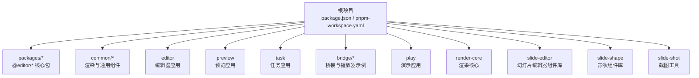
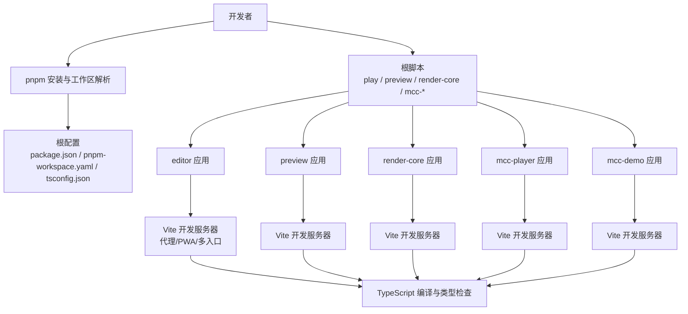
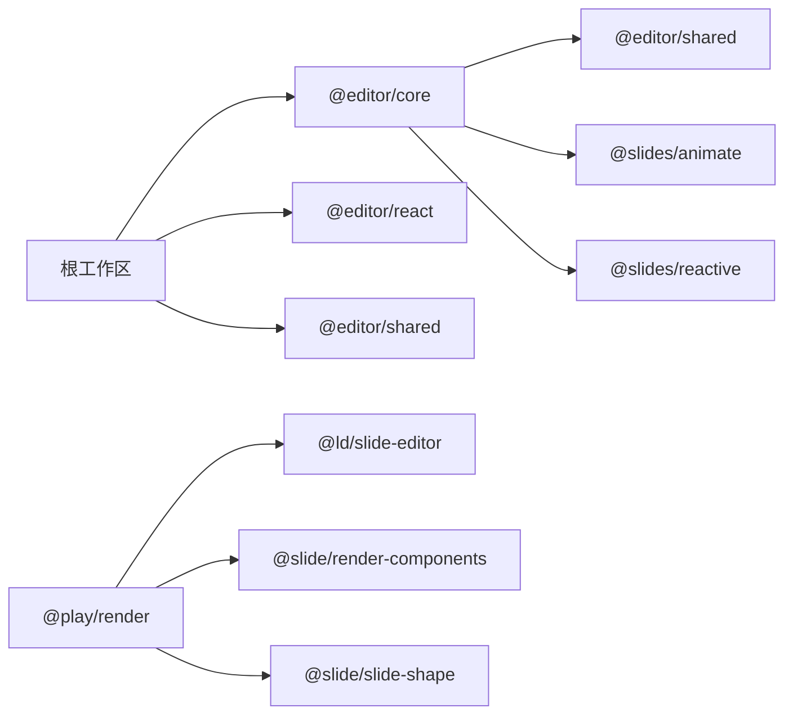

# 环境搭建

<cite>
**本文引用的文件**
- [package.json](file://package.json)
- [pnpm-workspace.yaml](file://pnpm-workspace.yaml)
- [tsconfig.json](file://tsconfig.json)
- [tsconfig.node.json](file://tsconfig.node.json)
- [vite.config.ts](file://vite.config.ts)
- [README.md](file://README.md)
- [packages/core/package.json](file://packages/core/package.json)
- [common/render-core/package.json](file://common/render-core/package.json)
- [editor/package.json](file://editor/package.json)
- [editor/vite.config.ts](file://editor/vite.config.ts)
- [bridge/mcc-player/package.json](file://bridge/mcc-player/package.json)
- [bridge/mcc-player/vite.config.ts](file://bridge/mcc-player/vite.config.ts)
</cite>

## 目录
1. [简介](#简介)
2. [项目结构](#项目结构)
3. [核心组件](#核心组件)
4. [架构总览](#架构总览)
5. [详细组件分析](#详细组件分析)
6. [依赖分析](#依赖分析)
7. [性能考虑](#性能考虑)
8. [故障排查指南](#故障排查指南)
9. [结论](#结论)
10. [附录](#附录)

## 简介
本指南面向首次参与 Slides Engine 项目的开发者，提供从零开始的环境搭建步骤与最佳实践，涵盖以下要点：
- Node.js 版本要求与包管理器选择（推荐 pnpm）
- 工作区与多包管理策略
- TypeScript 与 Vite 的基础配置
- IDE 配置建议（VSCode 插件与调试）
- 开发服务器启动与热重载
- 常见环境问题排查与解决方案

## 项目结构
Slides Engine 采用 pnpm 工作区（monorepo）组织方式，根目录通过工作区配置声明多个子包与应用，形成统一的依赖管理与脚本执行入口。

图示来源
- [pnpm-workspace.yaml:1-7](file://pnpm-workspace.yaml#L1-L7)
- [package.json:6-15](file://package.json#L6-L15)

章节来源
- [pnpm-workspace.yaml:1-7](file://pnpm-workspace.yaml#L1-L7)
- [package.json:6-15](file://package.json#L6-L15)
- [README.md:1-17](file://README.md#L1-L17)

## 核心组件
- 包管理与工作区
  - 使用 pnpm 工作区统一管理多包，根目录的 pnpm-workspace.yaml 声明了 packages、common、bridge 等路径下的子包。
  - 根 package.json 的 workspaces 字段与工作区配置保持一致，确保 pnpm 可以正确解析 workspace 依赖。
- TypeScript 配置
  - 根 tsconfig.json 提供通用编译选项，包含 JSX、模块解析、装饰器、JSON 解析等能力。
  - tsconfig.node.json 用于构建工具链（如 Vite）的 Node 端配置，启用 bundler 模式与 ESNext 模块解析。
- Vite 配置
  - 根 vite.config.ts 默认启用 React SWC 插件；各应用可按需覆盖（例如 editor 启用 PWA、代理、多入口等）。
- 应用与脚本
  - 根 package.json 提供 play/preview/render-core/mcc-player/mcc-demo 等快捷脚本，便于直接在对应目录启动开发服务器或构建产物。

章节来源
- [pnpm-workspace.yaml:1-7](file://pnpm-workspace.yaml#L1-L7)
- [package.json:6-15](file://package.json#L6-L15)
- [tsconfig.json:1-21](file://tsconfig.json#L1-L21)
- [tsconfig.node.json:1-11](file://tsconfig.node.json#L1-L11)
- [vite.config.ts:1-8](file://vite.config.ts#L1-L8)
- [package.json:16-23](file://package.json#L16-L23)

## 架构总览
下图展示了项目整体的开发与构建流程：开发者通过 pnpm 在根目录安装依赖并启动各应用；应用内部通过 Vite 提供开发服务器与热重载；TypeScript 编译器负责类型检查与代码转换。

图示来源
- [package.json:16-23](file://package.json#L16-L23)
- [editor/vite.config.ts:16-75](file://editor/vite.config.ts#L16-L75)
- [vite.config.ts:1-8](file://vite.config.ts#L1-L8)
- [tsconfig.json:1-21](file://tsconfig.json#L1-L21)

## 详细组件分析

### Node.js 与包管理器
- 推荐使用 pnpm 作为包管理器，以充分利用工作区与 workspace 依赖解析能力。
- Node.js 版本要求
  - 根 package.json 未显式声明 engines 字段，但部分子包对 Node 版本有要求。例如 bridge/mcc-player 的 engines 字段要求 Node >= 10.0.0。
  - 建议使用 Node LTS（如 18.x 或 20.x），以兼容大多数现代前端工具链。

章节来源
- [bridge/mcc-player/package.json:28-30](file://bridge/mcc-player/package.json#L28-L30)

### 克隆与初始化
- 步骤概览
  - 克隆仓库后，在根目录使用 pnpm 安装依赖，pnpm 将根据工作区配置自动链接各子包。
  - 若需要，先运行准备脚本以启用 Git Hooks（如 husky）。
- 注意事项
  - 如遇网络问题导致依赖下载失败，可切换镜像源或使用 pnpm 的 offline/local 缓存策略。
  - 若本地已有其他包管理器的 lock 文件，建议清理后再使用 pnpm 安装，避免冲突。

章节来源
- [package.json:22](file://package.json#L22)

### TypeScript 配置
- 根配置
  - tsconfig.json 提供通用编译选项，包含 JSX 支持、模块解析、装饰器、JSON 模块解析等，适合多包共享。
  - tsconfig.node.json 专用于构建工具链（如 Vite），启用 bundler 模式与 ESNext 模块解析，并仅包含 vite.config.ts。
- 子包与应用
  - 各应用与包可按需新增独立 tsconfig（如 editor、bridge/mcc-player、common/slide-editor 等），遵循根配置或局部覆盖。
  - 建议在应用内保留 tsconfig.json 与 tsconfig.node.json，以便 IDE 识别与构建工具正确加载。

章节来源
- [tsconfig.json:1-21](file://tsconfig.json#L1-L21)
- [tsconfig.node.json:1-11](file://tsconfig.node.json#L1-L11)

### Vite 构建与开发服务器
- 根配置
  - 根 vite.config.ts 默认启用 React SWC 插件，满足 React 项目开发需求。
- 应用级配置
  - editor：启用 PWA、代理、多入口、SSL、环境变量目录等，端口默认 5175。
  - bridge/mcc-player：自定义端口、别名、构建输出目录与 sourcemap 等。
  - 其他应用（preview、render-core、mcc-demo 等）可按需扩展插件与配置。
- 启动与热重载
  - 使用根脚本快速启动各应用的开发服务器，实现热重载与实时刷新。
  - 如需指定模式或端口，可在脚本中传参或在各自应用的 package.json 中调整。

章节来源
- [vite.config.ts:1-8](file://vite.config.ts#L1-L8)
- [editor/vite.config.ts:16-75](file://editor/vite.config.ts#L16-L75)
- [bridge/mcc-player/vite.config.ts:7-30](file://bridge/mcc-player/vite.config.ts#L7-L30)
- [package.json:16-23](file://package.json#L16-L23)

### IDE 配置建议（VSCode）
- 插件推荐
  - ESLint：启用规则检查与自动修复。
  - Prettier：统一代码风格。
  - TypeScript Importer：辅助导入与类型提示。
  - Path Intellisense：路径补全（结合 tsconfig 的路径映射）。
  - Bracket Pair Colorizer：括号配色，提升可读性。
- 调试配置
  - 可在 VSCode 的 launch.json 中为各应用添加调试配置，指向对应应用的开发服务器或构建脚本。
  - 对于需要断点调试的场景，建议使用浏览器调试或 VSCode 的 Live Server 扩展配合开发服务器。

章节来源
- [editor/package.json:45-63](file://editor/package.json#L45-L63)

### 开发服务器启动与热重载
- 快速启动
  - 使用根脚本启动各应用：play、preview、render-core、mcc-player、mcc-demo。
  - 各应用的 package.json 内部也提供了 dev/build/preview/lint 等脚本，便于精细化控制。
- 热重载
  - Vite 默认启用 HMR，修改源码后浏览器自动刷新。
  - 若遇到热更新不生效，检查浏览器控制台是否有错误、是否被 CSP 或代理拦截影响。

章节来源
- [package.json:16-23](file://package.json#L16-L23)
- [editor/vite.config.ts:18-29](file://editor/vite.config.ts#L18-L29)

## 依赖分析
- 工作区与依赖关系
  - 根工作区声明了 packages、common、bridge 等路径，子包之间通过 workspace 协议进行依赖解析。
  - 示例：packages/core 依赖 @editor/shared 与 @slides/* 系列包；common/render-core 依赖 @ld/slide-editor、@slide/render-components 等 workspace 包。
- 版本策略
  - 多数 workspace 依赖使用通配符（^）或固定版本，建议在团队内约定统一升级策略，避免版本漂移。
- 外部依赖
  - React 生态（react、react-dom）、Ant Design、Less、Axios 等为项目主要外部依赖，需关注安全与兼容性更新。

图示来源
- [packages/core/package.json:12-19](file://packages/core/package.json#L12-L19)
- [common/render-core/package.json:12-19](file://common/render-core/package.json#L12-L19)
- [pnpm-workspace.yaml:1-7](file://pnpm-workspace.yaml#L1-L7)

章节来源
- [packages/core/package.json:12-19](file://packages/core/package.json#L12-L19)
- [common/render-core/package.json:12-19](file://common/render-core/package.json#L12-L19)
- [pnpm-workspace.yaml:1-7](file://pnpm-workspace.yaml#L1-L7)

## 性能考虑
- 构建优化
  - 合理拆分 chunk 与按需加载，减少首屏体积。
  - 对静态资源启用缓存策略（如 PWA runtime caching），提升二次加载速度。
- 热重载与开发体验
  - 使用 Vite 的 HMR 与轻量代理，避免不必要的全量刷新。
  - 对大型应用开启并行构建与增量编译，缩短等待时间。
- 依赖瘦身
  - 定期清理未使用依赖，避免引入冗余模块。
  - 对第三方库采用按需引入与 Tree Shaking，降低打包体积。

## 故障排查指南
- pnpm 安装失败或依赖解析异常
  - 清理缓存与锁文件后重试；确认 pnpm 版本与 Node 版本兼容。
  - 检查 pnpm-workspace.yaml 与 package.json 的 workspaces 是否一致。
- Node 版本不兼容
  - 部分子包要求 Node >= 10.0.0；建议使用 Node LTS（18/20）。
- 端口占用
  - editor 默认端口 5175，mcc-player 默认端口 5173；若冲突，请在各自应用的 vite.config.ts 中调整 server.port。
- 代理与 HTTPS
  - editor 配置了代理与 Basic SSL 插件；如需访问测试接口，请确认代理目标地址与跨域设置。
- 热重载无效
  - 检查浏览器控制台错误、CSP 设置与代理拦截；尝试关闭代理或更换端口。
- TypeScript 报错
  - 确认 tsconfig.json 与 tsconfig.node.json 的配置一致且未遗漏关键选项；IDE 与构建工具应使用相同版本的 TypeScript。

章节来源
- [bridge/mcc-player/package.json:28-30](file://bridge/mcc-player/package.json#L28-L30)
- [pnpm-workspace.yaml:1-7](file://pnpm-workspace.yaml#L1-L7)
- [package.json:6-15](file://package.json#L6-L15)
- [editor/vite.config.ts:18-29](file://editor/vite.config.ts#L18-L29)

## 结论
通过 pnpm 工作区与统一的 TypeScript/Vite 配置，Slides Engine 实现了多包协同与高效开发。遵循本文档的环境搭建步骤与最佳实践，可快速完成本地开发环境的准备，并在后续迭代中保持一致性与可维护性。

## 附录
- 快速命令清单
  - 安装依赖：在根目录执行 pnpm 安装
  - 启动编辑器：pnpm run play
  - 启动预览：pnpm run preview
  - 启动渲染核心：pnpm run render-core
  - 启动 MCC 播放器：pnpm run mcc-player
  - 启动 MCC 示例：pnpm run mcc-demo
- 参考文件
  - 根配置：package.json、pnpm-workspace.yaml、tsconfig.json、tsconfig.node.json、vite.config.ts
  - 应用配置：editor/vite.config.ts、bridge/mcc-player/vite.config.ts
  - 子包配置：packages/core/package.json、common/render-core/package.json