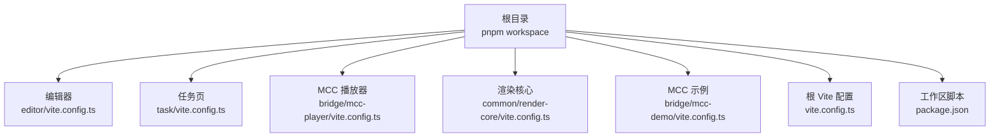
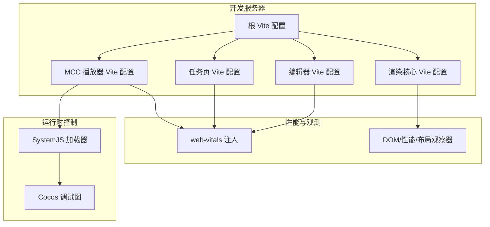
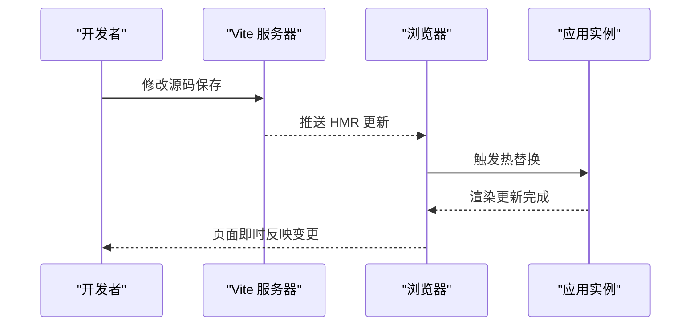
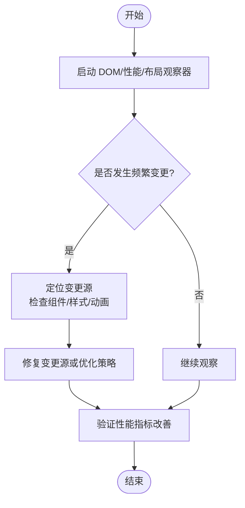
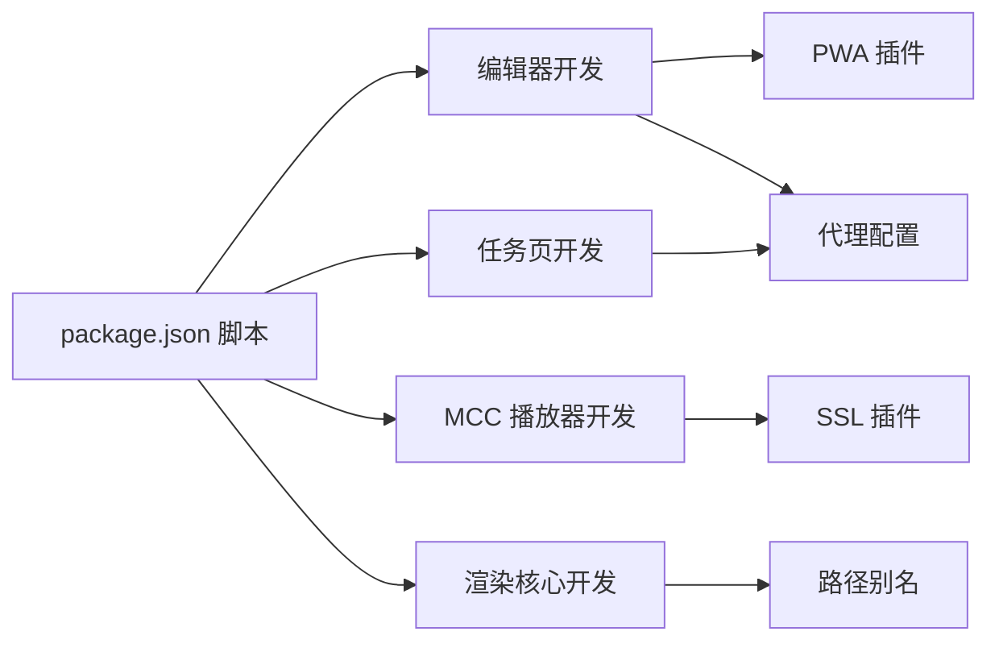

# 调试与优化

<cite>
**本文引用的文件**
- [vite.config.ts](file://vite.config.ts)
- [package.json](file://package.json)
- [editor/vite.config.ts](file://editor/vite.config.ts)
- [task/vite.config.ts](file://task/vite.config.ts)
- [bridge/mcc-player/vite.config.ts](file://bridge/mcc-player/vite.config.ts)
- [common/render-core/vite.config.ts](file://common/render-core/vite.config.ts)
- [bridge/mcc-demo/vite.config.ts](file://bridge/mcc-demo/vite.config.ts)
- [common/slide-editor/src/reportWebVitals.ts](file://common/slide-editor/src/reportWebVitals.ts)
- [preview/src/reportWebVitals.ts](file://preview/src/reportWebVitals.ts)
- [packages/shared/src/observer.ts](file://packages/shared/src/observer.ts)
- [bridge/cocos-game-player/src/system.bundle.js](file://bridge/cocos-game-player/src/system.bundle.js)
- [bridge/cocos-game-player/assets/main/index.js](file://bridge/cocos-game-player/assets/main/index.js)
- [bridge/mcc-player/src/libs/logger/ali-logger/aliPcLogger.ts](file://bridge/mcc-player/src/libs/logger/ali-logger/aliPcLogger.ts)
</cite>

## 目录
1. [简介](#简介)
2. [项目结构](#项目结构)
3. [核心组件](#核心组件)
4. [架构总览](#架构总览)
5. [详细组件分析](#详细组件分析)
6. [依赖关系分析](#依赖关系分析)
7. [性能考量](#性能考量)
8. [故障排查指南](#故障排查指南)
9. [结论](#结论)
10. [附录](#附录)

## 简介
本指南面向 Slides Engine 多包管理的前端工程，聚焦于调试技巧与性能优化实践。内容涵盖：
- 浏览器开发者工具：React DevTools、性能面板、网络监控与内存分析
- Vite 开发服务器：端口与代理配置、热重载机制与构建优化
- 内存泄漏检测与性能分析方法
- 大型项目的断点调试策略与异步代码调试技巧
- 性能监控工具与指标分析
- 常见性能瓶颈识别与优化方案

## 项目结构
Slides Engine 采用 pnpm workspace 管理多子项目，包含编辑器、预览、渲染核心、桥接示例与演示等模块。各子项目均配有独立的 Vite 配置，便于差异化调试与构建。

图表来源
- [editor/vite.config.ts:1-76](file://editor/vite.config.ts#L1-L76)
- [task/vite.config.ts:1-37](file://task/vite.config.ts#L1-L37)
- [bridge/mcc-player/vite.config.ts:1-31](file://bridge/mcc-player/vite.config.ts#L1-L31)
- [common/render-core/vite.config.ts:1-11](file://common/render-core/vite.config.ts#L1-L11)
- [bridge/mcc-demo/vite.config.ts:1-50](file://bridge/mcc-demo/vite.config.ts#L1-L50)
- [vite.config.ts:1-8](file://vite.config.ts#L1-L8)
- [package.json:16-22](file://package.json#L16-L22)

章节来源
- [package.json:6-15](file://package.json#L6-L15)
- [package.json:16-22](file://package.json#L16-L22)

## 核心组件
- Vite 开发服务器与热重载
  - 根配置启用 React 插件；各子项目按需开启代理、PWA、SSL、别名与构建优化。
- 性能监控与观测
  - 使用 web-vitals 在应用入口注入性能指标采集；共享模块提供基于 DOM/性能/布局变化的观察器。
- 游戏桥接与运行时控制
  - Cocos 引擎桥接包含运行时调试视图与 SystemJS 加载器逻辑，便于热替换与错误追踪。

章节来源
- [vite.config.ts:5-7](file://vite.config.ts#L5-L7)
- [editor/vite.config.ts:16-74](file://editor/vite.config.ts#L16-L74)
- [task/vite.config.ts:8-36](file://task/vite.config.ts#L8-L36)
- [bridge/mcc-player/vite.config.ts:7-29](file://bridge/mcc-player/vite.config.ts#L7-L29)
- [common/render-core/vite.config.ts:4-10](file://common/render-core/vite.config.ts#L4-L10)
- [common/slide-editor/src/reportWebVitals.ts:1-15](file://common/slide-editor/src/reportWebVitals.ts#L1-L15)
- [preview/src/reportWebVitals.ts:1-15](file://preview/src/reportWebVitals.ts#L1-L15)
- [packages/shared/src/observer.ts:1-38](file://packages/shared/src/observer.ts#L1-L38)
- [bridge/cocos-game-player/src/system.bundle.js:244-631](file://bridge/cocos-game-player/src/system.bundle.js#L244-L631)

## 架构总览
下图展示了开发期调试与性能观测在工程中的位置与交互：

图表来源
- [vite.config.ts:5-7](file://vite.config.ts#L5-L7)
- [editor/vite.config.ts:16-74](file://editor/vite.config.ts#L16-L74)
- [task/vite.config.ts:8-36](file://task/vite.config.ts#L8-L36)
- [bridge/mcc-player/vite.config.ts:7-29](file://bridge/mcc-player/vite.config.ts#L7-L29)
- [common/render-core/vite.config.ts:4-10](file://common/render-core/vite.config.ts#L4-L10)
- [common/slide-editor/src/reportWebVitals.ts:1-15](file://common/slide-editor/src/reportWebVitals.ts#L1-L15)
- [preview/src/reportWebVitals.ts:1-15](file://preview/src/reportWebVitals.ts#L1-L15)
- [packages/shared/src/observer.ts:1-38](file://packages/shared/src/observer.ts#L1-L38)
- [bridge/cocos-game-player/src/system.bundle.js:244-631](file://bridge/cocos-game-player/src/system.bundle.js#L244-L631)

## 详细组件分析

### Vite 开发服务器与热重载
- 端口与代理
  - 编辑器：固定端口与本地代理，便于联调后端接口。
  - 任务页：多条代理规则，覆盖测试与线上环境。
  - MCC 播放器：开放主机地址与自定义资源目录，便于外部访问与资源定位。
- 热重载机制
  - 基于 Vite 的模块热替换（HMR），结合 React 插件实现组件级热更新。
  - 对于 SystemJS 加载器（游戏桥接场景），删除与重建模块注册可辅助热替换流程。
- 构建优化
  - 各子项目按需开启源码映射、手动分包与输出目录定制，减少打包体积与提升可维护性。

图表来源
- [editor/vite.config.ts:18-29](file://editor/vite.config.ts#L18-L29)
- [task/vite.config.ts:20-35](file://task/vite.config.ts#L20-L35)
- [bridge/mcc-player/vite.config.ts:9-13](file://bridge/mcc-player/vite.config.ts#L9-L13)
- [bridge/cocos-game-player/src/system.bundle.js:599-629](file://bridge/cocos-game-player/src/system.bundle.js#L599-L629)

章节来源
- [editor/vite.config.ts:16-74](file://editor/vite.config.ts#L16-L74)
- [task/vite.config.ts:8-36](file://task/vite.config.ts#L8-L36)
- [bridge/mcc-player/vite.config.ts:7-29](file://bridge/mcc-player/vite.config.ts#L7-L29)
- [bridge/cocos-game-player/src/system.bundle.js:244-631](file://bridge/cocos-game-player/src/system.bundle.js#L244-L631)

### React DevTools 与组件层级调试
- 安装 React DevTools 扩展，进入页面后切换到“Components”面板，定位组件树与状态。
- 结合 React Profiler 分析渲染次数与耗时热点，识别不必要的重渲染与深层更新。
- 在编辑器与任务页中，优先检查高阶组件、上下文与事件序列组件的更新策略。

### 性能面板与网络监控
- 性能面板
  - 使用“性能”标签记录长任务、主线程阻塞与布局抖动，结合 web-vitals 指标定位问题。
- 网络监控
  - 关注静态资源加载、字体缓存策略与代理请求的响应时间，优化缓存命中与并发策略。

章节来源
- [common/slide-editor/src/reportWebVitals.ts:1-15](file://common/slide-editor/src/reportWebVitals.ts#L1-L15)
- [preview/src/reportWebVitals.ts:1-15](file://preview/src/reportWebVitals.ts#L1-L15)
- [editor/vite.config.ts:41-70](file://editor/vite.config.ts#L41-L70)

### 内存泄漏检测与性能分析
- DOM/性能/布局观察器
  - 通过 ResizeObserver、PerformanceObserver 与 MutationObserver 监控频繁变更，避免无意义的重排与重绘。
- 运行时日志与上报
  - 使用日志工具类进行关键路径打点，结合 SLS 上报进行离线分析。
- 游戏桥接调试
  - 利用 Cocos 调试图组件与 SystemJS 删除/重建能力，定位模块生命周期与异常。

图表来源
- [packages/shared/src/observer.ts:10-37](file://packages/shared/src/observer.ts#L10-L37)

章节来源
- [packages/shared/src/observer.ts:1-38](file://packages/shared/src/observer.ts#L1-L38)
- [bridge/mcc-player/src/libs/logger/ali-logger/aliPcLogger.ts:1-12](file://bridge/mcc-player/src/libs/logger/ali-logger/aliPcLogger.ts#L1-L12)
- [bridge/cocos-game-player/assets/main/index.js:69-100](file://bridge/cocos-game-player/assets/main/index.js#L69-L100)
- [bridge/cocos-game-player/src/system.bundle.js:599-629](file://bridge/cocos-game-player/src/system.bundle.js#L599-L629)

### 大型项目的断点调试策略与异步代码调试
- 断点策略
  - 将复杂流程拆分为小函数，针对关键节点设置条件断点与日志断点。
  - 对异步流程使用 Promise 链与 async/await，配合“未捕获异常”断点快速定位错误。
- 异步调试技巧
  - 使用“Sources”面板的“Promise Rejection”断点，拦截未处理的 Promise 错误。
  - 在编辑器与任务页中，关注跨模块事件流与数据传递，必要时引入轻量中间件或日志。

章节来源
- [editor/vite.config.ts:16-74](file://editor/vite.config.ts#L16-L74)
- [task/vite.config.ts:8-36](file://task/vite.config.ts#L8-L36)

### 性能监控工具与指标分析
- web-vitals 指标
  - CLS、FID、FCP、LCP、TTFB 用于评估稳定性、交互及时性与首屏体验。
- 工具链集成
  - 在应用入口注入报告函数，结合构建产物与浏览器性能面板进行对比分析。

章节来源
- [common/slide-editor/src/reportWebVitals.ts:1-15](file://common/slide-editor/src/reportWebVitals.ts#L1-L15)
- [preview/src/reportWebVitals.ts:1-15](file://preview/src/reportWebVitals.ts#L1-L15)

## 依赖关系分析
- 工作区脚本
  - 通过根脚本统一启动各子项目开发服务器，便于并行调试与联调。
- 插件生态
  - React 插件、PWA 插件、CommonJS 转换、SSL 插件与别名解析在不同子项目中按需启用。

图表来源
- [package.json:16-22](file://package.json#L16-L22)
- [editor/vite.config.ts:40-74](file://editor/vite.config.ts#L40-L74)
- [task/vite.config.ts:13-19](file://task/vite.config.ts#L13-L19)
- [bridge/mcc-player/vite.config.ts:14-29](file://bridge/mcc-player/vite.config.ts#L14-L29)
- [common/render-core/vite.config.ts:7-9](file://common/render-core/vite.config.ts#L7-L9)

章节来源
- [package.json:16-22](file://package.json#L16-L22)

## 性能考量
- 构建优化
  - 源码映射与手动分包减少首屏体积；合理配置输出目录与资源命名，提升缓存命中。
- 缓存策略
  - PWA 与字体缓存策略降低重复加载成本；代理请求注意缓存头与过期时间。
- 渲染优化
  - 减少不必要的重排与重绘，利用观察器与性能面板定位热点；对动画与大图资源采用懒加载与占位策略。

章节来源
- [bridge/mcc-player/vite.config.ts:16-24](file://bridge/mcc-player/vite.config.ts#L16-L24)
- [editor/vite.config.ts:53-69](file://editor/vite.config.ts#L53-L69)
- [packages/shared/src/observer.ts:10-37](file://packages/shared/src/observer.ts#L10-L37)

## 故障排查指南
- 端口冲突与代理不通
  - 检查 server.strictPort、host 与代理 target 是否正确；确认防火墙与 CORS 设置。
- 热重载失效
  - 确认 HMR 通道可用；对于 SystemJS 场景，尝试删除模块注册后再重新导入。
- 性能异常
  - 使用 web-vitals 与性能面板交叉验证；结合 DOM/性能观察器定位高频变更源。
- 日志与上报
  - 核对日志工具初始化参数与 SLS 配置，确保关键路径打点完整。

章节来源
- [editor/vite.config.ts:18-29](file://editor/vite.config.ts#L18-L29)
- [task/vite.config.ts:20-35](file://task/vite.config.ts#L20-L35)
- [bridge/mcc-player/vite.config.ts:9-13](file://bridge/mcc-player/vite.config.ts#L9-L13)
- [bridge/cocos-game-player/src/system.bundle.js:599-629](file://bridge/cocos-game-player/src/system.bundle.js#L599-L629)
- [packages/shared/src/observer.ts:10-37](file://packages/shared/src/observer.ts#L10-L37)
- [bridge/mcc-player/src/libs/logger/ali-logger/aliPcLogger.ts:4-12](file://bridge/mcc-player/src/libs/logger/ali-logger/aliPcLogger.ts#L4-L12)

## 结论
通过合理的 Vite 配置、性能监控与观测工具、以及系统化的调试策略，Slides Engine 可在多包协作下保持良好的开发体验与运行性能。建议在日常开发中持续关注 web-vitals 指标、优化构建与缓存策略，并建立完善的日志与上报体系，以支撑长期迭代与质量保障。

## 附录
- 快速启动命令
  - 编辑器：在根目录执行相应脚本启动开发服务器。
- 常用端口
  - 编辑器：固定端口；任务页：固定端口；MCC 播放器：开放主机与自定义端口。
- 关键插件
  - React、PWA、CommonJS、SSL、别名解析与路径别名。

章节来源
- [package.json:16-22](file://package.json#L16-L22)
- [editor/vite.config.ts:18-29](file://editor/vite.config.ts#L18-L29)
- [task/vite.config.ts:20-35](file://task/vite.config.ts#L20-L35)
- [bridge/mcc-player/vite.config.ts:9-13](file://bridge/mcc-player/vite.config.ts#L9-L13)
- [common/render-core/vite.config.ts:7-9](file://common/render-core/vite.config.ts#L7-L9)