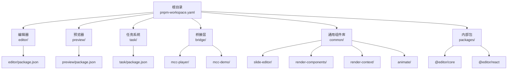
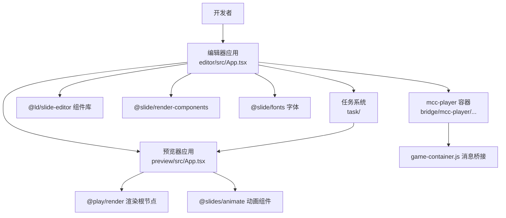
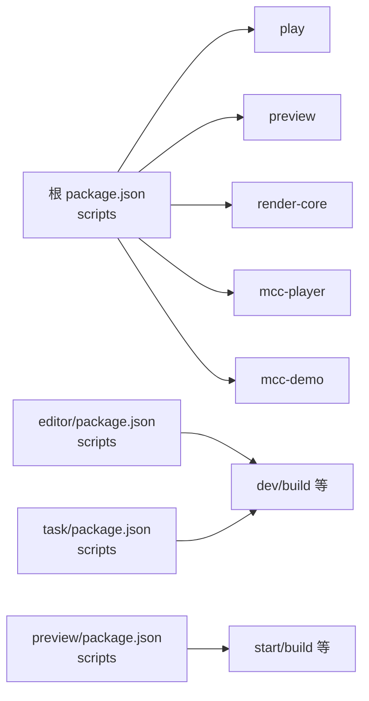
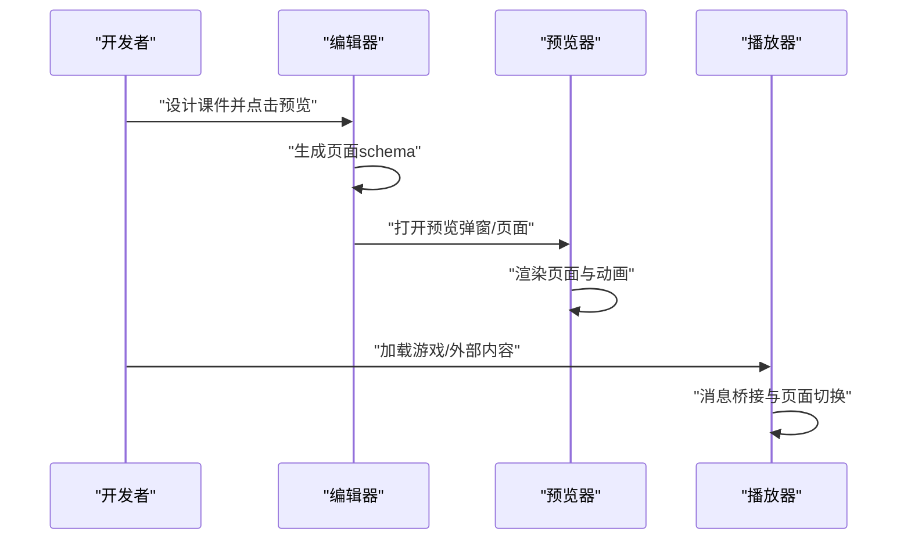

# 快速开始

<cite>
**本文引用的文件**
- [package.json](file://package.json)
- [pnpm-workspace.yaml](file://pnpm-workspace.yaml)
- [README.md](file://README.md)
- [editor/package.json](file://editor/package.json)
- [preview/package.json](file://preview/package.json)
- [task/package.json](file://task/package.json)
- [packages/core/package.json](file://packages/core/package.json)
- [packages/react/package.json](file://packages/react/package.json)
- [common/slide-editor/package.json](file://common/slide-editor/package.json)
- [bridge/mcc-player/gameStatic/game-container.js](file://bridge/mcc-player/gameStatic/game-container.js)
- [bridge/mcc-demo/src/demo.json](file://bridge/mcc-demo/src/demo.json)
- [editor/src/App.tsx](file://editor/src/App.tsx)
- [preview/src/App.tsx](file://preview/src/App.tsx)
- [common/slide-editor/src/App.tsx](file://common/slide-editor/src/App.tsx)
- [common/slide-editor/lib/html2json.js](file://common/slide-editor/lib/html2json.js)
</cite>

## 目录
1. [简介](#简介)
2. [项目结构](#项目结构)
3. [核心组件](#核心组件)
4. [架构总览](#架构总览)
5. [详细组件分析](#详细组件分析)
6. [依赖关系分析](#依赖关系分析)
7. [性能注意事项](#性能注意事项)
8. [故障排查指南](#故障排查指南)
9. [结论](#结论)
10. [附录](#附录)

## 简介
Slides Engine 是一个基于 pnpm workspace 的多包管理课件创作与播放平台，采用 Vite 构建工具链，支持编辑器、预览器、播放器、任务系统等多个子应用协同工作。本指南面向新手开发者，提供从环境准备、依赖安装、应用启动到首个课件创建与预览的完整流程，并给出常见问题与解决方案。

## 项目结构
项目采用 monorepo 结构，通过 pnpm workspace 管理多个包与应用。顶层脚本提供统一的开发与构建入口；各子应用（编辑器、预览器、任务系统、播放器等）独立维护其依赖与构建配置。

图表来源
- [pnpm-workspace.yaml:1-7](file://pnpm-workspace.yaml#L1-L7)
- [package.json:6-15](file://package.json#L6-L15)
- [editor/package.json:1-64](file://editor/package.json#L1-L64)
- [preview/package.json:1-168](file://preview/package.json#L1-L168)
- [task/package.json:1-57](file://task/package.json#L1-L57)

章节来源
- [pnpm-workspace.yaml:1-7](file://pnpm-workspace.yaml#L1-L7)
- [package.json:6-15](file://package.json#L6-L15)
- [README.md:1-17](file://README.md#L1-L17)

## 核心组件
- 编辑器：提供课件页面的设计、布局、动画与资源管理能力，内置预览弹窗与保存功能。
- 预览器：渲染课件页面，承载动画与交互，支持微前端环境下的全局数据传递。
- 任务系统：面向教师或运营的任务管理与预览界面，提供课程、页面与任务的可视化操作。
- 播放器：用于嵌入游戏或外部内容的容器，负责消息通信与页面切换。
- 通用组件库：包含渲染组件、上下文、形状组件、字体等可复用模块。
- 内部包：@editor/core、@editor/react 等核心逻辑与 React 扩展。

章节来源
- [editor/src/App.tsx:1-230](file://editor/src/App.tsx#L1-L230)
- [preview/src/App.tsx:1-51](file://preview/src/App.tsx#L1-L51)
- [task/package.json:1-57](file://task/package.json#L1-L57)
- [packages/core/package.json:1-24](file://packages/core/package.json#L1-L24)
- [packages/react/package.json:1-28](file://packages/react/package.json#L1-L28)
- [common/slide-editor/package.json:1-96](file://common/slide-editor/package.json#L1-L96)

## 架构总览
下图展示了从“课件设计”到“预览与播放”的端到端流程，以及关键模块之间的依赖关系。

图表来源
- [editor/src/App.tsx:1-230](file://editor/src/App.tsx#L1-L230)
- [preview/src/App.tsx:1-51](file://preview/src/App.tsx#L1-L51)
- [task/package.json:1-57](file://task/package.json#L1-L57)
- [common/slide-editor/package.json:1-96](file://common/slide-editor/package.json#L1-L96)
- [bridge/mcc-player/gameStatic/game-container.js:1-173](file://bridge/mcc-player/gameStatic/game-container.js#L1-L173)

## 详细组件分析

### 编辑器（editor）
- 职责：提供课件页面的可视化编辑、属性设置、动画面板、资源管理与预览弹窗。
- 关键特性：集成字体加载、移动选择器、右侧面板、状态栏与动作按钮（保存/预览）。
- 启动方式：通过顶层脚本或子包脚本启动开发服务器。

章节来源
- [editor/src/App.tsx:1-230](file://editor/src/App.tsx#L1-L230)
- [editor/package.json:6-16](file://editor/package.json#L6-L16)

### 预览器（preview）
- 职责：接收页面 schema，渲染课件内容，承载动画与日志上报。
- 关键特性：支持微前端环境变量适配、全局数据透传、固定画布尺寸与样式合并。

章节来源
- [preview/src/App.tsx:1-51](file://preview/src/App.tsx#L1-L51)
- [preview/package.json:76-89](file://preview/package.json#L76-L89)

### 任务系统（task）
- 职责：课程与任务的列表、筛选、详情与预览，提供国际化与异步组件封装。
- 启动方式：Vite 开发模式，支持测试/生产构建与热更新发布流程。

章节来源
- [task/package.json:6-12](file://task/package.json#L6-L12)

### 播放器（bridge/mcc-player）
- 职责：作为游戏或外部内容的承载容器，负责消息监听与转发、页面切换与同步数据广播。
- 关键特性：与父窗口通信、iframe 加载、事件分发与回调处理。

章节来源
- [bridge/mcc-player/gameStatic/game-container.js:1-173](file://bridge/mcc-player/gameStatic/game-container.js#L1-L173)

### 通用组件库（common）
- slide-editor：富文本输入与组件示例，提供构建与 Storybook 支持。
- render-components：图像、视频等渲染组件。
- render-context：渲染上下文。
- animate：动画引擎与编辑/预览模式。

章节来源
- [common/slide-editor/package.json:1-96](file://common/slide-editor/package.json#L1-L96)
- [common/slide-editor/src/App.tsx:1-33](file://common/slide-editor/src/App.tsx#L1-L33)
- [common/slide-editor/lib/html2json.js:1-182](file://common/slide-editor/lib/html2json.js#L1-L182)

### 内部包（packages）
- @editor/core：核心模型与共享工具。
- @editor/react：React 扩展与组件集合。

章节来源
- [packages/core/package.json:1-24](file://packages/core/package.json#L1-L24)
- [packages/react/package.json:1-28](file://packages/react/package.json#L1-L28)

## 依赖关系分析
- 工作空间：通过 pnpm-workspace.yaml 声明所有包路径，实现跨包依赖解析。
- 顶层脚本：提供 play、preview、render-core、mcc-player、mcc-demo 等快捷命令。
- 子包脚本：各应用自定义开发、构建与发布流程，如编辑器的字体拷贝、任务系统的版本控制脚本。

图表来源
- [package.json:16-23](file://package.json#L16-L23)
- [editor/package.json:6-16](file://editor/package.json#L6-L16)
- [preview/package.json:76-89](file://preview/package.json#L76-L89)
- [task/package.json:6-12](file://task/package.json#L6-L12)

章节来源
- [pnpm-workspace.yaml:1-7](file://pnpm-workspace.yaml#L1-L7)
- [package.json:16-23](file://package.json#L16-L23)

## 性能注意事项
- 使用 Vite 进行开发与构建，具备快速冷启动与热更新能力。
- 预览器固定画布尺寸，减少重排与重绘开销。
- 任务系统与编辑器采用按需加载与异步组件，降低首屏体积。
- 播放器通过消息桥接避免频繁 DOM 切换，提升交互流畅度。

## 故障排查指南
- Node.js 版本要求
  - 项目使用 TypeScript 与 Vite，建议使用 LTS 版本的 Node.js（如 18 或 20），以确保依赖兼容性。
  - 参考依赖声明中的 TypeScript 与 Vite 版本范围，避免版本不匹配导致的编译错误。
- pnpm 安装与工作空间
  - 确保已安装 pnpm 并启用 pnpm workspace，执行安装后各包的 workspace 依赖应正确解析。
  - 若出现“找不到 workspace 包”的报错，请检查 pnpm-workspace.yaml 中的路径是否与实际目录一致。
- 编辑器无法启动或资源加载失败
  - 检查编辑器脚本中的字体拷贝步骤是否执行成功，确认 public 目录存在字体资源。
  - 确认环境变量 VITE_CDN_SERVER 是否正确配置，否则可能导致资源请求失败。
- 预览器空白或样式异常
  - 确认传入的 pageInfo 与全局样式合并逻辑生效，检查固定画布尺寸与背景色设置。
  - 在微前端环境下，确认全局数据获取与事件桥接正常。
- 任务系统构建失败
  - 检查版本控制脚本与构建模式参数，确保 setVersion 与 build:test/build:prod 步骤顺序正确。
- 播放器消息不通
  - 确认 game-container.js 中的 postMessage 通道与事件分发逻辑，检查 iframe 加载与 URL 参数拼接。

章节来源
- [editor/package.json:6-16](file://editor/package.json#L6-L16)
- [preview/package.json:76-89](file://preview/package.json#L76-L89)
- [task/package.json:6-12](file://task/package.json#L6-L12)
- [bridge/mcc-player/gameStatic/game-container.js:1-173](file://bridge/mcc-player/gameStatic/game-container.js#L1-L173)

## 结论
通过本指南，你可以完成环境准备、依赖安装与各子应用的启动，并基于编辑器创建第一个课件，经由预览器进行验证。若遇到问题，可依据“故障排查指南”逐项定位与修复。随着对工作空间与各子应用脚本的熟悉，你将能够高效地进行开发与发布。

## 附录

### 环境搭建与安装步骤
- Node.js
  - 使用推荐的 LTS 版本（如 18 或 20）。
- pnpm
  - 安装 pnpm 并启用 workspace。
- 克隆仓库
  - 使用 Git 克隆项目至本地。
- 安装依赖
  - 在根目录执行安装命令，确保 pnpm 正确解析 workspace 依赖。
- 启动应用
  - 顶层脚本提供一键启动各应用的命令，也可进入具体目录执行子包脚本。

章节来源
- [package.json:16-23](file://package.json#L16-L23)
- [pnpm-workspace.yaml:1-7](file://pnpm-workspace.yaml#L1-L7)

### 启动命令一览
- 编辑器：在根目录执行对应脚本，或进入 editor 目录执行子包脚本。
- 预览器：在根目录执行对应脚本，或进入 preview 目录执行子包脚本。
- 任务系统：在根目录执行对应脚本，或进入 task 目录执行子包脚本。
- 播放器与演示：在 bridge/mcc-player 与 bridge/mcc-demo 目录分别执行子包脚本。

章节来源
- [package.json:16-23](file://package.json#L16-L23)
- [editor/package.json:6-16](file://editor/package.json#L6-L16)
- [preview/package.json:76-89](file://preview/package.json#L76-L89)
- [task/package.json:6-12](file://task/package.json#L6-L12)

### 目录结构与用途
- editor：课件编辑器应用，提供设计、属性、动画与预览。
- preview：课件预览应用，渲染页面与动画。
- task：任务系统，课程与任务管理与预览。
- bridge：桥接层，包含播放器与演示示例。
- common：通用组件库，包含渲染组件、上下文、形状与动画。
- packages：内部包，@editor/core 与 @editor/react 等。
- serverless/screenshot：截图服务（可选）。
- project-analysis：项目分析文档（可选）。

章节来源
- [pnpm-workspace.yaml:1-7](file://pnpm-workspace.yaml#L1-L7)
- [README.md:1-17](file://README.md#L1-L17)

### 第一个课件的创建流程（从设计到预览）
- 设计阶段
  - 启动编辑器应用，新建或打开课件，添加文本、图片、视频、形状等元素，配置属性与动画。
  - 使用右侧属性面板与动画面板调整细节。
- 预览阶段
  - 点击编辑器中的“预览”按钮，打开预览弹窗，查看渲染效果。
  - 如需在独立页面预览，可启动预览器应用并传入页面 schema。
- 播放阶段
  - 若涉及游戏或外部内容，可在播放器容器中加载 iframe 并通过消息桥接进行交互。

图表来源
- [editor/src/App.tsx:107-110](file://editor/src/App.tsx#L107-L110)
- [preview/src/App.tsx:19-48](file://preview/src/App.tsx#L19-L48)
- [bridge/mcc-player/gameStatic/game-container.js:19-34](file://bridge/mcc-player/gameStatic/game-container.js#L19-L34)

### 示例数据与配置参考
- 播放器演示配置：包含远程与本地静态资源路径、页面清单与 CDN 配置。
- 编辑器富文本示例：提供输入组件的基础示例。

章节来源
- [bridge/mcc-demo/src/demo.json:1-127](file://bridge/mcc-demo/src/demo.json#L1-L127)
- [common/slide-editor/src/App.tsx:12-30](file://common/slide-editor/src/App.tsx#L12-L30)