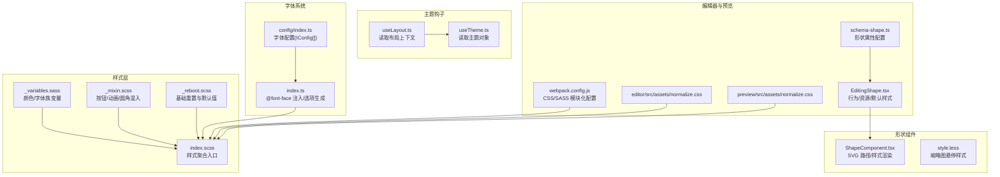
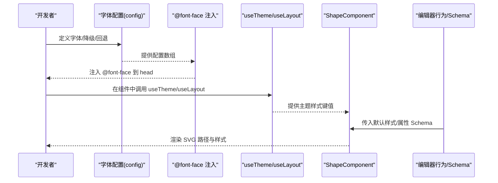
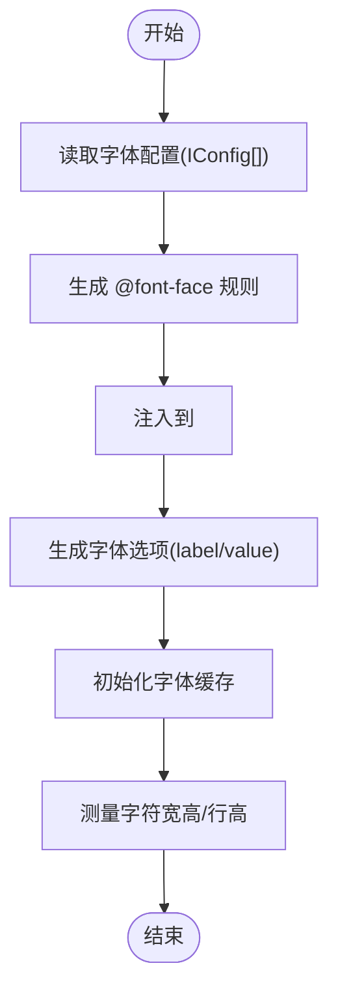
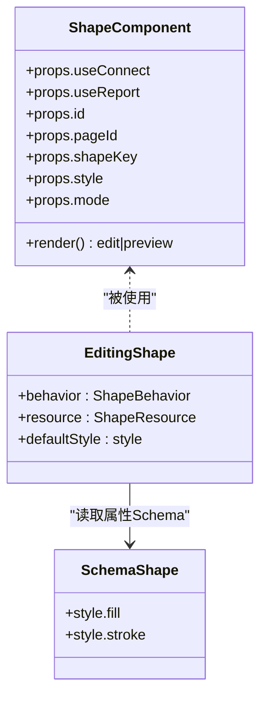
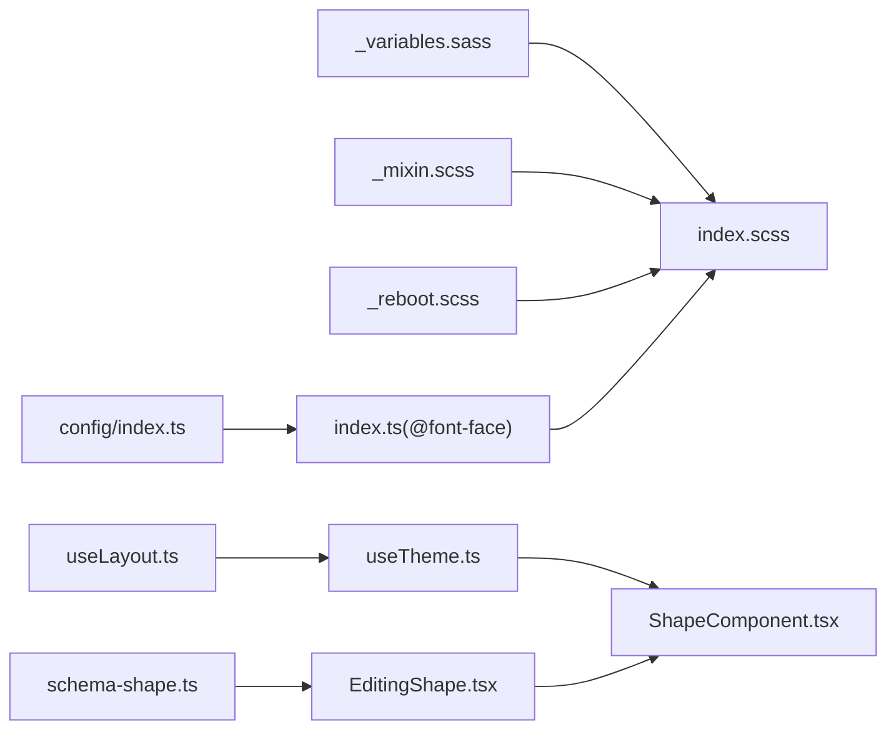

# 主题样式扩展

<cite>
**本文引用的文件**
- [common/slide-fonts/index.ts](file://common/slide-fonts/index.ts)
- [common/slide-fonts/config/index.ts](file://common/slide-fonts/config/index.ts)
- [common/slide-editor/src/styles/_variables.sass](file://common/slide-editor/src/styles/_variables.sass)
- [common/slide-editor/src/styles/_mixin.scss](file://common/slide-editor/src/styles/_mixin.scss)
- [common/slide-editor/src/styles/_reboot.scss](file://common/slide-editor/src/styles/_reboot.scss)
- [common/slide-editor/src/styles/index.scss](file://common/slide-editor/src/styles/index.scss)
- [common/slide-shape/src/component/ShapeComponent.tsx](file://common/slide-shape/src/component/ShapeComponent.tsx)
- [common/slide-shape/src/component/style.less](file://common/slide-shape/src/component/style.less)
- [packages/react/src/hooks/useLayout.ts](file://packages/react/src/hooks/useLayout.ts)
- [packages/react/src/hooks/useTheme.ts](file://packages/react/src/hooks/useTheme.ts)
- [editor/src/components/Shape/EditingShape.tsx](file://editor/src/components/Shape/EditingShape.tsx)
- [editor/src/components/_config/schema-shape.ts](file://editor/src/components/_config/schema-shape.ts)
- [preview/config/webpack.config.js](file://preview/config/webpack.config.js)
- [preview/src/assets/normalize.css](file://preview/src/assets/normalize.css)
- [editor/src/assets/normalize.css](file://editor/src/assets/normalize.css)
- [common/slide-editor/src/components/Input/utils/cache.ts](file://common/slide-editor/src/components/Input/utils/cache.ts)
- [common/slide-editor/src/components/Input/utils/standardTemplate.ts](file://common/slide-editor/src/components/Input/utils/standardTemplate.ts)
</cite>

## 目录
1. [简介](#简介)
2. [项目结构](#项目结构)
3. [核心组件](#核心组件)
4. [架构总览](#架构总览)
5. [详细组件分析](#详细组件分析)
6. [依赖关系分析](#依赖关系分析)
7. [性能考量](#性能考量)
8. [故障排查指南](#故障排查指南)
9. [结论](#结论)
10. [附录](#附录)

## 简介
本指南面向 Slides Engine 的主题样式扩展开发，系统讲解主题系统的设计架构（CSS 变量、主题配置与动态样式切换）、字体系统的扩展（新增字体、字体降级与样式定制）、形状组件的样式扩展（自定义形状定义、样式属性与视觉效果实现），并提供从主题设计到组件适配的完整流程建议。同时覆盖响应式设计与跨浏览器兼容策略，以及样式性能优化（缓存、按需加载与体积优化）。

## 项目结构
Slides Engine 的样式体系由“变量与混入”“字体系统”“形状组件样式”“主题钩子”“编辑器与预览样式入口”等模块构成。整体采用分层组织：变量与混入在样式层统一管理；字体系统通过配置驱动注入；形状组件以可复用的 SVG 路径公式实现；主题钩子提供运行时主题访问；编辑器与预览分别维护各自的样式入口与构建配置。

图表来源
- [common/slide-editor/src/styles/_variables.sass:1-46](file://common/slide-editor/src/styles/_variables.sass#L1-L46)
- [common/slide-editor/src/styles/_mixin.scss:1-82](file://common/slide-editor/src/styles/_mixin.scss#L1-L82)
- [common/slide-editor/src/styles/_reboot.scss:1-562](file://common/slide-editor/src/styles/_reboot.scss#L1-L562)
- [common/slide-editor/src/styles/index.scss:1-36](file://common/slide-editor/src/styles/index.scss#L1-L36)
- [common/slide-fonts/config/index.ts:1-30](file://common/slide-fonts/config/index.ts#L1-L30)
- [common/slide-fonts/index.ts:1-71](file://common/slide-fonts/index.ts#L1-L71)
- [common/slide-shape/src/component/ShapeComponent.tsx:1-114](file://common/slide-shape/src/component/ShapeComponent.tsx#L1-L114)
- [common/slide-shape/src/component/style.less:1-5](file://common/slide-shape/src/component/style.less#L1-L5)
- [packages/react/src/hooks/useLayout.ts:1-12](file://packages/react/src/hooks/useLayout.ts#L1-L12)
- [packages/react/src/hooks/useTheme.ts:1-5](file://packages/react/src/hooks/useTheme.ts#L1-L5)
- [editor/src/components/Shape/EditingShape.tsx:1-103](file://editor/src/components/Shape/EditingShape.tsx#L1-L103)
- [editor/src/components/_config/schema-shape.ts:1-34](file://editor/src/components/_config/schema-shape.ts#L1-L34)
- [preview/config/webpack.config.js:466-558](file://preview/config/webpack.config.js#L466-L558)
- [editor/src/assets/normalize.css:72-350](file://editor/src/assets/normalize.css#L72-L350)
- [preview/src/assets/normalize.css:71-349](file://preview/src/assets/normalize.css#L71-L349)

章节来源
- [common/slide-editor/src/styles/index.scss:1-36](file://common/slide-editor/src/styles/index.scss#L1-L36)
- [common/slide-editor/src/styles/_variables.sass:1-46](file://common/slide-editor/src/styles/_variables.sass#L1-L46)
- [common/slide-editor/src/styles/_mixin.scss:1-82](file://common/slide-editor/src/styles/_mixin.scss#L1-L82)
- [common/slide-editor/src/styles/_reboot.scss:1-562](file://common/slide-editor/src/styles/_reboot.scss#L1-L562)
- [common/slide-fonts/config/index.ts:1-30](file://common/slide-fonts/config/index.ts#L1-L30)
- [common/slide-fonts/index.ts:1-71](file://common/slide-fonts/index.ts#L1-L71)
- [common/slide-shape/src/component/ShapeComponent.tsx:1-114](file://common/slide-shape/src/component/ShapeComponent.tsx#L1-L114)
- [common/slide-shape/src/component/style.less:1-5](file://common/slide-shape/src/component/style.less#L1-L5)
- [packages/react/src/hooks/useLayout.ts:1-12](file://packages/react/src/hooks/useLayout.ts#L1-L12)
- [packages/react/src/hooks/useTheme.ts:1-5](file://packages/react/src/hooks/useTheme.ts#L1-L5)
- [editor/src/components/Shape/EditingShape.tsx:1-103](file://editor/src/components/Shape/EditingShape.tsx#L1-L103)
- [editor/src/components/_config/schema-shape.ts:1-34](file://editor/src/components/_config/schema-shape.ts#L1-L34)
- [preview/config/webpack.config.js:466-558](file://preview/config/webpack.config.js#L466-L558)
- [editor/src/assets/normalize.css:72-350](file://editor/src/assets/normalize.css#L72-L350)
- [preview/src/assets/normalize.css:71-349](file://preview/src/assets/normalize.css#L71-L349)

## 核心组件
- 主题钩子
  - useLayout：从全局上下文中读取设计器布局上下文，包含主题信息。
  - useTheme：基于 useLayout 获取当前主题对象，供组件消费。
- 字体系统
  - 字体配置：集中声明字体名称、family、文件名、降级字体与回退策略。
  - 字体注入：根据配置生成 @font-face 规则并注入 head，支持多格式（woff/woff2/ttf/svg）。
  - 字体选项：生成下拉选择项（label/value），value 为 family 与降级列表拼接。
- 形状组件
  - ShapeComponent：根据 shapeKey 查找路径公式，计算 viewBox 与 path，渲染 SVG；支持编辑态与预览态不同样式合并。
  - 编辑器行为与资源：定义形状组件的行为、默认样式、属性 Schema 与面板文案。
- 样式入口与基础
  - index.scss：聚合变量、重置、混入与各组件样式入口。
  - _variables.sass/_mixin.scss/_reboot.scss：变量、混入与基础重置。
  - normalize.css：编辑器与预览的基础样式归一化。

章节来源
- [packages/react/src/hooks/useLayout.ts:1-12](file://packages/react/src/hooks/useLayout.ts#L1-L12)
- [packages/react/src/hooks/useTheme.ts:1-5](file://packages/react/src/hooks/useTheme.ts#L1-L5)
- [common/slide-fonts/config/index.ts:1-30](file://common/slide-fonts/config/index.ts#L1-L30)
- [common/slide-fonts/index.ts:1-71](file://common/slide-fonts/index.ts#L1-L71)
- [common/slide-shape/src/component/ShapeComponent.tsx:1-114](file://common/slide-shape/src/component/ShapeComponent.tsx#L1-L114)
- [editor/src/components/Shape/EditingShape.tsx:1-103](file://editor/src/components/Shape/EditingShape.tsx#L1-L103)
- [editor/src/components/_config/schema-shape.ts:1-34](file://editor/src/components/_config/schema-shape.ts#L1-L34)
- [common/slide-editor/src/styles/index.scss:1-36](file://common/slide-editor/src/styles/index.scss#L1-L36)
- [common/slide-editor/src/styles/_variables.sass:1-46](file://common/slide-editor/src/styles/_variables.sass#L1-L46)
- [common/slide-editor/src/styles/_mixin.scss:1-82](file://common/slide-editor/src/styles/_mixin.scss#L1-L82)
- [common/slide-editor/src/styles/_reboot.scss:1-562](file://common/slide-editor/src/styles/_reboot.scss#L1-L562)
- [editor/src/assets/normalize.css:72-350](file://editor/src/assets/normalize.css#L72-L350)
- [preview/src/assets/normalize.css:71-349](file://preview/src/assets/normalize.css#L71-L349)

## 架构总览
主题样式扩展围绕“配置驱动 + 运行时钩子 + 组件渲染”的闭环展开。配置层（字体、变量、混入）决定样式基线；运行时钩子（useLayout/useTheme）提供主题上下文；组件层（形状、输入等）消费主题与配置，完成最终渲染。

图表来源
- [common/slide-fonts/config/index.ts:1-30](file://common/slide-fonts/config/index.ts#L1-L30)
- [common/slide-fonts/index.ts:60-68](file://common/slide-fonts/index.ts#L60-L68)
- [packages/react/src/hooks/useTheme.ts:1-5](file://packages/react/src/hooks/useTheme.ts#L1-L5)
- [packages/react/src/hooks/useLayout.ts:1-12](file://packages/react/src/hooks/useLayout.ts#L1-L12)
- [common/slide-shape/src/component/ShapeComponent.tsx:62-110](file://common/slide-shape/src/component/ShapeComponent.tsx#L62-L110)
- [editor/src/components/Shape/EditingShape.tsx:28-77](file://editor/src/components/Shape/EditingShape.tsx#L28-L77)
- [editor/src/components/_config/schema-shape.ts:7-17](file://editor/src/components/_config/schema-shape.ts#L7-L17)

## 详细组件分析

### 主题系统与动态样式切换
- 设计要点
  - 使用 CSS 变量与 SCSS 变量统一管理颜色、字体族与尺寸。
  - 通过 useLayout/useTheme 在组件内读取主题上下文，实现动态样式切换。
  - index.scss 聚合变量、重置与混入，确保主题变更影响全站样式。
- 扩展步骤
  - 在 _variables.sass 中新增或调整变量。
  - 在 index.scss 中引入所需混入与组件样式。
  - 在 useTheme/useLayout 中读取主题键值，传递给组件 props 或 CSS 变量。
  - 在编辑器行为中为组件提供默认样式与 Schema，使面板可配置主题相关属性。

章节来源
- [common/slide-editor/src/styles/_variables.sass:1-46](file://common/slide-editor/src/styles/_variables.sass#L1-L46)
- [common/slide-editor/src/styles/_mixin.scss:1-82](file://common/slide-editor/src/styles/_mixin.scss#L1-L82)
- [common/slide-editor/src/styles/index.scss:1-36](file://common/slide-editor/src/styles/index.scss#L1-L36)
- [packages/react/src/hooks/useLayout.ts:1-12](file://packages/react/src/hooks/useLayout.ts#L1-L12)
- [packages/react/src/hooks/useTheme.ts:1-5](file://packages/react/src/hooks/useTheme.ts#L1-L5)
- [editor/src/components/Shape/EditingShape.tsx:40-50](file://editor/src/components/Shape/EditingShape.tsx#L40-L50)

### 字体系统扩展
- 字体配置
  - IConfig 结构：包含版本、文件名、字体名、fontFamily、降级字体数组与回退开关。
  - 配置数组：集中声明可用字体及其降级链路。
- 字体注入与选项
  - fontBootstrap：生成 @font-face 并注入 head，支持多格式。
  - createFontFamilyOptions：生成下拉选项，value 为 family 与降级列表拼接。
- 字体缓存与测量
  - 输入组件的字体缓存：按 fontFamily/weight/style/stretch/size 维度缓存测量结果，减少重复计算。
  - 标准模板：通过隐藏元素测量字符宽高，支持行高与断行逻辑。

图表来源
- [common/slide-fonts/config/index.ts:1-30](file://common/slide-fonts/config/index.ts#L1-L30)
- [common/slide-fonts/index.ts:44-68](file://common/slide-fonts/index.ts#L44-L68)
- [common/slide-editor/src/components/Input/utils/cache.ts:1-36](file://common/slide-editor/src/components/Input/utils/cache.ts#L1-L36)
- [common/slide-editor/src/components/Input/utils/standardTemplate.ts:26-37](file://common/slide-editor/src/components/Input/utils/standardTemplate.ts#L26-L37)

章节来源
- [common/slide-fonts/config/index.ts:1-30](file://common/slide-fonts/config/index.ts#L1-L30)
- [common/slide-fonts/index.ts:1-71](file://common/slide-fonts/index.ts#L1-L71)
- [common/slide-editor/src/components/Input/utils/cache.ts:1-36](file://common/slide-editor/src/components/Input/utils/cache.ts#L1-L36)
- [common/slide-editor/src/components/Input/utils/standardTemplate.ts:1-37](file://common/slide-editor/src/components/Input/utils/standardTemplate.ts#L1-L37)

### 形状组件样式扩展
- 自定义形状定义
  - ShapeComponent 接收 shapeKey，查找路径公式并计算 viewBox/path，支持编辑态与预览态样式合并。
  - 支持边框样式（solid/dashed/none）、边框色、填充色、线帽、连接处等 SVG 属性。
- 样式属性与视觉效果
  - 默认样式在编辑器行为中定义，Schema 中提供颜色与边框设置。
  - 缩略图 hover 效果通过 less 控制，提升交互反馈。
- 组件适配
  - 编辑器行为中设置默认样式与 propsSchema，保证面板可配置。
  - 预览态样式与编辑态样式分离，避免相互干扰。

图表来源
- [common/slide-shape/src/component/ShapeComponent.tsx:15-114](file://common/slide-shape/src/component/ShapeComponent.tsx#L15-L114)
- [editor/src/components/Shape/EditingShape.tsx:28-103](file://editor/src/components/Shape/EditingShape.tsx#L28-L103)
- [editor/src/components/_config/schema-shape.ts:7-17](file://editor/src/components/_config/schema-shape.ts#L7-L17)

章节来源
- [common/slide-shape/src/component/ShapeComponent.tsx:1-114](file://common/slide-shape/src/component/ShapeComponent.tsx#L1-L114)
- [common/slide-shape/src/component/style.less:1-5](file://common/slide-shape/src/component/style.less#L1-L5)
- [editor/src/components/Shape/EditingShape.tsx:1-103](file://editor/src/components/Shape/EditingShape.tsx#L1-L103)
- [editor/src/components/_config/schema-shape.ts:1-34](file://editor/src/components/_config/schema-shape.ts#L1-L34)

### 主题开发完整流程
- 主题设计
  - 在 _variables.sass 中定义主题色板与字体族。
  - 在 _mixin.scss 中抽象常用样式模式（按钮、动画、圆角）。
- 样式实现
  - 在 index.scss 中引入变量、重置与混入，确保全局一致性。
  - 通过 useTheme/useLayout 在组件中读取主题键值，应用到 DOM/CSS 变量。
- 组件适配
  - 编辑器行为中设置默认样式与属性 Schema，使面板可配置主题相关属性。
  - 形状组件等通过 props 合并主题样式，实现动态切换。

章节来源
- [common/slide-editor/src/styles/_variables.sass:1-46](file://common/slide-editor/src/styles/_variables.sass#L1-L46)
- [common/slide-editor/src/styles/_mixin.scss:1-82](file://common/slide-editor/src/styles/_mixin.scss#L1-L82)
- [common/slide-editor/src/styles/index.scss:1-36](file://common/slide-editor/src/styles/index.scss#L1-L36)
- [packages/react/src/hooks/useTheme.ts:1-5](file://packages/react/src/hooks/useTheme.ts#L1-L5)
- [editor/src/components/Shape/EditingShape.tsx:40-50](file://editor/src/components/Shape/EditingShape.tsx#L40-L50)

### 响应式设计与跨浏览器兼容
- 基础重置与归一化
  - _reboot.scss 提供跨浏览器的基础样式重置。
  - normalize.css 在编辑器与预览中分别引入，确保默认样式一致。
- 构建与模块化
  - webpack.config.js 支持 CSS 与 SASS 模块化（icss/local），便于按需加载与作用域隔离。
- 响应式图标与组件
  - 响应式图标组件可用于工具栏或面板，提升移动端体验。

章节来源
- [common/slide-editor/src/styles/_reboot.scss:1-562](file://common/slide-editor/src/styles/_reboot.scss#L1-L562)
- [preview/src/assets/normalize.css:71-349](file://preview/src/assets/normalize.css#L71-L349)
- [editor/src/assets/normalize.css:72-350](file://editor/src/assets/normalize.css#L72-L350)
- [preview/config/webpack.config.js:466-558](file://preview/config/webpack.config.js#L466-L558)
- [packages/react/src/icons/responsive.tsx:1-9](file://packages/react/src/icons/responsive.tsx#L1-L9)

## 依赖关系分析
- 变量与混入对样式入口的依赖：index.scss 引入变量、重置与混入，形成全局样式基线。
- 字体系统对配置与注入的依赖：config 提供数据源，index.ts 生成 @font-face 并注入。
- 组件对主题钩子的依赖：useTheme/useLayout 提供主题上下文，ShapeComponent 等消费。
- 编辑器行为对组件与 Schema 的依赖：EditingShape 定义默认样式与属性 Schema，驱动面板配置。

图表来源
- [common/slide-editor/src/styles/_variables.sass:1-46](file://common/slide-editor/src/styles/_variables.sass#L1-L46)
- [common/slide-editor/src/styles/_mixin.scss:1-82](file://common/slide-editor/src/styles/_mixin.scss#L1-L82)
- [common/slide-editor/src/styles/_reboot.scss:1-562](file://common/slide-editor/src/styles/_reboot.scss#L1-L562)
- [common/slide-editor/src/styles/index.scss:1-36](file://common/slide-editor/src/styles/index.scss#L1-L36)
- [common/slide-fonts/config/index.ts:1-30](file://common/slide-fonts/config/index.ts#L1-L30)
- [common/slide-fonts/index.ts:44-68](file://common/slide-fonts/index.ts#L44-L68)
- [packages/react/src/hooks/useLayout.ts:1-12](file://packages/react/src/hooks/useLayout.ts#L1-L12)
- [packages/react/src/hooks/useTheme.ts:1-5](file://packages/react/src/hooks/useTheme.ts#L1-L5)
- [common/slide-shape/src/component/ShapeComponent.tsx:1-114](file://common/slide-shape/src/component/ShapeComponent.tsx#L1-L114)
- [editor/src/components/Shape/EditingShape.tsx:1-103](file://editor/src/components/Shape/EditingShape.tsx#L1-L103)
- [editor/src/components/_config/schema-shape.ts:1-34](file://editor/src/components/_config/schema-shape.ts#L1-L34)

章节来源
- [common/slide-editor/src/styles/index.scss:1-36](file://common/slide-editor/src/styles/index.scss#L1-L36)
- [common/slide-fonts/index.ts:1-71](file://common/slide-fonts/index.ts#L1-L71)
- [packages/react/src/hooks/useTheme.ts:1-5](file://packages/react/src/hooks/useTheme.ts#L1-L5)
- [common/slide-shape/src/component/ShapeComponent.tsx:1-114](file://common/slide-shape/src/component/ShapeComponent.tsx#L1-L114)
- [editor/src/components/Shape/EditingShape.tsx:1-103](file://editor/src/components/Shape/EditingShape.tsx#L1-L103)
- [editor/src/components/_config/schema-shape.ts:1-34](file://editor/src/components/_config/schema-shape.ts#L1-L34)

## 性能考量
- 样式缓存
  - 字体缓存：按 fontFamily/weight/style/stretch/size 维度缓存测量结果，减少重复计算。
  - 输入组件标准模板：通过隐藏元素测量字符宽高，降低文本布局抖动与重排成本。
- 按需加载
  - webpack.config.js 支持 CSS/SASS 模块化（icss/local），按需打包与作用域隔离，减小包体。
- 体积优化
  - 字体多格式（woff/woff2/ttf/svg）注入，优先使用现代格式（woff2）以减小体积。
  - 合理拆分样式入口，避免一次性加载过多样式。

章节来源
- [common/slide-editor/src/components/Input/utils/cache.ts:1-36](file://common/slide-editor/src/components/Input/utils/cache.ts#L1-L36)
- [common/slide-editor/src/components/Input/utils/standardTemplate.ts:26-37](file://common/slide-editor/src/components/Input/utils/standardTemplate.ts#L26-L37)
- [preview/config/webpack.config.js:466-558](file://preview/config/webpack.config.js#L466-L558)
- [common/slide-fonts/index.ts:14-19](file://common/slide-fonts/index.ts#L14-L19)

## 故障排查指南
- 字体未生效
  - 检查 @font-face 是否成功注入 head。
  - 确认字体文件路径与格式存在，且配置中的 fileName 与目录一致。
  - 若浏览器不支持某格式，检查降级链（downgrade）是否正确。
- 样式未覆盖
  - 确认 index.scss 已引入变量、重置与混入。
  - 检查组件是否正确消费 useTheme/useLayout 返回的主题键值。
- 形状样式异常
  - 检查编辑器行为中的默认样式与属性 Schema 是否正确。
  - 确认 ShapeComponent 的 viewBox 与 path 计算逻辑与传入尺寸一致。
- 兼容性问题
  - 确保编辑器与预览均引入 normalize.css。
  - 检查 _reboot.scss 是否正确覆盖默认样式。

章节来源
- [common/slide-fonts/index.ts:60-68](file://common/slide-fonts/index.ts#L60-L68)
- [common/slide-editor/src/styles/index.scss:1-36](file://common/slide-editor/src/styles/index.scss#L1-L36)
- [packages/react/src/hooks/useTheme.ts:1-5](file://packages/react/src/hooks/useTheme.ts#L1-L5)
- [common/slide-shape/src/component/ShapeComponent.tsx:46-61](file://common/slide-shape/src/component/ShapeComponent.tsx#L46-L61)
- [editor/src/components/Shape/EditingShape.tsx:40-50](file://editor/src/components/Shape/EditingShape.tsx#L40-L50)
- [editor/src/assets/normalize.css:72-350](file://editor/src/assets/normalize.css#L72-L350)
- [preview/src/assets/normalize.css:71-349](file://preview/src/assets/normalize.css#L71-L349)
- [common/slide-editor/src/styles/_reboot.scss:1-562](file://common/slide-editor/src/styles/_reboot.scss#L1-L562)

## 结论
Slides Engine 的主题样式扩展以“配置驱动 + 运行时钩子 + 组件渲染”为核心，结合 SCSS 变量与混入、@font-face 注入、组件默认样式与 Schema，形成可扩展、可维护的主题体系。通过字体缓存、按需加载与体积优化策略，可在保证体验的同时控制包体与渲染成本。建议在主题设计阶段统一变量与混入，在组件适配阶段通过编辑器行为与 Schema 提升可配置性，并在预览与编辑两端保持样式一致性。

## 附录
- 关键实现位置参考
  - 主题钩子：[useLayout:1-12](file://packages/react/src/hooks/useLayout.ts#L1-L12)、[useTheme:1-5](file://packages/react/src/hooks/useTheme.ts#L1-L5)
  - 字体系统：[config:1-30](file://common/slide-fonts/config/index.ts#L1-L30)、[@font-face 注入:44-68](file://common/slide-fonts/index.ts#L44-L68)
  - 形状组件：[ShapeComponent:1-114](file://common/slide-shape/src/component/ShapeComponent.tsx#L1-L114)、[编辑器行为:1-103](file://editor/src/components/Shape/EditingShape.tsx#L1-L103)
  - 样式入口：[index.scss:1-36](file://common/slide-editor/src/styles/index.scss#L1-L36)、[变量:1-46](file://common/slide-editor/src/styles/_variables.sass#L1-L46)、[混入:1-82](file://common/slide-editor/src/styles/_mixin.scss#L1-L82)、[重置:1-562](file://common/slide-editor/src/styles/_reboot.scss#L1-L562)
  - 构建配置：[webpack.config.js:466-558](file://preview/config/webpack.config.js#L466-L558)
  - 兼容性：[normalize.css（编辑器）:72-350](file://editor/src/assets/normalize.css#L72-L350)、[normalize.css（预览）:71-349](file://preview/src/assets/normalize.css#L71-L349)