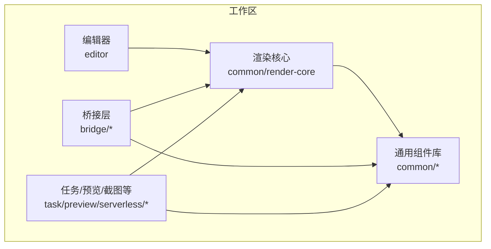
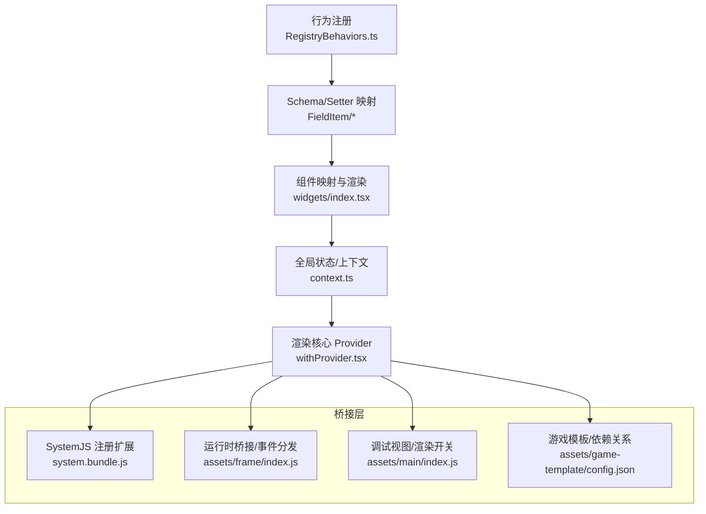
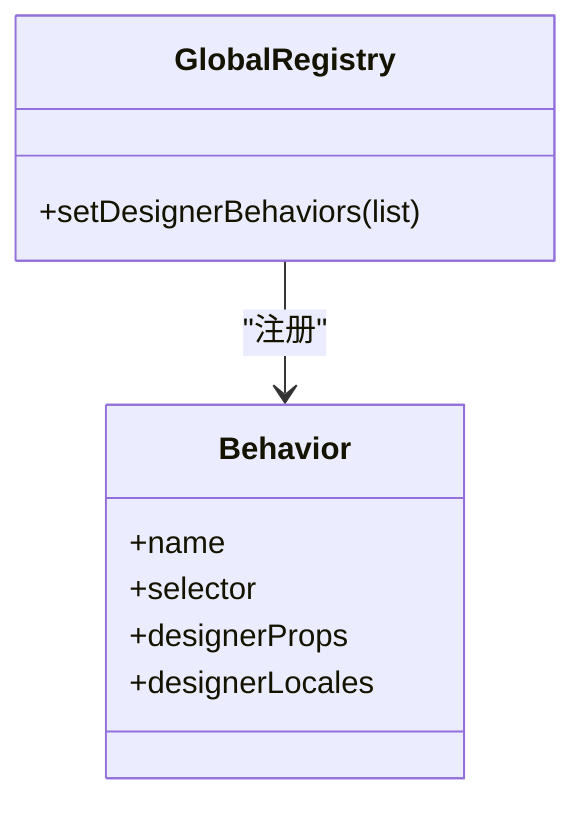
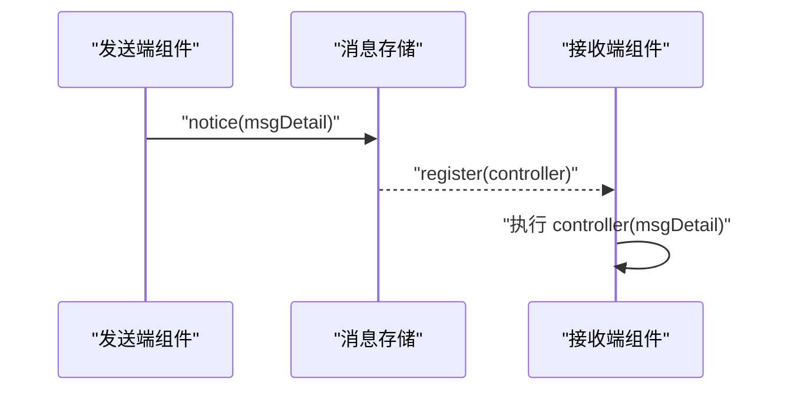
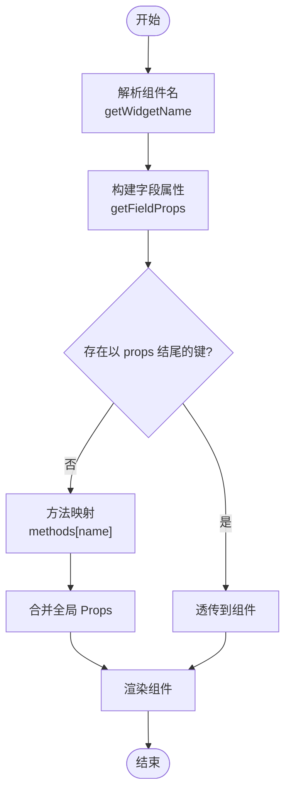
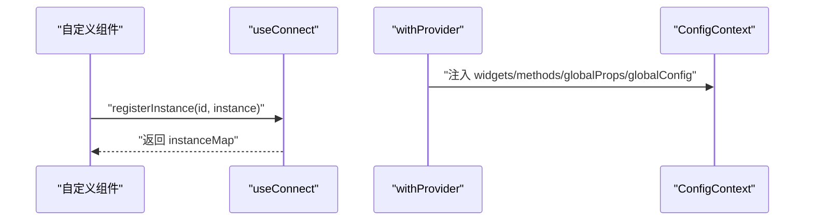
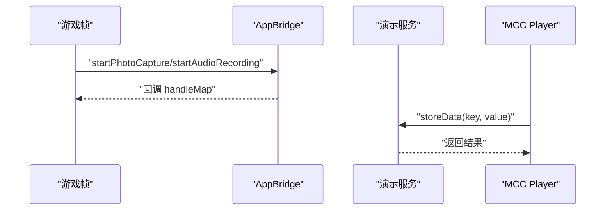
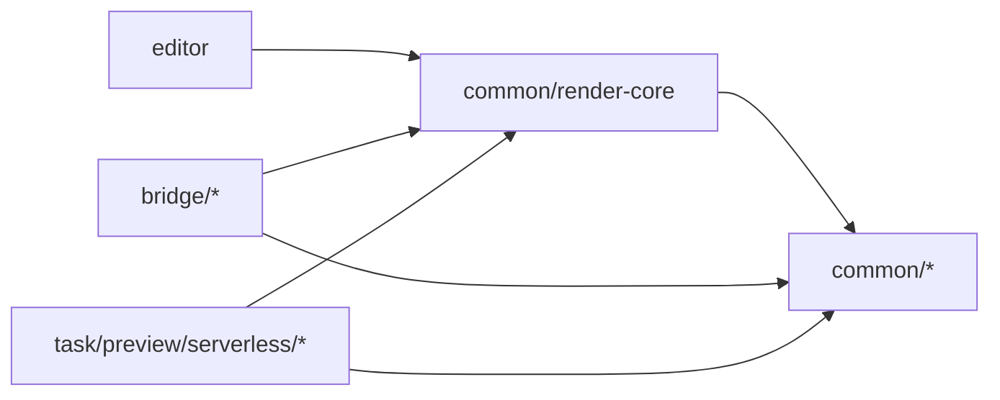

# 扩展开发

<cite>
**本文引用的文件**
- [RegistryBehaviors.ts](file://editor/src/RegistryBehaviors.ts)
- [context.ts](file://common/render-core/models/context.ts)
- [withProvider.tsx](file://common/render-core/models/withProvider.tsx)
- [widgets/index.tsx](file://common/render-core/widgets/index.tsx)
- [FieldItem/index.tsx](file://common/render-core/FieldItem/index.tsx)
- [module.tsx](file://common/render-core/FieldItem/module.tsx)
- [viewInput.tsx](file://common/slide-editor/src/components/Input/viewInput.tsx)
- [editInput.tsx](file://common/slide-editor/src/components/Input/editInput.tsx)
- [config.json](file://bridge/cocos-game-player/assets/internal/config.json)
- [config.json](file://bridge/cocos-game-player/assets/game-template/config.json)
- [bundle.js](file://bridge/cocos-game-player/src/chunks/bundle.js)
- [system.bundle.js](file://bridge/cocos-game-player/src/system.bundle.js)
- [index.js](file://bridge/cocos-game-player/assets/main/index.js)
- [index.js](file://bridge/cocos-game-player/assets/frame/index.js)
- [webgl-debug.js](file://bridge/cocos-game-player/webgl-debug.js)
- [index.ts](file://bridge/mcc-demo/src/pomelo/index.ts)
- [gameManager.ts](file://bridge/mcc-player/src/components/game-manage/gameManager.ts)
- [index.ts](file://bridge/mcc-player/src/components/player/index.ts)
- [_variables.sass](file://common/slide-editor/src/styles/_variables.sass)
- [index.ts](file://common/slide-fonts/index.ts)
- [pnpm-workspace.yaml](file://pnpm-workspace.yaml)
</cite>

## 目录
1. [简介](#简介)
2. [项目结构](#项目结构)
3. [核心组件](#核心组件)
4. [架构总览](#架构总览)
5. [详细组件分析](#详细组件分析)
6. [依赖分析](#依赖分析)
7. [性能考虑](#性能考虑)
8. [故障排查指南](#故障排查指南)
9. [结论](#结论)
10. [附录](#附录)

## 简介
本指南面向 Slides Engine 的扩展开发者，系统讲解插件系统的架构与扩展机制，涵盖行为注册、资源注册、Setter 扩展、组件开发、行为开发、第三方集成、主题与样式扩展、最佳实践与性能优化，以及调试技巧与完整示例路径。

## 项目结构
Slides Engine 采用多包工作区组织，核心围绕“编辑器”“渲染内核”“桥接层（Cocos/Player）”“通用组件库”展开。工作区通过统一的包管理工具进行管理，便于扩展模块的独立开发与发布。

图示来源
- [pnpm-workspace.yaml:1-7](file://pnpm-workspace.yaml#L1-L7)

章节来源
- [pnpm-workspace.yaml:1-7](file://pnpm-workspace.yaml#L1-L7)

## 核心组件
- 行为注册与设计器配置：编辑器侧通过全局注册表集中管理组件行为，支持拖拽、属性面板、国际化等。
- 渲染上下文与状态：渲染内核提供全局状态（资源上报、实例注册、消息队列）、上下文注入与 Provider 包装。
- 组件映射与字段渲染：基于 Schema 的字段渲染器，动态解析组件名、属性与方法映射。
- 桥接与第三方集成：Cocos 游戏运行时桥接、消息分发、调试视图；MCC Player 与外部服务通信、数据同步。
- 主题与字体：SASS 变量体系与字体注入，支持主题切换与动态样式。

章节来源
- [RegistryBehaviors.ts:1-69](file://editor/src/RegistryBehaviors.ts#L1-L69)
- [context.ts:1-226](file://common/render-core/models/context.ts#L1-L226)
- [withProvider.tsx:1-31](file://common/render-core/models/withProvider.tsx#L1-L31)
- [widgets/index.tsx:1-130](file://common/render-core/widgets/index.tsx#L1-L130)
- [FieldItem/index.tsx:1-61](file://common/render-core/FieldItem/index.tsx#L1-L61)
- [module.tsx:69-109](file://common/render-core/FieldItem/module.tsx#L69-L109)
- [index.js:1-200](file://bridge/cocos-game-player/assets/frame/index.js#L1-L200)
- [index.ts:142-174](file://bridge/mcc-player/src/components/player/index.ts#L142-L174)

## 架构总览
整体架构分为三层：
- 编辑器层：定义组件行为、属性 Schema、设计器交互。
- 渲染层：根据 Schema 渲染组件，维护全局状态与上下文，提供消息与资源上报能力。
- 桥接层：承载 Cocos 运行时、消息桥接、第三方 SDK、数据同步与调试工具。

图示来源
- [RegistryBehaviors.ts:1-69](file://editor/src/RegistryBehaviors.ts#L1-L69)
- [FieldItem/index.tsx:1-61](file://common/render-core/FieldItem/index.tsx#L1-L61)
- [widgets/index.tsx:1-130](file://common/render-core/widgets/index.tsx#L1-L130)
- [context.ts:1-226](file://common/render-core/models/context.ts#L1-L226)
- [withProvider.tsx:1-31](file://common/render-core/models/withProvider.tsx#L1-L31)
- [system.bundle.js:1046-1084](file://bridge/cocos-game-player/src/system.bundle.js#L1046-L1084)
- [index.js:1-200](file://bridge/cocos-game-player/assets/frame/index.js#L1-L200)
- [index.js:1-100](file://bridge/cocos-game-player/assets/main/index.js#L1-L100)
- [config.json:1-205](file://bridge/cocos-game-player/assets/game-template/config.json#L1-L205)

## 详细组件分析

### 行为注册与设计器配置
- 设计器行为通过全局注册表集中管理，支持根组件、卡片、分组、形状、图片、文本、视频、音频、富文本、相机、游戏等组件的行为定义与属性 Schema。
- 行为包含选择器、设计器属性（如拖拽、属性 Schema）、本地化文案等。

图示来源
- [RegistryBehaviors.ts:1-69](file://editor/src/RegistryBehaviors.ts#L1-L69)

章节来源
- [RegistryBehaviors.ts:1-69](file://editor/src/RegistryBehaviors.ts#L1-L69)

### 资源注册与消息序列
- 资源上报：提供资源状态（新增、更新、移除）与去重策略，支持按页面与组件维度上报。
- 实例注册：受控组件可上报实例，形成实例映射，供其他组件按需订阅。
- 消息序列：消息队列与控制器注册，支持发送端 notice 与接收端 register，实现跨端同步与回放。

图示来源
- [context.ts:158-225](file://common/render-core/models/context.ts#L158-L225)

章节来源
- [context.ts:1-226](file://common/render-core/models/context.ts#L1-L226)

### Setter 扩展与属性配置
- 字段渲染器根据 Schema 动态解析组件名与属性，支持以 props 结尾的属性透传、方法动态映射、addonAfter 自定义组件等。
- 全局 Props 与全局 Config 可通过 Provider 注入，实现跨组件一致的配置入口。

图示来源
- [FieldItem/index.tsx:1-61](file://common/render-core/FieldItem/index.tsx#L1-L61)
- [module.tsx:69-109](file://common/render-core/FieldItem/module.tsx#L69-L109)
- [withProvider.tsx:1-31](file://common/render-core/models/withProvider.tsx#L1-L31)

章节来源
- [FieldItem/index.tsx:1-61](file://common/render-core/FieldItem/index.tsx#L1-L61)
- [module.tsx:69-109](file://common/render-core/FieldItem/module.tsx#L69-L109)
- [withProvider.tsx:1-31](file://common/render-core/models/withProvider.tsx#L1-L31)

### 组件开发：定义、属性与交互
- 组件映射：在内置组件集合中注册新组件，配合 Provider 将其纳入渲染体系。
- 实例注册：组件在挂载时通过 useConnect 注册实例，便于跨组件联动与状态同步。
- 交互逻辑：通过消息序列的 notice/register 实现事件驱动与状态回放。

图示来源
- [widgets/index.tsx:1-130](file://common/render-core/widgets/index.tsx#L1-L130)
- [withProvider.tsx:1-31](file://common/render-core/models/withProvider.tsx#L1-L31)
- [context.ts:99-140](file://common/render-core/models/context.ts#L99-L140)

章节来源
- [widgets/index.tsx:1-130](file://common/render-core/widgets/index.tsx#L1-L130)
- [withProvider.tsx:1-31](file://common/render-core/models/withProvider.tsx#L1-L31)
- [context.ts:99-140](file://common/render-core/models/context.ts#L99-L140)

### 行为开发：注册、事件与状态
- 行为注册：在编辑器侧通过 createBehavior 定义组件行为，设置选择器与设计器属性，再通过 GlobalRegistry.setDesignerBehaviors 注册。
- 事件处理：利用消息序列的 notice/register，将交互转化为可同步的状态或事件。
- 状态管理：通过资源上报与实例注册，实现跨组件状态一致性。

章节来源
- [RegistryBehaviors.ts:1-69](file://editor/src/RegistryBehaviors.ts#L1-L69)
- [context.ts:158-225](file://common/render-core/models/context.ts#L158-L225)

### 第三方集成：外部 API、SDK 与数据同步
- Cocos 运行时桥接：通过 AppBridge 管理客户端事件、拍照/录音回调、消息分发与监听。
- 数据同步：MCC Player 的页面管理器与游戏管理器负责将全局数据（含消息队列、游戏同步数据）写入全局状态并上报。
- 外部服务：演示项目提供 WebSocket 连接与存储接口，可作为接入外部服务的参考。

图示来源
- [index.js:1-200](file://bridge/cocos-game-player/assets/frame/index.js#L1-L200)
- [index.ts:56-104](file://bridge/mcc-demo/src/pomelo/index.ts#L56-L104)
- [index.ts:142-174](file://bridge/mcc-player/src/components/player/index.ts#L142-L174)

章节来源
- [index.js:1-200](file://bridge/cocos-game-player/assets/frame/index.js#L1-L200)
- [index.ts:56-104](file://bridge/mcc-demo/src/pomelo/index.ts#L56-L104)
- [index.ts:142-174](file://bridge/mcc-player/src/components/player/index.ts#L142-L174)

### 主题与样式扩展：CSS 变量、主题配置与动态切换
- 主题变量：通过 SASS 变量定义颜色、字体族等基础变量，便于统一风格。
- 字体注入：动态生成 @font-face 样式并注入 head，支持多种格式与降级方案。
- 动态样式：结合 Provider 的 globalProps/globalConfig，实现主题切换与样式覆盖。

章节来源
- [_variables.sass:1-46](file://common/slide-editor/src/styles/_variables.sass#L1-L46)
- [index.ts:1-70](file://common/slide-fonts/index.ts#L1-L70)
- [withProvider.tsx:1-31](file://common/render-core/models/withProvider.tsx#L1-L31)

### 渲染系统与模块加载：SystemJS 注册与运行时桥接
- SystemJS 注册扩展：支持命名 register，将模块注册到注册表，便于按名导入。
- Bundle 与运行时：运行时桥接负责事件派发、组件生命周期与调试视图控制。
- 游戏模板与依赖：模板配置文件描述依赖关系、打包信息与调试开关。

章节来源
- [system.bundle.js:1046-1084](file://bridge/cocos-game-player/src/system.bundle.js#L1046-L1084)
- [bundle.js:507-552](file://bridge/cocos-game-player/src/chunks/bundle.js#L507-L552)
- [index.js:1-100](file://bridge/cocos-game-player/assets/main/index.js#L1-L100)
- [config.json:1-205](file://bridge/cocos-game-player/assets/game-template/config.json#L1-L205)

## 依赖分析
- 工作区依赖：编辑器依赖渲染核心与通用组件库；桥接层依赖渲染核心与通用组件库；任务/预览等模块依赖渲染核心与通用组件库。
- 运行时依赖：SystemJS 注册机制、运行时桥接、调试视图与游戏模板配置共同构成运行时扩展点。

图示来源
- [pnpm-workspace.yaml:1-7](file://pnpm-workspace.yaml#L1-L7)

章节来源
- [pnpm-workspace.yaml:1-7](file://pnpm-workspace.yaml#L1-L7)

## 性能考虑
- 状态订阅优化：useConnect 仅关注指定组件 ID 列表，避免无关组件变更引发的重渲染。
- 消息序列缓存：消息控制器注册时可从缓存恢复，减少重复派发成本。
- 资源上报去重：按页面与组件维度去重，避免重复上报导致的性能损耗。
- Provider 合并注入：通过 Provider 合并默认与自定义 widgets/methods/globalProps/globalConfig，降低重复渲染概率。

章节来源
- [context.ts:137-140](file://common/render-core/models/context.ts#L137-L140)
- [context.ts:158-225](file://common/render-core/models/context.ts#L158-L225)
- [context.ts:55-93](file://common/render-core/models/context.ts#L55-L93)
- [withProvider.tsx:1-31](file://common/render-core/models/withProvider.tsx#L1-L31)

## 故障排查指南
- SystemJS 注册异常：检查命名 register 的模块是否正确写入注册表，确认按名导入可用。
- 事件未派发：检查 FrameListenerManager 的事件列表与目标节点有效性，确保组件未被销毁且处于激活层级。
- 调试视图无效：确认调试视图组件挂载于 Canvas 下，UI 布局与可见性设置正确。
- 游戏模板依赖缺失：核对模板 config.json 中的依赖关系与打包信息，确保路径与版本匹配。
- 数据同步失败：检查全局数据写入与上报流程，确认页面信息与消息队列有效。

章节来源
- [system.bundle.js:1046-1084](file://bridge/cocos-game-player/src/system.bundle.js#L1046-L1084)
- [index.js:1579-1679](file://bridge/cocos-game-player/assets/frame/index.js#L1579-L1679)
- [index.js:609-669](file://bridge/cocos-game-player/assets/main/index.js#L609-L669)
- [config.json:114-205](file://bridge/cocos-game-player/assets/game-template/config.json#L114-L205)
- [index.ts:142-174](file://bridge/mcc-player/src/components/player/index.ts#L142-L174)

## 结论
Slides Engine 的扩展开发围绕“行为注册—渲染上下文—桥接集成—主题样式”四条主线展开。通过全局注册表与 Provider 注入，开发者可以快速扩展组件与行为；借助消息序列与资源上报，实现跨端交互与状态一致性；通过 SystemJS 注册与运行时桥接，实现模块化与可插拔的运行时扩展；结合主题与字体体系，实现灵活的主题切换与样式定制。

## 附录
- 扩展开发示例路径
  - 行为注册与设计器配置：[RegistryBehaviors.ts:1-69](file://editor/src/RegistryBehaviors.ts#L1-L69)
  - 渲染上下文与 Provider：[context.ts:1-226](file://common/render-core/models/context.ts#L1-L226)、[withProvider.tsx:1-31](file://common/render-core/models/withProvider.tsx#L1-L31)
  - 组件映射与字段渲染：[widgets/index.tsx:1-130](file://common/render-core/widgets/index.tsx#L1-L130)、[FieldItem/index.tsx:1-61](file://common/render-core/FieldItem/index.tsx#L1-L61)、[module.tsx:69-109](file://common/render-core/FieldItem/module.tsx#L69-L109)
  - 实例注册与交互：[context.ts:99-140](file://common/render-core/models/context.ts#L99-L140)、[viewInput.tsx:1-39](file://common/slide-editor/src/components/Input/viewInput.tsx#L1-L39)、[editInput.tsx:85-111](file://common/slide-editor/src/components/Input/editInput.tsx#L85-L111)
  - 桥接与第三方集成：[index.js:1-200](file://bridge/cocos-game-player/assets/frame/index.js#L1-L200)、[index.ts:56-104](file://bridge/mcc-demo/src/pomelo/index.ts#L56-L104)、[index.ts:142-174](file://bridge/mcc-player/src/components/player/index.ts#L142-L174)
  - 主题与字体：[_variables.sass:1-46](file://common/slide-editor/src/styles/_variables.sass#L1-L46)、[index.ts:1-70](file://common/slide-fonts/index.ts#L1-L70)
  - 运行时与模板：[system.bundle.js:1046-1084](file://bridge/cocos-game-player/src/system.bundle.js#L1046-L1084)、[bundle.js:507-552](file://bridge/cocos-game-player/src/chunks/bundle.js#L507-L552)、[config.json:1-205](file://bridge/cocos-game-player/assets/game-template/config.json#L1-L205)