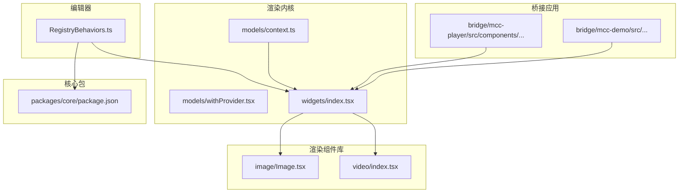
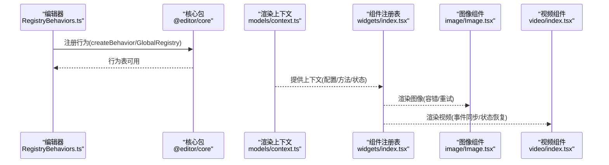
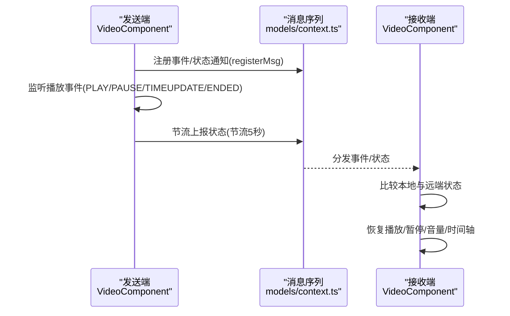
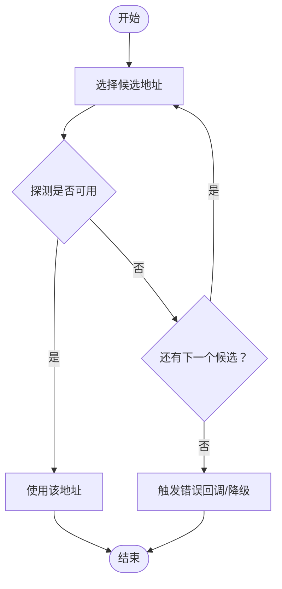
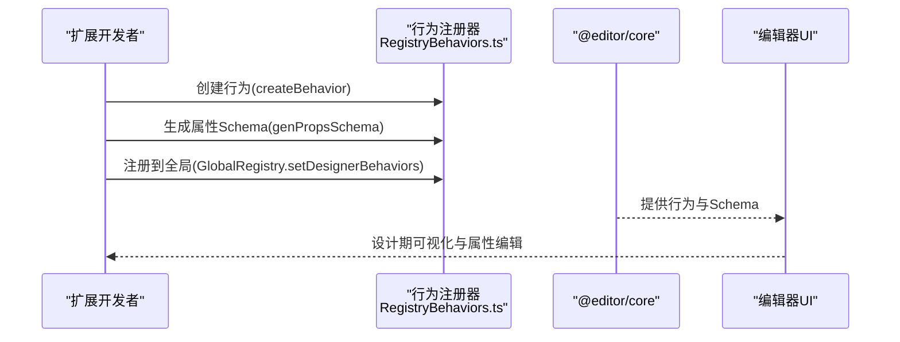
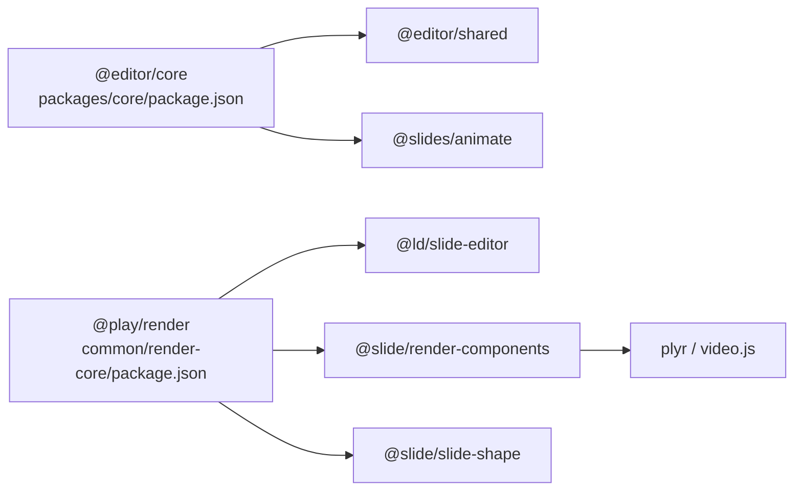

# 扩展开发示例

<cite>
**本文引用的文件**
- [README.md](file://README.md)
- [packages/core/package.json](file://packages/core/package.json)
- [common/render-core/package.json](file://common/render-core/package.json)
- [common/render-components/package.json](file://common/render-components/package.json)
- [editor/src/RegistryBehaviors.ts](file://editor/src/RegistryBehaviors.ts)
- [common/render-core/models/context.ts](file://common/render-core/models/context.ts)
- [common/render-core/models/withProvider.tsx](file://common/render-core/models/withProvider.tsx)
- [common/render-core/widgets/index.tsx](file://common/render-core/widgets/index.tsx)
- [common/render-components/src/image/Image.tsx](file://common/render-components/src/image/Image.tsx)
- [common/render-components/src/video/index.tsx](file://common/render-components/src/video/index.tsx)
</cite>

## 目录
1. [简介](#简介)
2. [项目结构](#项目结构)
3. [核心组件](#核心组件)
4. [架构总览](#架构总览)
5. [详细组件分析](#详细组件分析)
6. [依赖分析](#依赖分析)
7. [性能考虑](#性能考虑)
8. [故障排除指南](#故障排除指南)
9. [结论](#结论)
10. [附录](#附录)

## 简介
本文件面向 Slides Engine 的扩展开发者，提供从需求分析到最终部署的完整工作流程与实用示例集合，覆盖简单组件扩展、复杂行为定制与第三方服务集成三类场景。内容基于仓库现有模块与接口，结合组件注册、行为定义、上下文与消息序列、渲染组件库等机制，给出可操作的步骤、关键点与注意事项，并配套测试与发布维护建议。

## 项目结构
Slides Engine 采用多包工作区组织方式，围绕“编辑器”“渲染内核”“渲染组件库”“桥接应用”等模块协同工作。扩展开发主要涉及以下路径与职责：
- packages/core：核心行为与注册入口，承载行为定义与全局注册
- common/render-core：渲染上下文、消息序列、全局状态与 Provider 包装
- common/render-components：内置渲染组件（图像、视频等）与第三方播放器集成
- editor：编辑器侧行为注册与配置生成
- bridge：桥接应用（如 MCC Player/ Demo），用于跨应用通信与资源桥接

图表来源
- [packages/core/package.json:1-24](file://packages/core/package.json#L1-L24)
- [common/render-core/package.json:1-33](file://common/render-core/package.json#L1-L33)
- [common/render-components/package.json:1-23](file://common/render-components/package.json#L1-L23)
- [editor/src/RegistryBehaviors.ts:1-69](file://editor/src/RegistryBehaviors.ts#L1-L69)
- [common/render-core/models/context.ts:1-226](file://common/render-core/models/context.ts#L1-L226)
- [common/render-core/models/withProvider.tsx:1-31](file://common/render-core/models/withProvider.tsx#L1-L31)
- [common/render-core/widgets/index.tsx:1-130](file://common/render-core/widgets/index.tsx#L1-L130)
- [common/render-components/src/image/Image.tsx:1-48](file://common/render-components/src/image/Image.tsx#L1-L48)
- [common/render-components/src/video/index.tsx:1-472](file://common/render-components/src/video/index.tsx#L1-L472)

章节来源
- [README.md:1-17](file://README.md#L1-L17)
- [packages/core/package.json:1-24](file://packages/core/package.json#L1-L24)
- [common/render-core/package.json:1-33](file://common/render-core/package.json#L1-L33)
- [common/render-components/package.json:1-23](file://common/render-components/package.json#L1-L23)

## 核心组件
- 行为注册与全局行为表
  - 编辑器侧通过行为注册器集中注册各组件行为，形成统一的设计期体验与属性面板
  - 关键文件：[RegistryBehaviors.ts:1-69](file://editor/src/RegistryBehaviors.ts#L1-L69)
- 渲染上下文与 Provider
  - 提供全局配置、方法、受控组件实例注册、资源上报、消息序列等能力
  - 关键文件：[context.ts:1-226](file://common/render-core/models/context.ts#L1-L226)，[withProvider.tsx:1-31](file://common/render-core/models/withProvider.tsx#L1-L31)
- 内置渲染组件
  - 图像组件：多源容错、超时与重试、错误回退
  - 视频组件：播放器事件同步、状态恢复、封面图与播放源切换、埋点日志
  - 关键文件：[Image.tsx:1-48](file://common/render-components/src/image/Image.tsx#L1-L48)，[video/index.tsx:1-472](file://common/render-components/src/video/index.tsx#L1-L472)
- 渲染组件注册表
  - 将组件名映射到具体渲染组件，并提供错误边界包装
  - 关键文件：[widgets/index.tsx:1-130](file://common/render-core/widgets/index.tsx#L1-L130)

章节来源
- [editor/src/RegistryBehaviors.ts:1-69](file://editor/src/RegistryBehaviors.ts#L1-L69)
- [common/render-core/models/context.ts:1-226](file://common/render-core/models/context.ts#L1-L226)
- [common/render-core/models/withProvider.tsx:1-31](file://common/render-core/models/withProvider.tsx#L1-L31)
- [common/render-core/widgets/index.tsx:1-130](file://common/render-core/widgets/index.tsx#L1-L130)
- [common/render-components/src/image/Image.tsx:1-48](file://common/render-components/src/image/Image.tsx#L1-L48)
- [common/render-components/src/video/index.tsx:1-472](file://common/render-components/src/video/index.tsx#L1-L472)

## 架构总览
扩展开发围绕“行为定义—组件注册—上下文与消息—渲染组件—桥接应用”的链路展开。下图展示了从编辑器行为注册到渲染组件消费上下文的关键交互：

图表来源
- [editor/src/RegistryBehaviors.ts:1-69](file://editor/src/RegistryBehaviors.ts#L1-L69)
- [common/render-core/models/context.ts:1-226](file://common/render-core/models/context.ts#L1-L226)
- [common/render-core/widgets/index.tsx:1-130](file://common/render-core/widgets/index.tsx#L1-L130)
- [common/render-components/src/image/Image.tsx:1-48](file://common/render-components/src/image/Image.tsx#L1-L48)
- [common/render-components/src/video/index.tsx:1-472](file://common/render-components/src/video/index.tsx#L1-L472)

## 详细组件分析

### 示例一：简单组件扩展（新增一个内置组件）
目标：在渲染组件库中新增一个简单组件（例如“计数器”），并在渲染注册表中暴露给编辑器与播放器使用。

实现思路
- 定义组件：实现一个具备受控属性与最小交互的组件，确保可复用与可测试
- 注册组件：在渲染注册表中添加组件映射，并使用错误边界包装
- 上下文消费：通过 Provider 注入的全局配置/方法，按需读取或下发回调
- 行为联动：如需在编辑器侧显示属性面板，参考行为注册方式补充设计期属性与校验

关键要点
- 组件命名与注册表键一致，避免冲突
- 使用错误边界包裹，提升稳定性
- 保持无副作用渲染，必要时通过回调或上下文触发变更
- 注意资源加载与容错（参考图像组件的多源容错策略）

章节来源
- [common/render-core/widgets/index.tsx:1-130](file://common/render-core/widgets/index.tsx#L1-L130)
- [common/render-core/models/withProvider.tsx:1-31](file://common/render-core/models/withProvider.tsx#L1-L31)

### 示例二：复杂行为定制（视频组件的播放状态同步与恢复）
目标：在视频组件中实现“发送端事件/状态广播 + 接收端状态恢复”，并支持断线重连、可见性与自动播放等场景。

实现思路
- 事件监听：在播放器 Ready 后注册事件监听，节流上报状态变化
- 状态恢复：根据远端状态差异，主动恢复播放/暂停、音量、静音、时间轴等
- 资源容错：封面图与播放源均支持多地址探测与失败回退
- 埋点日志：区分事件/状态两类消息，分别记录发送与接收

图表来源
- [common/render-components/src/video/index.tsx:148-375](file://common/render-components/src/video/index.tsx#L148-L375)
- [common/render-core/models/context.ts:157-225](file://common/render-core/models/context.ts#L157-L225)

关键要点
- 仅在非编辑模式注册消息，避免干扰编辑态
- 断线重连时区分 TIMEUPDATE 与其他事件，避免重复跳步
- 可见性与自动播放场景需谨慎处理，防止重复触发
- 埋点区分发送/接收，便于定位问题

章节来源
- [common/render-components/src/video/index.tsx:1-472](file://common/render-components/src/video/index.tsx#L1-L472)
- [common/render-core/models/context.ts:1-226](file://common/render-core/models/context.ts#L1-L226)

### 示例三：第三方服务集成（远程资源探测与容错）
目标：在图像与视频组件中集成远程资源探测，支持超时、重试与失败回退，提升播放稳定性。

实现思路
- 资源探测：对多个候选地址进行探测，命中即使用
- 超时与重试：设置合理的超时与重试间隔，避免阻塞渲染
- 错误回退：当所有候选均不可用时，触发错误回调或降级方案
- 埋点日志：记录资源加载开始/成功/失败，辅助排障

图表来源
- [common/render-components/src/image/Image.tsx:15-39](file://common/render-components/src/image/Image.tsx#L15-L39)
- [common/render-components/src/video/index.tsx:414-436](file://common/render-components/src/video/index.tsx#L414-L436)

关键要点
- 候选顺序应按可用性与就近原则排序
- 超时与重试参数需平衡用户体验与稳定性
- 失败回退需提供兜底方案（如本地资源或占位图）

章节来源
- [common/render-components/src/image/Image.tsx:1-48](file://common/render-components/src/image/Image.tsx#L1-L48)
- [common/render-components/src/video/index.tsx:1-472](file://common/render-components/src/video/index.tsx#L1-L472)

### 示例四：行为注册与属性面板（编辑器侧）
目标：为新组件在编辑器侧提供属性面板与设计期行为，确保设计与预览一致性。

实现思路
- 定义行为：使用行为注册器创建行为，声明选择器、设计器属性与国际化文案
- 属性面板：通过属性 Schema 生成表单项，支持联动与校验
- 全局注册：将行为加入全局注册表，使编辑器与渲染器共享同一套规则

图表来源
- [editor/src/RegistryBehaviors.ts:24-55](file://editor/src/RegistryBehaviors.ts#L24-L55)

关键要点
- 设计器属性需与渲染侧属性保持一致，避免运行时差异
- 国际化文案完善，便于多语言环境
- Schema 生成与行为绑定要清晰，便于维护

章节来源
- [editor/src/RegistryBehaviors.ts:1-69](file://editor/src/RegistryBehaviors.ts#L1-L69)

## 依赖分析
- 核心包依赖
  - @editor/core 依赖共享与动画等子包，提供行为与注册能力
  - 关键文件：[packages/core/package.json:1-24](file://packages/core/package.json#L1-L24)
- 渲染内核依赖
  - @play/render 依赖编辑器、渲染组件库、形状组件与动画库，提供渲染上下文与组件注册
  - 关键文件：[common/render-core/package.json:1-33](file://common/render-core/package.json#L1-L33)
- 渲染组件库依赖
  - @slide/render-components 依赖第三方播放器与工具库，提供图像与视频组件
  - 关键文件：[common/render-components/package.json:1-23](file://common/render-components/package.json#L1-L23)

图表来源
- [packages/core/package.json:12-18](file://packages/core/package.json#L12-L18)
- [common/render-core/package.json:12-16](file://common/render-core/package.json#L12-L16)
- [common/render-components/package.json:13-17](file://common/render-components/package.json#L13-L17)

章节来源
- [packages/core/package.json:1-24](file://packages/core/package.json#L1-L24)
- [common/render-core/package.json:1-33](file://common/render-core/package.json#L1-L33)
- [common/render-components/package.json:1-23](file://common/render-components/package.json#L1-L23)

## 性能考虑
- 渲染组件
  - 视频组件对时间更新事件进行节流上报，降低消息风暴
  - 受控组件实例注册与连接优化，仅关注指定 ID 列表，减少无关重渲染
- 资源加载
  - 图像与视频组件均支持多源探测与失败回退，缩短首帧等待时间
- 上下文与 Provider
  - 使用全局状态与上下文注入，避免深层传递带来的性能损耗
- 建议
  - 对高频事件（如 TIMEUPDATE）进行节流或去抖
  - 合理拆分组件，避免不必要的重渲染
  - 在编辑态禁用实时同步，仅在播放态启用

章节来源
- [common/render-components/src/video/index.tsx:152-167](file://common/render-components/src/video/index.tsx#L152-L167)
- [common/render-core/models/context.ts:137-151](file://common/render-core/models/context.ts#L137-L151)

## 故障排除指南
- 视频无法播放或频繁卡顿
  - 检查资源地址可用性与网络状况，确认多源探测是否命中
  - 关注“stalled”事件处理与自动重播逻辑
  - 确认自动播放策略与可见性条件满足
- 播放状态不同步
  - 核对发送端与接收端的状态恢复逻辑，确保仅在必要时进行状态变更
  - 区分 TIMEUPDATE 与其他事件，避免重复跳步
- 图像加载失败
  - 检查候选地址顺序与超时/重试参数
  - 确认错误回退策略（本地资源或占位图）
- 编辑器属性不生效
  - 核对行为注册与属性 Schema 生成是否正确
  - 确保设计器属性与渲染侧属性一致

章节来源
- [common/render-components/src/video/index.tsx:186-189](file://common/render-components/src/video/index.tsx#L186-L189)
- [common/render-components/src/video/index.tsx:214-338](file://common/render-components/src/video/index.tsx#L214-L338)
- [common/render-components/src/image/Image.tsx:15-39](file://common/render-components/src/image/Image.tsx#L15-L39)
- [editor/src/RegistryBehaviors.ts:24-55](file://editor/src/RegistryBehaviors.ts#L24-L55)

## 结论
通过行为注册、渲染上下文与消息序列、内置渲染组件库以及桥接应用的协同，Slides Engine 为扩展开发提供了清晰的路径与强大的基础设施。开发者可按本文示例快速实现简单组件扩展、复杂行为定制与第三方服务集成，并结合测试与发布流程，持续迭代与维护高质量扩展。

## 附录
- 工作流程（需求分析→设计→实现→测试→集成→发布→维护）
  - 需求分析：明确扩展目标、用户场景与约束
  - 设计：确定行为定义、属性 Schema、渲染组件与桥接方案
  - 实现：编写组件与行为，接入上下文与消息序列
  - 测试：单元测试、集成测试与性能测试
  - 集成：在编辑器与播放器中验证一致性
  - 发布：版本管理、文档更新与社区贡献
  - 维护：监控日志、回滚策略与持续改进
- 测试与调试
  - 单元测试：针对组件与工具函数编写测试用例
  - 集成测试：验证行为注册、消息序列与渲染一致性
  - 性能测试：评估事件节流、资源探测与重渲染开销
- 发布与维护
  - 版本管理：语义化版本与变更日志
  - 文档更新：行为说明、属性文档与最佳实践
  - 社区贡献：遵循代码规范、提交 PR 与及时响应反馈