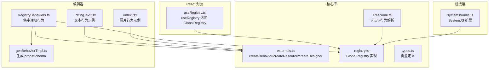
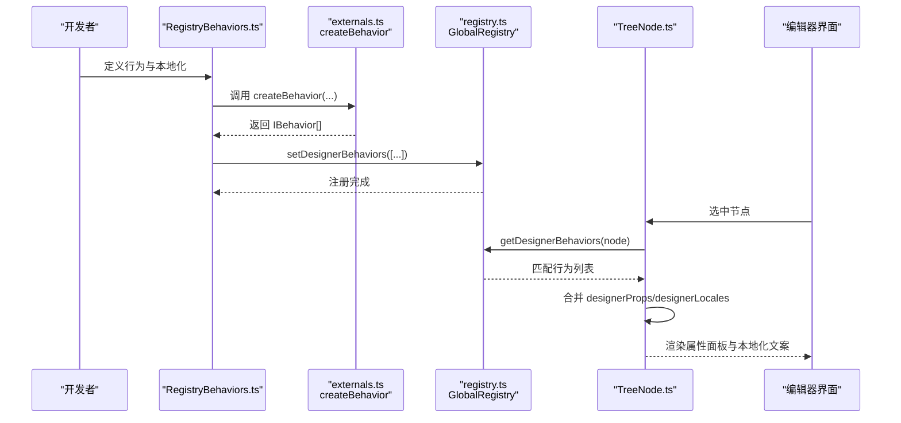
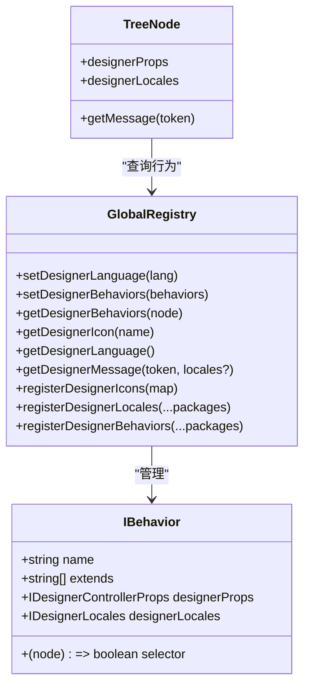
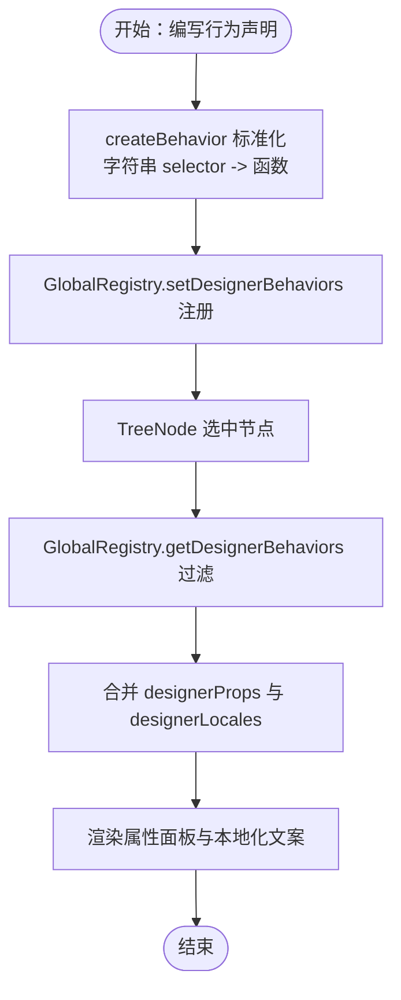
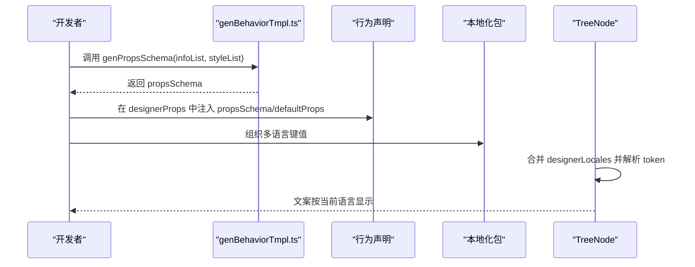
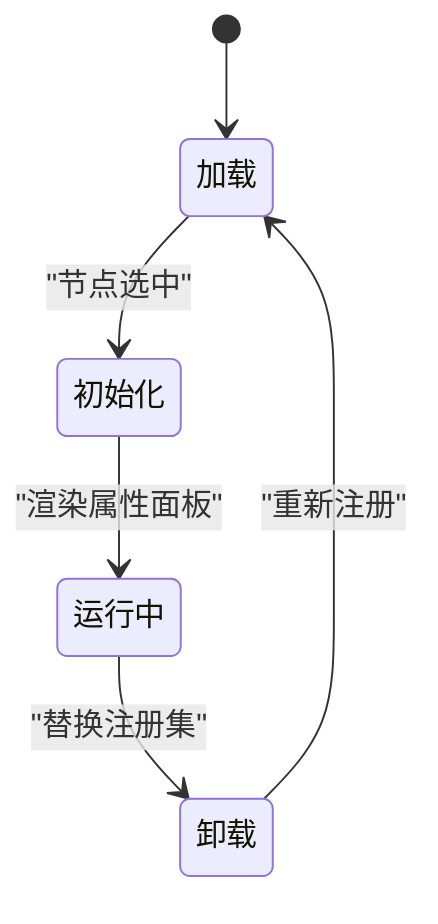
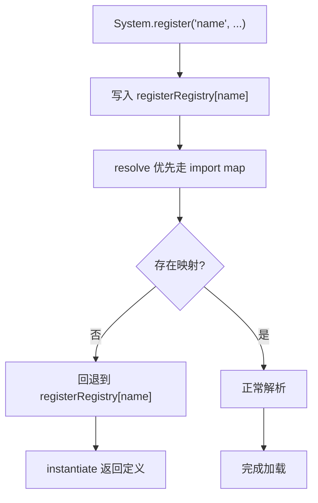
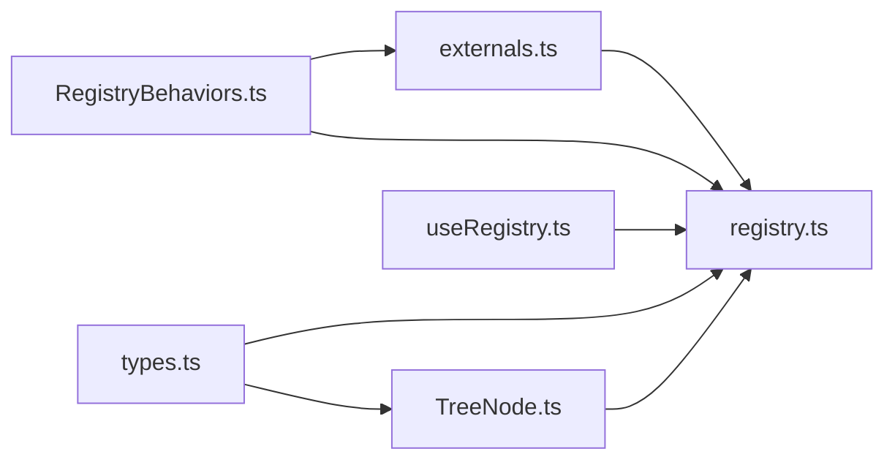

# 插件系统

<cite>
**本文引用的文件**
- [RegistryBehaviors.ts](file://editor/src/RegistryBehaviors.ts)
- [externals.ts](file://packages/core/src/externals.ts)
- [registry.ts](file://packages/core/src/registry.ts)
- [types.ts](file://packages/core/src/types.ts)
- [TreeNode.ts](file://packages/core/src/models/TreeNode.ts)
- [useRegistry.ts](file://packages/react/src/hooks/useRegistry.ts)
- [genBehaviorTmpl.ts](file://editor/src/components/_config/genBehaviorTmpl.ts)
- [EditingText.tsx](file://editor/src/components/Text/EditingText.tsx)
- [index.tsx](file://editor/src/components/Img/index.tsx)
- [system.bundle.js](file://bridge/cocos-game-player/src/system.bundle.js)
</cite>

## 目录
1. [引言](#引言)
2. [项目结构](#项目结构)
3. [核心组件](#核心组件)
4. [架构总览](#架构总览)
5. [详细组件分析](#详细组件分析)
6. [依赖关系分析](#依赖关系分析)
7. [性能考量](#性能考量)
8. [故障排查指南](#故障排查指南)
9. [结论](#结论)
10. [附录](#附录)

## 引言
本文件面向 Slides Engine 的插件系统，围绕“行为注册（Behavior Registration）”与“GlobalRegistry 全局注册中心”的工作机制展开，系统阐述插件的注册流程、生命周期管理、本地化与设计器属性配置，并给出最佳实践与完整示例路径，帮助开发者从简单组件扩展到复杂行为定制。

## 项目结构
Slides Engine 的插件系统主要分布在以下位置：
- 核心库（packages/core）：提供 createBehavior、createResource、GlobalRegistry、TreeNode 等基础设施
- 编辑器（editor）：集中注册各组件行为，生成 propsSchema 与本地化配置
- React 封装（packages/react）：提供 useRegistry 钩子访问全局注册中心
- 桥接层（bridge）：包含 SystemJS 扩展以支持命名模块注册与解析

图表来源
- [RegistryBehaviors.ts:1-69](file://editor/src/RegistryBehaviors.ts#L1-L69)
- [externals.ts:1-143](file://packages/core/src/externals.ts#L1-L143)
- [registry.ts:1-191](file://packages/core/src/registry.ts#L1-L191)
- [types.ts:1-189](file://packages/core/src/types.ts#L1-L189)
- [TreeNode.ts:105-192](file://packages/core/src/models/TreeNode.ts#L105-L192)
- [useRegistry.ts:1-7](file://packages/react/src/hooks/useRegistry.ts#L1-L7)
- [genBehaviorTmpl.ts:1-54](file://editor/src/components/_config/genBehaviorTmpl.ts#L1-L54)
- [EditingText.tsx:1-99](file://editor/src/components/Text/EditingText.tsx#L1-L99)
- [index.tsx:1-110](file://editor/src/components/Img/index.tsx#L1-L110)
- [system.bundle.js:932-1121](file://bridge/cocos-game-player/src/system.bundle.js#L932-L1121)

章节来源
- [RegistryBehaviors.ts:1-69](file://editor/src/RegistryBehaviors.ts#L1-L69)
- [externals.ts:1-143](file://packages/core/src/externals.ts#L1-L143)
- [registry.ts:1-191](file://packages/core/src/registry.ts#L1-L191)
- [types.ts:1-189](file://packages/core/src/types.ts#L1-L189)
- [TreeNode.ts:105-192](file://packages/core/src/models/TreeNode.ts#L105-L192)
- [useRegistry.ts:1-7](file://packages/react/src/hooks/useRegistry.ts#L1-L7)
- [genBehaviorTmpl.ts:1-54](file://editor/src/components/_config/genBehaviorTmpl.ts#L1-L54)
- [EditingText.tsx:1-99](file://editor/src/components/Text/EditingText.tsx#L1-L99)
- [index.tsx:1-110](file://editor/src/components/Img/index.tsx#L1-L110)
- [system.bundle.js:932-1121](file://bridge/cocos-game-player/src/system.bundle.js#L932-L1121)

## 核心组件
- GlobalRegistry：全局注册中心，负责行为、图标、语言与本地化的集中管理，提供查询与注册接口
- createBehavior：将行为声明标准化为可被 GlobalRegistry 管理的 IBehavior 数组
- TreeNode：节点在运行时根据 GlobalRegistry 的行为集合动态计算 designerProps 与 designerLocales
- useRegistry：在 React 层提供便捷访问 GlobalRegistry 的钩子
- genPropsSchema：统一生成 propsSchema，支撑设计器属性面板

章节来源
- [registry.ts:75-191](file://packages/core/src/registry.ts#L75-L191)
- [externals.ts:89-101](file://packages/core/src/externals.ts#L89-L101)
- [TreeNode.ts:171-192](file://packages/core/src/models/TreeNode.ts#L171-L192)
- [useRegistry.ts:4-6](file://packages/react/src/hooks/useRegistry.ts#L4-L6)
- [genBehaviorTmpl.ts:16-45](file://editor/src/components/_config/genBehaviorTmpl.ts#L16-L45)

## 架构总览
下图展示了从行为声明到节点运行时属性解析的全链路：

图表来源
- [RegistryBehaviors.ts:57-69](file://editor/src/RegistryBehaviors.ts#L57-L69)
- [externals.ts:89-101](file://packages/core/src/externals.ts#L89-L101)
- [registry.ts:90-113](file://packages/core/src/registry.ts#L90-L113)
- [TreeNode.ts:171-192](file://packages/core/src/models/TreeNode.ts#L171-L192)

## 详细组件分析

### GlobalRegistry 机制与插件注册流程
- 行为注册：setDesignerBehaviors 接收行为数组或行为宿主，统一扁平化为 IBehavior[]
- 行为检索：getDesignerBehaviors 根据节点调用 selector 过滤匹配行为
- 本地化与语言：registerDesignerLocales 合并多语言包；getDesignerMessage 支持 token 查找与回退
- 图标与语言：registerDesignerIcons、getDesignerIcon、getDesignerLanguage 提供扩展入口

图表来源
- [registry.ts:75-191](file://packages/core/src/registry.ts#L75-L191)
- [types.ts:144-164](file://packages/core/src/types.ts#L144-L164)
- [TreeNode.ts:171-192](file://packages/core/src/models/TreeNode.ts#L171-L192)

章节来源
- [registry.ts:75-191](file://packages/core/src/registry.ts#L75-L191)
- [types.ts:144-164](file://packages/core/src/types.ts#L144-L164)
- [TreeNode.ts:171-192](file://packages/core/src/models/TreeNode.ts#L171-L192)

### 行为注册（Behavior Registration）实现
- createBehavior：将行为声明标准化，自动将字符串 selector 转换为函数
- 设计器属性（designerProps）：支持 propsSchema、defaultProps、拦截器（如 getComponentProps）
- 本地化（designerLocales）：按 ISO 代码组织，支持多语言合并
- 行为宿主（Behavior Host）：通过 Behavior 字段导出行为数组，便于包级发布

图表来源
- [externals.ts:89-101](file://packages/core/src/externals.ts#L89-L101)
- [registry.ts:90-113](file://packages/core/src/registry.ts#L90-L113)
- [TreeNode.ts:171-192](file://packages/core/src/models/TreeNode.ts#L171-L192)

章节来源
- [externals.ts:89-101](file://packages/core/src/externals.ts#L89-L101)
- [registry.ts:90-113](file://packages/core/src/registry.ts#L90-L113)
- [TreeNode.ts:171-192](file://packages/core/src/models/TreeNode.ts#L171-L192)

### 设计器属性配置与本地化
- propsSchema 生成：genPropsSchema 统一封装 info/style 分区，配合 schema-* 文件组织字段
- 默认属性与拦截器：通过 defaultProps 与 getComponentProps 注入运行时上下文
- 本地化合并：支持多语言包合并，token 采用小写下划线风格查找

图表来源
- [genBehaviorTmpl.ts:16-45](file://editor/src/components/_config/genBehaviorTmpl.ts#L16-L45)
- [EditingText.tsx:25-58](file://editor/src/components/Text/EditingText.tsx#L25-L58)
- [index.tsx:23-69](file://editor/src/components/Img/index.tsx#L23-L69)
- [TreeNode.ts:181-192](file://packages/core/src/models/TreeNode.ts#L181-L192)

章节来源
- [genBehaviorTmpl.ts:16-45](file://editor/src/components/_config/genBehaviorTmpl.ts#L16-L45)
- [EditingText.tsx:25-58](file://editor/src/components/Text/EditingText.tsx#L25-L58)
- [index.tsx:23-69](file://editor/src/components/Img/index.tsx#L23-L69)
- [TreeNode.ts:181-192](file://packages/core/src/models/TreeNode.ts#L181-L192)

### 插件生命周期管理
- 加载：在应用启动阶段，集中导入各组件行为并通过 GlobalRegistry.setDesignerBehaviors 注册
- 初始化：节点首次选中时，TreeNode 通过 GlobalRegistry 动态解析 designerProps 与 designerLocales
- 卸载：当前未提供显式卸载 API；可通过重新 setDesignerBehaviors 替换注册集，达到“重载”效果

图表来源
- [RegistryBehaviors.ts:57-69](file://editor/src/RegistryBehaviors.ts#L57-L69)
- [registry.ts:90-113](file://packages/core/src/registry.ts#L90-L113)
- [TreeNode.ts:171-192](file://packages/core/src/models/TreeNode.ts#L171-L192)

章节来源
- [RegistryBehaviors.ts:57-69](file://editor/src/RegistryBehaviors.ts#L57-L69)
- [registry.ts:90-113](file://packages/core/src/registry.ts#L90-L113)
- [TreeNode.ts:171-192](file://packages/core/src/models/TreeNode.ts#L171-L192)

### SystemJS 扩展与命名模块注册
- 扩展点：为 System.register('name', ...) 提供 registerRegistry 存储与 resolve/instantiate 适配
- 作用：允许按名称直接 import，提升插件模块化与按需加载能力

图表来源
- [system.bundle.js:1071-1118](file://bridge/cocos-game-player/src/system.bundle.js#L1071-L1118)

章节来源
- [system.bundle.js:1071-1118](file://bridge/cocos-game-player/src/system.bundle.js#L1071-L1118)

## 依赖关系分析
- 组件行为依赖于核心库的 createBehavior 与 GlobalRegistry
- TreeNode 在运行时依赖 GlobalRegistry 解析行为，形成“声明式行为 + 运行时解析”的解耦
- React 层通过 useRegistry 提供统一访问入口

图表来源
- [externals.ts:1-143](file://packages/core/src/externals.ts#L1-L143)
- [registry.ts:1-191](file://packages/core/src/registry.ts#L1-L191)
- [types.ts:1-189](file://packages/core/src/types.ts#L1-L189)
- [TreeNode.ts:105-192](file://packages/core/src/models/TreeNode.ts#L105-L192)
- [RegistryBehaviors.ts:1-69](file://editor/src/RegistryBehaviors.ts#L1-L69)
- [useRegistry.ts:1-7](file://packages/react/src/hooks/useRegistry.ts#L1-L7)

章节来源
- [externals.ts:1-143](file://packages/core/src/externals.ts#L1-L143)
- [registry.ts:1-191](file://packages/core/src/registry.ts#L1-L191)
- [types.ts:1-189](file://packages/core/src/types.ts#L1-L189)
- [TreeNode.ts:105-192](file://packages/core/src/models/TreeNode.ts#L105-L192)
- [RegistryBehaviors.ts:1-69](file://editor/src/RegistryBehaviors.ts#L1-L69)
- [useRegistry.ts:1-7](file://packages/react/src/hooks/useRegistry.ts#L1-L7)

## 性能考量
- 行为匹配：getDesignerBehaviors 采用过滤策略，建议控制行为数量与 selector 复杂度
- 本地化查找：getDesignerMessage 使用 Path.getIn 与小写下划线 token，避免深层遍历
- 运行时计算：designerProps 与 designerLocales 通过 computed 缓存，减少重复合并开销

## 故障排查指南
- 行为未生效
  - 检查 selector 是否正确匹配节点 componentName
  - 确认已调用 setDesignerBehaviors 注册
- 本地化缺失
  - 确认 registerDesignerLocales 已注册对应语言包
  - 检查 token 是否符合小写下划线规范
- 属性面板异常
  - 检查 propsSchema 结构与 x-component 对应组件是否存在
  - 确认 defaultProps 与 getComponentProps 未抛错

章节来源
- [registry.ts:90-113](file://packages/core/src/registry.ts#L90-L113)
- [TreeNode.ts:181-192](file://packages/core/src/models/TreeNode.ts#L181-L192)

## 结论
Slides Engine 的插件系统以 GlobalRegistry 为核心，结合 createBehavior 的声明式注册与 TreeNode 的运行时解析，实现了高扩展、低耦合的编辑器生态。通过 propsSchema 与本地化体系，开发者可以快速构建从简单组件到复杂行为的完整插件。

## 附录

### 开发最佳实践
- 依赖管理
  - 使用 extends 字段声明行为依赖，确保依赖先行注册
  - 通过 Behavior Host 组织包级行为，利于复用与分发
- 冲突解决
  - 避免重复注册相同 name 的行为；若需覆盖，先清空后重注册
  - selector 建议精确匹配，减少误匹配
- 版本兼容
  - 保持 propsSchema 结构稳定；新增字段建议提供默认值
  - 本地化 token 采用稳定键名，避免频繁变更

章节来源
- [registry.ts:34-62](file://packages/core/src/registry.ts#L34-L62)
- [types.ts:144-164](file://packages/core/src/types.ts#L144-L164)

### 完整开发示例（路径指引）
- 简单组件扩展（文本）
  - 行为定义：[EditingText.tsx:25-58](file://editor/src/components/Text/EditingText.tsx#L25-L58)
  - 注册入口：[RegistryBehaviors.ts:24-55](file://editor/src/RegistryBehaviors.ts#L24-L55)
- 复杂行为定制（图片）
  - 行为定义与 propsSchema：[index.tsx:23-69](file://editor/src/components/Img/index.tsx#L23-L69)
  - 本地化与默认属性：[index.tsx:54-69](file://editor/src/components/Img/index.tsx#L54-L69)
  - propsSchema 生成工具：[genBehaviorTmpl.ts:16-45](file://editor/src/components/_config/genBehaviorTmpl.ts#L16-L45)
- 行为注册与加载
  - 集中注册：[RegistryBehaviors.ts:57-69](file://editor/src/RegistryBehaviors.ts#L57-L69)
  - 标准化创建：[externals.ts:89-101](file://packages/core/src/externals.ts#L89-L101)