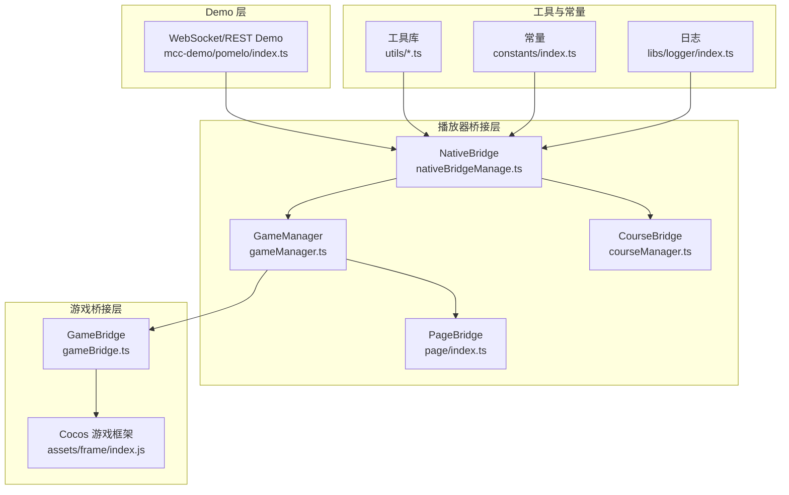
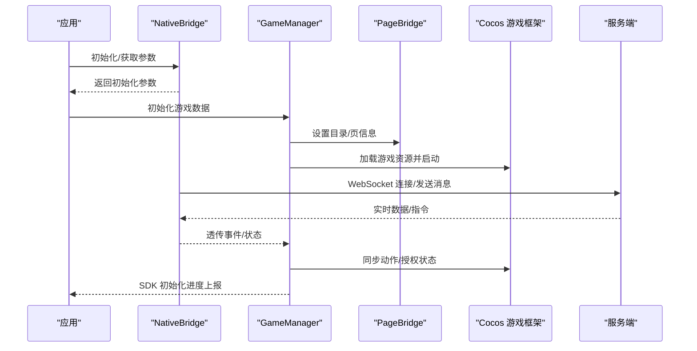
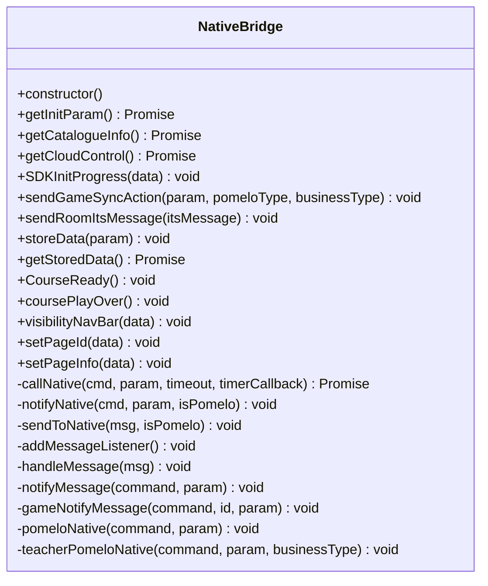
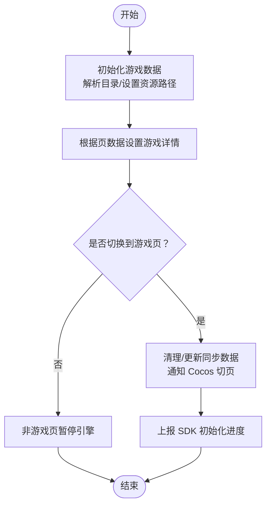
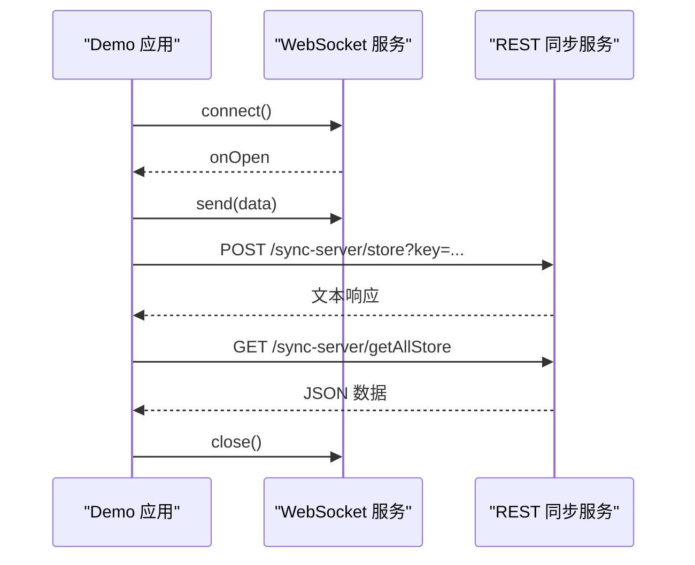
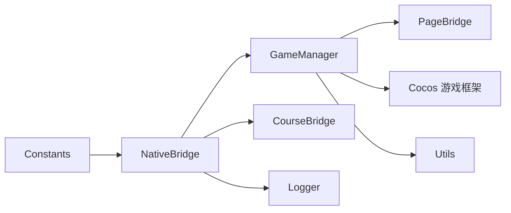

# 第三方集成

<cite>
**本文引用的文件**
- [nativeBridgeManage.ts](file://bridge/mcc-player/src/components/native-bridge/nativeBridgeManage.ts)
- [bridge-type.ts](file://bridge/mcc-player/src/components/native-bridge/bridge-type.ts)
- [index.ts](file://bridge/mcc-player/src/components/native-bridge/index.ts)
- [gameManager.ts](file://bridge/mcc-player/src/components/game-manage/gameManager.ts)
- [gameBridge.ts](file://bridge/mcc-player/src/components/game-manage/gameBridge.ts)
- [courseManager.ts](file://bridge/mcc-player/src/components/course-bridge/courseManager.ts)
- [type.ts](file://bridge/mcc-player/src/components/page/type.ts)
- [const.ts](file://bridge/mcc-player/src/components/page/const.ts)
- [index.ts](file://bridge/mcc-player/src/components/page/index.ts)
- [index.ts](file://bridge/mcc-player/src/utils/index.ts)
- [utils.ts](file://bridge/mcc-player/src/utils/utils.ts)
- [protocol.ts](file://bridge/mcc-player/src/utils/protocol.ts)
- [index.ts](file://bridge/mcc-player/src/constants/index.ts)
- [logger/index.ts](file://bridge/mcc-player/src/libs/logger/index.ts)
- [xesLogger/index.ts](file://bridge/mcc-player/src/libs/xesLogger/index.ts)
- [index.ts](file://bridge/mcc-player/src/interface/index.ts)
- [index.ts](file://bridge/mcc-demo/src/pomelo/index.ts)
- [index.ts](file://bridge/mcc-demo/src/utils/index.ts)
- [index.ts](file://bridge/mcc-demo/src/utils/uuid.ts)
- [index.ts](file://bridge/mcc-demo/src/utils/queryUrlParams.ts)
- [index.ts](file://bridge/mcc-demo/src/utils/isRemoteResourceExist.ts)
- [index.ts](file://bridge/mcc-demo/src/utils/protocol.ts)
- [index.ts](file://bridge/mcc-demo/src/App.tsx)
- [index.ts](file://bridge/mcc-demo/src/main.tsx)
- [index.ts](file://bridge/mcc-demo/src/demo.json)
- [index.ts](file://bridge/mcc-demo/src/json-demo/pageInfo.json)
- [index.ts](file://bridge/mcc-demo/src/vite.config.ts)
- [index.ts](file://bridge/mcc-demo/package.json)
- [index.ts](file://bridge/mcc-demo/README.md)
- [index.ts](file://bridge/cocos-game-player/assets/frame/index.js)
- [index.ts](file://bridge/cocos-game-player/assets/frame/config.json)
- [index.ts](file://bridge/cocos-game-player/assets/frame/import/7d/7d8f9b89-4fd1-4c9f-a3ab-38ec7cded7ca.json)
- [index.ts](file://bridge/cocos-game-player/assets/game-template/config.json)
- [index.ts](file://bridge/cocos-game-player/assets/game-template/import/01/01aa6d197.json)
- [index.ts](file://bridge/cocos-game-player/assets/game-template/import/06/06e558c8-5a66-48fb-9aa7-456485e614c3.json)
- [index.ts](file://bridge/cocos-game-player/assets/game-template/import/11/11aa6d197.json)
- [index.ts](file://bridge/cocos-game-player/assets/game-template/import/45/45828f25-b50d-4c52-a591-e19491a62b8c.json)
- [index.ts](file://bridge/cocos-game-player/assets/game-template/import/4e/4e5a2750-6820-4990-9157-82b90958252f.json)
- [index.ts](file://bridge/cocos-game-player/assets/game-template/import/58/5831f238-d8e2-4048-a70f-6848f4460669.json)
- [index.ts](file://bridge/cocos-game-player/assets/game-template/import/7d/7d8f9b89-4fd1-4c9f-a3ab-38ec7cded7ca.json)
- [index.ts](file://bridge/cocos-game-player/assets/game-template/import/b7/b730527c-3233-41c2-aaf7-7cdab58f9749.json)
- [index.ts](file://bridge/cocos-game-player/assets/game-template/import/db/dbb9f8a8-dcc9-48c7-8796-53067e84df85.json)
- [index.ts](file://bridge/cocos-game-player/assets/game-template/import/f1/f12a23c4-b924-4322-a260-3d982428f1e8.json)
- [index.ts](file://bridge/cocos-game-player/assets/internal/config.json)
- [index.ts](file://bridge/cocos-game-player/assets/internal/import/0c/0ca60d3e4.json)
- [index.ts](file://bridge/cocos-game-player/assets/main/config.json)
- [index.ts](file://bridge/cocos-game-player/assets/main/import/ba/ba21476f-2866-4f81-9c4d-6e359316e448.json)
- [index.ts](file://bridge/cocos-game-player/assets/main/import/fd/fd8ec536-a354-4a17-9c74-4f3883c378c8.json)
- [index.ts](file://bridge/cocos-game-player/index.html)
- [index.ts](file://bridge/cocos-game-player/application.js)
- [index.ts](file://bridge/cocos-game-player/index.js)
- [index.ts](file://bridge/cocos-game-player/style.css)
- [index.ts](file://bridge/cocos-game-player/webgl-debug.js)
- [index.ts](file://bridge/cocos-game-player/cc.js)
- [index.ts](file://bridge/cocos-game-player/spine-3e0daee9.js)
- [index.ts](file://bridge/cocos-game-player/spine.asm-035a937b.js)
- [index.ts](file://bridge/cocos-game-player/spine.js-f7f5ea79.js)
- [index.ts](file://bridge/cocos-game-player/src/settings.json)
- [index.ts](file://bridge/cocos-game-player/src/system.bundle.js)
- [index.ts](file://bridge/cocos-game-player/src/chunks/bundle.js)
- [index.ts](file://bridge/cocos-game-player/assets/editor-models/config.json)
- [index.ts](file://bridge/cocos-game-player/assets/editor-models/index.js)
- [index.ts](file://bridge/cocos-game-player/assets/editor-models/import/7d/7d8f9b89-4fd1-4c9f-a3ab-38ec7cded7ca.json)
- [index.ts](file://bridge/cocos-game-player/assets/editor-models/import/ee/eeb1d8fb-aa62-412d-9814-b3a598619d91.json)
- [index.ts](file://bridge/cocos-game-player/assets/main/config.json)
- [index.ts](file://bridge/cocos-game-player/assets/main/index.js)
- [index.ts](file://bridge/cocos-game-player/assets/main/import/ba/ba21476f-2866-4f81-9c4d-6e359316e448.json)
- [index.ts](file://bridge/cocos-game-player/assets/main/import/fd/fd8ec536-a354-4a17-9c74-4f3883c378c8.json)
- [index.ts](file://bridge/cocos-game-player/assets/frame/index.js)
- [index.ts](file://bridge/cocos-game-player/assets/frame/index.js)
- [index.ts](file://bridge/cocos-game-player/assets/frame/index.js)
- [index.ts](file://bridge/cocos-game-player/assets/frame/index.js)
- [index.ts](file://bridge/cocos-game-player/assets/frame/index.js)
- [index.ts](file://bridge/cocos-game-player/assets/frame/index.js)
- [index.ts](file://bridge/cocos-game-player/assets/frame/index.js)
- [index.ts](file://bridge/cocos-game-player/assets/frame/index.js)
- [index.ts](file://bridge/cocos-game-player/assets/frame/index.js)
- [index.ts](file://bridge/cocos-game-player/assets/frame/index.js)
- [index.ts](file://bridge/cocos-game-player/assets/frame/index.js)
- [index.ts](file://bridge/cocos-game-player/assets/frame/index.js)
- [index.ts](file://bridge/cocos-game-player/assets/frame/index.js)
- [index.ts](file://bridge/cocos-game-player/assets/frame/index.js)
- [index.ts](file://bridge/cocos-game-player/assets/frame/index.js)
- [index.ts](file://bridge/cocos-game-player/assets/frame/index.js)
- [index.ts](file://bridge/cocos-game-player/assets/frame/index.js)
- [index.ts](file://bridge/cocos-game-player/assets/frame/index.js)
- [index.ts](file://bridge/cocos-game-player/assets/frame/index.js)
- [index.ts](file://bridge/cocos-game-player/assets/frame/index.js)
- [index.ts](file://bridge/cocos-game-player/assets/frame/index.js)
- [index.ts](file://bridge/cocos-game-player/assets/frame/index.js)
- [index.ts](file://bridge/cocos-game-player/assets/frame/index.js)
- [index.ts](file://bridge/cocos-game-player/assets/frame/index.js)
- [index.ts](file://bridge/cocos-game-player/assets/frame/index.js)
- [index.ts](file://bridge/cocos-game-player/assets/frame/index.js)
- [index.ts](file://bridge/cocos-game-player/assets/frame/index.js)
- [index.ts](file://bridge/cocos-game-player/assets/frame/index.js)
- [index.ts](file://bridge/cocos-game-player/assets/frame/index.js)
- [index.ts](file://bridge/cocos-game-player/assets/frame/index.js)
- [index.ts](file://bridge/c......)
</cite>

## 目录
1. [简介](#简介)
2. [项目结构](#项目结构)
3. [核心组件](#核心组件)
4. [架构总览](#架构总览)
5. [详细组件分析](#详细组件分析)
6. [依赖关系分析](#依赖关系分析)
7. [性能考量](#性能考量)
8. [故障排查指南](#故障排查指南)
9. [结论](#结论)
10. [附录](#附录)

## 简介
本指南面向 Slides Engine 的第三方集成场景，聚焦于以下目标：
- 外部 API 集成：RESTful 请求、WebSocket 连接与实时数据同步
- SDK 使用最佳实践：初始化流程、配置管理、错误处理
- 数据格式转换与适配：数据映射、格式校验、兼容性处理
- 常见第三方服务集成示例：视频服务、音频服务、游戏平台
- 安全性考虑：认证授权、数据加密、访问控制
- 集成测试与监控：保障集成稳定性

本指南基于仓库中的 MCC Player、Cocos 游戏桥接、MCC Demo 等模块，结合实际代码路径进行说明。

## 项目结构
Slides Engine 的第三方集成主要分布在以下区域：
- 播放器桥接层（MCC Player）：负责与 Native/Web 的消息桥接、课件与游戏数据交互、SDK 初始化与进度上报
- 游戏桥接层（Cocos）：负责游戏生命周期、资源加载、与播放器的事件同步
- Demo 层（MCC Demo）：演示 WebSocket 与 RESTful 同步服务的使用方式
- 工具库与常量：协议解析、URL 参数、日志、超时配置等

**图表来源**
- [nativeBridgeManage.ts:1-395](file://bridge/mcc-player/src/components/native-bridge/nativeBridgeManage.ts#L1-L395)
- [gameManager.ts:1-368](file://bridge/mcc-player/src/components/game-manage/gameManager.ts#L1-L368)
- [courseManager.ts:1-117](file://bridge/mcc-player/src/components/course-bridge/courseManager.ts#L1-L117)
- [index.ts:1-200](file://bridge/mcc-player/src/components/page/index.ts#L1-L200)
- [index.ts:1-143](file://bridge/mcc-player/src/utils/utils.ts#L1-L143)
- [index.ts:1-5](file://bridge/mcc-player/src/constants/index.ts#L1-L5)
- [logger/index.ts:1-191](file://bridge/mcc-player/src/libs/logger/index.ts#L1-L191)
- [index.ts:56-163](file://bridge/mcc-demo/src/pomelo/index.ts#L56-L163)

**章节来源**
- [nativeBridgeManage.ts:1-395](file://bridge/mcc-player/src/components/native-bridge/nativeBridgeManage.ts#L1-L395)
- [gameManager.ts:1-368](file://bridge/mcc-player/src/components/game-manage/gameManager.ts#L1-L368)
- [courseManager.ts:1-117](file://bridge/mcc-player/src/components/course-bridge/courseManager.ts#L1-L117)
- [index.ts:1-200](file://bridge/mcc-player/src/components/page/index.ts#L1-L200)
- [index.ts:1-143](file://bridge/mcc-player/src/utils/utils.ts#L1-L143)
- [index.ts:1-5](file://bridge/mcc-player/src/constants/index.ts#L1-L5)
- [logger/index.ts:1-191](file://bridge/mcc-player/src/libs/logger/index.ts#L1-L191)
- [index.ts:56-163](file://bridge/mcc-demo/src/pomelo/index.ts#L56-L163)

## 核心组件
- 原生桥接（NativeBridge）
  - 统一消息通道：支持 Web 与 Native 的双向通信，封装 call/notify 两类消息模式
  - 事件分发：通过事件总线分发来自端侧或服务端的消息
  - Pomelo 透传：支持与服务端的 WebSocket 通信
- 游戏管理（GameManager）
  - 游戏数据初始化与切页逻辑
  - 资源路径解析与公共/子包地址拼装
  - 与 Cocos 游戏框架的事件同步与进度上报
- 课件桥接（CourseBridge）
  - 与课件微应用的数据交互，支持翻页、恢复状态、尺寸调整等
- Demo（MCC Demo）
  - WebSocket 连接与 RESTful 同步接口示例，演示消息发送、存储与拉取

**章节来源**
- [nativeBridgeManage.ts:26-395](file://bridge/mcc-player/src/components/native-bridge/nativeBridgeManage.ts#L26-L395)
- [gameManager.ts:65-368](file://bridge/mcc-player/src/components/game-manage/gameManager.ts#L65-L368)
- [courseManager.ts:13-117](file://bridge/mcc-player/src/components/course-bridge/courseManager.ts#L13-L117)
- [index.ts:56-163](file://bridge/mcc-demo/src/pomelo/index.ts#L56-L163)

## 架构总览
整体架构围绕“桥接层 + 微应用 + 游戏框架 + 服务端”的模式展开。桥接层负责统一接入与消息编排，微应用承载课件内容，游戏框架承载互动游戏，服务端提供 WebSocket 与 RESTful 同步能力。

**图表来源**
- [nativeBridgeManage.ts:211-395](file://bridge/mcc-player/src/components/native-bridge/nativeBridgeManage.ts#L211-L395)
- [gameManager.ts:99-260](file://bridge/mcc-player/src/components/game-manage/gameManager.ts#L99-L260)
- [index.ts:73-163](file://bridge/mcc-demo/src/pomelo/index.ts#L73-L163)

## 详细组件分析

### 原生桥接（NativeBridge）分析
- 消息模型
  - call/notify：区分需要回执与无需回执的消息
  - pomelo 透传：用于与服务端的 WebSocket 通信
- 事件机制
  - 通过事件总线分发命令，支持游戏专用事件
- 平台适配
  - 支持 Web 与 Native 的消息通道，自动选择合适通道
- 典型方法
  - getInitParam、getCatalogueInfo、getCloudControl、SDKInitProgress、sendGameSyncAction、sendRoomItsMessage 等

**图表来源**
- [nativeBridgeManage.ts:26-395](file://bridge/mcc-player/src/components/native-bridge/nativeBridgeManage.ts#L26-L395)

**章节来源**
- [nativeBridgeManage.ts:26-395](file://bridge/mcc-player/src/components/native-bridge/nativeBridgeManage.ts#L26-L395)

### 游戏管理（GameManager）分析
- 初始化流程
  - 解析课件目录，构建游戏页映射表
  - 设置本地/CDN 资源根路径
- 资源解析
  - 公共模块与子游戏包 URL 拼装
- 切页与同步
  - 切页时清理/更新同步数据
  - 与 Cocos 框架通信，触发暂停/恢复
- 进度上报
  - 在游戏帧就绪后上报 SDK 初始化进度

**图表来源**
- [gameManager.ts:99-260](file://bridge/mcc-player/src/components/game-manage/gameManager.ts#L99-L260)

**章节来源**
- [gameManager.ts:65-368](file://bridge/mcc-player/src/components/game-manage/gameManager.ts#L65-L368)

### 课件桥接（CourseBridge）分析
- 与课件微应用的数据交互
  - 翻页 setPageId、恢复状态 recoverCWState、设置可用 SetPageUseAble、尺寸调整 ResizeCW、UID 设置 setUid
- 异步回调封装
  - 基于消息 ID 的 Promise 化调用

**章节来源**
- [courseManager.ts:13-117](file://bridge/mcc-player/src/components/course-bridge/courseManager.ts#L13-L117)

### Demo（MCC Demo）分析
- WebSocket 连接
  - 初始化服务地址，建立 ws 连接，监听 open/close 事件
- RESTful 同步
  - storeData/post 与 getAllStore/get 接口，支持键值存储与批量读取
- 事件与日志
  - 统一日志输出，便于调试与监控

**图表来源**
- [index.ts:56-163](file://bridge/mcc-demo/src/pomelo/index.ts#L56-L163)

**章节来源**
- [index.ts:56-163](file://bridge/mcc-demo/src/pomelo/index.ts#L56-L163)

### 数据格式转换与适配
- URL 协议解析
  - 支持 http/https/ws/wss 等协议识别与本地主机判定
- URL 参数解析
  - 提供便捷的查询参数获取与对象化转换
- 数据清洗与深拷贝
  - 清理空字段、深拷贝对象，避免副作用
- 资源路径占位符替换
  - 模板化路径替换，支持版本与标识符注入

**章节来源**
- [protocol.ts:1-66](file://bridge/mcc-player/src/utils/protocol.ts#L1-L66)
- [utils.ts:7-143](file://bridge/mcc-player/src/utils/utils.ts#L7-L143)

### SDK 初始化与配置管理
- 初始化步骤
  - 获取初始化参数、目录数据、云控配置、设置 URL、上报进度
- 配置项
  - HTTP 请求超时时间常量
- 进度上报
  - 通过 SDKInitProgress 将加载进度反馈给端侧

**章节来源**
- [nativeBridgeManage.ts:77-121](file://bridge/mcc-player/src/components/native-bridge/nativeBridgeManage.ts#L77-L121)
- [index.ts:3-5](file://bridge/mcc-player/src/constants/index.ts#L3-L5)

### 错误处理与日志
- 日志体系
  - 支持 info/warn/error/detail 等级别，可配置上报策略与批量频率
- 错误捕获
  - 调用超时、通道不可用等场景的降级处理

**章节来源**
- [logger/index.ts:106-191](file://bridge/mcc-player/src/libs/logger/index.ts#L106-L191)

## 依赖关系分析
- 组件耦合
  - GameManager 依赖 PageBridge、NativeBridge；NativeBridge 依赖事件与消息工具
- 外部依赖
  - 微应用框架（microApp）、HTTP 工具（Axios）、日志工具（阿里云/自定义）
- 潜在风险
  - 消息通道依赖 window.webkit/jsHandler 等原生接口，需做好降级与容错

**图表来源**
- [nativeBridgeManage.ts:26-395](file://bridge/mcc-player/src/components/native-bridge/nativeBridgeManage.ts#L26-L395)
- [gameManager.ts:65-368](file://bridge/mcc-player/src/components/game-manage/gameManager.ts#L65-L368)
- [courseManager.ts:13-117](file://bridge/mcc-player/src/components/course-bridge/courseManager.ts#L13-L117)
- [index.ts:1-191](file://bridge/mcc-player/src/libs/logger/index.ts#L1-L191)
- [index.ts:1-143](file://bridge/mcc-player/src/utils/utils.ts#L1-L143)
- [index.ts:1-5](file://bridge/mcc-player/src/constants/index.ts#L1-L5)

**章节来源**
- [nativeBridgeManage.ts:26-395](file://bridge/mcc-player/src/components/native-bridge/nativeBridgeManage.ts#L26-L395)
- [gameManager.ts:65-368](file://bridge/mcc-player/src/components/game-manage/gameManager.ts#L65-L368)
- [courseManager.ts:13-117](file://bridge/mcc-player/src/components/course-bridge/courseManager.ts#L13-L117)
- [index.ts:1-191](file://bridge/mcc-player/src/libs/logger/index.ts#L1-L191)
- [index.ts:1-143](file://bridge/mcc-player/src/utils/utils.ts#L1-L143)
- [index.ts:1-5](file://bridge/mcc-player/src/constants/index.ts#L1-L5)

## 性能考量
- 资源加载
  - 优先使用 CDN，本地回退策略；按页预加载下一关资源
- 事件与消息
  - 合理拆分 call/notify，避免阻塞；对高频事件做节流
- 日志与上报
  - 控制日志级别与批量频率，减少网络开销
- WebSocket
  - 连接池与心跳策略（如需），避免频繁断连

## 故障排查指南
- WebSocket 无法连接
  - 检查服务地址与房间号参数，确认协议（ws/wss）与端口
  - 查看 onOpen/onClose 回调日志
- RESTful 接口异常
  - 校验请求头 content-type 与参数键名，确认服务端路由
- 消息未达端侧
  - 确认通道选择（window.webkit/jsHandler/parent.postMessage），检查消息体格式
- 初始化卡顿
  - 分段上报 SDK 进度，定位耗时环节（资源加载/数据解析）

**章节来源**
- [index.ts:56-163](file://bridge/mcc-demo/src/pomelo/index.ts#L56-L163)
- [nativeBridgeManage.ts:182-205](file://bridge/mcc-player/src/components/native-bridge/nativeBridgeManage.ts#L182-L205)
- [logger/index.ts:106-191](file://bridge/mcc-player/src/libs/logger/index.ts#L106-L191)

## 结论
通过桥接层抽象、微应用与游戏框架解耦、以及 Demo 示例的参考，Slides Engine 的第三方集成具备良好的扩展性与可维护性。建议在实际集成中遵循本文的初始化流程、配置管理、数据适配与安全策略，以确保稳定与高效。

## 附录
- 常见第三方服务集成要点
  - 视频服务：采用 HLS/DASH 流式播放，结合资源路径占位符与 CDN
  - 音频服务：注意跨域与缓存策略，提供本地回退
  - 游戏平台：统一 SDK 初始化与授权流程，规范事件命名与数据结构
- 安全建议
  - 传输加密：优先使用 wss/https
  - 认证授权：端侧与服务端统一鉴权令牌，避免明文传输
  - 访问控制：限制 WebSocket 房间与 REST 接口权限
- 集成测试与监控
  - 单元测试覆盖关键工具函数（URL 解析、数据清洗）
  - E2E 场景覆盖：初始化、切页、游戏同步、断线重连
  - 监控指标：初始化耗时、WebSocket 连接成功率、REST 接口延迟与错误率