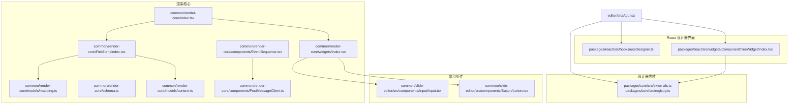
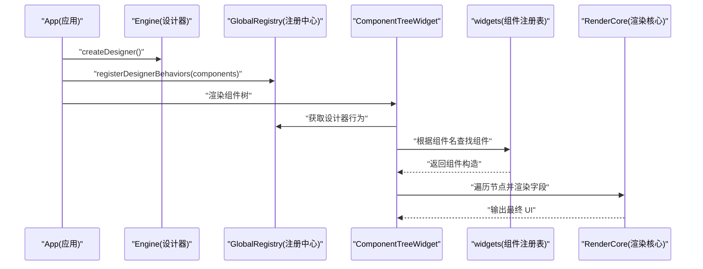
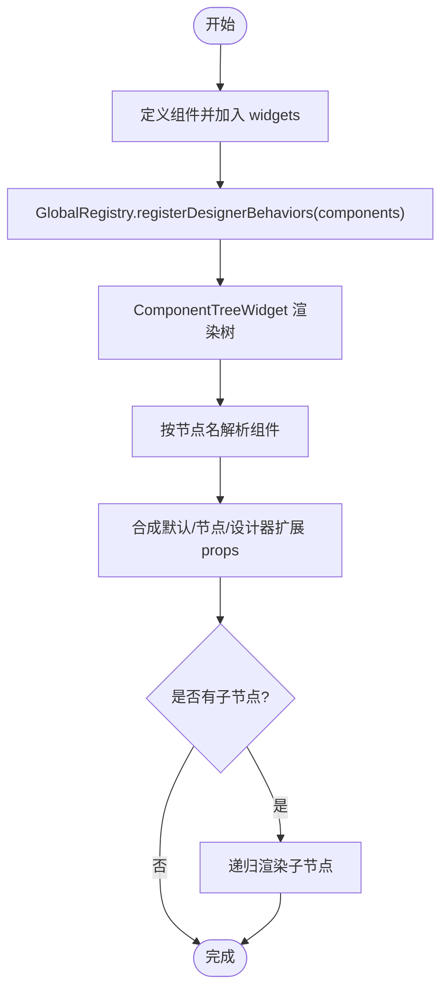
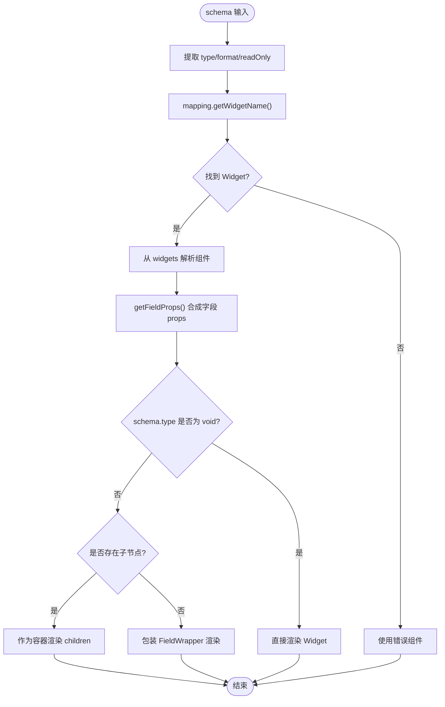
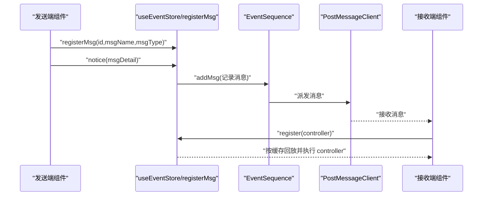
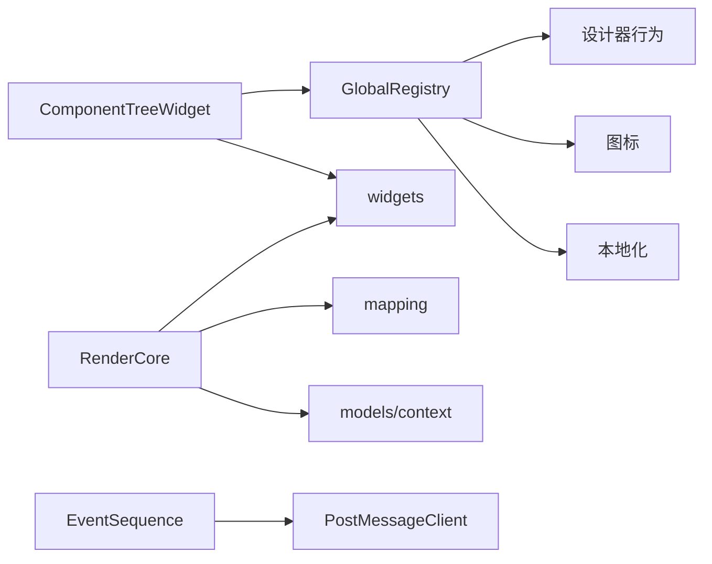

# 组件扩展

<cite>
**本文引用的文件**
- [packages/core/src/externals.ts](file://packages/core/src/externals.ts)
- [packages/core/src/registry.ts](file://packages/core/src/registry.ts)
- [packages/react/src/hooks/useDesigner.ts](file://packages/react/src/hooks/useDesigner.ts)
- [packages/react/src/widgets/ComponentTreeWidget/index.tsx](file://packages/react/src/widgets/ComponentTreeWidget/index.tsx)
- [common/render-core/index.tsx](file://common/render-core/index.tsx)
- [common/render-core/widgets/index.tsx](file://common/render-core/widgets/index.tsx)
- [common/render-core/FieldItem/index.tsx](file://common/render-core/FieldItem/index.tsx)
- [common/render-core/FieldItem/module.tsx](file://common/render-core/FieldItem/module.tsx)
- [common/render-core/models/context.ts](file://common/render-core/models/context.ts)
- [common/render-core/models/mapping.ts](file://common/render-core/models/mapping.ts)
- [common/render-core/schema.ts](file://common/render-core/schema.ts)
- [common/render-core/components/EventSequence.tsx](file://common/render-core/components/EventSequence.tsx)
- [common/render-core/components/PostMessageClient.ts](file://common/render-core/components/PostMessageClient.ts)
- [common/slide-editor/src/components/Input/input.tsx](file://common/slide-editor/src/components/Input/input.tsx)
- [common/slide-editor/src/components/Button/button.tsx](file://common/slide-editor/src/components/Button/button.tsx)
- [editor/src/App.tsx](file://editor/src/App.tsx)
</cite>

## 目录
1. [引言](#引言)
2. [项目结构](#项目结构)
3. [核心组件](#核心组件)
4. [架构总览](#架构总览)
5. [详细组件分析](#详细组件分析)
6. [依赖关系分析](#依赖关系分析)
7. [性能考虑](#性能考虑)
8. [故障排查指南](#故障排查指南)
9. [结论](#结论)
10. [附录](#附录)

## 引言
本指南面向希望为 Slides Engine 扩展“组件类型”的开发者，系统讲解如何定义新组件、配置属性面板、实现交互逻辑；如何注册组件元数据、行为与资源；如何在组件间进行数据传递与事件通信；并提供从零到一的完整示例路径、测试与调试方法以及性能优化建议。文档所有技术细节均基于仓库现有实现进行归纳与提炼。

## 项目结构
Slides Engine 采用多包工作区组织，核心围绕“设计器内核 + React 设计器界面 + 渲染核心 + 常用组件库”协同工作：
- packages/core：设计器内核与注册中心，负责行为、图标、本地化、资源等全局注册与检索。
- packages/react：设计器 UI 组件与 Hooks，提供拖拽树、工具栏、属性面板等。
- common/render-core：通用渲染核心，负责 schema 到 UI 的映射、字段渲染、事件与资源上报、消息序列化。
- common/slide-editor：富文本、输入框等编辑态/视图态组件。
- editor：应用入口，组装设计器引擎与 UI 面板，加载行为与设置面板。

图表来源
- [packages/core/src/externals.ts:129-142](file://packages/core/src/externals.ts#L129-L142)
- [packages/core/src/registry.ts:177-185](file://packages/core/src/registry.ts#L177-L185)
- [packages/react/src/hooks/useDesigner.ts:14-24](file://packages/react/src/hooks/useDesigner.ts#L14-L24)
- [packages/react/src/widgets/ComponentTreeWidget/index.tsx:90-113](file://packages/react/src/widgets/ComponentTreeWidget/index.tsx#L90-L113)
- [common/render-core/index.tsx:52-67](file://common/render-core/index.tsx#L52-L67)
- [common/render-core/widgets/index.tsx:8-130](file://common/render-core/widgets/index.tsx#L8-L130)
- [common/render-core/FieldItem/index.tsx:7-61](file://common/render-core/FieldItem/index.tsx#L7-L61)
- [common/render-core/models/mapping.ts:42-91](file://common/render-core/models/mapping.ts#L42-L91)
- [common/render-core/schema.ts:134-145](file://common/render-core/schema.ts#L134-L145)
- [common/render-core/models/context.ts:157-225](file://common/render-core/models/context.ts#L157-L225)
- [common/render-core/components/EventSequence.tsx:31-69](file://common/render-core/components/EventSequence.tsx#L31-L69)
- [common/render-core/components/PostMessageClient.ts:4-25](file://common/render-core/components/PostMessageClient.ts#L4-L25)
- [common/slide-editor/src/components/Input/input.tsx:12-18](file://common/slide-editor/src/components/Input/input.tsx#L12-L18)
- [common/slide-editor/src/components/Button/button.tsx:37-86](file://common/slide-editor/src/components/Button/button.tsx#L37-L86)
- [editor/src/App.tsx:52-53](file://editor/src/App.tsx#L52-L53)

章节来源
- [editor/src/App.tsx:52-53](file://editor/src/App.tsx#L52-L53)
- [packages/core/src/externals.ts:129-142](file://packages/core/src/externals.ts#L129-L142)
- [packages/react/src/widgets/ComponentTreeWidget/index.tsx:90-113](file://packages/react/src/widgets/ComponentTreeWidget/index.tsx#L90-L113)

## 核心组件
- 设计器引擎与注册中心
  - 通过创建器生成引擎，合并默认驱动、快捷键与效果；注册行为、图标、本地化与资源。
- React 设计器界面
  - 提供组件树渲染、节点属性合成、拖拽容器、工具栏与属性面板等。
- 渲染核心
  - 将节点树 schema 映射为 UI 字段，按类型与格式选择 Widget，支持容器/字段渲染、全局属性透传、事件与资源上报。
- 组件库
  - 内置富文本、图片、视频、形状等组件，并通过 widgets 注册表统一挂载。

章节来源
- [packages/core/src/externals.ts:89-142](file://packages/core/src/externals.ts#L89-L142)
- [packages/core/src/registry.ts:177-185](file://packages/core/src/registry.ts#L177-L185)
- [packages/react/src/widgets/ComponentTreeWidget/index.tsx:35-88](file://packages/react/src/widgets/ComponentTreeWidget/index.tsx#L35-L88)
- [common/render-core/index.tsx:28-67](file://common/render-core/index.tsx#L28-L67)
- [common/render-core/widgets/index.tsx:8-130](file://common/render-core/widgets/index.tsx#L8-L130)

## 架构总览
下图展示了从“应用入口”到“组件树渲染”再到“属性面板渲染”的关键流程。

图表来源
- [editor/src/App.tsx:52-53](file://editor/src/App.tsx#L52-L53)
- [packages/core/src/registry.ts:177-185](file://packages/core/src/registry.ts#L177-L185)
- [packages/react/src/widgets/ComponentTreeWidget/index.tsx:90-113](file://packages/react/src/widgets/ComponentTreeWidget/index.tsx#L90-L113)
- [common/render-core/widgets/index.tsx:8-130](file://common/render-core/widgets/index.tsx#L8-L130)
- [common/render-core/index.tsx:28-67](file://common/render-core/index.tsx#L28-L67)

## 详细组件分析

### 组件定义与注册
- 定义组件
  - 在渲染核心的 widgets 注册表中新增组件映射，键名为组件名，值为 React 组件。
  - 组件可直接导出，也可通过高阶封装（如错误边界）增强稳定性。
- 注册组件元数据
  - 在组件树渲染前，通过注册中心将组件集合注册为设计器行为，以便树渲染时按节点名解析组件。
- 渲染逻辑
  - 组件树根据节点名从注册表取组件，合成 props（含默认 props、节点 props、设计器扩展 props），并递归渲染子节点。

图表来源
- [common/render-core/widgets/index.tsx:8-130](file://common/render-core/widgets/index.tsx#L8-L130)
- [packages/react/src/widgets/ComponentTreeWidget/index.tsx:90-113](file://packages/react/src/widgets/ComponentTreeWidget/index.tsx#L90-L113)
- [packages/react/src/widgets/ComponentTreeWidget/index.tsx:35-88](file://packages/react/src/widgets/ComponentTreeWidget/index.tsx#L35-L88)

章节来源
- [common/render-core/widgets/index.tsx:8-130](file://common/render-core/widgets/index.tsx#L8-L130)
- [packages/react/src/widgets/ComponentTreeWidget/index.tsx:90-113](file://packages/react/src/widgets/ComponentTreeWidget/index.tsx#L90-L113)
- [packages/react/src/widgets/ComponentTreeWidget/index.tsx:35-88](file://packages/react/src/widgets/ComponentTreeWidget/index.tsx#L35-L88)

### 属性配置与 Schema 映射
- Schema 结构
  - 每个节点包含 ui:widget（组件名）、props（组件属性）、properties（子节点 schema）等字段。
  - 提供 nodeSchema 到 schema 的转换工具，便于从节点树生成可渲染的 schema。
- 字段渲染
  - FieldItem 根据 schema 的类型与格式选择 Widget，支持容器/字段两种渲染模式。
  - 通过 mapping 将 schema 的 type/format 映射到具体 Widget 名称，再从 widgets 中解析组件。
- 方法与全局属性透传
  - 支持 schema.methods 动态绑定方法名，运行时从全局 methods 解析为实际函数。
  - 支持以 props 结尾的键直接透传到组件，同时可合并全局 props。

图表来源
- [common/render-core/schema.ts:134-145](file://common/render-core/schema.ts#L134-L145)
- [common/render-core/FieldItem/index.tsx:7-61](file://common/render-core/FieldItem/index.tsx#L7-L61)
- [common/render-core/models/mapping.ts:42-91](file://common/render-core/models/mapping.ts#L42-L91)
- [common/render-core/FieldItem/module.tsx:52-109](file://common/render-core/FieldItem/module.tsx#L52-L109)

章节来源
- [common/render-core/schema.ts:134-145](file://common/render-core/schema.ts#L134-L145)
- [common/render-core/FieldItem/index.tsx:7-61](file://common/render-core/FieldItem/index.tsx#L7-L61)
- [common/render-core/models/mapping.ts:42-91](file://common/render-core/models/mapping.ts#L42-L91)
- [common/render-core/FieldItem/module.tsx:52-109](file://common/render-core/FieldItem/module.tsx#L52-L109)

### 交互逻辑与事件通信
- 事件序列与消息通道
  - 使用 EventSequence 与 PostMessageClient 实现“发送端/接收端”模式的消息序列化与派发。
  - 组件可通过 useEventStore.registerMsg 注册消息控制器，通过 notice 触发消息并缓存，接收端按缓存回放。
- 资源上报与受控组件
  - useReport 提供资源上报接口；useInstanceStore 提供受控组件实例注册与查询，配合 useConnect 仅订阅指定组件实例变化。
- 页面级资源存储
  - genPageResource 提供页面级资源存储，避免跨页面干扰。

图表来源
- [common/render-core/models/context.ts:157-225](file://common/render-core/models/context.ts#L157-L225)
- [common/render-core/components/EventSequence.tsx:31-69](file://common/render-core/components/EventSequence.tsx#L31-L69)
- [common/render-core/components/PostMessageClient.ts:4-25](file://common/render-core/components/PostMessageClient.ts#L4-L25)

章节来源
- [common/render-core/models/context.ts:157-225](file://common/render-core/models/context.ts#L157-L225)
- [common/render-core/components/EventSequence.tsx:31-69](file://common/render-core/components/EventSequence.tsx#L31-L69)
- [common/render-core/components/PostMessageClient.ts:4-25](file://common/render-core/components/PostMessageClient.ts#L4-L25)

### 自定义组件开发示例（结构设计、样式定制、响应式布局）
- 结构设计
  - 在 widgets 中新增组件映射，确保组件名与节点 schema 的 ui:widget 对应。
  - 若需编辑态/视图态切换，参考富文本组件的模式判断方式。
- 样式定制
  - 组件 props 中的 style 由节点 props 与默认 props 合成，可在设计器中直接调整 transform、宽高等。
- 响应式布局
  - 通过节点 props 的 style.transform 实现位移与缩放；容器组件可嵌套子节点形成层级布局。
- 示例路径
  - 新增组件映射：[common/render-core/widgets/index.tsx:8-130](file://common/render-core/widgets/index.tsx#L8-L130)
  - 富文本模式切换：[common/slide-editor/src/components/Input/input.tsx:12-18](file://common/slide-editor/src/components/Input/input.tsx#L12-L18)
  - 按钮组件（可复用样式与交互）：[common/slide-editor/src/components/Button/button.tsx:37-86](file://common/slide-editor/src/components/Button/button.tsx#L37-L86)

章节来源
- [common/render-core/widgets/index.tsx:8-130](file://common/render-core/widgets/index.tsx#L8-L130)
- [common/slide-editor/src/components/Input/input.tsx:12-18](file://common/slide-editor/src/components/Input/input.tsx#L12-L18)
- [common/slide-editor/src/components/Button/button.tsx:37-86](file://common/slide-editor/src/components/Button/button.tsx#L37-L86)

### 测试与调试方法
- 单元测试
  - 可参考现有组件测试文件命名规范（如 input.test.tsx、button.test.tsx），在各自包内建立测试文件，使用 React Testing Library 或 Jest 进行断言。
- 集成测试
  - 在编辑器应用层，通过 App 组装引擎与组件树，验证组件注册、属性面板联动与事件通信链路是否正常。
- 调试建议
  - 使用浏览器控制台观察消息队列与缓存（copyLog），确认消息是否正确派发与回放。
  - 在组件中打印 props 合成过程，检查默认 props、节点 props 与设计器扩展 props 的覆盖顺序。

章节来源
- [common/render-core/models/context.ts:184-186](file://common/render-core/models/context.ts#L184-L186)

## 依赖关系分析
- 组件耦合
  - 组件树渲染依赖注册中心的行为与组件映射；字段渲染依赖 mapping 与 widgets；事件通信依赖全局 store 与消息序列。
- 外部依赖
  - 设计器内核依赖响应式库与路径工具；渲染核心依赖 hox 全局状态与 React 上下文。
- 循环依赖
  - 通过模块拆分与注册中心集中管理，避免组件树与渲染核心之间的循环导入。

图表来源
- [packages/core/src/registry.ts:177-185](file://packages/core/src/registry.ts#L177-L185)
- [packages/react/src/widgets/ComponentTreeWidget/index.tsx:90-113](file://packages/react/src/widgets/ComponentTreeWidget/index.tsx#L90-L113)
- [common/render-core/index.tsx:28-67](file://common/render-core/index.tsx#L28-L67)
- [common/render-core/models/mapping.ts:42-91](file://common/render-core/models/mapping.ts#L42-L91)
- [common/render-core/models/context.ts:157-225](file://common/render-core/models/context.ts#L157-L225)
- [common/render-core/components/EventSequence.tsx:31-69](file://common/render-core/components/EventSequence.tsx#L31-L69)
- [common/render-core/components/PostMessageClient.ts:4-25](file://common/render-core/components/PostMessageClient.ts#L4-L25)

章节来源
- [packages/core/src/registry.ts:177-185](file://packages/core/src/registry.ts#L177-L185)
- [packages/react/src/widgets/ComponentTreeWidget/index.tsx:90-113](file://packages/react/src/widgets/ComponentTreeWidget/index.tsx#L90-L113)
- [common/render-core/index.tsx:28-67](file://common/render-core/index.tsx#L28-L67)
- [common/render-core/models/mapping.ts:42-91](file://common/render-core/models/mapping.ts#L42-L91)
- [common/render-core/models/context.ts:157-225](file://common/render-core/models/context.ts#L157-L225)
- [common/render-core/components/EventSequence.tsx:31-69](file://common/render-core/components/EventSequence.tsx#L31-L69)
- [common/render-core/components/PostMessageClient.ts:4-25](file://common/render-core/components/PostMessageClient.ts#L4-L25)

## 性能考虑
- 渲染优化
  - 使用 useConnect 仅订阅目标组件实例，避免无关组件重渲染。
  - 将复杂计算放入 memoized 回调，减少 props 变更带来的重渲染。
- 事件与消息
  - 合理使用消息缓存与回放，避免重复派发；必要时延迟派发以降低抖动。
- 资源上报
  - 使用页面级资源存储，减少跨页面干扰；对重复资源进行去重上报。

## 故障排查指南
- 组件未显示
  - 检查组件名是否与 schema.ui:widget 一致；确认已通过注册中心注册组件集合。
- 属性面板不生效
  - 检查 schema.properties 与 mapping 是否匹配；确认字段 props 合成逻辑未被意外覆盖。
- 事件未触发
  - 使用 copyLog 查看消息队列；确认发送端 notice 与接收端 register 是否在同一页面、同一消息类型与名称下匹配。
- 资源上报异常
  - 检查资源上报接口调用时机与 payload 结构；确认页面级资源存储是否正确初始化。

章节来源
- [common/render-core/widgets/index.tsx:8-130](file://common/render-core/widgets/index.tsx#L8-L130)
- [common/render-core/models/context.ts:184-186](file://common/render-core/models/context.ts#L184-L186)

## 结论
通过“组件注册表 + 设计器行为 + 字段渲染 + 事件与资源体系”的协作，Slides Engine 为扩展新组件提供了清晰的路径：先定义组件并注册，再通过 schema 与 mapping 将其映射到属性面板，最后利用事件序列与资源上报实现组件间的数据与状态传递。遵循本文的结构设计、样式定制与性能优化建议，可快速构建高质量的自定义组件。

## 附录
- 关键实现位置索引
  - 引擎创建与注册：[packages/core/src/externals.ts:129-142](file://packages/core/src/externals.ts#L129-L142)，[packages/core/src/registry.ts:177-185](file://packages/core/src/registry.ts#L177-L185)
  - 组件树渲染与注册：[packages/react/src/widgets/ComponentTreeWidget/index.tsx:90-113](file://packages/react/src/widgets/ComponentTreeWidget/index.tsx#L90-L113)
  - 渲染核心与字段映射：[common/render-core/index.tsx:28-67](file://common/render-core/index.tsx#L28-L67)，[common/render-core/models/mapping.ts:42-91](file://common/render-core/models/mapping.ts#L42-L91)
  - 事件与消息：[common/render-core/models/context.ts:157-225](file://common/render-core/models/context.ts#L157-L225)，[common/render-core/components/EventSequence.tsx:31-69](file://common/render-core/components/EventSequence.tsx#L31-L69)
  - 应用入口组装：[editor/src/App.tsx:52-53](file://editor/src/App.tsx#L52-L53)