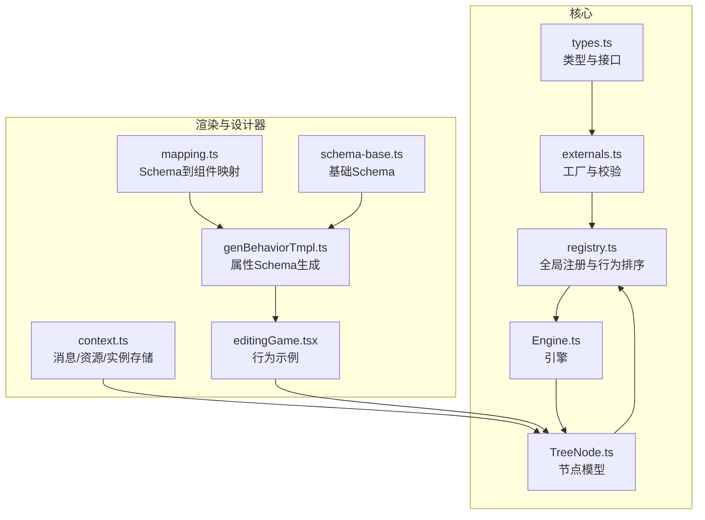
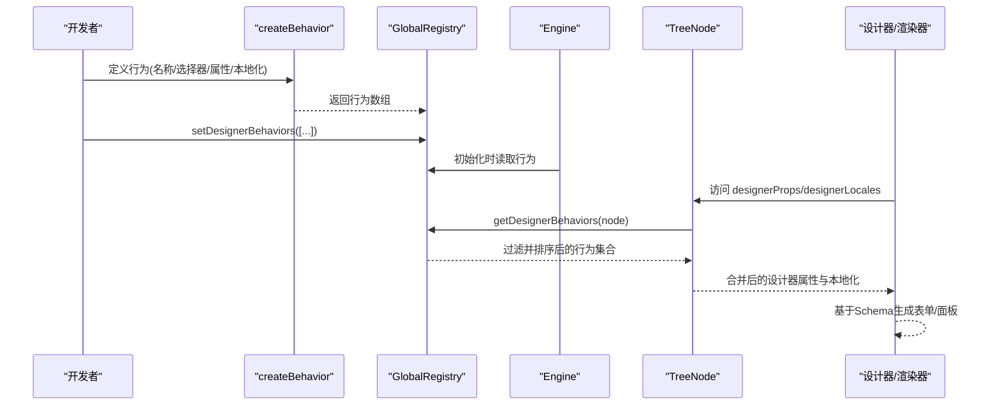
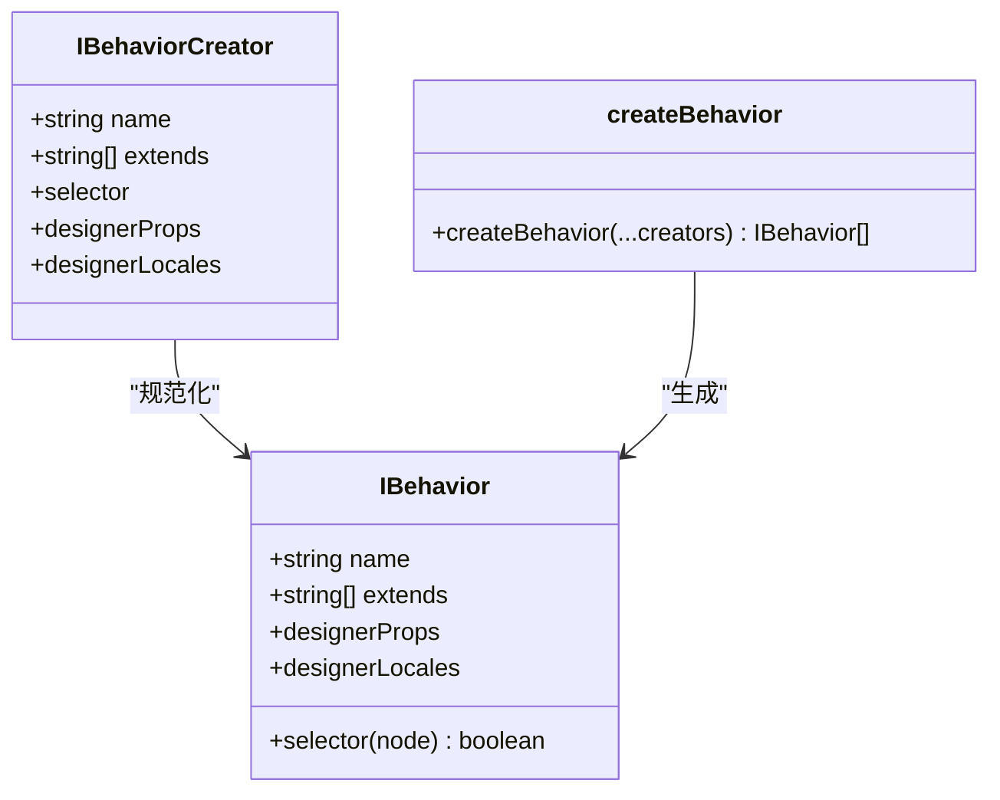
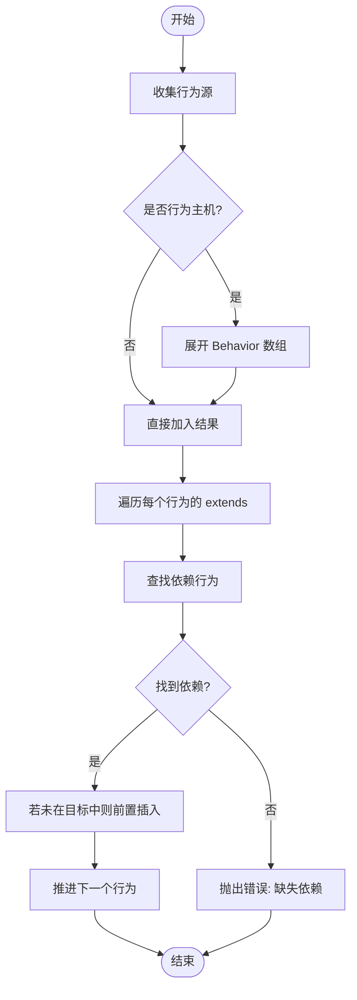
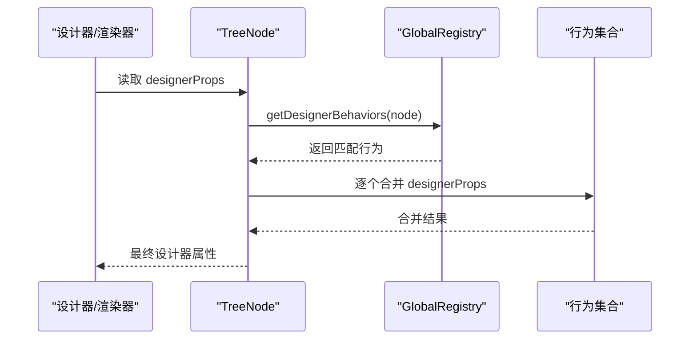
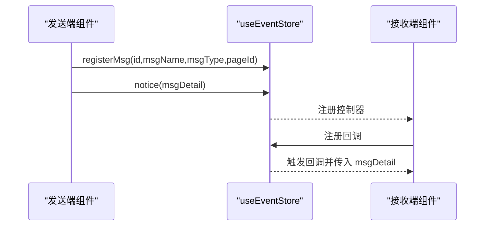
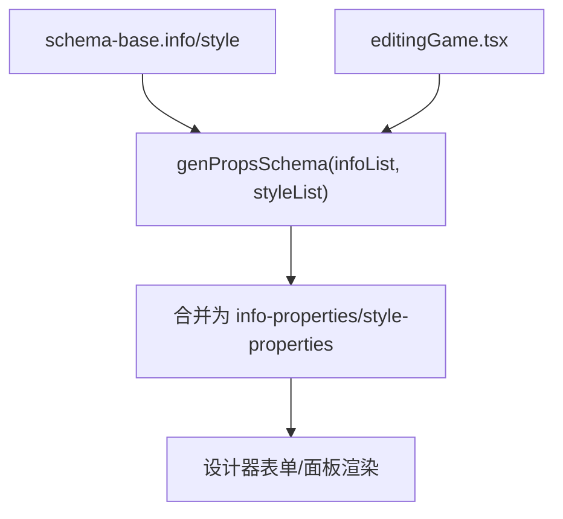
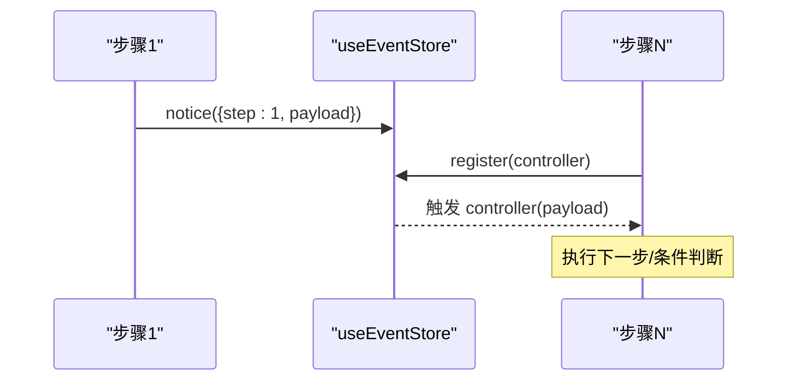
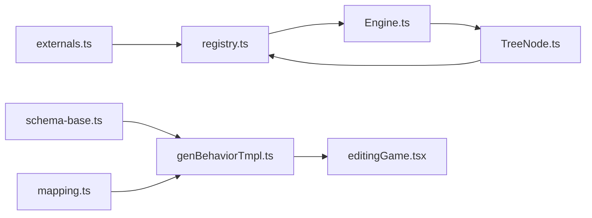

# 行为扩展

<cite>
**本文引用的文件**   
- [packages/core/src/types.ts](file://packages/core/src/types.ts)
- [packages/core/src/externals.ts](file://packages/core/src/externals.ts)
- [packages/core/src/registry.ts](file://packages/core/src/registry.ts)
- [packages/core/src/models/Engine.ts](file://packages/core/src/models/Engine.ts)
- [packages/core/src/models/TreeNode.ts](file://packages/core/src/models/TreeNode.ts)
- [common/render-core/models/context.ts](file://common/render-core/models/context.ts)
- [common/render-core/models/mapping.ts](file://common/render-core/models/mapping.ts)
- [editor/src/components/_config/genBehaviorTmpl.ts](file://editor/src/components/_config/genBehaviorTmpl.ts)
- [editor/src/components/_config/schema-base.ts](file://editor/src/components/_config/schema-base.ts)
- [editor/src/components/Game/editingGame.tsx](file://editor/src/components/Game/editingGame.tsx)
</cite>

## 目录
1. [简介](#简介)
2. [项目结构](#项目结构)
3. [核心组件](#核心组件)
4. [架构总览](#架构总览)
5. [详细组件分析](#详细组件分析)
6. [依赖分析](#依赖分析)
7. [性能考虑](#性能考虑)
8. [故障排查指南](#故障排查指南)
9. [结论](#结论)
10. [附录](#附录)

## 简介
本指南面向“Slides Engine”行为扩展开发，系统讲解行为系统的定义、事件处理与状态管理机制，提供从行为模板生成、设计器属性配置到交互逻辑实现的完整流程，并结合复杂行为开发示例（多步骤、条件判断、异步处理）给出调试与性能优化建议。读者无需深入底层即可快速上手，同时也能理解行为系统在引擎中的角色与扩展边界。

## 项目结构
围绕行为扩展的关键目录与文件如下：
- 核心类型与工厂：packages/core/src/types.ts、packages/core/src/externals.ts
- 全局注册表与行为排序：packages/core/src/registry.ts
- 引擎与节点模型：packages/core/src/models/Engine.ts、packages/core/src/models/TreeNode.ts
- 渲染上下文与消息/资源上报：common/render-core/models/context.ts
- 设计器属性与Schema生成：editor/src/components/_config/genBehaviorTmpl.ts、editor/src/components/_config/schema-base.ts
- 行为示例：editor/src/components/Game/editingGame.tsx

**图表来源**
- [packages/core/src/types.ts:144-189](file://packages/core/src/types.ts#L144-L189)
- [packages/core/src/externals.ts:89-101](file://packages/core/src/externals.ts#L89-L101)
- [packages/core/src/registry.ts:75-123](file://packages/core/src/registry.ts#L75-L123)
- [packages/core/src/models/Engine.ts:13-111](file://packages/core/src/models/Engine.ts#L13-L111)
- [packages/core/src/models/TreeNode.ts:105-192](file://packages/core/src/models/TreeNode.ts#L105-L192)
- [common/render-core/models/context.ts:137-151](file://common/render-core/models/context.ts#L137-L151)
- [common/render-core/models/mapping.ts:42-92](file://common/render-core/models/mapping.ts#L42-L92)
- [editor/src/components/_config/genBehaviorTmpl.ts:16-45](file://editor/src/components/_config/genBehaviorTmpl.ts#L16-L45)
- [editor/src/components/_config/schema-base.ts:7-65](file://editor/src/components/_config/schema-base.ts#L7-L65)
- [editor/src/components/Game/editingGame.tsx:13-39](file://editor/src/components/Game/editingGame.tsx#L13-L39)

**章节来源**
- [packages/core/src/types.ts:144-189](file://packages/core/src/types.ts#L144-L189)
- [packages/core/src/externals.ts:89-101](file://packages/core/src/externals.ts#L89-L101)
- [packages/core/src/registry.ts:75-123](file://packages/core/src/registry.ts#L75-L123)
- [packages/core/src/models/Engine.ts:13-111](file://packages/core/src/models/Engine.ts#L13-L111)
- [packages/core/src/models/TreeNode.ts:105-192](file://packages/core/src/models/TreeNode.ts#L105-L192)
- [common/render-core/models/context.ts:137-151](file://common/render-core/models/context.ts#L137-L151)
- [common/render-core/models/mapping.ts:42-92](file://common/render-core/models/mapping.ts#L42-L92)
- [editor/src/components/_config/genBehaviorTmpl.ts:16-45](file://editor/src/components/_config/genBehaviorTmpl.ts#L16-L45)
- [editor/src/components/_config/schema-base.ts:7-65](file://editor/src/components/_config/schema-base.ts#L7-L65)
- [editor/src/components/Game/editingGame.tsx:13-39](file://editor/src/components/Game/editingGame.tsx#L13-L39)

## 核心组件
- 行为定义与工厂
  - IBehavior/IBehaviorCreator：行为的名称、选择器、继承关系、设计器属性与本地化描述等。
  - createBehavior：将行为创建器规范化为行为数组，支持字符串组件名自动转为选择器。
- 全局注册表
  - setDesignerBehaviors/getDesignerBehaviors：统一注册与按节点筛选行为。
  - reSortBehaviors：根据 extends 关系对行为进行依赖排序，保证父行为先于子行为生效。
- 节点模型与行为应用
  - TreeNode.designerProps：聚合当前节点匹配的所有行为的设计器属性，形成最终的组件属性。
  - TreeNode.designerLocales：合并行为的本地化描述，供设计器UI展示。
- 渲染上下文与消息/资源上报
  - useConnect/useReport/useResourceStore：跨组件通信、资源上报与实例注册，支撑复杂行为的运行时交互。
- 属性Schema与设计器配置
  - genPropsSchema：将若干Schema片段合并为“属性/样式”两段式面板。
  - schema-base：基础样式与信息字段的Schema与本地化键值。

**章节来源**
- [packages/core/src/types.ts:144-189](file://packages/core/src/types.ts#L144-L189)
- [packages/core/src/externals.ts:89-101](file://packages/core/src/externals.ts#L89-L101)
- [packages/core/src/registry.ts:34-72](file://packages/core/src/registry.ts#L34-L72)
- [packages/core/src/registry.ts:90-113](file://packages/core/src/registry.ts#L90-L113)
- [packages/core/src/models/TreeNode.ts:171-192](file://packages/core/src/models/TreeNode.ts#L171-L192)
- [common/render-core/models/context.ts:137-151](file://common/render-core/models/context.ts#L137-L151)
- [editor/src/components/_config/genBehaviorTmpl.ts:16-45](file://editor/src/components/_config/genBehaviorTmpl.ts#L16-L45)
- [editor/src/components/_config/schema-base.ts:7-65](file://editor/src/components/_config/schema-base.ts#L7-L65)

## 架构总览
行为系统贯穿“定义—注册—选择—应用—运行”的全链路。下图展示了从行为创建到节点渲染的关键交互：

**图表来源**
- [packages/core/src/externals.ts:89-101](file://packages/core/src/externals.ts#L89-L101)
- [packages/core/src/registry.ts:90-113](file://packages/core/src/registry.ts#L90-L113)
- [packages/core/src/models/Engine.ts:13-42](file://packages/core/src/models/Engine.ts#L13-L42)
- [packages/core/src/models/TreeNode.ts:171-192](file://packages/core/src/models/TreeNode.ts#L171-L192)

## 详细组件分析

### 行为定义与工厂
- IBehavior/IBehaviorCreator
  - name：行为标识
  - selector：字符串或函数，用于匹配节点
  - extends：行为继承链
  - designerProps：静态或动态的设计器属性（含Schema、默认值、拦截器等）
  - designerLocales：本地化文案
- createBehavior
  - 将字符串选择器标准化为函数
  - 返回行为数组，便于后续注册与排序

**图表来源**
- [packages/core/src/types.ts:144-158](file://packages/core/src/types.ts#L144-L158)
- [packages/core/src/externals.ts:89-101](file://packages/core/src/externals.ts#L89-L101)

**章节来源**
- [packages/core/src/types.ts:144-158](file://packages/core/src/types.ts#L144-L158)
- [packages/core/src/externals.ts:89-101](file://packages/core/src/externals.ts#L89-L101)

### 全局注册表与行为排序
- setDesignerBehaviors：扁平化行为主机与行为数组，存入全局存储
- getDesignerBehaviors：按节点调用 selector 过滤行为
- reSortBehaviors：依据 extends 依赖关系重排，确保父行为优先

**图表来源**
- [packages/core/src/registry.ts:34-72](file://packages/core/src/registry.ts#L34-L72)

**章节来源**
- [packages/core/src/registry.ts:90-113](file://packages/core/src/registry.ts#L90-L113)
- [packages/core/src/registry.ts:34-72](file://packages/core/src/registry.ts#L34-L72)

### 节点模型与行为应用
- TreeNode.designerProps：聚合所有匹配行为的设计器属性，动态解析函数式属性
- TreeNode.designerLocales：合并本地化描述
- 节点权限与约束：允许拖拽/克隆/删除/缩放/平移等，均由 designerProps 决定

**图表来源**
- [packages/core/src/models/TreeNode.ts:171-179](file://packages/core/src/models/TreeNode.ts#L171-L179)
- [packages/core/src/registry.ts:109-113](file://packages/core/src/registry.ts#L109-L113)

**章节来源**
- [packages/core/src/models/TreeNode.ts:171-192](file://packages/core/src/models/TreeNode.ts#L171-L192)
- [packages/core/src/registry.ts:109-113](file://packages/core/src/registry.ts#L109-L113)

### 渲染上下文与消息/资源上报
- useConnect(ids)：基于实例映射，按需订阅组件实例变化
- useReport/useResourceStore：资源上报与全局消息队列，支持 sender/receiver 模式
- 适用于复杂行为的跨组件通信与状态同步

**图表来源**
- [common/render-core/models/context.ts:158-225](file://common/render-core/models/context.ts#L158-L225)

**章节来源**
- [common/render-core/models/context.ts:137-151](file://common/render-core/models/context.ts#L137-L151)
- [common/render-core/models/context.ts:158-225](file://common/render-core/models/context.ts#L158-L225)

### 属性Schema与设计器配置
- genPropsSchema：将 info/style 片段合并为“属性/样式”两段式Schema
- schema-base：提供基础样式与信息字段的Schema与本地化键值
- editingGame 示例：演示如何基于模板生成Schema并绑定设计器属性

**图表来源**
- [editor/src/components/_config/genBehaviorTmpl.ts:16-45](file://editor/src/components/_config/genBehaviorTmpl.ts#L16-L45)
- [editor/src/components/_config/schema-base.ts:7-65](file://editor/src/components/_config/schema-base.ts#L7-L65)
- [editor/src/components/Game/editingGame.tsx:8-28](file://editor/src/components/Game/editingGame.tsx#L8-L28)

**章节来源**
- [editor/src/components/_config/genBehaviorTmpl.ts:16-45](file://editor/src/components/_config/genBehaviorTmpl.ts#L16-L45)
- [editor/src/components/_config/schema-base.ts:7-65](file://editor/src/components/_config/schema-base.ts#L7-L65)
- [editor/src/components/Game/editingGame.tsx:8-39](file://editor/src/components/Game/editingGame.tsx#L8-L39)

### 复杂行为开发示例
以下示例聚焦“多步骤操作、条件判断、异步处理”，并结合现有工具链实现：
- 多步骤操作
  - 使用 useReport 与 registerMsg 实现步骤间消息传递与回放
  - 在行为中定义步骤序列，每步通过 notice 上报状态，接收端注册控制器执行
- 条件判断
  - 在 selector 中根据节点属性决定是否匹配
  - 在 designerProps 中通过 allowAppend/allowDrop/allowSiblings 控制拖拽/放置规则
- 异步处理
  - 利用 useConnect 订阅外部实例（如游戏桥接），在异步回调中更新节点属性
  - 结合资源上报（useReport）记录异步阶段的状态与耗时

**图表来源**
- [common/render-core/models/context.ts:158-225](file://common/render-core/models/context.ts#L158-L225)
- [packages/core/src/models/TreeNode.ts:403-419](file://packages/core/src/models/TreeNode.ts#L403-L419)

**章节来源**
- [common/render-core/models/context.ts:158-225](file://common/render-core/models/context.ts#L158-L225)
- [packages/core/src/models/TreeNode.ts:403-419](file://packages/core/src/models/TreeNode.ts#L403-L419)

## 依赖分析
- 组件耦合
  - TreeNode 依赖 GlobalRegistry 获取行为并计算 designerProps
  - Engine 负责初始化工作台、屏幕、光标、键盘等子系统
  - createBehavior 依赖 isBehavior/isBehaviorList/isBehaviorHost 校验输入
- 外部依赖
  - 设计器属性 Schema 依赖 mapping 将 JSON Schema 映射到具体组件
  - 行为示例依赖 genPropsSchema 与 schema-base 快速生成设计器表单

**图表来源**
- [packages/core/src/externals.ts:17-46](file://packages/core/src/externals.ts#L17-L46)
- [packages/core/src/registry.ts:75-123](file://packages/core/src/registry.ts#L75-L123)
- [packages/core/src/models/Engine.ts:13-42](file://packages/core/src/models/Engine.ts#L13-L42)
- [packages/core/src/models/TreeNode.ts:105-192](file://packages/core/src/models/TreeNode.ts#L105-L192)
- [editor/src/components/_config/genBehaviorTmpl.ts:16-45](file://editor/src/components/_config/genBehaviorTmpl.ts#L16-L45)
- [editor/src/components/_config/schema-base.ts:7-65](file://editor/src/components/_config/schema-base.ts#L7-L65)
- [common/render-core/models/mapping.ts:42-92](file://common/render-core/models/mapping.ts#L42-L92)

**章节来源**
- [packages/core/src/externals.ts:17-46](file://packages/core/src/externals.ts#L17-L46)
- [packages/core/src/registry.ts:75-123](file://packages/core/src/registry.ts#L75-L123)
- [packages/core/src/models/Engine.ts:13-42](file://packages/core/src/models/Engine.ts#L13-L42)
- [packages/core/src/models/TreeNode.ts:105-192](file://packages/core/src/models/TreeNode.ts#L105-L192)
- [editor/src/components/_config/genBehaviorTmpl.ts:16-45](file://editor/src/components/_config/genBehaviorTmpl.ts#L16-L45)
- [editor/src/components/_config/schema-base.ts:7-65](file://editor/src/components/_config/schema-base.ts#L7-L65)
- [common/render-core/models/mapping.ts:42-92](file://common/render-core/models/mapping.ts#L42-L92)

## 性能考虑
- 行为排序与合并
  - reSortBehaviors 严格按 extends 顺序，避免重复与循环依赖
  - 合并 designerProps 时尽量减少深层对象拼接，必要时拆分作用域
- 节点属性访问
  - designerProps/desingerLocales 为计算属性，应避免在渲染路径中频繁重算
  - selector 应保持轻量，避免复杂查询导致过滤开销增大
- 渲染上下文
  - useConnect/useReport 仅订阅所需 id 列表，避免全量订阅造成不必要的重渲染
- Schema 映射
  - mapping 采用预设映射表，避免在渲染路径中动态推导复杂格式

[本节为通用指导，不直接分析具体文件]

## 故障排查指南
- 依赖缺失
  - 现象：行为排序时报错“缺少依赖”
  - 处理：确认 extends 中的父行为已注册，且名称一致
- 选择器不生效
  - 现象：selector 未命中节点
  - 处理：检查 selector 是否为函数或字符串组件名，确保节点 componentName 与之匹配
- 设计器属性未显示
  - 现象：Schema 不显示或属性不生效
  - 处理：核对 genPropsSchema 合并顺序与字段命名，确认 mapping 能正确映射到组件
- 运行时通信异常
  - 现象：消息未到达或实例未注册
  - 处理：确认 registerMsg 与 notice 的参数一致，useConnect 订阅的 id 正确

**章节来源**
- [packages/core/src/registry.ts:34-72](file://packages/core/src/registry.ts#L34-L72)
- [packages/core/src/externals.ts:89-101](file://packages/core/src/externals.ts#L89-L101)
- [common/render-core/models/context.ts:158-225](file://common/render-core/models/context.ts#L158-L225)

## 结论
行为系统通过“定义—注册—选择—应用—运行”的闭环，将节点语义与设计器行为解耦。借助 createBehavior、GlobalRegistry 与 TreeNode 的设计，开发者可以快速扩展行为并将其无缝集成到渲染与交互流程中。配合 genPropsSchema 与 mapping，可高效构建复杂的设计器表单与交互体验。对于复杂行为，建议以消息/资源上报与实例连接为核心，结合条件判断与异步处理，实现稳定可维护的扩展方案。

[本节为总结性内容，不直接分析具体文件]

## 附录
- 快速实践清单
  - 使用 createBehavior 定义行为，设置 selector 与 designerProps
  - 通过 setDesignerBehaviors 注册行为
  - 在节点上读取 designerProps 与 designerLocales
  - 使用 genPropsSchema 生成 Schema，结合 mapping 渲染表单
  - 复杂交互使用 useConnect/useReport 实现跨组件通信

[本节为补充性内容，不直接分析具体文件]