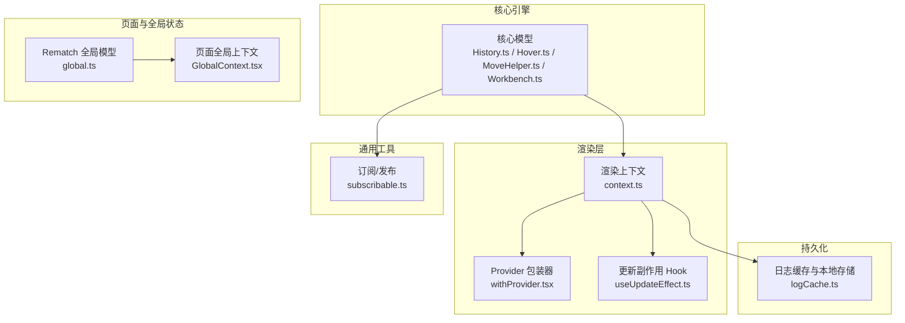
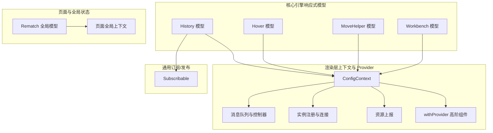
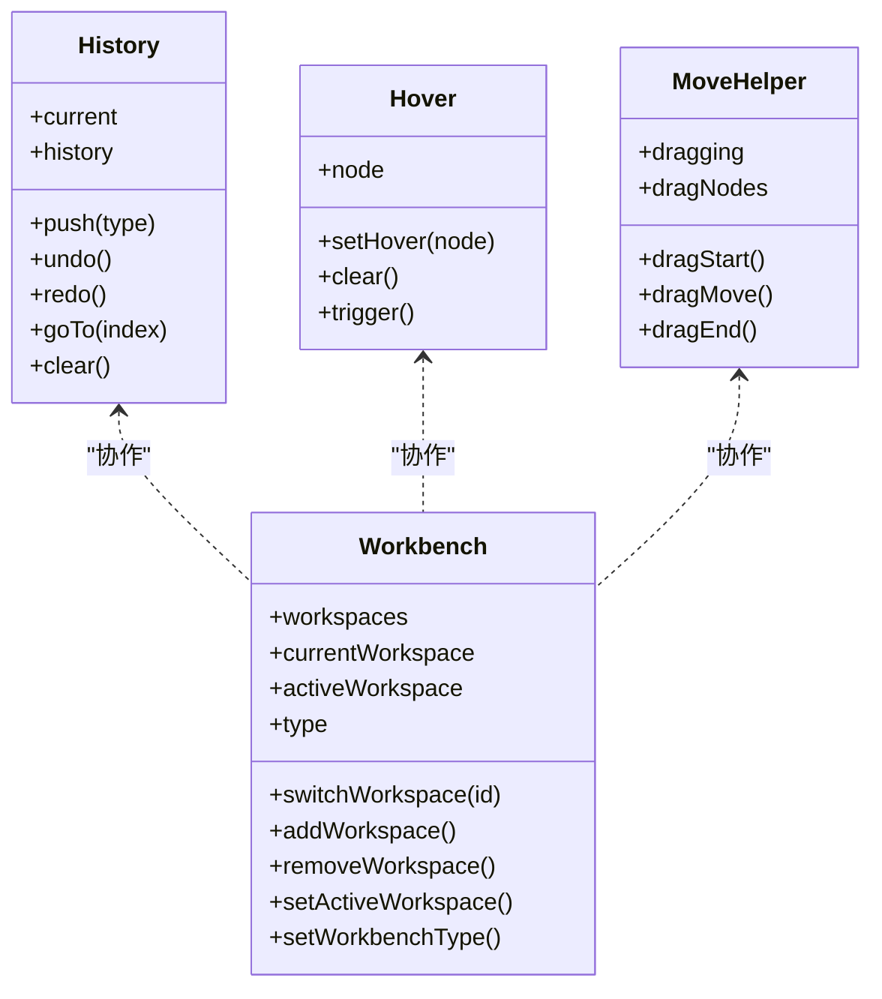
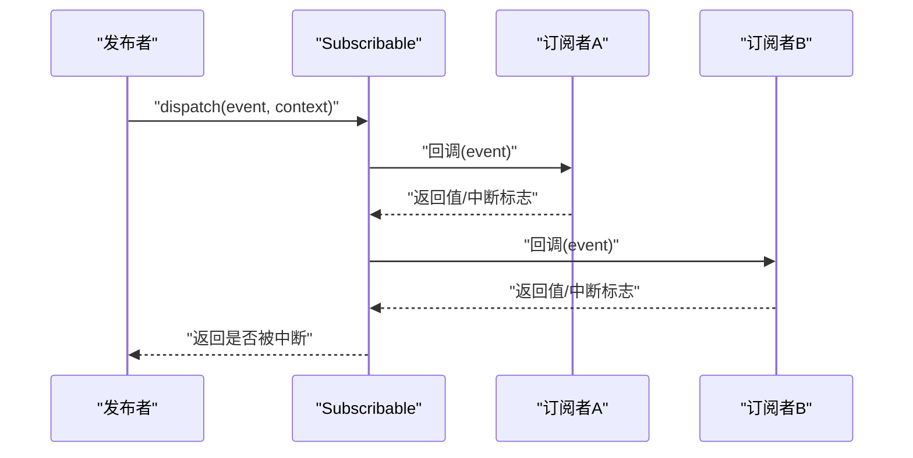
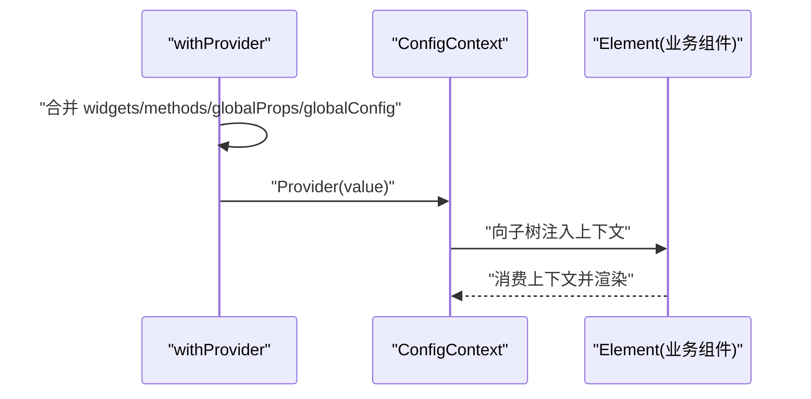
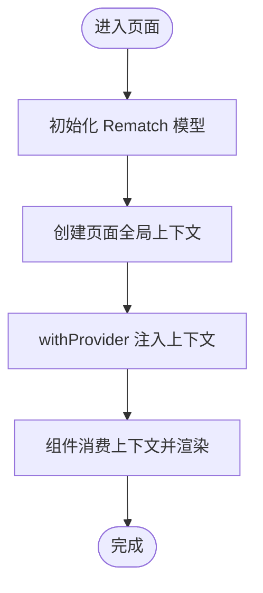
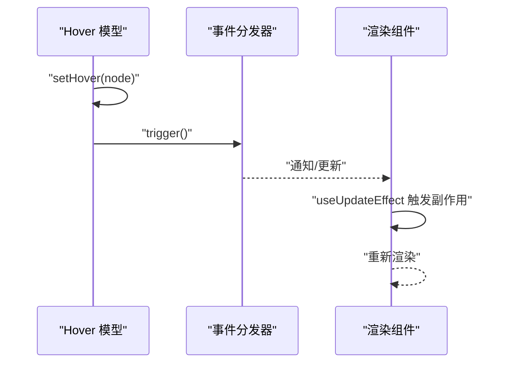
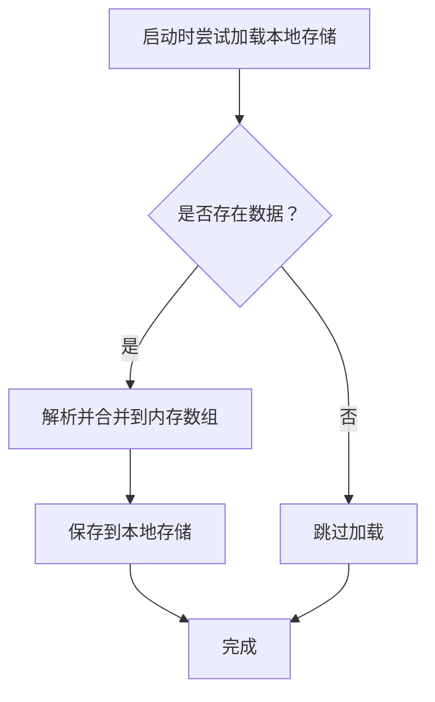
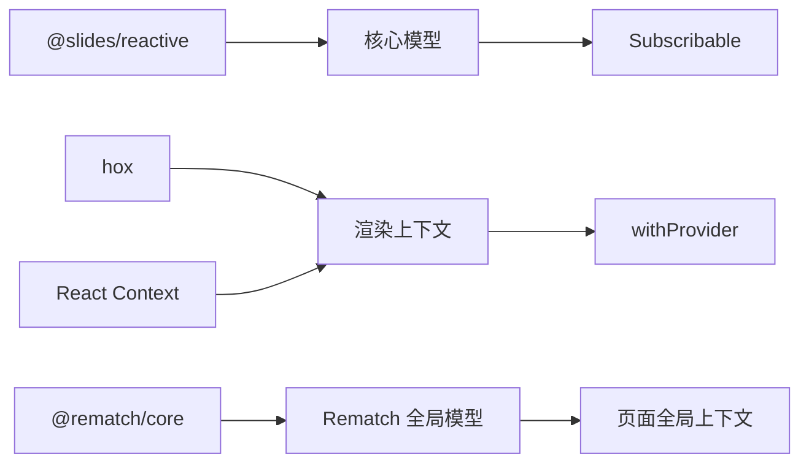

# 响应式状态管理

<cite>
**本文引用的文件**
- [packages/shared/src/subscribable.ts](file://packages/shared/src/subscribable.ts)
- [common/render-core/models/context.ts](file://common/render-core/models/context.ts)
- [common/render-core/models/withProvider.tsx](file://common/render-core/models/withProvider.tsx)
- [packages/core/src/models/History.ts](file://packages/core/src/models/History.ts)
- [packages/core/src/models/Hover.ts](file://packages/core/src/models/Hover.ts)
- [packages/core/src/models/MoveHelper.ts](file://packages/core/src/models/MoveHelper.ts)
- [packages/core/src/models/Workbench.ts](file://packages/core/src/models/Workbench.ts)
- [packages/react/src/context.ts](file://packages/react/src/context.ts)
- [common/render-core/hooks/useUpdateEffect.ts](file://common/render-core/hooks/useUpdateEffect.ts)
- [task/src/store/models/global.ts](file://task/src/store/models/global.ts)
- [task/src/pages/Main/GlobalContext.tsx](file://task/src/pages/Main/GlobalContext.tsx)
- [bridge/mcc-player/src/libs/logger/ali-logger/logCache.ts](file://bridge/mcc-player/src/libs/logger/ali-logger/logCache.ts)
</cite>

## 目录
1. [简介](#简介)
2. [项目结构](#项目结构)
3. [核心组件](#核心组件)
4. [架构总览](#架构总览)
5. [详细组件分析](#详细组件分析)
6. [依赖关系分析](#依赖关系分析)
7. [性能考量](#性能考量)
8. [故障排查指南](#故障排查指南)
9. [结论](#结论)
10. [附录](#附录)

## 简介
本技术文档围绕 Slides Engine 的“响应式状态管理”体系展开，系统性阐述其设计理念与实现原理，重点覆盖以下方面：
- 细粒度状态更新与自动依赖追踪机制
- 状态提供者（Provider）的实现模式与上下文传递机制
- 状态订阅与通知系统（事件分发、组件重渲染触发）
- 状态持久化与恢复策略（本地存储与状态同步）
- 最佳实践与性能优化建议
- API 使用示例与常见问题解决方案

Slides Engine 在不同层面采用多种状态管理模式：核心引擎使用基于响应式库的可观察模型；渲染层通过 React Context 与全局状态库进行上下文传递；同时提供通用的订阅/发布机制以支持跨模块解耦通信。

## 项目结构
围绕响应式状态管理的关键目录与文件如下：
- 核心引擎模型与响应式定义：packages/core/src/models
- 渲染层上下文与 Provider：common/render-core/models、common/render-core/hooks
- 通用订阅/发布：packages/shared/src/subscribable.ts
- React 设计器上下文：packages/react/src/context.ts
- 全局状态（Rematch）：task/src/store/models/global.ts
- 页面级全局上下文：task/src/pages/Main/GlobalContext.tsx
- 本地存储与日志缓存：bridge/mcc-player/src/libs/logger/ali-logger/logCache.ts

图表来源
- [packages/core/src/models/History.ts:1-126](file://packages/core/src/models/History.ts#L1-L126)
- [common/render-core/models/context.ts:1-226](file://common/render-core/models/context.ts#L1-L226)
- [common/render-core/models/withProvider.tsx:1-31](file://common/render-core/models/withProvider.tsx#L1-L31)
- [common/render-core/hooks/useUpdateEffect.ts:1-20](file://common/render-core/hooks/useUpdateEffect.ts#L1-L20)
- [packages/shared/src/subscribable.ts:1-61](file://packages/shared/src/subscribable.ts#L1-L61)
- [task/src/store/models/global.ts:1-24](file://task/src/store/models/global.ts#L1-L24)
- [task/src/pages/Main/GlobalContext.tsx:1-7](file://task/src/pages/Main/GlobalContext.tsx#L1-L7)
- [bridge/mcc-player/src/libs/logger/ali-logger/logCache.ts:47-89](file://bridge/mcc-player/src/libs/logger/ali-logger/logCache.ts#L47-L89)

章节来源
- [packages/core/src/models/History.ts:1-126](file://packages/core/src/models/History.ts#L1-L126)
- [common/render-core/models/context.ts:1-226](file://common/render-core/models/context.ts#L1-L226)
- [common/render-core/models/withProvider.tsx:1-31](file://common/render-core/models/withProvider.tsx#L1-L31)
- [common/render-core/hooks/useUpdateEffect.ts:1-20](file://common/render-core/hooks/useUpdateEffect.ts#L1-L20)
- [packages/shared/src/subscribable.ts:1-61](file://packages/shared/src/subscribable.ts#L1-L61)
- [task/src/store/models/global.ts:1-24](file://task/src/store/models/global.ts#L1-L24)
- [task/src/pages/Main/GlobalContext.tsx:1-7](file://task/src/pages/Main/GlobalContext.tsx#L1-L7)
- [bridge/mcc-player/src/libs/logger/ali-logger/logCache.ts:47-89](file://bridge/mcc-player/src/libs/logger/ali-logger/logCache.ts#L47-L89)

## 核心组件
- 响应式模型与自动依赖追踪
  - 核心模型普遍采用响应式库提供的可观察属性与动作，通过细粒度标记状态字段，实现最小化更新与自动依赖收集。
  - 示例路径：[History.ts:36-46](file://packages/core/src/models/History.ts#L36-L46)、[Hover.ts:42-48](file://packages/core/src/models/Hover.ts#L42-L48)、[MoveHelper.ts:370-386](file://packages/core/src/models/MoveHelper.ts#L370-L386)、[Workbench.ts:30-42](file://packages/core/src/models/Workbench.ts#L30-L42)

- 订阅/发布系统
  - 通用订阅类提供统一的订阅、取消订阅与事件分发接口，支持中断传播控制，便于跨模块解耦通信。
  - 示例路径：[subscribable.ts:9-60](file://packages/shared/src/subscribable.ts#L9-L60)

- 渲染层上下文与 Provider
  - 渲染层通过 React Context 传递配置、资源上报、消息队列等全局状态；withProvider 高阶组件负责组装并注入上下文。
  - 示例路径：[context.ts:1-226](file://common/render-core/models/context.ts#L1-L226)、[withProvider.tsx:1-31](file://common/render-core/models/withProvider.tsx#L1-L31)

- 页面级全局上下文与 Rematch 全局模型
  - 页面级上下文用于承载表单等页面级共享数据；Rematch 模型提供集中式的全局状态与不可变更新语义。
  - 示例路径：[GlobalContext.tsx:1-7](file://task/src/pages/Main/GlobalContext.tsx#L1-L7)、[global.ts:1-24](file://task/src/store/models/global.ts#L1-L24)

- 更新副作用 Hook
  - useUpdateEffect 用于在非首次挂载时执行副作用，避免初始化阶段的重复渲染与副作用触发。
  - 示例路径：[useUpdateEffect.ts:1-20](file://common/render-core/hooks/useUpdateEffect.ts#L1-L20)

章节来源
- [packages/core/src/models/History.ts:36-46](file://packages/core/src/models/History.ts#L36-L46)
- [packages/core/src/models/Hover.ts:42-48](file://packages/core/src/models/Hover.ts#L42-L48)
- [packages/core/src/models/MoveHelper.ts:370-386](file://packages/core/src/models/MoveHelper.ts#L370-L386)
- [packages/core/src/models/Workbench.ts:30-42](file://packages/core/src/models/Workbench.ts#L30-L42)
- [packages/shared/src/subscribable.ts:9-60](file://packages/shared/src/subscribable.ts#L9-L60)
- [common/render-core/models/context.ts:1-226](file://common/render-core/models/context.ts#L1-L226)
- [common/render-core/models/withProvider.tsx:1-31](file://common/render-core/models/withProvider.tsx#L1-L31)
- [task/src/pages/Main/GlobalContext.tsx:1-7](file://task/src/pages/Main/GlobalContext.tsx#L1-L7)
- [task/src/store/models/global.ts:1-24](file://task/src/store/models/global.ts#L1-L24)
- [common/render-core/hooks/useUpdateEffect.ts:1-20](file://common/render-core/hooks/useUpdateEffect.ts#L1-L20)

## 架构总览
Slides Engine 的状态管理由“核心引擎响应式模型 + 渲染层上下文/Provider + 通用订阅/发布 + 页面/全局状态”构成，形成多层协同的状态体系。

图表来源
- [packages/core/src/models/History.ts:1-126](file://packages/core/src/models/History.ts#L1-L126)
- [packages/core/src/models/Hover.ts:1-49](file://packages/core/src/models/Hover.ts#L1-L49)
- [packages/core/src/models/MoveHelper.ts:347-387](file://packages/core/src/models/MoveHelper.ts#L347-L387)
- [packages/core/src/models/Workbench.ts:1-60](file://packages/core/src/models/Workbench.ts#L1-L60)
- [common/render-core/models/context.ts:1-226](file://common/render-core/models/context.ts#L1-L226)
- [common/render-core/models/withProvider.tsx:1-31](file://common/render-core/models/withProvider.tsx#L1-L31)
- [packages/shared/src/subscribable.ts:1-61](file://packages/shared/src/subscribable.ts#L1-L61)
- [task/src/store/models/global.ts:1-24](file://task/src/store/models/global.ts#L1-L24)
- [task/src/pages/Main/GlobalContext.tsx:1-7](file://task/src/pages/Main/GlobalContext.tsx#L1-L7)

## 详细组件分析

### 响应式模型与自动依赖追踪（核心引擎）
- 设计理念
  - 使用响应式库对模型状态进行标记，仅在被访问或依赖的字段发生变化时触发更新，从而实现细粒度更新与自动依赖追踪。
  - 动作（action）封装状态变更，确保更新过程可追踪、可回溯（如历史记录）。
- 关键实现要点
  - 可观察字段：通过标记 ref/shallow 等策略，控制对象或集合的响应式粒度。
  - 动作封装：将状态变更封装为 action，保证更新的原子性与一致性。
  - 示例路径：
    - [History.ts:36-46](file://packages/core/src/models/History.ts#L36-L46)：定义可观察字段与动作
    - [Hover.ts:42-48](file://packages/core/src/models/Hover.ts#L42-L48)：hover 状态的可观察与动作
    - [MoveHelper.ts:370-386](file://packages/core/src/models/MoveHelper.ts#L370-L386)：拖拽状态的可观察与动作
    - [Workbench.ts:30-42](file://packages/core/src/models/Workbench.ts#L30-L42)：工作台状态的可观察与动作

图表来源
- [packages/core/src/models/History.ts:21-126](file://packages/core/src/models/History.ts#L21-L126)
- [packages/core/src/models/Hover.ts:10-49](file://packages/core/src/models/Hover.ts#L10-L49)
- [packages/core/src/models/MoveHelper.ts:347-387](file://packages/core/src/models/MoveHelper.ts#L347-L387)
- [packages/core/src/models/Workbench.ts:10-60](file://packages/core/src/models/Workbench.ts#L10-L60)

章节来源
- [packages/core/src/models/History.ts:21-126](file://packages/core/src/models/History.ts#L21-L126)
- [packages/core/src/models/Hover.ts:10-49](file://packages/core/src/models/Hover.ts#L10-L49)
- [packages/core/src/models/MoveHelper.ts:347-387](file://packages/core/src/models/MoveHelper.ts#L347-L387)
- [packages/core/src/models/Workbench.ts:10-60](file://packages/core/src/models/Workbench.ts#L10-L60)

### 订阅/发布系统（通用）
- 设计理念
  - 提供统一的订阅接口，支持按需取消订阅与事件中断控制，适用于跨模块解耦通信。
- 关键实现要点
  - 订阅/取消订阅：内部维护订阅者索引，返回可调用的取消函数。
  - 事件分发：遍历订阅者并传递上下文，支持中断标志位。
  - 示例路径：[subscribable.ts:9-60](file://packages/shared/src/subscribable.ts#L9-L60)

图表来源
- [packages/shared/src/subscribable.ts:17-28](file://packages/shared/src/subscribable.ts#L17-L28)

章节来源
- [packages/shared/src/subscribable.ts:9-60](file://packages/shared/src/subscribable.ts#L9-L60)

### 渲染层上下文与 Provider（上下文传递）
- 设计理念
  - 通过 React Context 传递渲染期所需的配置、资源上报、消息队列等全局状态；withProvider 高阶组件统一注入上下文，简化组件接入成本。
- 关键实现要点
  - 上下文定义：ConfigContext、FRContext 等。
  - 全局状态：资源上报、实例注册、消息队列等通过全局 store 管理。
  - Provider 包装：合并默认与自定义配置，注入上下文。
  - 示例路径：
    - [context.ts:1-226](file://common/render-core/models/context.ts#L1-L226)：上下文与全局 store 定义
    - [withProvider.tsx:1-31](file://common/render-core/models/withProvider.tsx#L1-L31)：Provider 包装器

图表来源
- [common/render-core/models/withProvider.tsx:4-30](file://common/render-core/models/withProvider.tsx#L4-L30)
- [common/render-core/models/context.ts:1-226](file://common/render-core/models/context.ts#L1-L226)

章节来源
- [common/render-core/models/context.ts:1-226](file://common/render-core/models/context.ts#L1-L226)
- [common/render-core/models/withProvider.tsx:1-31](file://common/render-core/models/withProvider.tsx#L1-L31)

### 页面级全局上下文与 Rematch 全局模型
- 设计理念
  - 页面级上下文用于承载页面级共享数据（如表单），Rematch 全局模型提供集中式状态与不可变更新语义。
- 关键实现要点
  - Rematch 模型：定义 state 与 reducers，提供不可变更新。
  - 页面上下文：React.createContext 创建页面级上下文。
  - 示例路径：
    - [global.ts:1-24](file://task/src/store/models/global.ts#L1-L24)：Rematch 全局模型
    - [GlobalContext.tsx:1-7](file://task/src/pages/Main/GlobalContext.tsx#L1-L7)：页面全局上下文

图表来源
- [task/src/store/models/global.ts:10-24](file://task/src/store/models/global.ts#L10-L24)
- [task/src/pages/Main/GlobalContext.tsx:1-7](file://task/src/pages/Main/GlobalContext.tsx#L1-L7)
- [common/render-core/models/withProvider.tsx:1-31](file://common/render-core/models/withProvider.tsx#L1-L31)

章节来源
- [task/src/store/models/global.ts:1-24](file://task/src/store/models/global.ts#L1-L24)
- [task/src/pages/Main/GlobalContext.tsx:1-7](file://task/src/pages/Main/GlobalContext.tsx#L1-L7)

### 状态订阅与通知系统（组件重渲染触发）
- 设计理念
  - 通过响应式模型的可观察字段变化触发渲染；结合 useUpdateEffect 等 Hook 控制副作用执行时机，避免不必要重渲染。
- 关键实现要点
  - 响应式模型：字段标记与动作封装，确保最小化更新。
  - 更新副作用：useUpdateEffect 在非初次挂载时执行副作用。
  - 示例路径：
    - [Hover.ts:31-40](file://packages/core/src/models/Hover.ts#L31-L40)：触发事件
    - [useUpdateEffect.ts:1-20](file://common/render-core/hooks/useUpdateEffect.ts#L1-L20)：更新副作用 Hook

图表来源
- [packages/core/src/models/Hover.ts:18-40](file://packages/core/src/models/Hover.ts#L18-L40)
- [common/render-core/hooks/useUpdateEffect.ts:1-20](file://common/render-core/hooks/useUpdateEffect.ts#L1-L20)

章节来源
- [packages/core/src/models/Hover.ts:18-40](file://packages/core/src/models/Hover.ts#L18-L40)
- [common/render-core/hooks/useUpdateEffect.ts:1-20](file://common/render-core/hooks/useUpdateEffect.ts#L1-L20)

### 状态持久化与恢复策略（本地存储与状态同步）
- 设计理念
  - 利用浏览器本地存储进行状态持久化与恢复，支持错误处理与配额限制保护。
- 关键实现要点
  - 日志缓存与本地存储：从 localStorage 加载任务数据，保存数组到本地存储，处理 QUOTA_EXCEEDED_ERR。
  - 示例路径：[logCache.ts:47-89](file://bridge/mcc-player/src/libs/logger/ali-logger/logCache.ts#L47-L89)

图表来源
- [bridge/mcc-player/src/libs/logger/ali-logger/logCache.ts:47-89](file://bridge/mcc-player/src/libs/logger/ali-logger/logCache.ts#L47-L89)

章节来源
- [bridge/mcc-player/src/libs/logger/ali-logger/logCache.ts:47-89](file://bridge/mcc-player/src/libs/logger/ali-logger/logCache.ts#L47-L89)

## 依赖关系分析
- 组件耦合与内聚
  - 核心引擎模型与渲染层上下文通过 Context 解耦，模型负责状态与行为，渲染层负责消费与展示。
  - 订阅/发布系统为跨模块解耦提供基础，避免直接依赖导致的环状依赖。
- 外部依赖与集成点
  - 响应式模型依赖 @slides/reactive；渲染层依赖 hox 与 React Context；Rematch 提供全局状态管理。
- 接口契约与实现细节
  - History 模型提供 serialize/from 以支持持久化；Subscribable 提供统一的订阅接口；withProvider 统一上下文注入。

图表来源
- [packages/core/src/models/History.ts:1-1](file://packages/core/src/models/History.ts#L1-L1)
- [common/render-core/models/context.ts:1-2](file://common/render-core/models/context.ts#L1-L2)
- [task/src/store/models/global.ts:1-3](file://task/src/store/models/global.ts#L1-L3)
- [packages/shared/src/subscribable.ts:1-1](file://packages/shared/src/subscribable.ts#L1-L1)

章节来源
- [packages/core/src/models/History.ts:1-1](file://packages/core/src/models/History.ts#L1-L1)
- [common/render-core/models/context.ts:1-2](file://common/render-core/models/context.ts#L1-L2)
- [task/src/store/models/global.ts:1-3](file://task/src/store/models/global.ts#L1-L3)
- [packages/shared/src/subscribable.ts:1-1](file://packages/shared/src/subscribable.ts#L1-L1)

## 性能考量
- 细粒度更新与最小化渲染
  - 使用响应式模型的可观察字段与动作，减少不必要的状态变更与渲染。
- 副作用控制
  - 使用 useUpdateEffect 避免初始化阶段的副作用执行，降低首屏抖动与重复计算。
- 全局状态拆分
  - 将资源上报、消息队列、实例注册等拆分为独立 store，避免单一 store 过大导致的全量重渲染。
- 订阅者管理
  - 订阅/取消订阅及时清理，避免内存泄漏与无效回调。
- 本地存储优化
  - 对本地存储写入进行异常捕获与容量控制，防止因配额不足导致的崩溃。

## 故障排查指南
- 订阅未生效或无法取消
  - 检查订阅返回的取消函数是否正确保存与调用；确认订阅者是否仍处于活跃状态。
  - 参考路径：[subscribable.ts:30-60](file://packages/shared/src/subscribable.ts#L30-L60)
- Provider 注入失败或上下文为空
  - 确认 withProvider 是否包裹目标组件；检查传入的 widgets/methods/globalProps/globalConfig 是否完整。
  - 参考路径：[withProvider.tsx:4-30](file://common/render-core/models/withProvider.tsx#L4-L30)
- 响应式模型未触发渲染
  - 确认字段已标记为可观察；动作是否正确封装；依赖链是否完整。
  - 参考路径：[Hover.ts:42-48](file://packages/core/src/models/Hover.ts#L42-L48)
- 本地存储写入失败
  - 检查浏览器隐私模式或配额限制；确保异常处理逻辑正常执行。
  - 参考路径：[logCache.ts:65-82](file://bridge/mcc-player/src/libs/logger/ali-logger/logCache.ts#L65-L82)

章节来源
- [packages/shared/src/subscribable.ts:30-60](file://packages/shared/src/subscribable.ts#L30-L60)
- [common/render-core/models/withProvider.tsx:4-30](file://common/render-core/models/withProvider.tsx#L4-L30)
- [packages/core/src/models/Hover.ts:42-48](file://packages/core/src/models/Hover.ts#L42-L48)
- [bridge/mcc-player/src/libs/logger/ali-logger/logCache.ts:65-82](file://bridge/mcc-player/src/libs/logger/ali-logger/logCache.ts#L65-L82)

## 结论
Slides Engine 的响应式状态管理体系通过“核心引擎响应式模型 + 渲染层上下文/Provider + 通用订阅/发布 + 页面/全局状态”的多层协同，实现了细粒度状态更新、自动依赖追踪、灵活的上下文传递与跨模块解耦通信。配合本地存储与状态同步策略，满足了复杂场景下的状态持久化需求。遵循本文最佳实践与性能优化建议，可在保证开发效率的同时获得稳定、可维护的状态管理体验。

## 附录
- API 使用示例（路径指引）
  - 订阅/发布：参考 [subscribable.ts:9-60](file://packages/shared/src/subscribable.ts#L9-L60)
  - Provider 注入：参考 [withProvider.tsx:1-31](file://common/render-core/models/withProvider.tsx#L1-L31)
  - 响应式模型动作：参考 [Hover.ts:18-40](file://packages/core/src/models/Hover.ts#L18-L40)
  - Rematch 全局模型：参考 [global.ts:10-24](file://task/src/store/models/global.ts#L10-L24)
  - 页面全局上下文：参考 [GlobalContext.tsx:1-7](file://task/src/pages/Main/GlobalContext.tsx#L1-L7)
  - 本地存储持久化：参考 [logCache.ts:47-89](file://bridge/mcc-player/src/libs/logger/ali-logger/logCache.ts#L47-L89)