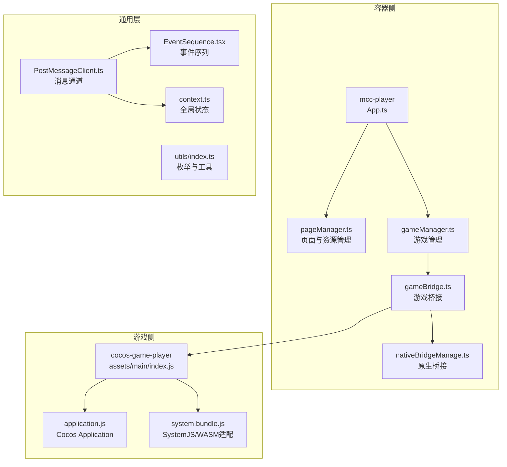
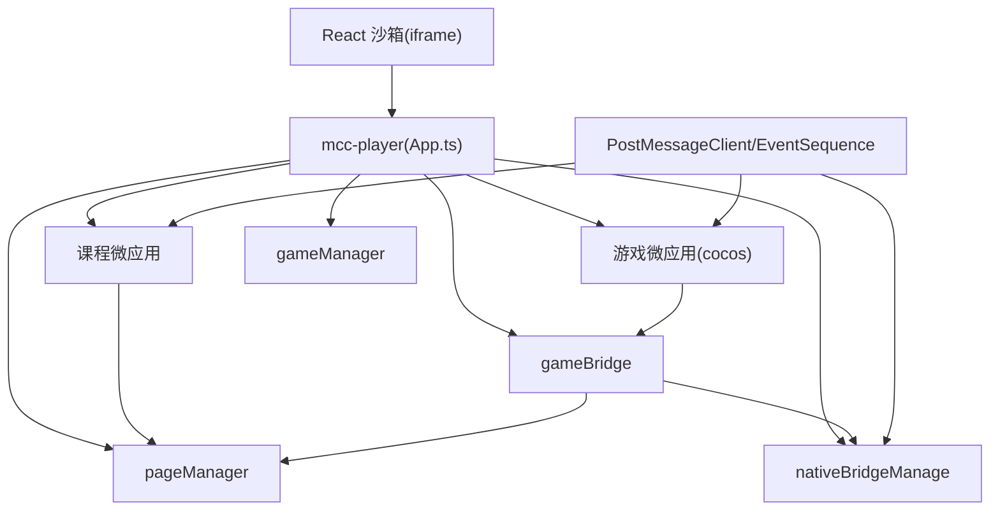
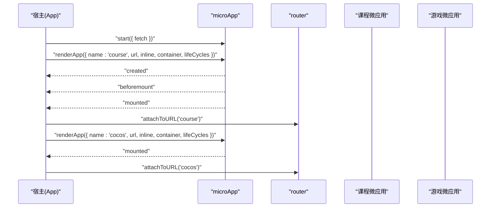
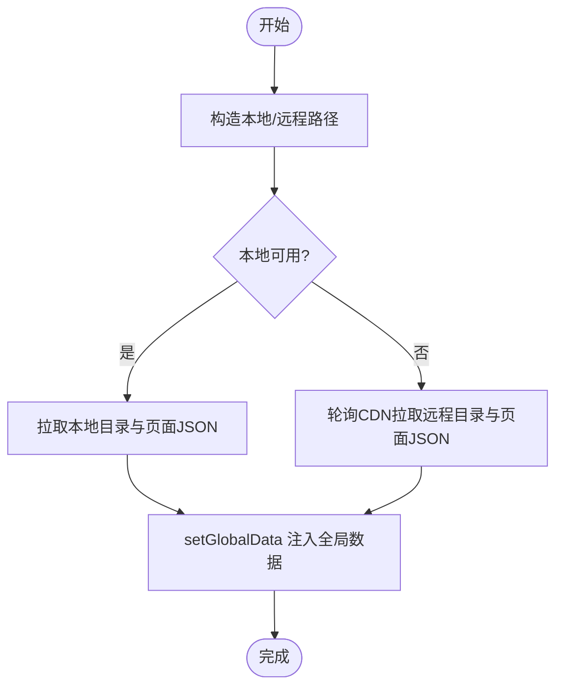
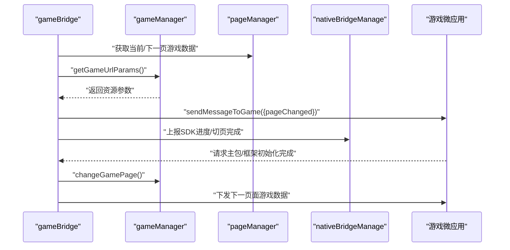
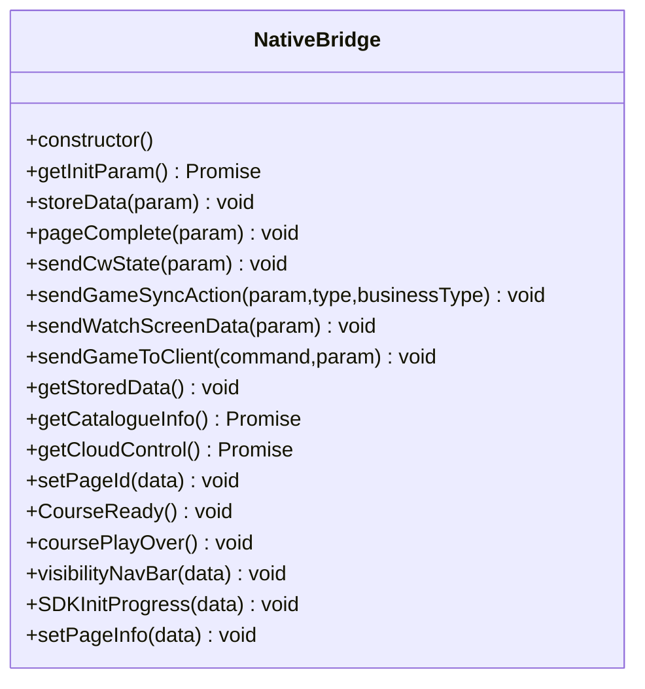
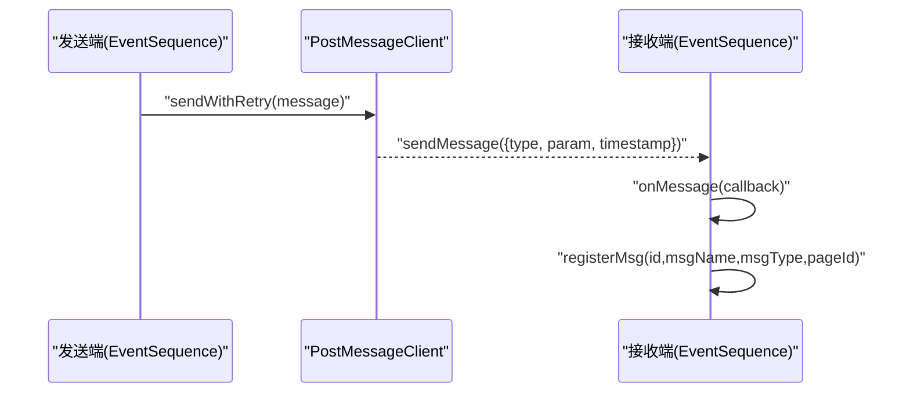
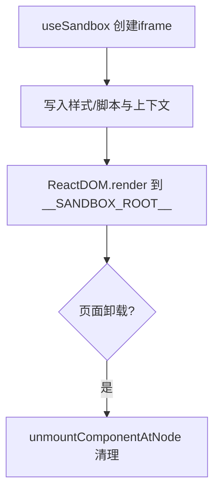
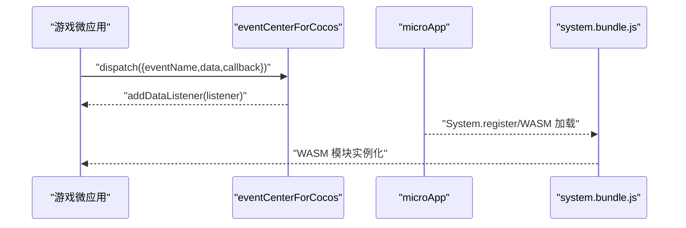
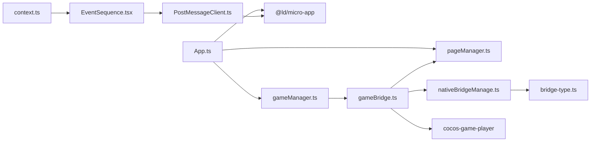

# 微前端集成架构

<cite>
**本文引用的文件**
- [packages/react-sandbox/src/index.ts](file://packages/react-sandbox/src/index.ts)
- [bridge/mcc-player/src/App.ts](file://bridge/mcc-player/src/App.ts)
- [bridge/mcc-player/src/components/page/pageManager.ts](file://bridge/mcc-player/src/components/page/pageManager.ts)
- [bridge/mcc-player/src/components/game-manage/gameManager.ts](file://bridge/mcc-player/src/components/game-manage/gameManager.ts)
- [bridge/mcc-player/src/components/game-manage/gameBridge.ts](file://bridge/mcc-player/src/components/game-manage/gameBridge.ts)
- [bridge/mcc-player/src/components/native-bridge/nativeBridgeManage.ts](file://bridge/mcc-player/src/components/native-bridge/nativeBridgeManage.ts)
- [bridge/mcc-player/src/components/native-bridge/bridge-type.ts](file://bridge/mcc-player/src/components/native-bridge/bridge-type.ts)
- [common/render-core/components/PostMessageClient.ts](file://common/render-core/components/PostMessageClient.ts)
- [common/render-core/components/EventSequence.tsx](file://common/render-core/components/EventSequence.tsx)
- [common/render-core/models/context.ts](file://common/render-core/models/context.ts)
- [common/render-core/utils/index.ts](file://common/render-core/utils/index.ts)
- [bridge/cocos-game-player/assets/main/index.js](file://bridge/cocos-game-player/assets/main/index.js)
- [bridge/cocos-game-player/application.js](file://bridge/cocos-game-player/application.js)
- [bridge/cocos-game-player/src/system.bundle.js](file://bridge/cocos-game-player/src/system.bundle.js)
</cite>

## 目录
1. [引言](#引言)
2. [项目结构](#项目结构)
3. [核心组件](#核心组件)
4. [架构总览](#架构总览)
5. [详细组件分析](#详细组件分析)
6. [依赖关系分析](#依赖关系分析)
7. [性能考虑](#性能考虑)
8. [故障排查指南](#故障排查指南)
9. [结论](#结论)
10. [附录](#附录)

## 引言
本文件面向 Slides Engine 的微前端集成架构，系统性阐述微前端设计原理与实现策略，覆盖应用隔离、资源共享与通信机制；详解微应用容器（基于 micro-app）的实现，包括沙箱环境、路由管理与生命周期控制；说明跨应用通信（消息传递、事件总线、状态共享）；解释原生桥接系统（原生功能调用与数据交换）；并给出安全策略与性能优化建议及开发集成最佳实践。

## 项目结构
Slides Engine 采用多包工作区组织，微前端相关代码主要分布在以下模块：
- 容器侧：mcc-player（课程与游戏微应用容器，基于 micro-app）
- 游戏侧：cocos-game-player（Cocos 引擎游戏微应用）
- 通用渲染与通信：common/render-core（事件序列、消息通道、全局状态）
- 沙箱：packages/react-sandbox（React 沙箱 iframe 容器）

图示来源
- [bridge/mcc-player/src/App.ts:15-199](file://bridge/mcc-player/src/App.ts#L15-L199)
- [bridge/mcc-player/src/components/page/pageManager.ts:1-498](file://bridge/mcc-player/src/components/page/pageManager.ts#L1-L498)
- [bridge/mcc-player/src/components/game-manage/gameManager.ts:65-368](file://bridge/mcc-player/src/components/game-manage/gameManager.ts#L65-L368)
- [bridge/mcc-player/src/components/game-manage/gameBridge.ts:22-388](file://bridge/mcc-player/src/components/game-manage/gameBridge.ts#L22-L388)
- [bridge/mcc-player/src/components/native-bridge/nativeBridgeManage.ts:26-395](file://bridge/mcc-player/src/components/native-bridge/nativeBridgeManage.ts#L26-L395)
- [common/render-core/components/PostMessageClient.ts:4-80](file://common/render-core/components/PostMessageClient.ts#L4-L80)
- [common/render-core/components/EventSequence.tsx:31-69](file://common/render-core/components/EventSequence.tsx#L31-L69)
- [common/render-core/models/context.ts:7-226](file://common/render-core/models/context.ts#L7-L226)
- [common/render-core/utils/index.ts:24-40](file://common/render-core/utils/index.ts#L24-L40)
- [bridge/cocos-game-player/assets/main/index.js:560-669](file://bridge/cocos-game-player/assets/main/index.js#L560-L669)
- [bridge/cocos-game-player/application.js:14-62](file://bridge/cocos-game-player/application.js#L14-L62)
- [bridge/cocos-game-player/src/system.bundle.js:1020-1044](file://bridge/cocos-game-player/src/system.bundle.js#L1020-L1044)

章节来源
- [bridge/mcc-player/src/App.ts:15-199](file://bridge/mcc-player/src/App.ts#L15-L199)
- [bridge/mcc-player/src/components/page/pageManager.ts:1-498](file://bridge/mcc-player/src/components/page/pageManager.ts#L1-L498)
- [bridge/mcc-player/src/components/game-manage/gameManager.ts:65-368](file://bridge/mcc-player/src/components/game-manage/gameManager.ts#L65-L368)
- [bridge/mcc-player/src/components/game-manage/gameBridge.ts:22-388](file://bridge/mcc-player/src/components/game-manage/gameBridge.ts#L22-L388)
- [bridge/mcc-player/src/components/native-bridge/nativeBridgeManage.ts:26-395](file://bridge/mcc-player/src/components/native-bridge/nativeBridgeManage.ts#L26-L395)
- [common/render-core/components/PostMessageClient.ts:4-80](file://common/render-core/components/PostMessageClient.ts#L4-L80)
- [common/render-core/components/EventSequence.tsx:31-69](file://common/render-core/components/EventSequence.tsx#L31-L69)
- [common/render-core/models/context.ts:7-226](file://common/render-core/models/context.ts#L7-L226)
- [common/render-core/utils/index.ts:24-40](file://common/render-core/utils/index.ts#L24-L40)
- [bridge/cocos-game-player/assets/main/index.js:560-669](file://bridge/cocos-game-player/assets/main/index.js#L560-L669)
- [bridge/cocos-game-player/application.js:14-62](file://bridge/cocos-game-player/application.js#L14-L62)
- [bridge/cocos-game-player/src/system.bundle.js:1020-1044](file://bridge/cocos-game-player/src/system.bundle.js#L1020-L1044)

## 核心组件
- 微应用容器与生命周期
  - 容器入口通过 microApp.start 配置自定义 fetch，并在 renderApp 中挂载课程与游戏微应用，绑定生命周期钩子（created/beforemount/mounted/unmount/error），并使用 router.attachToURL 实现路由绑定。
- 页面与资源管理
  - pageManager 负责目录与页面 JSON 的拉取、缓存与全局数据注入，支持本地/远程优先级与 CDN 备用链路，统一注入到 microApp 全局数据。
- 游戏管理与桥接
  - gameManager 维护游戏资源路径、预加载与切页逻辑，封装与游戏微应用的通信；gameBridge 统一处理游戏与 MCC、原生之间的消息转发、状态同步与事件分发。
- 原生桥接
  - nativeBridgeManage 抽象原生通信协议，兼容 web/messageHandlers/htHammer 等通道，统一封装 call-native 与 notify-native，支持 Pomelo 透传与事件回调。
- 事件序列与消息通道
  - PostMessageClient 提供跨应用消息通道，支持 preview 模式下的 BroadcastChannel 与生产模式下的 microApp.forceDispatch；EventSequence 负责事件序列化与回放。
- React 沙箱
  - packages/react-sandbox 提供 iframe 沙箱容器，注入设计器上下文与样式，确保隔离与内存回收。

章节来源
- [bridge/mcc-player/src/App.ts:15-199](file://bridge/mcc-player/src/App.ts#L15-L199)
- [bridge/mcc-player/src/components/page/pageManager.ts:194-498](file://bridge/mcc-player/src/components/page/pageManager.ts#L194-L498)
- [bridge/mcc-player/src/components/game-manage/gameManager.ts:65-368](file://bridge/mcc-player/src/components/game-manage/gameManager.ts#L65-L368)
- [bridge/mcc-player/src/components/game-manage/gameBridge.ts:22-388](file://bridge/mcc-player/src/components/game-manage/gameBridge.ts#L22-L388)
- [bridge/mcc-player/src/components/native-bridge/nativeBridgeManage.ts:26-395](file://bridge/mcc-player/src/components/native-bridge/nativeBridgeManage.ts#L26-L395)
- [common/render-core/components/PostMessageClient.ts:4-80](file://common/render-core/components/PostMessageClient.ts#L4-L80)
- [common/render-core/components/EventSequence.tsx:31-69](file://common/render-core/components/EventSequence.tsx#L31-L69)
- [packages/react-sandbox/src/index.ts:18-133](file://packages/react-sandbox/src/index.ts#L18-L133)

## 架构总览
Slides Engine 的微前端架构围绕“容器 + 微应用 + 事件/状态 + 原生桥接”展开：
- 容器侧（mcc-player）负责应用装载、路由与生命周期管理；
- 课程与游戏微应用通过 micro-app 注入全局数据、监听生命周期；
- 事件序列与消息通道实现跨应用通信；
- 原生桥接统一处理端能力调用与数据交换；
- React 沙箱保障容器内渲染隔离。

图示来源
- [bridge/mcc-player/src/App.ts:15-199](file://bridge/mcc-player/src/App.ts#L15-L199)
- [bridge/mcc-player/src/components/page/pageManager.ts:1-498](file://bridge/mcc-player/src/components/page/pageManager.ts#L1-L498)
- [bridge/mcc-player/src/components/game-manage/gameManager.ts:65-368](file://bridge/mcc-player/src/components/game-manage/gameManager.ts#L65-L368)
- [bridge/mcc-player/src/components/game-manage/gameBridge.ts:22-388](file://bridge/mcc-player/src/components/game-manage/gameBridge.ts#L22-L388)
- [bridge/mcc-player/src/components/native-bridge/nativeBridgeManage.ts:26-395](file://bridge/mcc-player/src/components/native-bridge/nativeBridgeManage.ts#L26-L395)
- [common/render-core/components/PostMessageClient.ts:4-80](file://common/render-core/components/PostMessageClient.ts#L4-L80)
- [common/render-core/components/EventSequence.tsx:31-69](file://common/render-core/components/EventSequence.tsx#L31-L69)
- [packages/react-sandbox/src/index.ts:18-133](file://packages/react-sandbox/src/index.ts#L18-L133)

## 详细组件分析

### 容器与微应用生命周期
- 容器通过 microApp.start 注入自定义 fetch，统一资源拉取策略；
- 使用 renderApp 加载课程与游戏微应用，绑定 created/beforemount/mounted/unmount/error 生命周期；
- mounted 后调用 router.attachToURL 将微应用路由接入主应用；
- 错误时记录埋点与耗时，便于诊断。

图示来源
- [bridge/mcc-player/src/App.ts:15-199](file://bridge/mcc-player/src/App.ts#L15-L199)

章节来源
- [bridge/mcc-player/src/App.ts:15-199](file://bridge/mcc-player/src/App.ts#L15-L199)

### 页面与资源管理（pageManager）
- 统一构造本地/远程路径，优先本地资源，失败则轮询 CDN；
- 通过 microApp.setGlobalData 注入资源路径与页面 JSON；
- 提供目录解析、页面 JSON 拉取、错误重试与日志埋点。

图示来源
- [bridge/mcc-player/src/components/page/pageManager.ts:194-498](file://bridge/mcc-player/src/components/page/pageManager.ts#L194-L498)

章节来源
- [bridge/mcc-player/src/components/page/pageManager.ts:194-498](file://bridge/mcc-player/src/components/page/pageManager.ts#L194-L498)

### 游戏管理与桥接（gameManager / gameBridge）
- gameManager 维护游戏资源路径、预加载与切页逻辑，向游戏微应用下发当前页与下一页的游戏数据；
- gameBridge 统一处理游戏与 MCC、原生之间的消息转发、状态同步与事件分发，包括心跳同步、互动授权、暂停/恢复、FPS 设置等；
- 通过 window['cocosGameMessage'] 与游戏微应用通信，支持同步数据回放与广播。

图示来源
- [bridge/mcc-player/src/components/game-manage/gameManager.ts:65-368](file://bridge/mcc-player/src/components/game-manage/gameManager.ts#L65-L368)
- [bridge/mcc-player/src/components/game-manage/gameBridge.ts:22-388](file://bridge/mcc-player/src/components/game-manage/gameBridge.ts#L22-L388)

章节来源
- [bridge/mcc-player/src/components/game-manage/gameManager.ts:65-368](file://bridge/mcc-player/src/components/game-manage/gameManager.ts#L65-L368)
- [bridge/mcc-player/src/components/game-manage/gameBridge.ts:22-388](file://bridge/mcc-player/src/components/game-manage/gameBridge.ts#L22-L388)

### 原生桥接系统（nativeBridgeManage）
- 统一抽象原生通信协议，兼容 web/messageHandlers/htHammer 等通道；
- 提供 call-native（带超时与 Promise 化）、notify-native、Pomelo 透传、事件监听与消息分发；
- 支持 SDK 初始化进度、课件状态、页面切换、互动授权、观看端透传等命令。

图示来源
- [bridge/mcc-player/src/components/native-bridge/nativeBridgeManage.ts:26-395](file://bridge/mcc-player/src/components/native-bridge/nativeBridgeManage.ts#L26-L395)
- [bridge/mcc-player/src/components/native-bridge/bridge-type.ts:3-73](file://bridge/mcc-player/src/components/native-bridge/bridge-type.ts#L3-L73)

章节来源
- [bridge/mcc-player/src/components/native-bridge/nativeBridgeManage.ts:26-395](file://bridge/mcc-player/src/components/native-bridge/nativeBridgeManage.ts#L26-L395)
- [bridge/mcc-player/src/components/native-bridge/bridge-type.ts:3-73](file://bridge/mcc-player/src/components/native-bridge/bridge-type.ts#L3-L73)

### 事件序列与消息通道（PostMessageClient / EventSequence）
- PostMessageClient 在 preview 模式使用 BroadcastChannel，在生产模式通过 microApp.forceDispatch 与主应用通信；
- EventSequence 负责事件序列化、控制器注册与回放，结合全局状态与消息队列实现跨应用状态同步。

图示来源
- [common/render-core/components/PostMessageClient.ts:4-80](file://common/render-core/components/PostMessageClient.ts#L4-L80)
- [common/render-core/components/EventSequence.tsx:31-69](file://common/render-core/components/EventSequence.tsx#L31-L69)
- [common/render-core/utils/index.ts:24-40](file://common/render-core/utils/index.ts#L24-L40)

章节来源
- [common/render-core/components/PostMessageClient.ts:4-80](file://common/render-core/components/PostMessageClient.ts#L4-L80)
- [common/render-core/components/EventSequence.tsx:31-69](file://common/render-core/components/EventSequence.tsx#L31-L69)
- [common/render-core/utils/index.ts:24-40](file://common/render-core/utils/index.ts#L24-L40)

### React 沙箱（iframe 隔离）
- 通过 useSandbox 创建 iframe，注入 CSS/JS 资产与设计器上下文；
- 提供 renderSandboxContent 与 Sandbox 组件，确保容器内 React 渲染隔离与内存回收。

图示来源
- [packages/react-sandbox/src/index.ts:18-133](file://packages/react-sandbox/src/index.ts#L18-L133)

章节来源
- [packages/react-sandbox/src/index.ts:18-133](file://packages/react-sandbox/src/index.ts#L18-L133)

### 游戏微应用（Cocos）
- 游戏微应用通过 window['eventCenterForCocos'] 与容器侧事件中心对接，实现消息分发与监听；
- system.bundle.js 提供 SystemJS/WASM 适配，确保 WebAssembly 模块按需加载与导入；
- application.js 定义 Cocos Application 初始化流程，配合微应用生命周期。

图示来源
- [bridge/cocos-game-player/assets/main/index.js:560-669](file://bridge/cocos-game-player/assets/main/index.js#L560-L669)
- [bridge/cocos-game-player/src/system.bundle.js:1020-1044](file://bridge/cocos-game-player/src/system.bundle.js#L1020-L1044)
- [bridge/cocos-game-player/application.js:14-62](file://bridge/cocos-game-player/application.js#L14-L62)

章节来源
- [bridge/cocos-game-player/assets/main/index.js:560-669](file://bridge/cocos-game-player/assets/main/index.js#L560-L669)
- [bridge/cocos-game-player/src/system.bundle.js:1020-1044](file://bridge/cocos-game-player/src/system.bundle.js#L1020-L1044)
- [bridge/cocos-game-player/application.js:14-62](file://bridge/cocos-game-player/application.js#L14-L62)

## 依赖关系分析
- 容器与微应用：App.ts 依赖 microApp，通过 renderApp 与 router 管理生命周期与路由；
- 页面与游戏：pageManager 与 gameManager 通过 microApp 全局数据协作；gameBridge 作为中枢协调原生与游戏；
- 通信与状态：PostMessageClient 与 EventSequence 依赖 microApp 事件通道；context.ts 提供全局状态；
- 原生桥接：nativeBridgeManage 依赖 bridge-type 定义命令枚举，兼容多通道；
- 游戏侧：cocos-game-player 通过事件中心与 system.bundle.js 的 SystemJS/WASM 适配与容器通信。

图示来源
- [bridge/mcc-player/src/App.ts:15-199](file://bridge/mcc-player/src/App.ts#L15-L199)
- [bridge/mcc-player/src/components/page/pageManager.ts:1-498](file://bridge/mcc-player/src/components/page/pageManager.ts#L1-L498)
- [bridge/mcc-player/src/components/game-manage/gameManager.ts:65-368](file://bridge/mcc-player/src/components/game-manage/gameManager.ts#L65-L368)
- [bridge/mcc-player/src/components/game-manage/gameBridge.ts:22-388](file://bridge/mcc-player/src/components/game-manage/gameBridge.ts#L22-L388)
- [bridge/mcc-player/src/components/native-bridge/nativeBridgeManage.ts:26-395](file://bridge/mcc-player/src/components/native-bridge/nativeBridgeManage.ts#L26-L395)
- [bridge/mcc-player/src/components/native-bridge/bridge-type.ts:3-73](file://bridge/mcc-player/src/components/native-bridge/bridge-type.ts#L3-L73)
- [common/render-core/components/PostMessageClient.ts:4-80](file://common/render-core/components/PostMessageClient.ts#L4-L80)
- [common/render-core/components/EventSequence.tsx:31-69](file://common/render-core/components/EventSequence.tsx#L31-L69)
- [common/render-core/models/context.ts:7-226](file://common/render-core/models/context.ts#L7-L226)

章节来源
- [bridge/mcc-player/src/App.ts:15-199](file://bridge/mcc-player/src/App.ts#L15-L199)
- [bridge/mcc-player/src/components/page/pageManager.ts:1-498](file://bridge/mcc-player/src/components/page/pageManager.ts#L1-L498)
- [bridge/mcc-player/src/components/game-manage/gameManager.ts:65-368](file://bridge/mcc-player/src/components/game-manage/gameManager.ts#L65-L368)
- [bridge/mcc-player/src/components/game-manage/gameBridge.ts:22-388](file://bridge/mcc-player/src/components/game-manage/gameBridge.ts#L22-L388)
- [bridge/mcc-player/src/components/native-bridge/nativeBridgeManage.ts:26-395](file://bridge/mcc-player/src/components/native-bridge/nativeBridgeManage.ts#L26-L395)
- [bridge/mcc-player/src/components/native-bridge/bridge-type.ts:3-73](file://bridge/mcc-player/src/components/native-bridge/bridge-type.ts#L3-L73)
- [common/render-core/components/PostMessageClient.ts:4-80](file://common/render-core/components/PostMessageClient.ts#L4-L80)
- [common/render-core/components/EventSequence.tsx:31-69](file://common/render-core/components/EventSequence.tsx#L31-L69)
- [common/render-core/models/context.ts:7-226](file://common/render-core/models/context.ts#L7-L226)

## 性能考虑
- 资源加载与缓存
  - pageManager 优先本地资源，失败自动回退至 CDN，减少首屏等待；通过 microApp.setGlobalData 缓存页面 JSON，避免重复拉取。
- 微应用生命周期
  - 使用 beforemount/mounted/unmount 合理释放资源，避免内存泄漏；容器侧在卸载时清理事件监听与定时器。
- 通信优化
  - PostMessageClient 在 preview 模式使用 BroadcastChannel，降低跨标签通信成本；生产模式通过 microApp.forceDispatch 减少额外封装开销。
- 游戏侧优化
  - gameManager 预加载下一页面游戏资源，缩短切页时延；SystemJS/WASM 适配按需加载，减少初始体积。
- 沙箱隔离
  - React 沙箱在 iframe 中渲染，避免样式与脚本冲突；卸载时主动 unmount，防止内存泄漏。

## 故障排查指南
- 微应用加载失败
  - 检查 App.ts 中 renderApp 的 error 生命周期回调，记录错误与耗时；确认自定义 fetch 返回值与 CORS 配置。
- 页面资源拉取失败
  - pageManager 的 getRemoteJson 会轮询 CDN，若全部失败，检查网络与 hosts 列表；确认本地根目录与 remote 路径配置。
- 游戏切页异常
  - gameManager.changeGamePage 会重置同步数据并上报进度，检查 pageManager.pageLoadSuccess 与 gameFrameDone 标志位。
- 原生通信异常
  - nativeBridgeManage 会在多种通道间回退，确认 window.webkit/window.htHammer/window.jsHandler 是否可用；检查消息格式与命令枚举。
- 事件序列不同步
  - EventSequence 依赖 registerMsg 与消息队列，检查消息命名、pageId 与 msgType 是否一致；确认 context.ts 中 msgStore 缓存命中。

章节来源
- [bridge/mcc-player/src/App.ts:140-151](file://bridge/mcc-player/src/App.ts#L140-L151)
- [bridge/mcc-player/src/components/page/pageManager.ts:349-465](file://bridge/mcc-player/src/components/page/pageManager.ts#L349-L465)
- [bridge/mcc-player/src/components/game-manage/gameManager.ts:200-260](file://bridge/mcc-player/src/components/game-manage/gameManager.ts#L200-L260)
- [bridge/mcc-player/src/components/native-bridge/nativeBridgeManage.ts:182-205](file://bridge/mcc-player/src/components/native-bridge/nativeBridgeManage.ts#L182-L205)
- [common/render-core/components/EventSequence.tsx:194-214](file://common/render-core/components/EventSequence.tsx#L194-L214)

## 结论
Slides Engine 的微前端架构以 micro-app 为核心，结合页面与资源管理、游戏桥接、原生通信与事件序列，实现了稳定的隔离、路由与通信能力。通过合理的资源加载策略、生命周期管理与通信通道抽象，系统在复杂教学场景中具备良好的可维护性与扩展性。后续可在安全加固、缓存策略与可观测性方面持续优化。

## 附录
- 开发与集成最佳实践
  - 使用 App.ts 的生命周期钩子进行资源与状态初始化；在 gameManager 中统一管理游戏资源路径与预加载。
  - 通过 bridge-type.ts 统一命令枚举，避免字符串魔法；在 nativeBridgeManage 中集中处理超时与回退逻辑。
  - 使用 PostMessageClient 与 EventSequence 实现跨应用事件与状态同步，确保消息命名规范与幂等处理。
  - 在 React 沙箱中注入必要的上下文与样式，避免外部污染；在卸载时清理 DOM 与事件监听。
- 安全策略建议
  - 严格校验微应用来源与资源路径，启用 CSP 与子资源完整性（SRI）；
  - 对原生通信通道进行白名单与鉴权，限制可调用命令范围；
  - 对跨应用消息进行签名与校验，防止伪造与重放攻击。