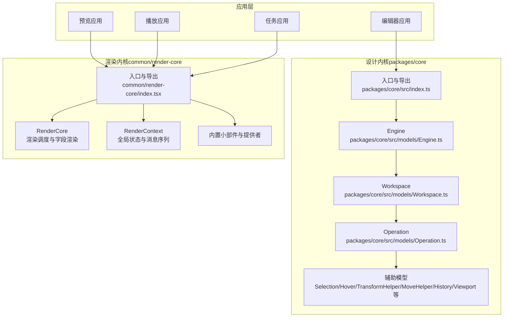
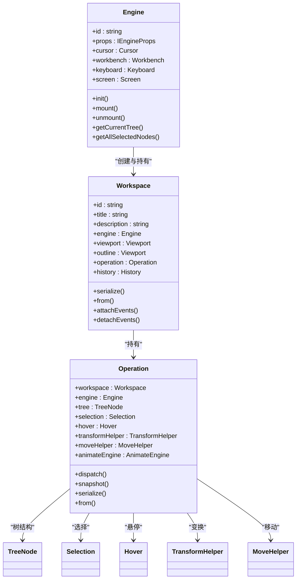
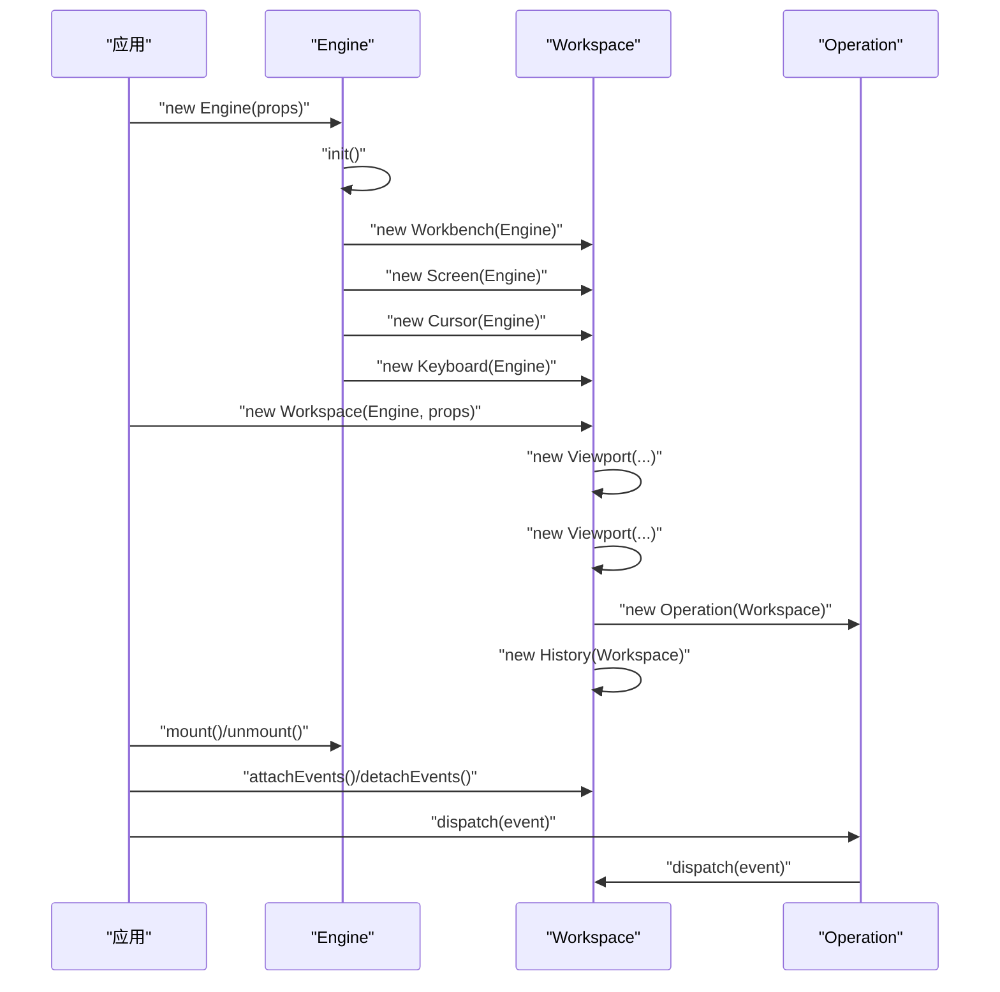
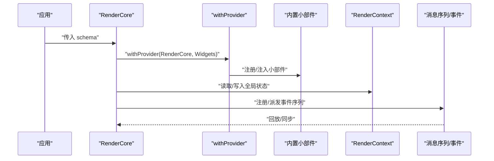
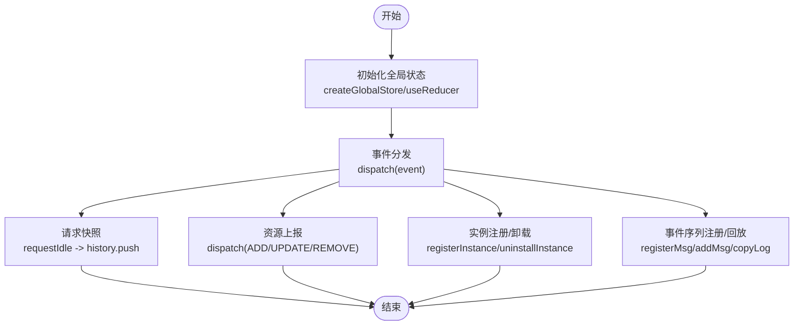
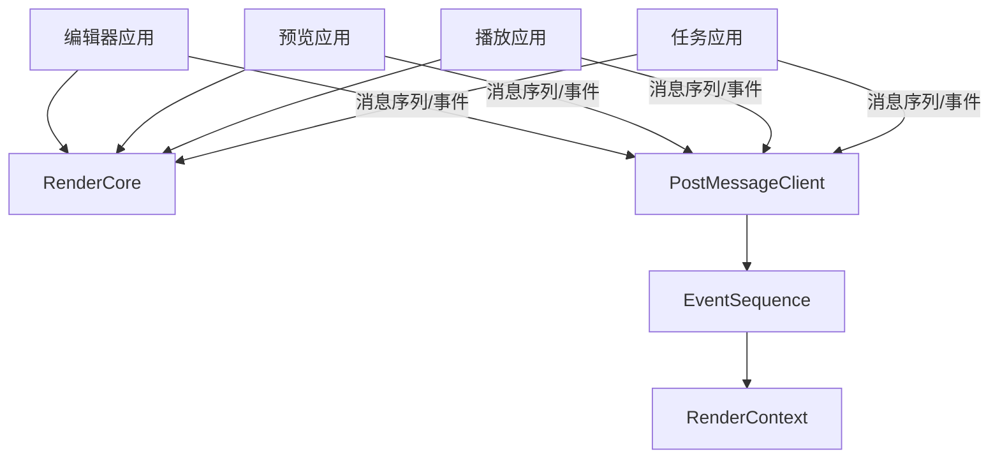
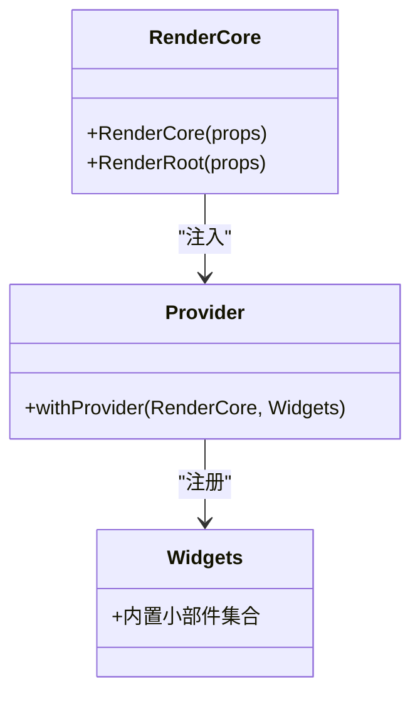
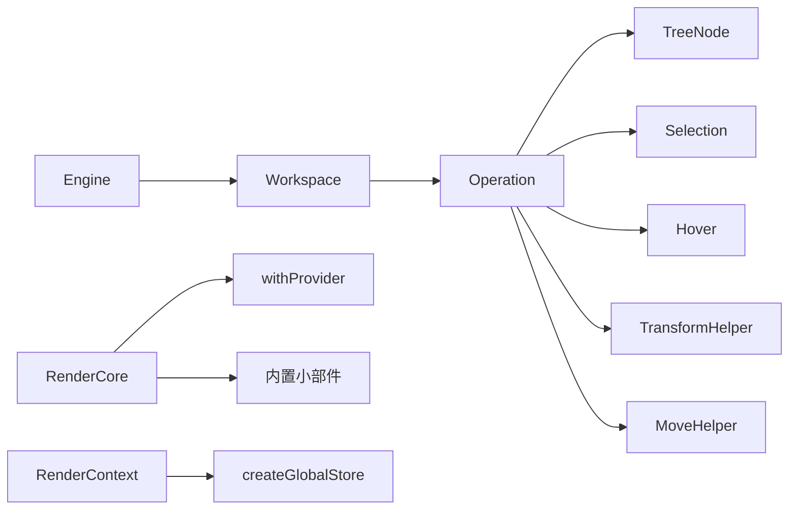

# 核心架构

<cite>
**本文引用的文件**
- [packages/core/src/index.ts](file://packages/core/src/index.ts)
- [packages/core/src/models/Engine.ts](file://packages/core/src/models/Engine.ts)
- [packages/core/src/models/Workspace.ts](file://packages/core/src/models/Workspace.ts)
- [packages/core/src/models/Operation.ts](file://packages/core/src/models/Operation.ts)
- [common/render-core/index.tsx](file://common/render-core/index.tsx)
- [common/render-core/models/context.ts](file://common/render-core/models/context.ts)
- [common/render-context/src/index.ts](file://common/render-context/src/index.ts)
- [common/render-core/components/PostMessageClient.ts](file://common/render-core/components/PostMessageClient.ts)
- [common/render-core/components/EventSequence.tsx](file://common/render-core/components/EventSequence.tsx)
- [common/render-core/widgets/index.tsx](file://common/render-core/widgets/index.tsx)
- [common/render-core/models/withProvider.tsx](file://common/render-core/models/withProvider.tsx)
- [common/render-core/models/mapping.ts](file://common/render-core/models/mapping.ts)
- [common/render-core/models/sortProperties.ts](file://common/render-core/models/sortProperties.ts)
- [common/render-core/shared/mode.ts](file://common/render-core/shared/mode.ts)
- [common/render-core/utils/index.ts](file://common/render-core/utils/index.ts)
- [common/render-core/schema.ts](file://common/render-core/schema.ts)
- [packages/core/src/drivers/index.ts](file://packages/core/src/drivers/index.ts)
- [packages/core/src/effects/index.ts](file://packages/core/src/effects/index.ts)
- [packages/core/src/effects/useDragDropEffect.ts](file://packages/core/src/effects/useDragDropEffect.ts)
- [packages/core/src/effects/useSelectionEffect.ts](file://packages/core/src/effects/useSelectionEffect.ts)
- [packages/core/src/effects/usePositionEffect.ts](file://packages/core/src/effects/usePositionEffect.ts)
- [packages/core/src/effects/useResizeEffect.ts](file://packages/core/src/effects/useResizeEffect.ts)
- [packages/core/src/effects/useViewportEffect.ts](file://packages/core/src/effects/useViewportEffect.ts)
- [packages/core/src/effects/useKeyboardEffect.ts](file://packages/core/src/effects/useKeyboardEffect.ts)
- [packages/core/src/effects/useAutoScrollEffect.ts](file://packages/core/src/effects/useAutoScrollEffect.ts)
- [packages/core/src/effects/useCursorEffect.ts](file://packages/core/src/effects/useCursorEffect.ts)
- [packages/core/src/effects/useContentEditableEffect.ts](file://packages/core/src/effects/useContentEditableEffect.ts)
- [packages/core/src/effects/useTranslateEffect.ts](file://packages/core/src/effects/useTranslateEffect.ts)
- [packages/core/src/effects/useFreeSelectionEffect.ts](file://packages/core/src/effects/useFreeSelectionEffect.ts)
- [packages/core/src/effects/useViewportEffect.ts](file://packages/core/src/effects/useViewportEffect.ts)
- [packages/core/src/drivers/DragDropDriver.ts](file://packages/core/src/drivers/DragDropDriver.ts)
- [packages/core/src/drivers/KeyboardDriver.ts](file://packages/core/src/drivers/KeyboardDriver.ts)
- [packages/core/src/drivers/MouseMoveDriver.ts](file://packages/core/src/drivers/MouseMoveDriver.ts)
- [packages/core/src/drivers/MouseClickDriver.ts](file://packages/core/src/drivers/MouseClickDriver.ts)
- [packages/core/src/drivers/ViewportResizeDriver.ts](file://packages/core/src/drivers/ViewportResizeDriver.ts)
- [packages/core/src/drivers/ViewportScrollDriver.ts](file://packages/core/src/drivers/ViewportScrollDriver.ts)
- [packages/core/src/drivers/ContextMenuDriver.ts](file://packages/core/src/drivers/ContextMenuDriver.ts)
- [packages/core/src/models/TreeNode.ts](file://packages/core/src/models/TreeNode.ts)
- [packages/core/src/models/Selection.ts](file://packages/core/src/models/Selection.ts)
- [packages/core/src/models/Hover.ts](file://packages/core/src/models/Hover.ts)
- [packages/core/src/models/TransformHelper.ts](file://packages/core/src/models/TransformHelper.ts)
- [packages/core/src/models/MoveHelper.ts](file://packages/core/src/models/MoveHelper.ts)
- [packages/core/src/models/History.ts](file://packages/core/src/models/History.ts)
- [packages/core/src/models/Viewport.ts](file://packages/core/src/models/Viewport.ts)
- [packages/core/src/models/Cursor.ts](file://packages/core/src/models/Cursor.ts)
- [packages/core/src/models/Keyboard.ts](file://packages/core/src/models/Keyboard.ts)
- [packages/core/src/models/Screen.ts](file://packages/core/src/models/Screen.ts)
- [packages/core/src/events/index.ts](file://packages/core/src/events/index.ts)
- [packages/core/src/types/index.ts](file://packages/core/src/types/index.ts)
- [packages/core/src/utils/index.ts](file://packages/core/src/utils/index.ts)
- [packages/core/src/shared/index.ts](file://packages/core/src/shared/index.ts)
- [packages/core/src/exports/index.ts](file://packages/core/src/exports/index.ts)
- [packages/core/src/exports/Workbench.ts](file://packages/core/src/exports/Workbench.ts)
- [packages/core/src/exports/TreeNode.ts](file://packages/core/src/exports/TreeNode.ts)
- [packages/core/src/exports/Selection.ts](file://packages/core/src/exports/Selection.ts)
- [packages/core/src/exports/History.ts](file://packages/core/src/exports/History.ts)
- [packages/core/src/exports/Viewport.ts](file://packages/core/src/exports/Viewport.ts)
- [packages/core/src/exports/Operation.ts](file://packages/core/src/exports/Operation.ts)
- [packages/core/src/exports/Workspace.ts](file://packages/core/src/exports/Workspace.ts)
- [packages/core/src/exports/Engine.ts](file://packages/core/src/exports/Engine.ts)
- [packages/core/src/exports/Event.ts](file://packages/core/src/exports/Event.ts)
- [packages/core/src/exports/uid.ts](file://packages/core/src/exports/uid.ts)
- [packages/core/src/exports/globalThisPolyfill.ts](file://packages/core/src/exports/globalThisPolyfill.ts)
- [packages/core/src/exports/ICustomEvent.ts](file://packages/core/src/exports/ICustomEvent.ts)
- [packages/core/src/exports/IEngineProps.ts](file://packages/core/src/exports/IEngineProps.ts)
- [packages/core/src/exports/ITreeNode.ts](file://packages/core/src/exports/ITreeNode.ts)
- [packages/core/src/exports/IWorkspaceProps.ts](file://packages/core/src/exports/IWorkspaceProps.ts)
- [packages/core/src/exports/IVertex.ts](file://packages/core/src/exports/IVertex.ts)
- [packages/core/src/exports/IMatrix.ts](file://packages/core/src/exports/IMatrix.ts)
- [packages/core/src/exports/Vector2.ts](file://packages/core/src/exports/Vector2.ts)
- [packages/core/src/exports/Matrix3.ts](file://packages/core/src/exports/Matrix3.ts)
- [packages/core/src/exports/Screen.ts](file://packages/core/src/exports/Screen.ts)
- [packages/core/src/exports/ScreenType.ts](file://packages/core/src/exports/ScreenType.ts)
- [packages/core/src/exports/Cursor.ts](file://packages/core/src/exports/Cursor.ts)
- [packages/core/src/exports/Keyboard.ts](file://packages/core/src/exports/Keyboard.ts)
- [packages/core/src/exports/EventContainer.ts](file://packages/core/src/exports/EventContainer.ts)
- [packages/core/src/exports/Event.ts](file://packages/core/src/exports/Event.ts)
- [packages/core/src/exports/HistoryGotoEvent.ts](file://packages/core/src/exports/HistoryGotoEvent.ts)
- [packages/core/src/exports/HistoryRedoEvent.ts](file://packages/core/src/exports/HistoryRedoEvent.ts)
- [packages/core/src/exports/HistoryUndoEvent.ts](file://packages/core/src/exports/HistoryUndoEvent.ts)
- [packages/core/src/exports/HistoryPushEvent.ts](file://packages/core/src/exports/HistoryPushEvent.ts)
- [packages/core/src/exports/uid.ts](file://packages/core/src/exports/uid.ts)
- [packages/core/src/exports/globalThisPolyfill.ts](file://packages/core/src/exports/globalThisPolyfill.ts)
- [packages/core/src/exports/ICustomEvent.ts](file://packages/core/src/exports/ICustomEvent.ts)
- [packages/core/src/exports/IEngineProps.ts](file://packages/core/src/exports/IEngineProps.ts)
- [packages/core/src/exports/ITreeNode.ts](file://packages/core/src/exports/ITreeNode.ts)
- [packages/core/src/exports/IWorkspaceProps.ts](file://packages/core/src/exports/IWorkspaceProps.ts)
- [packages/core/src/exports/IVertex.ts](file://packages/core/src/exports/IVertex.ts)
- [packages/core/src/exports/IMatrix.ts](file://packages/core/src/exports/IMatrix.ts)
- [packages/core/src/exports/Vector2.ts](file://packages/core/src/exports/Vector2.ts)
- [packages/core/src/exports/Matrix3.ts](file://packages/core/src/exports/Matrix3.ts)
- [packages/core/src/exports/Screen.ts](file://packages/core/src/exports/Screen.ts)
- [packages/core/src/exports/ScreenType.ts](file://packages/core/src/exports/ScreenType.ts)
- [packages/core/src/exports/Cursor.ts](file://packages/core/src/exports/Cursor.ts)
- [packages/core/src/exports/Keyboard.ts](file://packages/core/src/exports/Keyboard.ts)
- [packages/core/src/exports/EventContainer.ts](file://packages/core/src/exports/EventContainer.ts)
- [packages/core/src/exports/Event.ts](file://packages/core/src/exports/Event.ts)
- [packages/core/src/exports/HistoryGotoEvent.ts](file://packages/core/src/exports/HistoryGotoEvent.ts)
- [packages/core/src/exports/HistoryRedoEvent.ts](file://packages/core/src/exports/HistoryRedoEvent.ts)
- [packages/core/src/exports/HistoryUndoEvent.ts](file://packages/core/src/exports/HistoryUndoEvent.ts)
- [packages/core/src/exports/HistoryPushEvent.ts](file://packages/core/src/exports/HistoryPushEvent.ts)
</cite>

## 目录
1. [引言](#引言)
2. [项目结构](#项目结构)
3. [核心组件](#核心组件)
4. [架构总览](#架构总览)
5. [详细组件分析](#详细组件分析)
6. [依赖分析](#依赖分析)
7. [性能考虑](#性能考虑)
8. [故障排查指南](#故障排查指南)
9. [结论](#结论)
10. [附录](#附录)

## 引言
Slides Engine 是一个面向演示文稿与互动页面的可视化编辑与渲染系统。其核心目标是通过“设计内核（Designable）+ 渲染内核（RenderCore）”双内核架构，实现编辑态与渲染态的解耦；通过 MVVM 架构风格与组件化/插件化设计，支撑多应用协同与微前端场景下的统一协作。

本架构文档聚焦以下主题：
- 设计内核（Designable）：Engine、Workspace、Operation 的层级关系与职责边界
- 渲染内核（RenderCore）：RenderCore、RenderContext 与组件系统的交互机制
- 响应式状态管理：全局状态、事件流与消息序列
- 微前端架构：多应用协同与跨应用通信
- 系统边界与数据流控制流图
- 技术决策的权衡与约束

## 项目结构
从仓库组织看，工程采用 monorepo 多包管理，核心模块分布如下：
- packages/core：设计内核（Engine/Workspace/Operation 等）
- common/render-core：渲染内核（RenderCore、上下文与组件体系）
- common/render-context：渲染上下文封装
- editor/preview/play/task：业务应用层（编辑器、预览器、播放器、任务页）
- bridge：桥接层（游戏播放器、课程桥接等）

图表来源
- [packages/core/src/index.ts:1-16](file://packages/core/src/index.ts#L1-L16)
- [packages/core/src/models/Engine.ts:1-111](file://packages/core/src/models/Engine.ts#L1-L111)
- [packages/core/src/models/Workspace.ts:1-146](file://packages/core/src/models/Workspace.ts#L1-L146)
- [packages/core/src/models/Operation.ts:1-99](file://packages/core/src/models/Operation.ts#L1-L99)
- [common/render-core/index.tsx:1-76](file://common/render-core/index.tsx#L1-L76)

章节来源
- [packages/core/src/index.ts:1-16](file://packages/core/src/index.ts#L1-L16)
- [packages/core/src/models/Engine.ts:1-111](file://packages/core/src/models/Engine.ts#L1-L111)
- [packages/core/src/models/Workspace.ts:1-146](file://packages/core/src/models/Workspace.ts#L1-L146)
- [packages/core/src/models/Operation.ts:1-99](file://packages/core/src/models/Operation.ts#L1-L99)
- [common/render-core/index.tsx:1-76](file://common/render-core/index.tsx#L1-L76)

## 核心组件
本节对设计内核与渲染内核的关键组件进行深入剖析，并给出类图与交互时序。

- 设计内核（Designable）
  - Engine：引擎根对象，聚合 Cursor、Workbench、Keyboard、Screen 等子系统，负责初始化与事件挂载
  - Workspace：工作区，绑定视口（Viewport/Outline）、操作（Operation）、历史（History），承载当前编辑态
  - Operation：具体可编辑树与选择/悬停/变换/移动等行为的载体，负责快照与历史推进
  - TreeNode/Selection/Hover/TransformHelper/MoveHelper/History/Viewport 等：围绕节点树的编辑辅助与状态管理

- 渲染内核（RenderCore）
  - RenderCore：根据 schema 递归渲染字段与组件，结合 withProvider 与内置小部件
  - RenderContext：提供全局状态（资源上报、实例注册、事件序列）与消息队列
  - PostMessageClient/EventSequence：跨窗口/跨应用通信与事件序列回放
  - 全局上下文与模式（mode.ts）：用于控制渲染行为与调试模式

章节来源
- [packages/core/src/models/Engine.ts:1-111](file://packages/core/src/models/Engine.ts#L1-L111)
- [packages/core/src/models/Workspace.ts:1-146](file://packages/core/src/models/Workspace.ts#L1-L146)
- [packages/core/src/models/Operation.ts:1-99](file://packages/core/src/models/Operation.ts#L1-L99)
- [common/render-core/index.tsx:1-76](file://common/render-core/index.tsx#L1-L76)
- [common/render-core/models/context.ts:1-226](file://common/render-core/models/context.ts#L1-L226)
- [common/render-core/components/PostMessageClient.ts](file://common/render-core/components/PostMessageClient.ts)
- [common/render-core/components/EventSequence.tsx](file://common/render-core/components/EventSequence.tsx)
- [common/render-core/shared/mode.ts](file://common/render-core/shared/mode.ts)

## 架构总览
Slides Engine 采用“设计内核 + 渲染内核”的双内核架构：
- 设计内核（Designable）：负责编辑态的数据结构、事件驱动、交互与历史管理
- 渲染内核（RenderCore）：负责将设计内核输出的树结构与配置渲染为页面，同时提供全局状态与消息序列

图表来源
- [packages/core/src/models/Engine.ts:1-111](file://packages/core/src/models/Engine.ts#L1-L111)
- [packages/core/src/models/Workspace.ts:1-146](file://packages/core/src/models/Workspace.ts#L1-L146)
- [packages/core/src/models/Operation.ts:1-99](file://packages/core/src/models/Operation.ts#L1-L99)

章节来源
- [packages/core/src/models/Engine.ts:1-111](file://packages/core/src/models/Engine.ts#L1-L111)
- [packages/core/src/models/Workspace.ts:1-146](file://packages/core/src/models/Workspace.ts#L1-L146)
- [packages/core/src/models/Operation.ts:1-99](file://packages/core/src/models/Operation.ts#L1-L99)

## 详细组件分析

### 设计内核：Engine/Workspace/Operation 层级关系
- Engine 初始化 Workbench、Screen、Cursor、Keyboard，并提供挂载/卸载与全局事件桥接
- Workspace 封装视口与历史，将事件上下文传递给 Engine
- Operation 负责树结构、选择、悬停、变换、移动与动画引擎，并提供快照与序列化

图表来源
- [packages/core/src/models/Engine.ts:1-111](file://packages/core/src/models/Engine.ts#L1-L111)
- [packages/core/src/models/Workspace.ts:1-146](file://packages/core/src/models/Workspace.ts#L1-L146)
- [packages/core/src/models/Operation.ts:1-99](file://packages/core/src/models/Operation.ts#L1-L99)

章节来源
- [packages/core/src/models/Engine.ts:1-111](file://packages/core/src/models/Engine.ts#L1-L111)
- [packages/core/src/models/Workspace.ts:1-146](file://packages/core/src/models/Workspace.ts#L1-L146)
- [packages/core/src/models/Operation.ts:1-99](file://packages/core/src/models/Operation.ts#L1-L99)

### 渲染内核：RenderCore 与 RenderContext 的交互
- RenderCore 根据 schema 递归渲染字段与组件，结合 withProvider 注入上下文与小部件
- RenderContext 提供全局状态（资源上报、实例注册、事件序列），并通过 createGlobalStore 实现轻量全局状态
- PostMessageClient/EventSequence 支持跨窗口/跨应用通信与事件序列回放

图表来源
- [common/render-core/index.tsx:1-76](file://common/render-core/index.tsx#L1-L76)
- [common/render-core/models/context.ts:1-226](file://common/render-core/models/context.ts#L1-L226)
- [common/render-core/components/PostMessageClient.ts](file://common/render-core/components/PostMessageClient.ts)
- [common/render-core/components/EventSequence.tsx](file://common/render-core/components/EventSequence.tsx)
- [common/render-core/models/withProvider.tsx](file://common/render-core/models/withProvider.tsx)
- [common/render-core/widgets/index.tsx](file://common/render-core/widgets/index.tsx)

章节来源
- [common/render-core/index.tsx:1-76](file://common/render-core/index.tsx#L1-L76)
- [common/render-core/models/context.ts:1-226](file://common/render-core/models/context.ts#L1-L226)

### 响应式状态管理：全局状态与事件流
- 全局状态：使用 hox 的 createGlobalStore 与 useState/useReducer 管理资源上报、实例注册、事件序列
- 事件流：Engine/Workspace/Operation 通过自定义事件与 dispatch 传播，History 对历史进行统一管理
- 消息序列：支持发送端 notice 与接收端 register，配合缓存与回放实现跨应用交互

图表来源
- [common/render-core/models/context.ts:1-226](file://common/render-core/models/context.ts#L1-L226)
- [packages/core/src/models/Operation.ts:1-99](file://packages/core/src/models/Operation.ts#L1-L99)
- [packages/core/src/models/History.ts](file://packages/core/src/models/History.ts)

章节来源
- [common/render-core/models/context.ts:1-226](file://common/render-core/models/context.ts#L1-L226)
- [packages/core/src/models/Operation.ts:1-99](file://packages/core/src/models/Operation.ts#L1-L99)

### 微前端架构：多应用协同与通信
- 应用边界：编辑器、预览器、播放器、任务页分别作为独立应用，共享设计内核与渲染内核
- 通信机制：通过 PostMessageClient 与 EventSequence 实现跨应用事件序列同步与交互回放
- 上下文隔离：每个应用可拥有独立的 RenderContext，同时通过全局状态与消息序列实现协同

图表来源
- [common/render-core/components/PostMessageClient.ts](file://common/render-core/components/PostMessageClient.ts)
- [common/render-core/components/EventSequence.tsx](file://common/render-core/components/EventSequence.tsx)
- [common/render-core/models/context.ts:1-226](file://common/render-core/models/context.ts#L1-L226)

章节来源
- [common/render-core/components/PostMessageClient.ts](file://common/render-core/components/PostMessageClient.ts)
- [common/render-core/components/EventSequence.tsx](file://common/render-core/components/EventSequence.tsx)
- [common/render-core/models/context.ts:1-226](file://common/render-core/models/context.ts#L1-L226)

### 组件化与插件化设计
- 组件化：RenderCore 通过 schema 与 FieldItem 递归渲染，结合内置小部件与 withProvider 提供统一渲染管线
- 插件化：drivers 与 effects 提供输入驱动与副作用扩展点，便于按需加载与组合

图表来源
- [common/render-core/index.tsx:1-76](file://common/render-core/index.tsx#L1-L76)
- [common/render-core/widgets/index.tsx](file://common/render-core/widgets/index.tsx)
- [common/render-core/models/withProvider.tsx](file://common/render-core/models/withProvider.tsx)

章节来源
- [common/render-core/index.tsx:1-76](file://common/render-core/index.tsx#L1-L76)
- [common/render-core/widgets/index.tsx](file://common/render-core/widgets/index.tsx)
- [common/render-core/models/withProvider.tsx](file://common/render-core/models/withProvider.tsx)

## 依赖分析
- 设计内核内部依赖：Engine 依赖 Workbench/Screen/Cursor/Keyboard；Workspace 依赖 Viewport/History/Operation；Operation 依赖 TreeNode/Selection/Hover/TransformHelper/MoveHelper
- 渲染内核依赖：RenderCore 依赖 withProvider 与内置小部件；RenderContext 依赖 hox 与 React hooks
- 应用层依赖：各应用通过 packages/core 与 common/render-core 提供的能力进行集成

图表来源
- [packages/core/src/models/Engine.ts:1-111](file://packages/core/src/models/Engine.ts#L1-L111)
- [packages/core/src/models/Workspace.ts:1-146](file://packages/core/src/models/Workspace.ts#L1-L146)
- [packages/core/src/models/Operation.ts:1-99](file://packages/core/src/models/Operation.ts#L1-L99)
- [common/render-core/index.tsx:1-76](file://common/render-core/index.tsx#L1-L76)
- [common/render-core/models/context.ts:1-226](file://common/render-core/models/context.ts#L1-L226)

章节来源
- [packages/core/src/models/Engine.ts:1-111](file://packages/core/src/models/Engine.ts#L1-L111)
- [packages/core/src/models/Workspace.ts:1-146](file://packages/core/src/models/Workspace.ts#L1-L146)
- [packages/core/src/models/Operation.ts:1-99](file://packages/core/src/models/Operation.ts#L1-L99)
- [common/render-core/index.tsx:1-76](file://common/render-core/index.tsx#L1-L76)
- [common/render-core/models/context.ts:1-226](file://common/render-core/models/context.ts#L1-L226)

## 性能考虑
- 快照与历史：通过 requestIdle 与 cancelIdle 控制历史快照的生成频率，避免频繁写入造成卡顿
- 全局状态：使用 createGlobalStore 与局部订阅（如 useConnect/useReport）减少无关组件重渲染
- 渲染调度：RenderCore 通过排序属性与字段化渲染降低复杂度，结合内置小部件减少重复实现
- 事件流：集中式事件分发与历史管理，避免事件风暴与内存泄漏

## 故障排查指南
- 事件未生效：检查 Engine/Workspace/Operation 的事件链路是否正确 attach/detach，确认 dispatch 返回值
- 历史不更新：确认 snapshot 是否被 cancelIdle 抑制，或 history.locking 是否阻塞
- 全局状态异常：检查 createGlobalStore 的 reducer 分支与状态合并逻辑，确保 action 类型一致
- 跨应用通信失败：验证 PostMessageClient 的通道建立与 EventSequence 的注册/回放流程

章节来源
- [packages/core/src/models/Operation.ts:1-99](file://packages/core/src/models/Operation.ts#L1-L99)
- [common/render-core/models/context.ts:1-226](file://common/render-core/models/context.ts#L1-L226)
- [common/render-core/components/PostMessageClient.ts](file://common/render-core/components/PostMessageClient.ts)
- [common/render-core/components/EventSequence.tsx](file://common/render-core/components/EventSequence.tsx)

## 结论
Slides Engine 通过“设计内核 + 渲染内核”的双内核架构实现了编辑态与渲染态的清晰分离；借助 MVVM 风格的组件化与插件化设计，以及基于事件与全局状态的响应式机制，支撑了多应用协同与微前端场景。未来可在以下方面持续演进：
- 更细粒度的状态切分与订阅策略
- 更丰富的驱动与效果扩展点
- 更完善的跨应用通信协议与安全校验
- 更强的渲染性能优化与懒加载策略

## 附录
- 关键导出与入口：packages/core/src/index.ts 与 common/render-core/index.tsx
- 上下文与模式：common/render-context 与 common/render-core/shared/mode.ts
- 工具与映射：common/render-core/models/mapping.ts 与 sortProperties.ts
- Schema 定义：common/render-core/schema.ts

章节来源
- [packages/core/src/index.ts:1-16](file://packages/core/src/index.ts#L1-L16)
- [common/render-core/index.tsx:1-76](file://common/render-core/index.tsx#L1-L76)
- [common/render-context/src/index.ts](file://common/render-context/src/index.ts)
- [common/render-core/shared/mode.ts](file://common/render-core/shared/mode.ts)
- [common/render-core/models/mapping.ts](file://common/render-core/models/mapping.ts)
- [common/render-core/models/sortProperties.ts](file://common/render-core/models/sortProperties.ts)
- [common/render-core/schema.ts](file://common/render-core/schema.ts)