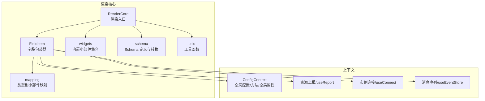
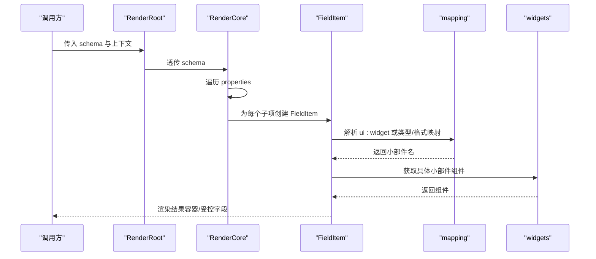
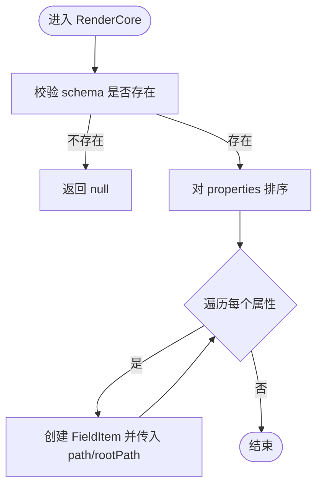
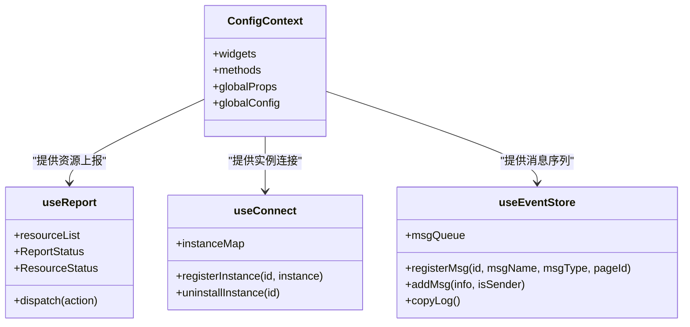
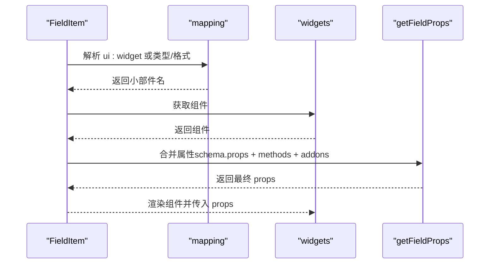
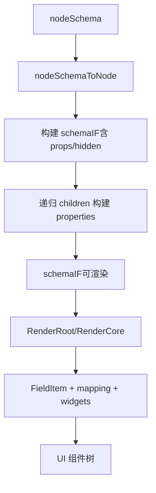
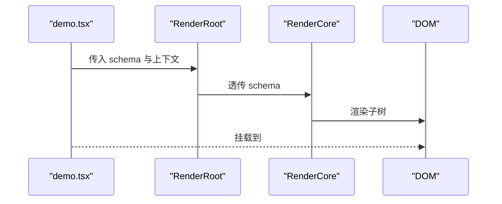
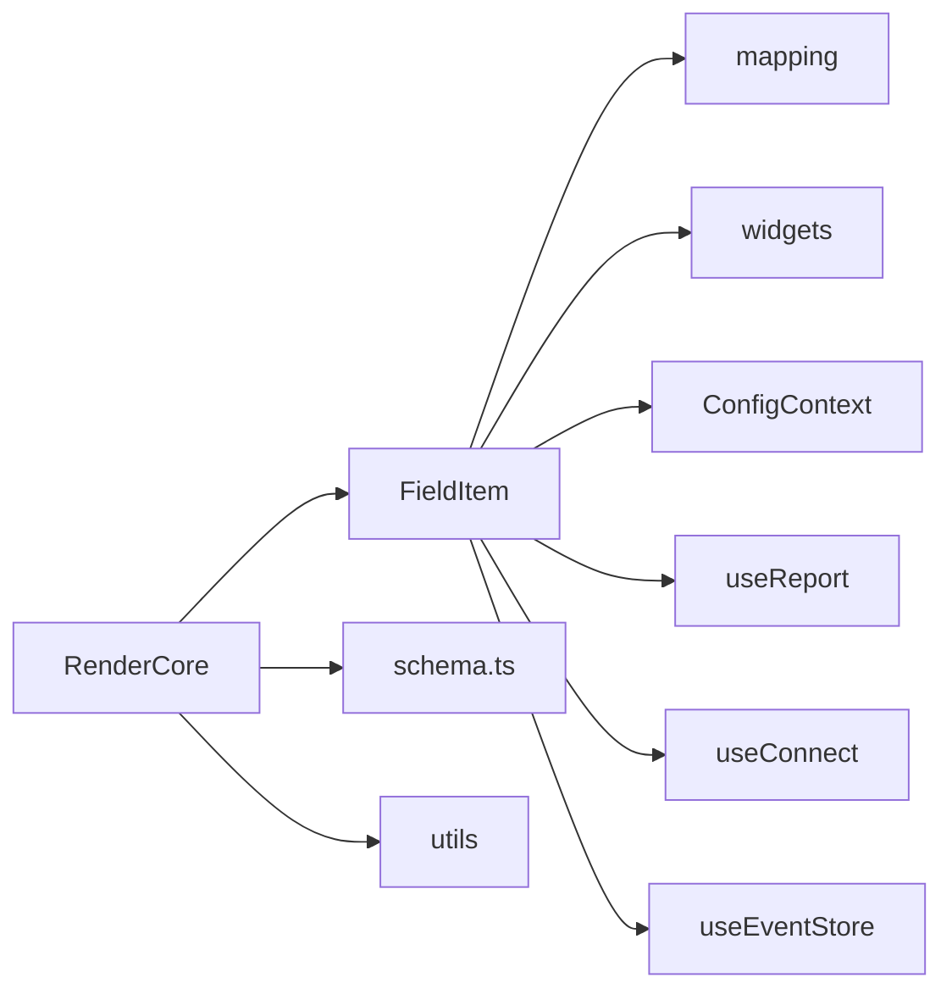

# 渲染引擎架构

<cite>
**本文引用的文件**
- [common/render-core/index.tsx](file://common/render-core/index.tsx)
- [common/render-core/models/context.ts](file://common/render-core/models/context.ts)
- [common/render-core/FieldItem/index.tsx](file://common/render-core/FieldItem/index.tsx)
- [common/render-core/FieldItem/module.tsx](file://common/render-core/FieldItem/module.tsx)
- [common/render-core/models/mapping.ts](file://common/render-core/models/mapping.ts)
- [common/render-core/widgets/index.tsx](file://common/render-core/widgets/index.tsx)
- [common/render-core/schema.ts](file://common/render-core/schema.ts)
- [common/render-core/utils/index.ts](file://common/render-core/utils/index.ts)
- [common/render-core/demo.tsx](file://common/render-core/demo.tsx)
- [common/render-context/src/index.ts](file://common/render-context/src/index.ts)
</cite>

## 目录
1. [引言](#引言)
2. [项目结构](#项目结构)
3. [核心组件](#核心组件)
4. [架构总览](#架构总览)
5. [详细组件分析](#详细组件分析)
6. [依赖关系分析](#依赖关系分析)
7. [性能考量](#性能考量)
8. [故障排查指南](#故障排查指南)
9. [结论](#结论)
10. [附录](#附录)

## 引言
本文件面向 Slides Engine 的渲染引擎，系统性阐述渲染核心（RenderCore）的设计与实现，涵盖组件渲染管线、生命周期与状态管理、性能优化策略；渲染上下文（RenderContext）的状态传递、主题与配置管理；组件系统的设计模式（注册、属性绑定、事件处理）；JSON Schema 到 UI 组件的转换流程与渲染优化；初始化流程、组件挂载与卸载机制；以及扩展接口与自定义组件开发指南。目标是帮助开发者快速理解并高效扩展渲染引擎。

## 项目结构
渲染引擎位于 common/render-core，采用“模型-视图-上下文”分层组织：
- 视图层：RenderCore、FieldItem、内置小部件集合
- 模型层：Schema 定义与转换、映射规则、排序与路径计算
- 上下文层：全局配置、资源上报、实例连接、消息序列等

图表来源
- [common/render-core/index.tsx:52-65](file://common/render-core/index.tsx#L52-L65)
- [common/render-core/FieldItem/index.tsx:7-61](file://common/render-core/FieldItem/index.tsx#L7-L61)
- [common/render-core/widgets/index.tsx:8-130](file://common/render-core/widgets/index.tsx#L8-L130)
- [common/render-core/models/mapping.ts:42-91](file://common/render-core/models/mapping.ts#L42-L91)
- [common/render-core/schema.ts:123-145](file://common/render-core/schema.ts#L123-L145)
- [common/render-core/utils/index.ts:1-40](file://common/render-core/utils/index.ts#L1-L40)

章节来源
- [common/render-core/index.tsx:1-76](file://common/render-core/index.tsx#L1-L76)
- [common/render-core/schema.ts:1-145](file://common/render-core/schema.ts#L1-L145)

## 核心组件
- 渲染入口与树遍历
  - RenderCore：接收顶层 schema，按序遍历 properties，生成 FieldItem 子树
  - RenderRoot：通过 withProvider 包裹，注入 widgets、methods、globalProps、globalConfig
- 字段渲染器
  - FieldItem：根据 schema 决定渲染容器或受控字段，负责属性拼装、错误回退、子树渲染
- 小部件与映射
  - widgets：内置小部件集合，含错误边界封装
  - mapping：类型/格式到小部件名的映射规则
- 上下文与状态
  - ConfigContext：全局配置、方法、全局属性、全局配置
  - useReport/useConnect/useEventStore：资源上报、实例连接、消息序列
- 工具与 Schema
  - getPath/getFieldProps：路径计算与字段属性合并
  - schema.ts：示例 Schema 与 nodeSchema 到 schema 的转换

章节来源
- [common/render-core/index.tsx:52-76](file://common/render-core/index.tsx#L52-L76)
- [common/render-core/FieldItem/index.tsx:7-61](file://common/render-core/FieldItem/index.tsx#L7-L61)
- [common/render-core/widgets/index.tsx:8-130](file://common/render-core/widgets/index.tsx#L8-L130)
- [common/render-core/models/context.ts:5-226](file://common/render-core/models/context.ts#L5-L226)
- [common/render-core/FieldItem/module.tsx:52-109](file://common/render-core/FieldItem/module.tsx#L52-L109)
- [common/render-core/models/mapping.ts:42-91](file://common/render-core/models/mapping.ts#L42-L91)
- [common/render-core/schema.ts:123-145](file://common/render-core/schema.ts#L123-L145)

## 架构总览
渲染引擎采用“Schema 驱动”的声明式渲染范式：
- 输入：JSON Schema（含 ui:widget、props、properties、type/format 等）
- 映射：mapping 将类型/格式映射到具体小部件
- 渲染：FieldItem 负责属性拼装与渲染，支持容器组件与受控字段
- 上下文：ConfigContext 提供 widgets/methods/globalProps/globalConfig；useReport/useConnect/useEventStore 提供跨组件协作能力
- 输出：React 组件树，最终挂载到 DOM

图表来源
- [common/render-core/index.tsx:52-65](file://common/render-core/index.tsx#L52-L65)
- [common/render-core/FieldItem/index.tsx:7-61](file://common/render-core/FieldItem/index.tsx#L7-L61)
- [common/render-core/models/mapping.ts:42-91](file://common/render-core/models/mapping.ts#L42-L91)
- [common/render-core/widgets/index.tsx:8-130](file://common/render-core/widgets/index.tsx#L8-L130)

## 详细组件分析

### 渲染核心（RenderCore）
- 设计要点
  - 递归遍历 schema.properties，维护 path 与 rootPath，保证定位准确
  - 使用 sortProperties 对属性进行稳定排序，提升一致性
  - 通过 FieldItem 统一处理容器与受控字段，隐藏复杂度
- 生命周期与挂载
  - RenderCore 仅负责渲染，不持有状态；实际状态由上下文与小部件内部状态管理
  - 卸载：当 schema 为空或移除时，返回 null，React 自动卸载子树
- 性能优化
  - 使用 React.memo 包裹上层组件，减少重渲染
  - 通过 withProvider 注入全局配置，避免重复计算

图表来源
- [common/render-core/index.tsx:52-65](file://common/render-core/index.tsx#L52-L65)

章节来源
- [common/render-core/index.tsx:52-76](file://common/render-core/index.tsx#L52-L76)

### 渲染上下文（RenderContext）
- ConfigContext
  - 提供 widgets、methods、globalProps、globalConfig，供 FieldItem 与小部件使用
  - withProvider 将默认 widgets 与用户传入 widgets 合并，确保可扩展性
- 资源上报（useReport）
  - useResourceStore 维护资源列表，支持 ADD/UPDATE/REMOVE 三种动作
  - 通过 dispatch 上报资源状态变化，避免重复上报
- 实例连接（useConnect）
  - useInstanceStore 记录受控组件实例映射，支持注册/卸载
  - useConnect 仅订阅指定 id 的实例，降低无关渲染
- 消息序列（useEventStore）
  - 维护消息队列与控制器列表，支持 sender/receiver 模式
  - registerMsg 提供 notice/register 接口，用于信令同步与状态还原

图表来源
- [common/render-core/models/context.ts:5-226](file://common/render-core/models/context.ts#L5-L226)
- [common/render-core/models/withProvider.tsx:4-31](file://common/render-core/models/withProvider.tsx#L4-L31)

章节来源
- [common/render-core/models/context.ts:5-226](file://common/render-core/models/context.ts#L5-L226)
- [common/render-core/models/withProvider.tsx:4-31](file://common/render-core/models/withProvider.tsx#L4-L31)

### 组件系统设计模式
- 组件注册
  - widgets：集中注册内置小部件，统一包裹错误边界
  - RenderRoot 通过 withProvider 注入 widgets，支持扩展覆盖
- 属性绑定
  - getFieldProps：合并 schema.props、extra、methods、addons（路径信息），支持动态方法映射
  - 支持以 props 结尾的键透传，以及 addonAfter 自定义组件
- 事件处理
  - 通过 useEventStore.registerMsg 注册事件/状态处理器
  - notice 用于发送信令，register 用于接收并执行

图表来源
- [common/render-core/FieldItem/index.tsx:7-61](file://common/render-core/FieldItem/index.tsx#L7-L61)
- [common/render-core/FieldItem/module.tsx:52-109](file://common/render-core/FieldItem/module.tsx#L52-L109)
- [common/render-core/models/mapping.ts:42-91](file://common/render-core/models/mapping.ts#L42-L91)
- [common/render-core/widgets/index.tsx:8-130](file://common/render-core/widgets/index.tsx#L8-L130)

章节来源
- [common/render-core/widgets/index.tsx:8-130](file://common/render-core/widgets/index.tsx#L8-L130)
- [common/render-core/FieldItem/module.tsx:52-109](file://common/render-core/FieldItem/module.tsx#L52-L109)
- [common/render-core/models/mapping.ts:42-91](file://common/render-core/models/mapping.ts#L42-L91)

### JSON Schema 到 UI 组件的转换
- 节点 Schema 到渲染 Schema
  - nodeSchemaToNode：提取 id、ui:widget、sourceName、props、hidden
  - nodeSchemaToSchema：递归构建 properties，形成可渲染的 schemaIF
- 渲染流程
  - RenderRoot 接收 schema，RenderCore 遍历 properties
  - FieldItem 根据 mapping 选择小部件，getFieldProps 合并属性，最终渲染

图表来源
- [common/render-core/schema.ts:123-145](file://common/render-core/schema.ts#L123-L145)
- [common/render-core/index.tsx:52-65](file://common/render-core/index.tsx#L52-L65)

章节来源
- [common/render-core/schema.ts:123-145](file://common/render-core/schema.ts#L123-L145)

### 初始化流程、挂载与卸载
- 初始化
  - 创建 RenderRoot，注入 widgets/methods/globalProps/globalConfig
  - 示例中通过 demo.tsx 传入 schema 并挂载到 DOM
- 挂载
  - RenderRoot 渲染 RenderCore，后者遍历 schema.properties 逐项渲染
- 卸载
  - 当 schema 为空或移除时，RenderCore 返回 null，React 卸载子树

图表来源
- [common/render-core/demo.tsx:14-30](file://common/render-core/demo.tsx#L14-L30)
- [common/render-core/index.tsx:67-67](file://common/render-core/index.tsx#L67-L67)

章节来源
- [common/render-core/demo.tsx:14-30](file://common/render-core/demo.tsx#L14-L30)
- [common/render-core/index.tsx:67-67](file://common/render-core/index.tsx#L67-L67)

### 扩展接口与自定义组件开发指南
- 自定义小部件
  - 在 widgets 中新增键值对，键为小部件名，值为 React 组件
  - RenderRoot 会自动注入内置 widgets，并允许通过传入 widgets 覆盖
- 动态方法映射
  - 在 schema.methods 中以键名映射到 methods 中的具体函数，getFieldProps 会自动解析
- 全局配置与主题
  - 通过 globalProps/globalConfig 注入全局属性与配置，小部件可读取
- 错误边界
  - 内置小部件已包裹错误边界，建议自定义组件也遵循此模式
- 路径与附加信息
  - addons 中包含 dataIndex/dataPath/schemaPath 等，便于定位与调试

章节来源
- [common/render-core/widgets/index.tsx:8-130](file://common/render-core/widgets/index.tsx#L8-L130)
- [common/render-core/FieldItem/module.tsx:52-109](file://common/render-core/FieldItem/module.tsx#L52-L109)
- [common/render-core/models/withProvider.tsx:4-31](file://common/render-core/models/withProvider.tsx#L4-L31)

## 依赖关系分析
- 组件耦合
  - RenderCore 与 FieldItem 强关联，通过 props 传递路径与 schema
  - FieldItem 依赖 mapping 与 widgets，间接依赖 ConfigContext
  - 上下文模块提供 useReport/useConnect/useEventStore，被 FieldItem 复用
- 外部依赖
  - hox：提供全局 store 与订阅机制
  - react-error-boundary：为小部件提供错误边界

图表来源
- [common/render-core/index.tsx:52-65](file://common/render-core/index.tsx#L52-L65)
- [common/render-core/FieldItem/index.tsx:7-61](file://common/render-core/FieldItem/index.tsx#L7-L61)
- [common/render-core/models/context.ts:5-226](file://common/render-core/models/context.ts#L5-L226)

章节来源
- [common/render-core/index.tsx:52-65](file://common/render-core/index.tsx#L52-L65)
- [common/render-core/FieldItem/index.tsx:7-61](file://common/render-core/FieldItem/index.tsx#L7-L61)
- [common/render-core/models/context.ts:5-226](file://common/render-core/models/context.ts#L5-L226)

## 性能考量
- 渲染优化
  - 使用 React.memo 包裹上层组件，减少不必要的重渲染
  - RenderCore 仅做遍历与分发，避免在渲染阶段做昂贵计算
- 状态管理
  - useReport/useConnect/useEventStore 通过局部 store 与订阅机制，避免全局抖动
  - useConnect 仅订阅指定 id，降低无关渲染
- 资源与消息
  - 资源上报去重（相同资源不重复上报）
  - 消息序列缓存与控制器注册，避免重复绑定

章节来源
- [common/render-core/utils/index.ts:1-40](file://common/render-core/utils/index.ts#L1-L40)
- [common/render-core/models/context.ts:60-93](file://common/render-core/models/context.ts#L60-L93)
- [common/render-core/models/context.ts:158-225](file://common/render-core/models/context.ts#L158-L225)

## 故障排查指南
- 组件未渲染
  - 检查 schema 是否为空或 properties 是否存在
  - 确认 ui:widget 是否正确或类型/格式是否匹配 mapping
- 属性未生效
  - 确认 schema.props 与 globalProps 的键是否以 props 结尾会被透传
  - 检查 addons（dataIndex/dataPath/schemaPath）是否符合预期
- 事件/状态不同步
  - 确认 registerMsg 的 id/msgName/msgType/pageId 是否一致
  - 检查消息序列缓存与控制器注册是否成功
- 资源上报异常
  - 检查资源标识（componentId/pageId）是否唯一
  - 确认 dispatch 的动作类型（ADD/UPDATE/REMOVE）

章节来源
- [common/render-core/FieldItem/index.tsx:12-20](file://common/render-core/FieldItem/index.tsx#L12-L20)
- [common/render-core/FieldItem/module.tsx:69-106](file://common/render-core/FieldItem/module.tsx#L69-L106)
- [common/render-core/models/context.ts:158-225](file://common/render-core/models/context.ts#L158-L225)
- [common/render-core/models/context.ts:60-93](file://common/render-core/models/context.ts#L60-L93)

## 结论
该渲染引擎以 Schema 为核心，结合映射与上下文，实现了高扩展性的组件渲染体系。通过 RenderCore 的简洁遍历、FieldItem 的统一属性拼装与错误回退、以及上下文提供的资源上报、实例连接与消息序列，满足了复杂课件场景下的渲染需求。配合性能优化与扩展接口，开发者可快速构建自定义组件并集成到现有流程中。

## 附录
- 渲染上下文（RenderContext）补充
  - GlobalPropContext/SlideInfoContext/SizeContext：用于主题与尺寸等全局信息传递
  - 建议在业务侧通过 Provider 包裹应用根节点，确保上下文可用

章节来源
- [common/render-context/src/index.ts:1-25](file://common/render-context/src/index.ts#L1-L25)