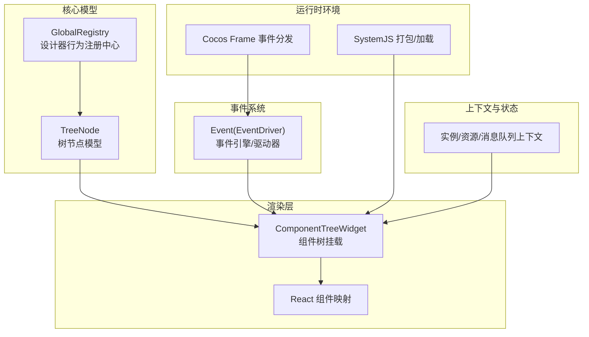
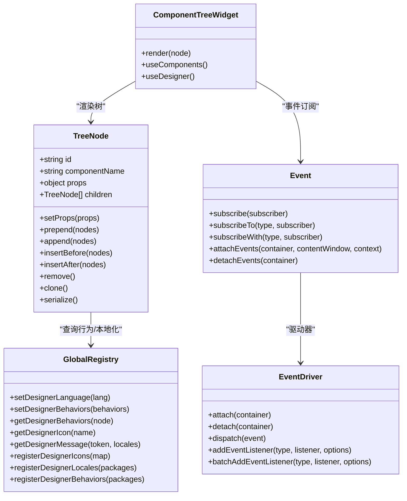
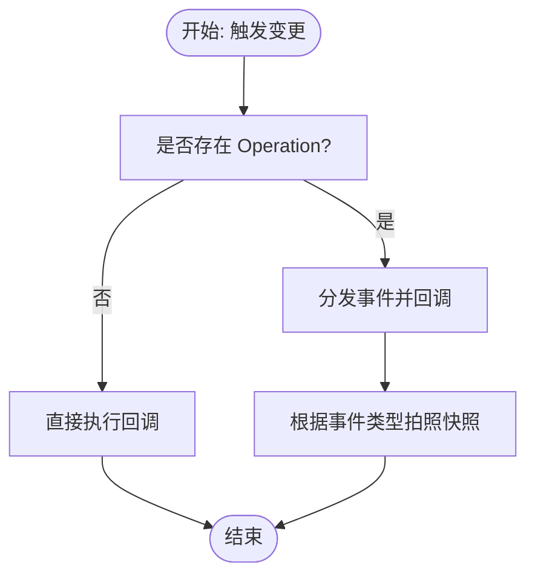
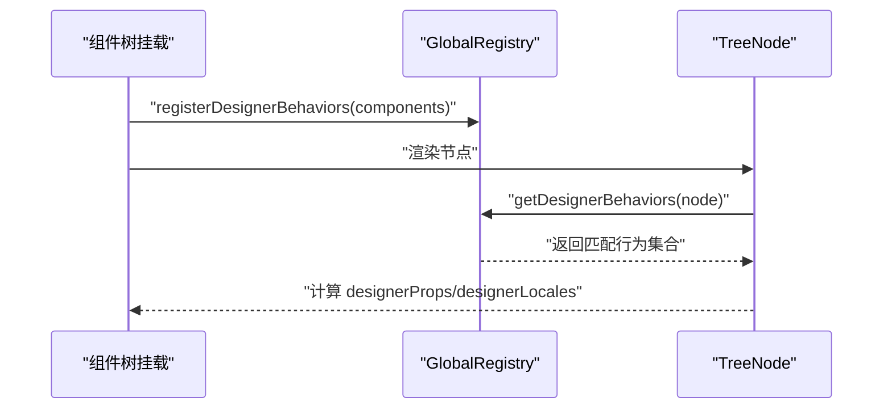
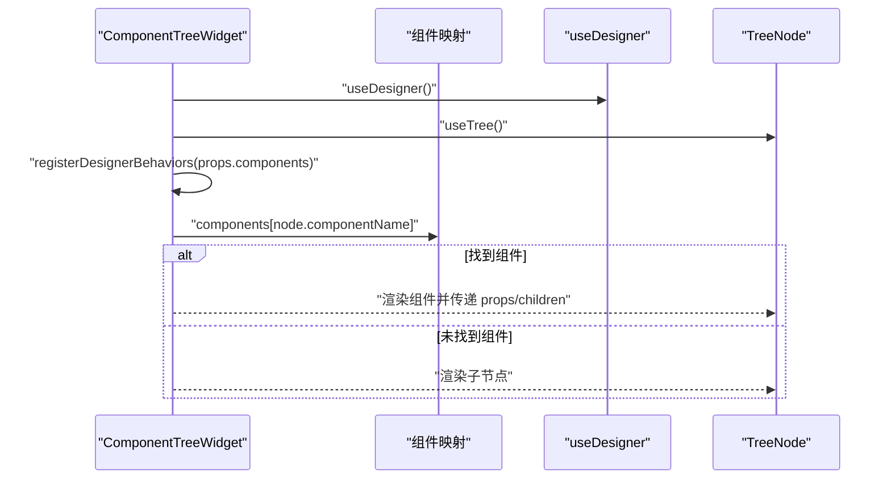
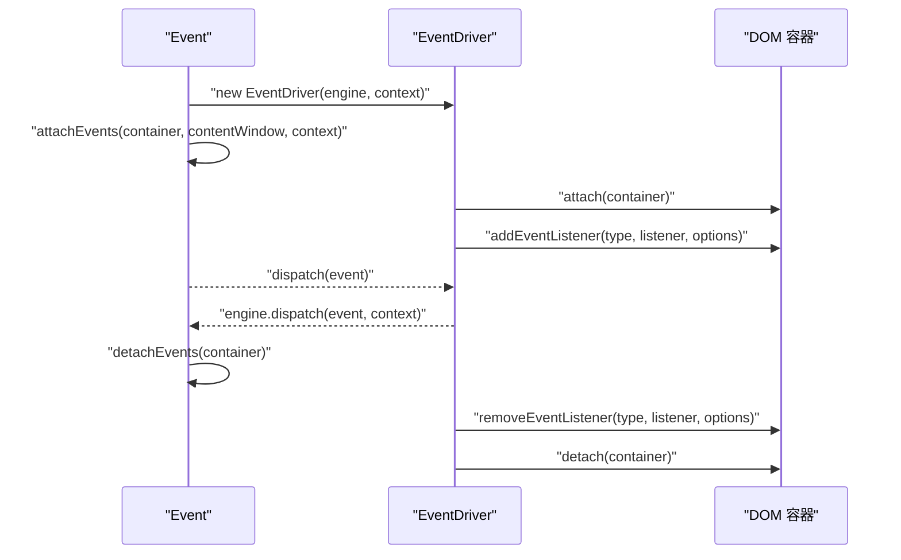
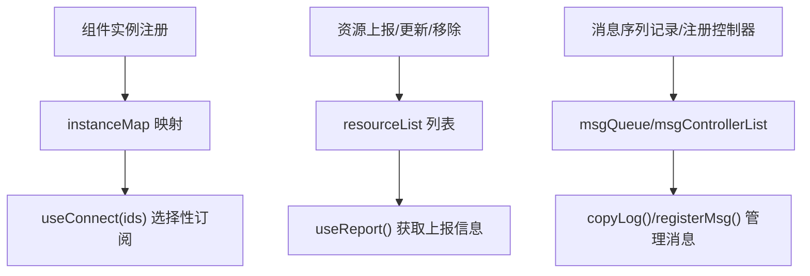
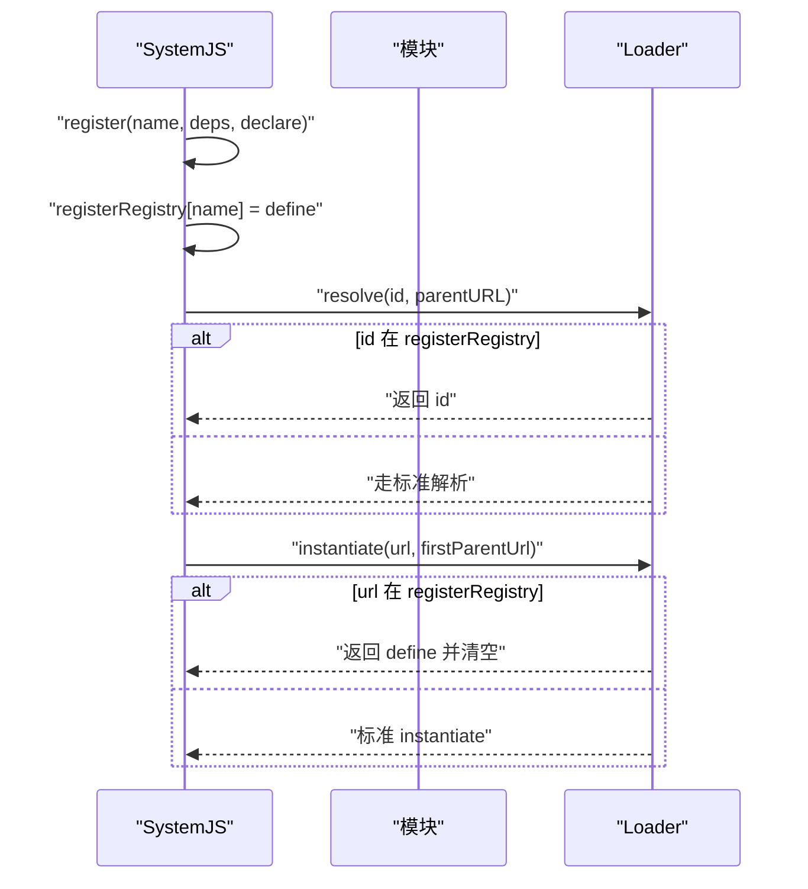
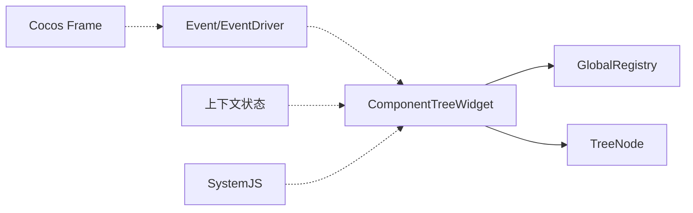

# 组件系统设计

<cite>
**本文引用的文件**
- [packages/core/src/models/TreeNode.ts](file://packages/core/src/models/TreeNode.ts)
- [packages/core/src/registry.ts](file://packages/core/src/registry.ts)
- [packages/react/src/widgets/ComponentTreeWidget/index.tsx](file://packages/react/src/widgets/ComponentTreeWidget/index.tsx)
- [packages/shared/src/event.ts](file://packages/shared/src/event.ts)
- [common/render-core/models/context.ts](file://common/render-core/models/context.ts)
- [bridge/cocos-game-player/src/system.bundle.js](file://bridge/cocos-game-player/src/system.bundle.js)
- [bridge/cocos-game-player/assets/frame/index.js](file://bridge/cocos-game-player/assets/frame/index.js)
- [packages/react/src/hooks/useRegistry.ts](file://packages/react/src/hooks/useRegistry.ts)
</cite>

## 目录
1. [引言](#引言)
2. [项目结构](#项目结构)
3. [核心组件](#核心组件)
4. [架构总览](#架构总览)
5. [详细组件分析](#详细组件分析)
6. [依赖关系分析](#依赖关系分析)
7. [性能考量](#性能考量)
8. [故障排查指南](#故障排查指南)
9. [结论](#结论)
10. [附录](#附录)

## 引言
本文件面向 Slides Engine 的组件系统，系统性阐述其设计理念、架构模式、组件分类与层次结构、注册与动态加载机制、组件间通信方式、生命周期与状态同步、扩展接口与自定义组件开发指南，以及性能优化策略与最佳实践。目标是帮助开发者快速理解并高效使用与扩展该组件体系。

## 项目结构
Slides Engine 的组件系统由“树形节点模型 + 设计器行为注册中心 + React 渲染挂载 + 全局事件总线 + 资源与实例上下文”构成，形成“数据驱动 + 行为插拔 + 事件驱动”的整体架构。

图表来源
- [packages/core/src/models/TreeNode.ts:105-169](file://packages/core/src/models/TreeNode.ts#L105-L169)
- [packages/core/src/registry.ts:75-190](file://packages/core/src/registry.ts#L75-L190)
- [packages/react/src/widgets/ComponentTreeWidget/index.tsx:35-88](file://packages/react/src/widgets/ComponentTreeWidget/index.tsx#L35-L88)
- [packages/shared/src/event.ts:103-278](file://packages/shared/src/event.ts#L103-L278)
- [common/render-core/models/context.ts:95-140](file://common/render-core/models/context.ts#L95-L140)
- [bridge/cocos-game-player/src/system.bundle.js:1053-1118](file://bridge/cocos-game-player/src/system.bundle.js#L1053-L1118)
- [bridge/cocos-game-player/assets/frame/index.js:1579-1620](file://bridge/cocos-game-player/assets/frame/index.js#L1579-L1620)

章节来源
- [packages/core/src/models/TreeNode.ts:105-169](file://packages/core/src/models/TreeNode.ts#L105-L169)
- [packages/core/src/registry.ts:75-190](file://packages/core/src/registry.ts#L75-L190)
- [packages/react/src/widgets/ComponentTreeWidget/index.tsx:35-88](file://packages/react/src/widgets/ComponentTreeWidget/index.tsx#L35-L88)
- [packages/shared/src/event.ts:103-278](file://packages/shared/src/event.ts#L103-L278)
- [common/render-core/models/context.ts:95-140](file://common/render-core/models/context.ts#L95-L140)
- [bridge/cocos-game-player/src/system.bundle.js:1053-1118](file://bridge/cocos-game-player/src/system.bundle.js#L1053-L1118)
- [bridge/cocos-game-player/assets/frame/index.js:1579-1620](file://bridge/cocos-game-player/assets/frame/index.js#L1579-L1620)

## 核心组件
- 树节点模型（TreeNode）：负责组件树的数据结构、父子关系、属性变更、拖拽/插入/删除等操作，并通过事件机制记录快照与触发变更。
- 设计器注册中心（GlobalRegistry）：集中管理设计器行为、图标、本地化文案，支持按节点 selector 动态匹配行为。
- 组件树挂载（ComponentTreeWidget）：将 TreeNode 渲染为具体 React 组件，支持自定义组件映射与设计器效果。
- 事件系统（Event/EventDriver）：提供订阅/发布、批量事件绑定、容器级事件附加/分离、驱动器模式。
- 上下文与状态（实例/资源/消息队列）：提供受控组件实例注册、资源上报、消息序列管理等全局状态。
- 运行时加载（SystemJS/Cocos Frame）：SystemJS 支持命名模块注册与解析；Cocos Frame 提供组件事件分发。

章节来源
- [packages/core/src/models/TreeNode.ts:105-169](file://packages/core/src/models/TreeNode.ts#L105-L169)
- [packages/core/src/registry.ts:75-190](file://packages/core/src/registry.ts#L75-L190)
- [packages/react/src/widgets/ComponentTreeWidget/index.tsx:35-88](file://packages/react/src/widgets/ComponentTreeWidget/index.tsx#L35-L88)
- [packages/shared/src/event.ts:103-278](file://packages/shared/src/event.ts#L103-L278)
- [common/render-core/models/context.ts:95-140](file://common/render-core/models/context.ts#L95-L140)
- [bridge/cocos-game-player/src/system.bundle.js:1053-1118](file://bridge/cocos-game-player/src/system.bundle.js#L1053-L1118)
- [bridge/cocos-game-player/assets/frame/index.js:1579-1620](file://bridge/cocos-game-player/assets/frame/index.js#L1579-L1620)

## 架构总览
组件系统采用“数据模型 + 渲染挂载 + 事件驱动 + 上下文状态 + 运行时加载”的分层架构：
- 数据层：TreeNode 提供树结构与操作，配合事件记录快照，确保可回溯与可编辑。
- 插件层：GlobalRegistry 以行为（Behavior）为单位扩展节点能力，按 selector 匹配生效。
- 渲染层：ComponentTreeWidget 将节点映射为 React 组件，支持自渲染与默认渲染。
- 事件层：Event/EventDriver 提供跨容器、跨组件的事件订阅与派发。
- 上下文层：实例/资源/消息队列上下文支撑组件间状态共享与消息同步。
- 加载层：SystemJS 与 Cocos Frame 提供模块注册与事件分发，支持动态加载与运行时事件。

图表来源
- [packages/core/src/models/TreeNode.ts:503-721](file://packages/core/src/models/TreeNode.ts#L503-L721)
- [packages/core/src/registry.ts:109-152](file://packages/core/src/registry.ts#L109-L152)
- [packages/react/src/widgets/ComponentTreeWidget/index.tsx:35-88](file://packages/react/src/widgets/ComponentTreeWidget/index.tsx#L35-L88)
- [packages/shared/src/event.ts:282-379](file://packages/shared/src/event.ts#L282-L379)

章节来源
- [packages/core/src/models/TreeNode.ts:503-721](file://packages/core/src/models/TreeNode.ts#L503-L721)
- [packages/core/src/registry.ts:109-152](file://packages/core/src/registry.ts#L109-L152)
- [packages/react/src/widgets/ComponentTreeWidget/index.tsx:35-88](file://packages/react/src/widgets/ComponentTreeWidget/index.tsx#L35-L88)
- [packages/shared/src/event.ts:282-379](file://packages/shared/src/event.ts#L282-L379)

## 详细组件分析

### 树节点模型（TreeNode）
- 职责与特性
  - 维护组件树结构（父子、兄弟、祖先/后代关系）。
  - 提供属性更新、插入/追加/前置/后置、删除、克隆、序列化等操作。
  - 通过事件机制记录变更并触发快照，支持撤销/重做。
  - 计算属性（designerProps/designerLocales）基于 GlobalRegistry 的行为组合。
- 关键实现要点
  - 使用可观察属性与动作，保证响应式与可追踪。
  - resetNodesParent/clone 等方法确保跨父节点移动时的树一致性。
  - triggerMutation 封装变更与快照逻辑，统一入口。
- 复杂度与性能
  - 常见操作（插入/删除/查找）时间复杂度与树深度/子节点数量相关，建议在批量操作时合并变更以减少重渲染。

图表来源
- [packages/core/src/models/TreeNode.ts:344-352](file://packages/core/src/models/TreeNode.ts#L344-L352)

章节来源
- [packages/core/src/models/TreeNode.ts:105-169](file://packages/core/src/models/TreeNode.ts#L105-L169)
- [packages/core/src/models/TreeNode.ts:503-721](file://packages/core/src/models/TreeNode.ts#L503-L721)

### 设计器注册中心（GlobalRegistry）
- 职责与特性
  - 管理设计器语言、图标、本地化文案。
  - 以行为（Behavior）为单位扩展节点能力，支持依赖排序与 selector 匹配。
  - 提供 getDesignerMessage/getDesignerIcon/getDesignerBehaviors 等查询接口。
- 关键实现要点
  - reSortBehaviors 对行为进行依赖解析与排序，确保继承链正确。
  - registerDesignerBehaviors 支持多包注册并合并结果。
- 扩展建议
  - 新增行为时，明确 selector 与 extends 依赖，避免循环依赖。
  - 本地化文案按语言键组织，便于多语言切换。

图表来源
- [packages/core/src/registry.ts:177-185](file://packages/core/src/registry.ts#L177-L185)
- [packages/react/src/widgets/ComponentTreeWidget/index.tsx:99-101](file://packages/react/src/widgets/ComponentTreeWidget/index.tsx#L99-L101)
- [packages/core/src/models/TreeNode.ts:171-192](file://packages/core/src/models/TreeNode.ts#L171-L192)

章节来源
- [packages/core/src/registry.ts:75-190](file://packages/core/src/registry.ts#L75-L190)
- [packages/react/src/widgets/ComponentTreeWidget/index.tsx:99-101](file://packages/react/src/widgets/ComponentTreeWidget/index.tsx#L99-L101)
- [packages/core/src/models/TreeNode.ts:171-192](file://packages/core/src/models/TreeNode.ts#L171-L192)

### 组件树挂载（ComponentTreeWidget）
- 职责与特性
  - 将 TreeNode 渲染为具体 React 组件，支持自渲染与默认渲染。
  - 通过 useComponents/useDesigner/useTree 等 Hook 获取上下文与组件映射。
  - 在首次挂载时注册设计器行为，确保后续节点渲染具备行为能力。
- 关键实现要点
  - 组件映射 components[componentName] 决定实际渲染的 React 组件。
  - dataId 注入节点 ID，便于设计器交互与定位。
  - defaultComposer 合并默认属性、节点行为属性与当前 props。

图表来源
- [packages/react/src/widgets/ComponentTreeWidget/index.tsx:35-88](file://packages/react/src/widgets/ComponentTreeWidget/index.tsx#L35-L88)
- [packages/react/src/widgets/ComponentTreeWidget/index.tsx:99-101](file://packages/react/src/widgets/ComponentTreeWidget/index.tsx#L99-L101)

章节来源
- [packages/react/src/widgets/ComponentTreeWidget/index.tsx:35-88](file://packages/react/src/widgets/ComponentTreeWidget/index.tsx#L35-L88)
- [packages/react/src/widgets/ComponentTreeWidget/index.tsx:99-101](file://packages/react/src/widgets/ComponentTreeWidget/index.tsx#L99-L101)

### 事件系统（Event/EventDriver）
- 职责与特性
  - 提供订阅/发布、按类型/类订阅、批量事件绑定/解绑、容器级事件附加/分离。
  - EventDriver 支持 attach/detach、addEventListener/removeEventListener、onlyOne/onlyChild/onlyParent 等模式。
- 关键实现要点
  - 通过 DRIVER_INSTANCES_SYMBOL 维护驱动器实例，支持批量事件管理。
  - EVENTS_SYMBOL/EVENTS_ONCE_SYMBOL/EVENTS_BATCH_SYMBOL 三套符号表管理不同事件模式。
  - attachEvents/detachEvents 支持对 Window/Document/Element 容器进行事件绑定与清理。

图表来源
- [packages/shared/src/event.ts:103-278](file://packages/shared/src/event.ts#L103-L278)
- [packages/shared/src/event.ts:282-379](file://packages/shared/src/event.ts#L282-L379)

章节来源
- [packages/shared/src/event.ts:103-278](file://packages/shared/src/event.ts#L103-L278)
- [packages/shared/src/event.ts:282-379](file://packages/shared/src/event.ts#L282-L379)

### 上下文与状态（实例/资源/消息队列）
- 职责与特性
  - 实例上下文：注册/卸载受控组件实例，提供 useConnect 优化订阅。
  - 资源上下文：资源上报、更新、移除，支持页面级资源管理。
  - 消息队列上下文：消息序列记录、控制器注册、同步执行。
- 关键实现要点
  - useInstanceStore/useResourceStore/useEventStore 三个全局 store 管理不同维度的状态。
  - useConnect(ids) 仅关注指定实例，减少无关渲染。

图表来源
- [common/render-core/models/context.ts:95-140](file://common/render-core/models/context.ts#L95-L140)
- [common/render-core/models/context.ts:158-225](file://common/render-core/models/context.ts#L158-L225)

章节来源
- [common/render-core/models/context.ts:95-140](file://common/render-core/models/context.ts#L95-L140)
- [common/render-core/models/context.ts:158-225](file://common/render-core/models/context.ts#L158-L225)

### 运行时加载（SystemJS/Cocos Frame）
- 职责与特性
  - SystemJS 支持命名模块注册（registerRegistry）、解析优先级与 instantiate 流程。
  - Cocos Frame 提供组件事件分发（dispatch）与事件清理（removeAll/removeAllGameEvent）。
- 关键实现要点
  - named register 扩展：优先使用 import map 解析，否则回退到 registerRegistry。
  - getRegister 保障副作用顺序，firstNamedDefine 用于首定义标记。

图表来源
- [bridge/cocos-game-player/src/system.bundle.js:1053-1118](file://bridge/cocos-game-player/src/system.bundle.js#L1053-L1118)
- [bridge/cocos-game-player/src/system.bundle.js:395-415](file://bridge/cocos-game-player/src/system.bundle.js#L395-L415)

章节来源
- [bridge/cocos-game-player/src/system.bundle.js:1053-1118](file://bridge/cocos-game-player/src/system.bundle.js#L1053-L1118)
- [bridge/cocos-game-player/src/system.bundle.js:395-415](file://bridge/cocos-game-player/src/system.bundle.js#L395-L415)
- [bridge/cocos-game-player/assets/frame/index.js:1579-1620](file://bridge/cocos-game-player/assets/frame/index.js#L1579-L1620)

## 依赖关系分析
- 组件树挂载依赖 GlobalRegistry 查询节点行为，再将 TreeNode 渲染为 React 组件。
- 事件系统独立于渲染层，既可被渲染层订阅，也可被业务侧直接使用。
- 上下文状态与渲染层松耦合，通过 Hook 访问，避免直接依赖。
- 运行时加载与事件系统相互独立，前者负责模块解析，后者负责事件派发。

图表来源
- [packages/react/src/widgets/ComponentTreeWidget/index.tsx:35-88](file://packages/react/src/widgets/ComponentTreeWidget/index.tsx#L35-L88)
- [packages/core/src/registry.ts:109-152](file://packages/core/src/registry.ts#L109-L152)
- [packages/shared/src/event.ts:282-379](file://packages/shared/src/event.ts#L282-L379)
- [common/render-core/models/context.ts:95-140](file://common/render-core/models/context.ts#L95-L140)
- [bridge/cocos-game-player/src/system.bundle.js:1053-1118](file://bridge/cocos-game-player/src/system.bundle.js#L1053-L1118)
- [bridge/cocos-game-player/assets/frame/index.js:1579-1620](file://bridge/cocos-game-player/assets/frame/index.js#L1579-L1620)

章节来源
- [packages/react/src/widgets/ComponentTreeWidget/index.tsx:35-88](file://packages/react/src/widgets/ComponentTreeWidget/index.tsx#L35-L88)
- [packages/core/src/registry.ts:109-152](file://packages/core/src/registry.ts#L109-L152)
- [packages/shared/src/event.ts:282-379](file://packages/shared/src/event.ts#L282-L379)
- [common/render-core/models/context.ts:95-140](file://common/render-core/models/context.ts#L95-L140)
- [bridge/cocos-game-player/src/system.bundle.js:1053-1118](file://bridge/cocos-game-player/src/system.bundle.js#L1053-L1118)
- [bridge/cocos-game-player/assets/frame/index.js:1579-1620](file://bridge/cocos-game-player/assets/frame/index.js#L1579-L1620)

## 性能考量
- 渲染优化
  - 使用 useConnect(ids) 仅订阅关键实例，避免全量订阅导致的频繁重渲染。
  - 合并默认属性与节点属性，减少不必要的 props 变更。
- 树操作优化
  - 批量插入/删除时尽量复用 resetNodesParent/clone，减少重复计算。
  - 避免在高频事件中直接修改深层 props，优先使用 setProps 与事件快照。
- 事件系统优化
  - 使用 batchAddEventListener 批量绑定，减少重复 addEventListener 调用。
  - 合理使用 onlyOne/onlyChild/onlyParent 模式，避免重复监听。
- 上下文状态优化
  - 资源上报与消息队列按需访问，避免在非必要组件中引入全局状态依赖。

[本节为通用指导，无需列出章节来源]

## 故障排查指南
- 事件未触发或重复触发
  - 检查 EventDriver 的 attach/detach 是否成对调用，确认容器是否正确附加。
  - 使用 onlyOne/onlyChild/onlyParent 模式时，确认目标容器与构造函数映射一致。
- 组件不显示或渲染异常
  - 确认 ComponentTreeWidget 已在初始化时注册设计器行为。
  - 检查 components 映射中是否存在 componentName 对应的组件。
- 树节点操作无效
  - 确认操作发生在 Operation 上下文中，triggerMutation 会自动记录快照。
  - 检查 allow*（drag/append/delete 等）权限配置是否允许当前操作。
- 资源上报/消息队列异常
  - 使用 useReport/useConnect 等 Hook 精准定位状态变化。
  - 检查 msgControllerList 与 registerMsg 的配对是否正确。

章节来源
- [packages/shared/src/event.ts:141-147](file://packages/shared/src/event.ts#L141-L147)
- [packages/shared/src/event.ts:205-230](file://packages/shared/src/event.ts#L205-L230)
- [packages/react/src/widgets/ComponentTreeWidget/index.tsx:99-101](file://packages/react/src/widgets/ComponentTreeWidget/index.tsx#L99-L101)
- [packages/core/src/models/TreeNode.ts:344-352](file://packages/core/src/models/TreeNode.ts#L344-L352)
- [common/render-core/models/context.ts:158-225](file://common/render-core/models/context.ts#L158-L225)

## 结论
Slides Engine 的组件系统以 TreeNode 为核心，结合 GlobalRegistry 的行为扩展、ComponentTreeWidget 的渲染挂载、Event/EventDriver 的事件驱动、上下文状态与 SystemJS/Cocos Frame 的运行时支持，形成了高内聚、低耦合、可扩展的组件体系。遵循本文的扩展与优化建议，可在保证性能与稳定性的同时，快速实现复杂场景下的组件化需求。

[本节为总结性内容，无需列出章节来源]

## 附录
- 自定义组件开发步骤
  - 在组件映射中注册新组件（componentName -> React 组件）。
  - 通过 GlobalRegistry.registerDesignerBehaviors 注册行为，确保节点具备相应能力。
  - 在渲染层使用 useComponents/useDesigner 获取上下文，按需合并 props。
  - 如需事件交互，使用 Event/EventDriver 订阅/派发事件，注意容器附加与清理。
- 最佳实践清单
  - 使用 useConnect 仅订阅关键实例，减少渲染压力。
  - 批量操作时合并变更，避免频繁触发快照。
  - 合理使用事件模式（onlyOne/onlyChild/onlyParent），避免重复监听。
  - 通过上下文状态隔离资源与消息，避免全局污染。

[本节为通用指导，无需列出章节来源]