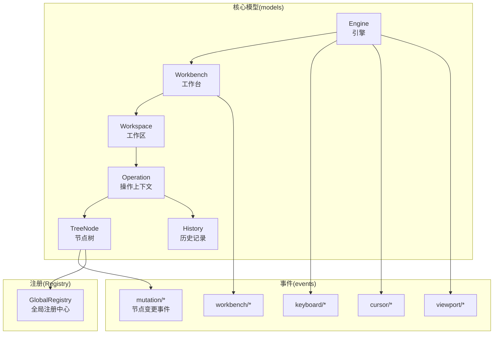
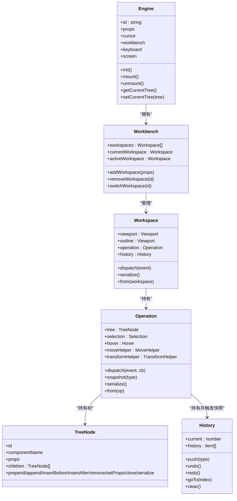
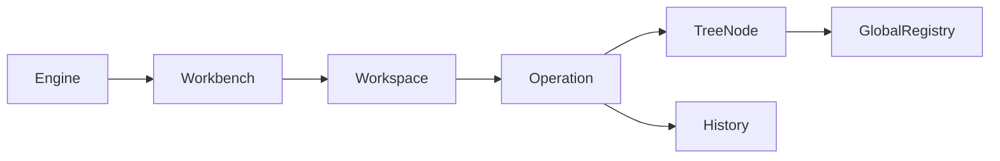

# 设计内核架构

<cite>
**本文引用的文件**
- [Engine.ts](file://packages/core/src/models/Engine.ts)
- [Workspace.ts](file://packages/core/src/models/Workspace.ts)
- [Operation.ts](file://packages/core/src/models/Operation.ts)
- [TreeNode.ts](file://packages/core/src/models/TreeNode.ts)
- [History.ts](file://packages/core/src/models/History.ts)
- [Workbench.ts](file://packages/core/src/models/Workbench.ts)
- [registry.ts](file://packages/core/src/registry.ts)
- [UpdateNodePropsEvent.ts](file://packages/core/src/events/mutation/UpdateNodePropsEvent.ts)
- [AbstractMutationNodeEvent.ts](file://packages/core/src/events/mutation/AbstractMutationNodeEvent.ts)
- [index.ts](file://packages/core/src/index.ts)
- [exports.ts](file://packages/core/src/exports.ts)
</cite>

## 目录
1. [引言](#引言)
2. [项目结构](#项目结构)
3. [核心组件](#核心组件)
4. [架构总览](#架构总览)
5. [详细组件分析](#详细组件分析)
6. [依赖关系分析](#依赖关系分析)
7. [性能考量](#性能考量)
8. [故障排查指南](#故障排查指南)
9. [结论](#结论)
10. [附录：API 使用示例路径](#附录api-使用示例路径)

## 引言
本文件面向 Slides Engine 的“设计内核”（Designable Core），系统性阐述其三层核心架构：Engine、Workspace、Operation；节点树管理（TreeNode）的创建/删除/移动/变换；撤销重做（History）机制与状态管理；组件注册与行为扩展（GlobalRegistry）；以及初始化流程、生命周期与错误处理策略。文档同时提供可直接定位到源码的路径，便于开发者快速查阅与扩展。

## 项目结构
设计内核位于 packages/core，采用按“模型/事件/注册/类型”分层组织：
- models：核心领域模型（Engine、Workspace、Operation、TreeNode、History、Workbench）
- events：事件体系（mutation、keyboard、cursor、viewport、workbench 等）
- registry：全局注册中心（行为、图标、多语言）
- types：类型定义与上下文接口
- index/exports：对外导出入口

图表来源
- [Engine.ts:13-42](file://packages/core/src/models/Engine.ts#L13-L42)
- [Workbench.ts:10-42](file://packages/core/src/models/Workbench.ts#L10-L42)
- [Workspace.ts:37-99](file://packages/core/src/models/Workspace.ts#L37-L99)
- [Operation.ts:16-62](file://packages/core/src/models/Operation.ts#L16-L62)
- [TreeNode.ts:105-169](file://packages/core/src/models/TreeNode.ts#L105-L169)
- [History.ts:21-46](file://packages/core/src/models/History.ts#L21-L46)
- [registry.ts:75-191](file://packages/core/src/registry.ts#L75-L191)

章节来源
- [exports.ts:1-5](file://packages/core/src/exports.ts#L1-L5)
- [index.ts:1-16](file://packages/core/src/index.ts#L1-L16)

## 核心组件
- Engine：顶层引擎，聚合 Workbench、Screen、Cursor、Keyboard 等子系统，负责初始化、挂载/卸载事件、桥接当前树与工作区操作。
- Workbench：工作台，管理多个 Workspace，维护当前/激活工作区，支持切换、新增、移除。
- Workspace：单个工作区，包含 Viewport/Outline、Operation、History，并将历史事件派发到 Operation。
- Operation：操作上下文，持有 TreeNode 树、Selection/Hover/MoveHelper/TransformHelper，负责调度事件与触发快照。
- TreeNode：节点树模型，提供创建/删除/插入/克隆/序列化等操作，并通过 GlobalRegistry 注入行为属性与本地化。
- History：历史栈，支持 push/undo/redo/goTo/clear，限制最大长度并避免在回放时重复触发快照。
- GlobalRegistry：全局注册中心，集中管理行为（Behaviors）、图标、多语言，按节点 selector 动态组合行为。

章节来源
- [Engine.ts:13-111](file://packages/core/src/models/Engine.ts#L13-L111)
- [Workbench.ts:10-122](file://packages/core/src/models/Workbench.ts#L10-L122)
- [Workspace.ts:37-146](file://packages/core/src/models/Workspace.ts#L37-L146)
- [Operation.ts:16-99](file://packages/core/src/models/Operation.ts#L16-L99)
- [TreeNode.ts:105-910](file://packages/core/src/models/TreeNode.ts#L105-L910)
- [History.ts:21-126](file://packages/core/src/models/History.ts#L21-L126)
- [registry.ts:75-191](file://packages/core/src/registry.ts#L75-L191)

## 架构总览
设计内核采用“引擎-工作台-工作区-操作上下文”的分层，配合事件驱动与快照机制实现节点树的可追踪变更与撤销重做。

图表来源
- [Engine.ts:13-42](file://packages/core/src/models/Engine.ts#L13-L42)
- [Workbench.ts:10-42](file://packages/core/src/models/Workbench.ts#L10-L42)
- [Workspace.ts:37-99](file://packages/core/src/models/Workspace.ts#L37-L99)
- [Operation.ts:16-62](file://packages/core/src/models/Operation.ts#L16-L62)
- [TreeNode.ts:105-169](file://packages/core/src/models/TreeNode.ts#L105-L169)
- [History.ts:21-46](file://packages/core/src/models/History.ts#L21-L46)

## 详细组件分析

### Engine：引擎与生命周期
- 职责：初始化 Workbench/Screen/Cursor/Keyboard；提供当前树访问；统一挂载/卸载事件；暴露默认属性（如节点/屏幕相关属性名）。
- 生命周期：构造后调用 init 完成子系统装配；mount/unmount 分别绑定/解绑全局事件。
- 与 Workspace/Operation 的交互：setCurrentTree/getCurrentTree 借助当前工作区的 operation.tree 实现。

章节来源
- [Engine.ts:13-111](file://packages/core/src/models/Engine.ts#L13-L111)

### Workbench：工作台与工作区编排
- 职责：维护工作区列表、当前工作区、激活工作区；提供新增/移除/切换；派发工作区事件。
- 与 Engine 的交互：通过 Engine 的事件分发机制传播工作区变更。

章节来源
- [Workbench.ts:10-122](file://packages/core/src/models/Workbench.ts#L10-L122)

### Workspace：视口、历史与上下文
- 职责：构建 Viewport/Outline；创建 Operation 与 History；将历史事件转换为 Operation 事件（如 HistoryPush/Undo/Redo/Goto）。
- 序列化/反序列化：serialize/from 将 Operation 的树与选择状态持久化/恢复。

章节来源
- [Workspace.ts:37-146](file://packages/core/src/models/Workspace.ts#L37-L146)

### Operation：操作上下文与快照
- 职责：构建根 TreeNode、Selection/Hover/MoveHelper/TransformHelper；统一调度事件；在合适时机触发快照（requestIdle 防抖）。
- 与 History 的协作：snapshot 将变更推入历史栈；dispatch 支持回调与短路。

章节来源
- [Operation.ts:16-99](file://packages/core/src/models/Operation.ts#L16-L99)

### TreeNode：节点树管理与行为注入
- 节点操作：prepend/append/insertBefore/insertAfter/insertChildren/setChildren/remove/clone/setProps/serialize 等。
- 行为注入：通过 GlobalRegistry.getDesignerBehaviors 动态合并 designerProps 与 designerLocales；支持拖拽/缩放/旋转/圆角/平移等能力判定。
- 元素查询：getElement/getValidElementRect 等基于 viewport/outline 查询 DOM 元素与矩形。
- 快照触发：triggerMutation 在事件前后自动触发 takeSnapshot，确保变更可回溯。

章节来源
- [TreeNode.ts:105-910](file://packages/core/src/models/TreeNode.ts#L105-L910)
- [registry.ts:109-113](file://packages/core/src/registry.ts#L109-L113)

### History：撤销重做与状态管理
- 结构：HistoryItem 包含 data（序列化后的上下文）、type、timestamp；current 指向当前位置。
- 机制：push 截断后续历史并截断；undo/redo 通过 context.from/serialize 实现状态回放；goTo 支持跳转任意历史点；clear 清空。
- 保护：locking 防止回放期间再次触发快照；maxSize 控制内存占用。

章节来源
- [History.ts:21-126](file://packages/core/src/models/History.ts#L21-L126)
- [Workspace.ts:82-98](file://packages/core/src/models/Workspace.ts#L82-L98)

### 事件系统与节点变更
- 事件基类：AbstractMutationNodeEvent 提供 source/target/originSourceParents 等标准字段。
- 示例事件：UpdateNodePropsEvent、PrependNodeEvent、AppendNodeEvent、RemoveNodeEvent、WrapNodeEvent 等。
- 触发链路：TreeNode.triggerMutation -> Operation.dispatch -> History.push（由 Operation.snapshot 防抖触发）。

章节来源
- [AbstractMutationNodeEvent.ts:15-22](file://packages/core/src/events/mutation/AbstractMutationNodeEvent.ts#L15-L22)
- [UpdateNodePropsEvent.ts:4-9](file://packages/core/src/events/mutation/UpdateNodePropsEvent.ts#L4-L9)
- [TreeNode.ts:344-352](file://packages/core/src/models/TreeNode.ts#L344-L352)
- [Operation.ts:64-67](file://packages/core/src/models/Operation.ts#L64-L67)

### 初始化流程与对外导出
- 导出入口：exports.ts 统一导出 externals/registry/models/events/types。
- 浏览器挂载：index.ts 将 Core 暴露到全局命名空间，便于外部集成。

章节来源
- [exports.ts:1-5](file://packages/core/src/exports.ts#L1-L5)
- [index.ts:1-16](file://packages/core/src/index.ts#L1-L16)

## 依赖关系分析
- Engine 依赖 Workbench/Screen/Cursor/Keyboard；Workbench 依赖 Workspace；Workspace 依赖 Operation/History；Operation 依赖 TreeNode/Selection/Hover/MoveHelper/TransformHelper；TreeNode 依赖 GlobalRegistry。
- 事件通过 Operation/Engine 分发，History 作为上下文被 History 事件回调消费。

图表来源
- [Engine.ts:13-42](file://packages/core/src/models/Engine.ts#L13-L42)
- [Workbench.ts:10-42](file://packages/core/src/models/Workbench.ts#L10-L42)
- [Workspace.ts:37-99](file://packages/core/src/models/Workspace.ts#L37-L99)
- [Operation.ts:16-62](file://packages/core/src/models/Operation.ts#L16-L62)
- [TreeNode.ts:105-169](file://packages/core/src/models/TreeNode.ts#L105-L169)
- [registry.ts:75-191](file://packages/core/src/registry.ts#L75-L191)

## 性能考量
- 快照防抖：Operation.snapshot 使用 requestIdle 防抖，减少频繁历史推入导致的开销。
- 历史上限：History.maxSize 限制内存占用，超出时裁剪历史头段并调整 current。
- 观测与浅层：TreeNode/History 对关键字段进行 observable/shallow 处理，降低响应式更新成本。
- 事件短路：Operation.dispatch 返回 false 可阻止后续处理，避免无效计算。

章节来源
- [Operation.ts:69-80](file://packages/core/src/models/Operation.ts#L69-L80)
- [History.ts:27-68](file://packages/core/src/models/History.ts#L27-L68)
- [TreeNode.ts:152-169](file://packages/core/src/models/TreeNode.ts#L152-L169)

## 故障排查指南
- 无法撤销/重做：检查 History.allowUndo/allowRedo 条件与 locking 状态；确认事件是否正确触发 snapshot。
- 事件未生效：确认事件已通过 Operation.dispatch 正常分发；检查回调是否提前返回。
- 节点不可拖拽/放置：检查 TreeNode.allowDrag/allowDrop/allowAppend 与 designerProps 的配置；确认拖拽节点过滤逻辑。
- 回放异常：History.goTo/undo/redo 会设置 locking，避免回放期间再次触发快照；若出现状态错乱，检查自定义行为对 serialize/from 的实现。

章节来源
- [History.ts:74-106](file://packages/core/src/models/History.ts#L74-L106)
- [Operation.ts:64-67](file://packages/core/src/models/Operation.ts#L64-L67)
- [TreeNode.ts:408-451](file://packages/core/src/models/TreeNode.ts#L408-L451)

## 结论
设计内核通过 Engine-Workbench-Workspace-Operation 的清晰分层，结合 TreeNode 的可观测节点树与 GlobalRegistry 的行为扩展，实现了可扩展、可追踪、可撤销的可视化编辑内核。History 与事件驱动的快照机制保证了状态一致性与回溯能力；Workbench/Workspace 的多工作区模型满足复杂场景下的隔离与切换需求。

## 附录：API 使用示例路径
以下示例均提供可直接定位到源码的路径，便于对照实现：

- 创建并挂载引擎
  - [Engine 构造与 init:26-42](file://packages/core/src/models/Engine.ts#L26-L42)
  - [Engine.mount:83-89](file://packages/core/src/models/Engine.ts#L83-L89)

- 新增工作区与切换
  - [Workbench.addWorkspace:71-80](file://packages/core/src/models/Workbench.ts#L71-L80)
  - [Workbench.switchWorkspace:53-60](file://packages/core/src/models/Workbench.ts#L53-L60)

- 设置当前工作区树
  - [Engine.setCurrentTree:44-48](file://packages/core/src/models/Engine.ts#L44-L48)
  - [Engine.getCurrentTree:50-52](file://packages/core/src/models/Engine.ts#L50-L52)

- 节点树操作（创建/删除/移动/变换）
  - [TreeNode.prepend/append:519-555](file://packages/core/src/models/TreeNode.ts#L519-L555)
  - [TreeNode.insertAfter/insertBefore:573-630](file://packages/core/src/models/TreeNode.ts#L573-L630)
  - [TreeNode.setChildren/remove/clone:659-721](file://packages/core/src/models/TreeNode.ts#L659-L721)
  - [TreeNode.setProps:503-513](file://packages/core/src/models/TreeNode.ts#L503-L513)

- 触发快照与撤销重做
  - [Operation.snapshot:69-80](file://packages/core/src/models/Operation.ts#L69-L80)
  - [History.push/undo/redo/goTo:52-119](file://packages/core/src/models/History.ts#L52-L119)

- 注册行为与本地化
  - [GlobalRegistry.setDesignerBehaviors/registerDesignerLocales:90-102](file://packages/core/src/registry.ts#L90-L102)
  - [GlobalRegistry.getDesignerBehaviors:109-113](file://packages/core/src/registry.ts#L109-L113)

- 事件定义参考
  - [AbstractMutationNodeEvent:15-22](file://packages/core/src/events/mutation/AbstractMutationNodeEvent.ts#L15-L22)
  - [UpdateNodePropsEvent:4-9](file://packages/core/src/events/mutation/UpdateNodePropsEvent.ts#L4-L9)