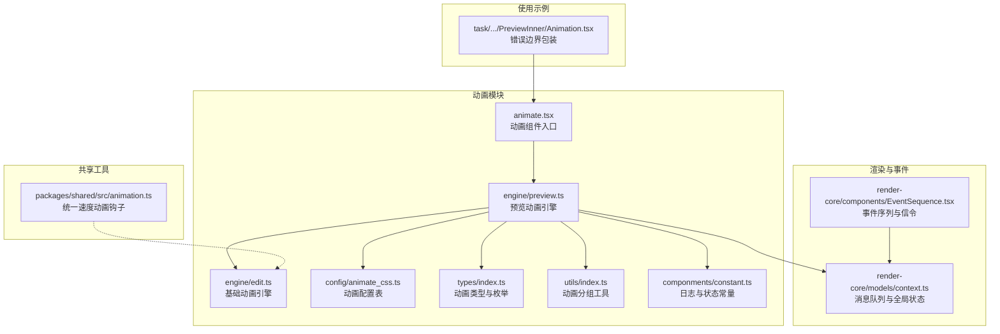
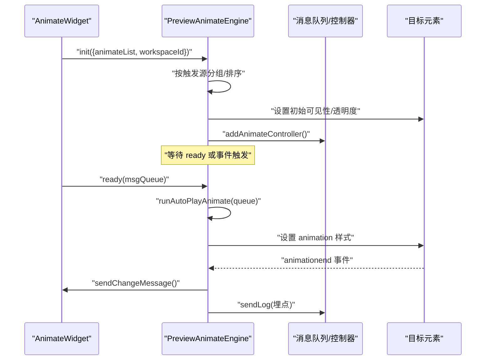
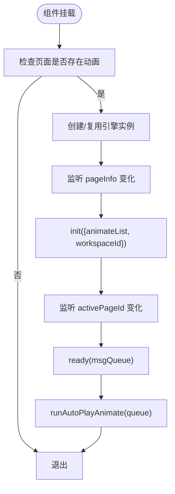
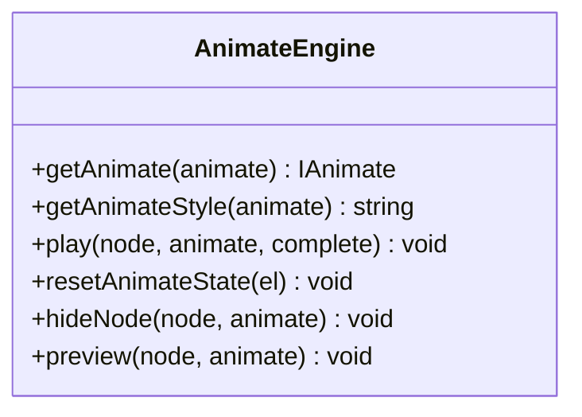
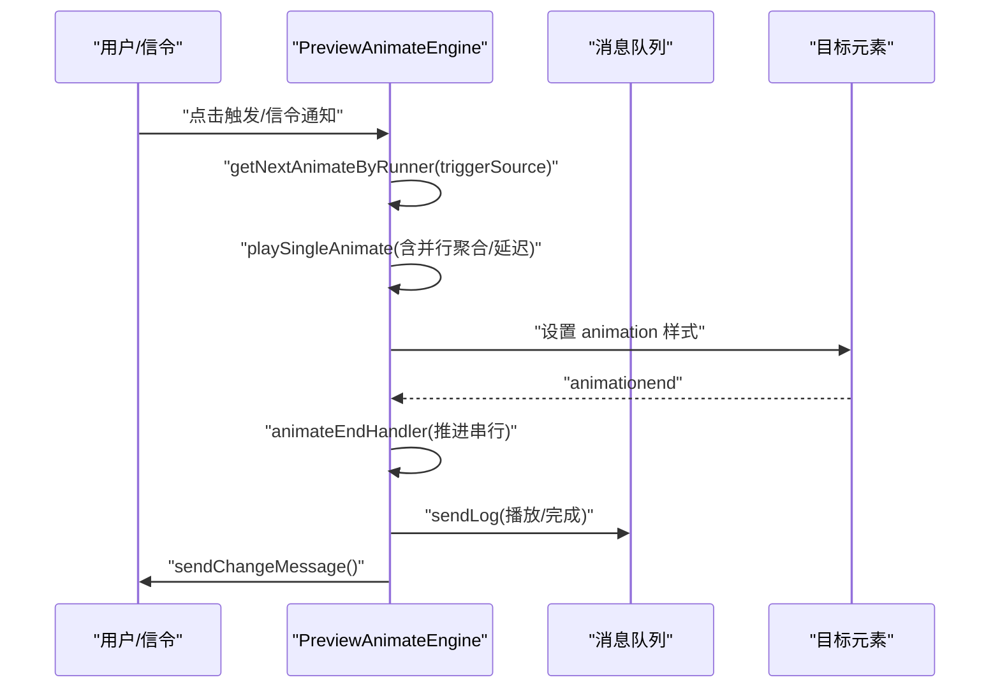
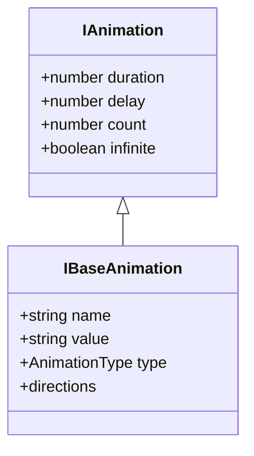
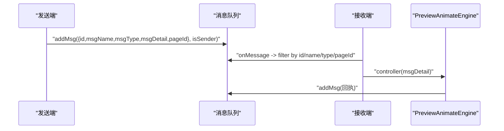
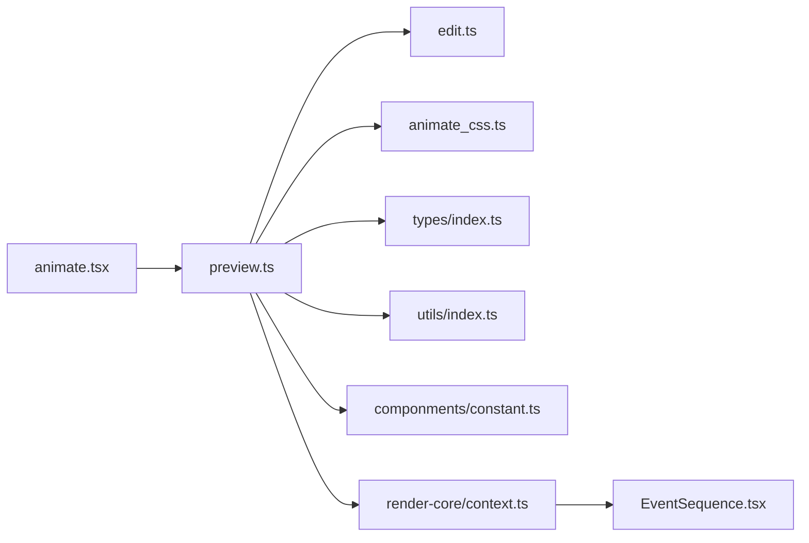
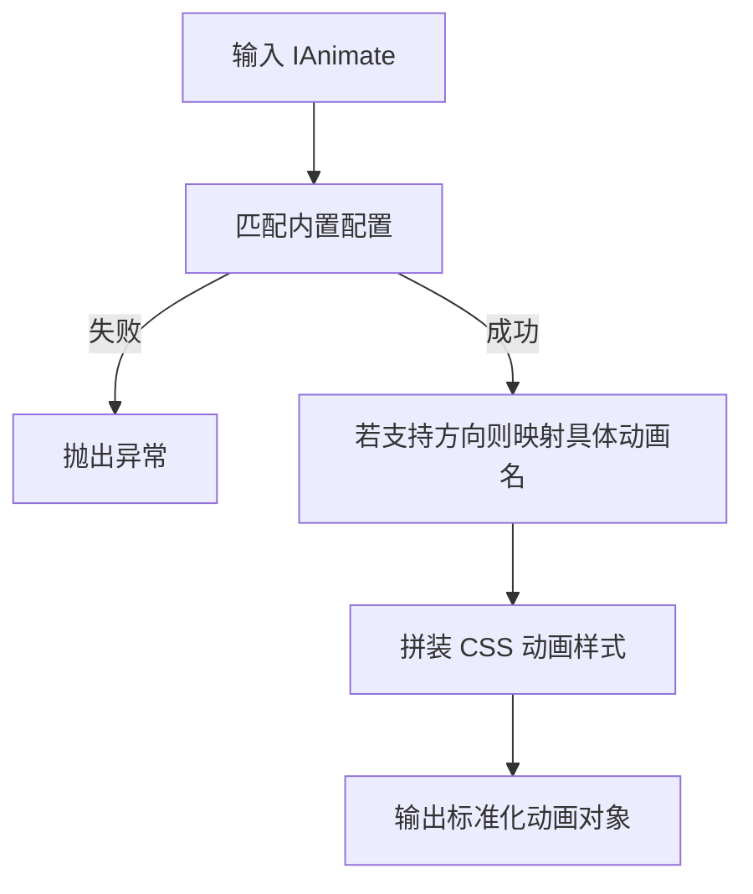

# 动画系统

<cite>
**本文引用的文件**
- [animate.tsx](file://common/animate/src/componments/animate.tsx)
- [index.ts](file://common/animate/src/engine/index.ts)
- [edit.ts](file://common/animate/src/engine/edit.ts)
- [preview.ts](file://common/animate/src/engine/preview.ts)
- [index.ts](file://common/animate/src/types/index.ts)
- [animate_css.ts](file://common/animate/src/config/animate_css.ts)
- [index.ts](file://common/animate/src/utils/index.ts)
- [constant.ts](file://common/animate/src/componments/constant.ts)
- [context.ts](file://common/render-core/models/context.ts)
- [EventSequence.tsx](file://common/render-core/components/EventSequence.tsx)
- [animation.ts](file://packages/shared/src/animation.ts)
- [Animation.tsx](file://task/src/pages/Preview/components/PreviewInner/Animation.tsx)
</cite>

## 目录
1. [简介](#简介)
2. [项目结构](#项目结构)
3. [核心组件](#核心组件)
4. [架构总览](#架构总览)
5. [详细组件分析](#详细组件分析)
6. [依赖关系分析](#依赖关系分析)
7. [性能考量](#性能考量)
8. [故障排查指南](#故障排查指南)
9. [结论](#结论)
10. [附录](#附录)

## 简介
本文件面向动画系统的技术文档，聚焦于动画引擎的架构设计与实现细节，涵盖时间轴控制、缓动函数与事件驱动的动画播放机制；深入解析动画组件的实现原理与状态管理；阐述动画配置系统与参数解析流程；说明动画与渲染系统的集成方式（帧同步与消息序列）、性能优化策略，并提供最佳实践、复杂动画实现方法与调试技巧。

## 项目结构
动画系统主要位于 common/animate 与 common/render-core 两个模块中：
- 动画引擎与配置：engine、config、types、utils、componments
- 渲染与事件系统：render-core 的消息队列、事件序列与全局状态
- 使用示例：task 预览页面中的动画组件包装

**图表来源**
- [animate.tsx:15-36](file://common/animate/src/componments/animate.tsx#L15-L36)
- [preview.ts:15-111](file://common/animate/src/engine/preview.ts#L15-L111)
- [edit.ts:5-120](file://common/animate/src/engine/edit.ts#L5-L120)
- [animate_css.ts:28-514](file://common/animate/src/config/animate_css.ts#L28-L514)
- [index.ts:1-164](file://common/animate/src/types/index.ts#L1-L164)
- [index.ts:1-16](file://common/animate/src/utils/index.ts#L1-L16)
- [constant.ts:1-36](file://common/animate/src/componments/constant.ts#L1-L36)
- [context.ts:158-226](file://common/render-core/models/context.ts#L158-L226)
- [EventSequence.tsx:31-178](file://common/render-core/components/EventSequence.tsx#L31-L178)
- [animation.ts:1-39](file://packages/shared/src/animation.ts#L1-L39)
- [Animation.tsx:1-15](file://task/src/pages/Preview/components/PreviewInner/Animation.tsx#L1-L15)

**章节来源**
- [animate.tsx:1-36](file://common/animate/src/componments/animate.tsx#L1-L36)
- [index.ts:1-2](file://common/animate/src/engine/index.ts#L1-L2)
- [edit.ts:1-120](file://common/animate/src/engine/edit.ts#L1-L120)
- [preview.ts:1-755](file://common/animate/src/engine/preview.ts#L1-L755)
- [animate_css.ts:1-514](file://common/animate/src/config/animate_css.ts#L1-L514)
- [index.ts:1-164](file://common/animate/src/types/index.ts#L1-L164)
- [index.ts:1-16](file://common/animate/src/utils/index.ts#L1-L16)
- [constant.ts:1-36](file://common/animate/src/componments/constant.ts#L1-L36)
- [context.ts:1-226](file://common/render-core/models/context.ts#L1-L226)
- [EventSequence.tsx:1-178](file://common/render-core/components/EventSequence.tsx#L1-L178)
- [animation.ts:1-39](file://packages/shared/src/animation.ts#L1-L39)
- [Animation.tsx:1-15](file://task/src/pages/Preview/components/PreviewInner/Animation.tsx#L1-L15)

## 核心组件
- 动画组件 AnimateWidget：负责挂载预览动画引擎、接收页面动画配置、在激活页就绪后启动自动播放与事件绑定。
- 基础动画引擎 AnimateEngine：封装动画解析、样式拼装、事件监听与播放控制。
- 预览动画引擎 PreviewAnimateEngine：扩展事件驱动、触发源分组、串并行动画、状态广播与埋点。
- 动画配置 animate_css：内置入场/出场/强调动画清单及方向映射。
- 类型与常量：统一的动画类型、触发方式、状态与日志枚举。
- 渲染与事件系统：消息队列、事件序列与全局状态，支撑跨组件/页面的动画信令与状态同步。
- 共享工具：统一速度动画钩子，便于自定义时间轴或物理模拟。

**章节来源**
- [animate.tsx:15-36](file://common/animate/src/componments/animate.tsx#L15-L36)
- [edit.ts:5-120](file://common/animate/src/engine/edit.ts#L5-L120)
- [preview.ts:15-111](file://common/animate/src/engine/preview.ts#L15-L111)
- [animate_css.ts:28-514](file://common/animate/src/config/animate_css.ts#L28-L514)
- [index.ts:1-164](file://common/animate/src/types/index.ts#L1-L164)
- [constant.ts:1-36](file://common/animate/src/componments/constant.ts#L1-L36)
- [context.ts:158-226](file://common/render-core/models/context.ts#L158-L226)
- [animation.ts:1-39](file://packages/shared/src/animation.ts#L1-L39)

## 架构总览
动画系统采用“组件-引擎-配置-事件”的分层架构：
- 组件层：AnimateWidget 将页面动画配置注入引擎。
- 引擎层：AnimateEngine 负责解析与播放；PreviewAnimateEngine 扩展事件驱动与状态管理。
- 配置层：animate_css 提供动画名、时长、延迟、方向等参数。
- 事件层：render-core 的消息队列与 EventSequence 实现跨端/跨页的信令与状态同步。
- 渲染层：通过 DOM 属性选择器与 CSS 动画实现帧级渲染。

**图表来源**
- [animate.tsx:15-36](file://common/animate/src/componments/animate.tsx#L15-L36)
- [preview.ts:90-116](file://common/animate/src/engine/preview.ts#L90-L116)
- [preview.ts:166-175](file://common/animate/src/engine/preview.ts#L166-L175)
- [preview.ts:347-358](file://common/animate/src/engine/preview.ts#L347-L358)
- [context.ts:158-226](file://common/render-core/models/context.ts#L158-L226)

**章节来源**
- [animate.tsx:15-36](file://common/animate/src/componments/animate.tsx#L15-L36)
- [preview.ts:90-116](file://common/animate/src/engine/preview.ts#L90-L116)
- [context.ts:158-226](file://common/render-core/models/context.ts#L158-L226)

## 详细组件分析

### 动画组件 AnimateWidget
- 职责：创建并持有 PreviewAnimateEngine 实例；在页面配置变更时初始化；在页面激活时准备并触发自动播放。
- 关键点：
  - 通过 useEventStore 获取 registerMsg、msgQueue，注入引擎用于事件注册与状态广播。
  - 依据 pageInfo.props.animates 初始化动画列表；在 activePageId 切换时调用 ready。
  - 无直接渲染，仅作为生命周期与事件的桥接。

**图表来源**
- [animate.tsx:15-36](file://common/animate/src/componments/animate.tsx#L15-L36)
- [preview.ts:90-116](file://common/animate/src/engine/preview.ts#L90-L116)

**章节来源**
- [animate.tsx:15-36](file://common/animate/src/componments/animate.tsx#L15-L36)

### 基础动画引擎 AnimateEngine
- 职责：解析动画配置、生成 CSS 动画样式、监听动画结束事件、重置元素状态。
- 关键点：
  - getAnimate：根据类型与名称匹配内置配置，若支持方向则映射具体动画名。
  - getAnimateStyle：拼装动画字符串（时长、缓动、延迟、循环等）。
  - play：设置元素 animation 属性并在结束时回调并清理状态。
  - resetAnimateState：重置透明度与动画属性，避免残留样式影响。

**图表来源**
- [edit.ts:5-120](file://common/animate/src/engine/edit.ts#L5-L120)

**章节来源**
- [edit.ts:5-120](file://common/animate/src/engine/edit.ts#L5-L120)

### 预览动画引擎 PreviewAnimateEngine
- 职责：在编辑/预览模式下，基于触发源组织动画序列，支持自动、点击、并行、串行播放，维护状态广播与埋点。
- 关键点：
  - init：接收动画列表与工作区 ID，按触发源分组并将 Auto 类型动画置于末尾，设置初始状态与事件绑定。
  - ready：从消息队列中筛选未执行的自动动画并依次播放。
  - bindAnimateElementEvent：在工作区容器上监听点击，按触发源播放首个待播动画。
  - playSingleAnimate：支持并行动画聚合、延迟等待、状态广播、埋点上报、串行动画推进。
  - 状态管理：维护播放记录、运行索引、状态广播通道，分别处理“播放”与“状态”两类消息。
  - 初始/结束状态：针对入场/出场/强调设置可见性与透明度，确保视觉一致性。

**图表来源**
- [preview.ts:271-403](file://common/animate/src/engine/preview.ts#L271-L403)
- [preview.ts:347-358](file://common/animate/src/engine/preview.ts#L347-L358)
- [preview.ts:699-754](file://common/animate/src/engine/preview.ts#L699-L754)

**章节来源**
- [preview.ts:15-755](file://common/animate/src/engine/preview.ts#L15-L755)

### 动画配置系统 animate_css
- 职责：集中定义动画基线配置（入场/出场/强调），并生成带默认时长、延迟、循环次数的完整动画对象。
- 关键点：
  - IBaseAnimation/IAnimation：描述动画名、类型、方向映射、时长/延迟/循环/无限等。
  - animationBaseConfigs：按类型分组的动画清单，部分动画提供多方向映射。
  - animations：对基线配置批量生成完整动画对象，统一默认参数。

**图表来源**
- [animate_css.ts:3-26](file://common/animate/src/config/animate_css.ts#L3-L26)

**章节来源**
- [animate_css.ts:28-514](file://common/animate/src/config/animate_css.ts#L28-L514)

### 类型与常量体系
- 动画类型与方向：AnimationType、AnimationDirection 及其映射。
- 触发方式与状态：AnimationTrigger、AnimationStatus。
- 日志与状态常量：LogName、LogAct、LogState、AnimateInstanceState。

**章节来源**
- [index.ts:1-164](file://common/animate/src/types/index.ts#L1-L164)
- [constant.ts:1-36](file://common/animate/src/componments/constant.ts#L1-L36)

### 渲染与事件系统集成
- 消息队列与控制器：useEventStore 提供 registerMsg、msgQueue、msgControllerList，支持 sender/receiver 模式。
- 事件序列：EventSequence 负责消息发送、接收、恢复，支持按类型过滤与幂等处理。
- 与动画集成：PreviewAnimateEngine 通过 registerMsg 注册“animatePlay/状态”两类消息，实现跨端/跨页的动画控制与状态同步。

**图表来源**
- [context.ts:158-226](file://common/render-core/models/context.ts#L158-L226)
- [EventSequence.tsx:72-176](file://common/render-core/components/EventSequence.tsx#L72-L176)
- [preview.ts:699-754](file://common/animate/src/engine/preview.ts#L699-L754)

**章节来源**
- [context.ts:158-226](file://common/render-core/models/context.ts#L158-L226)
- [EventSequence.tsx:1-178](file://common/render-core/components/EventSequence.tsx#L1-L178)
- [preview.ts:699-754](file://common/animate/src/engine/preview.ts#L699-L754)

### 共享工具：统一速度动画钩子
- 用途：基于 requestAnimationFrame 的统一速度动画钩子，便于自定义时间轴或物理模拟。
- 特性：返回取消函数，支持持续回调与可中断。

**章节来源**
- [animation.ts:1-39](file://packages/shared/src/animation.ts#L1-L39)

## 依赖关系分析
- 组件依赖：AnimateWidget 依赖 PreviewAnimateEngine 与 render-core 的 useEventStore。
- 引擎依赖：PreviewAnimateEngine 依赖 AnimateEngine、animate_css、types、utils、constant。
- 事件依赖：PreviewAnimateEngine 依赖 render-core 的消息队列与控制器。
- 配置依赖：animate_css 依赖 types 的枚举与接口。

**图表来源**
- [animate.tsx:15-36](file://common/animate/src/componments/animate.tsx#L15-L36)
- [preview.ts:15-111](file://common/animate/src/engine/preview.ts#L15-L111)
- [edit.ts:1-120](file://common/animate/src/engine/edit.ts#L1-L120)
- [animate_css.ts:1-514](file://common/animate/src/config/animate_css.ts#L1-L514)
- [index.ts:1-164](file://common/animate/src/types/index.ts#L1-L164)
- [index.ts:1-16](file://common/animate/src/utils/index.ts#L1-L16)
- [constant.ts:1-36](file://common/animate/src/componments/constant.ts#L1-L36)
- [context.ts:158-226](file://common/render-core/models/context.ts#L158-L226)
- [EventSequence.tsx:1-178](file://common/render-core/components/EventSequence.tsx#L1-L178)

**章节来源**
- [animate.tsx:15-36](file://common/animate/src/componments/animate.tsx#L15-L36)
- [preview.ts:15-111](file://common/animate/src/engine/preview.ts#L15-L111)
- [edit.ts:1-120](file://common/animate/src/engine/edit.ts#L1-L120)
- [animate_css.ts:1-514](file://common/animate/src/config/animate_css.ts#L1-L514)
- [index.ts:1-164](file://common/animate/src/types/index.ts#L1-L164)
- [index.ts:1-16](file://common/animate/src/utils/index.ts#L1-L16)
- [constant.ts:1-36](file://common/animate/src/componments/constant.ts#L1-L36)
- [context.ts:158-226](file://common/render-core/models/context.ts#L158-L226)
- [EventSequence.tsx:1-178](file://common/render-core/components/EventSequence.tsx#L1-L178)

## 性能考量
- DOM 操作最小化：通过设置 animation 与 -webkit-animation，避免逐帧 JS 修改样式；在动画结束后统一清理。
- 事件监听去抖：使用 passive: true、once: true，减少事件监听开销。
- 串并行调度：并行动画聚合一次性设置样式，串行动画按顺序推进，降低重复计算。
- 延迟与节流：通过 delay 参数与 sleep 实现可控延迟，避免密集触发。
- 状态缓存：消息队列与控制器列表缓存，避免重复注册与查找。
- 埋点与可观测：通过 sendLog 记录播放与信令收发，便于性能分析与问题定位。

[本节为通用性能建议，不直接分析具体文件]

## 故障排查指南
- 动画不存在：当配置名称无法匹配内置动画时抛出异常，需检查动画名与类型是否一致。
- 元素不存在：根据 preview-id 选择器找不到目标元素时抛错，需确认元素是否正确挂载且具备 preview-id。
- 事件未触发：检查消息队列中是否已存在相同动画的播放记录；确认触发源与自动播放队列的过滤逻辑。
- 状态不同步：核对“播放/状态”两类消息的注册与恢复逻辑，确保接收端控制器正确执行。
- 埋点缺失：确认 sendLog 的调用位置与日志名/动作枚举是否正确。

**章节来源**
- [edit.ts:12-30](file://common/animate/src/engine/edit.ts#L12-L30)
- [preview.ts:194-221](file://common/animate/src/engine/preview.ts#L194-L221)
- [preview.ts:304-325](file://common/animate/src/engine/preview.ts#L304-L325)
- [preview.ts:707-743](file://common/animate/src/engine/preview.ts#L707-L743)

## 结论
该动画系统以“组件-引擎-配置-事件”为核心，实现了事件驱动、触发源分组、串并行调度与状态广播的完整链路。通过内置动画配置与 CSS 动画渲染，结合消息队列与事件序列，达成跨端/跨页的一致体验。建议在复杂场景中充分利用并行动画聚合、延迟与状态广播，配合埋点与错误边界提升稳定性与可观测性。

[本节为总结性内容，不直接分析具体文件]

## 附录

### 动画配置参数与解析流程
- 输入：IAnimate（id、sort、target、type、name、trigger、triggerSource、direction、duration、delay、status）。
- 解析：根据类型与名称匹配内置配置，若支持方向则映射具体动画名；拼装 CSS 动画样式字符串。
- 输出：标准化动画对象，交由引擎设置到目标元素。

**图表来源**
- [edit.ts:12-30](file://common/animate/src/engine/edit.ts#L12-L30)
- [edit.ts:39-44](file://common/animate/src/engine/edit.ts#L39-L44)
- [animate_css.ts:28-514](file://common/animate/src/config/animate_css.ts#L28-L514)

**章节来源**
- [edit.ts:12-44](file://common/animate/src/engine/edit.ts#L12-L44)
- [animate_css.ts:28-514](file://common/animate/src/config/animate_css.ts#L28-L514)

### 复杂动画实现方法与最佳实践
- 并行动画：将多个同源动画按顺序追加至同一播放批次，一次性设置样式，减少多次 DOM 写入。
- 串行动画：利用 getNextAnimateByRunner 与 animateEndHandler 递推，确保顺序执行。
- 延迟与节拍：通过 delay 与 sleep 控制节奏，避免密集触发；必要时引入统一速度动画钩子实现物理模拟。
- 状态同步：通过 registerMsg 注册“播放/状态”两类消息，实现跨端/跨页同步；结合 sendLog 埋点追踪。
- 错误边界：在使用侧包裹错误边界组件，捕获异常并提示重试。

**章节来源**
- [preview.ts:291-358](file://common/animate/src/engine/preview.ts#L291-L358)
- [preview.ts:412-421](file://common/animate/src/engine/preview.ts#L412-L421)
- [preview.ts:699-754](file://common/animate/src/engine/preview.ts#L699-L754)
- [animation.ts:1-39](file://packages/shared/src/animation.ts#L1-L39)
- [Animation.tsx:1-15](file://task/src/pages/Preview/components/PreviewInner/Animation.tsx#L1-L15)