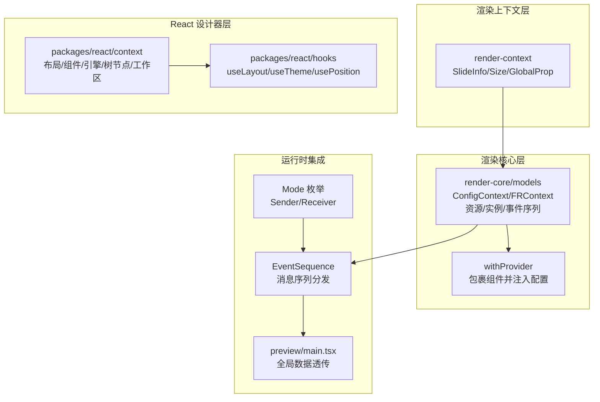
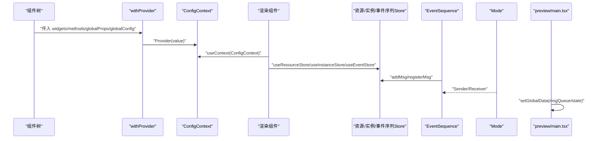
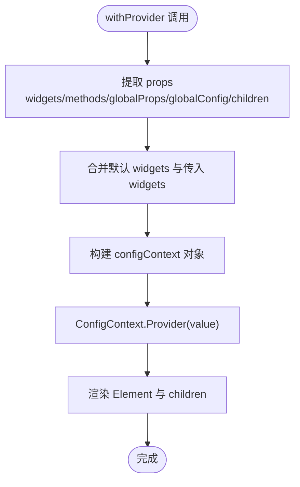
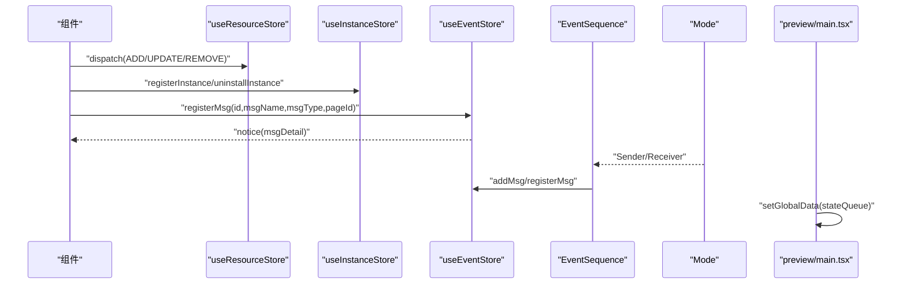
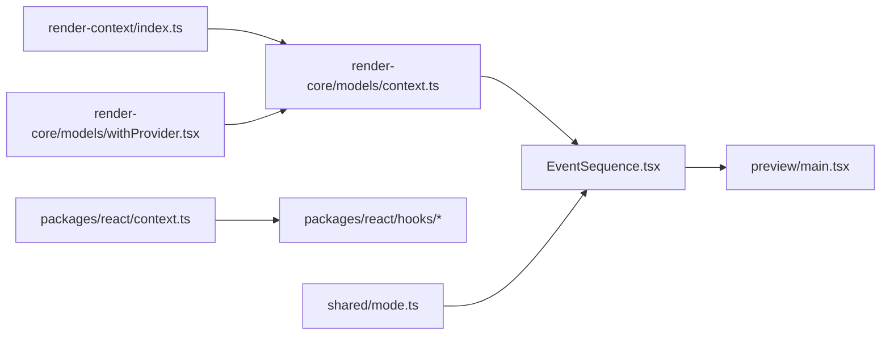

# 渲染上下文

<cite>
**本文引用的文件**
- [common/render-context/src/index.ts](file://common/render-context/src/index.ts)
- [common/render-core/models/context.ts](file://common/render-core/models/context.ts)
- [common/render-core/models/withProvider.tsx](file://common/render-core/models/withProvider.tsx)
- [common/render-core/models/index.ts](file://common/render-core/models/index.ts)
- [common/render-core/shared/mode.ts](file://common/render-core/shared/mode.ts)
- [common/render-core/components/EventSequence.tsx](file://common/render-core/components/EventSequence.tsx)
- [packages/react/src/context.ts](file://packages/react/src/context.ts)
- [packages/react/src/hooks/useLayout.ts](file://packages/react/src/hooks/useLayout.ts)
- [packages/react/src/hooks/useTheme.ts](file://packages/react/src/hooks/useTheme.ts)
- [packages/react/src/hooks/usePosition.ts](file://packages/react/src/hooks/usePosition.ts)
- [preview/src/main.tsx](file://preview/src/main.tsx)
</cite>

## 目录
1. [引言](#引言)
2. [项目结构](#项目结构)
3. [核心组件](#核心组件)
4. [架构总览](#架构总览)
5. [详细组件分析](#详细组件分析)
6. [依赖分析](#依赖分析)
7. [性能考虑](#性能考虑)
8. [故障排查指南](#故障排查指南)
9. [结论](#结论)
10. [附录](#附录)

## 引言
本技术文档围绕“渲染上下文系统”展开，目标是帮助读者理解 RenderContext 的设计目的与实现原理，涵盖全局状态管理、主题切换与页面状态维护；阐明上下文数据的传递机制（Provider 模式与数据流向）；说明上下文与组件系统的集成方式（Hook 使用与状态订阅机制）；给出上下文扩展性设计（自定义上下文的添加与管理方法）；并提供最佳实践（性能优化与内存管理策略），以及可操作的上下文使用示例与扩展开发指南。

## 项目结构
渲染上下文系统主要分布在以下模块：
- 全局上下文定义：位于 common/render-context，提供 SlideInfo、Size、GlobalProp 等基础上下文。
- 渲染核心上下文与 Provider：位于 common/render-core/models，提供 ConfigContext、FRContext、资源上报、消息序列等全局状态与工具。
- React 设计器上下文：位于 packages/react，提供设计器布局、组件、引擎、树节点、工作区等上下文。
- 上下文使用与 Hook：位于 packages/react/hooks，提供 useLayout、useTheme、usePosition 等便捷 Hook。
- 事件序列与消息分发：位于 common/render-core/components/EventSequence.tsx 与共享模式常量 common/render-core/shared/mode.ts。
- 预览态应用入口：位于 preview/src/main.tsx，演示如何在运行时消费事件序列与全局数据。

图表来源
- [common/render-context/src/index.ts:1-25](file://common/render-context/src/index.ts#L1-L25)
- [common/render-core/models/context.ts:1-226](file://common/render-core/models/context.ts#L1-L226)
- [common/render-core/models/withProvider.tsx:1-31](file://common/render-core/models/withProvider.tsx#L1-L31)
- [packages/react/src/context.ts:1-34](file://packages/react/src/context.ts#L1-L34)
- [packages/react/src/hooks/useLayout.ts:1-12](file://packages/react/src/hooks/useLayout.ts#L1-L12)
- [common/render-core/components/EventSequence.tsx:61-150](file://common/render-core/components/EventSequence.tsx#L61-L150)
- [common/render-core/shared/mode.ts:1-4](file://common/render-core/shared/mode.ts#L1-L4)
- [preview/src/main.tsx:185-220](file://preview/src/main.tsx#L185-L220)

章节来源
- [common/render-context/src/index.ts:1-25](file://common/render-context/src/index.ts#L1-L25)
- [common/render-core/models/context.ts:1-226](file://common/render-core/models/context.ts#L1-L226)
- [common/render-core/models/withProvider.tsx:1-31](file://common/render-core/models/withProvider.tsx#L1-L31)
- [packages/react/src/context.ts:1-34](file://packages/react/src/context.ts#L1-L34)
- [packages/react/src/hooks/useLayout.ts:1-12](file://packages/react/src/hooks/useLayout.ts#L1-L12)
- [common/render-core/components/EventSequence.tsx:61-150](file://common/render-core/components/EventSequence.tsx#L61-L150)
- [common/render-core/shared/mode.ts:1-4](file://common/render-core/shared/mode.ts#L1-L4)
- [preview/src/main.tsx:185-220](file://preview/src/main.tsx#L185-L220)

## 核心组件
- SlideInfo/Size/GlobalProp 上下文：用于页面列表、活动页、缩放与尺寸等全局信息的跨层级传递。
- ConfigContext：渲染配置注入点，支持 widgets、methods、globalProps、globalConfig 的合并与透传。
- FRContext：框架级上下文，配合 withProvider 实现组件包装与配置注入。
- 资源上报与实例管理：基于 hox 的全局 store，提供资源状态上报、组件实例注册与连接、事件序列管理。
- React 设计器上下文：DesignerLayoutContext、DesignerComponentsContext、DesignerEngineContext、TreeNodeContext、WorkspaceContext，支撑设计器态下的布局、组件、引擎、树节点与工作区状态。
- Hook：useLayout、useTheme、usePosition 从设计器上下文中提取布局与主题信息，简化组件对上下文的访问。

章节来源
- [common/render-context/src/index.ts:1-25](file://common/render-context/src/index.ts#L1-L25)
- [common/render-core/models/context.ts:1-226](file://common/render-core/models/context.ts#L1-L226)
- [common/render-core/models/withProvider.tsx:1-31](file://common/render-core/models/withProvider.tsx#L1-L31)
- [packages/react/src/context.ts:1-34](file://packages/react/src/context.ts#L1-L34)
- [packages/react/src/hooks/useLayout.ts:1-12](file://packages/react/src/hooks/useLayout.ts#L1-L12)
- [packages/react/src/hooks/useTheme.ts:1-5](file://packages/react/src/hooks/useTheme.ts#L1-L5)
- [packages/react/src/hooks/usePosition.ts:1-5](file://packages/react/src/hooks/usePosition.ts#L1-L5)

## 架构总览
渲染上下文系统采用“多层上下文 + Provider 包裹 + 全局状态存储”的架构：
- 底层：SlideInfo/Size/GlobalProp 提供页面与尺寸信息。
- 中层：ConfigContext/FRContext 作为渲染配置与框架上下文，withProvider 将配置注入到目标组件树。
- 上层：资源上报、实例管理、事件序列等通过全局 store 管理，组件通过 Hook 订阅状态变化。
- 设计器层：提供布局、组件、引擎、树节点与工作区上下文，便于在编辑态下统一管理状态。
- 运行时：EventSequence 负责消息序列的发送与恢复，Mode 决定 Sender/Receiver 行为；preview/main.tsx 将状态通过微前端全局数据透传。

图表来源
- [common/render-core/models/withProvider.tsx:1-31](file://common/render-core/models/withProvider.tsx#L1-L31)
- [common/render-core/models/context.ts:1-226](file://common/render-core/models/context.ts#L1-L226)
- [common/render-core/components/EventSequence.tsx:61-150](file://common/render-core/components/EventSequence.tsx#L61-L150)
- [common/render-core/shared/mode.ts:1-4](file://common/render-core/shared/mode.ts#L1-L4)
- [preview/src/main.tsx:185-220](file://preview/src/main.tsx#L185-L220)

## 详细组件分析

### SlideInfo/Size/GlobalProp 上下文
- SlideInfoContext：承载页面列表、当前活动页、下一页等页面导航信息。
- SizeContext：承载容器尺寸、画布缩放、客户端宽高等尺寸信息。
- GlobalPropContext：承载全局属性，供组件树内任意层级读取。

实现要点
- 使用 React createContext 定义上下文，默认值为空对象或空结构，避免未提供 Provider 时报错。
- 组件通过 useContext 获取上下文值，实现跨层级数据共享。

章节来源
- [common/render-context/src/index.ts:1-25](file://common/render-context/src/index.ts#L1-L25)

### ConfigContext 与 FRContext（Provider 包装）
- ConfigContext：集中注入 widgets、methods、globalProps、globalConfig，并通过 Provider 传递给子树。
- FRContext：框架级上下文，通常与 ConfigContext 协同，用于框架内部状态与行为控制。
- withProvider：高阶组件，将传入的配置与默认配置合并，注入到 Element 与 children 之前。

实现要点
- 合并策略：defaultWidgets 与 widgets 合并，确保默认配置优先级低于显式传入配置。
- 透传：除 widgets/methods/globalProps/globalConfig/children 外的其他 props 原样传递给 Element。
- Provider 层级：确保子树能稳定获取到 ConfigContext 的最新值。

图表来源
- [common/render-core/models/withProvider.tsx:1-31](file://common/render-core/models/withProvider.tsx#L1-L31)
- [common/render-core/models/context.ts:1-6](file://common/render-core/models/context.ts#L1-L6)

章节来源
- [common/render-core/models/withProvider.tsx:1-31](file://common/render-core/models/withProvider.tsx#L1-L31)
- [common/render-core/models/context.ts:1-6](file://common/render-core/models/context.ts#L1-L6)

### 资源上报、实例管理与事件序列
- 资源上报：useResourceStore 管理资源状态队列，支持 ADD/UPDATE/REMOVE 动作，去重判断相同资源。
- 实例管理：useInstanceStore 管理组件实例映射，提供 registerInstance/uninstallInstance 与 useConnect 优化订阅。
- 事件序列：useEventStore 管理消息队列与控制器注册，支持 Sender/Receiver 模式，EventSequence 负责发送与恢复。
- 模式常量：Mode 枚举区分 Sender/Receiver，驱动事件序列的行为差异。

实现要点
- 资源去重：基于 pageId 与 componentId 判断是否重复，避免重复上报。
- 优化订阅：useConnect 仅订阅指定 ids 的实例，减少无关渲染。
- 控制器缓存：EventSequence 在恢复时检查缓存，命中则直接执行控制器，否则注册后再执行。
- 微前端透传：preview/main.tsx 将 state 类型消息聚合为全局数据，供外部微前端使用。

图表来源
- [common/render-core/models/context.ts:95-151](file://common/render-core/models/context.ts#L95-L151)
- [common/render-core/models/context.ts:157-225](file://common/render-core/models/context.ts#L157-L225)
- [common/render-core/components/EventSequence.tsx:61-150](file://common/render-core/components/EventSequence.tsx#L61-L150)
- [common/render-core/shared/mode.ts:1-4](file://common/render-core/shared/mode.ts#L1-L4)
- [preview/src/main.tsx:185-220](file://preview/src/main.tsx#L185-L220)

章节来源
- [common/render-core/models/context.ts:95-151](file://common/render-core/models/context.ts#L95-L151)
- [common/render-core/models/context.ts:157-225](file://common/render-core/models/context.ts#L157-L225)
- [common/render-core/components/EventSequence.tsx:61-150](file://common/render-core/components/EventSequence.tsx#L61-L150)
- [common/render-core/shared/mode.ts:1-4](file://common/render-core/shared/mode.ts#L1-L4)
- [preview/src/main.tsx:185-220](file://preview/src/main.tsx#L185-L220)

### React 设计器上下文与 Hook
- 设计器上下文：DesignerLayoutContext、DesignerComponentsContext、DesignerEngineContext、TreeNodeContext、WorkspaceContext，分别承载布局、组件、引擎、树节点与工作区状态。
- Hook：useLayout 返回布局上下文；useTheme 与 usePosition 从布局上下文中提取主题与位置信息，简化组件对上下文的访问。

实现要点
- polyfill 支持：useLayout 优先从全局 polyfill 获取上下文，兜底使用 useContext。
- 主题与位置：useTheme/usePosition 直接从 useLayout 的返回值中读取，保证主题切换与定位更新的响应性。

章节来源
- [packages/react/src/context.ts:1-34](file://packages/react/src/context.ts#L1-L34)
- [packages/react/src/hooks/useLayout.ts:1-12](file://packages/react/src/hooks/useLayout.ts#L1-L12)
- [packages/react/src/hooks/useTheme.ts:1-5](file://packages/react/src/hooks/useTheme.ts#L1-L5)
- [packages/react/src/hooks/usePosition.ts:1-5](file://packages/react/src/hooks/usePosition.ts#L1-L5)

## 依赖分析
- 渲染上下文层依赖于 React 的 createContext 与 Hooks。
- 渲染核心层依赖 hox 提供的 createGlobalStore 与 createStore，实现全局状态与局部状态的分离。
- 事件序列依赖 Mode 枚举决定 Sender/Receiver 行为，与 EventSequence 组件协同。
- preview/main.tsx 依赖 useEventStore 与微前端能力，将状态通过 setGlobalData 透传。

图表来源
- [common/render-context/src/index.ts:1-25](file://common/render-context/src/index.ts#L1-L25)
- [common/render-core/models/context.ts:1-226](file://common/render-core/models/context.ts#L1-L226)
- [common/render-core/models/withProvider.tsx:1-31](file://common/render-core/models/withProvider.tsx#L1-L31)
- [packages/react/src/context.ts:1-34](file://packages/react/src/context.ts#L1-L34)
- [packages/react/src/hooks/useLayout.ts:1-12](file://packages/react/src/hooks/useLayout.ts#L1-L12)
- [common/render-core/components/EventSequence.tsx:61-150](file://common/render-core/components/EventSequence.tsx#L61-L150)
- [common/render-core/shared/mode.ts:1-4](file://common/render-core/shared/mode.ts#L1-L4)
- [preview/src/main.tsx:185-220](file://preview/src/main.tsx#L185-L220)

章节来源
- [common/render-context/src/index.ts:1-25](file://common/render-context/src/index.ts#L1-L25)
- [common/render-core/models/context.ts:1-226](file://common/render-core/models/context.ts#L1-L226)
- [common/render-core/models/withProvider.tsx:1-31](file://common/render-core/models/withProvider.tsx#L1-L31)
- [packages/react/src/context.ts:1-34](file://packages/react/src/context.ts#L1-L34)
- [packages/react/src/hooks/useLayout.ts:1-12](file://packages/react/src/hooks/useLayout.ts#L1-L12)
- [common/render-core/components/EventSequence.tsx:61-150](file://common/render-core/components/EventSequence.tsx#L61-L150)
- [common/render-core/shared/mode.ts:1-4](file://common/render-core/shared/mode.ts#L1-L4)
- [preview/src/main.tsx:185-220](file://preview/src/main.tsx#L185-L220)

## 性能考虑
- 优化订阅范围：useConnect 仅订阅指定 ids 的实例，避免全量实例变更导致的不必要渲染。
- 资源上报去重：基于 pageId 与 componentId 的去重逻辑，减少重复上报带来的状态抖动。
- 事件序列按需处理：Sender/Receiver 模式下，仅在需要时进行消息发送与恢复，降低运行时开销。
- Provider 合并策略：withProvider 合并默认与传入配置，避免深层 Provider 嵌套造成的上下文碎片化。
- 微前端透传：preview/main.tsx 聚合 state 类型消息，减少频繁 setGlobalData 的次数与体积。

## 故障排查指南
- 上下文未提供 Provider：若组件直接 useContext 而未被 Provider 包裹，可能导致上下文值为默认空对象或空结构。请确认上层已正确使用 withProvider 或相应 Context.Provider。
- 事件序列未恢复：若 EventSequence 恢复流程未触发控制器，请检查 msgControllerList 是否存在匹配项，以及缓存中是否存在对应 pageId/msgType/id/msgName 的记录。
- 主题或位置不生效：确认 useLayout 是否能从全局 polyfill 或 DesignerLayoutContext 正确获取布局上下文，再由 useTheme/usePosition 读取。
- 资源上报异常：检查资源上报动作类型是否为 ADD/UPDATE/REMOVE，以及去重条件是否满足，避免重复上报导致的状态不一致。

章节来源
- [common/render-core/models/withProvider.tsx:1-31](file://common/render-core/models/withProvider.tsx#L1-L31)
- [common/render-core/components/EventSequence.tsx:61-150](file://common/render-core/components/EventSequence.tsx#L61-L150)
- [packages/react/src/hooks/useLayout.ts:1-12](file://packages/react/src/hooks/useLayout.ts#L1-L12)
- [packages/react/src/hooks/useTheme.ts:1-5](file://packages/react/src/hooks/useTheme.ts#L1-L5)
- [packages/react/src/hooks/usePosition.ts:1-5](file://packages/react/src/hooks/usePosition.ts#L1-L5)

## 结论
渲染上下文系统通过多层上下文、Provider 包裹与全局状态存储，实现了页面状态、尺寸信息、主题与布局、资源上报、实例管理与事件序列的统一管理。结合 Hook 的使用，组件可以简洁地访问与订阅所需状态；通过 Sender/Receiver 模式与微前端透传，系统具备良好的扩展性与运行时集成能力。建议在实际开发中遵循“最小订阅范围、合并配置策略、事件序列按需处理”的原则，以获得更优的性能与可维护性。

## 附录
- 最佳实践清单
  - 使用 withProvider 合并默认与传入配置，避免深层 Provider 嵌套。
  - 通过 useConnect 仅订阅必要的实例，减少渲染压力。
  - 资源上报使用统一的动作类型与去重逻辑，确保状态一致性。
  - 在设计器态使用 useLayout/useTheme/usePosition，提升主题切换与定位更新的响应性。
  - Sender/Receiver 模式下，EventSequence 仅在需要时进行消息发送与恢复。
  - preview/main.tsx 聚合 state 类型消息，减少 setGlobalData 的频率与体积。

- 扩展开发指南
  - 新增上下文：在 common/render-context 或 packages/react 下新增 createContext，并提供对应的 Hook。
  - 注入配置：使用 withProvider 包裹目标组件，将新上下文的值注入到 Provider 中。
  - 状态订阅：通过 hox 的 createGlobalStore 或 useState/useReducer 创建全局/局部状态，并提供对应的 Hook。
  - 事件序列：使用 useEventStore 的 registerMsg 与 addMsg，结合 Mode 枚举实现 Sender/Receiver 行为。
  - 微前端集成：在 preview/main.tsx 中将关键状态通过 setGlobalData 透传，供外部微前端消费。