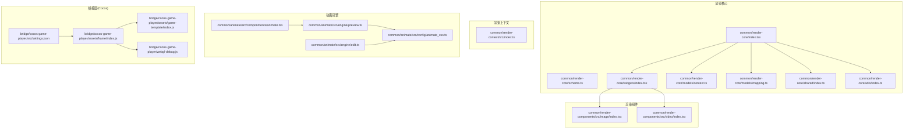
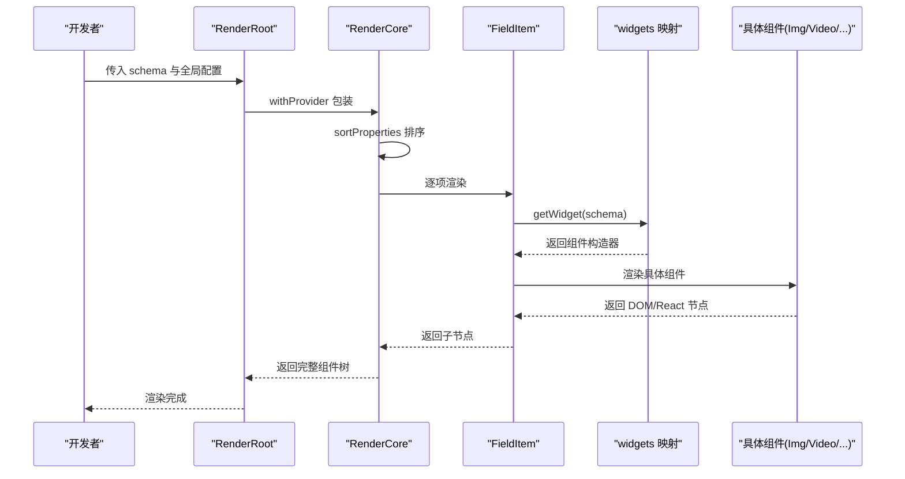
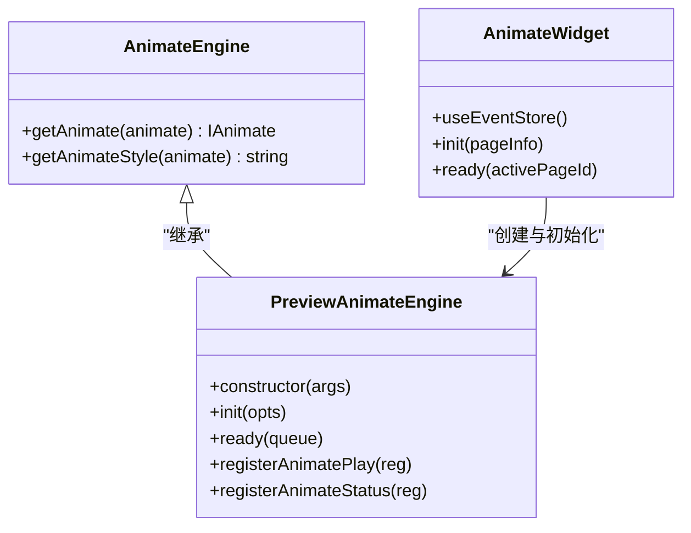
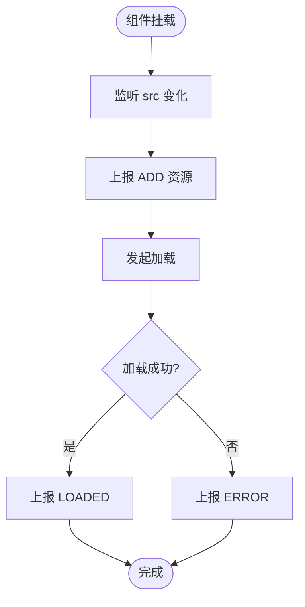
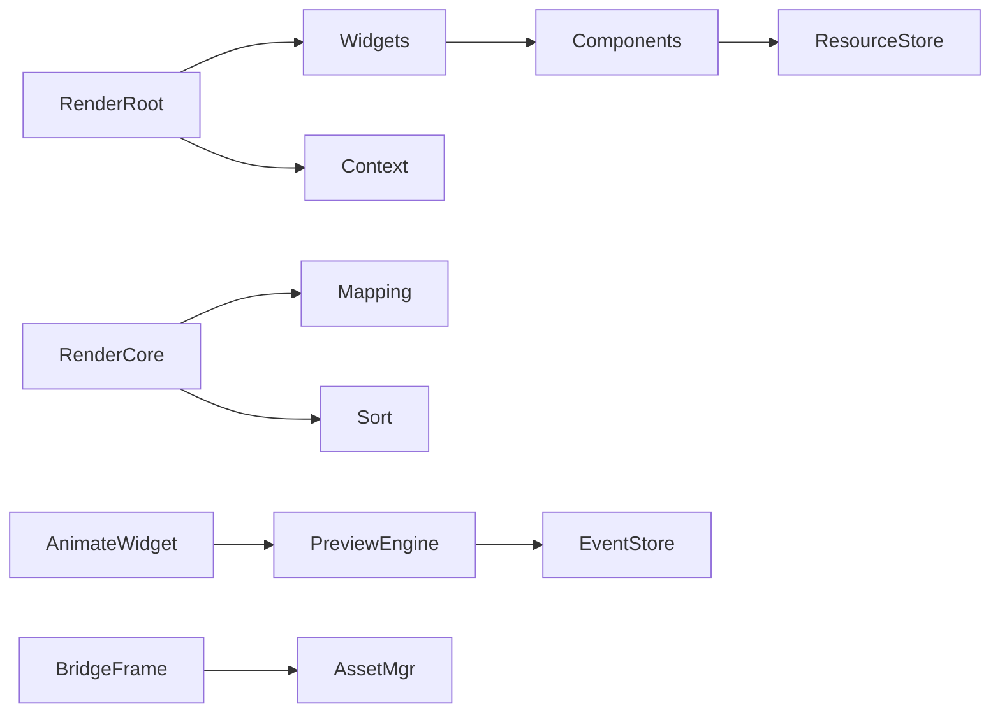

# 渲染引擎

<cite>
**本文引用的文件**
- [common/render-context/src/index.ts](file://common/render-context/src/index.ts)
- [common/render-core/index.tsx](file://common/render-core/index.tsx)
- [common/render-core/schema.ts](file://common/render-core/schema.ts)
- [common/render-core/demo.tsx](file://common/render-core/demo.tsx)
- [common/render-core/widgets/index.tsx](file://common/render-core/widgets/index.tsx)
- [common/render-core/models/context.ts](file://common/render-core/models/context.ts)
- [common/render-core/models/mapping.ts](file://common/render-core/models/mapping.ts)
- [common/render-core/shared/index.ts](file://common/render-core/shared/index.ts)
- [common/render-core/utils/index.ts](file://common/render-core/utils/index.ts)
- [common/render-components/src/image/index.tsx](file://common/render-components/src/image/index.tsx)
- [common/render-components/src/video/index.tsx](file://common/render-components/src/video/index.tsx)
- [common/animate/src/engine/edit.ts](file://common/animate/src/engine/edit.ts)
- [common/animate/src/engine/preview.ts](file://common/animate/src/engine/preview.ts)
- [common/animate/src/componments/animate.tsx](file://common/animate/src/componments/animate.tsx)
- [common/animate/src/config/animate_css.ts](file://common/animate/src/config/animate_css.ts)
- [bridge/cocos-game-player/assets/frame/index.js](file://bridge/cocos-game-player/assets/frame/index.js)
- [bridge/cocos-game-player/assets/game-template/index.js](file://bridge/cocos-game-player/assets/game-template/index.js)
- [bridge/cocos-game-player/webgl-debug.js](file://bridge/cocos-game-player/webgl-debug.js)
- [bridge/cocos-game-player/src/settings.json](file://bridge/cocos-game-player/src/settings.json)
</cite>

## 目录
1. [简介](#简介)
2. [项目结构](#项目结构)
3. [核心组件](#核心组件)
4. [架构总览](#架构总览)
5. [详细组件分析](#详细组件分析)
6. [依赖关系分析](#依赖关系分析)
7. [性能考量](#性能考量)
8. [故障排查指南](#故障排查指南)
9. [结论](#结论)
10. [附录](#附录)

## 简介
本技术文档面向 Slides Engine 渲染引擎，系统性阐述其架构与实现要点，覆盖以下主题：
- JSON Schema 解析与组件渲染管线
- 渲染上下文（RenderContext）的设计与作用
- 从 Schema 到 DOM 的转换流程
- 动画系统：时间轴控制、缓动与事件驱动播放
- 资源管理：图片、视频、字体等资源的加载与缓存策略
- 性能优化最佳实践与调试技巧
- 扩展开发指南与参考路径

## 项目结构
Slides Engine 采用多包工作区组织，渲染相关的关键模块集中在 common 下的 render-* 包，并辅以动画与组件库；桥接层位于 bridge 目录，用于 Cocos 引擎集成与调试。

图表来源
- [common/render-core/index.tsx:1-76](file://common/render-core/index.tsx#L1-L76)
- [common/render-core/widgets/index.tsx:1-130](file://common/render-core/widgets/index.tsx#L1-L130)
- [common/render-core/models/context.ts:1-226](file://common/render-core/models/context.ts#L1-L226)
- [common/render-core/models/mapping.ts:1-92](file://common/render-core/models/mapping.ts#L1-L92)
- [common/render-core/shared/index.ts:1-11](file://common/render-core/shared/index.ts#L1-L11)
- [common/render-core/utils/index.ts:1-40](file://common/render-core/utils/index.ts#L1-L40)
- [common/render-components/src/image/index.tsx:78-130](file://common/render-components/src/image/index.tsx#L78-L130)
- [common/render-components/src/video/index.tsx:1-200](file://common/render-components/src/video/index.tsx#L1-L200)
- [common/animate/src/engine/edit.ts:1-44](file://common/animate/src/engine/edit.ts#L1-L44)
- [common/animate/src/engine/preview.ts:61-88](file://common/animate/src/engine/preview.ts#L61-L88)
- [common/animate/src/componments/animate.tsx:1-36](file://common/animate/src/componments/animate.tsx#L1-L36)
- [common/animate/src/config/animate_css.ts:1-26](file://common/animate/src/config/animate_css.ts#L1-L26)
- [bridge/cocos-game-player/assets/frame/index.js:5028-5054](file://bridge/cocos-game-player/assets/frame/index.js#L5028-L5054)
- [bridge/cocos-game-player/assets/game-template/index.js:63-90](file://bridge/cocos-game-player/assets/game-template/index.js#L63-L90)
- [bridge/cocos-game-player/webgl-debug.js:386-790](file://bridge/cocos-game-player/webgl-debug.js#L386-L790)
- [bridge/cocos-game-player/src/settings.json:36-83](file://bridge/cocos-game-player/src/settings.json#L36-L83)

章节来源
- [common/render-core/index.tsx:1-76](file://common/render-core/index.tsx#L1-L76)
- [common/render-core/widgets/index.tsx:1-130](file://common/render-core/widgets/index.tsx#L1-L130)
- [common/render-core/models/context.ts:1-226](file://common/render-core/models/context.ts#L1-L226)
- [common/render-core/models/mapping.ts:1-92](file://common/render-core/models/mapping.ts#L1-L92)
- [common/render-core/shared/index.ts:1-11](file://common/render-core/shared/index.ts#L1-L11)
- [common/render-core/utils/index.ts:1-40](file://common/render-core/utils/index.ts#L1-L40)
- [common/render-components/src/image/index.tsx:78-130](file://common/render-components/src/image/index.tsx#L78-L130)
- [common/render-components/src/video/index.tsx:1-200](file://common/render-components/src/video/index.tsx#L1-L200)
- [common/animate/src/engine/edit.ts:1-44](file://common/animate/src/engine/edit.ts#L1-L44)
- [common/animate/src/engine/preview.ts:61-88](file://common/animate/src/engine/preview.ts#L61-L88)
- [common/animate/src/componments/animate.tsx:1-36](file://common/animate/src/componments/animate.tsx#L1-L36)
- [common/animate/src/config/animate_css.ts:1-26](file://common/animate/src/config/animate_css.ts#L1-L26)
- [bridge/cocos-game-player/assets/frame/index.js:5028-5054](file://bridge/cocos-game-player/assets/frame/index.js#L5028-L5054)
- [bridge/cocos-game-player/assets/game-template/index.js:63-90](file://bridge/cocos-game-player/assets/game-template/index.js#L63-L90)
- [bridge/cocos-game-player/webgl-debug.js:386-790](file://bridge/cocos-game-player/webgl-debug.js#L386-L790)
- [bridge/cocos-game-player/src/settings.json:36-83](file://bridge/cocos-game-player/src/settings.json#L36-L83)

## 核心组件
- 渲染根与核心渲染器
  - RenderRoot 与 RenderCore：负责将 JSON Schema 递归渲染为 React 组件树，结合内置小部件表与映射规则选择具体组件。
  - 参考路径：[common/render-core/index.tsx:52-67](file://common/render-core/index.tsx#L52-L67)
- Schema 定义与转换
  - 提供示例 Schema 与 nodeSchema 到通用 Schema 的转换函数，支撑页面级结构描述与动画挂载点。
  - 参考路径：[common/render-core/schema.ts:1-145](file://common/render-core/schema.ts#L1-L145)
- 内置小部件与错误边界
  - widgets 表聚合富文本、分组、图片、视频、图形等组件，并包裹错误边界以提升稳定性。
  - 参考路径：[common/render-core/widgets/index.tsx:8-130](file://common/render-core/widgets/index.tsx#L8-L130)
- 渲染上下文
  - 全局属性、页面信息、尺寸等上下文，为渲染与动画提供共享状态。
  - 参考路径：[common/render-context/src/index.ts:17-24](file://common/render-context/src/index.ts#L17-L24)
- 资源与事件消息模型
  - 资源上报（添加/更新/移除）、受控组件实例注册、消息队列与控制器注册，支撑事件驱动的动画与交互。
  - 参考路径：[common/render-core/models/context.ts:22-225](file://common/render-core/models/context.ts#L22-L225)
- 小部件映射
  - 基于 schema 类型/格式选择 ui:widget 名称，支持首字母大写回退与兜底 Html 组件。
  - 参考路径：[common/render-core/models/mapping.ts:42-92](file://common/render-core/models/mapping.ts#L42-L92)
- 工具与常量
  - 类型判断、课程事件/命令枚举等辅助工具。
  - 参考路径：[common/render-core/utils/index.ts:1-40](file://common/render-core/utils/index.ts#L1-L40)

章节来源
- [common/render-core/index.tsx:1-76](file://common/render-core/index.tsx#L1-L76)
- [common/render-core/schema.ts:1-145](file://common/render-core/schema.ts#L1-L145)
- [common/render-core/widgets/index.tsx:1-130](file://common/render-core/widgets/index.tsx#L1-L130)
- [common/render-context/src/index.ts:17-24](file://common/render-context/src/index.ts#L17-L24)
- [common/render-core/models/context.ts:22-225](file://common/render-core/models/context.ts#L22-L225)
- [common/render-core/models/mapping.ts:42-92](file://common/render-core/models/mapping.ts#L42-L92)
- [common/render-core/utils/index.ts:1-40](file://common/render-core/utils/index.ts#L1-L40)

## 架构总览
渲染引擎采用“Schema 驱动 + 小部件映射 + 上下文共享”的三层架构：
- 数据层：JSON Schema 描述页面结构与属性，包含组件、样式、动画等元信息。
- 渲染层：RenderRoot/RenderCore 递归解析 Schema，按映射规则选择小部件并生成 React 节点。
- 服务层：资源上报、消息队列、动画引擎与桥接层（Cocos）协同，实现事件驱动与跨端渲染。

图表来源
- [common/render-core/index.tsx:52-67](file://common/render-core/index.tsx#L52-L67)
- [common/render-core/models/mapping.ts:79-92](file://common/render-core/models/mapping.ts#L79-L92)
- [common/render-core/widgets/index.tsx:8-130](file://common/render-core/widgets/index.tsx#L8-L130)

章节来源
- [common/render-core/index.tsx:52-67](file://common/render-core/index.tsx#L52-L67)
- [common/render-core/models/mapping.ts:79-92](file://common/render-core/models/mapping.ts#L79-L92)
- [common/render-core/widgets/index.tsx:8-130](file://common/render-core/widgets/index.tsx#L8-L130)

## 详细组件分析

### 渲染上下文（RenderContext）
- 设计目标
  - 提供全局属性、页面信息、尺寸等上下文，便于渲染与动画组件共享状态。
- 关键接口
  - GlobalPropContext、SlideInfoContext、SizeContext：分别承载全局属性、页面切换信息与画布尺寸。
- 使用方式
  - 通过 withProvider 包裹渲染根，将上下文注入至组件树。
- 参考路径
  - [common/render-context/src/index.ts:17-24](file://common/render-context/src/index.ts#L17-L24)
  - [common/render-core/index.tsx:67-67](file://common/render-core/index.tsx#L67-L67)

章节来源
- [common/render-context/src/index.ts:17-24](file://common/render-context/src/index.ts#L17-L24)
- [common/render-core/index.tsx:67-67](file://common/render-core/index.tsx#L67-L67)

### Schema 解析与组件渲染管线
- Schema 结构
  - ui:widget 指定组件名；props 传递样式与业务属性；properties 为子节点集合。
- 转换流程
  - nodeSchemaToSchema 将节点树转换为通用 Schema，支持递归展开 children。
- 渲染流程
  - RenderCore 对 properties 排序后逐项交给 FieldItem；FieldItem 依据 mapping 选择小部件并渲染。
- 参考路径
  - [common/render-core/schema.ts:124-145](file://common/render-core/schema.ts#L124-L145)
  - [common/render-core/index.tsx:52-67](file://common/render-core/index.tsx#L52-L67)
  - [common/render-core/models/mapping.ts:42-92](file://common/render-core/models/mapping.ts#L42-L92)

章节来源
- [common/render-core/schema.ts:124-145](file://common/render-core/schema.ts#L124-L145)
- [common/render-core/index.tsx:52-67](file://common/render-core/index.tsx#L52-L67)
- [common/render-core/models/mapping.ts:42-92](file://common/render-core/models/mapping.ts#L42-L92)

### 动画系统
- 动画引擎
  - 编辑态与预览态两套引擎：编辑态负责样式拼装与校验，预览态负责事件注册与播放控制。
  - 预览态引擎维护播放记录、状态注册与消息队列。
- 动画配置
  - 基于类型（入场/出场/强调）与名称映射，支持方向、时长、延迟、循环等参数。
- 事件驱动播放
  - 通过 useEventStore 注册消息控制器，接收“触发器”事件后执行动画。
- 参考路径
  - [common/animate/src/engine/edit.ts:12-30](file://common/animate/src/engine/edit.ts#L12-L30)
  - [common/animate/src/engine/preview.ts:61-88](file://common/animate/src/engine/preview.ts#L61-L88)
  - [common/animate/src/engine/preview.ts:747-754](file://common/animate/src/engine/preview.ts#L747-L754)
  - [common/animate/src/config/animate_css.ts:16-26](file://common/animate/src/config/animate_css.ts#L16-L26)
  - [common/animate/src/componments/animate.tsx:15-36](file://common/animate/src/componments/animate.tsx#L15-L36)

图表来源
- [common/animate/src/engine/edit.ts:5-30](file://common/animate/src/engine/edit.ts#L5-L30)
- [common/animate/src/engine/preview.ts:61-88](file://common/animate/src/engine/preview.ts#L61-L88)
- [common/animate/src/componments/animate.tsx:15-36](file://common/animate/src/componments/animate.tsx#L15-L36)

章节来源
- [common/animate/src/engine/edit.ts:12-30](file://common/animate/src/engine/edit.ts#L12-L30)
- [common/animate/src/engine/preview.ts:61-88](file://common/animate/src/engine/preview.ts#L61-L88)
- [common/animate/src/engine/preview.ts:747-754](file://common/animate/src/engine/preview.ts#L747-L754)
- [common/animate/src/config/animate_css.ts:16-26](file://common/animate/src/config/animate_css.ts#L16-L26)
- [common/animate/src/componments/animate.tsx:15-36](file://common/animate/src/componments/animate.tsx#L15-L36)

### 资源管理系统
- 资源上报机制
  - useResourceStore 提供资源 ADD/UPDATE/REMOVE 操作，去重与幂等处理，避免重复上报。
- 图片组件加载埋点
  - 图片组件在加载生命周期内上报开始/结束/错误状态，配合资源报告与埋点接口。
- 视频组件加载
  - 视频组件具备资源上报与错误处理，确保播放异常可追踪。
- 参考路径
  - [common/render-core/models/context.ts:60-93](file://common/render-core/models/context.ts#L60-L93)
  - [common/render-components/src/image/index.tsx:78-130](file://common/render-components/src/image/index.tsx#L78-L130)
  - [common/render-components/src/video/index.tsx:1-200](file://common/render-components/src/video/index.tsx#L1-L200)

图表来源
- [common/render-components/src/image/index.tsx:78-130](file://common/render-components/src/image/index.tsx#L78-L130)
- [common/render-core/models/context.ts:60-93](file://common/render-core/models/context.ts#L60-L93)

章节来源
- [common/render-core/models/context.ts:60-93](file://common/render-core/models/context.ts#L60-L93)
- [common/render-components/src/image/index.tsx:78-130](file://common/render-components/src/image/index.tsx#L78-L130)
- [common/render-components/src/video/index.tsx:1-200](file://common/render-components/src/video/index.tsx#L1-L200)

### 桥接层（Cocos）与资源加载
- 远程资源加载
  - 通过 assetManager.loadRemote 加载远程图片并转换为 SpriteFrame，支持重试与错误处理。
- Spine 动画播放
  - 通过 Skeleton 设置动画并注册完成回调，实现动画播放结束后的自定义逻辑。
- 触摸事件桥接
  - 通过 T2M 分发触摸开始/结束事件，实现与原生交互的联动。
- 参考路径
  - [bridge/cocos-game-player/assets/frame/index.js:5028-5054](file://bridge/cocos-game-player/assets/frame/index.js#L5028-L5054)
  - [bridge/cocos-game-player/assets/frame/index.js:5281-5292](file://bridge/cocos-game-player/assets/frame/index.js#L5281-L5292)
  - [bridge/cocos-game-player/assets/game-template/index.js:63-90](file://bridge/cocos-game-player/assets/game-template/index.js#L63-L90)

章节来源
- [bridge/cocos-game-player/assets/frame/index.js:5028-5054](file://bridge/cocos-game-player/assets/frame/index.js#L5028-L5054)
- [bridge/cocos-game-player/assets/frame/index.js:5281-5292](file://bridge/cocos-game-player/assets/frame/index.js#L5281-L5292)
- [bridge/cocos-game-player/assets/game-template/index.js:63-90](file://bridge/cocos-game-player/assets/game-template/index.js#L63-L90)

## 依赖关系分析
- 渲染核心依赖
  - RenderRoot 依赖 widgets 与上下文提供者；RenderCore 依赖 mapping 与排序工具；Schema 提供数据基础。
- 动画依赖
  - AnimateWidget 依赖 PreviewAnimateEngine；PreviewAnimateEngine 依赖消息队列与资源上报。
- 资源依赖
  - 组件通过 useReport 与 useResourceStore 进行上报；Cocos 桥接提供底层资源加载能力。

图表来源
- [common/render-core/index.tsx:52-67](file://common/render-core/index.tsx#L52-L67)
- [common/render-core/widgets/index.tsx:8-130](file://common/render-core/widgets/index.tsx#L8-L130)
- [common/render-core/models/mapping.ts:42-92](file://common/render-core/models/mapping.ts#L42-L92)
- [common/animate/src/componments/animate.tsx:15-36](file://common/animate/src/componments/animate.tsx#L15-L36)
- [common/animate/src/engine/preview.ts:61-88](file://common/animate/src/engine/preview.ts#L61-L88)
- [common/render-core/models/context.ts:60-93](file://common/render-core/models/context.ts#L60-L93)
- [bridge/cocos-game-player/assets/frame/index.js:5028-5054](file://bridge/cocos-game-player/assets/frame/index.js#L5028-L5054)

章节来源
- [common/render-core/index.tsx:52-67](file://common/render-core/index.tsx#L52-L67)
- [common/render-core/widgets/index.tsx:8-130](file://common/render-core/widgets/index.tsx#L8-L130)
- [common/render-core/models/mapping.ts:42-92](file://common/render-core/models/mapping.ts#L42-L92)
- [common/animate/src/componments/animate.tsx:15-36](file://common/animate/src/componments/animate.tsx#L15-L36)
- [common/animate/src/engine/preview.ts:61-88](file://common/animate/src/engine/preview.ts#L61-L88)
- [common/render-core/models/context.ts:60-93](file://common/render-core/models/context.ts#L60-L93)
- [bridge/cocos-game-player/assets/frame/index.js:5028-5054](file://bridge/cocos-game-player/assets/frame/index.js#L5028-L5054)

## 性能考量
- 渲染性能
  - 使用 React.memo 与最小化状态更新，避免不必要的重渲染。
  - 通过 useConnect 仅订阅指定组件实例，降低无关变更带来的渲染开销。
- 资源加载
  - 图片/视频组件应尽早上报 LOADING/LOADED/ERROR，便于前端与埋点侧统一监控。
  - 远程资源加载建议设置最大重试次数与超时策略，减少失败重试风暴。
- 动画性能
  - 使用 CSS 动画（由动画引擎生成样式字符串）而非 JS 高频操作 DOM 属性。
  - 控制动画并发数量，避免同时播放过多动画导致掉帧。
- 调试与可观测性
  - 使用 copyLog 输出消息序列，定位事件时序问题。
  - WebGL 调试脚本可用于检测上下文丢失与状态异常。

[本节为通用指导，无需列出章节来源]

## 故障排查指南
- 动画未播放
  - 检查 useEventStore 是否正确注册控制器与消息队列是否包含触发事件。
  - 确认 activePageId 与 pageInfo.id 一致，且 animateList 非空。
  - 参考路径：[common/animate/src/componments/animate.tsx:21-34](file://common/animate/src/componments/animate.tsx#L21-L34)
- 资源加载失败
  - 查看资源上报状态是否为 ERROR；检查网络与 CDN 配置。
  - 参考路径：[common/render-components/src/image/index.tsx:113-130](file://common/render-components/src/image/index.tsx#L113-L130)
- Cocos 资源加载异常
  - 检查 assetManager.loadRemote 的回调与错误码；确认远程地址可达。
  - 参考路径：[bridge/cocos-game-player/assets/frame/index.js:5028-5054](file://bridge/cocos-game-player/assets/frame/index.js#L5028-L5054)
- WebGL 上下文丢失
  - 使用 webgl-debug.js 捕获错误并复现场景；检查纹理/缓冲区状态。
  - 参考路径：[bridge/cocos-game-player/webgl-debug.js:386-790](file://bridge/cocos-game-player/webgl-debug.js#L386-L790)

章节来源
- [common/animate/src/componments/animate.tsx:21-34](file://common/animate/src/componments/animate.tsx#L21-L34)
- [common/render-components/src/image/index.tsx:113-130](file://common/render-components/src/image/index.tsx#L113-L130)
- [bridge/cocos-game-player/assets/frame/index.js:5028-5054](file://bridge/cocos-game-player/assets/frame/index.js#L5028-L5054)
- [bridge/cocos-game-player/webgl-debug.js:386-790](file://bridge/cocos-game-player/webgl-debug.js#L386-L790)

## 结论
Slides Engine 渲染引擎以 JSON Schema 为核心，结合上下文、消息与动画系统，形成可扩展、可观测、可调试的渲染体系。通过资源上报与事件驱动机制，能够稳定支撑图片、视频、动画等多媒体内容的播放与交互。建议在实际项目中遵循本文的性能与调试建议，并基于内置扩展点进行二次开发。

[本节为总结性内容，无需列出章节来源]

## 附录
- 快速上手
  - 在 Demo 中使用 RenderRoot 渲染 Schema，挂载 widgets 与全局配置。
  - 参考路径：[common/render-core/demo.tsx:14-30](file://common/render-core/demo.tsx#L14-L30)
- 扩展开发
  - 新增组件：在 widgets 表中注册新组件，并在 mapping 中完善类型到组件的映射。
  - 新增动画：在动画配置中新增类型/名称/方向组合，编辑态引擎自动拼装样式。
  - 参考路径：[common/render-core/widgets/index.tsx:8-130](file://common/render-core/widgets/index.tsx#L8-L130), [common/animate/src/config/animate_css.ts:16-26](file://common/animate/src/config/animate_css.ts#L16-L26)

章节来源
- [common/render-core/demo.tsx:14-30](file://common/render-core/demo.tsx#L14-L30)
- [common/render-core/widgets/index.tsx:8-130](file://common/render-core/widgets/index.tsx#L8-L130)
- [common/animate/src/config/animate_css.ts:16-26](file://common/animate/src/config/animate_css.ts#L16-L26)