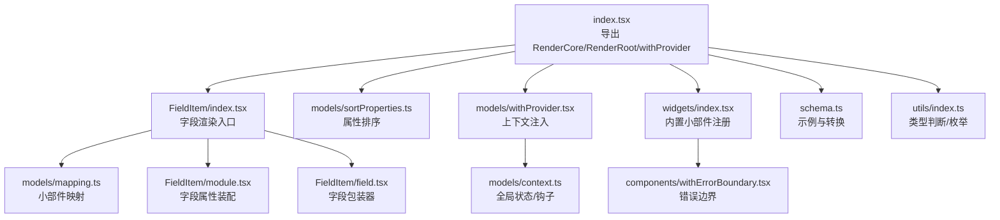
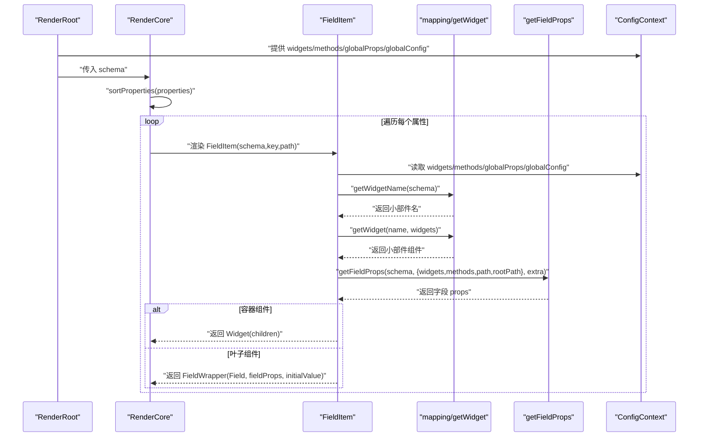
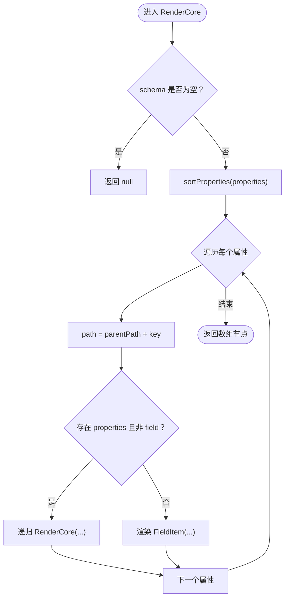
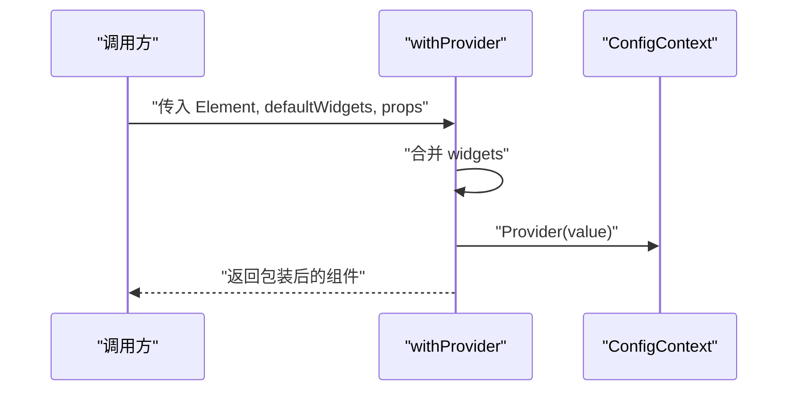
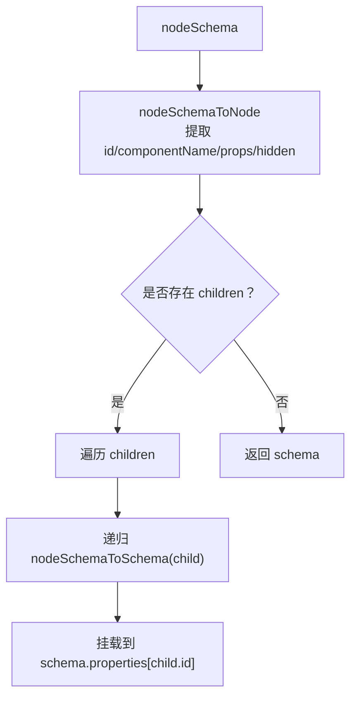
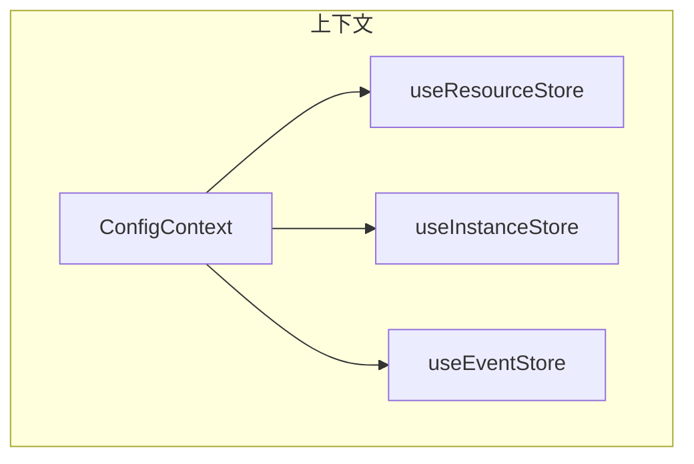
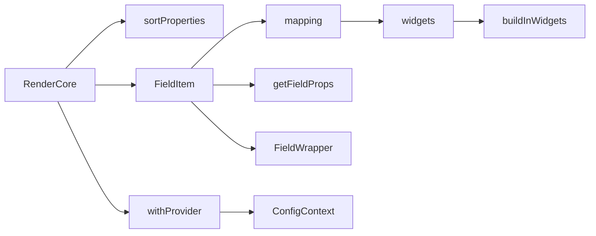

# 渲染核心架构

<cite>
**本文引用的文件**
- [common/render-core/index.tsx](file://common/render-core/index.tsx)
- [common/render-core/schema.ts](file://common/render-core/schema.ts)
- [common/render-core/FieldItem/index.tsx](file://common/render-core/FieldItem/index.tsx)
- [common/render-core/FieldItem/field.tsx](file://common/render-core/FieldItem/field.tsx)
- [common/render-core/FieldItem/module.tsx](file://common/render-core/FieldItem/module.tsx)
- [common/render-core/models/withProvider.tsx](file://common/render-core/models/withProvider.tsx)
- [common/render-core/models/context.ts](file://common/render-core/models/context.ts)
- [common/render-core/models/mapping.ts](file://common/render-core/models/mapping.ts)
- [common/render-core/models/sortProperties.ts](file://common/render-core/models/sortProperties.ts)
- [common/render-core/widgets/index.tsx](file://common/render-core/widgets/index.tsx)
- [common/render-core/utils/index.ts](file://common/render-core/utils/index.ts)
- [common/render-core/components/withErrorBoundary.tsx](file://common/render-core/components/withErrorBoundary.tsx)
- [common/render-core/demo.tsx](file://common/render-core/demo.tsx)
- [common/render-context/src/index.ts](file://common/render-context/src/index.ts)
</cite>

## 目录
1. [引言](#引言)
2. [项目结构](#项目结构)
3. [核心组件](#核心组件)
4. [架构总览](#架构总览)
5. [详细组件分析](#详细组件分析)
6. [依赖关系分析](#依赖关系分析)
7. [性能考量](#性能考量)
8. [故障排查指南](#故障排查指南)
9. [结论](#结论)
10. [附录](#附录)

## 引言
本技术文档围绕渲染核心架构展开，系统性阐述 RenderCore 的设计理念与实现原理，重点覆盖以下方面：
- Schema 解析机制：如何从节点树 schema 转换为可渲染的属性树，并按顺序排序。
- 组件渲染管道：从根节点到字段项的递归渲染流程，以及容器组件与叶子组件的差异化处理。
- 上下文传递系统：配置上下文、资源上报、事件序列、实例连接等全局状态的组织与消费。
- FieldItem 的职责与实现：如何根据 schema 选择小部件、组装字段属性、处理初始值与容器包装。
- withProvider 高阶组件：如何合并默认小部件与用户注入的小部件，统一注入配置上下文。
- 性能优化最佳实践：虚拟化、懒加载与缓存策略建议。
- 扩展指引：如何新增小部件、注册内置小部件、接入上下文钩子。

## 项目结构
渲染核心位于 common/render-core，采用“模型-视图-上下文-工具”分层组织：
- 核心入口与导出：index.tsx 提供 RenderCore、RenderRoot、withProvider 等对外 API。
- Schema 定义与转换：schema.ts 提供示例 schema 与 nodeSchema 到 schema 的转换函数。
- 字段渲染：FieldItem 目录负责字段选择、属性装配、容器包装与初始值处理。
- 上下文与状态：models 目录提供 withProvider、mapping、sortProperties、context 等。
- 小部件注册：widgets/index.tsx 汇总内置小部件并生成带错误边界的内置集合。
- 工具与辅助：utils 提供类型判断与枚举；components 提供错误边界高阶组件；demo 展示用法。



图表来源
- [common/render-core/index.tsx:1-76](file://common/render-core/index.tsx#L1-L76)
- [common/render-core/FieldItem/index.tsx:1-61](file://common/render-core/FieldItem/index.tsx#L1-L61)
- [common/render-core/models/sortProperties.ts:1-29](file://common/render-core/models/sortProperties.ts#L1-L29)
- [common/render-core/models/withProvider.tsx:1-31](file://common/render-core/models/withProvider.tsx#L1-L31)
- [common/render-core/widgets/index.tsx:1-130](file://common/render-core/widgets/index.tsx#L1-L130)
- [common/render-core/models/mapping.ts:1-92](file://common/render-core/models/mapping.ts#L1-L92)
- [common/render-core/FieldItem/module.tsx:1-110](file://common/render-core/FieldItem/module.tsx#L1-L110)
- [common/render-core/FieldItem/field.tsx:1-19](file://common/render-core/FieldItem/field.tsx#L1-L19)
- [common/render-core/schema.ts:1-145](file://common/render-core/schema.ts#L1-L145)
- [common/render-core/models/context.ts:1-226](file://common/render-core/models/context.ts#L1-L226)
- [common/render-core/utils/index.ts:1-40](file://common/render-core/utils/index.ts#L1-L40)
- [common/render-core/components/withErrorBoundary.tsx:1-47](file://common/render-core/components/withErrorBoundary.tsx#L1-L47)

章节来源
- [common/render-core/index.tsx:1-76](file://common/render-core/index.tsx#L1-L76)
- [common/render-core/schema.ts:1-145](file://common/render-core/schema.ts#L1-L145)

## 核心组件
- RenderCore：递归渲染 schema.properties，按顺序输出 FieldItem 列表。
- FieldItem：根据 schema 选择小部件，装配字段属性，处理容器与叶子组件差异。
- withProvider：将默认小部件与用户注入小部件合并，注入配置上下文。
- 小部件映射：基于 schema 的 type/format/readOnly 等规则选择具体小部件。
- 字段属性装配：将 schema、路径、全局配置、动态方法等组合为最终 props。
- 上下文系统：资源上报、事件序列、实例连接、页面级存储等。

章节来源
- [common/render-core/index.tsx:52-76](file://common/render-core/index.tsx#L52-L76)
- [common/render-core/FieldItem/index.tsx:7-61](file://common/render-core/FieldItem/index.tsx#L7-L61)
- [common/render-core/models/withProvider.tsx:4-31](file://common/render-core/models/withProvider.tsx#L4-L31)
- [common/render-core/models/mapping.ts:42-92](file://common/render-core/models/mapping.ts#L42-L92)
- [common/render-core/FieldItem/module.tsx:52-109](file://common/render-core/FieldItem/module.tsx#L52-L109)
- [common/render-core/models/context.ts:1-226](file://common/render-core/models/context.ts#L1-L226)

## 架构总览
渲染核心采用“Schema → 字段 → 小部件”的三层渲染管线：
- Schema 解析：将节点树 schema 转换为属性树，支持 children 递归展开。
- 字段选择：根据 schema 的 ui:widget、type、format、readOnly 等决定小部件名。
- 属性装配：合并 schema.props、全局 props、动态 methods、路径信息等。
- 上下文注入：通过 withProvider 注入 widgets、methods、globalProps、globalConfig。
- 渲染输出：容器组件包裹子节点，叶子组件直接渲染并支持初始值设置。



图表来源
- [common/render-core/index.tsx:52-76](file://common/render-core/index.tsx#L52-L76)
- [common/render-core/FieldItem/index.tsx:7-61](file://common/render-core/FieldItem/index.tsx#L7-L61)
- [common/render-core/models/mapping.ts:42-92](file://common/render-core/models/mapping.ts#L42-L92)
- [common/render-core/FieldItem/module.tsx:52-109](file://common/render-core/FieldItem/module.tsx#L52-L109)
- [common/render-core/models/withProvider.tsx:4-31](file://common/render-core/models/withProvider.tsx#L4-L31)
- [common/render-core/models/context.ts:1-226](file://common/render-core/models/context.ts#L1-L226)

## 详细组件分析

### RenderCore 与渲染管道
- 设计理念：将 schema.properties 视为“字段集合”，通过 sortProperties 排序后逐个渲染为 FieldItem。
- 控制流：空 schema 返回 null；非对象属性直接跳过；容器属性递归调用 RenderCore。
- 路径传递：父级 parentPath 与当前 key 组合形成 path，用于后续字段属性计算与事件定位。



图表来源
- [common/render-core/index.tsx:52-65](file://common/render-core/index.tsx#L52-L65)
- [common/render-core/models/sortProperties.ts:1-29](file://common/render-core/models/sortProperties.ts#L1-L29)

章节来源
- [common/render-core/index.tsx:52-65](file://common/render-core/index.tsx#L52-L65)
- [common/render-core/models/sortProperties.ts:1-29](file://common/render-core/models/sortProperties.ts#L1-L29)

### FieldItem：字段选择与属性装配
- 小部件选择：优先使用 schema 的 ui:widget/widget；否则根据 type/format/readOnly 映射。
- 容器与叶子：若 schema.type 为 void 或存在 children，则作为容器渲染；否则使用 FieldWrapper 包装。
- 属性装配：getFieldProps 合并 schema.props、extra（含 pathObj、globalProps、globalConfig）、methods，并支持动态方法映射与自定义组件插槽。
- 初始值：叶子组件在挂载时根据 initialValue 触发 onChange，确保初始状态一致。

```mermaid
classDiagram
class FieldItem {
+props : RenderItemProps
+render() : ReactNode
}
class mapping {
+getWidgetName(schema) : string
+getWidget(name, widgets) : Component
}
class FieldWrapper {
+props : { Field, fieldProps, initialValue }
+render() : JSX.Element
}
class getFieldProps {
+call(schema, ctx, extra) : fieldProps
}
FieldItem --> mapping : "选择小部件"
FieldItem --> getFieldProps : "装配字段属性"
FieldItem --> FieldWrapper : "容器/叶子包装"
```

图表来源
- [common/render-core/FieldItem/index.tsx:7-61](file://common/render-core/FieldItem/index.tsx#L7-L61)
- [common/render-core/models/mapping.ts:42-92](file://common/render-core/models/mapping.ts#L42-L92)
- [common/render-core/FieldItem/module.tsx:52-109](file://common/render-core/FieldItem/module.tsx#L52-L109)
- [common/render-core/FieldItem/field.tsx:4-19](file://common/render-core/FieldItem/field.tsx#L4-L19)

章节来源
- [common/render-core/FieldItem/index.tsx:7-61](file://common/render-core/FieldItem/index.tsx#L7-L61)
- [common/render-core/FieldItem/module.tsx:52-109](file://common/render-core/FieldItem/module.tsx#L52-L109)
- [common/render-core/FieldItem/field.tsx:4-19](file://common/render-core/FieldItem/field.tsx#L4-L19)
- [common/render-core/models/mapping.ts:42-92](file://common/render-core/models/mapping.ts#L42-L92)

### withProvider：上下文注入与小部件注册
- 合并策略：将 defaultWidgets 与用户传入 widgets 浅合并，后者优先。
- 上下文提供：向 ConfigContext 注入 widgets、methods、globalProps、globalConfig。
- 内置小部件：buildInWidgets 使用 withErrorBoundary 包裹，提升稳定性。



图表来源
- [common/render-core/models/withProvider.tsx:4-31](file://common/render-core/models/withProvider.tsx#L4-L31)
- [common/render-core/widgets/index.tsx:115-130](file://common/render-core/widgets/index.tsx#L115-L130)

章节来源
- [common/render-core/models/withProvider.tsx:4-31](file://common/render-core/models/withProvider.tsx#L4-L31)
- [common/render-core/widgets/index.tsx:115-130](file://common/render-core/widgets/index.tsx#L115-L130)

### Schema 解析与转换
- 示例 schema：提供 ui:widget、props、properties 等基础结构。
- 节点树到属性树：nodeSchemaToSchema 递归将 children 展开为 properties，保留 id、componentName、props、hidden 等字段。
- 转换注意：schema 的 ui:widget 对应小部件名，props 透传给小部件，children 作为容器属性处理。



图表来源
- [common/render-core/schema.ts:124-145](file://common/render-core/schema.ts#L124-L145)

章节来源
- [common/render-core/schema.ts:1-145](file://common/render-core/schema.ts#L1-L145)

### 上下文与状态管理
- ConfigContext：提供 widgets、methods、globalProps、globalConfig。
- 资源上报：useResourceStore 维护资源列表，支持 ADD/UPDATE/REMOVE 动作。
- 实例连接：useInstanceStore 记录组件实例，useConnect 按需订阅指定实例。
- 事件序列：useEventStore 管理消息队列与控制器注册，支持 sender/receiver 模式。
- 页面级存储：genPageResource 创建页面级资源存储。



图表来源
- [common/render-core/models/context.ts:1-226](file://common/render-core/models/context.ts#L1-L226)

章节来源
- [common/render-core/models/context.ts:1-226](file://common/render-core/models/context.ts#L1-L226)

### 小部件映射与注册
- 映射规则：基于 type/format/readOnly 与通配符组合匹配小部件名。
- 名称规范化：getWidget 支持首字母大写与 Html 回退。
- 内置小部件：widgets/index.tsx 汇总各组件并导出 buildInWidgets（带错误边界）。

章节来源
- [common/render-core/models/mapping.ts:1-92](file://common/render-core/models/mapping.ts#L1-L92)
- [common/render-core/widgets/index.tsx:1-130](file://common/render-core/widgets/index.tsx#L1-L130)

### 字段属性装配细节
- 路径计算：getPathObj 基于 rootPath 与 path 生成 dataIndex、dataPath、schemaPath。
- 动态方法：schema.methods 中键名映射到 methods 中的具体函数。
- 插槽组件：addonAfter 若为对象，按 widget 名查找并渲染。
- 全局 props：额外透传全局 props，支持以“...props”结尾的键名。

章节来源
- [common/render-core/FieldItem/module.tsx:1-110](file://common/render-core/FieldItem/module.tsx#L1-L110)
- [common/render-core/utils/index.ts:1-40](file://common/render-core/utils/index.ts#L1-L40)

### 错误边界与稳定性
- withErrorBoundary：为小部件提供错误捕获与降级提示。
- buildInWidgets：自动包裹所有内置小部件，避免单点错误影响整体渲染。

章节来源
- [common/render-core/components/withErrorBoundary.tsx:1-47](file://common/render-core/components/withErrorBoundary.tsx#L1-L47)
- [common/render-core/widgets/index.tsx:115-130](file://common/render-core/widgets/index.tsx#L115-L130)

## 依赖关系分析
- RenderCore 依赖：sortProperties、FieldItem、withProvider、widgets、mapping。
- FieldItem 依赖：mapping、context（ConfigContext）、FieldWrapper、getFieldProps。
- 上下文依赖：hox createStore/createGlobalStore 提供全局状态与订阅。
- 小部件依赖：@slide/render-components、@ld/slide-editor、@slide/slide-shape。



图表来源
- [common/render-core/index.tsx:52-76](file://common/render-core/index.tsx#L52-L76)
- [common/render-core/FieldItem/index.tsx:1-61](file://common/render-core/FieldItem/index.tsx#L1-L61)
- [common/render-core/models/mapping.ts:1-92](file://common/render-core/models/mapping.ts#L1-L92)
- [common/render-core/FieldItem/module.tsx:1-110](file://common/render-core/FieldItem/module.tsx#L1-L110)
- [common/render-core/FieldItem/field.tsx:1-19](file://common/render-core/FieldItem/field.tsx#L1-L19)
- [common/render-core/models/withProvider.tsx:1-31](file://common/render-core/models/withProvider.tsx#L1-L31)
- [common/render-core/widgets/index.tsx:1-130](file://common/render-core/widgets/index.tsx#L1-L130)

章节来源
- [common/render-core/index.tsx:1-76](file://common/render-core/index.tsx#L1-L76)
- [common/render-core/FieldItem/index.tsx:1-61](file://common/render-core/FieldItem/index.tsx#L1-L61)
- [common/render-core/models/withProvider.tsx:1-31](file://common/render-core/models/withProvider.tsx#L1-L31)
- [common/render-core/widgets/index.tsx:1-130](file://common/render-core/widgets/index.tsx#L1-L130)

## 性能考量
- 虚拟化：对长列表容器组件（如属性面板）建议使用固定高度与可视区域渲染，减少 DOM 数量。
- 懒加载：对重型小部件（如富文本、视频）采用延迟挂载与条件渲染，仅在可见时初始化。
- 缓存策略：对路径计算与映射结果进行轻量缓存，避免重复计算；对资源上报去重（已内置）。
- 渲染粒度：合理拆分容器与叶子组件，减少不必要的重渲染；使用 React.memo 包裹稳定组件。
- 事件与状态：使用 useEventStore 与 useResourceStore 的细粒度订阅，避免全量刷新。

## 故障排查指南
- 组件未找到：检查 schema.ui:widget 与 mapping 是否匹配；确认 widgets 中是否注册该小部件。
- 属性未生效：核对 schema.props 与全局 props 的键名是否以“...props”结尾；确认动态方法映射是否正确。
- 资源上报异常：检查 useResourceStore 的 dispatch 类型与 payload 结构；确保 isSameResource 判定逻辑符合预期。
- 事件序列不同步：确认 registerMsg 的 id、msgName、msgType、pageId 是否一致；检查消息队列与控制器注册时机。
- 错误边界：内置错误边界会捕获异常并显示降级内容，便于快速定位问题组件。

章节来源
- [common/render-core/models/context.ts:59-93](file://common/render-core/models/context.ts#L59-L93)
- [common/render-core/components/withErrorBoundary.tsx:1-47](file://common/render-core/components/withErrorBoundary.tsx#L1-L47)

## 结论
渲染核心通过“Schema → 字段 → 小部件”的清晰分层，实现了可扩展、可维护的渲染体系。withProvider 提供统一上下文注入，mapping 与 getFieldProps 确保属性装配灵活可控，上下文钩子支撑资源上报、事件序列与实例连接等高级能力。结合虚拟化、懒加载与缓存策略，可在复杂场景下保持良好性能与稳定性。

## 附录

### 示例：如何扩展渲染核心功能
- 新增小部件
  - 在 widgets/index.tsx 中添加新组件并导出。
  - 如需全局错误边界，保持与现有小部件一致的命名与签名。
  - 参考路径：[common/render-core/widgets/index.tsx:8-130](file://common/render-core/widgets/index.tsx#L8-L130)
- 注册内置小部件
  - 使用 buildInWidgets 自动包裹 withErrorBoundary，保证稳定性。
  - 参考路径：[common/render-core/widgets/index.tsx:115-130](file://common/render-core/widgets/index.tsx#L115-L130)
- 扩展映射规则
  - 在 mapping.ts 中增加 type/format 组合映射，或扩展 getWidgetName 的匹配逻辑。
  - 参考路径：[common/render-core/models/mapping.ts:1-92](file://common/render-core/models/mapping.ts#L1-L92)
- 自定义字段属性
  - 在 getFieldProps 中扩展额外字段或插槽组件渲染逻辑。
  - 参考路径：[common/render-core/FieldItem/module.tsx:52-109](file://common/render-core/FieldItem/module.tsx#L52-L109)
- 使用上下文钩子
  - 在组件中使用 useResourceStore、useEventStore、useConnect 等钩子。
  - 参考路径：[common/render-core/models/context.ts:95-225](file://common/render-core/models/context.ts#L95-L225)
- 示例应用
  - 参考 demo.tsx 中 RenderRoot 的使用方式与 schema 转换。
  - 参考路径：[common/render-core/demo.tsx:14-32](file://common/render-core/demo.tsx#L14-L32)