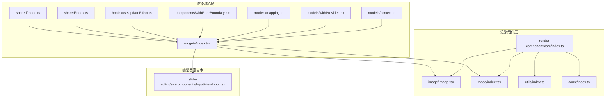
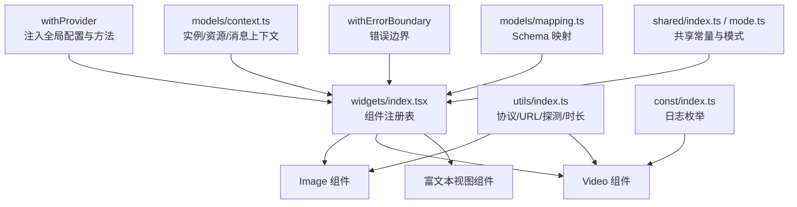
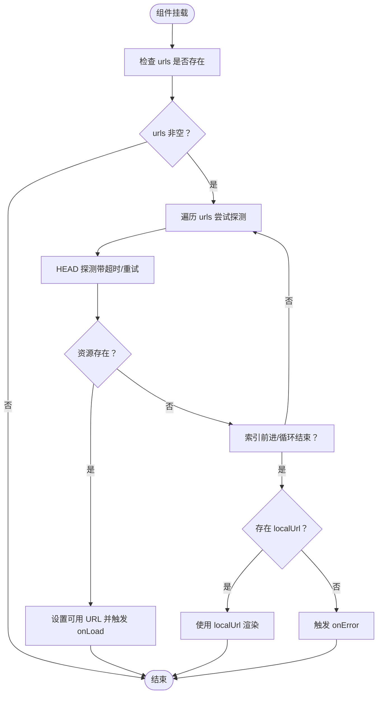
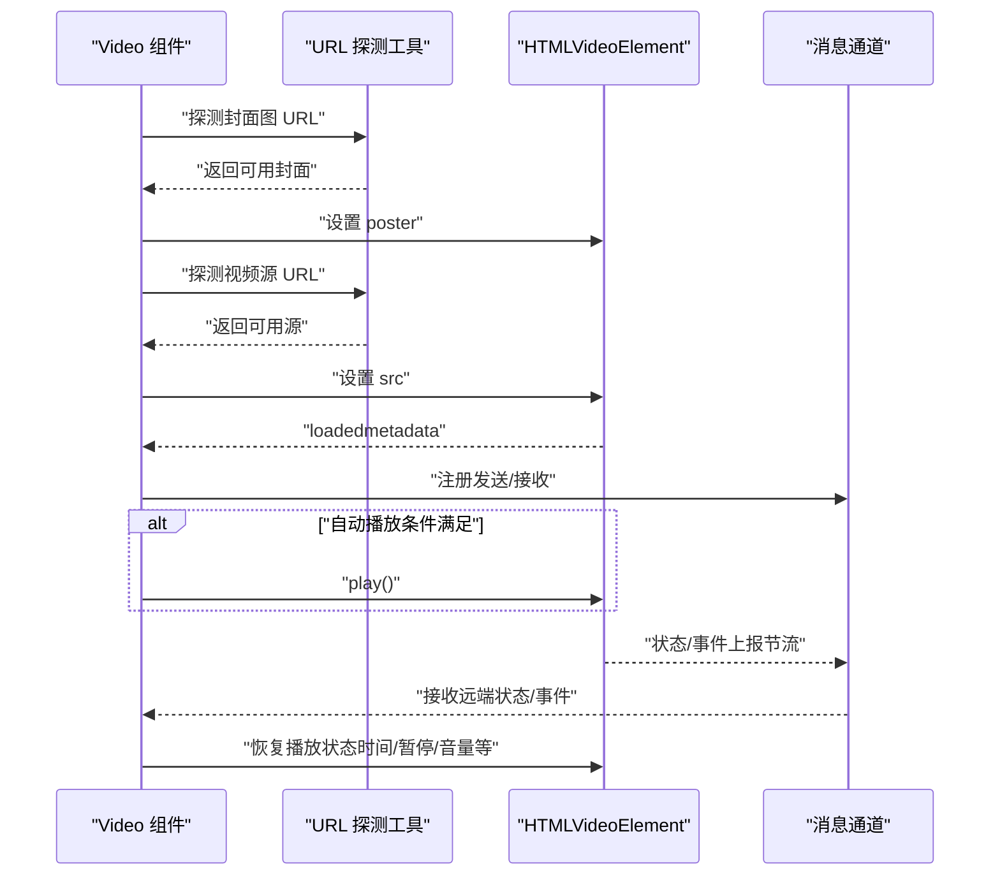
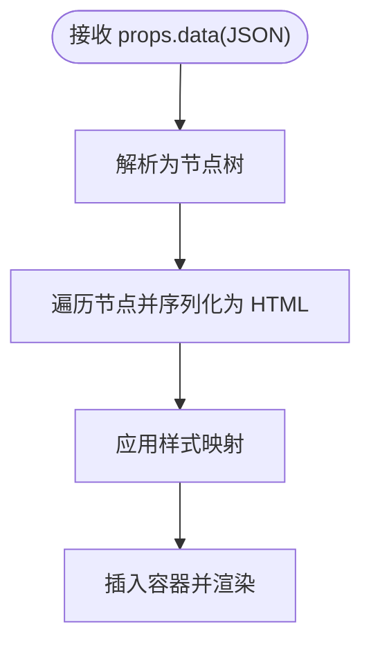
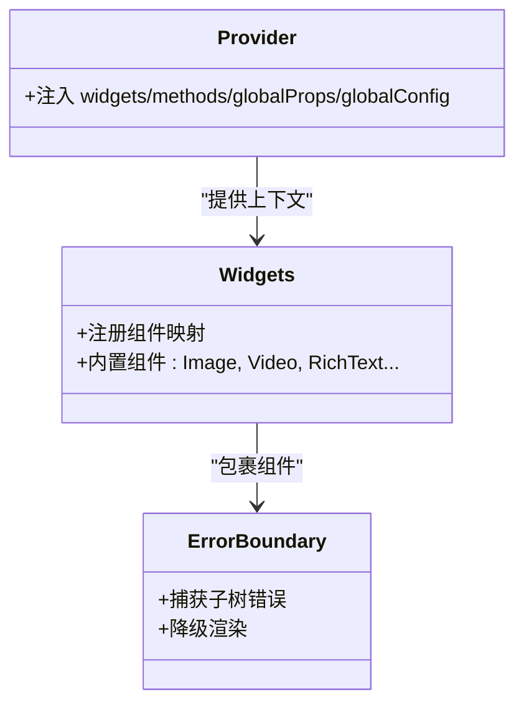
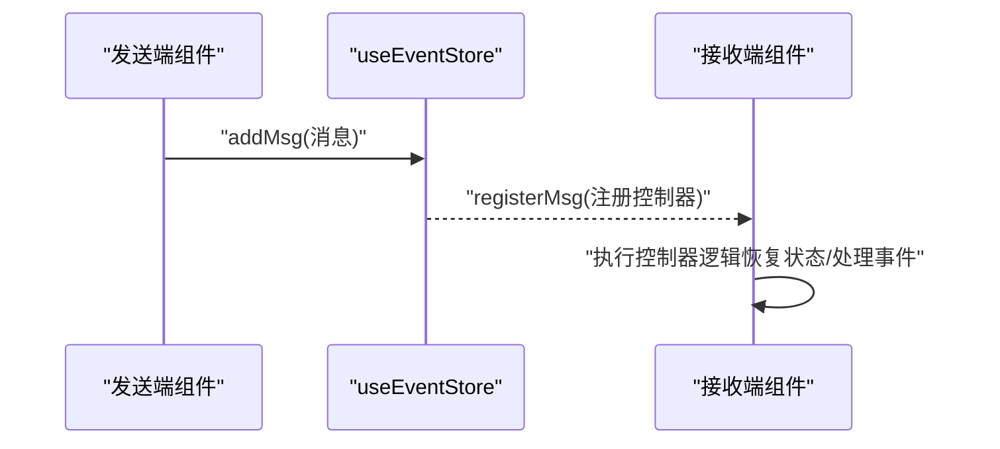
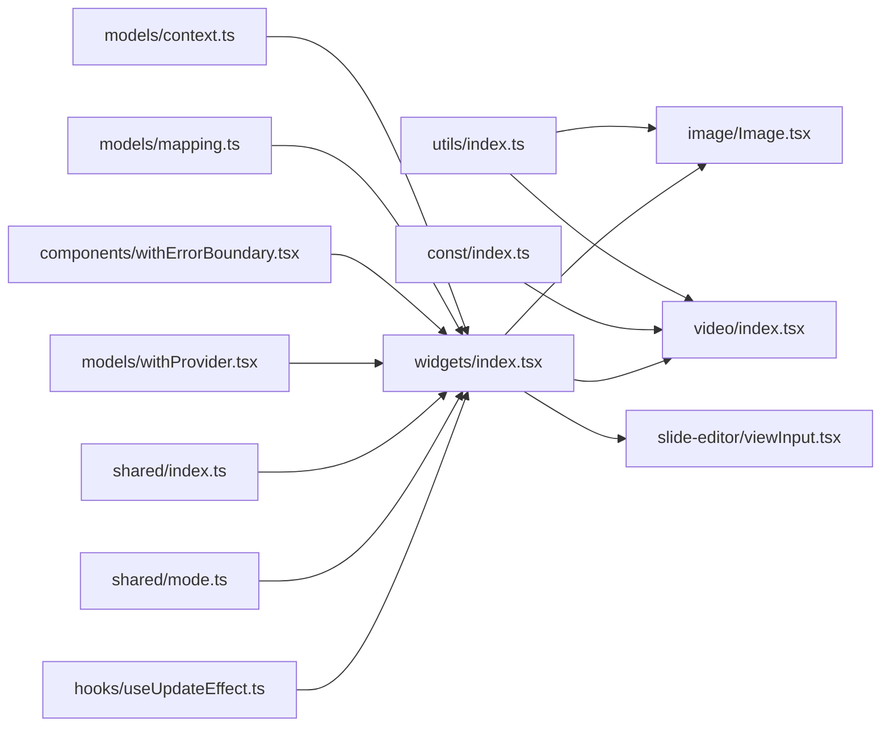

# 组件系统

<cite>
**本文引用的文件**
- [common/render-components/src/index.ts](file://common/render-components/src/index.ts)
- [common/render-components/src/image/Image.tsx](file://common/render-components/src/image/Image.tsx)
- [common/render-components/src/video/index.tsx](file://common/render-components/src/video/index.tsx)
- [common/render-components/src/utils/index.ts](file://common/render-components/src/utils/index.ts)
- [common/render-components/src/const/index.ts](file://common/render-components/src/const/index.ts)
- [common/render-core/models/context.ts](file://common/render-core/models/context.ts)
- [common/render-core/models/mapping.ts](file://common/render-core/models/mapping.ts)
- [common/render-core/models/withProvider.tsx](file://common/render-core/models/withProvider.tsx)
- [common/render-core/widgets/index.tsx](file://common/render-core/widgets/index.tsx)
- [common/render-core/components/withErrorBoundary.tsx](file://common/render-core/components/withErrorBoundary.tsx)
- [common/render-core/hooks/useUpdateEffect.ts](file://common/render-core/hooks/useUpdateEffect.ts)
- [common/render-core/shared/index.ts](file://common/render-core/shared/index.ts)
- [common/render-core/shared/mode.ts](file://common/render-core/shared/mode.ts)
- [common/slide-editor/src/components/Input/viewInput.tsx](file://common/slide-editor/src/components/Input/viewInput.tsx)
</cite>

## 目录
1. [简介](#简介)
2. [项目结构](#项目结构)
3. [核心组件](#核心组件)
4. [架构总览](#架构总览)
5. [详细组件分析](#详细组件分析)
6. [依赖关系分析](#依赖关系分析)
7. [性能考量](#性能考量)
8. [故障排查指南](#故障排查指南)
9. [结论](#结论)
10. [附录](#附录)

## 简介
本技术文档围绕渲染组件系统展开，重点覆盖 Image、Video、Text（富文本）等基础组件的设计与实现，系统性阐述组件生命周期管理、属性校验与错误处理机制、组件间通信与数据传递模式、可扩展性设计（自定义组件注册与使用）、以及性能优化策略（渲染优化、内存管理与资源释放）。文档同时提供组件开发示例与最佳实践，帮助开发者快速上手并高质量扩展组件体系。

## 项目结构
渲染组件系统主要分布在以下模块：
- 渲染组件层：提供 Image、Video、工具与常量等基础能力
- 渲染核心层：提供上下文、消息与资源上报、组件注册与错误边界等通用能力
- 编辑器富文本：提供富文本视图组件，用于预览与编辑场景

图表来源
- [common/render-components/src/index.ts:1-3](file://common/render-components/src/index.ts#L1-L3)
- [common/render-components/src/image/Image.tsx:1-48](file://common/render-components/src/image/Image.tsx#L1-L48)
- [common/render-components/src/video/index.tsx:1-472](file://common/render-components/src/video/index.tsx#L1-L472)
- [common/render-components/src/utils/index.ts:1-236](file://common/render-components/src/utils/index.ts#L1-L236)
- [common/render-components/src/const/index.ts:1-29](file://common/render-components/src/const/index.ts#L1-L29)
- [common/render-core/widgets/index.tsx:1-130](file://common/render-core/widgets/index.tsx#L1-L130)
- [common/render-core/models/context.ts:1-226](file://common/render-core/models/context.ts#L1-L226)
- [common/render-core/models/mapping.ts:1-92](file://common/render-core/models/mapping.ts#L1-L92)
- [common/render-core/models/withProvider.tsx:1-31](file://common/render-core/models/withProvider.tsx#L1-L31)
- [common/render-core/components/withErrorBoundary.tsx:1-47](file://common/render-core/components/withErrorBoundary.tsx#L1-L47)
- [common/render-core/hooks/useUpdateEffect.ts:1-20](file://common/render-core/hooks/useUpdateEffect.ts#L1-L20)
- [common/render-core/shared/index.ts:1-11](file://common/render-core/shared/index.ts#L1-L11)
- [common/render-core/shared/mode.ts:1-4](file://common/render-core/shared/mode.ts#L1-L4)
- [common/slide-editor/src/components/Input/viewInput.tsx:1-82](file://common/slide-editor/src/components/Input/viewInput.tsx#L1-L82)

章节来源
- [common/render-components/src/index.ts:1-3](file://common/render-components/src/index.ts#L1-L3)
- [common/render-core/widgets/index.tsx:1-130](file://common/render-core/widgets/index.tsx#L1-L130)

## 核心组件
- Image 组件：支持多 URL 轮询、超时与重试、本地回退、错误回调与加载回调，具备健壮的资源可用性检测与容错机制。
- Video 组件：支持多源轮询、封面图轮询、自动播放策略、播放状态同步与恢复、事件埋点与日志上报、跨端可见性与先行课模式适配。
- 富文本组件：基于 JSON 结构序列化渲染，支持样式映射与标签映射，提供预览态 HTML 输出。
- 工具与常量：统一协议识别、URL 构造、远程资源探测、视频时长查询、日志枚举等。
- 上下文与消息：全局配置注入、组件实例注册与卸载、资源上报、消息队列与控制器注册、错误边界包裹。

章节来源
- [common/render-components/src/image/Image.tsx:12-48](file://common/render-components/src/image/Image.tsx#L12-L48)
- [common/render-components/src/video/index.tsx:16-472](file://common/render-components/src/video/index.tsx#L16-L472)
- [common/render-components/src/utils/index.ts:115-236](file://common/render-components/src/utils/index.ts#L115-L236)
- [common/render-core/models/context.ts:1-226](file://common/render-core/models/context.ts#L1-L226)
- [common/render-core/widgets/index.tsx:8-130](file://common/render-core/widgets/index.tsx#L8-L130)

## 架构总览
组件系统采用“组件层 + 核心层 + 编辑器层”的分层设计。组件层提供具体渲染组件；核心层提供上下文、消息与资源管理、组件注册与错误处理；编辑器层提供富文本视图组件。组件通过 Provider 注入全局配置，通过消息通道实现 sender/receiver 之间的状态同步与事件广播。

图表来源
- [common/render-core/models/withProvider.tsx:4-31](file://common/render-core/models/withProvider.tsx#L4-L31)
- [common/render-core/widgets/index.tsx:8-130](file://common/render-core/widgets/index.tsx#L8-L130)
- [common/render-core/models/context.ts:1-226](file://common/render-core/models/context.ts#L1-L226)
- [common/render-core/models/mapping.ts:42-92](file://common/render-core/models/mapping.ts#L42-L92)
- [common/render-core/shared/index.ts:5-11](file://common/render-core/shared/index.ts#L5-L11)
- [common/render-core/shared/mode.ts:1-4](file://common/render-core/shared/mode.ts#L1-L4)
- [common/render-components/src/utils/index.ts:1-236](file://common/render-components/src/utils/index.ts#L1-L236)
- [common/render-components/src/const/index.ts:1-29](file://common/render-components/src/const/index.ts#L1-L29)

## 详细组件分析

### Image 组件
- 设计要点
  - 多 URL 轮询：从 urls 数组按序尝试，命中即停止并触发 onLoad。
  - 资源探测：基于 HEAD 请求与超时/重试策略，提升网络不稳定环境下的成功率。
  - 错误处理：逐个尝试失败后触发 onError；支持本地回退（localUrl）。
  - 生命周期：首次挂载时启动 URL 选择流程；依赖 urls 变更重试。
- 属性与行为
  - onLoad(url)：资源可用时回调，携带最终可用 URL。
  - onError(event)：资源全部不可用时回调。
  - urls：候选 URL 列表。
  - style/localUrl：样式与本地回退地址。
- 性能与可靠性
  - 超时与重试参数可调，避免长时间阻塞。
  - 仅在必要时渲染 img 标签，减少无效 DOM。

图表来源
- [common/render-components/src/image/Image.tsx:12-48](file://common/render-components/src/image/Image.tsx#L12-L48)
- [common/render-components/src/utils/index.ts:129-157](file://common/render-components/src/utils/index.ts#L129-L157)

章节来源
- [common/render-components/src/image/Image.tsx:12-48](file://common/render-components/src/image/Image.tsx#L12-L48)
- [common/render-components/src/utils/index.ts:115-157](file://common/render-components/src/utils/index.ts#L115-L157)

### Video 组件
- 设计要点
  - 多源与封面轮询：分别对视频源与封面图进行探测与回退。
  - 自动播放策略：根据角色（sender/preview/edit）、先行课模式与页面可见性动态决定是否自动播放。
  - 状态同步与恢复：通过消息通道发送/接收播放状态，进行时间轴、暂停/播放、音量/静音等同步。
  - 事件埋点：对播放事件、消息收发、资源加载进行日志上报。
- 关键流程
  - 初始化：构造视频与封面 URL 列表，设置封面与源。
  - 播放准备：监听 metadata 加载完成，注册消息发送与接收，按需自动播放。
  - 状态恢复：在 canPlay 之前暂存消息，待可播放后消费并恢复本地状态。
  - 可见性与先行课：页面可见性变化时控制播放/暂停。
- 性能与可靠性
  - 使用节流同步时间更新事件，降低频繁通知开销。
  - 对卡顿事件进行自动重试播放，提升稳定性。
  - 严格的时间同步阈值与强制更新策略，避免漂移。

图表来源
- [common/render-components/src/video/index.tsx:16-472](file://common/render-components/src/video/index.tsx#L16-L472)
- [common/render-components/src/utils/index.ts:159-208](file://common/render-components/src/utils/index.ts#L159-L208)
- [common/render-components/src/const/index.ts:1-29](file://common/render-components/src/const/index.ts#L1-L29)

章节来源
- [common/render-components/src/video/index.tsx:16-472](file://common/render-components/src/video/index.tsx#L16-L472)
- [common/render-components/src/utils/index.ts:159-208](file://common/render-components/src/utils/index.ts#L159-L208)
- [common/render-components/src/const/index.ts:1-29](file://common/render-components/src/const/index.ts#L1-L29)

### 富文本组件（Text）
- 设计要点
  - JSON 数据结构驱动：支持段落、样式、文本节点等结构化数据。
  - 样式与标签映射：将内部样式键映射为 CSS 属性，标签映射为 HTML 标签。
  - 预览渲染：将结构序列化为 HTML 片段，嵌入容器内进行渲染。
- 生命周期
  - 初始化：解析 props.data 为 JSON 结构，注册组件实例以便编辑器联动。
  - 渲染：递归序列化节点，生成合法 HTML。
- 可扩展性
  - 支持新增标签与样式键，通过映射表扩展。

图表来源
- [common/slide-editor/src/components/Input/viewInput.tsx:10-82](file://common/slide-editor/src/components/Input/viewInput.tsx#L10-L82)

章节来源
- [common/slide-editor/src/components/Input/viewInput.tsx:10-82](file://common/slide-editor/src/components/Input/viewInput.tsx#L10-L82)

### 组件注册与错误边界
- 组件注册
  - widgets/index.tsx 定义内置组件映射（如 Image、Video、富文本等），并通过 withErrorBoundary 包裹，确保单个组件异常不影响整体渲染。
- 错误边界
  - withErrorBoundary 提供类组件错误边界，捕获子树错误并降级显示提示。
- Provider 注入
  - withProvider 将 widgets、methods、globalProps、globalConfig 注入上下文，供组件树访问。

图表来源
- [common/render-core/widgets/index.tsx:8-130](file://common/render-core/widgets/index.tsx#L8-L130)
- [common/render-core/components/withErrorBoundary.tsx:8-47](file://common/render-core/components/withErrorBoundary.tsx#L8-L47)
- [common/render-core/models/withProvider.tsx:4-31](file://common/render-core/models/withProvider.tsx#L4-L31)

章节来源
- [common/render-core/widgets/index.tsx:8-130](file://common/render-core/widgets/index.tsx#L8-L130)
- [common/render-core/components/withErrorBoundary.tsx:8-47](file://common/render-core/components/withErrorBoundary.tsx#L8-L47)
- [common/render-core/models/withProvider.tsx:4-31](file://common/render-core/models/withProvider.tsx#L4-L31)

### 上下文与消息系统
- 实例管理
  - useInstanceStore：维护组件实例映射，支持注册与卸载，便于跨组件联动。
- 资源上报
  - useResourceStore：集中管理资源上报状态（添加/更新/移除），避免重复上报。
- 消息队列与控制器
  - useEventStore：提供消息序列记录、注册控制器、缓存回放能力，支持 sender/receiver 模式。
- 与 Provider 的协作
  - withProvider 将上述上下文注入，使组件在树内共享状态与能力。

图表来源
- [common/render-core/models/context.ts:158-225](file://common/render-core/models/context.ts#L158-L225)

章节来源
- [common/render-core/models/context.ts:1-226](file://common/render-core/models/context.ts#L1-L226)

## 依赖关系分析
- 组件层依赖
  - Image/Video 依赖 utils（协议/URL/探测/时长）与 const（日志枚举）。
  - widgets/index.tsx 依赖 render-components 与编辑器富文本组件。
- 核心层依赖
  - widgets/index.tsx 依赖 models/context、models/mapping、shared、components/withErrorBoundary、hooks/useUpdateEffect。
- 编辑器富文本
  - viewInput 依赖 useConnect 进行实例注册，配合编辑器进行联动。

图表来源
- [common/render-components/src/utils/index.ts:1-236](file://common/render-components/src/utils/index.ts#L1-L236)
- [common/render-components/src/const/index.ts:1-29](file://common/render-components/src/const/index.ts#L1-L29)
- [common/render-core/widgets/index.tsx:8-130](file://common/render-core/widgets/index.tsx#L8-L130)
- [common/render-core/models/context.ts:1-226](file://common/render-core/models/context.ts#L1-L226)
- [common/render-core/models/mapping.ts:42-92](file://common/render-core/models/mapping.ts#L42-L92)
- [common/render-core/components/withErrorBoundary.tsx:8-47](file://common/render-core/components/withErrorBoundary.tsx#L8-L47)
- [common/render-core/models/withProvider.tsx:4-31](file://common/render-core/models/withProvider.tsx#L4-L31)
- [common/render-core/shared/index.ts:5-11](file://common/render-core/shared/index.ts#L5-L11)
- [common/render-core/shared/mode.ts:1-4](file://common/render-core/shared/mode.ts#L1-L4)
- [common/render-core/hooks/useUpdateEffect.ts:1-20](file://common/render-core/hooks/useUpdateEffect.ts#L1-L20)
- [common/slide-editor/src/components/Input/viewInput.tsx:10-82](file://common/slide-editor/src/components/Input/viewInput.tsx#L10-L82)

章节来源
- [common/render-core/models/mapping.ts:42-92](file://common/render-core/models/mapping.ts#L42-L92)
- [common/render-core/shared/index.ts:5-11](file://common/render-core/shared/index.ts#L5-L11)
- [common/render-core/shared/mode.ts:1-4](file://common/render-core/shared/mode.ts#L1-L4)

## 性能考量
- 渲染优化
  - Image/Video 仅在资源可用时渲染实际元素，避免无效 DOM。
  - Video 使用节流同步时间更新事件，降低消息频率。
- 内存管理
  - useEventStore 的消息序列在组件卸载时应清理，避免内存泄漏。
  - useInstanceStore 的实例映射在组件卸载时及时 uninstall，防止残留引用。
- 资源释放
  - Video 组件在页面切换或不可见时主动暂停并重置时间，减少后台资源占用。
  - Image 组件在 URL 切换时避免遗留旧请求，确保只保留最新探测任务。
- 稳定性
  - Video 对卡顿事件进行自动重试播放，提升播放连续性。
  - Image/Video 的探测与回退策略增强弱网环境下的可用性。

## 故障排查指南
- Image 组件
  - 现象：始终不触发 onLoad 或持续报错。
  - 排查：确认 urls 列表与网络可达性；检查超时与重试参数；验证 localUrl 是否有效。
- Video 组件
  - 现象：无法自动播放或播放状态不同步。
  - 排查：检查角色与模式（sender/preview/edit）、先行课模式与页面可见性；确认消息通道是否正确注册与接收；核对 canPlay 流程与状态恢复逻辑。
- 富文本组件
  - 现象：样式不生效或标签不匹配。
  - 排查：核对样式键与标签映射表；检查 JSON 数据结构是否符合预期。
- 错误边界
  - 现象：组件崩溃导致整页白屏。
  - 排查：确认 withErrorBoundary 是否包裹目标组件；查看控制台错误堆栈定位问题。

章节来源
- [common/render-components/src/image/Image.tsx:12-48](file://common/render-components/src/image/Image.tsx#L12-L48)
- [common/render-components/src/video/index.tsx:16-472](file://common/render-components/src/video/index.tsx#L16-L472)
- [common/render-core/components/withErrorBoundary.tsx:8-47](file://common/render-core/components/withErrorBoundary.tsx#L8-L47)

## 结论
该渲染组件系统通过清晰的分层设计与完善的上下文/消息机制，实现了 Image、Video、富文本等基础组件的高可靠渲染与跨端协同。组件具备良好的可扩展性与错误处理能力，结合性能优化策略，能够满足复杂教学场景下的稳定运行需求。建议在扩展新组件时遵循现有模式，统一使用 Provider 注入、消息通道与错误边界，确保一致性与可维护性。

## 附录
- 组件开发示例与最佳实践
  - 新增组件步骤
    - 在 widgets/index.tsx 中注册组件映射，并通过 withErrorBoundary 包裹。
    - 通过 withProvider 注入全局配置与方法，确保组件可访问上下文。
    - 若涉及播放/交互，使用 useEventStore 注册消息通道，实现 sender/receiver 同步。
  - 属性校验与错误处理
    - 对外暴露的属性建议提供默认值与类型约束；内部对关键参数（如 urls、src）进行有效性校验。
    - 使用错误边界捕获异常，避免影响其他组件渲染。
  - 性能优化建议
    - 控制消息频率（如 Video 的 TIMEUPDATE 节流）。
    - 合理使用缓存与回放（消息缓存与实例缓存）。
    - 在组件卸载时清理定时器、事件监听与资源引用。