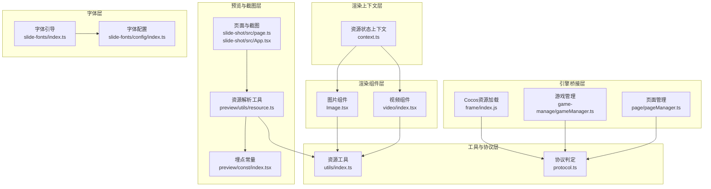
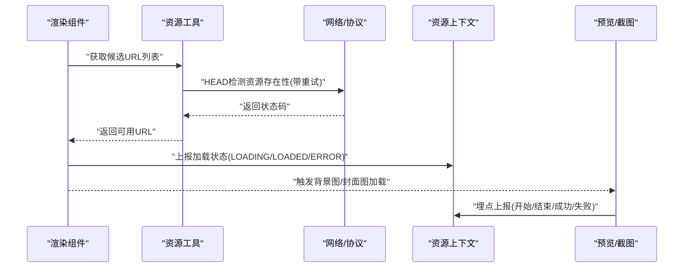
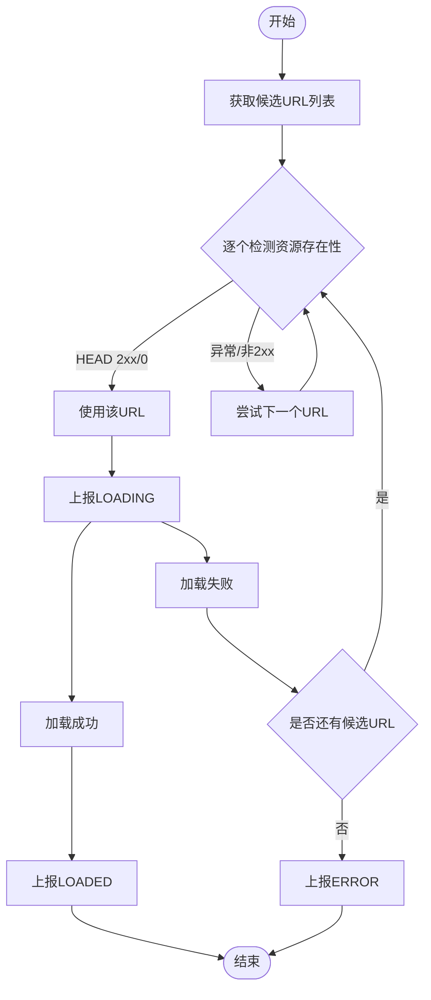
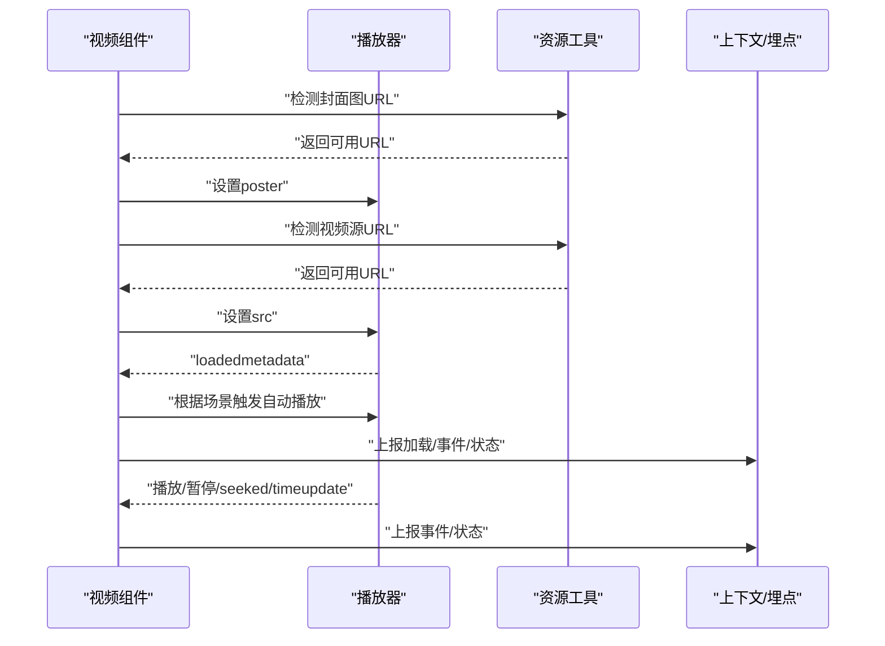
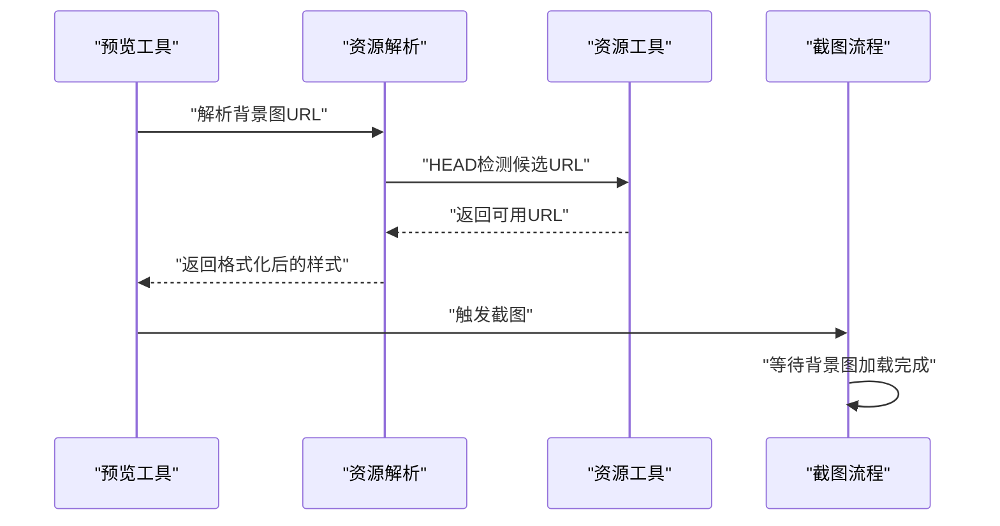
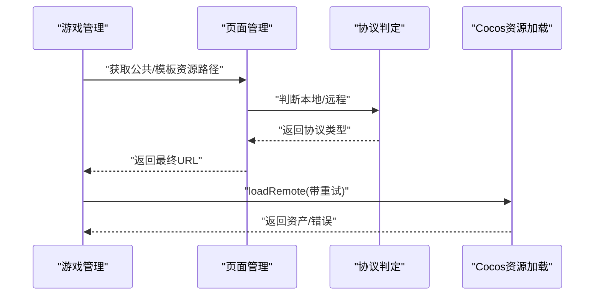
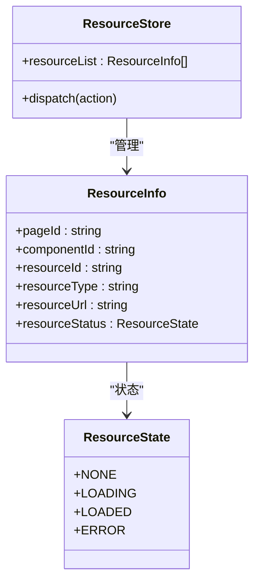
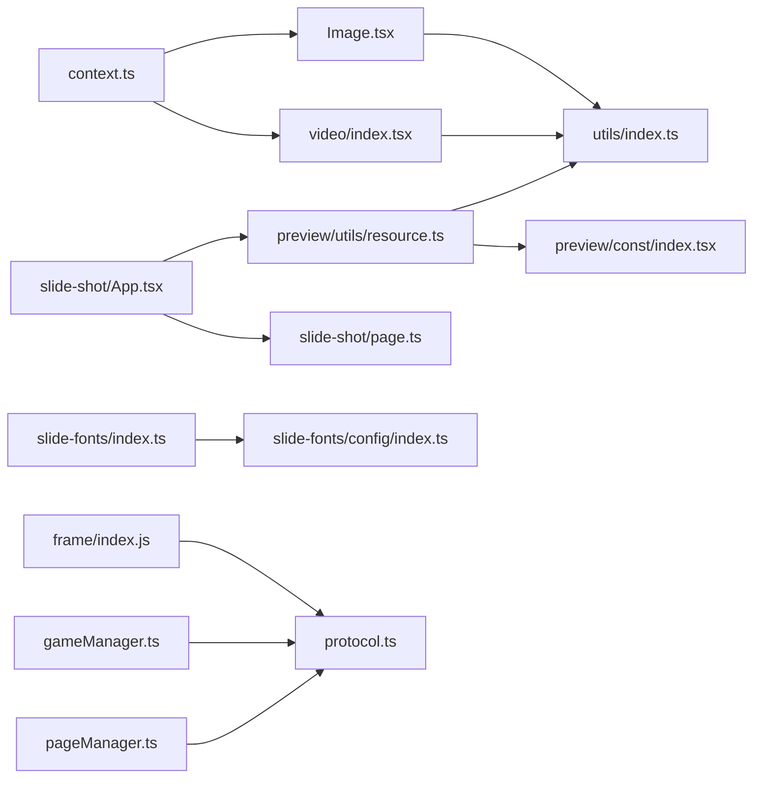

# 资源管理系统

<cite>
**本文引用的文件**
- [common/render-components/src/image/Image.tsx](file://common/render-components/src/image/Image.tsx)
- [common/render-components/src/video/index.tsx](file://common/render-components/src/video/index.tsx)
- [common/render-components/src/utils/index.ts](file://common/render-components/src/utils/index.ts)
- [common/render-core/models/context.ts](file://common/render-core/models/context.ts)
- [preview/src/utils/resource.ts](file://preview/src/utils/resource.ts)
- [preview/src/const/index.tsx](file://preview/src/const/index.tsx)
- [common/slide-fonts/index.ts](file://common/slide-fonts/index.ts)
- [common/slide-fonts/config/index.ts](file://common/slide-fonts/config/index.ts)
- [common/slide-shot/src/page.ts](file://common/slide-shot/src/page.ts)
- [common/slide-shot/src/App.tsx](file://common/slide-shot/src/App.tsx)
- [bridge/mcc-player/src/components/game-manage/gameManager.ts](file://bridge/mcc-player/src/components/game-manage/gameManager.ts)
- [bridge/mcc-player/src/components/page/pageManager.ts](file://bridge/mcc-player/src/components/page/pageManager.ts)
- [bridge/mcc-player/src/utils/isRemoteResourceExist.ts](file://bridge/mcc-player/src/utils/isRemoteResourceExist.ts)
- [bridge/mcc-player/src/utils/protocol.ts](file://bridge/mcc-player/src/utils/protocol.ts)
- [bridge/cocos-game-player/assets/frame/index.js](file://bridge/cocos-game-player/assets/frame/index.js)
- [packages/core/src/externals.ts](file://packages/core/src/externals.ts)
- [editor/src/components/ResourceManager/index.tsx](file://editor/src/components/ResourceManager/index.tsx)
</cite>

## 目录
1. [简介](#简介)
2. [项目结构](#项目结构)
3. [核心组件](#核心组件)
4. [架构总览](#架构总览)
5. [详细组件分析](#详细组件分析)
6. [依赖关系分析](#依赖关系分析)
7. [性能考量](#性能考量)
8. [故障排查指南](#故障排查指南)
9. [结论](#结论)
10. [附录](#附录)

## 简介
本技术文档围绕资源管理系统展开，覆盖图片、视频、字体等多类型资源的加载与缓存策略，资源路径解析与本地化处理，资源状态管理（加载状态跟踪、错误处理与重试机制），以及与渲染系统的集成（异步加载与懒加载）。同时提供资源优化最佳实践与性能调优建议，并给出可操作的资源管理示例。

## 项目结构
资源管理涉及多个模块协同工作：
- 渲染组件层：负责具体资源类型的加载与展示（图片、视频）。
- 工具与协议层：统一资源存在性检测、URL 解析与协议判定。
- 渲染上下文层：集中管理资源状态上报与全局状态。
- 预览与截图层：负责背景图解析、资源加载与截图流程。
- 字体层：负责字体资源的声明与回退策略。
- 引擎桥接层：Cocos/小游戏等运行时的资源加载与缓存。
- 编辑器与核心层：资源来源与本地化接口。

图表来源
- [common/render-components/src/image/Image.tsx:1-48](file://common/render-components/src/image/Image.tsx#L1-L48)
- [common/render-components/src/video/index.tsx:1-472](file://common/render-components/src/video/index.tsx#L1-L472)
- [common/render-components/src/utils/index.ts:1-236](file://common/render-components/src/utils/index.ts#L1-L236)
- [common/render-core/models/context.ts:1-226](file://common/render-core/models/context.ts#L1-L226)
- [preview/src/utils/resource.ts:1-184](file://preview/src/utils/resource.ts#L1-L184)
- [preview/src/const/index.tsx:1-25](file://preview/src/const/index.tsx#L1-L25)
- [common/slide-fonts/index.ts:1-70](file://common/slide-fonts/index.ts#L1-L70)
- [common/slide-fonts/config/index.ts:1-31](file://common/slide-fonts/config/index.ts#L1-L31)
- [common/slide-shot/src/page.ts:53-91](file://common/slide-shot/src/page.ts#L53-L91)
- [common/slide-shot/src/App.tsx:150-203](file://common/slide-shot/src/App.tsx#L150-L203)
- [bridge/mcc-player/src/components/game-manage/gameManager.ts:300-332](file://bridge/mcc-player/src/components/game-manage/gameManager.ts#L300-L332)
- [bridge/mcc-player/src/components/page/pageManager.ts:309-343](file://bridge/mcc-player/src/components/page/pageManager.ts#L309-L343)
- [bridge/cocos-game-player/assets/frame/index.js:5028-5078](file://bridge/cocos-game-player/assets/frame/index.js#L5028-L5078)

章节来源
- [common/render-components/src/image/Image.tsx:1-48](file://common/render-components/src/image/Image.tsx#L1-L48)
- [common/render-components/src/video/index.tsx:1-472](file://common/render-components/src/video/index.tsx#L1-L472)
- [common/render-components/src/utils/index.ts:1-236](file://common/render-components/src/utils/index.ts#L1-L236)
- [common/render-core/models/context.ts:1-226](file://common/render-core/models/context.ts#L1-L226)
- [preview/src/utils/resource.ts:1-184](file://preview/src/utils/resource.ts#L1-L184)
- [preview/src/const/index.tsx:1-25](file://preview/src/const/index.tsx#L1-L25)
- [common/slide-fonts/index.ts:1-70](file://common/slide-fonts/index.ts#L1-L70)
- [common/slide-fonts/config/index.ts:1-31](file://common/slide-fonts/config/index.ts#L1-L31)
- [common/slide-shot/src/page.ts:53-91](file://common/slide-shot/src/page.ts#L53-L91)
- [common/slide-shot/src/App.tsx:150-203](file://common/slide-shot/src/App.tsx#L150-L203)
- [bridge/mcc-player/src/components/game-manage/gameManager.ts:300-332](file://bridge/mcc-player/src/components/game-manage/gameManager.ts#L300-L332)
- [bridge/mcc-player/src/components/page/pageManager.ts:309-343](file://bridge/mcc-player/src/components/page/pageManager.ts#L309-L343)
- [bridge/cocos-game-player/assets/frame/index.js:5028-5078](file://bridge/cocos-game-player/assets/frame/index.js#L5028-L5078)

## 核心组件
- 资源工具与协议
  - 统一的远程资源存在性检测与重试策略，支持超时、重试次数与延迟。
  - 协议判定与 URL 解析，区分本地与远程资源。
- 渲染组件
  - 图片组件：多候选 URL 顺序探测，失败自动切换下一个，支持本地回退。
  - 视频组件：封面图与播放源的双链路选择，自动播放与状态恢复。
- 渲染上下文
  - 资源状态上报（新增/更新/移除），统一的状态枚举与去重逻辑。
- 预览与截图
  - 背景图 URL 解析与格式化，埋点记录资源加载生命周期。
- 字体系统
  - 字体声明与多格式回退，按配置生成 @font-face。
- 引擎桥接
  - Cocos 资源加载与重试；MCC 页面/资源路径解析与本地化判断。

章节来源
- [common/render-components/src/utils/index.ts:115-157](file://common/render-components/src/utils/index.ts#L115-L157)
- [common/render-components/src/image/Image.tsx:15-39](file://common/render-components/src/image/Image.tsx#L15-L39)
- [common/render-components/src/video/index.tsx:414-436](file://common/render-components/src/video/index.tsx#L414-L436)
- [common/render-core/models/context.ts:22-93](file://common/render-core/models/context.ts#L22-L93)
- [preview/src/utils/resource.ts:67-115](file://preview/src/utils/resource.ts#L67-L115)
- [common/slide-fonts/index.ts:60-68](file://common/slide-fonts/index.ts#L60-L68)
- [bridge/cocos-game-player/assets/frame/index.js:5028-5078](file://bridge/cocos-game-player/assets/frame/index.js#L5028-L5078)

## 架构总览
资源管理从“路径解析 → 存在性检测 → 加载与状态上报 → 渲染与回放”形成闭环。不同资源类型采用差异化策略，但共享同一工具与协议层，确保一致性与可维护性。

图表来源
- [common/render-components/src/utils/index.ts:115-157](file://common/render-components/src/utils/index.ts#L115-L157)
- [common/render-core/models/context.ts:60-93](file://common/render-core/models/context.ts#L60-L93)
- [preview/src/utils/resource.ts:118-156](file://preview/src/utils/resource.ts#L118-L156)

## 详细组件分析

### 图片资源加载与容错
- 多候选 URL 顺序探测，失败自动切换下一个，支持本地回退。
- 加载前上报 LOADING，成功/失败分别上报 LOADED/ERROR。
- 错误回调触发下一路由探测，直至耗尽或成功。

图表来源
- [common/render-components/src/image/Image.tsx:15-39](file://common/render-components/src/image/Image.tsx#L15-L39)
- [common/render-components/src/utils/index.ts:115-157](file://common/render-components/src/utils/index.ts#L115-L157)
- [common/render-core/models/context.ts:60-93](file://common/render-core/models/context.ts#L60-L93)

章节来源
- [common/render-components/src/image/Image.tsx:12-48](file://common/render-components/src/image/Image.tsx#L12-L48)
- [common/render-components/src/utils/index.ts:115-157](file://common/render-components/src/utils/index.ts#L115-L157)
- [common/render-core/models/context.ts:22-93](file://common/render-core/models/context.ts#L22-L93)

### 视频资源加载与状态恢复
- 封面图与播放源均采用候选链路与存在性检测。
- 自动播放策略与可见性联动，断线重连后恢复播放状态与时间轴。
- 事件埋点与状态上报贯穿加载、播放、暂停、时间更新等关键节点。

图表来源
- [common/render-components/src/video/index.tsx:414-455](file://common/render-components/src/video/index.tsx#L414-L455)
- [common/render-components/src/utils/index.ts:115-157](file://common/render-components/src/utils/index.ts#L115-L157)
- [preview/src/const/index.tsx:1-25](file://preview/src/const/index.tsx#L1-L25)

章节来源
- [common/render-components/src/video/index.tsx:16-472](file://common/render-components/src/video/index.tsx#L16-L472)
- [common/render-components/src/utils/index.ts:115-157](file://common/render-components/src/utils/index.ts#L115-L157)
- [preview/src/const/index.tsx:1-25](file://preview/src/const/index.tsx#L1-L25)

### 背景图与页面资源解析（预览/截图）
- 根据资源配置与文件清单生成本地/远程候选 URL。
- 使用 HEAD 检测可用链接，替换为最终 URL 并格式化样式。
- 截图前等待背景图加载完成，确保画面一致性。

图表来源
- [preview/src/utils/resource.ts:67-156](file://preview/src/utils/resource.ts#L67-L156)
- [common/slide-shot/src/page.ts:53-91](file://common/slide-shot/src/page.ts#L53-L91)
- [common/slide-shot/src/App.tsx:150-203](file://common/slide-shot/src/App.tsx#L150-L203)

章节来源
- [preview/src/utils/resource.ts:1-184](file://preview/src/utils/resource.ts#L1-L184)
- [common/slide-shot/src/page.ts:53-91](file://common/slide-shot/src/page.ts#L53-L91)
- [common/slide-shot/src/App.tsx:150-203](file://common/slide-shot/src/App.tsx#L150-L203)

### 字体资源与本地化
- 通过配置生成 @font-face，支持多格式回退与降级字体。
- 在渲染前注入样式，确保字体可用性与一致性。

图表来源
- [common/slide-fonts/index.ts:44-68](file://common/slide-fonts/index.ts#L44-L68)
- [common/slide-fonts/config/index.ts:9-30](file://common/slide-fonts/config/index.ts#L9-L30)

章节来源
- [common/slide-fonts/index.ts:1-70](file://common/slide-fonts/index.ts#L1-L70)
- [common/slide-fonts/config/index.ts:1-31](file://common/slide-fonts/config/index.ts#L1-L31)

### 引擎桥接与运行时资源加载
- Cocos 资源加载支持远程资源与重试策略，自动创建 SpriteFrame 或资产。
- MCC 路径解析支持本地/远程资源目录，动态拼接公共包与子游戏包地址。
- 协议判定用于识别本地/文件协议资源，调整校验策略。

图表来源
- [bridge/mcc-player/src/components/game-manage/gameManager.ts:300-332](file://bridge/mcc-player/src/components/game-manage/gameManager.ts#L300-L332)
- [bridge/mcc-player/src/components/page/pageManager.ts:309-343](file://bridge/mcc-player/src/components/page/pageManager.ts#L309-L343)
- [bridge/mcc-player/src/utils/protocol.ts:1-66](file://bridge/mcc-player/src/utils/protocol.ts#L1-L66)
- [bridge/cocos-game-player/assets/frame/index.js:5028-5078](file://bridge/cocos-game-player/assets/frame/index.js#L5028-L5078)

章节来源
- [bridge/mcc-player/src/components/game-manage/gameManager.ts:300-332](file://bridge/mcc-player/src/components/game-manage/gameManager.ts#L300-L332)
- [bridge/mcc-player/src/components/page/pageManager.ts:309-343](file://bridge/mcc-player/src/components/page/pageManager.ts#L309-L343)
- [bridge/mcc-player/src/utils/protocol.ts:1-66](file://bridge/mcc-player/src/utils/protocol.ts#L1-L66)
- [bridge/mcc-player/src/utils/isRemoteResourceExist.ts:16-40](file://bridge/mcc-player/src/utils/isRemoteResourceExist.ts#L16-L40)
- [bridge/cocos-game-player/assets/frame/index.js:5028-5078](file://bridge/cocos-game-player/assets/frame/index.js#L5028-L5078)

### 资源状态管理与上报
- 统一的状态枚举：NONE、LOADING、LOADED、ERROR。
- 去重逻辑基于 pageId 与 componentId，避免重复上报。
- 提供全局 store 与 hook，便于组件订阅与更新。

图表来源
- [common/render-core/models/context.ts:22-93](file://common/render-core/models/context.ts#L22-L93)

章节来源
- [common/render-core/models/context.ts:1-226](file://common/render-core/models/context.ts#L1-L226)

### 资源来源与本地化接口（编辑器）
- 编辑器侧提供资源管理器组件，展示实例数量与资源列表，辅助调试与监控。
- 通过全局 store 访问资源状态，便于开发期观测。

章节来源
- [editor/src/components/ResourceManager/index.tsx:1-13](file://editor/src/components/ResourceManager/index.tsx#L1-L13)
- [packages/core/src/externals.ts:48-81](file://packages/core/src/externals.ts#L48-L81)

## 依赖关系分析
- 渲染组件依赖资源工具进行存在性检测与 URL 生成。
- 预览与截图依赖资源解析工具与埋点常量。
- 字体系统独立于渲染组件，通过注入样式参与渲染。
- 引擎桥接层依赖协议判定与资源工具，保障本地/远程资源的一致行为。
- 渲染上下文为所有组件提供统一的状态上报与订阅。

图表来源
- [common/render-components/src/image/Image.tsx:1-48](file://common/render-components/src/image/Image.tsx#L1-L48)
- [common/render-components/src/video/index.tsx:1-472](file://common/render-components/src/video/index.tsx#L1-L472)
- [common/render-components/src/utils/index.ts:1-236](file://common/render-components/src/utils/index.ts#L1-L236)
- [preview/src/utils/resource.ts:1-184](file://preview/src/utils/resource.ts#L1-L184)
- [preview/src/const/index.tsx:1-25](file://preview/src/const/index.tsx#L1-L25)
- [common/slide-shot/src/App.tsx:150-203](file://common/slide-shot/src/App.tsx#L150-L203)
- [common/slide-shot/src/page.ts:53-91](file://common/slide-shot/src/page.ts#L53-L91)
- [common/slide-fonts/index.ts:1-70](file://common/slide-fonts/index.ts#L1-L70)
- [common/slide-fonts/config/index.ts:1-31](file://common/slide-fonts/config/index.ts#L1-L31)
- [bridge/mcc-player/src/components/game-manage/gameManager.ts:300-332](file://bridge/mcc-player/src/components/game-manage/gameManager.ts#L300-L332)
- [bridge/mcc-player/src/components/page/pageManager.ts:309-343](file://bridge/mcc-player/src/components/page/pageManager.ts#L309-L343)
- [bridge/mcc-player/src/utils/protocol.ts:1-66](file://bridge/mcc-player/src/utils/protocol.ts#L1-L66)
- [bridge/cocos-game-player/assets/frame/index.js:5028-5078](file://bridge/cocos-game-player/assets/frame/index.js#L5028-L5078)
- [common/render-core/models/context.ts:1-226](file://common/render-core/models/context.ts#L1-L226)

## 性能考量
- 异步与懒加载
  - 图片与视频组件采用“存在性检测 + 顺序加载”，避免阻塞主线程。
  - 视频组件在非当前页时暂停，减少不必要的解码与带宽占用。
- 重试与超时
  - 统一的重试策略与超时控制，提升弱网环境下的成功率。
- 缓存与预取
  - 建议结合浏览器缓存与 CDN 缓存策略；对热点资源进行预取。
- 内存管理
  - 及时释放不再使用的资源（如视频标签、图片对象），避免内存泄漏。
- 字体优化
  - 使用 font-display: swap，确保快速回退与稳定渲染。
- 路径解析
  - 本地优先、远程兜底，减少跨域与慢链路带来的延迟。

## 故障排查指南
- 资源加载失败
  - 检查候选 URL 是否存在，确认 HEAD 检测结果与重试配置。
  - 查看资源状态上报与埋点日志，定位失败阶段。
- 视频播放异常
  - 关注自动播放策略与可见性联动，确认断线重连后的状态恢复流程。
  - 检查封面图与播放源的链路是否一致。
- 字体不生效
  - 确认 @font-face 注入是否成功，格式与回退链路是否正确。
- 引擎桥接问题
  - 核对协议判定与路径拼接逻辑，确保本地/远程分支正确。
  - 检查 Cocos 资源加载的重试参数与错误回调。

章节来源
- [common/render-components/src/utils/index.ts:115-157](file://common/render-components/src/utils/index.ts#L115-L157)
- [common/render-components/src/video/index.tsx:213-338](file://common/render-components/src/video/index.tsx#L213-L338)
- [common/slide-fonts/index.ts:44-68](file://common/slide-fonts/index.ts#L44-L68)
- [bridge/mcc-player/src/utils/protocol.ts:1-66](file://bridge/mcc-player/src/utils/protocol.ts#L1-L66)
- [bridge/cocos-game-player/assets/frame/index.js:5028-5078](file://bridge/cocos-game-player/assets/frame/index.js#L5028-L5078)

## 结论
本资源管理系统通过统一的工具与协议层，实现了图片、视频、字体等多类型资源的高效加载与状态管理，并在预览、截图与引擎桥接场景中得到良好集成。建议在生产环境中结合缓存、预取与内存管理策略，持续优化加载性能与稳定性。

## 附录
- 资源管理示例
  - 图片组件：多候选 URL 顺序探测与错误回退。
  - 视频组件：封面图与播放源的链路选择与状态恢复。
  - 预览背景图：本地/远程候选 URL 解析与样式替换。
  - 字体系统：@font-face 动态注入与回退链路。
  - 引擎桥接：Cocos 资源加载与 MCC 路径解析。
- 性能调优建议
  - 合理设置重试次数与超时，平衡成功率与首帧时间。
  - 对视频与大图采用懒加载与占位策略。
  - 使用 CDN 与浏览器缓存，减少重复下载。
  - 控制并发请求数，避免拥塞。