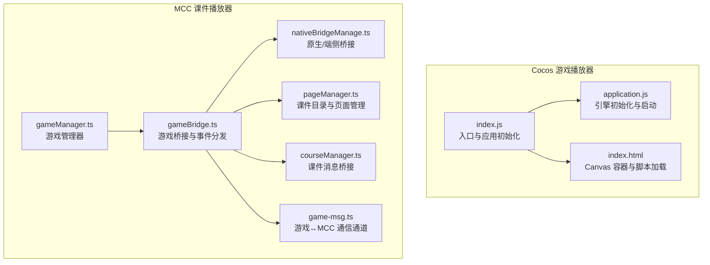
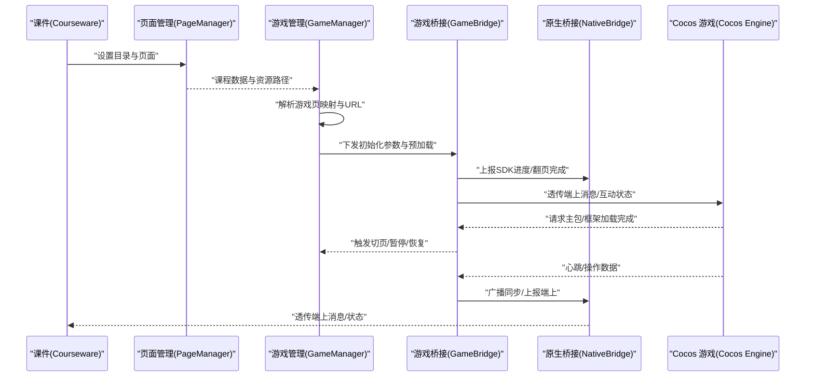
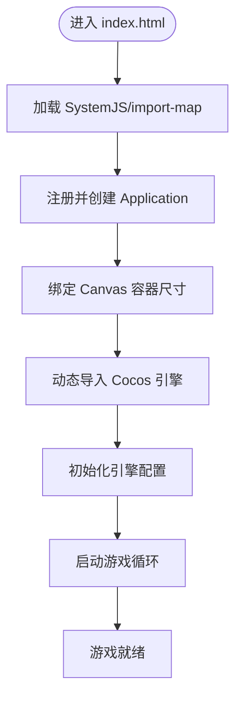
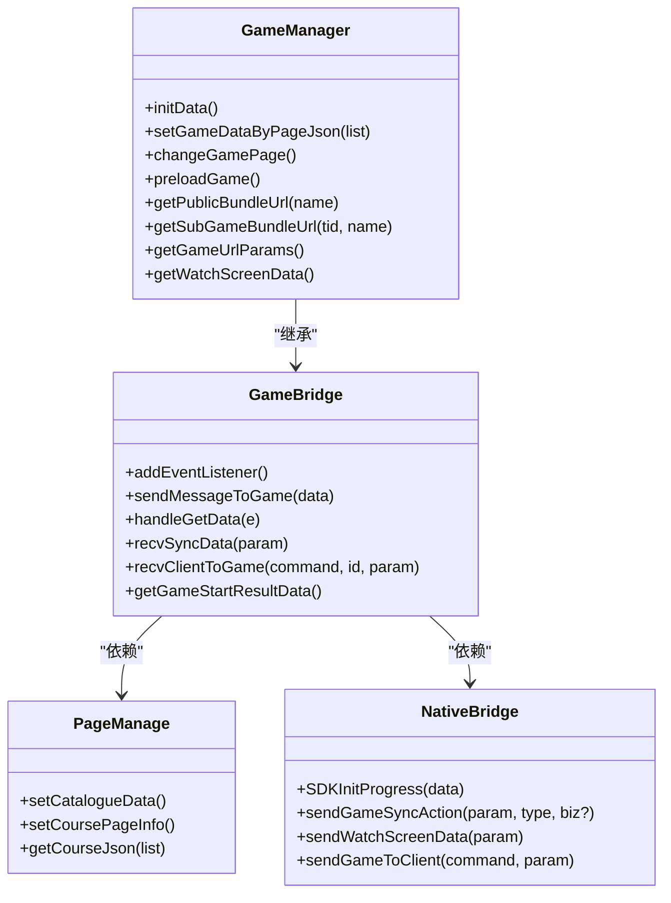
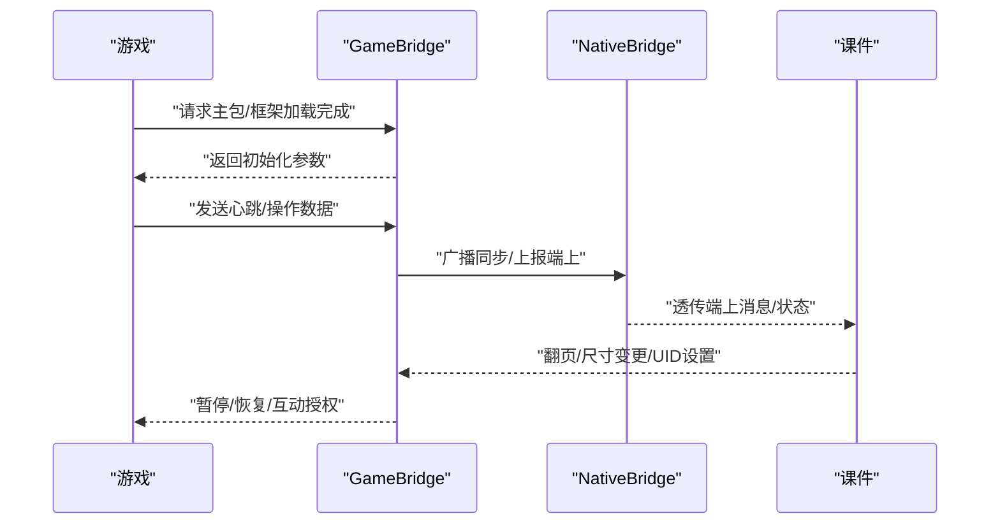
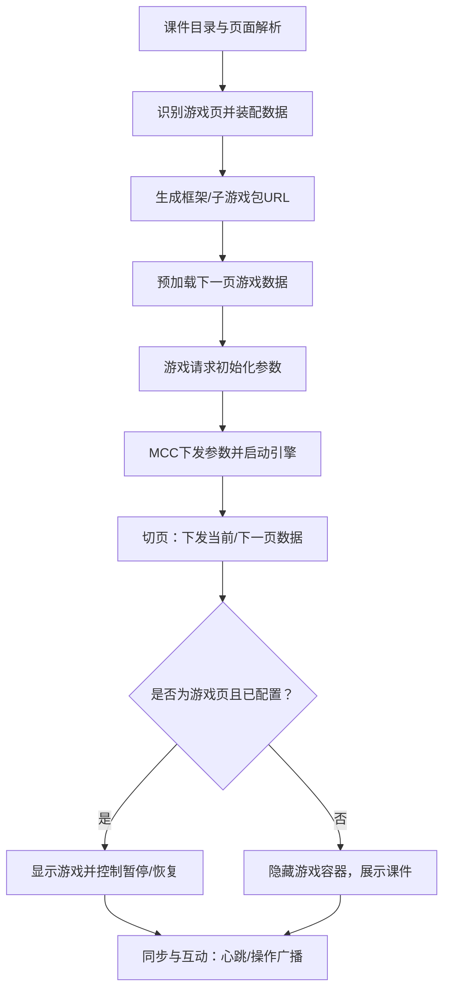
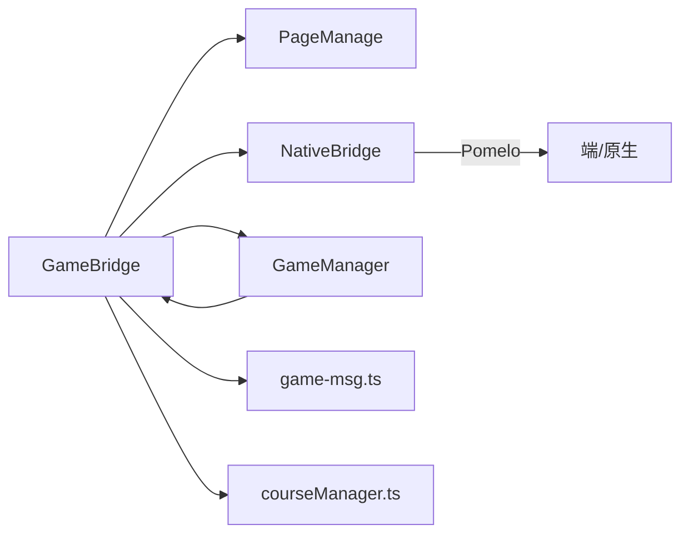

# Cocos 游戏集成

<cite>
**本文引用的文件**
- [index.js](file://bridge/cocos-game-player/index.js)
- [application.js](file://bridge/cocos-game-player/application.js)
- [index.html](file://bridge/cocos-game-player/index.html)
- [gameManager.ts](file://bridge/mcc-player/src/components/game-manage/gameManager.ts)
- [gameBridge.ts](file://bridge/mcc-player/src/components/game-manage/gameBridge.ts)
- [type.ts](file://bridge/mcc-player/src/components/game-manage/type.ts)
- [nativeBridgeManage.ts](file://bridge/mcc-player/src/components/native-bridge/nativeBridgeManage.ts)
- [bridge-type.ts](file://bridge/mcc-player/src/components/native-bridge/bridge-type.ts)
- [pageManager.ts](file://bridge/mcc-player/src/components/page/pageManager.ts)
- [const.ts](file://bridge/mcc-player/src/components/page/const.ts)
- [courseManager.ts](file://bridge/mcc-player/src/components/course-bridge/courseManager.ts)
- [index.ts](file://bridge/mcc-player/src/components/native-bridge/index.ts)
- [game-msg.ts](file://bridge/mcc-player/src/components/game-manage/game-msg.ts)
- [index.ts](file://bridge/mcc-player/src/interface/index.ts)
</cite>

## 目录
1. [简介](#简介)
2. [项目结构](#项目结构)
3. [核心组件](#核心组件)
4. [架构总览](#架构总览)
5. [详细组件分析](#详细组件分析)
6. [依赖关系分析](#依赖关系分析)
7. [性能考量](#性能考量)
8. [故障排查指南](#故障排查指南)
9. [结论](#结论)
10. [附录](#附录)

## 简介
本技术文档面向 Cocos 游戏与课件系统的集成场景，围绕“游戏加载流程、初始化过程与生命周期管理”、“游戏管理器设计与实现（实例管理、状态跟踪、资源调度）”、“游戏与课件交互机制（事件传递、数据交换、状态同步）”、“游戏容器配置与定制（尺寸、位置、显示切换）”以及“完整的集成流程（从游戏选择到嵌入课件）”展开。文档同时提供可操作的集成步骤、常见问题与解决方案，并辅以可视化图示帮助读者快速理解系统架构与数据流。

## 项目结构
本仓库包含两部分关键集成模块：
- Cocos 游戏播放器（桥接层）：负责 Cocos Creator 引擎初始化、Canvas 容器适配、资源加载与错误上报。
- MCC 课件播放器（桥接层）：负责课件与游戏的统一编排、资源路径解析、跨端通信、互动与同步、页面生命周期管理。

图表来源
- [index.js:1-30](file://bridge/cocos-game-player/index.js#L1-L30)
- [application.js:1-63](file://bridge/cocos-game-player/application.js#L1-L63)
- [index.html:1-368](file://bridge/cocos-game-player/index.html#L1-L368)
- [gameManager.ts:1-368](file://bridge/mcc-player/src/components/game-manage/gameManager.ts#L1-L368)
- [gameBridge.ts:1-388](file://bridge/mcc-player/src/components/game-manage/gameBridge.ts#L1-L388)
- [nativeBridgeManage.ts:1-395](file://bridge/mcc-player/src/components/native-bridge/nativeBridgeManage.ts#L1-L395)
- [pageManager.ts:1-498](file://bridge/mcc-player/src/components/page/pageManager.ts#L1-L498)
- [courseManager.ts:1-117](file://bridge/mcc-player/src/components/course-bridge/courseManager.ts#L1-L117)
- [game-msg.ts:1-90](file://bridge/mcc-player/src/components/game-manage/game-msg.ts#L1-L90)

章节来源
- [index.js:1-30](file://bridge/cocos-game-player/index.js#L1-L30)
- [application.js:1-63](file://bridge/cocos-game-player/application.js#L1-L63)
- [index.html:1-368](file://bridge/cocos-game-player/index.html#L1-L368)
- [gameManager.ts:1-368](file://bridge/mcc-player/src/components/game-manage/gameManager.ts#L1-L368)
- [gameBridge.ts:1-388](file://bridge/mcc-player/src/components/game-manage/gameBridge.ts#L1-L388)
- [nativeBridgeManage.ts:1-395](file://bridge/mcc-player/src/components/native-bridge/nativeBridgeManage.ts#L1-L395)
- [pageManager.ts:1-498](file://bridge/mcc-player/src/components/page/pageManager.ts#L1-L498)
- [courseManager.ts:1-117](file://bridge/mcc-player/src/components/course-bridge/courseManager.ts#L1-L117)
- [game-msg.ts:1-90](file://bridge/mcc-player/src/components/game-manage/game-msg.ts#L1-L90)

## 核心组件
- Cocos 游戏播放器
  - 入口与应用初始化：在浏览器环境中注册并初始化 Application，绑定 Canvas 尺寸，按顺序加载引擎并启动。
  - 引擎初始化：设置调试模式、配置路径与覆盖参数，运行游戏。
  - 页面与容器：提供 index.html 中的 Canvas 容器与脚本加载链路，包含错误上报与 WebGL 上下文丢失处理。
- MCC 课件播放器
  - 游戏管理器：解析课件目录，构建游戏页映射，计算资源 URL，预加载与切页，下发初始化参数与心跳同步数据。
  - 游戏桥接：统一处理游戏与 MCC 的事件通道，转发端上消息，维护互动状态与本地/远端同步数据。
  - 原生桥接：抽象跨端通信，支持消息监听、Pomelo 透传、进度上报、页面控制等。
  - 页面管理：课件目录拉取与缓存、页面 JSON 解析、资源路径替换、CDN 备选与容灾。
  - 课件桥接：提供与课件的统一消息通道，支持翻页、尺寸变更、UID 设置等。
  - 通信通道：提供游戏与 MCC 的事件总线，支持注册、派发、移除监听。

章节来源
- [index.js:1-30](file://bridge/cocos-game-player/index.js#L1-L30)
- [application.js:1-63](file://bridge/cocos-game-player/application.js#L1-L63)
- [index.html:1-368](file://bridge/cocos-game-player/index.html#L1-L368)
- [gameManager.ts:1-368](file://bridge/mcc-player/src/components/game-manage/gameManager.ts#L1-L368)
- [gameBridge.ts:1-388](file://bridge/mcc-player/src/components/game-manage/gameBridge.ts#L1-L388)
- [nativeBridgeManage.ts:1-395](file://bridge/mcc-player/src/components/native-bridge/nativeBridgeManage.ts#L1-L395)
- [pageManager.ts:1-498](file://bridge/mcc-player/src/components/page/pageManager.ts#L1-L498)
- [courseManager.ts:1-117](file://bridge/mcc-player/src/components/course-bridge/courseManager.ts#L1-L117)
- [game-msg.ts:1-90](file://bridge/mcc-player/src/components/game-manage/game-msg.ts#L1-L90)

## 架构总览
下图展示了从课件到游戏的整体调用链与数据流：

图表来源
- [pageManager.ts:1-498](file://bridge/mcc-player/src/components/page/pageManager.ts#L1-L498)
- [gameManager.ts:1-368](file://bridge/mcc-player/src/components/game-manage/gameManager.ts#L1-L368)
- [gameBridge.ts:1-388](file://bridge/mcc-player/src/components/game-manage/gameBridge.ts#L1-L388)
- [nativeBridgeManage.ts:1-395](file://bridge/mcc-player/src/components/native-bridge/nativeBridgeManage.ts#L1-L395)

## 详细组件分析

### 游戏加载与初始化流程
- 浏览器入口
  - 注册模块并创建 Application 实例，绑定 Canvas 容器尺寸，随后动态导入引擎并初始化。
- 引擎初始化
  - 设置调试模式、配置路径与覆盖参数，启动游戏循环。
- 页面与容器
  - 提供 Canvas 容器与脚本加载链路，包含错误上报与 WebGL 上下文丢失处理，确保稳定性。

图表来源
- [index.js:1-30](file://bridge/cocos-game-player/index.js#L1-L30)
- [application.js:1-63](file://bridge/cocos-game-player/application.js#L1-L63)
- [index.html:1-368](file://bridge/cocos-game-player/index.html#L1-L368)

章节来源
- [index.js:1-30](file://bridge/cocos-game-player/index.js#L1-L30)
- [application.js:1-63](file://bridge/cocos-game-player/application.js#L1-L63)
- [index.html:1-368](file://bridge/cocos-game-player/index.html#L1-L368)

### 游戏管理器设计与实现
- 数据结构
  - 游戏详情映射：记录每页的游戏信息、上下页关联、是否为游戏页等。
  - 资源参数：本地/远程根路径、CDN 列表、初始化参数等。
- 关键职责
  - 初始化：根据课件目录构建游戏映射，设置资源路径。
  - 切页：在页面切换时下发当前页与下一页的游戏数据，控制引擎暂停/恢复，上报埋点。
  - 预加载：预取下一页游戏数据，提升体验。
  - URL 解析：根据模板与公共模块生成框架与子游戏包地址。
  - 同步数据：维护本地/远端心跳数据，支持互动授权与旁观端查看。

图表来源
- [gameManager.ts:1-368](file://bridge/mcc-player/src/components/game-manage/gameManager.ts#L1-L368)
- [gameBridge.ts:1-388](file://bridge/mcc-player/src/components/game-manage/gameBridge.ts#L1-L388)
- [pageManager.ts:1-498](file://bridge/mcc-player/src/components/page/pageManager.ts#L1-L498)
- [nativeBridgeManage.ts:1-395](file://bridge/mcc-player/src/components/native-bridge/nativeBridgeManage.ts#L1-L395)

章节来源
- [gameManager.ts:1-368](file://bridge/mcc-player/src/components/game-manage/gameManager.ts#L1-L368)
- [gameBridge.ts:1-388](file://bridge/mcc-player/src/components/game-manage/gameBridge.ts#L1-L388)
- [pageManager.ts:1-498](file://bridge/mcc-player/src/components/page/pageManager.ts#L1-L498)
- [nativeBridgeManage.ts:1-395](file://bridge/mcc-player/src/components/native-bridge/nativeBridgeManage.ts#L1-L395)

### 游戏与课件交互机制
- 事件通道
  - 游戏通过统一事件通道向 MCC 发送“主包/框架加载完成、心跳/操作数据、开始、参数请求、埋点”等事件。
  - MCC 通过事件通道下发“是否主控、同步数据、端上透传、暂停/恢复、FPS 设置、互动授权”等指令。
- 数据交换
  - 初始化参数：MCC 在游戏请求时下发角色、尺寸、设备等参数。
  - 同步数据：心跳与操作数据双向流转，支持教师端广播与旁观端查看。
- 状态同步
  - 本地/远端心跳数据管理，互动授权状态持久化，跨端一致性保障。

图表来源
- [gameBridge.ts:1-388](file://bridge/mcc-player/src/components/game-manage/gameBridge.ts#L1-L388)
- [nativeBridgeManage.ts:1-395](file://bridge/mcc-player/src/components/native-bridge/nativeBridgeManage.ts#L1-L395)
- [courseManager.ts:1-117](file://bridge/mcc-player/src/components/course-bridge/courseManager.ts#L1-L117)
- [type.ts:1-67](file://bridge/mcc-player/src/components/game-manage/type.ts#L1-L67)

章节来源
- [gameBridge.ts:1-388](file://bridge/mcc-player/src/components/game-manage/gameBridge.ts#L1-L388)
- [nativeBridgeManage.ts:1-395](file://bridge/mcc-player/src/components/native-bridge/nativeBridgeManage.ts#L1-L395)
- [courseManager.ts:1-117](file://bridge/mcc-player/src/components/course-bridge/courseManager.ts#L1-L117)
- [type.ts:1-67](file://bridge/mcc-player/src/components/game-manage/type.ts#L1-L67)

### 游戏容器配置与定制
- 尺寸调整
  - 入口脚本根据父容器计算 Canvas 尺寸并设置，确保全屏与自适应。
- 位置控制
  - HTML 中通过容器布局与样式控制 Canvas 的位置与层级。
- 显示切换
  - 非游戏页自动暂停引擎；当页面为游戏页但未配置游戏时，隐藏游戏容器并展示课件。

章节来源
- [index.js:1-30](file://bridge/cocos-game-player/index.js#L1-L30)
- [index.html:1-368](file://bridge/cocos-game-player/index.html#L1-L368)
- [gameManager.ts:1-368](file://bridge/mcc-player/src/components/game-manage/gameManager.ts#L1-L368)

### 完整集成流程（从游戏选择到嵌入课件）
- 步骤一：课件目录与页面解析
  - 页面管理器拉取目录与页面 JSON，构建全局数据，设置资源路径与 CDN。
- 步骤二：游戏页识别与数据装配
  - 游戏管理器扫描目录，识别游戏页并装配模板、公共模块与子游戏包信息。
- 步骤三：资源 URL 生成
  - 根据本地/远程路径定义与占位符替换，生成框架与子游戏包 URL。
- 步骤四：预加载与初始化
  - 预加载下一页游戏数据；游戏请求初始化参数，MCC 返回角色、尺寸、设备等参数。
- 步骤五：切页与生命周期
  - 切页时下发当前/下一页游戏数据，控制引擎暂停/恢复；若无游戏配置则隐藏容器。
- 步骤六：同步与互动
  - 教师端广播同步数据，学生端接收并回显；互动授权状态持久化，旁观端查看时透传数据。

图表来源
- [pageManager.ts:1-498](file://bridge/mcc-player/src/components/page/pageManager.ts#L1-L498)
- [gameManager.ts:1-368](file://bridge/mcc-player/src/components/game-manage/gameManager.ts#L1-L368)
- [gameBridge.ts:1-388](file://bridge/mcc-player/src/components/game-manage/gameBridge.ts#L1-L388)

章节来源
- [pageManager.ts:1-498](file://bridge/mcc-player/src/components/page/pageManager.ts#L1-L498)
- [gameManager.ts:1-368](file://bridge/mcc-player/src/components/game-manage/gameManager.ts#L1-L368)
- [gameBridge.ts:1-388](file://bridge/mcc-player/src/components/game-manage/gameBridge.ts#L1-L388)

## 依赖关系分析
- 组件耦合
  - GameBridge 作为中枢，依赖 PageManage、NativeBridge、GameMessage 与课程桥接组件。
  - GameManager 继承自 GameBridge，扩展资源 URL 与切页逻辑。
- 外部依赖
  - SystemJS 与 import-map 用于模块加载。
  - Pomelo 消息通道用于跨端广播与透传。
  - 微前端微应用框架用于全局数据与事件分发。

图表来源
- [gameBridge.ts:1-388](file://bridge/mcc-player/src/components/game-manage/gameBridge.ts#L1-L388)
- [pageManager.ts:1-498](file://bridge/mcc-player/src/components/page/pageManager.ts#L1-L498)
- [nativeBridgeManage.ts:1-395](file://bridge/mcc-player/src/components/native-bridge/nativeBridgeManage.ts#L1-L395)
- [courseManager.ts:1-117](file://bridge/mcc-player/src/components/course-bridge/courseManager.ts#L1-L117)
- [game-msg.ts:1-90](file://bridge/mcc-player/src/components/game-manage/game-msg.ts#L1-L90)

章节来源
- [gameBridge.ts:1-388](file://bridge/mcc-player/src/components/game-manage/gameBridge.ts#L1-L388)
- [pageManager.ts:1-498](file://bridge/mcc-player/src/components/page/pageManager.ts#L1-L498)
- [nativeBridgeManage.ts:1-395](file://bridge/mcc-player/src/components/native-bridge/nativeBridgeManage.ts#L1-L395)
- [courseManager.ts:1-117](file://bridge/mcc-player/src/components/course-bridge/courseManager.ts#L1-L117)
- [game-msg.ts:1-90](file://bridge/mcc-player/src/components/game-manage/game-msg.ts#L1-L90)

## 性能考量
- 资源加载
  - 本地优先、CDN 备选与容灾策略，减少首屏等待与失败重试。
  - 预加载下一页游戏数据，降低切页卡顿。
- 引擎启动
  - 合理设置调试模式与覆盖参数，避免不必要的开销。
- 事件与同步
  - 心跳与操作分离，仅回显非心跳操作，降低带宽与处理压力。
- 错误与恢复
  - 错误计数与阈值控制，必要时触发游戏重启，保障稳定性。

## 故障排查指南
- 引擎初始化失败
  - 检查 Canvas 容器是否存在与尺寸是否正确；确认 SystemJS 与 import-map 加载顺序。
- 资源加载失败
  - 核对本地/远程路径与 CDN 列表；检查网络连通性与跨域配置。
- 切页无响应
  - 确认目录与页面 JSON 已正确拉取与解析；检查游戏页映射与 URL 生成。
- 同步不同步
  - 核对教师端广播与学生端接收逻辑；检查互动授权状态与本地存储。
- 旁观端无法查看
  - 确认旁观端消息透传与查看开关；检查端上消息通道与回调。

章节来源
- [index.js:1-30](file://bridge/cocos-game-player/index.js#L1-L30)
- [application.js:1-63](file://bridge/cocos-game-player/application.js#L1-L63)
- [pageManager.ts:1-498](file://bridge/mcc-player/src/components/page/pageManager.ts#L1-L498)
- [gameBridge.ts:1-388](file://bridge/mcc-player/src/components/game-manage/gameBridge.ts#L1-L388)
- [nativeBridgeManage.ts:1-395](file://bridge/mcc-player/src/components/native-bridge/nativeBridgeManage.ts#L1-L395)

## 结论
本集成方案通过清晰的模块划分与事件驱动的通信机制，实现了课件与 Cocos 游戏的无缝衔接。从资源解析、初始化、切页控制到同步与互动，形成了一套稳定、可扩展的体系。建议在生产环境中结合监控与日志，持续优化资源加载与错误恢复策略，以获得更佳的用户体验。

## 附录
- 常用术语
  - 主包：游戏主程序包
  - 框架包：公共框架与容器
  - 子游戏包：具体游戏模板
  - 互动授权：教师端对学生的授权状态
  - 旁观端查看：教师端查看学生游戏状态
- 参考接口与枚举
  - 游戏事件与命令：见 [type.ts:1-67](file://bridge/mcc-player/src/components/game-manage/type.ts#L1-L67)
  - 原生命令与通知：见 [bridge-type.ts:1-73](file://bridge/mcc-player/src/components/native-bridge/bridge-type.ts#L1-L73)
  - 初始化参数与状态：见 [index.ts:1-71](file://bridge/mcc-player/src/interface/index.ts#L1-L71)