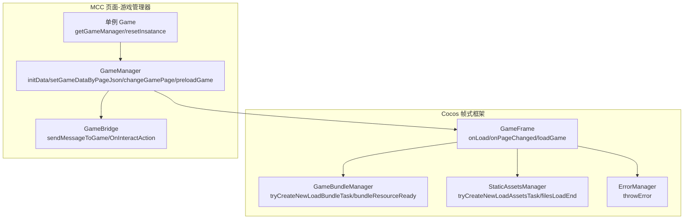
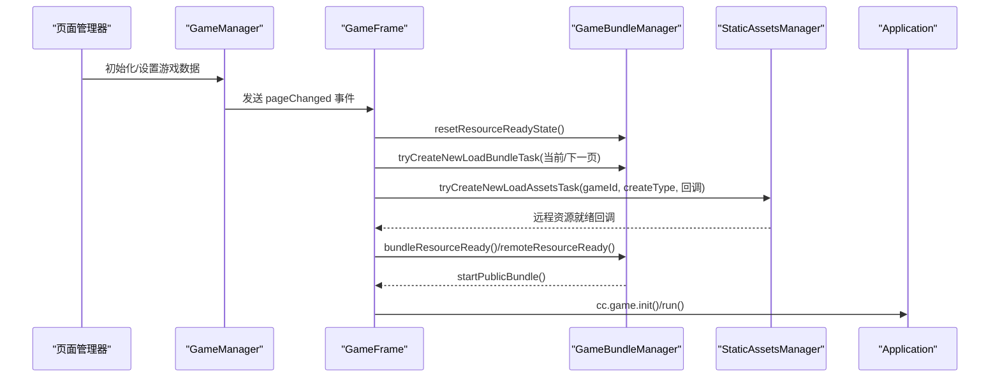
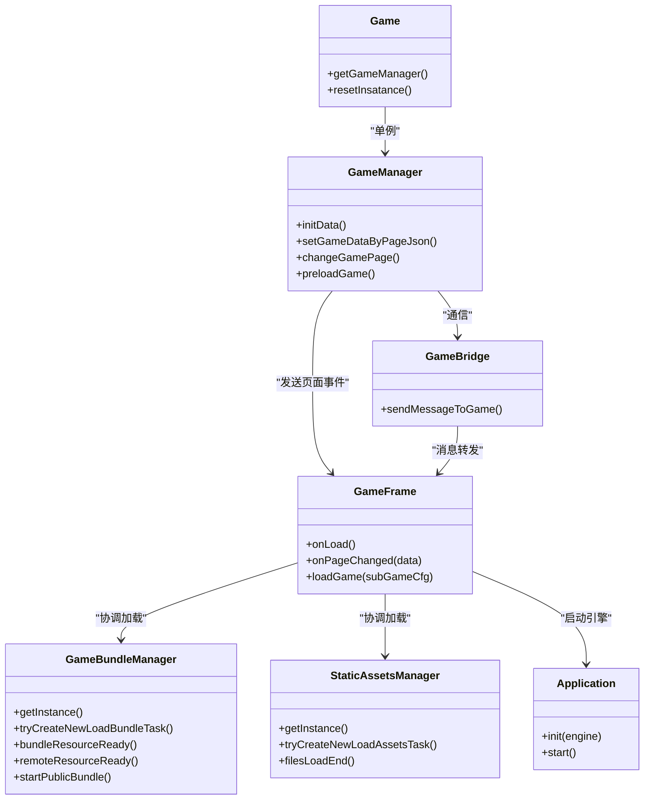

# 游戏加载与生命周期

<cite>
**本文引用的文件**
- [application.js](file://bridge/cocos-game-player/application.js)
- [index.js](file://bridge/cocos-game-player/assets/frame/index.js)
- [gameManager.ts](file://bridge/mcc-player/src/components/game-manage/gameManager.ts)
- [index.ts](file://bridge/mcc-player/src/components/game-manage/index.ts)
- [gameBridge.ts](file://bridge/mcc-player/src/components/game-manage/gameBridge.ts)
- [system.bundle.js](file://bridge/cocos-game-player/src/system.bundle.js)
- [lru.ts](file://packages/shared/src/lru.ts)
</cite>

## 目录
1. [简介](#简介)
2. [项目结构](#项目结构)
3. [核心组件](#核心组件)
4. [架构总览](#架构总览)
5. [详细组件分析](#详细组件分析)
6. [依赖关系分析](#依赖关系分析)
7. [性能考量](#性能考量)
8. [故障排查指南](#故障排查指南)
9. [结论](#结论)
10. [附录](#附录)

## 简介
本技术文档围绕“游戏加载与生命周期管理”主题，系统梳理从初始化到销毁的完整流程，涵盖：
- 游戏数据初始化与资源加载
- 框架加载与游戏启动
- 游戏预加载策略、资源缓存与性能优化
- 实例管理（单例、实例池与内存回收）
- 游戏状态管理（运行、暂停、错误）
- 生命周期钩子函数的使用与最佳实践
- 常见问题与解决方案

## 项目结构
该仓库包含两类游戏播放器实现：
- Cocos 引擎侧的“帧式框架”（frame），负责资源加载、公共模块与子游戏包的调度
- MCC 播放器侧的“页面-游戏管理器”，负责课件页与游戏页的切换、预加载与状态控制

图表来源
- [index.js:2618-2692](file://bridge/cocos-game-player/assets/frame/index.js#L2618-L2692)
- [gameManager.ts:99-260](file://bridge/mcc-player/src/components/game-manage/gameManager.ts#L99-L260)
- [index.ts:1-16](file://bridge/mcc-player/src/components/game-manage/index.ts#L1-L16)

章节来源
- [application.js:14-62](file://bridge/cocos-game-player/application.js#L14-L62)
- [index.js:2618-2692](file://bridge/cocos-game-player/assets/frame/index.js#L2618-L2692)
- [gameManager.ts:99-260](file://bridge/mcc-player/src/components/game-manage/gameManager.ts#L99-L260)

## 核心组件
- Cocos 帧式框架（GameFrame、GameBundleManager、StaticAssetsManager、ErrorManager）
- MCC 页面-游戏管理器（GameManager、GameBridge、单例 Game）
- 应用入口（Application）
- 模块加载器（SystemJS）

章节来源
- [index.js:2618-2692](file://bridge/cocos-game-player/assets/frame/index.js#L2618-L2692)
- [gameManager.ts:99-260](file://bridge/mcc-player/src/components/game-manage/gameManager.ts#L99-L260)
- [index.ts:1-16](file://bridge/mcc-player/src/components/game-manage/index.ts#L1-L16)
- [application.js:14-62](file://bridge/cocos-game-player/application.js#L14-L62)
- [system.bundle.js:523-540](file://bridge/cocos-game-player/src/system.bundle.js#L523-L540)

## 架构总览
整体流程：页面管理器驱动 GameManager 初始化游戏数据；GameFrame 监听页面变更，协调 GameBundleManager 与 StaticAssetsManager 完成资源加载与公共模块启动；应用入口负责 Cocos 引擎初始化与运行。

图表来源
- [index.js:2686-2692](file://bridge/cocos-game-player/assets/frame/index.js#L2686-L2692)
- [gameManager.ts:200-260](file://bridge/mcc-player/src/components/game-manage/gameManager.ts#L200-L260)
- [application.js:24-56](file://bridge/cocos-game-player/application.js#L24-L56)

## 详细组件分析

### Cocos 帧式框架（GameFrame）
- 生命周期钩子
  - onLoad：注册微应用与 SDK 事件监听，根据是否来自 App 决定是否请求子包数据
  - onPageChanged：接收页面切换事件，设置运行/预加载游戏数据，关闭当前游戏，按需加载当前或下一页
  - loadGame：重置资源状态，创建 Bundle 与静态资源加载任务
- 事件与消息
  - 监听授权、心跳、重启、取消继续等消息，分发给监听者
- 启动引擎
  - 通过 Application 完成引擎初始化与运行

章节来源
- [index.js:2618-2692](file://bridge/cocos-game-player/assets/frame/index.js#L2618-L2692)
- [application.js:24-56](file://bridge/cocos-game-player/application.js#L24-L56)

### 游戏包管理（GameBundleManager）
- 资源就绪双通道
  - bundleResourceReady：本地/公共资源就绪
  - remoteResourceReady：远程资源就绪
  - 双通道均就绪后启动公共模块（prefab）
- 预加载与加载任务
  - tryCreateNewLoadBundleTask：避免重复加载，区分 OPEN/PRELOAD 类型
  - loadBundleAndAssets：按目录顺序加载音频、预加载、预制体等资源
- 实例管理
  - 单例模式，内部维护加载中/完成/终止映射，支持重置状态

章节来源
- [index.js:2104-2194](file://bridge/cocos-game-player/assets/frame/index.js#L2104-L2194)
- [index.js:2329-2351](file://bridge/cocos-game-player/assets/frame/index.js#L2329-L2351)
- [index.js:2536-2558](file://bridge/cocos-game-player/assets/frame/index.js#L2536-L2558)

### 静态资源管理（StaticAssetsManager）
- 预加载策略
  - tryCreateNewLoadAssetsTask：按 gameId 创建加载任务，优先命中缓存，避免并发重复
  - 支持离线 JSON 与在线 JSON 获取，失败回退
- 资源缓存与回收
  - completeAllAssetsMap 缓存已完成资源，限制最大缓存数
  - filesLoadEnd：成功则入缓存并触发回收；失败/暂停则释放资源
  - canRelease：判断是否可回收（非预加载面板且非当前/下一页游戏）
- 并发控制
  - _maxLoadingNum 控制同时下载数量

章节来源
- [index.js:4532-4662](file://bridge/cocos-game-player/assets/frame/index.js#L4532-L4662)
- [index.js:4666-4717](file://bridge/cocos-game-player/assets/frame/index.js#L4666-L4717)

### 错误管理（ErrorManager）
- 提供 throwError 接口，结合预加载类型决定错误处理策略
- 与 StaticAssetsManager/filesLoadEnd 协作，统一错误上报与资源回收

章节来源
- [index.js:1352-1360](file://bridge/cocos-game-player/assets/frame/index.js#L1352-L1360)

### MCC 页面-游戏管理器（GameManager）
- 数据初始化
  - initData：解析课件目录，建立游戏页映射，记录前后页关系
  - setGameDataByPageJson：从页面 JSON 中提取游戏配置（模板、公共包、子包）
- 切页与状态
  - changeGamePage：发送 pageChanged 事件；根据当前页是否为游戏页与是否存在游戏数据决定暂停/恢复引擎
  - 非游戏页时发送 PauseOrResumeGame 事件
- 预加载
  - preloadGame：向微应用发送 pagePreload，携带下一页游戏数据
- 地址解析
  - getPublicBundleUrl/getSubGameBundleUrl：根据本地/CDN 配置拼接公共模块与子包地址

章节来源
- [gameManager.ts:99-176](file://bridge/mcc-player/src/components/game-manage/gameManager.ts#L99-L176)
- [gameManager.ts:200-260](file://bridge/mcc-player/src/components/game-manage/gameManager.ts#L200-L260)
- [gameManager.ts:262-277](file://bridge/mcc-player/src/components/game-manage/gameManager.ts#L262-L277)
- [gameManager.ts:289-332](file://bridge/mcc-player/src/components/game-manage/gameManager.ts#L289-L332)

### 游戏桥接（GameBridge）
- 通信与事件
  - sendMessageToGame：向游戏发送事件（如 OnInteractAction、PauseOrResumeGame）
  - 与 StoreData/本地同步数据联动，支持互动动作同步

章节来源
- [gameBridge.ts:303-327](file://bridge/mcc-player/src/components/game-manage/gameBridge.ts#L303-L327)

### 单例与实例管理（Game）
- 单例模式
  - getGameManager：首次访问创建实例，后续复用
  - resetInsatance：重置实例，便于测试或强制重建
- 适用场景
  - 保证全局唯一的游戏管理器实例，避免重复初始化

章节来源
- [index.ts:1-16](file://bridge/mcc-player/src/components/game-manage/index.ts#L1-L16)

### 应用入口（Application）
- 生命周期钩子
  - onPostInitBase/onPostSystemInit：引擎基础与子系统初始化后的扩展点
  - start：初始化引擎设置并运行
- 与 GameFrame 协同
  - GameFrame 在 onLoad 中完成网络与监听初始化后，最终由 Application 启动引擎

章节来源
- [application.js:24-56](file://bridge/cocos-game-player/application.js#L24-L56)

### 模块加载器（SystemJS）
- 系统级模块加载
  - 注入全局 System 对象，提供 instantiate 等能力
  - 与游戏框架的 bundle 加载配合，支撑多模块加载与依赖管理

章节来源
- [system.bundle.js:523-540](file://bridge/cocos-game-player/src/system.bundle.js#L523-L540)

## 依赖关系分析

图表来源
- [application.js:24-56](file://bridge/cocos-game-player/application.js#L24-L56)
- [index.js:2618-2692](file://bridge/cocos-game-player/assets/frame/index.js#L2618-L2692)
- [gameManager.ts:99-260](file://bridge/mcc-player/src/components/game-manage/gameManager.ts#L99-L260)
- [index.ts:1-16](file://bridge/mcc-player/src/components/game-manage/index.ts#L1-L16)

## 性能考量
- 预加载策略
  - 预加载下一页游戏数据，减少切页时延
  - 静态资源按目录分批加载，降低首屏阻塞
- 并发与缓存
  - StaticAssetsManager 控制最大并发与缓存上限，避免内存压力
  - LRU 缓存思想：按最近最少使用回收，提升命中率
- 资源回收
  - canRelease 判断是否可回收，避免影响当前/预加载游戏
  - 失败/暂停时及时释放资源，防止泄漏

章节来源
- [index.js:4512-4513](file://bridge/cocos-game-player/assets/frame/index.js#L4512-L4513)
- [index.js:4680-4691](file://bridge/cocos-game-player/assets/frame/index.js#L4680-L4691)
- [lru.ts:49-103](file://packages/shared/src/lru.ts#L49-L103)

## 故障排查指南
- 常见问题
  - 子包未找到：检查公共模块与子包地址拼接是否正确
  - 预加载失败：确认远程资源就绪回调是否触发，以及 StaticAssetsManager 的缓存与并发配置
  - 切页无响应：检查 GameFrame 的 onPageChanged 分支与 GameManager 的 pageChanged 事件发送
  - 引擎未启动：确认 Application 的 init 与 run 流程是否执行
- 定位建议
  - 查看 GameFrame 的 onLoad 与 onPageChanged 日志
  - 检查 GameBundleManager 的加载状态映射与 startPublicBundle 的 prefab 获取
  - 使用 StaticAssetsManager 的缓存与回收逻辑定位资源占用
  - 结合 ErrorManager 的错误上报进行分类处理

章节来源
- [index.js:2618-2692](file://bridge/cocos-game-player/assets/frame/index.js#L2618-L2692)
- [index.js:2353-2366](file://bridge/cocos-game-player/assets/frame/index.js#L2353-L2366)
- [index.js:4666-4717](file://bridge/cocos-game-player/assets/frame/index.js#L4666-L4717)
- [application.js:24-56](file://bridge/cocos-game-player/application.js#L24-L56)

## 结论
该系统通过“页面-游戏管理器 + 帧式框架”的协作，实现了从数据初始化、资源预加载、框架加载到引擎启动的完整生命周期闭环。借助单例与事件驱动，系统在多页场景下保持稳定与高效；通过并发控制与缓存回收，兼顾性能与内存安全。建议在实际落地中：
- 明确预加载策略边界，避免过度预加载造成带宽与内存压力
- 严格区分运行/暂停状态，确保非游戏页不占用引擎资源
- 建立完善的错误上报与回退机制，提升稳定性

## 附录
- 生命周期钩子最佳实践
  - 在 GameFrame 的 onLoad 中完成网络与监听初始化，避免在 start 中做耗时操作
  - 使用 Application 的 onPostInitBase/onPostSystemInit 扩展引擎初始化逻辑
  - 在 GameManager 的 changeGamePage 中统一处理暂停/恢复与埋点上报
- 实例管理建议
  - 使用单例 Game.getGameManager() 获取全局实例，避免重复初始化
  - 需要重置时调用 resetInsatance，确保测试或异常恢复场景可用