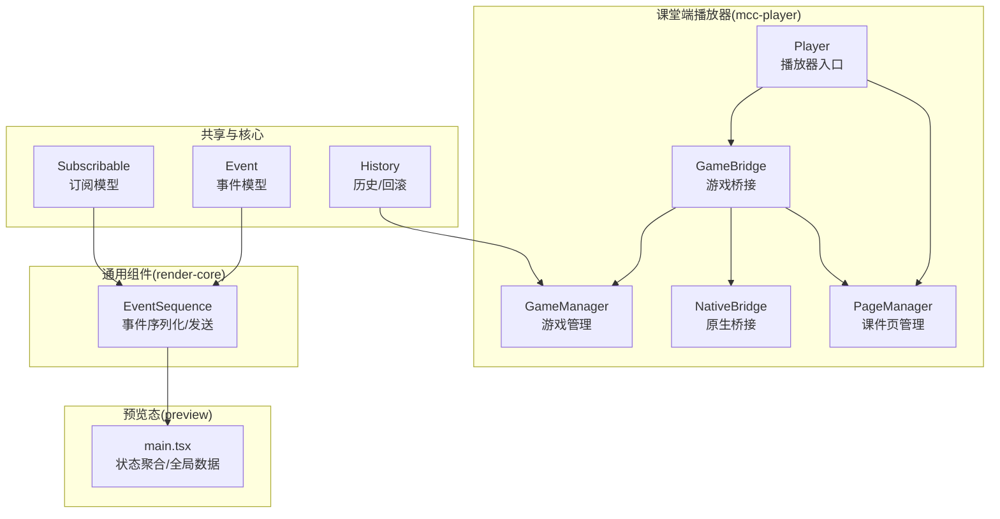
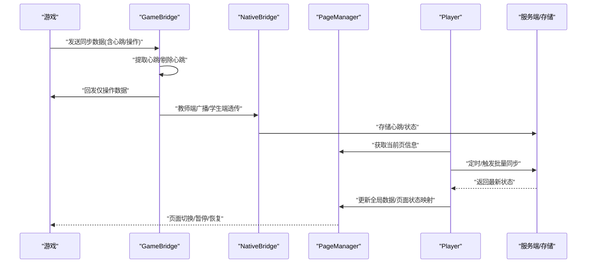
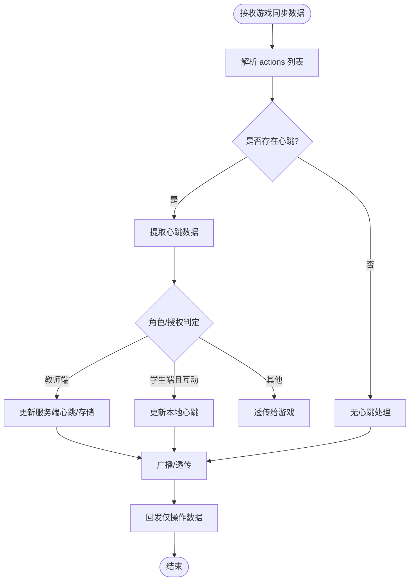
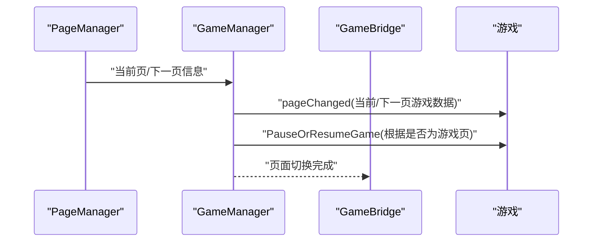
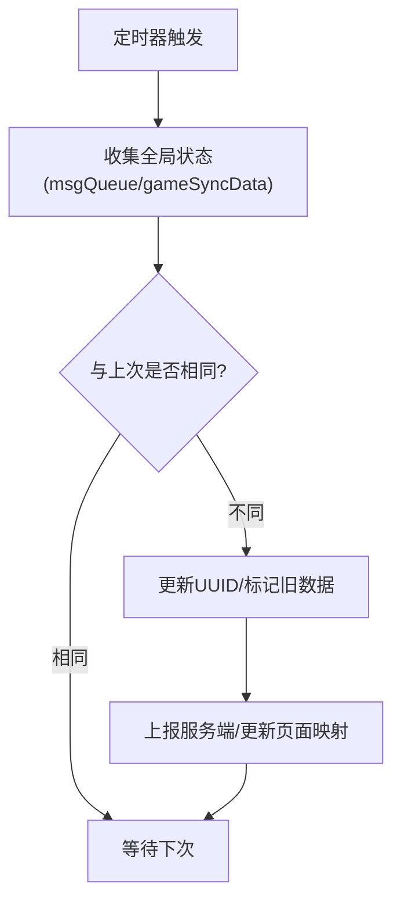
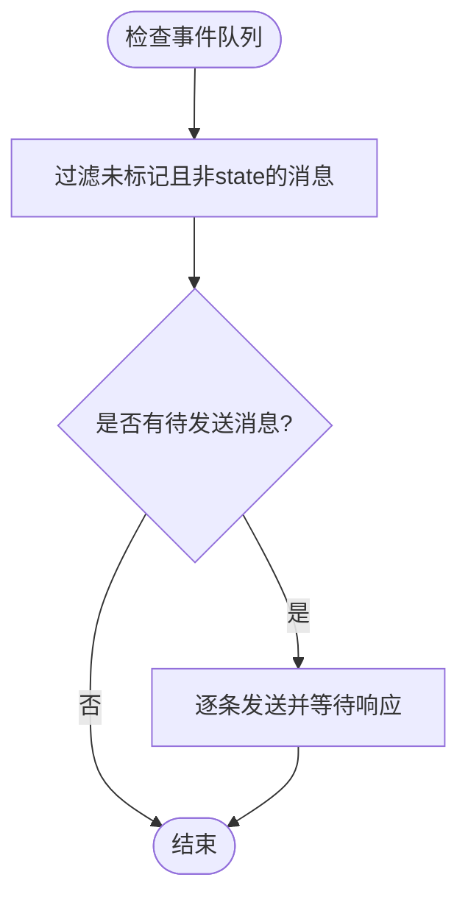
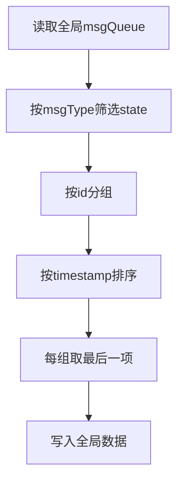
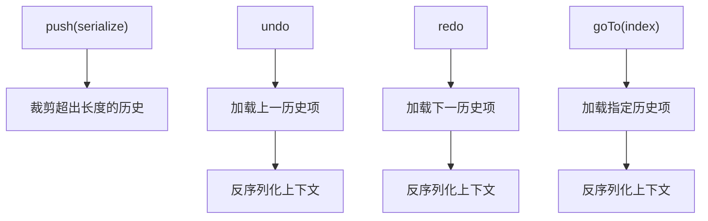
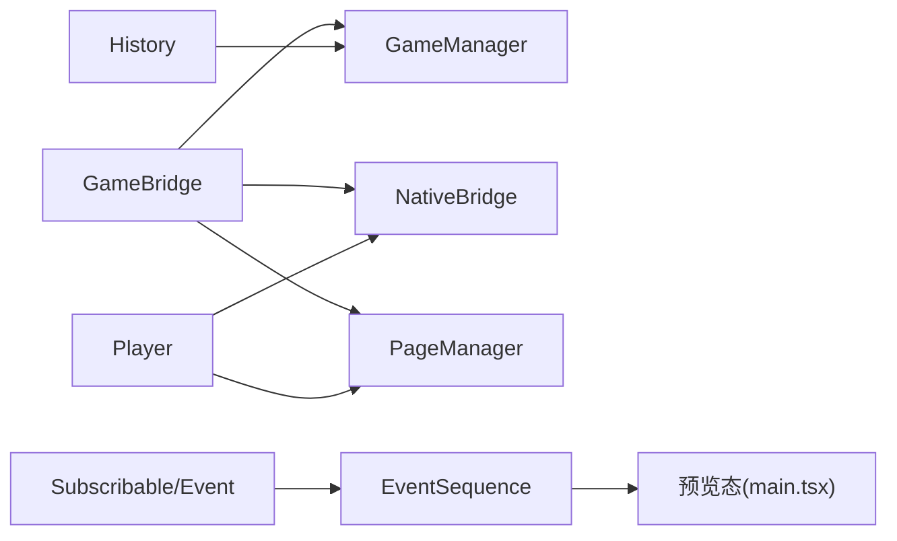

# 游戏状态同步

<cite>
**本文引用的文件**
- [bridge/mcc-player/src/components/game-manage/gameBridge.ts](file://bridge/mcc-player/src/components/game-manage/gameBridge.ts)
- [bridge/mcc-player/src/components/game-manage/gameManager.ts](file://bridge/mcc-player/src/components/game-manage/gameManager.ts)
- [bridge/mcc-player/src/components/game-manage/type.ts](file://bridge/mcc-player/src/components/game-manage/type.ts)
- [bridge/mcc-player/src/components/native-bridge/nativeBridgeManage.ts](file://bridge/mcc-player/src/components/native-bridge/nativeBridgeManage.ts)
- [bridge/mcc-player/src/components/page/pageManager.ts](file://bridge/mcc-player/src/components/page/pageManager.ts)
- [bridge/mcc-player/src/components/player/index.ts](file://bridge/mcc-player/src/components/player/index.ts)
- [common/render-core/components/EventSequence.tsx](file://common/render-core/components/EventSequence.tsx)
- [preview/src/main.tsx](file://preview/src/main.tsx)
- [packages/shared/src/subscribable.ts](file://packages/shared/src/subscribable.ts)
- [packages/shared/src/event.ts](file://packages/shared/src/event.ts)
- [packages/core/src/models/History.ts](file://packages/core/src/models/History.ts)
</cite>

## 目录
1. [引言](#引言)
2. [项目结构](#项目结构)
3. [核心组件](#核心组件)
4. [架构总览](#架构总览)
5. [详细组件分析](#详细组件分析)
6. [依赖分析](#依赖分析)
7. [性能考虑](#性能考虑)
8. [故障排查指南](#故障排查指南)
9. [结论](#结论)
10. [附录](#附录)

## 引言
本技术文档围绕“游戏状态同步系统”展开，目标是帮助开发者与产品人员理解并正确使用该系统。文档从“游戏状态的定义与分类”出发，逐步深入到“状态监听、变化检测与数据传输”的实现机制，覆盖“一致性保证（冲突解决、版本控制、回滚）”、“实时更新策略（增量更新、批量同步、延迟合并）”，并给出“配置选项与性能优化建议”。最后提供“实际示例与常见问题解决方案”。

## 项目结构
本仓库采用多包/多模块组织方式，游戏状态同步主要分布在以下模块：
- bridge/mcc-player：课堂端播放器与游戏桥接层，负责游戏生命周期、状态收集与下发、Pomelo 通信、本地存储与服务端存储协调。
- common/render-core：通用渲染与事件序列化组件，负责事件队列、状态消息的合并与发送。
- preview：预览态下的状态聚合与全局数据更新。
- packages/shared：通用订阅与事件模型，支撑跨模块解耦。
- packages/core：编辑态历史模型，提供回滚与版本控制基础。

图表来源
- [bridge/mcc-player/src/components/game-manage/gameBridge.ts:1-388](file://bridge/mcc-player/src/components/game-manage/gameBridge.ts#L1-388)
- [bridge/mcc-player/src/components/game-manage/gameManager.ts:1-368](file://bridge/mcc-player/src/components/game-manage/gameManager.ts#L1-368)
- [bridge/mcc-player/src/components/native-bridge/nativeBridgeManage.ts:1-395](file://bridge/mcc-player/src/components/native-bridge/nativeBridgeManage.ts#L1-395)
- [bridge/mcc-player/src/components/page/pageManager.ts:1-498](file://bridge/mcc-player/src/components/page/pageManager.ts#L1-498)
- [bridge/mcc-player/src/components/player/index.ts:1-363](file://bridge/mcc-player/src/components/player/index.ts#L1-363)
- [common/render-core/components/EventSequence.tsx:61-91](file://common/render-core/components/EventSequence.tsx#L61-L91)
- [preview/src/main.tsx:185-220](file://preview/src/main.tsx#L185-L220)
- [packages/shared/src/subscribable.ts:1-60](file://packages/shared/src/subscribable.ts#L1-L60)
- [packages/shared/src/event.ts:189-230](file://packages/shared/src/event.ts#L189-L230)
- [packages/core/src/models/History.ts:48-125](file://packages/core/src/models/History.ts#L48-L125)

章节来源
- [bridge/mcc-player/src/components/game-manage/gameBridge.ts:1-388](file://bridge/mcc-player/src/components/game-manage/gameBridge.ts#L1-388)
- [bridge/mcc-player/src/components/game-manage/gameManager.ts:1-368](file://bridge/mcc-player/src/components/game-manage/gameManager.ts#L1-368)
- [bridge/mcc-player/src/components/native-bridge/nativeBridgeManage.ts:1-395](file://bridge/mcc-player/src/components/native-bridge/nativeBridgeManage.ts#L1-395)
- [bridge/mcc-player/src/components/page/pageManager.ts:1-498](file://bridge/mcc-player/src/components/page/pageManager.ts#L1-498)
- [bridge/mcc-player/src/components/player/index.ts:1-363](file://bridge/mcc-player/src/components/player/index.ts#L1-363)
- [common/render-core/components/EventSequence.tsx:61-91](file://common/render-core/components/EventSequence.tsx#L61-L91)
- [preview/src/main.tsx:185-220](file://preview/src/main.tsx#L185-L220)
- [packages/shared/src/subscribable.ts:1-60](file://packages/shared/src/subscribable.ts#L1-L60)
- [packages/shared/src/event.ts:189-230](file://packages/shared/src/event.ts#L189-L230)
- [packages/core/src/models/History.ts:48-125](file://packages/core/src/models/History.ts#L48-L125)

## 核心组件
- GameBridge：统一处理游戏侧消息、心跳与同步数据的接收/分发，维护本地/服务端心跳数据，协调教师端与学生端的授权与互动。
- GameManager：继承自 GameBridge，负责游戏资源路径、页面切换、暂停/恢复引擎、预加载与授权状态的联动。
- NativeBridge：封装与原生/网页端的消息通道，负责 Pomelo 通信、存储与状态上报。
- PageManager：课件页目录与资源拉取、全局数据设置、埋点上报。
- Player：播放器入口，负责定时批量同步、UUID 标识、页面状态映射与全局数据更新。
- EventSequence：事件序列化与发送，支持延迟合并与重试。
- 预览态 main.tsx：将状态类消息按页聚合，取最新一条作为全局数据，供预览态消费。
- History：编辑态历史模型，提供撤销/重做与版本游标，为“回滚”提供基础。

章节来源
- [bridge/mcc-player/src/components/game-manage/gameBridge.ts:22-388](file://bridge/mcc-player/src/components/game-manage/gameBridge.ts#L22-L388)
- [bridge/mcc-player/src/components/game-manage/gameManager.ts:65-368](file://bridge/mcc-player/src/components/game-manage/gameManager.ts#L65-L368)
- [bridge/mcc-player/src/components/native-bridge/nativeBridgeManage.ts:26-395](file://bridge/mcc-player/src/components/native-bridge/nativeBridgeManage.ts#L26-L395)
- [bridge/mcc-player/src/components/page/pageManager.ts:17-498](file://bridge/mcc-player/src/components/page/pageManager.ts#L17-L498)
- [bridge/mcc-player/src/components/player/index.ts:24-363](file://bridge/mcc-player/src/components/player/index.ts#L24-L363)
- [common/render-core/components/EventSequence.tsx:61-91](file://common/render-core/components/EventSequence.tsx#L61-L91)
- [preview/src/main.tsx:185-220](file://preview/src/main.tsx#L185-L220)
- [packages/core/src/models/History.ts:48-125](file://packages/core/src/models/History.ts#L48-L125)

## 架构总览
游戏状态同步涉及“状态采集—心跳与操作分离—广播/透传—落地存储—预览聚合—下发到游戏”的完整链路。

图表来源
- [bridge/mcc-player/src/components/game-manage/gameBridge.ts:116-189](file://bridge/mcc-player/src/components/game-manage/gameBridge.ts#L116-L189)
- [bridge/mcc-player/src/components/native-bridge/nativeBridgeManage.ts:254-262](file://bridge/mcc-player/src/components/native-bridge/nativeBridgeManage.ts#L254-L262)
- [bridge/mcc-player/src/components/player/index.ts:147-223](file://bridge/mcc-player/src/components/player/index.ts#L147-L223)
- [bridge/mcc-player/src/components/page/pageManager.ts:17-115](file://bridge/mcc-player/src/components/page/pageManager.ts#L17-L115)

## 详细组件分析

### 组件A：GameBridge（状态监听、心跳与广播）
- 责任边界
  - 统一处理游戏侧事件：主包/框架加载完成、游戏开始、心跳、互动、授权等。
  - 区分心跳与操作：从 actions 中提取心跳并单独处理，其余作为操作下发给游戏。
  - 教师端/学生端/互动授权：根据角色与授权状态，决定本地存储、服务端存储与广播行为。
- 关键流程
  - onGameSyncData：提取心跳、更新 storeData、回发仅操作数据、必要时广播/透传。
  - recvSyncData：接收广播，更新心跳数据，非教师/非互动时回发给游戏。
  - onInteractAction：记录互动状态，联动本地心跳数据与游戏下发。
  - getGameStartResultData：根据角色与互动状态返回 isMaster、心跳数据与额外参数。
  - 本地心跳存储：setLocalSyncData/getLocalSyncData/clearLocalSyncData。
- 一致性与回滚
  - 通过 storeData 与本地心跳数据双轨存储，结合 UUID 与页面标识，保障回放/重放一致性。
  - 与 History 模型配合，可在编辑态进行回滚；运行态通过心跳与UUID实现“近似回滚”。

图表来源
- [bridge/mcc-player/src/components/game-manage/gameBridge.ts:116-189](file://bridge/mcc-player/src/components/game-manage/gameBridge.ts#L116-L189)
- [bridge/mcc-player/src/components/game-manage/gameBridge.ts:286-339](file://bridge/mcc-player/src/components/game-manage/gameBridge.ts#L286-L339)

章节来源
- [bridge/mcc-player/src/components/game-manage/gameBridge.ts:116-388](file://bridge/mcc-player/src/components/game-manage/gameBridge.ts#L116-L388)

### 组件B：GameManager（页面切换与引擎控制）
- 责任边界
  - 游戏资源路径解析（本地/CDN）、页面关联、预加载、切页时的引擎暂停/恢复。
  - 与 GameBridge 协作，下发页面变更、暂停/恢复指令。
- 关键流程
  - initData/setGameDataByPageJson：构建游戏页数据映射。
  - changeGamePage：页面切换时清理/更新心跳数据，下发页面与引擎控制指令。
  - getWatchScreenData：为“授课端看学生屏幕”场景提供数据。

图表来源
- [bridge/mcc-player/src/components/game-manage/gameManager.ts:197-260](file://bridge/mcc-player/src/components/game-manage/gameManager.ts#L197-L260)
- [bridge/mcc-player/src/components/game-manage/gameManager.ts:349-365](file://bridge/mcc-player/src/components/game-manage/gameManager.ts#L349-L365)

章节来源
- [bridge/mcc-player/src/components/game-manage/gameManager.ts:65-368](file://bridge/mcc-player/src/components/game-manage/gameManager.ts#L65-L368)

### 组件C：Player（批量同步与定时器）
- 责任边界
  - 定时器驱动三秒批量同步，避免频繁网络请求。
  - 使用 UUID 标识每份状态，仅在内容变化时更新并上报。
  - 页面状态映射与全局数据更新，供预览态与游戏消费。
- 关键流程
  - setInterVal：教师端开启定时器，周期性 onSetStoreData。
  - onSetStoreData：比较 oldStoreData 与当前全局数据，差异则更新 UUID 并上报。
  - setPageMapGlobalData：维护页面状态映射，供预览态使用。

图表来源
- [bridge/mcc-player/src/components/player/index.ts:134-223](file://bridge/mcc-player/src/components/player/index.ts#L134-L223)

章节来源
- [bridge/mcc-player/src/components/player/index.ts:134-223](file://bridge/mcc-player/src/components/player/index.ts#L134-L223)

### 组件D：EventSequence（事件序列化与发送）
- 责任边界
  - 将事件队列按顺序发送，过滤状态类型消息，支持延迟合并与重试。
- 关键流程
  - check：过滤未标记且非“state”类型的消息，逐条发送。

图表来源
- [common/render-core/components/EventSequence.tsx:72-91](file://common/render-core/components/EventSequence.tsx#L72-L91)

章节来源
- [common/render-core/components/EventSequence.tsx:61-91](file://common/render-core/components/EventSequence.tsx#L61-L91)

### 组件E：预览态状态聚合（preview/main.tsx）
- 责任边界
  - 将全局事件队列按 id 分组，按时间戳排序，取每组最后一项，形成“状态队列”并写入全局数据。
- 关键流程
  - 从全局数据中提取 msgQueue，筛选 msgType 为“state”的消息，按 id 聚合并取最新项，写回全局数据。

图表来源
- [preview/src/main.tsx:196-218](file://preview/src/main.tsx#L196-L218)

章节来源
- [preview/src/main.tsx:185-220](file://preview/src/main.tsx#L185-L220)

### 组件F：History（版本控制与回滚）
- 责任边界
  - 提供历史栈 push/undo/redo/goTo/clear，用于编辑态回滚与版本游标定位。
- 关键流程
  - push：序列化上下文，限制历史长度，触发 onPush。
  - undo/redo：定位历史项，反序列化上下文，触发 onUndo/onRedo。
  - goTo：直接跳转到指定历史点。

图表来源
- [packages/core/src/models/History.ts:52-119](file://packages/core/src/models/History.ts#L52-L119)

章节来源
- [packages/core/src/models/History.ts:48-125](file://packages/core/src/models/History.ts#L48-L125)

## 依赖分析
- 组件耦合
  - GameBridge 依赖 GameManager/PageManager/NativeBridge，承担消息编排与一致性控制。
  - Player 依赖 PageManager/NativeBridge，负责批量同步与定时器。
  - EventSequence 依赖全局事件存储，负责发送端策略。
  - History 为编辑态提供回滚能力，与运行态通过心跳/UUID 辅助一致性。
- 外部依赖
  - Pomelo/WebSocket：用于跨端广播与透传。
  - localStorage：学生端互动时的本地心跳缓存。
  - 微应用微前端：通过 microApp 全局数据传递与事件通知。

图表来源
- [bridge/mcc-player/src/components/game-manage/gameBridge.ts:1-50](file://bridge/mcc-player/src/components/game-manage/gameBridge.ts#L1-L50)
- [bridge/mcc-player/src/components/player/index.ts:1-53](file://bridge/mcc-player/src/components/player/index.ts#L1-L53)
- [common/render-core/components/EventSequence.tsx:61-91](file://common/render-core/components/EventSequence.tsx#L61-L91)
- [packages/shared/src/subscribable.ts:1-60](file://packages/shared/src/subscribable.ts#L1-L60)
- [packages/shared/src/event.ts:189-230](file://packages/shared/src/event.ts#L189-L230)
- [packages/core/src/models/History.ts:48-125](file://packages/core/src/models/History.ts#L48-L125)

章节来源
- [bridge/mcc-player/src/components/game-manage/gameBridge.ts:1-50](file://bridge/mcc-player/src/components/game-manage/gameBridge.ts#L1-L50)
- [bridge/mcc-player/src/components/player/index.ts:1-53](file://bridge/mcc-player/src/components/player/index.ts#L1-L53)
- [common/render-core/components/EventSequence.tsx:61-91](file://common/render-core/components/EventSequence.tsx#L61-L91)
- [packages/shared/src/subscribable.ts:1-60](file://packages/shared/src/subscribable.ts#L1-L60)
- [packages/shared/src/event.ts:189-230](file://packages/shared/src/event.ts#L189-L230)
- [packages/core/src/models/History.ts:48-125](file://packages/core/src/models/History.ts#L48-L125)

## 性能考虑
- 增量更新
  - 心跳与操作分离，仅广播/透传操作，减少无效数据。
  - 本地心跳缓存（localStorage）降低服务端压力，适合互动场景。
- 批量同步
  - 教师端三秒定时器批量上报，避免高频网络请求。
  - 比较 oldStoreData 与当前全局数据，仅在变化时更新 UUID 并上报。
- 延迟合并
  - EventSequence 支持延迟合并与重试，降低瞬时峰值。
- 资源路径与容错
  - 本地优先、CDN 备用，失败自动切换，提升加载稳定性。
- 历史与回滚
  - 编辑态使用 History 实现快速回滚；运行态通过心跳与 UUID 实现“近似回滚”。

[本节为通用指导，无需列出章节来源]

## 故障排查指南
- 心跳未到达/不生效
  - 检查 GameBridge 是否正确提取心跳并更新 storeData。
  - 确认教师端广播与学生端透传路径是否按角色启用。
- 同步延迟
  - 检查 Player 的定时器是否启动（教师端）。
  - 检查 EventSequence 的发送队列与重试逻辑。
- 互动心跳丢失
  - 确认 setLocalSyncData/getLocalSyncData 的 key 前缀与 userId 组合是否一致。
  - 页面切换时是否触发 clearLocalSyncData。
- 预览态状态不一致
  - 检查 preview/main.tsx 的按 id 聚合与取最新逻辑。
- 回滚/重放异常
  - 编辑态使用 History 的 undo/redo；运行态依赖心跳与 UUID 进行近似回滚。

章节来源
- [bridge/mcc-player/src/components/game-manage/gameBridge.ts:116-189](file://bridge/mcc-player/src/components/game-manage/gameBridge.ts#L116-L189)
- [bridge/mcc-player/src/components/game-manage/gameBridge.ts:341-371](file://bridge/mcc-player/src/components/game-manage/gameBridge.ts#L341-L371)
- [bridge/mcc-player/src/components/player/index.ts:134-223](file://bridge/mcc-player/src/components/player/index.ts#L134-L223)
- [common/render-core/components/EventSequence.tsx:72-91](file://common/render-core/components/EventSequence.tsx#L72-L91)
- [preview/src/main.tsx:196-218](file://preview/src/main.tsx#L196-L218)
- [packages/core/src/models/History.ts:95-119](file://packages/core/src/models/History.ts#L95-L119)

## 结论
本系统通过“心跳与操作分离、本地/服务端双轨存储、定时批量同步、事件序列化与延迟合并”等机制，实现了课堂端与游戏端之间的高效、低抖动状态同步。教师端负责主控与广播，学生端在互动授权下具备本地心跳缓存能力；预览态与播放器入口共同确保状态一致性与可回放性。结合 History 的回滚能力与 Pomelo 的广播/透传，系统在复杂课堂场景下具备良好的稳定性与可维护性。

[本节为总结性内容，无需列出章节来源]

## 附录

### 游戏状态的定义与分类
- 游戏进度：页面切换、预加载、暂停/恢复等。
- 玩家数据：互动授权、互动心跳、观看授权等。
- 环境状态：课件资源路径、CDN 切换、加载进度、埋点参数等。

章节来源
- [bridge/mcc-player/src/components/game-manage/gameManager.ts:197-260](file://bridge/mcc-player/src/components/game-manage/gameManager.ts#L197-L260)
- [bridge/mcc-player/src/components/page/pageManager.ts:17-115](file://bridge/mcc-player/src/components/page/pageManager.ts#L17-L115)

### 状态同步配置选项与性能优化
- 定时同步间隔：教师端三秒批量同步（可调）。
- 心跳与操作分离：仅广播/透传操作，减少冗余。
- 本地缓存：互动心跳写入 localStorage，降低服务端压力。
- 事件合并：EventSequence 的延迟合并与重试。
- 资源容错：本地优先、CDN 备用、失败自动切换。
- 历史回滚：编辑态使用 History，运行态使用心跳+UUID。

章节来源
- [bridge/mcc-player/src/components/player/index.ts:134-223](file://bridge/mcc-player/src/components/player/index.ts#L134-L223)
- [common/render-core/components/EventSequence.tsx:72-91](file://common/render-core/components/EventSequence.tsx#L72-L91)
- [bridge/mcc-player/src/components/game-manage/gameBridge.ts:341-371](file://bridge/mcc-player/src/components/game-manage/gameBridge.ts#L341-L371)
- [packages/core/src/models/History.ts:52-119](file://packages/core/src/models/History.ts#L52-L119)

### 实际状态同步示例
- 教师端主控：定时器触发批量同步，服务端存储心跳与操作，广播给学生端。
- 学生端互动：本地缓存心跳，授权期间与教师端保持一致，取消互动时清理本地缓存。
- 预览态聚合：按 id 聚合状态消息，取最新一条写入全局数据，供预览态消费。

章节来源
- [bridge/mcc-player/src/components/player/index.ts:147-223](file://bridge/mcc-player/src/components/player/index.ts#L147-L223)
- [bridge/mcc-player/src/components/game-manage/gameBridge.ts:116-189](file://bridge/mcc-player/src/components/game-manage/gameBridge.ts#L116-L189)
- [preview/src/main.tsx:196-218](file://preview/src/main.tsx#L196-L218)