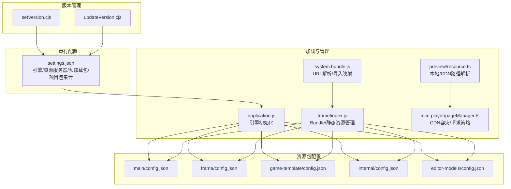
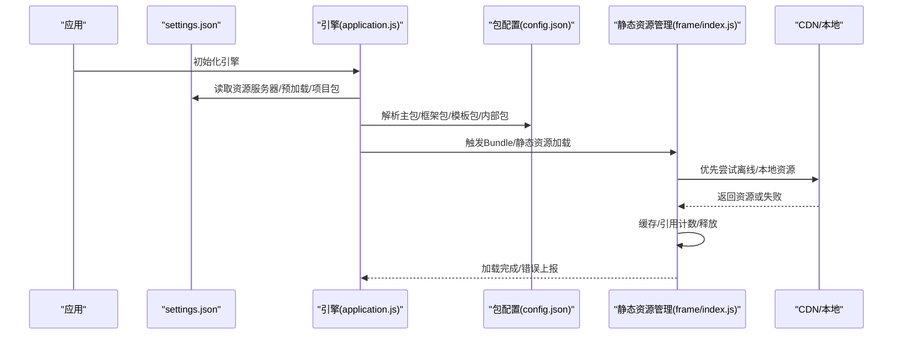
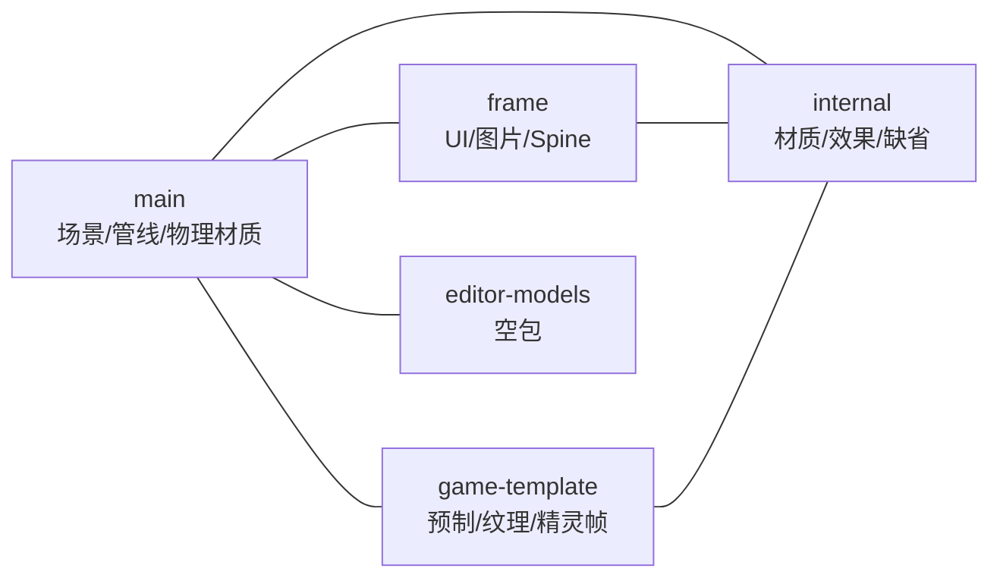
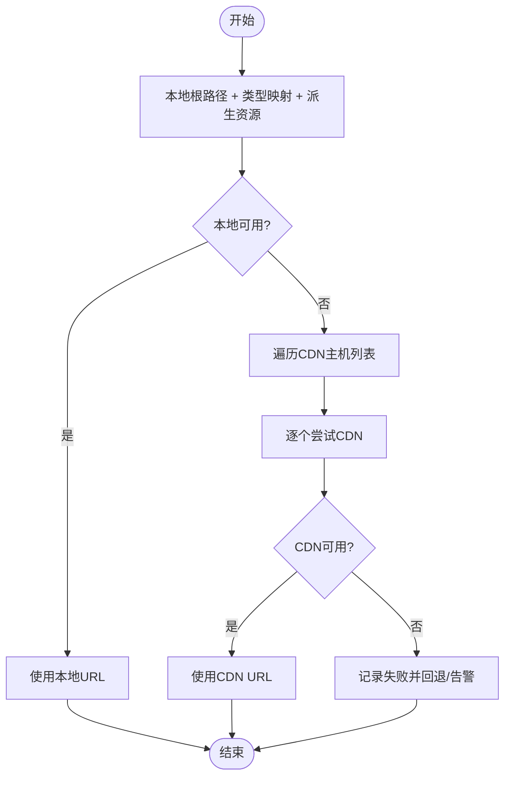
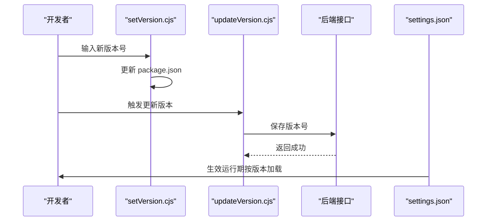
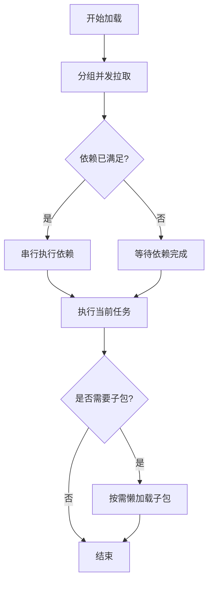
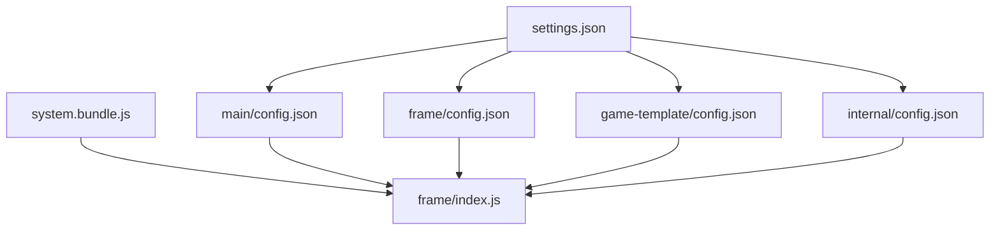

# 游戏资源配置

<cite>
**本文引用的文件**
- [settings.json](file://bridge/cocos-game-player/src/settings.json)
- [config.json（主包）](file://bridge/cocos-game-player/assets/main/config.json)
- [config.json（框架包）](file://bridge/cocos-game-player/assets/frame/config.json)
- [config.json（游戏模板）](file://bridge/cocos-game-player/assets/game-template/config.json)
- [config.json（内部包）](file://bridge/cocos-game-player/assets/internal/config.json)
- [config.json（编辑器模型）](file://bridge/cocos-game-player/assets/editor-models/config.json)
- [application.js](file://bridge/cocos-game-player/application.js)
- [index.js（静态资源管理器）](file://bridge/cocos-game-player/assets/frame/index.js)
- [resource.ts](file://preview/src/utils/resource.ts)
- [pageManager.ts](file://bridge/mcc-player/src/components/page/pageManager.ts)
- [system.bundle.js](file://bridge/cocos-game-player/src/system.bundle.js)
- [updateVersion.cjs](file://task/scripts/updateVersion.cjs)
- [setVersion.cjs](file://task/scripts/setVersion.cjs)
</cite>

## 目录
1. [简介](#简介)
2. [项目结构](#项目结构)
3. [核心组件](#核心组件)
4. [架构总览](#架构总览)
5. [详细组件分析](#详细组件分析)
6. [依赖关系分析](#依赖关系分析)
7. [性能考量](#性能考量)
8. [故障排查指南](#故障排查指南)
9. [结论](#结论)
10. [附录](#附录)

## 简介
本技术文档面向“游戏资源配置系统”，围绕主包、框架包、公共模块与游戏子包的配置方式，资源路径解析（本地与CDN）、资源版本管理（版本号解析、切换与回滚）、资源加载策略（并行、串行、懒加载），以及最佳实践与性能优化进行系统化梳理，并提供完整示例与故障排查指引。

## 项目结构
本仓库中与游戏资源配置直接相关的核心位置如下：
- 引擎与运行配置：bridge/cocos-game-player/src/settings.json 定义引擎、资源服务器、预加载包、项目包集合等。
- 资源包配置：各包的 config.json 描述 uuids、paths、packs、versions、dependencyRelationships 等。
- 资源加载与静态资源管理：bridge/cocos-game-player/assets/frame/index.js 提供 Bundle 与静态资源加载、缓存与释放逻辑。
- 路径解析与CDN：preview/src/utils/resource.ts 与 bridge/mcc-player/src/components/page/pageManager.ts 展示本地/CDN路径拼接与容灾策略。
- 版本管理脚本：task/scripts/setVersion.cjs 与 updateVersion.cjs 提供版本号设置与发布更新流程。

图表来源
- [settings.json:33-54](file://bridge/cocos-game-player/src/settings.json#L33-L54)
- [config.json（主包）:1-38](file://bridge/cocos-game-player/assets/main/config.json#L1-L38)
- [config.json（框架包）:1-204](file://bridge/cocos-game-player/assets/frame/config.json#L1-L204)
- [config.json（游戏模板）:1-205](file://bridge/cocos-game-player/assets/game-template/config.json#L1-L205)
- [config.json（内部包）:1-167](file://bridge/cocos-game-player/assets/internal/config.json#L1-L167)
- [config.json（编辑器模型）:1-19](file://bridge/cocos-game-player/assets/editor-models/config.json#L1-L19)
- [application.js:24-56](file://bridge/cocos-game-player/application.js#L24-L56)
- [index.js（静态资源管理器）:1226-5234](file://bridge/cocos-game-player/assets/frame/index.js#L1226-L5234)
- [resource.ts:1-64](file://preview/src/utils/resource.ts#L1-L64)
- [pageManager.ts:417-453](file://bridge/mcc-player/src/components/page/pageManager.ts#L417-L453)
- [system.bundle.js:82-120](file://bridge/cocos-game-player/src/system.bundle.js#L82-L120)
- [setVersion.cjs:1-61](file://task/scripts/setVersion.cjs#L1-L61)
- [updateVersion.cjs:1-50](file://task/scripts/updateVersion.cjs#L1-L50)

章节来源
- [settings.json:33-54](file://bridge/cocos-game-player/src/settings.json#L33-L54)
- [config.json（主包）:1-38](file://bridge/cocos-game-player/assets/main/config.json#L1-L38)
- [config.json（框架包）:1-204](file://bridge/cocos-game-player/assets/frame/config.json#L1-L204)
- [config.json（游戏模板）:1-205](file://bridge/cocos-game-player/assets/game-template/config.json#L1-L205)
- [config.json（内部包）:1-167](file://bridge/cocos-game-player/assets/internal/config.json#L1-L167)
- [config.json（编辑器模型）:1-19](file://bridge/cocos-game-player/assets/editor-models/config.json#L1-L19)
- [application.js:24-56](file://bridge/cocos-game-player/application.js#L24-L56)
- [index.js（静态资源管理器）:1226-5234](file://bridge/cocos-game-player/assets/frame/index.js#L1226-L5234)
- [resource.ts:1-64](file://preview/src/utils/resource.ts#L1-L64)
- [pageManager.ts:417-453](file://bridge/mcc-player/src/components/page/pageManager.ts#L417-L453)
- [system.bundle.js:82-120](file://bridge/cocos-game-player/src/system.bundle.js#L82-L120)
- [setVersion.cjs:1-61](file://task/scripts/setVersion.cjs#L1-L61)
- [updateVersion.cjs:1-50](file://task/scripts/updateVersion.cjs#L1-L50)

## 核心组件
- 运行配置中心（settings.json）
  - 定义引擎版本、平台、宏、内置资源、资源服务器、预加载包、项目包集合、脚本包列表、启动场景、分辨率与屏幕策略等。
  - 关键字段：assets.server、assets.preloadBundles、assets.projectBundles、assets.bundleVers 等。
- 资源包配置（各包 config.json）
  - 描述包名、依赖、uuids、paths（资源路径与类型映射）、packs（打包集合）、versions（版本信息）、redirect、dependencyRelationships（依赖关系图）等。
- 资源加载与管理（frame/index.js）
  - 提供 Bundle 加载、静态资源加载（本地离线与 CDN）、缓存与引用计数、资源释放、加载状态机与错误上报。
- 路径解析与CDN（resource.ts、pageManager.ts）
  - 本地根路径与CDN路径拼接、多CDN备选、容灾回退策略、派生资源（如多尺寸图）批量生成。
- 版本管理（setVersion.cjs、updateVersion.cjs）
  - 读取/更新系统版本号、调用接口保存版本、支持交互式输入与默认值提示。
- 导入映射与URL解析（system.bundle.js）
  - 实现相对/绝对URL解析、导入映射预处理、依赖拓扑执行与异步执行链路。

章节来源
- [settings.json:33-54](file://bridge/cocos-game-player/src/settings.json#L33-L54)
- [config.json（主包）:1-38](file://bridge/cocos-game-player/assets/main/config.json#L1-L38)
- [config.json（框架包）:1-204](file://bridge/cocos-game-player/assets/frame/config.json#L1-L204)
- [config.json（游戏模板）:1-205](file://bridge/cocos-game-player/assets/game-template/config.json#L1-L205)
- [config.json（内部包）:1-167](file://bridge/cocos-game-player/assets/internal/config.json#L1-L167)
- [config.json（编辑器模型）:1-19](file://bridge/cocos-game-player/assets/editor-models/config.json#L1-L19)
- [index.js（静态资源管理器）:1226-5234](file://bridge/cocos-game-player/assets/frame/index.js#L1226-L5234)
- [resource.ts:1-64](file://preview/src/utils/resource.ts#L1-L64)
- [pageManager.ts:417-453](file://bridge/mcc-player/src/components/page/pageManager.ts#L417-L453)
- [system.bundle.js:82-120](file://bridge/cocos-game-player/src/system.bundle.js#L82-L120)
- [setVersion.cjs:1-61](file://task/scripts/setVersion.cjs#L1-L61)
- [updateVersion.cjs:1-50](file://task/scripts/updateVersion.cjs#L1-L50)

## 架构总览
下图展示从应用启动到资源加载的关键路径：引擎初始化 → 读取运行配置 → 解析包与依赖 → Bundle/静态资源加载 → 缓存与释放 → CDN/本地容灾。

图表来源
- [application.js:24-56](file://bridge/cocos-game-player/application.js#L24-L56)
- [settings.json:33-54](file://bridge/cocos-game-player/src/settings.json#L33-L54)
- [config.json（主包）:1-38](file://bridge/cocos-game-player/assets/main/config.json#L1-L38)
- [config.json（框架包）:1-204](file://bridge/cocos-game-player/assets/frame/config.json#L1-L204)
- [config.json（游戏模板）:1-205](file://bridge/cocos-game-player/assets/game-template/config.json#L1-L205)
- [config.json（内部包）:1-167](file://bridge/cocos-game-player/assets/internal/config.json#L1-L167)
- [index.js（静态资源管理器）:1226-5234](file://bridge/cocos-game-player/assets/frame/index.js#L1226-L5234)

## 详细组件分析

### 主包、框架包、公共模块与游戏子包配置
- 主包（main）
  - 包含场景、渲染管线、物理材质等基础资源，作为启动场景与渲染基础。
- 框架包（frame）
  - 内置UI、图片、Spine动画等通用资源，定义依赖关系与打包集合。
- 游戏模板（game-template）
  - 提供预制体、纹理、精灵帧等模板资源，定义模板包的打包集合与依赖关系。
- 内部包（internal）
  - 内置材质、效果、缺省资源，形成统一的内部资产池。
- 编辑器模型（editor-models）
  - 空包占位，便于统一管理与扩展。

图表来源
- [config.json（主包）:1-38](file://bridge/cocos-game-player/assets/main/config.json#L1-L38)
- [config.json（框架包）:1-204](file://bridge/cocos-game-player/assets/frame/config.json#L1-L204)
- [config.json（游戏模板）:1-205](file://bridge/cocos-game-player/assets/game-template/config.json#L1-L205)
- [config.json（内部包）:1-167](file://bridge/cocos-game-player/assets/internal/config.json#L1-L167)
- [config.json（编辑器模型）:1-19](file://bridge/cocos-game-player/assets/editor-models/config.json#L1-L19)

章节来源
- [config.json（主包）:1-38](file://bridge/cocos-game-player/assets/main/config.json#L1-L38)
- [config.json（框架包）:1-204](file://bridge/cocos-game-player/assets/frame/config.json#L1-L204)
- [config.json（游戏模板）:1-205](file://bridge/cocos-game-player/assets/game-template/config.json#L1-L205)
- [config.json（内部包）:1-167](file://bridge/cocos-game-player/assets/internal/config.json#L1-L167)
- [config.json（编辑器模型）:1-19](file://bridge/cocos-game-player/assets/editor-models/config.json#L1-L19)

### 资源路径解析机制（本地与CDN）
- 本地路径
  - preview/src/utils/resource.ts 提供本地根路径与资源类型映射，结合派生资源列表生成本地URL。
- CDN路径
  - preview/src/utils/resource.ts 提供CDN主机列表与资源类型映射，生成多CDN备选URL。
  - bridge/mcc-player/src/components/page/pageManager.ts 在本地不可用时轮询备用CDN地址，具备容灾回退逻辑。
- URL解析与导入映射
  - bridge/cocos-game-player/src/system.bundle.js 实现相对/绝对URL解析、导入映射预处理，确保模块定位与依赖加载稳定。

图表来源
- [resource.ts:1-64](file://preview/src/utils/resource.ts#L1-L64)
- [pageManager.ts:417-453](file://bridge/mcc-player/src/components/page/pageManager.ts#L417-L453)
- [system.bundle.js:82-120](file://bridge/cocos-game-player/src/system.bundle.js#L82-L120)

章节来源
- [resource.ts:1-64](file://preview/src/utils/resource.ts#L1-L64)
- [pageManager.ts:417-453](file://bridge/mcc-player/src/components/page/pageManager.ts#L417-L453)
- [system.bundle.js:82-120](file://bridge/cocos-game-player/src/system.bundle.js#L82-L120)

### 资源版本管理（版本号解析、切换与回滚）
- 版本号解析与更新
  - task/scripts/setVersion.cjs 读取系统当前版本，支持交互式输入新版本号并更新 package.json。
  - task/scripts/updateVersion.cjs 调用后端接口保存版本号，便于线上统一管理。
- 切换与回滚
  - settings.json 中 assets.bundleVers 可用于指定包版本；在运行期可结合业务逻辑动态切换/回滚至历史版本（需配合服务端版本控制与CDN缓存策略）。

图表来源
- [setVersion.cjs:1-61](file://task/scripts/setVersion.cjs#L1-L61)
- [updateVersion.cjs:1-50](file://task/scripts/updateVersion.cjs#L1-L50)
- [settings.json:42-42](file://bridge/cocos-game-player/src/settings.json#L42-L42)

章节来源
- [setVersion.cjs:1-61](file://task/scripts/setVersion.cjs#L1-L61)
- [updateVersion.cjs:1-50](file://task/scripts/updateVersion.cjs#L1-L50)
- [settings.json:42-42](file://bridge/cocos-game-player/src/settings.json#L42-L42)

### 资源加载策略（并行、串行、懒加载）
- 并行加载
  - 静态资源管理器对同一组文件采用分组加载，组内并发拉取，提升吞吐。
- 串行加载
  - 依赖拓扑执行（system.bundle.js）保证依赖先于被依赖执行，避免循环与竞态。
- 懒加载
  - 按需触发子包加载（GameBundleManagerClass），在创建游戏实例前进行预加载，完成后释放多余Bundle，维持内存健康。

图表来源
- [index.js（静态资源管理器）:4875-4892](file://bridge/cocos-game-player/assets/frame/index.js#L4875-L4892)
- [system.bundle.js:470-486](file://bridge/cocos-game-player/src/system.bundle.js#L470-L486)
- [index.js（静态资源管理器）:2104-2304](file://bridge/cocos-game-player/assets/frame/index.js#L2104-L2304)

章节来源
- [index.js（静态资源管理器）:4875-4892](file://bridge/cocos-game-player/assets/frame/index.js#L4875-L4892)
- [system.bundle.js:470-486](file://bridge/cocos-game-player/src/system.bundle.js#L470-L486)
- [index.js（静态资源管理器）:2104-2304](file://bridge/cocos-game-player/assets/frame/index.js#L2104-L2304)

### 最佳实践与性能优化建议
- 资源组织
  - 将高频/热路径资源置于主包，冷门资源放入子包，利用懒加载降低首屏体积。
  - 使用 packs 对资源进行打包，减少HTTP连接开销。
- 路径与CDN
  - 本地优先、CDN备选，多CDN主机轮询，失败快速回退。
  - 对大图/视频等资源启用派生资源（多尺寸/多清晰度），按设备能力选择最优。
- 版本与缓存
  - 通过 bundleVers 指定版本，结合CDN缓存策略与强缓存/协商缓存，平衡一致性与性能。
  - 发布后清理旧版本资源，避免磁盘与内存占用。
- 加载策略
  - 并行拉取同组资源，串行执行依赖任务；对子包采用按需懒加载，及时释放不再使用的Bundle。
  - 引用计数与缓存上限控制，防止内存泄漏与抖动。

## 依赖关系分析
- settings.json 决定项目包集合与预加载策略，影响引擎初始化与资源加载顺序。
- 各包 config.json 的 dependencyRelationships 定义依赖关系图，决定加载顺序与打包策略。
- system.bundle.js 的导入映射与URL解析保障模块定位与依赖执行。
- frame/index.js 的静态资源管理器负责实际加载、缓存与释放。

图表来源
- [settings.json:33-54](file://bridge/cocos-game-player/src/settings.json#L33-L54)
- [config.json（主包）:1-38](file://bridge/cocos-game-player/assets/main/config.json#L1-L38)
- [config.json（框架包）:1-204](file://bridge/cocos-game-player/assets/frame/config.json#L1-L204)
- [config.json（游戏模板）:1-205](file://bridge/cocos-game-player/assets/game-template/config.json#L1-L205)
- [config.json（内部包）:1-167](file://bridge/cocos-game-player/assets/internal/config.json#L1-L167)
- [system.bundle.js:82-120](file://bridge/cocos-game-player/src/system.bundle.js#L82-L120)
- [index.js（静态资源管理器）:1226-5234](file://bridge/cocos-game-player/assets/frame/index.js#L1226-L5234)

章节来源
- [settings.json:33-54](file://bridge/cocos-game-player/src/settings.json#L33-L54)
- [config.json（主包）:1-38](file://bridge/cocos-game-player/assets/main/config.json#L1-L38)
- [config.json（框架包）:1-204](file://bridge/cocos-game-player/assets/frame/config.json#L1-L204)
- [config.json（游戏模板）:1-205](file://bridge/cocos-game-player/assets/game-template/config.json#L1-L205)
- [config.json（内部包）:1-167](file://bridge/cocos-game-player/assets/internal/config.json#L1-L167)
- [system.bundle.js:82-120](file://bridge/cocos-game-player/src/system.bundle.js#L82-L120)
- [index.js（静态资源管理器）:1226-5234](file://bridge/cocos-game-player/assets/frame/index.js#L1226-L5234)

## 性能考量
- 并发与串行
  - 同组资源并发拉取，依赖任务串行执行，避免阻塞关键路径。
- 缓存与释放
  - 引用计数与缓存上限控制，避免重复加载与内存膨胀。
- CDN与本地
  - 本地命中优先，CDN多节点备选，失败快速回退，减少首帧等待时间。
- 打包与懒加载
  - 合理划分包边界，按需懒加载，降低首屏体积与解析成本。

## 故障排查指南
- 资源无法加载
  - 检查 settings.json 中 assets.server 与 assets.projectBundles 是否正确。
  - 核对各包 config.json 的 paths 与 packs 是否匹配实际资源。
  - 使用 pageManager.ts 的容灾逻辑确认本地/CDN均不可用时的回退行为。
- 版本不一致
  - 使用 setVersion.cjs 更新版本号，再通过 updateVersion.cjs 保存至后端接口。
  - 检查 CDN 缓存策略，必要时强制刷新或增加版本后缀。
- 加载卡顿或内存飙升
  - 检查静态资源管理器的缓存上限与引用计数逻辑，确认释放策略是否生效。
  - 评估子包加载时机，避免集中加载导致峰值内存过高。

章节来源
- [settings.json:33-54](file://bridge/cocos-game-player/src/settings.json#L33-L54)
- [config.json（主包）:1-38](file://bridge/cocos-game-player/assets/main/config.json#L1-L38)
- [config.json（框架包）:1-204](file://bridge/cocos-game-player/assets/frame/config.json#L1-L204)
- [config.json（游戏模板）:1-205](file://bridge/cocos-game-player/assets/game-template/config.json#L1-L205)
- [config.json（内部包）:1-167](file://bridge/cocos-game-player/assets/internal/config.json#L1-L167)
- [pageManager.ts:417-453](file://bridge/mcc-player/src/components/page/pageManager.ts#L417-L453)
- [setVersion.cjs:1-61](file://task/scripts/setVersion.cjs#L1-L61)
- [updateVersion.cjs:1-50](file://task/scripts/updateVersion.cjs#L1-L50)
- [index.js（静态资源管理器）:4666-4691](file://bridge/cocos-game-player/assets/frame/index.js#L4666-L4691)

## 结论
通过规范化的包配置、严谨的路径解析与CDN容灾、可控的版本管理与加载策略，以及完善的缓存与释放机制，游戏资源配置系统能够在保证稳定性的同时显著提升性能与可维护性。建议在实际项目中结合业务特征持续优化包边界、CDN策略与版本发布流程。

## 附录
- 配置示例要点
  - 运行配置：在 settings.json 中明确 assets.server、assets.preloadBundles、assets.projectBundles、assets.bundleVers。
  - 包配置：在各包 config.json 中完善 uuids、paths、packs、versions、dependencyRelationships。
  - 路径解析：在 resource.ts 中配置本地根路径与CDN主机列表；在 pageManager.ts 中实现容灾回退。
  - 版本管理：使用 setVersion.cjs 与 updateVersion.cjs 完成版本号更新与保存。
- 参考文件
  - [settings.json:33-54](file://bridge/cocos-game-player/src/settings.json#L33-L54)
  - [config.json（主包）:1-38](file://bridge/cocos-game-player/assets/main/config.json#L1-L38)
  - [config.json（框架包）:1-204](file://bridge/cocos-game-player/assets/frame/config.json#L1-L204)
  - [config.json（游戏模板）:1-205](file://bridge/cocos-game-player/assets/game-template/config.json#L1-L205)
  - [config.json（内部包）:1-167](file://bridge/cocos-game-player/assets/internal/config.json#L1-L167)
  - [config.json（编辑器模型）:1-19](file://bridge/cocos-game-player/assets/editor-models/config.json#L1-L19)
  - [application.js:24-56](file://bridge/cocos-game-player/application.js#L24-L56)
  - [index.js（静态资源管理器）:1226-5234](file://bridge/cocos-game-player/assets/frame/index.js#L1226-L5234)
  - [resource.ts:1-64](file://preview/src/utils/resource.ts#L1-L64)
  - [pageManager.ts:417-453](file://bridge/mcc-player/src/components/page/pageManager.ts#L417-L453)
  - [system.bundle.js:82-120](file://bridge/cocos-game-player/src/system.bundle.js#L82-L120)
  - [setVersion.cjs:1-61](file://task/scripts/setVersion.cjs#L1-L61)
  - [updateVersion.cjs:1-50](file://task/scripts/updateVersion.cjs#L1-L50)