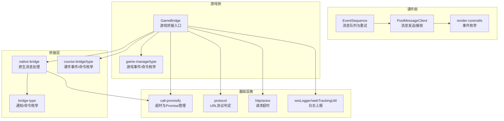
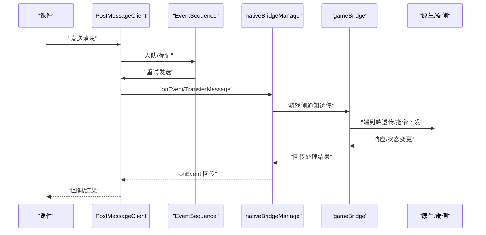
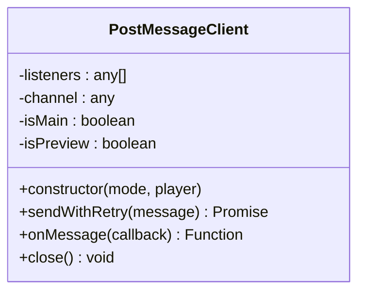
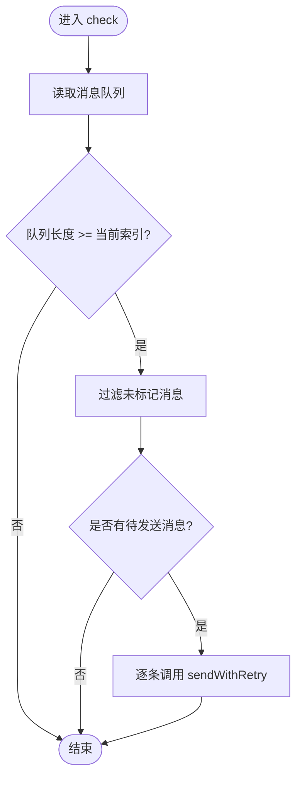
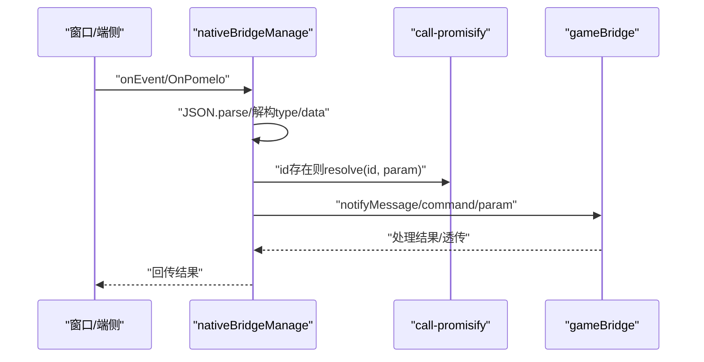
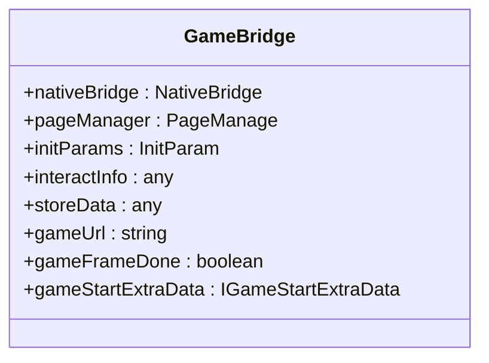
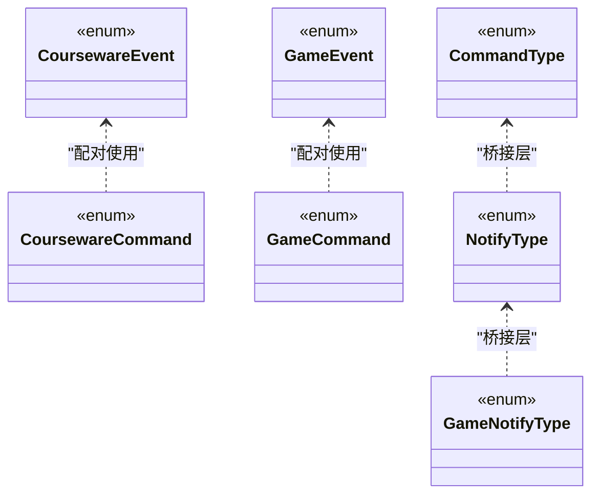
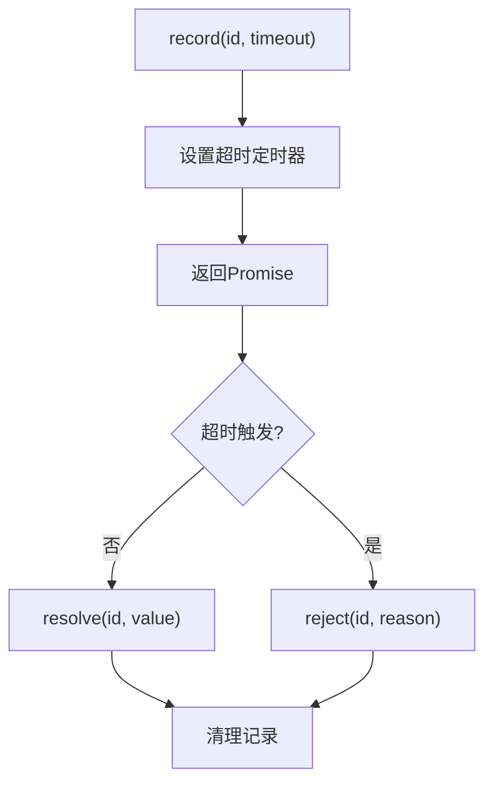
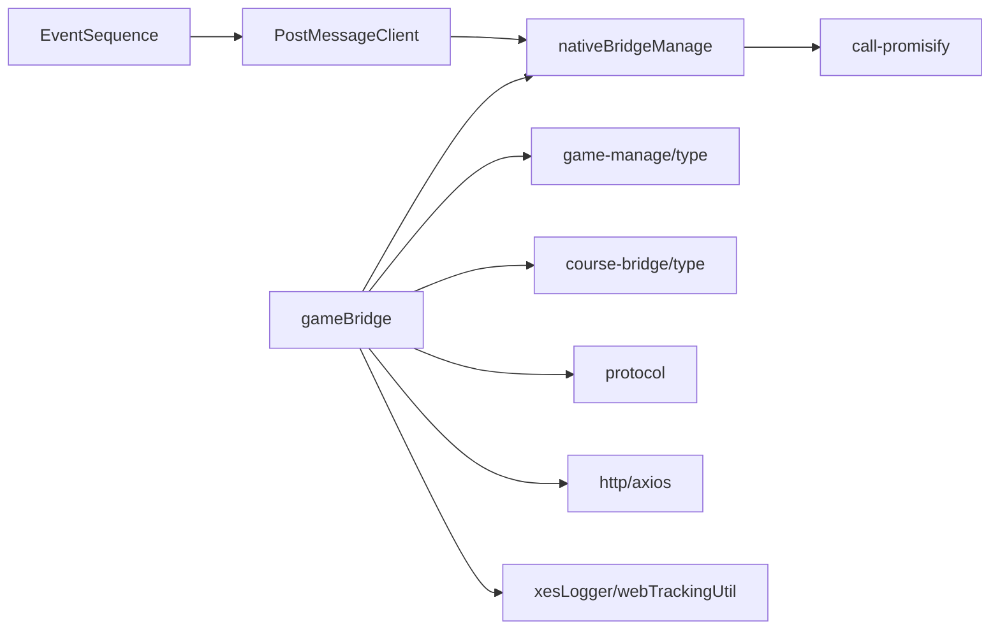

# 游戏通信机制

<cite>
**本文引用的文件**
- [bridge/mcc-player/src/components/native-bridge/nativeBridgeManage.ts](file://bridge/mcc-player/src/components/native-bridge/nativeBridgeManage.ts)
- [bridge/mcc-player/src/components/native-bridge/bridge-type.ts](file://bridge/mcc-player/src/components/native-bridge/bridge-type.ts)
- [bridge/mcc-player/src/components/game-manage/gameBridge.ts](file://bridge/mcc-player/src/components/game-manage/gameBridge.ts)
- [bridge/mcc-player/src/components/game-manage/type.ts](file://bridge/mcc-player/src/components/game-manage/type.ts)
- [common/render-core/components/PostMessageClient.ts](file://common/render-core/components/PostMessageClient.ts)
- [common/render-core/utils/index.ts](file://common/render-core/utils/index.ts)
- [common/render-core/components/EventSequence.tsx](file://common/render-core/components/EventSequence.tsx)
- [common/render-core/shared/mode.ts](file://common/render-core/shared/mode.ts)
- [bridge/mcc-player/src/libs/call-promisify/index.ts](file://bridge/mcc-player/src/libs/call-promisify/index.ts)
- [bridge/mcc-player/src/utils/protocol.ts](file://bridge/mcc-player/src/utils/protocol.ts)
- [bridge/mcc-player/src/components/page/type.ts](file://bridge/mcc-player/src/components/page/type.ts)
- [bridge/mcc-player/src/components/course-bridge/type.ts](file://bridge/mcc-player/src/components/course-bridge/type.ts)
- [bridge/mcc-player/src/interface/index.ts](file://bridge/mcc-player/src/interface/index.ts)
- [bridge/mcc-player/src/libs/xesLogger/ali-logger/webTrackingUtil.ts](file://bridge/mcc-player/src/libs/xesLogger/ali-logger/webTrackingUtil.ts)
- [bridge/mcc-player/src/constants/xesLog.ts](file://bridge/mcc-player/src/constants/xesLog.ts)
- [bridge/mcc-player/src/libs/http/axios.ts](file://bridge/mcc-player/src/libs/http/axios.ts)
- [bridge/mcc-demo/src/App.tsx](file://bridge/mcc-demo/src/App.tsx)
</cite>

## 目录
1. [引言](#引言)
2. [项目结构](#项目结构)
3. [核心组件](#核心组件)
4. [架构总览](#架构总览)
5. [详细组件分析](#详细组件分析)
6. [依赖关系分析](#依赖关系分析)
7. [性能考量](#性能考量)
8. [故障排查指南](#故障排查指南)
9. [结论](#结论)
10. [附录](#附录)

## 引言
本文件面向“游戏通信机制”的专业级技术文档，聚焦于游戏与课件系统之间的双向通信协议与实现细节。内容涵盖消息格式、事件类型与数据结构定义，双向通信的发送、接收与响应处理流程，通信安全与调试监控方法，以及异步通信中的消息队列、重试与超时策略。文档同时提供可操作的通信示例与故障排查建议，帮助开发者快速理解并稳定集成。

## 项目结构
围绕游戏通信的关键模块主要分布在以下位置：
- 课件与端侧桥接层：native-bridge 与 course-bridge
- 游戏管理与桥接：game-manage 与 gameBridge
- 课件侧消息通道：PostMessageClient 与 EventSequence
- 通用事件与枚举：render-core/utils 与 shared/mode
- 异步调用与超时：call-promisify
- 协议与网络：protocol 与 http 客户端
- 日志与监控：阿里云 SLS 日志封装与常量
- 示例与演示：mcc-demo

图表来源
- [common/render-core/components/PostMessageClient.ts:1-80](file://common/render-core/components/PostMessageClient.ts#L1-L80)
- [common/render-core/components/EventSequence.tsx:61-91](file://common/render-core/components/EventSequence.tsx#L61-L91)
- [common/render-core/utils/index.ts:23-40](file://common/render-core/utils/index.ts#L23-L40)
- [bridge/mcc-player/src/components/game-manage/gameBridge.ts:1-35](file://bridge/mcc-player/src/components/game-manage/gameBridge.ts#L1-L35)
- [bridge/mcc-player/src/components/game-manage/type.ts:1-67](file://bridge/mcc-player/src/components/game-manage/type.ts#L1-L67)
- [bridge/mcc-player/src/components/native-bridge/nativeBridgeManage.ts:1-90](file://bridge/mcc-player/src/components/native-bridge/nativeBridgeManage.ts#L1-L90)
- [bridge/mcc-player/src/components/native-bridge/bridge-type.ts:1-73](file://bridge/mcc-player/src/components/native-bridge/bridge-type.ts#L1-L73)
- [bridge/mcc-player/src/components/course-bridge/type.ts:1-55](file://bridge/mcc-player/src/components/course-bridge/type.ts#L1-L55)
- [bridge/mcc-player/src/libs/call-promisify/index.ts:1-79](file://bridge/mcc-player/src/libs/call-promisify/index.ts#L1-L79)
- [bridge/mcc-player/src/utils/protocol.ts:1-66](file://bridge/mcc-player/src/utils/protocol.ts#L1-L66)
- [bridge/mcc-player/src/libs/http/axios.ts:1-6](file://bridge/mcc-player/src/libs/http/axios.ts#L1-L6)
- [bridge/mcc-player/src/libs/xesLogger/ali-logger/webTrackingUtil.ts:42-91](file://bridge/mcc-player/src/libs/xesLogger/ali-logger/webTrackingUtil.ts#L42-L91)

章节来源
- [common/render-core/components/PostMessageClient.ts:1-80](file://common/render-core/components/PostMessageClient.ts#L1-L80)
- [bridge/mcc-player/src/components/native-bridge/nativeBridgeManage.ts:1-90](file://bridge/mcc-player/src/components/native-bridge/nativeBridgeManage.ts#L1-L90)
- [bridge/mcc-player/src/components/game-manage/gameBridge.ts:1-35](file://bridge/mcc-player/src/components/game-manage/gameBridge.ts#L1-L35)

## 核心组件
- 课件消息通道：PostMessageClient 提供统一的发送/接收抽象，支持预览模式下的 BroadcastChannel 与生产模式下的 microApp 通道。
- 事件序列器：EventSequence 负责消息队列的检查与重试发送，确保消息可靠传递。
- 原生桥接：nativeBridgeManage 统一处理来自端侧或 web 的消息，分发到对应处理器，并对游戏侧通知进行透传。
- 游戏桥接：gameBridge 作为游戏与课件/端侧的枢纽，协调初始化参数、页面切换、游戏状态与端到端透传。
- 事件与命令枚举：render-core/utils、course-bridge/type、game-manage/type 定义了跨层级的消息类型与状态。
- 异步调用与超时：call-promisify 提供基于 id 的 Promise 记录、超时触发与批量处理。
- 协议与网络：protocol 提供 URL 协议判定，http/axios 提供请求超时配置。
- 日志与监控：webTrackingUtil 封装阿里云 SLS 日志上报，支持 lz4 压缩与批量上报频率控制。

章节来源
- [common/render-core/components/PostMessageClient.ts:1-80](file://common/render-core/components/PostMessageClient.ts#L1-L80)
- [common/render-core/components/EventSequence.tsx:61-91](file://common/render-core/components/EventSequence.tsx#L61-L91)
- [bridge/mcc-player/src/components/native-bridge/nativeBridgeManage.ts:1-90](file://bridge/mcc-player/src/components/native-bridge/nativeBridgeManage.ts#L1-L90)
- [bridge/mcc-player/src/components/game-manage/gameBridge.ts:1-35](file://bridge/mcc-player/src/components/game-manage/gameBridge.ts#L1-L35)
- [common/render-core/utils/index.ts:23-40](file://common/render-core/utils/index.ts#L23-L40)
- [bridge/mcc-player/src/components/course-bridge/type.ts:1-55](file://bridge/mcc-player/src/components/course-bridge/type.ts#L1-L55)
- [bridge/mcc-player/src/components/game-manage/type.ts:1-67](file://bridge/mcc-player/src/components/game-manage/type.ts#L1-L67)
- [bridge/mcc-player/src/libs/call-promisify/index.ts:1-79](file://bridge/mcc-player/src/libs/call-promisify/index.ts#L1-L79)
- [bridge/mcc-player/src/utils/protocol.ts:1-66](file://bridge/mcc-player/src/utils/protocol.ts#L1-L66)
- [bridge/mcc-player/src/libs/http/axios.ts:1-6](file://bridge/mcc-player/src/libs/http/axios.ts#L1-L6)
- [bridge/mcc-player/src/libs/xesLogger/ali-logger/webTrackingUtil.ts:42-91](file://bridge/mcc-player/src/libs/xesLogger/ali-logger/webTrackingUtil.ts#L42-L91)

## 架构总览
游戏通信采用“课件↔桥接层↔原生/端侧↔游戏”的分层设计。课件侧通过 PostMessageClient 发送消息，桥接层负责解析与路由；游戏侧通过 gameBridge 与原生桥接交互，同时可透传至端侧或课件。

图表来源
- [common/render-core/components/PostMessageClient.ts:1-80](file://common/render-core/components/PostMessageClient.ts#L1-L80)
- [common/render-core/components/EventSequence.tsx:61-91](file://common/render-core/components/EventSequence.tsx#L61-L91)
- [bridge/mcc-player/src/components/native-bridge/nativeBridgeManage.ts:65-90](file://bridge/mcc-player/src/components/native-bridge/nativeBridgeManage.ts#L65-L90)
- [bridge/mcc-player/src/components/game-manage/gameBridge.ts:1-35](file://bridge/mcc-player/src/components/game-manage/gameBridge.ts#L1-L35)

## 详细组件分析

### 课件消息通道：PostMessageClient
- 功能职责
  - 发送端：将消息封装为统一事件类型并通过通道发送。
  - 接收端：注册监听器，接收并分发消息。
  - 预览模式：使用 BroadcastChannel 模拟教学场景广播。
  - 生产模式：通过 microApp 通道进行跨应用通信。
- 关键行为
  - sendWithRetry：对发送进行标记与重试策略支持。
  - onMessage：注册回调监听器，按需移除。
- 适用场景
  - 课件与桥接层之间的消息中转。
  - 事件序列器驱动的批量发送与重试。

图表来源
- [common/render-core/components/PostMessageClient.ts:1-80](file://common/render-core/components/PostMessageClient.ts#L1-L80)

章节来源
- [common/render-core/components/PostMessageClient.ts:1-80](file://common/render-core/components/PostMessageClient.ts#L1-L80)
- [common/render-core/shared/mode.ts:1-4](file://common/render-core/shared/mode.ts#L1-L4)

### 事件序列器：EventSequence
- 功能职责
  - 维护消息队列，过滤未标记消息。
  - 逐条调用 PostMessageClient 的发送方法，实现重试与顺序保障。
- 关键行为
  - check：扫描队列并发送未标记消息。
  - delay：基于定时器的延时工具。

图表来源
- [common/render-core/components/EventSequence.tsx:61-91](file://common/render-core/components/EventSequence.tsx#L61-L91)
- [common/render-core/components/PostMessageClient.ts:49-62](file://common/render-core/components/PostMessageClient.ts#L49-L62)

章节来源
- [common/render-core/components/EventSequence.tsx:61-91](file://common/render-core/components/EventSequence.tsx#L61-L91)

### 原生桥接：nativeBridgeManage
- 功能职责
  - 统一监听来自端侧或 web 的消息，解析类型与参数。
  - 对 onEvent 进行 Promise 解析与回调分发。
  - 对游戏侧通知进行透传处理。
- 关键行为
  - addMessageListener：根据来源选择事件监听方式。
  - handleMessage：解析消息并分派到对应处理分支。
  - gameNotifyMessage：对游戏侧通知进行透传。

图表来源
- [bridge/mcc-player/src/components/native-bridge/nativeBridgeManage.ts:51-90](file://bridge/mcc-player/src/components/native-bridge/nativeBridgeManage.ts#L51-L90)
- [bridge/mcc-player/src/libs/call-promisify/index.ts:1-79](file://bridge/mcc-player/src/libs/call-promisify/index.ts#L1-L79)

章节来源
- [bridge/mcc-player/src/components/native-bridge/nativeBridgeManage.ts:1-90](file://bridge/mcc-player/src/components/native-bridge/nativeBridgeManage.ts#L1-L90)
- [bridge/mcc-player/src/libs/call-promisify/index.ts:1-79](file://bridge/mcc-player/src/libs/call-promisify/index.ts#L1-L79)

### 游戏桥接：gameBridge
- 功能职责
  - 作为游戏侧与课件/端侧的中枢，协调初始化参数、页面切换、游戏状态与端到端透传。
  - 维护游戏启动附加参数、互动信息、存储数据等状态。
- 关键行为
  - 初始化与参数注入：通过 nativeBridge 获取初始化参数。
  - 页面管理：与 PageManage 协同处理页面切换与状态。
  - 事件与命令：映射游戏事件/命令与桥接层枚举。

图表来源
- [bridge/mcc-player/src/components/game-manage/gameBridge.ts:1-35](file://bridge/mcc-player/src/components/game-manage/gameBridge.ts#L1-L35)

章节来源
- [bridge/mcc-player/src/components/game-manage/gameBridge.ts:1-35](file://bridge/mcc-player/src/components/game-manage/gameBridge.ts#L1-L35)

### 事件与命令枚举
- 课件侧事件/命令
  - CoursewareEvent/CoursewareCommand：定义课件侧消息类型与命令。
- 游戏侧事件/命令
  - GameEvent/GameCommand：定义游戏侧消息类型与命令。
- 通知/命令枚举
  - CommandType/NotifyType/GameNotifyType/PomeloMessage：定义原生桥接层的消息类型与命令。

图表来源
- [common/render-core/utils/index.ts:23-40](file://common/render-core/utils/index.ts#L23-L40)
- [bridge/mcc-player/src/components/game-manage/type.ts:1-67](file://bridge/mcc-player/src/components/game-manage/type.ts#L1-L67)
- [bridge/mcc-player/src/components/native-bridge/bridge-type.ts:1-73](file://bridge/mcc-player/src/components/native-bridge/bridge-type.ts#L1-L73)

章节来源
- [common/render-core/utils/index.ts:23-40](file://common/render-core/utils/index.ts#L23-L40)
- [bridge/mcc-player/src/components/game-manage/type.ts:1-67](file://bridge/mcc-player/src/components/game-manage/type.ts#L1-L67)
- [bridge/mcc-player/src/components/native-bridge/bridge-type.ts:1-73](file://bridge/mcc-player/src/components/native-bridge/bridge-type.ts#L1-L73)

### 异步调用与超时：call-promisify
- 功能职责
  - 以消息 id 为键，记录 Promise 的 resolve/reject 与超时计时器。
  - 支持单条与批量解析/拒绝。
- 关键行为
  - record：创建带超时的 Promise。
  - resolve/reject：按 id 解析或拒绝。
  - rejectAll：批量拒绝。

图表来源
- [bridge/mcc-player/src/libs/call-promisify/index.ts:1-79](file://bridge/mcc-player/src/libs/call-promisify/index.ts#L1-L79)

章节来源
- [bridge/mcc-player/src/libs/call-promisify/index.ts:1-79](file://bridge/mcc-player/src/libs/call-promisify/index.ts#L1-L79)

### 协议与网络：protocol 与 http
- 协议判定：protocol 提供多种协议匹配与本地主机判定。
- 请求超时：http/axios 使用全局超时配置，避免阻塞。

章节来源
- [bridge/mcc-player/src/utils/protocol.ts:1-66](file://bridge/mcc-player/src/utils/protocol.ts#L1-L66)
- [bridge/mcc-player/src/libs/http/axios.ts:1-6](file://bridge/mcc-player/src/libs/http/axios.ts#L1-L6)

### 日志与监控：阿里云 SLS
- 日志封装：webTrackingUtil 提供 LZ4 压缩与批量上报频率控制。
- 配置：constants/xesLog 提供项目与日志库配置。

章节来源
- [bridge/mcc-player/src/libs/xesLogger/ali-logger/webTrackingUtil.ts:42-91](file://bridge/mcc-player/src/libs/xesLogger/ali-logger/webTrackingUtil.ts#L42-L91)
- [bridge/mcc-player/src/constants/xesLog.ts:1-50](file://bridge/mcc-player/src/constants/xesLog.ts#L1-L50)

## 依赖关系分析
- 组件耦合
  - gameBridge 依赖 nativeBridgeManage 与 PageManage，形成游戏侧中枢。
  - PostMessageClient 与 EventSequence 形成课件侧消息通道与队列。
  - nativeBridgeManage 依赖 call-promisify 实现异步响应与超时。
- 外部依赖
  - microApp 通道用于生产环境消息透传。
  - 阿里云 SLS 用于日志上报与监控。
- 潜在风险
  - 事件枚举分散在多个文件，需保持一致性。
  - 超时与重试策略需统一配置与测试。

图表来源
- [common/render-core/components/EventSequence.tsx:61-91](file://common/render-core/components/EventSequence.tsx#L61-L91)
- [common/render-core/components/PostMessageClient.ts:1-80](file://common/render-core/components/PostMessageClient.ts#L1-L80)
- [bridge/mcc-player/src/components/native-bridge/nativeBridgeManage.ts:1-90](file://bridge/mcc-player/src/components/native-bridge/nativeBridgeManage.ts#L1-L90)
- [bridge/mcc-player/src/libs/call-promisify/index.ts:1-79](file://bridge/mcc-player/src/libs/call-promisify/index.ts#L1-L79)
- [bridge/mcc-player/src/components/game-manage/gameBridge.ts:1-35](file://bridge/mcc-player/src/components/game-manage/gameBridge.ts#L1-L35)
- [bridge/mcc-player/src/components/game-manage/type.ts:1-67](file://bridge/mcc-player/src/components/game-manage/type.ts#L1-L67)
- [bridge/mcc-player/src/components/course-bridge/type.ts:1-55](file://bridge/mcc-player/src/components/course-bridge/type.ts#L1-L55)
- [bridge/mcc-player/src/utils/protocol.ts:1-66](file://bridge/mcc-player/src/utils/protocol.ts#L1-L66)
- [bridge/mcc-player/src/libs/http/axios.ts:1-6](file://bridge/mcc-player/src/libs/http/axios.ts#L1-L6)
- [bridge/mcc-player/src/libs/xesLogger/ali-logger/webTrackingUtil.ts:42-91](file://bridge/mcc-player/src/libs/xesLogger/ali-logger/webTrackingUtil.ts#L42-L91)

章节来源
- [bridge/mcc-player/src/components/native-bridge/nativeBridgeManage.ts:1-90](file://bridge/mcc-player/src/components/native-bridge/nativeBridgeManage.ts#L1-L90)
- [bridge/mcc-player/src/components/game-manage/gameBridge.ts:1-35](file://bridge/mcc-player/src/components/game-manage/gameBridge.ts#L1-L35)

## 性能考量
- 消息队列与重试
  - EventSequence 逐条发送，避免拥塞；结合 PostMessageClient 的标记机制减少重复发送。
- 超时与并发
  - call-promisify 为每个消息 id 维护独立超时，避免全局阻塞；批量拒绝可快速清理挂起任务。
- 日志上报
  - LZ4 压缩与批量上报频率配置降低网络开销，提升稳定性。
- 网络请求
  - axios 超时配置避免长时间等待，提高整体响应性。

[本节为通用性能讨论，无需列出具体文件来源]

## 故障排查指南
- 消息未送达
  - 检查 PostMessageClient 的发送标记与 EventSequence 的队列状态。
  - 确认生产模式下 microApp 通道可用性。
- 异步响应超时
  - 查看 call-promisify 的超时日志与定时器清理情况。
  - 核对消息 id 是否正确传递与解析。
- 端侧/原生消息异常
  - 检查 nativeBridgeManage 的消息解析与 notifyMessage 分发。
  - 确认游戏侧通知透传链路是否完整。
- 日志上报失败
  - 检查阿里云 SLS 配置与 LZ4 压缩流程。
  - 调整批量上报频率与超时阈值。
- 示例参考
  - 演示应用中对 pomeloMessage 的转发与 onEvent 的回传处理，可作为调试对照。

章节来源
- [common/render-core/components/PostMessageClient.ts:1-80](file://common/render-core/components/PostMessageClient.ts#L1-L80)
- [common/render-core/components/EventSequence.tsx:61-91](file://common/render-core/components/EventSequence.tsx#L61-L91)
- [bridge/mcc-player/src/libs/call-promisify/index.ts:1-79](file://bridge/mcc-player/src/libs/call-promisify/index.ts#L1-L79)
- [bridge/mcc-player/src/components/native-bridge/nativeBridgeManage.ts:65-90](file://bridge/mcc-player/src/components/native-bridge/nativeBridgeManage.ts#L65-L90)
- [bridge/mcc-player/src/libs/xesLogger/ali-logger/webTrackingUtil.ts:42-91](file://bridge/mcc-player/src/libs/xesLogger/ali-logger/webTrackingUtil.ts#L42-L91)
- [bridge/mcc-demo/src/App.tsx:81-205](file://bridge/mcc-demo/src/App.tsx#L81-L205)

## 结论
本通信机制通过清晰的分层与统一的事件枚举，实现了课件、游戏与端侧之间的高效、可控通信。借助消息队列、重试与超时机制，系统在弱网与复杂场景下仍能保持稳定。配合日志与监控体系，可快速定位问题并持续优化性能。

[本节为总结性内容，无需列出具体文件来源]

## 附录

### 通信示例（步骤化）
- 课件侧发送消息
  - 使用 PostMessageClient 的 sendWithRetry 发送消息。
  - EventSequence 检查并重试发送。
- 原生桥接处理
  - nativeBridgeManage 监听消息，解析类型与参数。
  - 若含 id，则通过 call-promisify 解析对应 Promise。
- 游戏侧响应
  - gameBridge 接收并处理通知，必要时透传至端侧。
- 日志上报
  - webTrackingUtil 对日志进行 LZ4 压缩与批量上报。

章节来源
- [common/render-core/components/PostMessageClient.ts:49-62](file://common/render-core/components/PostMessageClient.ts#L49-L62)
- [common/render-core/components/EventSequence.tsx:72-91](file://common/render-core/components/EventSequence.tsx#L72-L91)
- [bridge/mcc-player/src/components/native-bridge/nativeBridgeManage.ts:65-90](file://bridge/mcc-player/src/components/native-bridge/nativeBridgeManage.ts#L65-L90)
- [bridge/mcc-player/src/libs/xesLogger/ali-logger/webTrackingUtil.ts:60-91](file://bridge/mcc-player/src/libs/xesLogger/ali-logger/webTrackingUtil.ts#L60-L91)