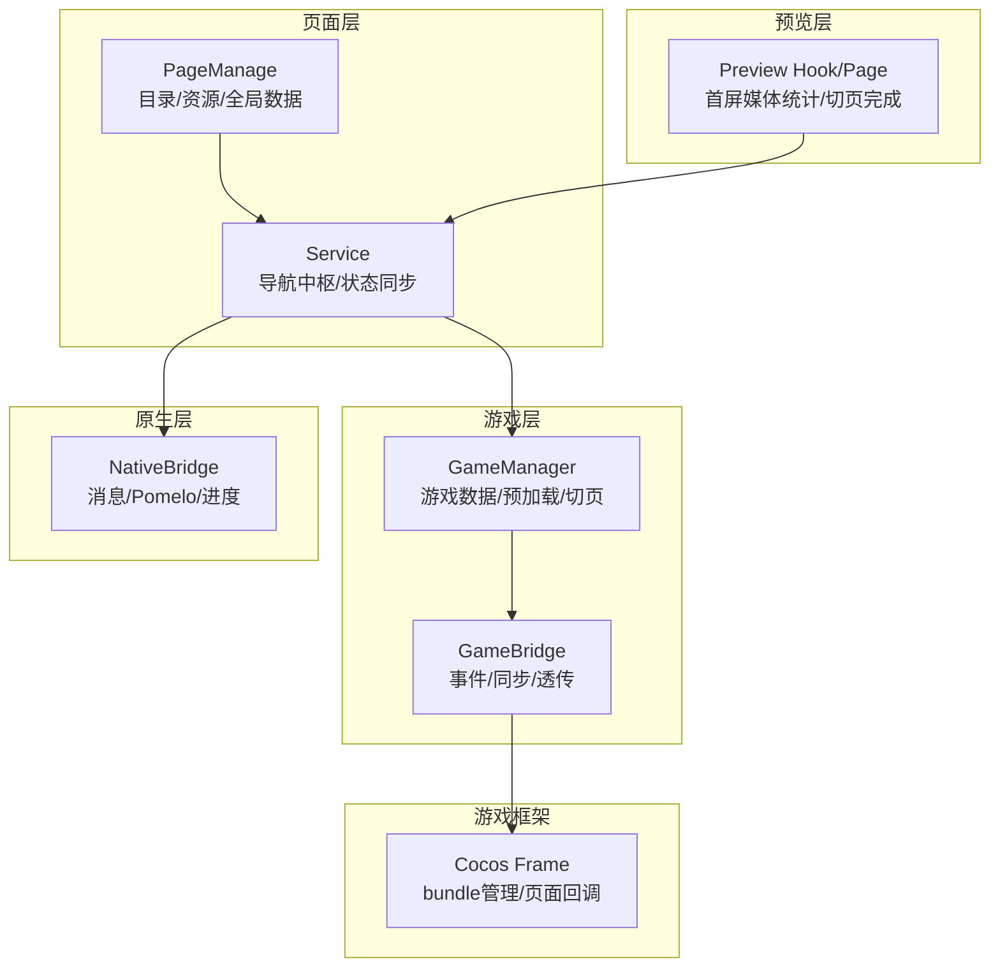
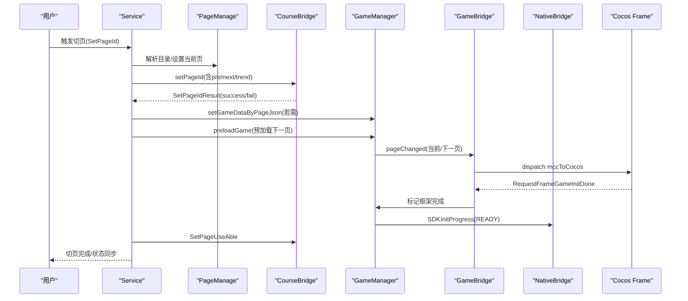
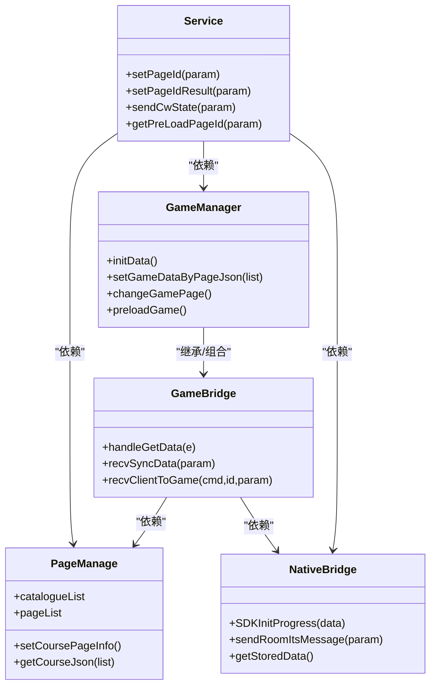

# 游戏页面导航

<cite>
**本文引用的文件**
- [bridge/mcc-player/src/components/page/pageManager.ts](file://bridge/mcc-player/src/components/page/pageManager.ts)
- [bridge/mcc-player/src/components/page/type.ts](file://bridge/mcc-player/src/components/page/type.ts)
- [bridge/mcc-player/src/components/page/const.ts](file://bridge/mcc-player/src/components/page/const.ts)
- [bridge/mcc-player/src/components/service/index.ts](file://bridge/mcc-player/src/components/service/index.ts)
- [bridge/mcc-player/src/components/game-manage/gameManager.ts](file://bridge/mcc-player/src/components/game-manage/gameManager.ts)
- [bridge/mcc-player/src/components/game-manage/gameBridge.ts](file://bridge/mcc-player/src/components/game-manage/gameBridge.ts)
- [bridge/mcc-player/src/components/native-bridge/nativeBridgeManage.ts](file://bridge/mcc-player/src/components/native-bridge/nativeBridgeManage.ts)
- [preview/src/hook/page.ts](file://preview/src/hook/page.ts)
- [preview/src/main.tsx](file://preview/src/main.tsx)
- [bridge/cocos-game-player/assets/frame/index.js](file://bridge/cocos-game-player/assets/frame/index.js)
</cite>

## 目录
1. [简介](#简介)
2. [项目结构](#项目结构)
3. [核心组件](#核心组件)
4. [架构总览](#架构总览)
5. [详细组件分析](#详细组件分析)
6. [依赖分析](#依赖分析)
7. [性能考虑](#性能考虑)
8. [故障排查指南](#故障排查指南)
9. [结论](#结论)
10. [附录](#附录)

## 简介
本技术文档围绕“游戏页面导航”主题，系统梳理并解释课件与游戏之间的页面切换机制、预加载与缓存策略、页面数据结构与状态管理、事件处理与用户体验设计（过渡、加载与错误处理）、配置项与可定制化方法，并提供实际导航流程示例与常见问题解决方案。目标读者既包括前端/移动端工程师，也包括对页面导航机制感兴趣的非技术用户。

## 项目结构
本仓库包含多端与多模块，与“游戏页面导航”直接相关的关键模块如下：
- 页面管理与目录解析：pageManager（目录、资源路径、页面列表、全局数据）
- 导航服务中枢：service（统一注册桥接、切页控制、状态同步）
- 游戏管理：gameManager（游戏数据、预加载、切页通知、URL参数）
- 游戏桥接：gameBridge（游戏生命周期事件、同步数据、端到游戏消息透传）
- 原生桥接：nativeBridge（消息分发、Pomelo通信、进度上报）
- 预览端：preview（页面加载完成判定、首屏媒体统计）
- Cocos 游戏框架：cocos-game-player（bundle 管理、页面切换回调）

图表来源
- [bridge/mcc-player/src/components/page/pageManager.ts:17-120](file://bridge/mcc-player/src/components/page/pageManager.ts#L17-L120)
- [bridge/mcc-player/src/components/service/index.ts:41-149](file://bridge/mcc-player/src/components/service/index.ts#L41-L149)
- [bridge/mcc-player/src/components/game-manage/gameManager.ts:65-124](file://bridge/mcc-player/src/components/game-manage/gameManager.ts#L65-L124)
- [bridge/mcc-player/src/components/game-manage/gameBridge.ts:22-46](file://bridge/mcc-player/src/components/game-manage/gameBridge.ts#L22-L46)
- [bridge/mcc-player/src/components/native-bridge/nativeBridgeManage.ts:26-90](file://bridge/mcc-player/src/components/native-bridge/nativeBridgeManage.ts#L26-L90)
- [preview/src/hook/page.ts:19-61](file://preview/src/hook/page.ts#L19-L61)
- [bridge/cocos-game-player/assets/frame/index.js:2044-2684](file://bridge/cocos-game-player/assets/frame/index.js#L2044-L2684)

章节来源
- [bridge/mcc-player/src/components/page/pageManager.ts:17-120](file://bridge/mcc-player/src/components/page/pageManager.ts#L17-L120)
- [bridge/mcc-player/src/components/service/index.ts:41-149](file://bridge/mcc-player/src/components/service/index.ts#L41-L149)
- [bridge/mcc-player/src/components/game-manage/gameManager.ts:65-124](file://bridge/mcc-player/src/components/game-manage/gameManager.ts#L65-L124)
- [bridge/mcc-player/src/components/game-manage/gameBridge.ts:22-46](file://bridge/mcc-player/src/components/game-manage/gameBridge.ts#L22-L46)
- [bridge/mcc-player/src/components/native-bridge/nativeBridgeManage.ts:26-90](file://bridge/mcc-player/src/components/native-bridge/nativeBridgeManage.ts#L26-L90)
- [preview/src/hook/page.ts:19-61](file://preview/src/hook/page.ts#L19-L61)
- [bridge/cocos-game-player/assets/frame/index.js:2044-2684](file://bridge/cocos-game-player/assets/frame/index.js#L2044-L2684)

## 核心组件
- 页面管理器 PageManage
  - 负责目录与资源路径解析、页面 JSON 拉取与全局数据注入、当前页与上下页 ID 计算、切页完成状态标记。
- 导航服务 Service
  - 统一注册原生/课件/游戏事件，协调切页流程、状态恢复、预渲染、进度上报与埋点。
- 游戏管理器 GameManager
  - 构建游戏数据结构（模板/子包/公共模块/创建类型/同步开关），实现切页与预加载，下发页面变更事件至游戏。
- 游戏桥接 GameBridge
  - 处理游戏生命周期事件（主包/框架完成）、同步数据广播、端到游戏消息透传、互动状态与观看模式。
- 原生桥接 NativeBridge
  - 跨端消息分发、Pomelo 通信、SDK 进度上报、页面信息下发。
- 预览 Hook/Page
  - 首屏媒体加载完成判定、切页完成回传、页面列表预取与缓存。

章节来源
- [bridge/mcc-player/src/components/page/pageManager.ts:17-120](file://bridge/mcc-player/src/components/page/pageManager.ts#L17-L120)
- [bridge/mcc-player/src/components/service/index.ts:41-149](file://bridge/mcc-player/src/components/service/index.ts#L41-L149)
- [bridge/mcc-player/src/components/game-manage/gameManager.ts:65-124](file://bridge/mcc-player/src/components/game-manage/gameManager.ts#L65-L124)
- [bridge/mcc-player/src/components/game-manage/gameBridge.ts:22-46](file://bridge/mcc-player/src/components/game-manage/gameBridge.ts#L22-L46)
- [bridge/mcc-player/src/components/native-bridge/nativeBridgeManage.ts:26-90](file://bridge/mcc-player/src/components/native-bridge/nativeBridgeManage.ts#L26-L90)
- [preview/src/hook/page.ts:19-61](file://preview/src/hook/page.ts#L19-L61)

## 架构总览
页面导航的整体流程由“服务中枢”驱动，贯穿“页面层-导航层-游戏层-原生层”，并结合“预览层”的首屏判定与“游戏框架”的 bundle 生命周期。

图表来源
- [bridge/mcc-player/src/components/service/index.ts:612-676](file://bridge/mcc-player/src/components/service/index.ts#L612-L676)
- [bridge/mcc-player/src/components/game-manage/gameManager.ts:200-277](file://bridge/mcc-player/src/components/game-manage/gameManager.ts#L200-L277)
- [bridge/mcc-player/src/components/game-manage/gameBridge.ts:59-110](file://bridge/mcc-player/src/components/game-manage/gameBridge.ts#L59-L110)
- [bridge/mcc-player/src/components/native-bridge/nativeBridgeManage.ts:375-388](file://bridge/mcc-player/src/components/native-bridge/nativeBridgeManage.ts#L375-L388)
- [bridge/cocos-game-player/assets/frame/index.js:2652-2684](file://bridge/cocos-game-player/assets/frame/index.js#L2652-L2684)

## 详细组件分析

### 页面数据结构与页面ID映射
- 目录与页面列表
  - PageManage 维护 catalogueList（目录）与 pageList（已拉取页面 JSON），通过微前端全局数据注入，支持跨应用共享。
  - 提供 currentPageId、prePageId、nextPageId 计算，用于切页与预渲染。
- 页面类型与信息
  - PageType 定义 NORMAL_PAGE、GAME_PAGE、VIDEO_PAGE。
  - PageInfo 描述页面标识、类型、资源列表、时间戳等。
- 路径与资源
  - 支持本地/远程路径解析，CDN 备选域名轮询，自动降级。
  - 通过 replacePlaceholders 注入 slideId/version 等占位符。

章节来源
- [bridge/mcc-player/src/components/page/pageManager.ts:35-120](file://bridge/mcc-player/src/components/page/pageManager.ts#L35-L120)
- [bridge/mcc-player/src/components/page/type.ts:29-52](file://bridge/mcc-player/src/components/page/type.ts#L29-L52)
- [bridge/mcc-player/src/components/page/const.ts:1-26](file://bridge/mcc-player/src/components/page/const.ts#L1-L26)

### 页面切换、预加载与缓存策略
- 切页流程
  - Service.setPageId：计算前后页 ID，按需拉取页面 JSON，注入全局数据，调用课件 setPageId 并等待 SetPageIdResult。
  - PageManage.setCoursePageInfo：批量拉取页面 JSON，支持本地优先与 CDN 备降。
- 预加载
  - Service.getPreLoadPageId：根据切页方向选择下一页 ID，GameManager.preloadGame 向游戏下发 pagePreload 事件，提前加载下一页游戏资源。
- 缓存
  - 微前端全局数据缓存已拉取页面 JSON；PageManage.pageList 与 catalogueList 长期驻留，避免重复请求。
  - 游戏侧通过 BundleManager 缓存已加载的 bundle，避免重复下载。

章节来源
- [bridge/mcc-player/src/components/service/index.ts:612-726](file://bridge/mcc-player/src/components/service/index.ts#L612-L726)
- [bridge/mcc-player/src/components/page/pageManager.ts:377-465](file://bridge/mcc-player/src/components/page/pageManager.ts#L377-L465)
- [bridge/mcc-player/src/components/game-manage/gameManager.ts:264-277](file://bridge/mcc-player/src/components/game-manage/gameManager.ts#L264-L277)
- [bridge/cocos-game-player/assets/frame/index.js:2044-2684](file://bridge/cocos-game-player/assets/frame/index.js#L2044-L2684)

### 页面状态管理与事件处理
- 切页完成与状态恢复
  - Service.setPageIdResult：记录成功页 ID，恢复课件状态（msgQueue、uuid），必要时向端上报页面信息。
  - Service.recoverCWStateResult：首次加载完成时上报进度 READY，触发 STATE_CHANGE。
- 游戏状态同步
  - GameBridge.onGameSyncData：解析心跳与操作动作，区分教师端/互动学生端行为，广播同步数据。
  - Service.sendCwState：接收服务端心跳，按需触发切页与状态恢复。
- 事件总线
  - Service 与 GameBridge 基于 EventEmitter，统一派发 SET_CURRENT_PAGE、STATE_CHANGE、HIDE_GAME 等事件。

章节来源
- [bridge/mcc-player/src/components/service/index.ts:178-373](file://bridge/mcc-player/src/components/service/index.ts#L178-L373)
- [bridge/mcc-player/src/components/game-manage/gameBridge.ts:116-189](file://bridge/mcc-player/src/components/game-manage/gameBridge.ts#L116-L189)

### 用户体验设计：过渡、加载与错误处理
- 过渡与加载
  - NativeBridge.SDKInitProgress 分阶段上报进度（加载中/完成），驱动端侧 loading 显示与隐藏。
  - Preview Hook/Page 通过 MutationObserver 监听首屏媒体加载，统计图片/视频数量，统一完成后回传 SetPageIdResult。
- 错误处理
  - PageManage.getRemoteJson：多 CDN 轮询失败时自动降级；requestJson：本地/远程均不可用时返回空对象并记录日志。
  - Service.setPageIdResult：切页失败时记录埋点，避免重复上报。

章节来源
- [bridge/mcc-player/src/components/native-bridge/nativeBridgeManage.ts:375-388](file://bridge/mcc-player/src/components/native-bridge/nativeBridgeManage.ts#L375-L388)
- [preview/src/main.tsx:47-111](file://preview/src/main.tsx#L47-L111)
- [bridge/mcc-player/src/components/page/pageManager.ts:349-371](file://bridge/mcc-player/src/components/page/pageManager.ts#L349-L371)
- [bridge/mcc-player/src/components/service/index.ts:296-309](file://bridge/mcc-player/src/components/service/index.ts#L296-L309)

### 页面导航的配置选项与自定义方法
- 切页方向与预渲染
  - Service.setPageChangeType：根据当前页与目标页索引确定上/下翻页，决定预渲染页 ID。
  - Service.getPreLoadPageId：依据方向返回下一页 ID。
- 游戏 URL 参数
  - GameManager.getGameUrlParams：输出框架/公共模块/子包地址、本地/CDN 根路径、初始化参数。
- 事件与回调
  - GameBridge.handleGetData：集中处理游戏生命周期事件（主包/框架完成、切页、互动、埋点）。
  - Service.registerNativeHandler：注册原生/课件/游戏消息监听，统一调度。

章节来源
- [bridge/mcc-player/src/components/service/index.ts:683-726](file://bridge/mcc-player/src/components/service/index.ts#L683-L726)
- [bridge/mcc-player/src/components/game-manage/gameManager.ts:337-347](file://bridge/mcc-player/src/components/game-manage/gameManager.ts#L337-L347)
- [bridge/mcc-player/src/components/game-manage/gameBridge.ts:59-110](file://bridge/mcc-player/src/components/game-manage/gameBridge.ts#L59-L110)
- [bridge/mcc-player/src/components/service/index.ts:85-149](file://bridge/mcc-player/src/components/service/index.ts#L85-L149)

### 实际导航示例
- 示例一：从第 2 页切换到第 4 页
  - 计算方向：index(2)->index(4)，方向=下翻页。
  - 预渲染：getPreLoadPageId 返回第 5 页 ID，GameManager.preloadGame 下发 pagePreload。
  - 切页：Service.setPageId 设置当前页为第 4 页，注入全局数据，等待 SetPageIdResult。
  - 游戏：GameManager.changeGamePage 下发 pageChanged，通知游戏当前页与下一页。
- 示例二：首屏加载完成
  - Preview Hook/Page 统计图片/视频，全部加载完成后回传 SetPageIdResult。
  - Service.setPageIdResult 触发课程恢复与进度上报。

章节来源
- [bridge/mcc-player/src/components/service/index.ts:683-726](file://bridge/mcc-player/src/components/service/index.ts#L683-L726)
- [bridge/mcc-player/src/components/game-manage/gameManager.ts:200-277](file://bridge/mcc-player/src/components/game-manage/gameManager.ts#L200-L277)
- [preview/src/main.tsx:47-111](file://preview/src/main.tsx#L47-L111)

## 依赖分析
- 组件耦合
  - Service 作为中枢，依赖 PageManage、GameManager、NativeBridge、CourseBridge。
  - GameManager 依赖 GameBridge、PageManage、NativeBridge。
  - GameBridge 依赖 PageManage、NativeBridge、微前端消息通道。
- 外部依赖
  - 微前端微应用 microApp（全局数据、reload、forceSetGlobalData）。
  - Axios（HTTP 请求）、Pomelo（消息广播）、浏览器 postMessage/Webkit 消息通道。

图表来源
- [bridge/mcc-player/src/components/service/index.ts:41-149](file://bridge/mcc-player/src/components/service/index.ts#L41-L149)
- [bridge/mcc-player/src/components/page/pageManager.ts:17-120](file://bridge/mcc-player/src/components/page/pageManager.ts#L17-L120)
- [bridge/mcc-player/src/components/game-manage/gameManager.ts:65-124](file://bridge/mcc-player/src/components/game-manage/gameManager.ts#L65-L124)
- [bridge/mcc-player/src/components/game-manage/gameBridge.ts:22-46](file://bridge/mcc-player/src/components/game-manage/gameBridge.ts#L22-L46)
- [bridge/mcc-player/src/components/native-bridge/nativeBridgeManage.ts:26-90](file://bridge/mcc-player/src/components/native-bridge/nativeBridgeManage.ts#L26-L90)

章节来源
- [bridge/mcc-player/src/components/service/index.ts:41-149](file://bridge/mcc-player/src/components/service/index.ts#L41-L149)
- [bridge/mcc-player/src/components/page/pageManager.ts:17-120](file://bridge/mcc-player/src/components/page/pageManager.ts#L17-L120)
- [bridge/mcc-player/src/components/game-manage/gameManager.ts:65-124](file://bridge/mcc-player/src/components/game-manage/gameManager.ts#L65-L124)
- [bridge/mcc-player/src/components/game-manage/gameBridge.ts:22-46](file://bridge/mcc-player/src/components/game-manage/gameBridge.ts#L22-L46)
- [bridge/mcc-player/src/components/native-bridge/nativeBridgeManage.ts:26-90](file://bridge/mcc-player/src/components/native-bridge/nativeBridgeManage.ts#L26-L90)

## 性能考虑
- 资源加载
  - 本地优先、CDN 备降，减少首屏等待；Bundle 缓存避免重复下载。
- 切页优化
  - 预加载下一页游戏资源，降低切换卡顿；仅在目录与页面 JSON 数量一致时走快速切页路径。
- 状态同步
  - 心跳数据仅在教师端或互动场景广播，减少无效流量；本地存储互动心跳，提升响应速度。
- 首屏判定
  - 媒体元素统一计数与回调，避免过早/过晚上报导致的加载抖动。

[本节为通用指导，无需列出具体文件来源]

## 故障排查指南
- 切页失败
  - 检查 Service.setPageIdResult 是否返回失败，确认目录与页面 JSON 是否完整拉取。
  - 查看 PageManage.getRemoteJson 与 requestJson 的降级日志。
- 预加载无效
  - 确认 Service.getPreLoadPageId 返回的 ID 正确，GameManager.preloadGame 是否被调用。
- 游戏未响应
  - 检查 GameBridge.handleGetData 是否收到 RequestFrameGameInitDone，确认 GameManager.changeGamePage 是否下发 pageChanged。
- 进度不更新
  - 确认 NativeBridge.SDKInitProgress 是否被调用，且未被 READY 状态阻断。

章节来源
- [bridge/mcc-player/src/components/service/index.ts:296-309](file://bridge/mcc-player/src/components/service/index.ts#L296-L309)
- [bridge/mcc-player/src/components/page/pageManager.ts:349-371](file://bridge/mcc-player/src/components/page/pageManager.ts#L349-L371)
- [bridge/mcc-player/src/components/game-manage/gameManager.ts:200-277](file://bridge/mcc-player/src/components/game-manage/gameManager.ts#L200-L277)
- [bridge/mcc-player/src/components/native-bridge/nativeBridgeManage.ts:375-388](file://bridge/mcc-player/src/components/native-bridge/nativeBridgeManage.ts#L375-L388)

## 结论
本导航体系以 Service 为核心，串联页面管理、游戏管理与原生桥接，结合预加载与缓存策略，在保证用户体验的同时兼顾性能与稳定性。通过清晰的事件模型与状态同步机制，实现了课件与游戏在多端环境下的高效协同。

[本节为总结性内容，无需列出具体文件来源]

## 附录
- 常见问题速查
  - 问：为什么切页后游戏不加载？
    - 答：检查 RequestFrameGameInitDone 是否触发，确认 GameManager.changeGamePage 是否下发 pageChanged。
  - 问：预加载无效如何排查？
    - 答：确认 getPreLoadPageId 返回值与方向一致，preloadGame 是否被调用。
  - 问：首屏加载一直不完成？
    - 答：检查媒体元素计数与回调，确保 SetPageIdResult 在全部媒体加载后触发。

[本节为补充说明，无需列出具体文件来源]