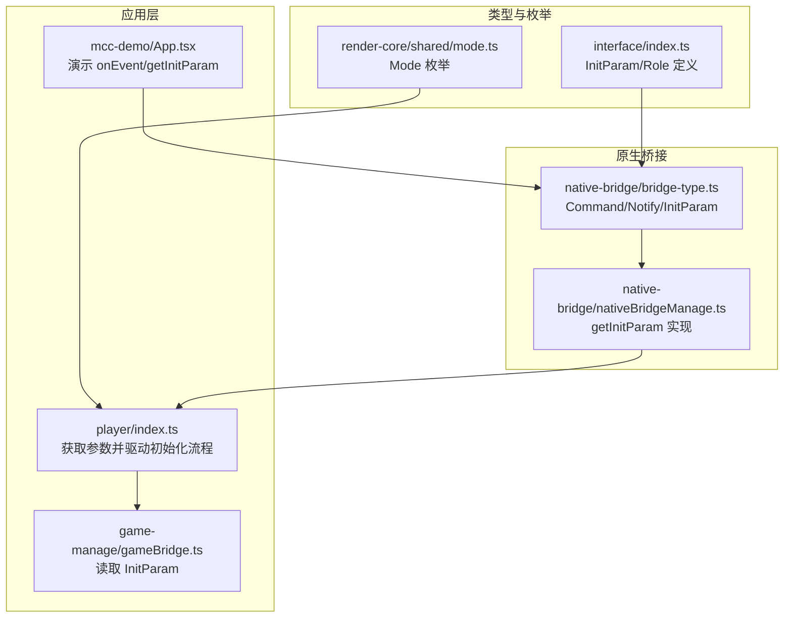
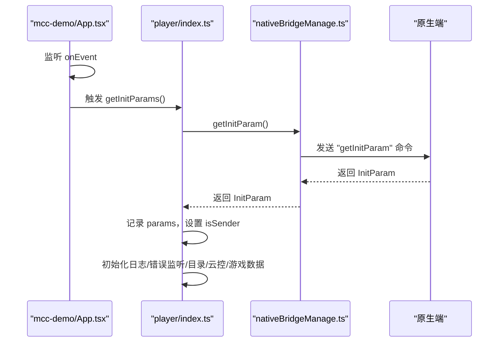
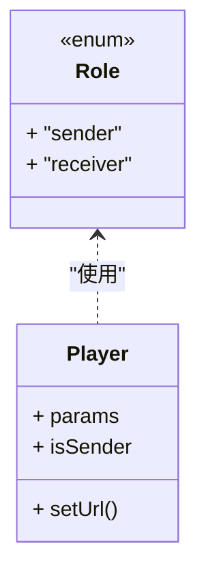
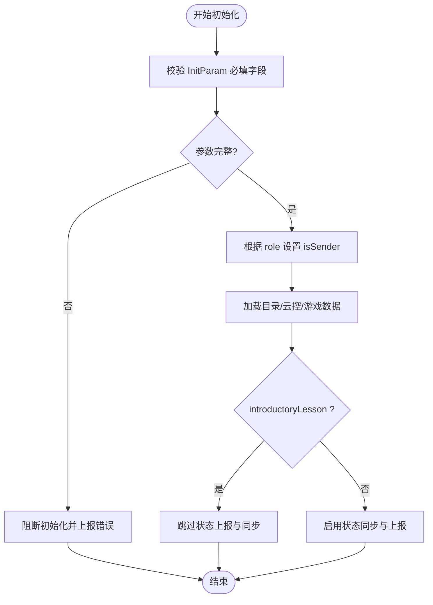
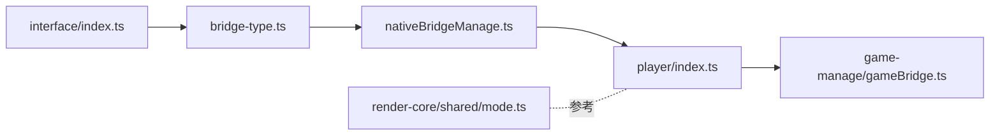

# 初始化参数接口

<cite>
**本文引用的文件**
- [bridge/mcc-player/src/interface/index.ts](file://bridge/mcc-player/src/interface/index.ts)
- [bridge/mcc-player/src/components/native-bridge/bridge-type.ts](file://bridge/mcc-player/src/components/native-bridge/bridge-type.ts)
- [bridge/mcc-player/src/components/native-bridge/nativeBridgeManage.ts](file://bridge/mcc-player/src/components/native-bridge/nativeBridgeManage.ts)
- [bridge/mcc-player/src/components/player/index.ts](file://bridge/mcc-player/src/components/player/index.ts)
- [bridge/mcc-player/src/components/game-manage/gameBridge.ts](file://bridge/mcc-player/src/components/game-manage/gameBridge.ts)
- [bridge/mcc-demo/src/App.tsx](file://bridge/mcc-demo/src/App.tsx)
- [common/render-core/shared/mode.ts](file://common/render-core/shared/mode.ts)
- [bridge/mcc-player/src/constants/index.ts](file://bridge/mcc-player/src/constants/index.ts)
</cite>

## 目录
1. [引言](#引言)
2. [项目结构](#项目结构)
3. [核心组件](#核心组件)
4. [架构总览](#架构总览)
5. [详细组件分析](#详细组件分析)
6. [依赖分析](#依赖分析)
7. [性能考虑](#性能考虑)
8. [故障排查指南](#故障排查指南)
9. [结论](#结论)
10. [附录](#附录)

## 引言
本文件聚焦“初始化参数接口”模块，系统性阐述 InitParam 接口的字段语义、取值范围、角色枚举 Role 的使用场景、客户端类型 client 的分类与平台适配策略，并说明这些参数如何影响课件渲染与功能实现。同时提供参数配置示例、验证规则以及参数缺失或异常时的处理建议。

## 项目结构
初始化参数接口主要分布在以下位置：
- 类型定义与角色枚举：bridge/mcc-player/src/interface/index.ts
- 原生桥接命令与 InitParam 结构：bridge/mcc-player/src/components/native-bridge/bridge-type.ts
- 参数获取流程与使用：bridge/mcc-player/src/components/native-bridge/nativeBridgeManage.ts、bridge/mcc-player/src/components/player/index.ts、bridge/mcc-player/src/components/game-manage/gameBridge.ts
- 示例与交互：bridge/mcc-demo/src/App.tsx
- 角色模式常量：common/render-core/shared/mode.ts
- 超时常量：bridge/mcc-player/src/constants/index.ts

**图表来源**
- [bridge/mcc-player/src/interface/index.ts:17-36](file://bridge/mcc-player/src/interface/index.ts#L17-L36)
- [bridge/mcc-player/src/components/native-bridge/bridge-type.ts:56-73](file://bridge/mcc-player/src/components/native-bridge/bridge-type.ts#L56-L73)
- [bridge/mcc-player/src/components/native-bridge/nativeBridgeManage.ts:211-214](file://bridge/mcc-player/src/components/native-bridge/nativeBridgeManage.ts#L211-L214)
- [bridge/mcc-player/src/components/player/index.ts:61-91](file://bridge/mcc-player/src/components/player/index.ts#L61-L91)
- [bridge/mcc-player/src/components/game-manage/gameBridge.ts:373-375](file://bridge/mcc-player/src/components/game-manage/gameBridge.ts#L373-L375)
- [bridge/mcc-demo/src/App.tsx:72-79](file://bridge/mcc-demo/src/App.tsx#L72-L79)

**章节来源**
- [bridge/mcc-player/src/interface/index.ts:7-36](file://bridge/mcc-player/src/interface/index.ts#L7-L36)
- [bridge/mcc-player/src/components/native-bridge/bridge-type.ts:1-73](file://bridge/mcc-player/src/components/native-bridge/bridge-type.ts#L1-L73)
- [bridge/mcc-player/src/components/native-bridge/nativeBridgeManage.ts:211-214](file://bridge/mcc-player/src/components/native-bridge/nativeBridgeManage.ts#L211-L214)
- [bridge/mcc-player/src/components/player/index.ts:61-91](file://bridge/mcc-player/src/components/player/index.ts#L61-L91)
- [bridge/mcc-demo/src/App.tsx:72-79](file://bridge/mcc-demo/src/App.tsx#L72-L79)

## 核心组件
- InitParam 接口：定义课件运行所需的关键参数，包括尺寸、角色、直播标识、用户信息、客户端描述、环境与课堂形态等。
- Role 枚举：sender/receiver，决定是否进行状态同步与数据上报。
- 原生桥接命令：通过 getInitParam 获取 InitParam，并在后续流程中使用。
- 应用层使用：在初始化阶段拉取参数，依据角色与参数控制渲染与功能。

**章节来源**
- [bridge/mcc-player/src/interface/index.ts:17-36](file://bridge/mcc-player/src/interface/index.ts#L17-L36)
- [bridge/mcc-player/src/components/native-bridge/bridge-type.ts:56-73](file://bridge/mcc-player/src/components/native-bridge/bridge-type.ts#L56-L73)
- [bridge/mcc-player/src/components/native-bridge/nativeBridgeManage.ts:211-214](file://bridge/mcc-player/src/components/native-bridge/nativeBridgeManage.ts#L211-L214)
- [bridge/mcc-player/src/components/player/index.ts:110-121](file://bridge/mcc-player/src/components/player/index.ts#L110-L121)

## 架构总览
初始化参数的获取与使用遵循如下流程：前端通过原生桥接命令请求 InitParam，原生端返回参数后，应用层将其用于初始化课件、目录、云控配置与游戏管理，并据此决定是否开启状态同步与上报。

**图表来源**
- [bridge/mcc-demo/src/App.tsx:72-79](file://bridge/mcc-demo/src/App.tsx#L72-L79)
- [bridge/mcc-player/src/components/player/index.ts:61-91](file://bridge/mcc-player/src/components/player/index.ts#L61-L91)
- [bridge/mcc-player/src/components/native-bridge/nativeBridgeManage.ts:211-214](file://bridge/mcc-player/src/components/native-bridge/nativeBridgeManage.ts#L211-L214)

## 详细组件分析

### InitParam 字段详解与取值范围
- courseWareWidth（课件展示区域宽度）
  - 作用：决定课件渲染画布的宽度，影响布局与缩放策略。
  - 取值范围：正数；通常由宿主端根据设备与容器计算并传递。
- courseWareHeight（课件展示区域高度）
  - 作用：决定课件渲染画布的高度，影响布局与缩放策略。
  - 取值范围：正数；通常由宿主端根据设备与容器计算并传递。
- role（角色）
  - 作用：区分 sender/receiver，决定是否进行状态同步与上报。
  - 取值范围：'sender' | 'receiver'。
- liveId（直播讲 ID）
  - 作用：标识当前课堂会话，便于日志追踪与数据关联。
  - 取值范围：字符串；非空。
- userId（用户 ID）
  - 作用：唯一标识当前用户，用于日志与权限关联。
  - 取值范围：字符串；非空。
- userName（用户名）
  - 作用：便于问题定位与日志可读性。
  - 取值范围：字符串；建议非空。
- client（客户端类型）
  - 作用：区分授课端与学生端平台，用于差异化适配。
  - 取值范围：字符串；常见值如 'tpc'（授课端）、'Mac'、'Windows'（PC）、'iPad'、'iPhone'（iOS）、'pad'、'aphone'（Android）。
- clientDescription（客户端描述）
  - 作用：附加版本信息或其他描述，JSON 字符串形式。
  - 取值范围：字符串；建议为合法 JSON。
- gradeId（年级）
  - 作用：用于日志分桶与统计。
  - 取值范围：字符串。
- belongCityId（分校）
  - 作用：用于日志分桶与统计。
  - 取值范围：字符串。
- localRootPath（本地根目录）
  - 作用：本地资源根路径，用于离线包或本地资源访问。
  - 取值范围：字符串；建议为有效路径。
- gameFps（游戏帧率）
  - 作用：用于游戏侧 FPS 设置与性能控制。
  - 取值范围：字符串；建议为数字字符串或受控枚举。
- introductoryLesson（是否先导课）
  - 作用：控制是否进入先导课特殊流程（如不进行状态上报）。
  - 取值范围：布尔值。
- startPageId（起始页码 ID）
  - 作用：恢复时优先选择该页；若不存在则按服务器存储恢复。
  - 取值范围：字符串；可选。
- env（环境变量）
  - 作用：区分测试/生产环境，影响日志与上报策略。
  - 取值范围：'test' | 'prod'。
- class_mode（课堂形态）
  - 作用：课堂形态标识，用于差异化逻辑。
  - 取值范围：字符串。
- guid（设备 ID）
  - 作用：设备级唯一标识，用于日志与追踪。
  - 取值范围：字符串；建议非空。

参数对课件渲染与功能的影响：
- 尺寸参数影响课件画布与缩放策略，确保在不同设备上正确显示。
- 角色参数决定是否进行状态同步与上报，sender 侧会周期性上报，receiver 侧仅接收。
- 客户端类型决定平台适配策略（如 iOS/Android/PC/授课端），影响交互与资源加载。
- 先导课标记影响状态上报与切页后的处理逻辑。

**章节来源**
- [bridge/mcc-player/src/interface/index.ts:17-36](file://bridge/mcc-player/src/interface/index.ts#L17-L36)
- [bridge/mcc-player/src/components/native-bridge/bridge-type.ts:56-73](file://bridge/mcc-player/src/components/native-bridge/bridge-type.ts#L56-L73)

### 角色枚举 Role 的定义与使用场景
- 枚举定义：sender（发送端）、receiver（接收端）。
- 使用场景：
  - sender：负责状态同步与上报，周期性将课件状态与消息队列发送至服务端与客户端。
  - receiver：仅接收状态，不主动上报；在某些流程中可能不参与状态同步。
- 在应用层的体现：
  - 通过 params.role 判断是否为 sender，从而决定是否启动状态定时上报与同步流程。

**图表来源**
- [bridge/mcc-player/src/interface/index.ts:7-10](file://bridge/mcc-player/src/interface/index.ts#L7-L10)
- [bridge/mcc-player/src/components/player/index.ts:110-111](file://bridge/mcc-player/src/components/player/index.ts#L110-L111)

**章节来源**
- [bridge/mcc-player/src/interface/index.ts:7-10](file://bridge/mcc-player/src/interface/index.ts#L7-L10)
- [bridge/mcc-player/src/components/player/index.ts:110-111](file://bridge/mcc-player/src/components/player/index.ts#L110-L111)

### 客户端类型 client 的分类与平台适配策略
- 分类：
  - 授课端：'tpc'
  - PC 端：'Mac'、'Windows'
  - iOS 端：'iPad'、'iPhone'
  - Android 端：'pad'、'aphone'
- 适配策略：
  - 根据 client 决定资源加载策略、交互行为与性能参数（如 gameFps）。
  - 在应用层根据 client 与 role 组合决定是否启用某些功能或上报策略。

**章节来源**
- [bridge/mcc-player/src/interface/index.ts:25](file://bridge/mcc-player/src/interface/index.ts#L25)
- [bridge/mcc-player/src/components/native-bridge/bridge-type.ts:63](file://bridge/mcc-player/src/components/native-bridge/bridge-type.ts#L63)

### 初始化参数的配置示例与验证规则
- 配置示例（示意，字段与取值请以实际业务为准）：
  - courseWareWidth：1280
  - courseWareHeight：720
  - role：'sender'
  - liveId：'live_abc123'
  - userId：'user_xyz789'
  - userName：'张三'
  - client：'iPad'
  - clientDescription：'{"version":"1.2.3","build":"20240101"}'
  - gradeId：'3'
  - belongCityId：'city_shanghai'
  - localRootPath：'/storage/local'
  - gameFps：'30'
  - introductoryLesson：false
  - env：'prod'
  - class_mode：'small'
  - guid：'device_001'
- 验证规则（建议）：
  - 必填项：courseWareWidth、courseWareHeight、role、liveId、userId、userName、client、env、class_mode、guid。
  - 取值范围：数值型字段必须为正数；枚举字段必须在允许集合内；JSON 字符串需可解析。
  - 平台一致性：client 与 clientDescription 的版本信息应匹配。
  - 特殊逻辑：introductoryLesson 为 true 时，不应进行状态上报；sender 与 receiver 的行为差异需满足业务预期。

**章节来源**
- [bridge/mcc-player/src/interface/index.ts:17-36](file://bridge/mcc-player/src/interface/index.ts#L17-L36)
- [bridge/mcc-player/src/components/native-bridge/bridge-type.ts:56-73](file://bridge/mcc-player/src/components/native-bridge/bridge-type.ts#L56-L73)

### 参数缺失或异常时的处理方案
- 参数缺失：
  - 在应用层初始化前进行校验，若缺少必填字段，阻断初始化并上报错误。
  - 对可选字段（如 startPageId）提供默认值或回退策略。
- 异常处理：
  - 使用全局错误监听捕获异常，记录错误上下文并上报。
  - 对网络请求设置超时时间，避免长时间阻塞初始化流程。
  - 对于先导课场景，若检测到 introductoryLesson 为 true，则跳过状态上报与同步流程。

**图表来源**
- [bridge/mcc-player/src/components/player/index.ts:61-91](file://bridge/mcc-player/src/components/player/index.ts#L61-L91)
- [bridge/mcc-player/src/components/player/index.ts:110-121](file://bridge/mcc-player/src/components/player/index.ts#L110-L121)
- [bridge/mcc-player/src/constants/index.ts:4](file://bridge/mcc-player/src/constants/index.ts#L4)

**章节来源**
- [bridge/mcc-player/src/components/player/index.ts:239-283](file://bridge/mcc-player/src/components/player/index.ts#L239-L283)
- [bridge/mcc-player/src/constants/index.ts:4](file://bridge/mcc-player/src/constants/index.ts#L4)

## 依赖分析
- 类型依赖：InitParam 与 Role 在多个模块中被引用，确保一致性。
- 桥接依赖：nativeBridgeManage 提供 getInitParam 的具体实现，player 与 gameBridge 通过该方法获取参数。
- 角色依赖：Mode 枚举与 Role 枚举在不同模块中存在，需保持语义一致。

**图表来源**
- [bridge/mcc-player/src/interface/index.ts:7-10](file://bridge/mcc-player/src/interface/index.ts#L7-L10)
- [bridge/mcc-player/src/components/native-bridge/bridge-type.ts:1-22](file://bridge/mcc-player/src/components/native-bridge/bridge-type.ts#L1-L22)
- [bridge/mcc-player/src/components/native-bridge/nativeBridgeManage.ts:211-214](file://bridge/mcc-player/src/components/native-bridge/nativeBridgeManage.ts#L211-L214)
- [bridge/mcc-player/src/components/player/index.ts:61-91](file://bridge/mcc-player/src/components/player/index.ts#L61-L91)
- [bridge/mcc-player/src/components/game-manage/gameBridge.ts:373-375](file://bridge/mcc-player/src/components/game-manage/gameBridge.ts#L373-L375)
- [common/render-core/shared/mode.ts:1-4](file://common/render-core/shared/mode.ts#L1-L4)

**章节来源**
- [bridge/mcc-player/src/interface/index.ts:7-10](file://bridge/mcc-player/src/interface/index.ts#L7-L10)
- [bridge/mcc-player/src/components/native-bridge/bridge-type.ts:1-22](file://bridge/mcc-player/src/components/native-bridge/bridge-type.ts#L1-L22)
- [bridge/mcc-player/src/components/native-bridge/nativeBridgeManage.ts:211-214](file://bridge/mcc-player/src/components/native-bridge/nativeBridgeManage.ts#L211-L214)
- [bridge/mcc-player/src/components/player/index.ts:61-91](file://bridge/mcc-player/src/components/player/index.ts#L61-L91)
- [bridge/mcc-player/src/components/game-manage/gameBridge.ts:373-375](file://bridge/mcc-player/src/components/game-manage/gameBridge.ts#L373-L375)
- [common/render-core/shared/mode.ts:1-4](file://common/render-core/shared/mode.ts#L1-L4)

## 性能考虑
- 参数获取超时：为网络请求设置合理超时时间，避免阻塞初始化。
- 状态同步频率：sender 侧的同步频率与上报策略应结合业务场景调整，避免频繁上报造成性能压力。
- 资源加载策略：根据 client 与尺寸参数动态选择资源与分辨率，减少不必要的带宽与内存消耗。

**章节来源**
- [bridge/mcc-player/src/constants/index.ts:4](file://bridge/mcc-player/src/constants/index.ts#L4)
- [bridge/mcc-player/src/components/player/index.ts:134-140](file://bridge/mcc-player/src/components/player/index.ts#L134-L140)

## 故障排查指南
- 参数缺失或格式错误：
  - 现象：初始化失败或功能异常。
  - 处理：在初始化前进行参数校验，缺失或非法字段需阻断并上报。
- 角色配置错误：
  - 现象：sender/receiver 行为不符合预期。
  - 处理：检查 role 字段与业务逻辑映射，确保 isSender 判定正确。
- 客户端类型不匹配：
  - 现象：平台适配异常或资源加载失败。
  - 处理：核对 client 与 clientDescription 的一致性，确保平台策略正确。
- 先导课流程异常：
  - 现象：状态上报未触发或定时器未清理。
  - 处理：确认 introductoryLesson 标记与相关流程分支逻辑。
- 全局异常捕获：
  - 使用全局错误监听记录错误上下文，便于定位问题。

**章节来源**
- [bridge/mcc-player/src/components/player/index.ts:239-283](file://bridge/mcc-player/src/components/player/index.ts#L239-L283)
- [bridge/mcc-demo/src/App.tsx:72-79](file://bridge/mcc-demo/src/App.tsx#L72-L79)

## 结论
InitParam 接口是课件初始化与运行的核心入口，其字段覆盖了尺寸、角色、直播会话、用户信息、客户端描述、环境与课堂形态等关键维度。通过严格的参数校验、合理的平台适配策略与完善的异常处理机制，可确保课件在不同设备与场景下的稳定运行与正确渲染。sender/receiver 的角色划分与先导课标记进一步细化了业务流程，提升系统的可控性与可维护性。

## 附录
- 关键流程参考路径：
  - 获取参数：[bridge/mcc-player/src/components/native-bridge/nativeBridgeManage.ts:211-214](file://bridge/mcc-player/src/components/native-bridge/nativeBridgeManage.ts#L211-L214)
  - 初始化流程：[bridge/mcc-player/src/components/player/index.ts:61-91](file://bridge/mcc-player/src/components/player/index.ts#L61-L91)
  - 读取参数：[bridge/mcc-player/src/components/game-manage/gameBridge.ts:373-375](file://bridge/mcc-player/src/components/game-manage/gameBridge.ts#L373-L375)
  - 示例交互：[bridge/mcc-demo/src/App.tsx:72-79](file://bridge/mcc-demo/src/App.tsx#L72-L79)