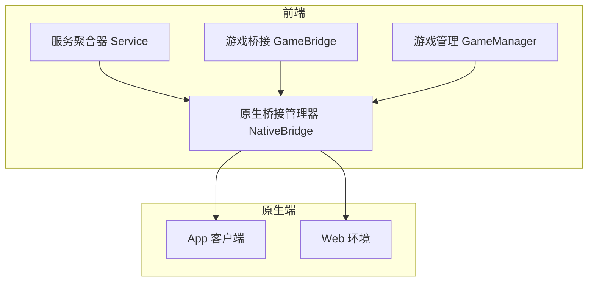
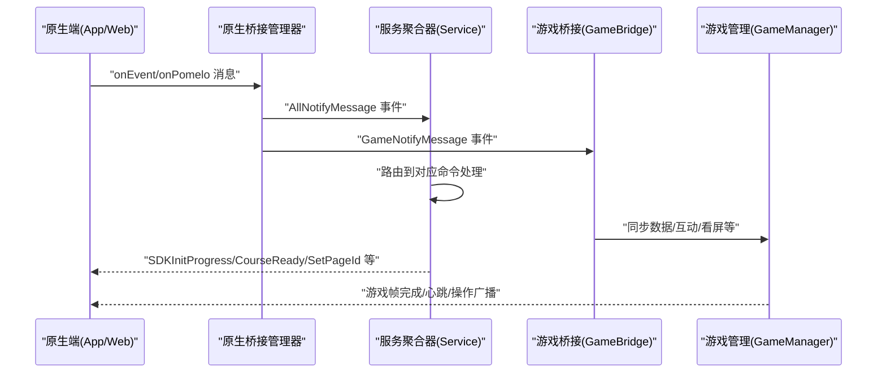
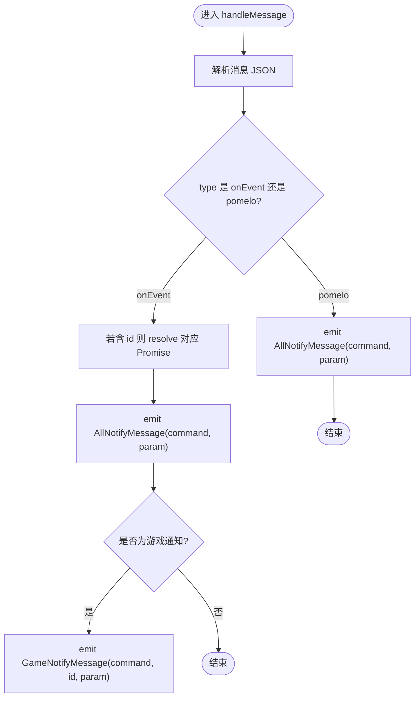
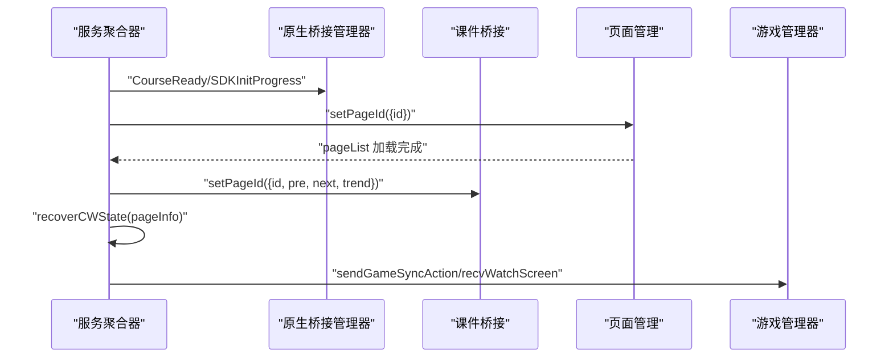
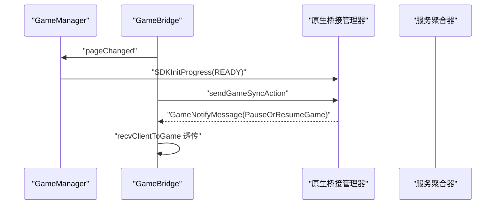
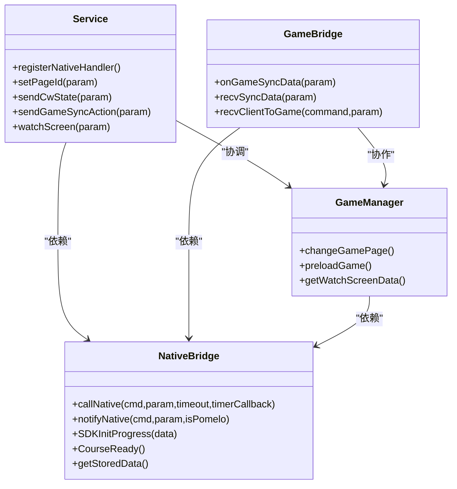

# 原生API接口

<cite>
**本文引用的文件**   
- [nativeBridgeManage.ts](file://bridge/mcc-player/src/components/native-bridge/nativeBridgeManage.ts)
- [bridge-type.ts](file://bridge/mcc-player/src/components/native-bridge/bridge-type.ts)
- [index.ts（原生桥接入口）](file://bridge/mcc-player/src/components/native-bridge/index.ts)
- [index.ts（服务聚合器）](file://bridge/mcc-player/src/components/service/index.ts)
- [gameBridge.ts](file://bridge/mcc-player/src/components/game-manage/gameBridge.ts)
- [gameManager.ts](file://bridge/mcc-player/src/components/game-manage/gameManager.ts)
- [index.ts（接口类型）](file://bridge/mcc-player/src/interface/index.ts)
- [call-promisify/index.ts](file://bridge/mcc-player/src/libs/call-promisify/index.ts)
- [index.ts（常量）](file://bridge/mcc-player/src/constants/index.ts)
</cite>

## 目录
1. [简介](#简介)
2. [项目结构](#项目结构)
3. [核心组件](#核心组件)
4. [架构总览](#架构总览)
5. [详细组件分析](#详细组件分析)
6. [依赖关系分析](#依赖关系分析)
7. [性能考量](#性能考量)
8. [故障排查指南](#故障排查指南)
9. [结论](#结论)
10. [附录](#附录)

## 简介
本文件面向“原生API接口模块”，系统性梳理其抽象层设计、接口定义、参数规范、返回值格式、桥接管理器实现、调用分发与结果处理、安全访问控制、错误处理与超时重试、跨平台兼容策略，以及典型原生功能（设备信息、系统服务、平台特性）的使用范式。目标是帮助开发者快速理解并正确集成与扩展原生能力。

## 项目结构
原生API接口位于“mcc-player”子项目中，围绕“原生桥接管理器”为核心，向上承接“服务聚合器（Service）”与“游戏管理器（GameBridge/GameManager）”，向下对接“原生端（App/Web）”。关键文件如下：
- 原生桥接管理器：nativeBridgeManage.ts
- 接口枚举与类型：bridge-type.ts
- 原生桥接入口（单例）：index.ts（原生桥接入口）
- 服务聚合器：index.ts（服务聚合器）
- 游戏桥接与管理：gameBridge.ts、gameManager.ts
- 接口类型与常量：index.ts（接口类型）、constants/index.ts

图表来源
- [nativeBridgeManage.ts:26-395](file://bridge/mcc-player/src/components/native-bridge/nativeBridgeManage.ts#L26-L395)
- [index.ts（服务聚合器）:41-149](file://bridge/mcc-player/src/components/service/index.ts#L41-L149)
- [gameBridge.ts:22-42](file://bridge/mcc-player/src/components/game-manage/gameBridge.ts#L22-L42)
- [gameManager.ts:65-94](file://bridge/mcc-player/src/components/game-manage/gameManager.ts#L65-L94)

章节来源
- [nativeBridgeManage.ts:1-395](file://bridge/mcc-player/src/components/native-bridge/nativeBridgeManage.ts#L1-L395)
- [bridge-type.ts:1-73](file://bridge/mcc-player/src/components/native-bridge/bridge-type.ts#L1-L73)
- [index.ts（原生桥接入口）:1-17](file://bridge/mcc-player/src/components/native-bridge/index.ts#L1-L17)
- [index.ts（服务聚合器）:1-895](file://bridge/mcc-player/src/components/service/index.ts#L1-L895)
- [gameBridge.ts:1-388](file://bridge/mcc-player/src/components/game-manage/gameBridge.ts#L1-L388)
- [gameManager.ts:1-368](file://bridge/mcc-player/src/components/game-manage/gameManager.ts#L1-L368)
- [index.ts（接口类型）:1-71](file://bridge/mcc-player/src/interface/index.ts#L1-L71)
- [call-promisify/index.ts:1-80](file://bridge/mcc-player/src/libs/call-promisify/index.ts#L1-L80)
- [index.ts（常量）:1-5](file://bridge/mcc-player/src/constants/index.ts#L1-L5)

## 核心组件
- 原生桥接管理器（NativeBridge）
  - 负责消息监听、消息派发、调用分发、结果处理、超时控制、跨平台通道选择。
  - 提供统一的原生命令集（CommandType）与通知类型（NotifyType、GameNotifyType）。
- 服务聚合器（Service）
  - 聚合并转发来自原生端与课件/游戏的消息，协调切页、状态恢复、Pomelo消息中转等。
- 游戏桥接与管理（GameBridge/GameManager）
  - 负责游戏生命周期、同步数据、互动状态、看屏模式、帧完成回调等。
- 类型与常量
  - 定义角色、初始化参数、云控数据、进度步进、错误捕获等类型与常量。

章节来源
- [nativeBridgeManage.ts:26-395](file://bridge/mcc-player/src/components/native-bridge/nativeBridgeManage.ts#L26-L395)
- [bridge-type.ts:1-73](file://bridge/mcc-player/src/components/native-bridge/bridge-type.ts#L1-L73)
- [index.ts（服务聚合器）:41-149](file://bridge/mcc-player/src/components/service/index.ts#L41-L149)
- [gameBridge.ts:22-42](file://bridge/mcc-player/src/components/game-manage/gameBridge.ts#L22-L42)
- [gameManager.ts:65-94](file://bridge/mcc-player/src/components/game-manage/gameManager.ts#L65-L94)
- [index.ts（接口类型）:17-71](file://bridge/mcc-player/src/interface/index.ts#L17-L71)
- [call-promisify/index.ts:1-80](file://bridge/mcc-player/src/libs/call-promisify/index.ts#L1-L80)
- [index.ts（常量）:3-4](file://bridge/mcc-player/src/constants/index.ts#L3-L4)

## 架构总览
原生API采用“事件驱动 + 命令分发”的架构：
- 原生端通过不同通道（App/WebView/Window.postMessage）向前端发送消息。
- 原生桥接管理器统一解析消息，按类型分发至服务聚合器或游戏管理器。
- 服务聚合器协调页面状态、课件恢复、Pomelo消息广播与接收。
- 游戏管理器负责游戏生命周期与同步数据的收发与透传。

图表来源
- [nativeBridgeManage.ts:51-126](file://bridge/mcc-player/src/components/native-bridge/nativeBridgeManage.ts#L51-L126)
- [index.ts（服务聚合器）:85-149](file://bridge/mcc-player/src/components/service/index.ts#L85-L149)
- [gameBridge.ts:116-189](file://bridge/mcc-player/src/components/game-manage/gameBridge.ts#L116-L189)

## 详细组件分析

### 原生桥接管理器（NativeBridge）
职责与能力
- 消息监听与解析：支持 Web 与 App 两种来源，自动识别消息类型（onEvent/onPomelo）。
- 命令分发：将消息分发到服务聚合器（AllNotifyMessage）与游戏管理器（GameNotifyMessage）。
- 调用分发：提供两类调用方式
  - 通知型：notifyNative（无需返回）
  - 调用型：callNative（带超时与Promise封装）
- 跨平台通道：优先使用原生提供的消息通道，回退到 window.postMessage。
- 超时控制：基于 CallPromisify 实现统一的超时与重试回调。

关键流程
- 消息监听与处理：handleMessage 解析 JSON，提取 type、id、command、param，分别走 resolve、emit、gameNotifyMessage。
- 调用型消息：callNative 生成唯一 id，发送消息并等待响应，超时则 reject 并触发 timerCallback。
- 通知型消息：notifyNative 直接发送，适用于无需返回的场景。
- Pomelo 透传：pomeloNative 与 teacherPomeloNative 用于与服务端通信。

图表来源
- [nativeBridgeManage.ts:65-90](file://bridge/mcc-player/src/components/native-bridge/nativeBridgeManage.ts#L65-L90)

章节来源
- [nativeBridgeManage.ts:26-395](file://bridge/mcc-player/src/components/native-bridge/nativeBridgeManage.ts#L26-L395)
- [call-promisify/index.ts:1-80](file://bridge/mcc-player/src/libs/call-promisify/index.ts#L1-L80)

### 原生命令与通知类型（CommandType/NotifyType/GameNotifyType）
- CommandType：原生端调用前端的命令集合，涵盖初始化参数、存储/拉取数据、课件目录、云控配置、Pomelo消息、SDK进度、切页、看屏、动画状态等。
- NotifyType：前端回调原生端的通知集合，涵盖尺寸变更、目录/存储/初始化参数、云控、切页、课件状态、看屏、在线人数、动画状态等。
- GameNotifyType：原生端下发给游戏的消息类型，如授权/取消授权、暂停/恢复、设置FPS等。
- 常量：OnEvent、OnPomelo、PomeloMessage、PostTeacherPomeloMessage。

章节来源
- [bridge-type.ts:1-73](file://bridge/mcc-player/src/components/native-bridge/bridge-type.ts#L1-L73)
- [index.ts（接口类型）:54-55](file://bridge/mcc-player/src/interface/index.ts#L54-L55)

### 服务聚合器（Service）
职责与能力
- 注册原生消息监听：统一接收 AllNotifyMessage 与 GameNotifyMessage。
- 页面与课件状态管理：处理 setPageId、pageComplete、cwStateChange、recoverCWState 等。
- Pomelo 消息中转：sendRoomItsMessage、sendCwState、sendGameSyncAction、watchScreen、getPageGameData。
- 初始化参数与云控：getInitParam、getCloudControl。
- 进度上报：ready、SDKInitProgress。
- 互动与看屏：onClientToGame、recvClientToGame、recvWatchScreen、recvGetPageGameData。

关键流程
- 注册监听：registerNativeHandler 绑定 AllNotifyMessage 与 GameNotifyMessage。
- setPageId：根据目标页计算前后页，请求必要 JSON，设置全局数据，调用课件 setPageId。
- sendCwState：在课件 ready 且页面一致时恢复状态；否则缓存并等待 setPageId 成功后再恢复。
- sendGameSyncAction：接收并分发游戏同步数据，区分老师端广播与看屏透传。

图表来源
- [index.ts（服务聚合器）:85-149](file://bridge/mcc-player/src/components/service/index.ts#L85-L149)
- [index.ts（服务聚合器）:612-676](file://bridge/mcc-player/src/components/service/index.ts#L612-L676)
- [index.ts（服务聚合器）:406-468](file://bridge/mcc-player/src/components/service/index.ts#L406-L468)

章节来源
- [index.ts（服务聚合器）:41-895](file://bridge/mcc-player/src/components/service/index.ts#L41-L895)

### 游戏桥接与管理（GameBridge/GameManager）
职责与能力
- GameBridge
  - 统一处理游戏侧消息：主包/框架加载完成、游戏启动参数、同步数据、互动状态、看屏模式、透传消息等。
  - 与原生桥接管理器协作：转发/接收游戏与原生之间的消息。
- GameManager
  - 管理游戏资源路径、预加载、切页联动、看屏数据组装、SDK 进度上报、暂停/恢复控制等。

关键流程
- 同步数据处理：onGameSyncData 收集心跳与操作，分别透传给游戏与服务端；recvSyncData 接收广播并更新本地状态。
- 互动与看屏：onInteractAction 与 recvWatchScreen 协同维护互动状态与看屏开关。
- 帧完成与切页：changeGamePage 在游戏页与非游戏页之间切换引擎状态，并上报进度。

图表来源
- [gameBridge.ts:116-189](file://bridge/mcc-player/src/components/game-manage/gameBridge.ts#L116-L189)
- [gameManager.ts:200-260](file://bridge/mcc-player/src/components/game-manage/gameManager.ts#L200-L260)

章节来源
- [gameBridge.ts:22-388](file://bridge/mcc-player/src/components/game-manage/gameBridge.ts#L22-L388)
- [gameManager.ts:65-368](file://bridge/mcc-player/src/components/game-manage/gameManager.ts#L65-L368)

### 超时控制与重试机制
- CallPromisify
  - 记录每个调用的 Promise，设置超时计时器，超时后统一 reject 并可触发 timerCallback。
  - 支持 resolve/reject 全量清理，避免内存泄漏。
- 原生调用
  - callNative 默认超时时间可配置，部分场景（如 getStoredData）提供更长超时与回调。
- 重试策略
  - 通过 timerCallback 触发重试逻辑（例如上报空数据继续流程），结合业务幂等性设计。

章节来源
- [call-promisify/index.ts:1-80](file://bridge/mcc-player/src/libs/call-promisify/index.ts#L1-L80)
- [nativeBridgeManage.ts:156-175](file://bridge/mcc-player/src/components/native-bridge/nativeBridgeManage.ts#L156-L175)
- [index.ts（服务聚合器）:286-291](file://bridge/mcc-player/src/components/service/index.ts#L286-L291)

### 安全访问控制与数据保护
- 角色与权限
  - 通过 InitParam 中的 role 字段区分“sender/receiver”，影响消息广播、看屏、存储等行为。
- 互动与看屏
  - onInteractAction 与 recvWatchScreen 严格区分互动发起方与被看方，避免越权访问。
- 数据隔离
  - 本地存储键前缀（如 syncDataKey）限定作用域，避免冲突。
- 通道选择
  - 优先使用原生提供的消息通道，减少 Web 环境下的跨域与注入风险。

章节来源
- [index.ts（接口类型）:7-10](file://bridge/mcc-player/src/interface/index.ts#L7-L10)
- [gameBridge.ts:286-320](file://bridge/mcc-player/src/components/game-manage/gameBridge.ts#L286-L320)
- [gameBridge.ts:218-234](file://bridge/mcc-player/src/components/game-manage/gameBridge.ts#L218-L234)

### 跨平台兼容性与适配策略
- 通道适配
  - 优先使用 window.webkit.messageHandlers 或 window.htHammer.nativeHandler。
  - Web 环境使用 window.parent.postMessage 与 window.addEventListener('message')。
- 环境检测
  - 通过 URL 参数 from 区分 app/web，决定监听与发送策略。
- 帧完成与进度上报
  - 通过 SDKInitProgress 与 INIT_STEP 步进上报，避免重复上报与竞态。

章节来源
- [nativeBridgeManage.ts:35-36](file://bridge/mcc-player/src/components/native-bridge/nativeBridgeManage.ts#L35-L36)
- [nativeBridgeManage.ts:196-204](file://bridge/mcc-player/src/components/native-bridge/nativeBridgeManage.ts#L196-L204)
- [index.ts（接口类型）:42-52](file://bridge/mcc-player/src/interface/index.ts#L42-L52)

## 依赖关系分析
- 组件耦合
  - Service 依赖 NativeBridge、PageManage、CourseBridge、GameManager。
  - GameBridge 依赖 NativeBridge、PageManage、GameManager。
  - NativeBridge 依赖 CallPromisify、bridge-type、interface。
- 事件契约
  - AllNotifyMessage：原生 -> 前端（服务聚合器）。
  - GameNotifyMessage：原生 -> 前端（游戏管理器）。
- 命令契约
  - CommandType/NotifyType/GameNotifyType 定义了严格的命令与参数边界。

图表来源
- [nativeBridgeManage.ts:26-395](file://bridge/mcc-player/src/components/native-bridge/nativeBridgeManage.ts#L26-L395)
- [index.ts（服务聚合器）:41-149](file://bridge/mcc-player/src/components/service/index.ts#L41-L149)
- [gameBridge.ts:22-42](file://bridge/mcc-player/src/components/game-manage/gameBridge.ts#L22-L42)
- [gameManager.ts:65-94](file://bridge/mcc-player/src/components/game-manage/gameManager.ts#L65-L94)

章节来源
- [nativeBridgeManage.ts:26-395](file://bridge/mcc-player/src/components/native-bridge/nativeBridgeManage.ts#L26-L395)
- [index.ts（服务聚合器）:41-149](file://bridge/mcc-player/src/components/service/index.ts#L41-L149)
- [gameBridge.ts:22-42](file://bridge/mcc-player/src/components/game-manage/gameBridge.ts#L22-L42)
- [gameManager.ts:65-94](file://bridge/mcc-player/src/components/game-manage/gameManager.ts#L65-L94)

## 性能考量
- 超时与重试
  - 合理设置 callNative 超时，避免阻塞主线程；对关键流程提供 timerCallback 以便降级或重试。
- 进度上报
  - 使用 INIT_STEP 与 SDKInitProgress 逐步上报，避免一次性大量上报导致抖动。
- 资源路径
  - 本地/CDN 路径动态选择，减少首屏加载时间。
- 事件风暴
  - 对高频事件（心跳、动画状态）进行节流或合并上报。

## 故障排查指南
- 常见问题
  - 原生通道不可用：检查 window.webkit、window.htHammer、window.postMessage 是否可用。
  - 超时：确认 timerCallback 是否触发重试；适当增大超时时间。
  - 重复上报：确认 processReady 与 INIT_STEP 流程，避免重复上报。
  - 互动/看屏异常：核对 role、interactId、localStorage 键前缀。
- 日志与监控
  - 使用 Logger 输出关键路径日志，便于定位问题。
- 错误边界
  - 对网络请求与资源加载增加错误边界与降级策略。

章节来源
- [nativeBridgeManage.ts:196-204](file://bridge/mcc-player/src/components/native-bridge/nativeBridgeManage.ts#L196-L204)
- [call-promisify/index.ts:11-20](file://bridge/mcc-player/src/libs/call-promisify/index.ts#L11-L20)
- [index.ts（常量）:3-4](file://bridge/mcc-player/src/constants/index.ts#L3-L4)

## 结论
原生API接口模块通过“原生桥接管理器 + 服务聚合器 + 游戏桥接”的分层设计，实现了跨平台、可扩展、可观测的原生能力抽象。依托严格的命令与通知契约、完善的超时与重试机制、清晰的角色与权限模型，能够稳定支撑课件、游戏与原生端的协同工作。建议在新增原生功能时遵循现有契约与流程，确保一致性与可维护性。

## 附录

### API 接口定义与参数规范
- 初始化参数（InitParam）
  - 字段：startPageId、courseWareWidth、courseWareHeight、role、liveId、userId、userName、client、clientDescription、gradeId、belongCityId、localRootPath、introductoryLesson、env、class_mode、guid。
  - 用途：前端初始化、云控路径解析、资源加载策略选择。
- 云控数据（CloudControlData）
  - 字段：mccPathDefinition。
  - 用途：动态配置资源路径与行为。
- 进度步进（INIT_STEP）
  - 字段：BEGIN、INIT、LOADING_PROGRESS_01~06、READY。
  - 用途：上报 SDK 初始化进度，避免重复上报。

章节来源
- [index.ts（接口类型）:17-52](file://bridge/mcc-player/src/interface/index.ts#L17-L52)

### 返回值格式约定
- 调用型返回：Promise，成功解析为服务端返回的 param；超时或错误抛出异常。
- 通知型返回：void，仅用于触发原生端行为。
- Pomelo 透传：携带 command 与 param，由原生端统一处理。

章节来源
- [nativeBridgeManage.ts:156-175](file://bridge/mcc-player/src/components/native-bridge/nativeBridgeManage.ts#L156-L175)
- [bridge-type.ts:49-53](file://bridge/mcc-player/src/components/native-bridge/bridge-type.ts#L49-L53)

### 使用示例（场景化）
- 获取初始化参数
  - 调用：getInitParam
  - 场景：页面初始化、云控加载、资源路径解析
  - 参考：[nativeBridgeManage.ts:211-214](file://bridge/mcc-player/src/components/native-bridge/nativeBridgeManage.ts#L211-L214)
- 存储/拉取数据
  - 调用：storeData、getStoredData
  - 场景：断线重连、状态恢复
  - 参考：[nativeBridgeManage.ts:224-227](file://bridge/mcc-player/src/components/native-bridge/nativeBridgeManage.ts#L224-L227), [nativeBridgeManage.ts:286-291](file://bridge/mcc-player/src/components/native-bridge/nativeBridgeManage.ts#L286-L291)
- 切页与状态恢复
  - 调用：setPageId、recoverCWState、cwStateChange
  - 场景：用户翻页、动画完成、视频播放结束
  - 参考：[index.ts（服务聚合器）:612-676](file://bridge/mcc-player/src/components/service/index.ts#L612-L676), [index.ts（服务聚合器）:406-468](file://bridge/mcc-player/src/components/service/index.ts#L406-L468)
- 游戏同步与看屏
  - 调用：sendGameSyncAction、watchScreen、getPageGameData
  - 场景：老师端广播、学生看屏、数据回传
  - 参考：[index.ts（服务聚合器）:474-492](file://bridge/mcc-player/src/components/service/index.ts#L474-L492), [gameBridge.ts:169-189](file://bridge/mcc-player/src/components/game-manage/gameBridge.ts#L169-L189)