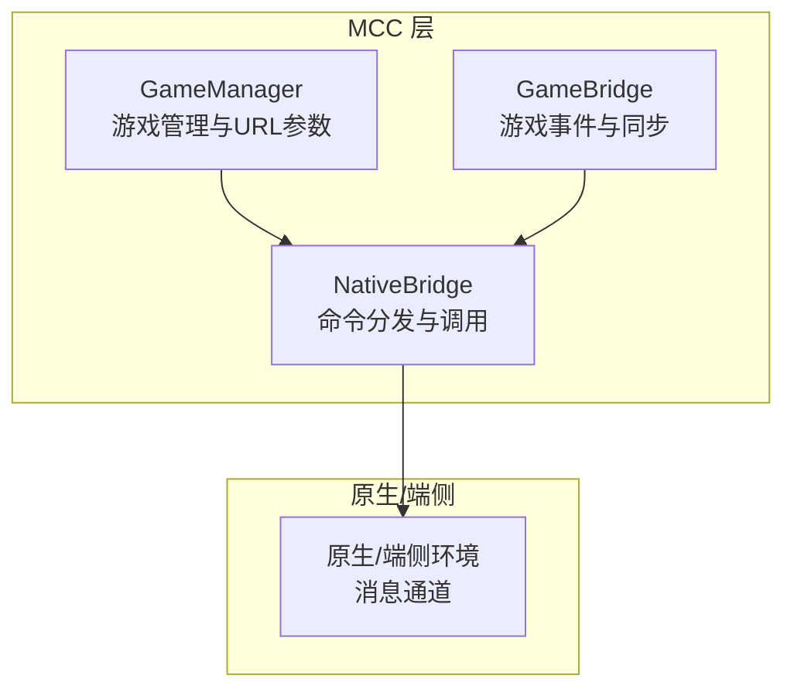
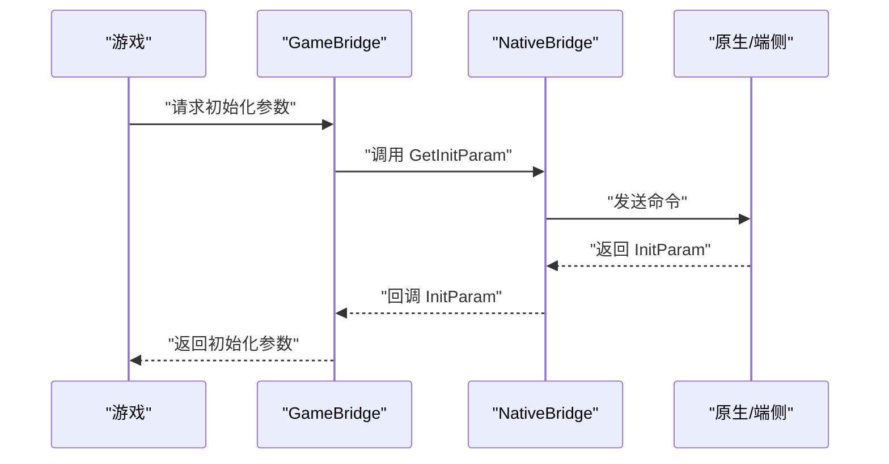
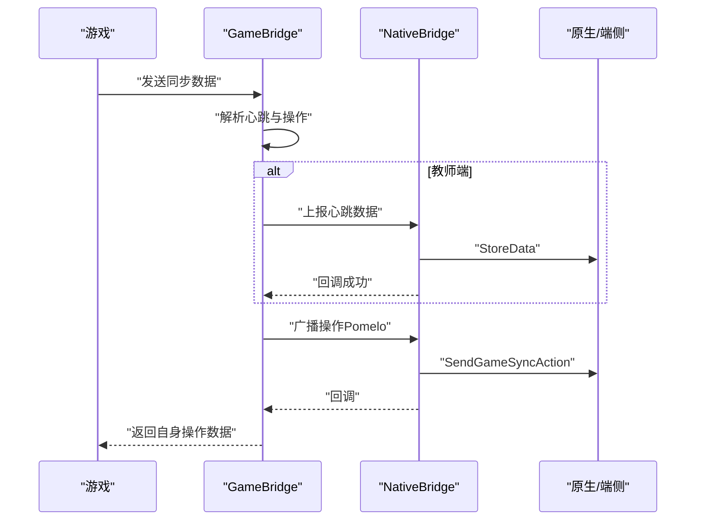
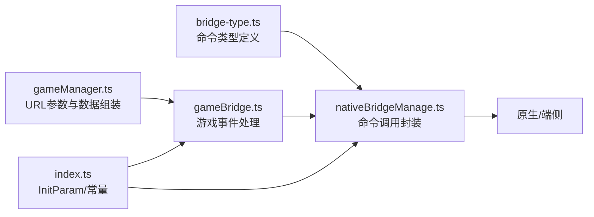

# 命令类型定义

<cite>
**本文引用的文件**
- [bridge-type.ts](file://bridge/mcc-player/src/components/native-bridge/bridge-type.ts)
- [nativeBridgeManage.ts](file://bridge/mcc-player/src/components/native-bridge/nativeBridgeManage.ts)
- [gameBridge.ts](file://bridge/mcc-player/src/components/game-manage/gameBridge.ts)
- [gameManager.ts](file://bridge/mcc-player/src/components/game-manage/gameManager.ts)
- [index.ts](file://bridge/mcc-player/src/interface/index.ts)
- [type.ts](file://bridge/mcc-player/src/components/game-manage/type.ts)
</cite>

## 目录
1. [简介](#简介)
2. [项目结构](#项目结构)
3. [核心组件](#核心组件)
4. [架构总览](#架构总览)
5. [详细组件分析](#详细组件分析)
6. [依赖关系分析](#依赖关系分析)
7. [性能考量](#性能考量)
8. [故障排查指南](#故障排查指南)
9. [结论](#结论)

## 简介
本文件面向“命令类型定义”模块，系统化阐述命令体系的设计原则、分类逻辑与使用规范，重点覆盖以下方面：
- 命令类型枚举与职责边界：区分 MCC 到原生的请求命令与原生到 MCC 的通知命令
- 关键命令详解：GetInitParam、StoreData、GetStoredData、GetCatalogueInfo 等
- 参数与返回值结构：参数格式、触发时机、返回值约定
- 错误处理与异常流程：超时、回调缺失、跨端通信异常的处理策略
- 实际使用示例与最佳实践：如何在初始化、翻页、游戏同步等场景正确使用命令
- 与游戏侧命令的协同：MCC 与游戏之间的事件与命令桥接

## 项目结构
命令类型定义位于“原生桥接层”，围绕三类命令集合展开：
- 原生桥接命令（MCC → 原生）：用于向原生/端侧发起请求或上报状态
- 通知命令（原生 → MCC）：用于接收来自端侧/原生的事件与数据
- 游戏侧命令（MCC ↔ 游戏）：用于游戏与 MCC 之间的事件与状态同步

图表来源
- [nativeBridgeManage.ts:26-395](file://bridge/mcc-player/src/components/native-bridge/nativeBridgeManage.ts#L26-L395)
- [gameManager.ts:65-368](file://bridge/mcc-player/src/components/game-manage/gameManager.ts#L65-L368)
- [gameBridge.ts:22-388](file://bridge/mcc-player/src/components/game-manage/gameBridge.ts#L22-L388)

章节来源
- [bridge-type.ts:1-73](file://bridge/mcc-player/src/components/native-bridge/bridge-type.ts#L1-L73)
- [nativeBridgeManage.ts:26-395](file://bridge/mcc-player/src/components/native-bridge/nativeBridgeManage.ts#L26-L395)

## 核心组件
- 命令类型枚举
  - 原生桥接命令（MCC → 原生）：GetInitParam、StoreData、GetStoredData、GetCatalogueInfo、GetCloudControl、SendRoomItsMessage、HeartBeat、SDKInitProgress、CourseReady、SendCwState、PageComplete、SetPageId、SendGameSyncAction、GetPageInfo、GetPageGameData、CoursePlayOver、VisibilityNavBar、AnimateChange
  - 通知命令（原生 → MCC）：HandleRoomItsMessage、ResizeCW、HandleCatalogueInfo、HandleStoredData、HandleInitParam、HandleCloudControl、SetPageId、CWStateChange、HandleCwState、WatchScreen、GetPageGameData、GetOnlineNum、AnimateChange
  - 游戏侧通知命令（原生 → 游戏）：OnInteractAction、PauseOrResumeGame、SetGameFPS
- 初始化参数结构 InitParam：包含角色、直播/用户信息、设备与路径、云控开关等
- 游戏侧命令与事件：GameEvent、GameCommand、GameAuthorizeStatus、GameToClientEvent

章节来源
- [bridge-type.ts:3-47](file://bridge/mcc-player/src/components/native-bridge/bridge-type.ts#L3-L47)
- [index.ts:17-36](file://bridge/mcc-player/src/interface/index.ts#L17-L36)
- [type.ts:1-67](file://bridge/mcc-player/src/components/game-manage/type.ts#L1-L67)

## 架构总览
MCC 通过 NativeBridge 统一调度命令，将命令封装为消息并投递至原生/端侧；原生/端侧通过统一事件通道回传通知；游戏侧通过 GameBridge 与 GameManager 协同处理命令与事件。

图表来源
- [nativeBridgeManage.ts:211-214](file://bridge/mcc-player/src/components/native-bridge/nativeBridgeManage.ts#L211-L214)
- [gameBridge.ts:102-105](file://bridge/mcc-player/src/components/game-manage/gameBridge.ts#L102-L105)

章节来源
- [nativeBridgeManage.ts:211-214](file://bridge/mcc-player/src/components/native-bridge/nativeBridgeManage.ts#L211-L214)
- [gameBridge.ts:102-105](file://bridge/mcc-player/src/components/game-manage/gameBridge.ts#L102-L105)

## 详细组件分析

### 命令类型设计原则与分类逻辑
- 命令方向
  - MCC → 原生：用于请求数据、上报状态、控制行为（如翻页、心跳、进度上报）
  - 原生 → MCC：用于推送事件、目录/参数/状态变更通知
  - 原生 → 游戏：用于授权、暂停/恢复、FPS 设置等
- 命令命名与语义
  - 动宾结构：如 GetXxx、SendXxx、SetXxx、PageComplete、CourseReady 等
  - 语义清晰：明确触发方、动作与目标，避免歧义
- 事件与命令分离
  - 事件（Event）：强调“发生了什么”，通常由原生/端侧主动推送
  - 命令（Command）：强调“需要做什么”，通常由 MCC 主动发起

章节来源
- [bridge-type.ts:3-47](file://bridge/mcc-player/src/components/native-bridge/bridge-type.ts#L3-L47)

### 关键命令详解与使用规范

#### GetInitParam（获取初始化参数）
- 触发时机
  - 应用初始化阶段，MCC 需要从原生侧获取角色、直播/用户信息、设备与路径等上下文
- 参数格式
  - 无参数
- 返回值结构
  - InitParam：包含角色、直播/用户信息、设备与路径、云控开关等
- 使用示例
  - 在应用初始化流程中调用，随后上报初始化进度与获取课件目录
- 最佳实践
  - 将初始化参数缓存于 GameBridge 中，供后续命令与游戏 URL 参数拼装使用
  - 若初始化失败，需降级处理并上报错误

章节来源
- [bridge-type.ts:4-4](file://bridge/mcc-player/src/components/native-bridge/bridge-type.ts#L4-L4)
- [nativeBridgeManage.ts:211-214](file://bridge/mcc-player/src/components/native-bridge/nativeBridgeManage.ts#L211-L214)
- [gameBridge.ts:102-105](file://bridge/mcc-player/src/components/game-manage/gameBridge.ts#L102-L105)
- [index.ts:17-36](file://bridge/mcc-player/src/interface/index.ts#L17-L36)

#### StoreData（存储课件/游戏状态数据）
- 触发时机
  - 教学过程中，教师端或互动状态下，需要将游戏心跳/状态数据上报至服务器
- 参数格式
  - 自定义对象，包含页面 ID、游戏同步数据等
- 返回值结构
  - 无返回值；通过异步回调或端侧确认
- 使用示例
  - 游戏心跳数据到达时，若角色为教师端则立即上报
- 最佳实践
  - 对上报失败进行重试与降级处理，确保数据最终一致性

章节来源
- [bridge-type.ts:5-5](file://bridge/mcc-player/src/components/native-bridge/bridge-type.ts#L5-L5)
- [nativeBridgeManage.ts:224-227](file://bridge/mcc-player/src/components/native-bridge/nativeBridgeManage.ts#L224-L227)
- [gameBridge.ts:133-139](file://bridge/mcc-player/src/components/game-manage/gameBridge.ts#L133-L139)

#### GetStoredData（拉取服务器存储的全部数据）
- 触发时机
  - 初始化或断线重连后，需要从服务器拉取历史状态数据
- 参数格式
  - 无参数
- 返回值结构
  - 服务器存储的完整数据对象；若超时则触发回退逻辑
- 使用示例
  - 初始化流程中调用，超时则回退到目录恢复策略
- 最佳实践
  - 设置合理超时时间（如 5 秒），并在超时后触发回退策略

章节来源
- [bridge-type.ts:6-6](file://bridge/mcc-player/src/components/native-bridge/bridge-type.ts#L6-L6)
- [nativeBridgeManage.ts:286-291](file://bridge/mcc-player/src/components/native-bridge/nativeBridgeManage.ts#L286-L291)

#### GetCatalogueInfo（获取课件目录）
- 触发时机
  - 初始化阶段，获取课件目录以便构建页面与游戏映射
- 参数格式
  - 无参数
- 返回值结构
  - 目录信息对象（含页面列表、模板信息等）
- 使用示例
  - 初始化流程中调用，随后进行页面与游戏数据映射
- 最佳实践
  - 目录获取失败时，结合历史数据与起始页恢复策略

章节来源
- [bridge-type.ts:7-7](file://bridge/mcc-player/src/components/native-bridge/bridge-type.ts#L7-L7)
- [nativeBridgeManage.ts:297-300](file://bridge/mcc-player/src/components/native-bridge/nativeBridgeManage.ts#L297-L300)

#### GetCloudControl（获取云控配置）
- 触发时机
  - 初始化阶段，用于获取路径与资源配置
- 参数格式
  - 无参数
- 返回值结构
  - 云控配置对象（包含路径定义等）
- 使用示例
  - 初始化流程中调用，随后用于拼装资源 URL
- 最佳实践
  - 云控配置缺失时，采用默认路径策略

章节来源
- [bridge-type.ts:8-8](file://bridge/mcc-player/src/components/native-bridge/bridge-type.ts#L8-L8)
- [nativeBridgeManage.ts:303-306](file://bridge/mcc-player/src/components/native-bridge/nativeBridgeManage.ts#L303-L306)

#### SendRoomItsMessage（发送 ITS 消息）
- 触发时机
  - 课堂交互中，需要将详细操作消息发送至 ITS 系统
- 参数格式
  - ITS 消息体对象
- 返回值结构
  - 无返回值
- 使用示例
  - 课堂互动事件触发后，统一通过 Pomelo 通道发送
- 最佳实践
  - 对重要消息进行去重与幂等处理

章节来源
- [bridge-type.ts:9-9](file://bridge/mcc-player/src/components/native-bridge/bridge-type.ts#L9-L9)
- [nativeBridgeManage.ts:314-317](file://bridge/mcc-player/src/components/native-bridge/nativeBridgeManage.ts#L314-L317)

#### HeartBeat（心跳）
- 触发时机
  - 课堂进行中，周期性上报心跳以维持连接与状态同步
- 参数格式
  - 心跳数据对象
- 返回值结构
  - 无返回值
- 使用示例
  - 游戏心跳到达时，教师端或被授权学生端上报
- 最佳实践
  - 心跳频率与合并上报策略需结合业务场景

章节来源
- [bridge-type.ts:10-10](file://bridge/mcc-player/src/components/native-bridge/bridge-type.ts#L10-L10)
- [nativeBridgeManage.ts:245-248](file://bridge/mcc-player/src/components/native-bridge/nativeBridgeManage.ts#L245-L248)

#### SDKInitProgress（上报 SDK 初始化进度）
- 触发时机
  - 课件加载与 SDK 初始化过程中，周期性上报进度
- 参数格式
  - 进度对象（含步骤与时间戳）
- 返回值结构
  - 无返回值
- 使用示例
  - 切页或加载阶段按步骤上报进度
- 最佳实践
  - 避免重复上报已完成的步骤，防止冗余

章节来源
- [bridge-type.ts:11-11](file://bridge/mcc-player/src/components/native-bridge/bridge-type.ts#L11-L11)
- [nativeBridgeManage.ts:375-388](file://bridge/mcc-player/src/components/native-bridge/nativeBridgeManage.ts#L375-L388)

#### CourseReady（课件准备就绪）
- 触发时机
  - 课件挂载完成，端侧可进行翻页或断线重连
- 参数格式
  - 无参数
- 返回值结构
  - 无返回值
- 使用示例
  - 课件 mounted 后调用，标记课程已就绪
- 最佳实践
  - 仅在首次就绪时调用，避免重复

章节来源
- [bridge-type.ts:12-12](file://bridge/mcc-player/src/components/native-bridge/bridge-type.ts#L12-L12)
- [nativeBridgeManage.ts:345-349](file://bridge/mcc-player/src/components/native-bridge/nativeBridgeManage.ts#L345-L349)

#### SendCwState（发送课件实时数据）
- 触发时机
  - 教师端需要向 ITS 系统发送课件实时数据
- 参数格式
  - 课件状态对象
- 返回值结构
  - 无返回值
- 使用示例
  - 课件状态变化时，通过 Pomelo 通道发送
- 最佳实践
  - 数据合并与节流，避免频繁上报

章节来源
- [bridge-type.ts:13-13](file://bridge/mcc-player/src/components/native-bridge/bridge-type.ts#L13-L13)
- [nativeBridgeManage.ts:245-248](file://bridge/mcc-player/src/components/native-bridge/nativeBridgeManage.ts#L245-L248)

#### PageComplete（当页课件执行完成）
- 触发时机
  - 当前页面课件执行完毕，允许进行翻页
- 参数格式
  - 页面完成标识对象
- 返回值结构
  - 无返回值
- 使用示例
  - 页面动画/活动完成后调用
- 最佳实践
  - 与页面切换流程解耦，确保幂等

章节来源
- [bridge-type.ts:14-14](file://bridge/mcc-player/src/components/native-bridge/bridge-type.ts#L14-L14)
- [nativeBridgeManage.ts:235-238](file://bridge/mcc-player/src/components/native-bridge/nativeBridgeManage.ts#L235-L238)

#### SetPageId（跳转到特定页）
- 触发时机
  - 需要主动跳转到指定页面
- 参数格式
  - 页面 ID 对象
- 返回值结构
  - 无返回值
- 使用示例
  - 主动翻页或断线重连恢复
- 最佳实践
  - 跳转前清理临时状态，跳转后触发必要的初始化

章节来源
- [bridge-type.ts:15-15](file://bridge/mcc-player/src/components/native-bridge/bridge-type.ts#L15-L15)
- [nativeBridgeManage.ts:334-337](file://bridge/mcc-player/src/components/native-bridge/nativeBridgeManage.ts#L334-L337)

#### SendGameSyncAction（同步游戏操作）
- 触发时机
  - 游戏产生操作或心跳，需要广播给其他端或教师端查看
- 参数格式
  - 同步数据对象（含操作列表与心跳）
- 返回值结构
  - 无返回值
- 使用示例
  - 教师端广播操作；被授权学生端向教师端发送操作
- 最佳实践
  - 区分广播与定向发送（如查看模式），并进行去重

章节来源
- [bridge-type.ts:16-16](file://bridge/mcc-player/src/components/native-bridge/bridge-type.ts#L16-L16)
- [nativeBridgeManage.ts:254-262](file://bridge/mcc-player/src/components/native-bridge/nativeBridgeManage.ts#L254-L262)

#### GetPageInfo（获取页面信息）
- 触发时机
  - 需要向原生侧查询当前页面信息
- 参数格式
  - 页面信息对象
- 返回值结构
  - 页面信息对象
- 使用示例
  - 页面切换或恢复时查询
- 最佳实践
  - 缓存页面信息，减少重复查询

章节来源
- [bridge-type.ts:17-17](file://bridge/mcc-player/src/components/native-bridge/bridge-type.ts#L17-L17)
- [nativeBridgeManage.ts:391-394](file://bridge/mcc-player/src/components/native-bridge/nativeBridgeManage.ts#L391-L394)

#### GetPageGameData（获取当前页游戏数据）
- 触发时机
  - 教师端查看学生游戏时，需要获取当前页游戏数据
- 参数格式
  - 无参数
- 返回值结构
  - 游戏数据对象（含 URL、参数、页面数据、同步数据）
- 使用示例
  - 查看模式开启时，端侧请求当前页游戏数据
- 最佳实践
  - 数据脱敏与最小化传输

章节来源
- [bridge-type.ts:18-18](file://bridge/mcc-player/src/components/native-bridge/bridge-type.ts#L18-L18)
- [nativeBridgeManage.ts:268-271](file://bridge/mcc-player/src/components/native-bridge/nativeBridgeManage.ts#L268-L271)
- [gameManager.ts:349-365](file://bridge/mcc-player/src/components/game-manage/gameManager.ts#L349-L365)

#### CoursePlayOver（课件播放结束）
- 触发时机
  - 先导课或多页播放结束后调用
- 参数格式
  - 无参数
- 返回值结构
  - 无返回值
- 使用示例
  - 先导课结束后上报播放结束
- 最佳实践
  - 结束后清理资源与监听

章节来源
- [bridge-type.ts:19-19](file://bridge/mcc-player/src/components/native-bridge/bridge-type.ts#L19-L19)
- [nativeBridgeManage.ts:355-358](file://bridge/mcc-player/src/components/native-bridge/nativeBridgeManage.ts#L355-L358)

#### VisibilityNavBar（控制导航栏显示隐藏）
- 触发时机
  - 需要动态控制导航栏显示状态
- 参数格式
  - 显示/隐藏状态对象
- 返回值结构
  - 无返回值
- 使用示例
  - 全屏播放或特殊页面场景
- 最佳实践
  - 与页面生命周期绑定，避免冲突

章节来源
- [bridge-type.ts:20-20](file://bridge/mcc-player/src/components/native-bridge/bridge-type.ts#L20-L20)
- [nativeBridgeManage.ts:364-367](file://bridge/mcc-player/src/components/native-bridge/nativeBridgeManage.ts#L364-L367)

#### AnimateChange（动画状态变更）
- 触发时机
  - 课件动画状态发生变化
- 参数格式
  - 无参数
- 返回值结构
  - 无返回值
- 使用示例
  - 动画播放/暂停/结束时上报
- 最佳实践
  - 与动画生命周期对齐，避免重复上报

章节来源
- [bridge-type.ts:21-21](file://bridge/mcc-player/src/components/native-bridge/bridge-type.ts#L21-L21)
- [nativeBridgeManage.ts:324-327](file://bridge/mcc-player/src/components/native-bridge/nativeBridgeManage.ts#L324-L327)

### 游戏侧命令与事件

#### 游戏事件（GameEvent）
- 作用：游戏向 MCC 发起的事件请求，如准备就绪、开始、资源加载、互动授权等
- 关键事件：RequestEventReady、RequestGameStart、RequestResLoadStart/End、RequestKeepPlaying、RequestRestartOver、RequestSyncInit、RequestStaticResUrl、RequestGameToClient、EventTracking 等

章节来源
- [type.ts:1-22](file://bridge/mcc-player/src/components/game-manage/type.ts#L1-L22)

#### 游戏命令（GameCommand）
- 作用：MCC 向游戏下发的指令，如心跳、同步、授权、暂停/恢复、FPS 设置、透传消息等
- 关键命令：RecvIsMaster、RecvSyncData、RecvSync3sData、RecvKeepPlaying、RecvRestart、RecvCancelKeepPlaying、RecvOpenAuthorization、RecvCancelAuthorization、RecvStaticResUrl、RecvClientToGame

章节来源
- [type.ts:24-36](file://bridge/mcc-player/src/components/game-manage/type.ts#L24-L36)

#### 游戏授权状态（GameAuthorizeStatus）
- Unauthorized：未授权
- KeepPlaying：授权（继续玩）
- Restart：授权（重新玩）

章节来源
- [type.ts:39-45](file://bridge/mcc-player/src/components/game-manage/type.ts#L39-L45)

#### 游戏到端事件（GameToClientEvent）
- 作用：游戏通过 MCC 透传给端侧的事件，如拍照、录音、用户信息等
- 关键事件：startPhotoCapture、cancelPhotoCapture、startAudioRecording、stopAudioRecording、cancelAudioRecording、fetchUserInfo

章节来源
- [type.ts:48-67](file://bridge/mcc-player/src/components/game-manage/type.ts#L48-L67)

### 命令执行序列图（示例：游戏同步数据）

图表来源
- [gameBridge.ts:116-163](file://bridge/mcc-player/src/components/game-manage/gameBridge.ts#L116-L163)
- [nativeBridgeManage.ts:254-262](file://bridge/mcc-player/src/components/native-bridge/nativeBridgeManage.ts#L254-L262)

## 依赖关系分析
- 命令类型与实现的耦合
  - 命令类型定义集中于 bridge-type.ts，具体调用封装在 nativeBridgeManage.ts
  - 游戏侧命令通过 gameBridge.ts 与 GameManager 协同
- 事件与命令的边界
  - 通知命令（NotifyType）与原生/端侧事件通道绑定
  - 游戏侧通知命令（GameNotifyType）与游戏事件通道绑定
- 参数与返回值契约
  - 初始化参数 InitParam 作为多命令的输入基础
  - 大部分命令为单向上报，少数命令需要原生侧返回数据

图表来源
- [bridge-type.ts:1-73](file://bridge/mcc-player/src/components/native-bridge/bridge-type.ts#L1-L73)
- [nativeBridgeManage.ts:26-395](file://bridge/mcc-player/src/components/native-bridge/nativeBridgeManage.ts#L26-L395)
- [gameBridge.ts:22-388](file://bridge/mcc-player/src/components/game-manage/gameBridge.ts#L22-L388)
- [gameManager.ts:65-368](file://bridge/mcc-player/src/components/game-manage/gameManager.ts#L65-L368)
- [index.ts:17-36](file://bridge/mcc-player/src/interface/index.ts#L17-L36)

章节来源
- [bridge-type.ts:1-73](file://bridge/mcc-player/src/components/native-bridge/bridge-type.ts#L1-L73)
- [nativeBridgeManage.ts:26-395](file://bridge/mcc-player/src/components/native-bridge/nativeBridgeManage.ts#L26-L395)
- [gameBridge.ts:22-388](file://bridge/mcc-player/src/components/game-manage/gameBridge.ts#L22-L388)
- [gameManager.ts:65-368](file://bridge/mcc-player/src/components/game-manage/gameManager.ts#L65-L368)
- [index.ts:17-36](file://bridge/mcc-player/src/interface/index.ts#L17-L36)

## 性能考量
- 命令调用的超时与重试
  - 对需要原生侧返回的命令（如 GetStoredData、GetCatalogueInfo、GetCloudControl、GetInitParam）设置合理超时时间，并在超时后触发回退策略
- 上报合并与节流
  - 心跳与状态上报建议合并与节流，避免频繁网络请求
- 进度上报幂等
  - SDKInitProgress 避免重复上报已完成步骤，减少冗余
- 资源路径与云控
  - 通过云控配置与本地/CDN 路径组合，提升资源加载效率

## 故障排查指南
- 命令超时
  - 现象：调用 GetStoredData、GetCatalogueInfo、GetCloudControl、GetInitParam 等命令后无返回
  - 处理：检查超时回调逻辑，必要时触发回退策略（如目录恢复）
- 回调缺失
  - 现象：原生侧未按预期返回数据
  - 处理：确认消息通道与事件绑定，检查消息 ID 与回调匹配
- 跨端通信异常
  - 现象：无法通过 window.webkit 或 window.htHammer 调用原生接口
  - 处理：检查运行环境（Web/App），确保消息通道可用
- 游戏同步异常
  - 现象：教师端未收到学生端操作或反之
  - 处理：确认 SendGameSyncAction 的广播/定向发送逻辑，检查查看模式下的定向通道

章节来源
- [nativeBridgeManage.ts:156-175](file://bridge/mcc-player/src/components/native-bridge/nativeBridgeManage.ts#L156-L175)
- [nativeBridgeManage.ts:182-205](file://bridge/mcc-player/src/components/native-bridge/nativeBridgeManage.ts#L182-L205)
- [nativeBridgeManage.ts:254-262](file://bridge/mcc-player/src/components/native-bridge/nativeBridgeManage.ts#L254-L262)

## 结论
命令类型定义模块通过清晰的方向划分与语义化命名，实现了 MCC 与原生/端侧以及游戏侧之间的稳定通信。遵循本文档的使用规范与最佳实践，可在保证功能正确性的前提下，提升系统的稳定性与性能表现。