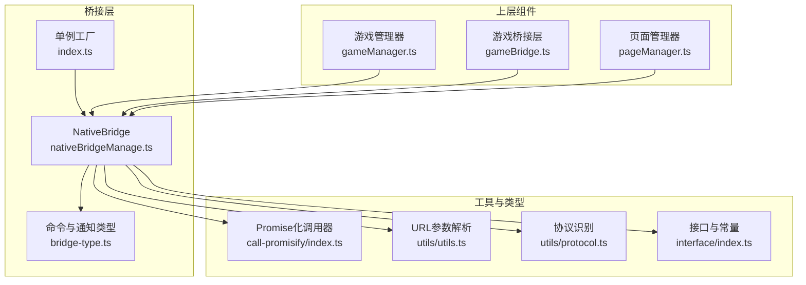
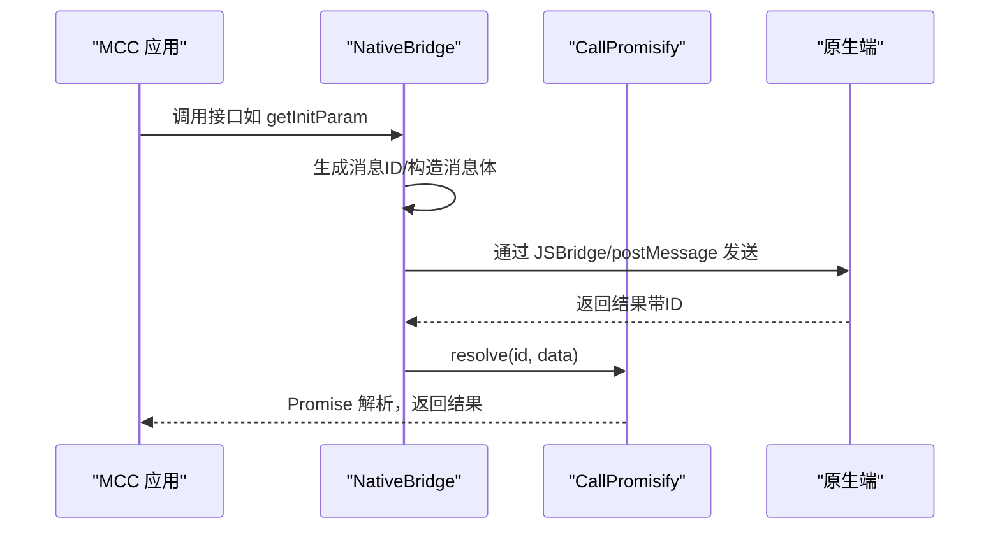
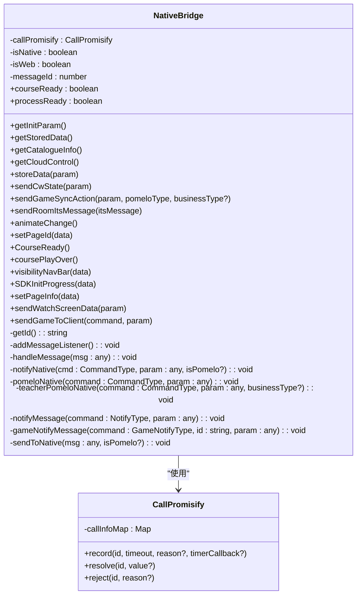
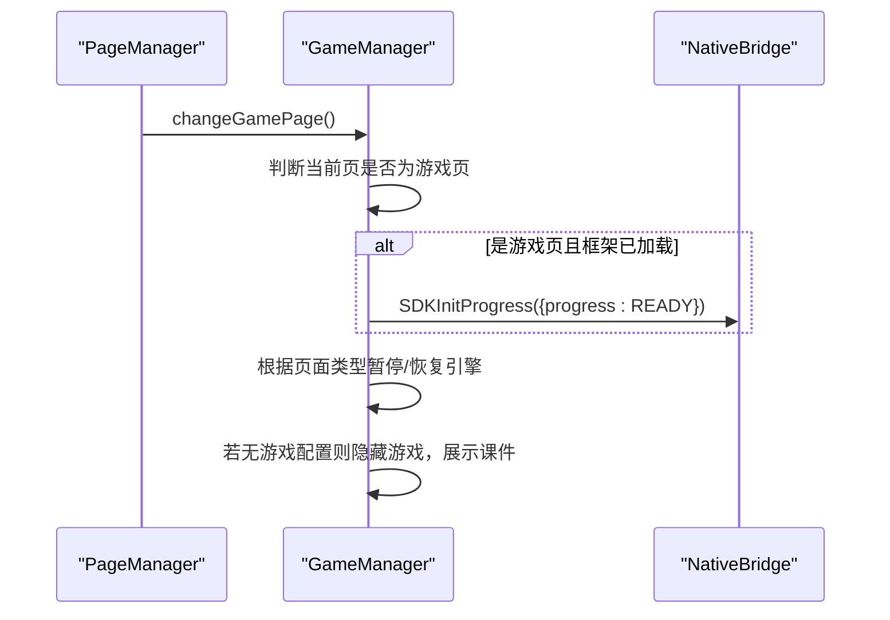
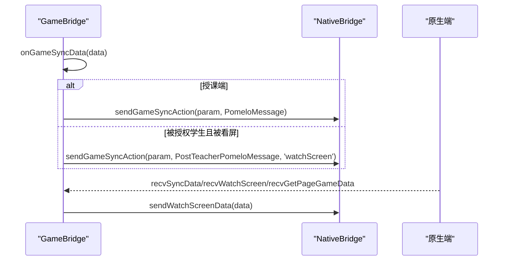
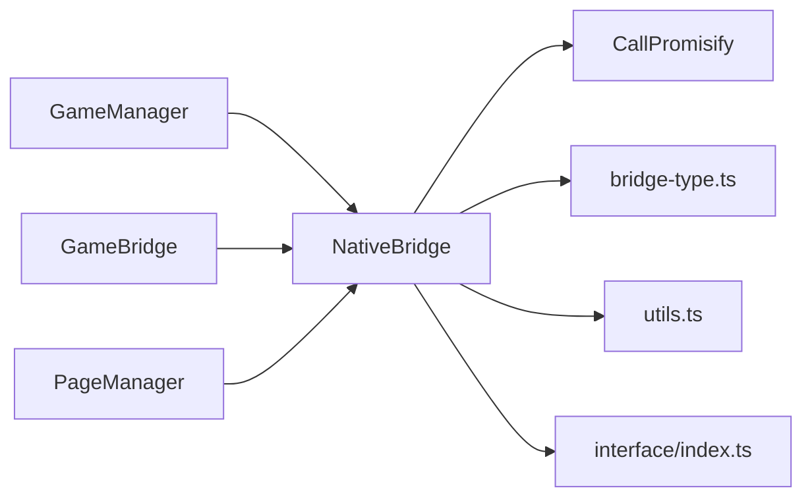

# 桥接管理器

<cite>
**本文引用的文件**
- [nativeBridgeManage.ts](file://bridge/mcc-player/src/components/native-bridge/nativeBridgeManage.ts)
- [index.ts](file://bridge/mcc-player/src/components/native-bridge/index.ts)
- [bridge-type.ts](file://bridge/mcc-player/src/components/native-bridge/bridge-type.ts)
- [index.ts](file://bridge/mcc-player/src/interface/index.ts)
- [index.ts](file://bridge/mcc-player/src/libs/call-promisify/index.ts)
- [index.ts](file://bridge/mcc-player/src/utils/utils.ts)
- [protocol.ts](file://bridge/mcc-player/src/utils/protocol.ts)
- [gameManager.ts](file://bridge/mcc-player/src/components/game-manage/gameManager.ts)
- [gameBridge.ts](file://bridge/mcc-player/src/components/game-manage/gameBridge.ts)
- [pageManager.ts](file://bridge/mcc-player/src/components/page/pageManager.ts)
</cite>

## 目录
1. [简介](#简介)
2. [项目结构](#项目结构)
3. [核心组件](#核心组件)
4. [架构总览](#架构总览)
5. [详细组件分析](#详细组件分析)
6. [依赖分析](#依赖分析)
7. [性能考虑](#性能考虑)
8. [故障排查指南](#故障排查指南)
9. [结论](#结论)
10. [附录](#附录)

## 简介
本文件面向“桥接管理器”模块，系统性阐述 nativeBridgeManage 的实现原理与核心功能，覆盖以下主题：
- 接口注册与命令分发
- 结果处理与超时管理
- 错误管理与失败重试策略
- 生命周期管理与状态维护
- 不同类型原生功能的调用流程与参数传递
- 使用示例与集成方案
- 与 MCC 系统及其他组件的交互关系

## 项目结构
桥接管理器位于 mcc-player 的 native-bridge 子模块，围绕浏览器环境下的消息通道抽象出统一的桥接层，负责与原生端（iOS/Android/Web）进行双向通信。

图表来源
- [nativeBridgeManage.ts:1-395](file://bridge/mcc-player/src/components/native-bridge/nativeBridgeManage.ts#L1-L395)
- [index.ts:1-17](file://bridge/mcc-player/src/components/native-bridge/index.ts#L1-L17)
- [bridge-type.ts:1-73](file://bridge/mcc-player/src/components/native-bridge/bridge-type.ts#L1-L73)
- [index.ts:1-80](file://bridge/mcc-player/src/libs/call-promisify/index.ts#L1-L80)
- [index.ts:1-143](file://bridge/mcc-player/src/utils/utils.ts#L1-L143)
- [protocol.ts:1-66](file://bridge/mcc-player/src/utils/protocol.ts#L1-L66)
- [index.ts:1-71](file://bridge/mcc-player/src/interface/index.ts#L1-L71)
- [gameManager.ts:1-368](file://bridge/mcc-player/src/components/game-manage/gameManager.ts#L1-L368)
- [gameBridge.ts:1-388](file://bridge/mcc-player/src/components/game-manage/gameBridge.ts#L1-L388)
- [pageManager.ts:1-498](file://bridge/mcc-player/src/components/page/pageManager.ts#L1-L498)

章节来源
- [nativeBridgeManage.ts:1-395](file://bridge/mcc-player/src/components/native-bridge/nativeBridgeManage.ts#L1-L395)
- [index.ts:1-17](file://bridge/mcc-player/src/components/native-bridge/index.ts#L1-L17)
- [bridge-type.ts:1-73](file://bridge/mcc-player/src/components/native-bridge/bridge-type.ts#L1-L73)
- [index.ts:1-80](file://bridge/mcc-player/src/libs/call-promisify/index.ts#L1-L80)
- [index.ts:1-143](file://bridge/mcc-player/src/utils/utils.ts#L1-L143)
- [protocol.ts:1-66](file://bridge/mcc-player/src/utils/protocol.ts#L1-L66)
- [index.ts:1-71](file://bridge/mcc-player/src/interface/index.ts#L1-L71)
- [gameManager.ts:1-368](file://bridge/mcc-player/src/components/game-manage/gameManager.ts#L1-L368)
- [gameBridge.ts:1-388](file://bridge/mcc-player/src/components/game-manage/gameBridge.ts#L1-L388)
- [pageManager.ts:1-498](file://bridge/mcc-player/src/components/page/pageManager.ts#L1-L498)

## 核心组件
- 桥接管理器 NativeBridge
  - 职责：封装与原生端的消息通道，统一命令与通知的发送、接收、分发与结果处理。
  - 关键能力：
    - 消息监听与解析（支持 Web postMessage 与原生 JSBridge）
    - 命令分发（OnEvent/OnPomelo）
    - 结果处理（Promise 化调用与超时回调）
    - 两类通信模式：普通事件（notifyNative）与 Pomelo 透传（pomeloNative/teacherPomeloNative）
    - 生命周期状态：课程准备、进程进度、页面完成等
- 单例工厂 NativeBridge（index.ts）
  - 提供静态方法获取/重置桥接管理器实例，确保全局唯一。
- 类型与常量 bridge-type.ts
  - 定义 CommandType（MCC -> 原生）、NotifyType（原生 -> MCC）、GameNotifyType（原生 -> 游戏）、以及消息常量。
- Promise 化调用器 CallPromisify
  - 记录调用 ID、定时器、resolve/reject 回调，统一处理超时与结果分发。
- 工具与接口 utils.ts、interface/index.ts
  - URL 参数解析、协议识别、初始化参数与状态常量等。

章节来源
- [nativeBridgeManage.ts:26-395](file://bridge/mcc-player/src/components/native-bridge/nativeBridgeManage.ts#L26-L395)
- [index.ts:1-17](file://bridge/mcc-player/src/components/native-bridge/index.ts#L1-L17)
- [bridge-type.ts:1-73](file://bridge/mcc-player/src/components/native-bridge/bridge-type.ts#L1-L73)
- [index.ts:1-80](file://bridge/mcc-player/src/libs/call-promisify/index.ts#L1-L80)
- [index.ts:1-143](file://bridge/mcc-player/src/utils/utils.ts#L1-L143)
- [index.ts:1-71](file://bridge/mcc-player/src/interface/index.ts#L1-L71)

## 架构总览
桥接管理器在运行时根据来源（from=app 或 from=web）选择不同的消息通道：
- Web 环境：通过 window.postMessage 接收/发送消息
- 原生 iOS/Android：通过 window.webkit.messageHandlers 或 window.htHammer.nativeHandler

图表来源
- [nativeBridgeManage.ts:156-175](file://bridge/mcc-player/src/components/native-bridge/nativeBridgeManage.ts#L156-L175)
- [index.ts:1-80](file://bridge/mcc-player/src/libs/call-promisify/index.ts#L1-L80)

章节来源
- [nativeBridgeManage.ts:50-205](file://bridge/mcc-player/src/components/native-bridge/nativeBridgeManage.ts#L50-L205)
- [index.ts:1-80](file://bridge/mcc-player/src/libs/call-promisify/index.ts#L1-L80)

## 详细组件分析

### 类 NativeBridge（桥接管理器）
- 继承 EventEmitter，便于订阅/发布各类通知
- 关键状态
  - courseReady：课程准备完成标记
  - processReady：SDK 初始化进度达到 100%
  - messageId：消息 ID 自增
  - isNative/isWeb：根据 URL 参数 from 判断来源
- 消息监听与处理
  - addMessageListener：注册消息监听
  - handleMessage：解析消息，区分 OnEvent/OnPomelo，分发至 callPromisify 与事件总线
- 命令发送
  - notifyNative：普通事件（不需要回执）
  - pomeloNative/teacherPomeloNative：Pomelo 透传（教师端/普通端）
  - sendToNative：根据目标平台选择通道（webkit/messageHandlers/parent.postMessage）
- Promise 化调用
  - callNative：携带消息 ID，等待 Promise 解析或超时
  - CallPromisify：统一管理超时与回调队列
- 生命周期与状态上报
  - CourseReady/coursePlayOver：课程生命周期事件
  - SDKInitProgress：上报 SDK 初始化进度，避免重复上报
  - pageComplete：页面完成，允许翻页
- 数据读写与业务接口
  - getInitParam/getStoredData/getCatalogueInfo/getCloudControl：拉取初始化/存储/目录/云控配置
  - storeData/sendCwState/sendGameSyncAction/sendRoomItsMessage/animateChange/setPageId：业务数据与控制命令
  - sendWatchScreenData/sendGameToClient：看屏与透传

图表来源
- [nativeBridgeManage.ts:26-395](file://bridge/mcc-player/src/components/native-bridge/nativeBridgeManage.ts#L26-L395)
- [index.ts:1-80](file://bridge/mcc-player/src/libs/call-promisify/index.ts#L1-L80)

章节来源
- [nativeBridgeManage.ts:26-395](file://bridge/mcc-player/src/components/native-bridge/nativeBridgeManage.ts#L26-L395)
- [index.ts:1-80](file://bridge/mcc-player/src/libs/call-promisify/index.ts#L1-L80)

### 类型与命令体系（bridge-type.ts）
- CommandType：MCC -> 原生的命令集合，涵盖初始化、存储、目录、云控、Pomelo 透传、页面控制、动画状态、导航栏可见性等
- NotifyType：原生 -> MCC 的通知集合，涵盖尺寸变化、目录、存储、初始化、云控、页面切换、课件状态、看屏、在线人数等
- GameNotifyType：原生 -> 游戏的通知集合，涵盖授权/取消授权、暂停/恢复、FPS 设置等
- 常量：PomeloMessage、PostTeacherPomeloMessage、OnEvent、OnPomelo

章节来源
- [bridge-type.ts:1-73](file://bridge/mcc-player/src/components/native-bridge/bridge-type.ts#L1-L73)

### Promise 化调用器（CallPromisify）
- 记录每次调用的超时定时器与回调队列
- 支持 resolveAll/rejectAll 批量处理
- 与 NativeBridge 的 callNative 协同，实现带 ID 的请求-响应模型

章节来源
- [index.ts:1-80](file://bridge/mcc-player/src/libs/call-promisify/index.ts#L1-L80)

### 工具与接口（utils.ts、interface/index.ts）
- utils.ts：提供 getUrlParams、深拷贝、对象清洗、占位符替换等工具
- interface/index.ts：定义角色、初始化参数、云控数据、初始化进度枚举、错误事件等

章节来源
- [index.ts:1-143](file://bridge/mcc-player/src/utils/utils.ts#L1-L143)
- [index.ts:1-71](file://bridge/mcc-player/src/interface/index.ts#L1-L71)

### 与上层组件的交互

#### 与游戏管理器（GameManager）的交互
- 页面切换时，根据页面类型决定是否上报 SDK 初始化进度、暂停/恢复游戏引擎、隐藏游戏展示课件等
- 透传原生端下发的游戏控制指令（暂停/恢复/FPS），并触发相应事件

图表来源
- [gameManager.ts:200-260](file://bridge/mcc-player/src/components/game-manage/gameManager.ts#L200-L260)
- [nativeBridgeManage.ts:375-388](file://bridge/mcc-player/src/components/native-bridge/nativeBridgeManage.ts#L375-L388)

章节来源
- [gameManager.ts:1-368](file://bridge/mcc-player/src/components/game-manage/gameManager.ts#L1-L368)
- [pageManager.ts:1-498](file://bridge/mcc-player/src/components/page/pageManager.ts#L1-L498)

#### 与游戏桥接层（GameBridge）的交互
- 统一处理来自游戏的消息（主包/框架加载完成、同步数据、开始/结束互动、埋点等）
- 将游戏侧的同步数据通过 Pomelo 透传给原生端，或将看屏数据回传给原生端
- 将原生端下发的游戏控制指令透传给游戏

图表来源
- [gameBridge.ts:116-163](file://bridge/mcc-player/src/components/game-manage/gameBridge.ts#L116-L163)
- [gameBridge.ts:194-243](file://bridge/mcc-player/src/components/game-manage/gameBridge.ts#L194-L243)
- [nativeBridgeManage.ts:254-280](file://bridge/mcc-player/src/components/native-bridge/nativeBridgeManage.ts#L254-L280)

章节来源
- [gameBridge.ts:1-388](file://bridge/mcc-player/src/components/game-manage/gameBridge.ts#L1-L388)
- [nativeBridgeManage.ts:254-280](file://bridge/mcc-player/src/components/native-bridge/nativeBridgeManage.ts#L254-L280)

## 依赖分析
- 组件耦合
  - NativeBridge 依赖 CallPromisify 实现超时与结果分发
  - 通过 bridge-type.ts 统一命令/通知枚举，降低字符串硬编码风险
  - 通过 utils.ts 与 interface/index.ts 提供通用工具与类型约束
- 外部依赖
  - 浏览器环境：window.postMessage、window.webkit、window.htHammer
  - 第三方库：microApp（用于与课件/游戏通信）

图表来源
- [nativeBridgeManage.ts:1-395](file://bridge/mcc-player/src/components/native-bridge/nativeBridgeManage.ts#L1-L395)
- [index.ts:1-80](file://bridge/mcc-player/src/libs/call-promisify/index.ts#L1-L80)
- [bridge-type.ts:1-73](file://bridge/mcc-player/src/components/native-bridge/bridge-type.ts#L1-L73)
- [index.ts:1-143](file://bridge/mcc-player/src/utils/utils.ts#L1-L143)
- [index.ts:1-71](file://bridge/mcc-player/src/interface/index.ts#L1-L71)
- [gameManager.ts:1-368](file://bridge/mcc-player/src/components/game-manage/gameManager.ts#L1-L368)
- [gameBridge.ts:1-388](file://bridge/mcc-player/src/components/game-manage/gameBridge.ts#L1-L388)
- [pageManager.ts:1-498](file://bridge/mcc-player/src/components/page/pageManager.ts#L1-L498)

章节来源
- [nativeBridgeManage.ts:1-395](file://bridge/mcc-player/src/components/native-bridge/nativeBridgeManage.ts#L1-L395)
- [index.ts:1-80](file://bridge/mcc-player/src/libs/call-promisify/index.ts#L1-L80)
- [bridge-type.ts:1-73](file://bridge/mcc-player/src/components/native-bridge/bridge-type.ts#L1-L73)
- [index.ts:1-143](file://bridge/mcc-player/src/utils/utils.ts#L1-L143)
- [index.ts:1-71](file://bridge/mcc-player/src/interface/index.ts#L1-L71)
- [gameManager.ts:1-368](file://bridge/mcc-player/src/components/game-manage/gameManager.ts#L1-L368)
- [gameBridge.ts:1-388](file://bridge/mcc-player/src/components/game-manage/gameBridge.ts#L1-L388)
- [pageManager.ts:1-498](file://bridge/mcc-player/src/components/page/pageManager.ts#L1-L498)

## 性能考虑
- 超时控制：callNative 默认超时时间可配置，超时后触发 timerCallback，避免阻塞
- 去抖与幂等：SDKInitProgress 中对 READY 状态进行幂等保护，避免重复上报
- 异步解耦：通过 EventEmitter 与 Promise 化调用，降低组件间耦合度
- 资源路径与协议：通过 protocol.ts 与 utils.ts 的 URL 工具，减少无效请求与错误解析成本

## 故障排查指南
- 消息通道异常
  - 症状：调用原生接口无响应
  - 排查：确认来源参数 from（app/web），检查 window.webkit/window.htHammer 是否可用，或是否正确绑定 window.jsHandler
- 超时问题
  - 症状：Promise 一直 pending 或抛出超时错误
  - 排查：检查 callNative 的超时时间与 timerCallback 是否触发；确认原生端是否按约定返回带 id 的结果
- 重复上报
  - 症状：SDK 初始化进度重复上报
  - 排查：确认 processReady 标记逻辑，避免多次上报 READY
- 透传消息丢失
  - 症状：Pomelo 消息未到达原生端或未回传
  - 排查：核对 pomeloNative/teacherPomeloNative 的命令与业务类型；确认原生端是否正确转发

章节来源
- [nativeBridgeManage.ts:182-205](file://bridge/mcc-player/src/components/native-bridge/nativeBridgeManage.ts#L182-L205)
- [index.ts:1-80](file://bridge/mcc-player/src/libs/call-promisify/index.ts#L1-L80)
- [nativeBridgeManage.ts:375-388](file://bridge/mcc-player/src/components/native-bridge/nativeBridgeManage.ts#L375-L388)

## 结论
nativeBridgeManage 通过统一的命令/通知体系与 Promise 化调用，实现了 MCC 与原生端之间的稳定通信。其关键优势在于：
- 明确的生命周期与状态管理
- 可靠的结果处理与超时控制
- 清晰的命令分发与透传机制
- 与上层组件的低耦合与高扩展性

## 附录

### 使用示例与集成方案
- 获取初始化参数
  - 调用 getInitParam，随后根据返回参数初始化页面与游戏资源
- 拉取存储数据
  - 调用 getStoredData，结合 timerCallback 处理超时场景
- 上报 SDK 初始化进度
  - 在页面切换或框架加载完成后调用 SDKInitProgress，避免重复上报
- 发送课件/游戏数据
  - 使用 sendCwState/sendGameSyncAction/sendRoomItsMessage 等命令，按需选择 Pomelo 透传或普通事件
- 课程生命周期
  - CourseReady/coursePlayOver 用于课程开始与结束阶段的控制

章节来源
- [nativeBridgeManage.ts:211-306](file://bridge/mcc-player/src/components/native-bridge/nativeBridgeManage.ts#L211-L306)
- [nativeBridgeManage.ts:345-394](file://bridge/mcc-player/src/components/native-bridge/nativeBridgeManage.ts#L345-L394)