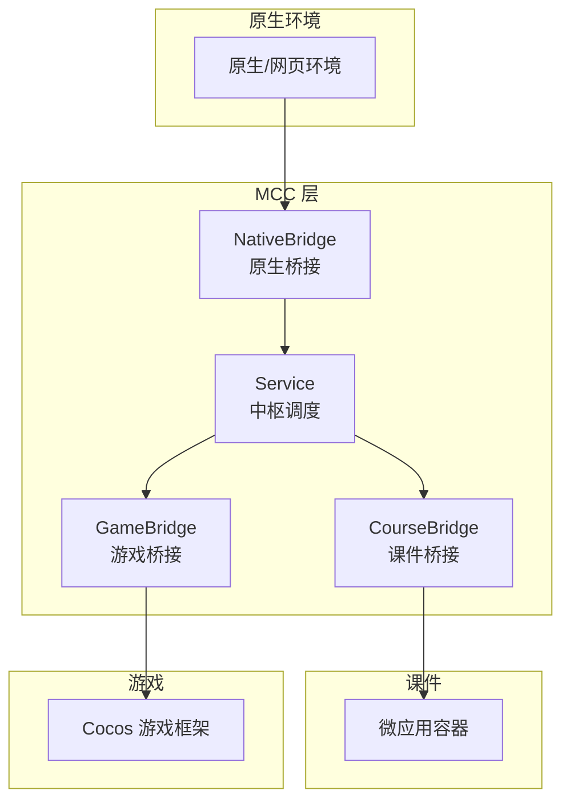
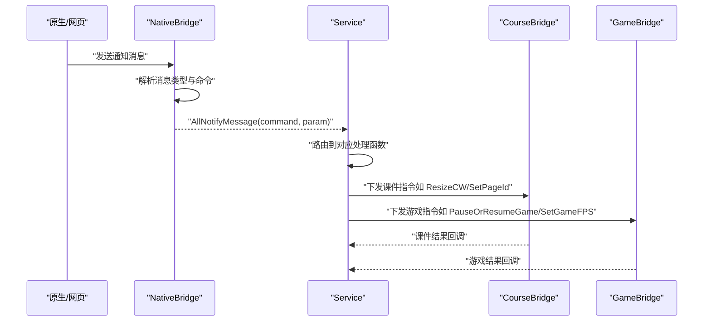
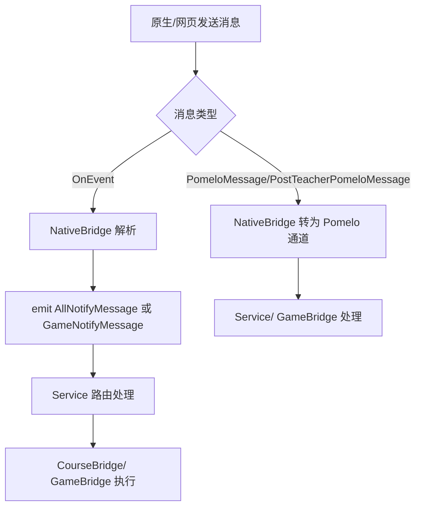
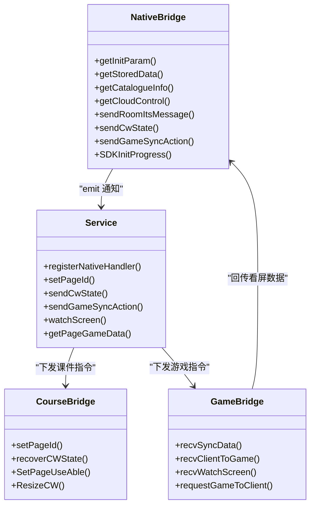

# 通知类型定义

<cite>
**本文引用的文件**
- [bridge/mcc-player/src/components/native-bridge/bridge-type.ts](file://bridge/mcc-player/src/components/native-bridge/bridge-type.ts)
- [bridge/mcc-player/src/components/native-bridge/nativeBridgeManage.ts](file://bridge/mcc-player/src/components/native-bridge/nativeBridgeManage.ts)
- [bridge/mcc-player/src/components/service/index.ts](file://bridge/mcc-player/src/components/service/index.ts)
- [bridge/mcc-player/src/components/course-bridge/courseManager.ts](file://bridge/mcc-player/src/components/course-bridge/courseManager.ts)
- [bridge/mcc-player/src/components/course-bridge/type.ts](file://bridge/mcc-player/src/components/course-bridge/type.ts)
- [bridge/mcc-player/src/components/game-manage/gameManager.ts](file://bridge/mcc-player/src/components/game-manage/gameManager.ts)
- [bridge/mcc-player/src/components/game-manage/gameBridge.ts](file://bridge/mcc-player/src/components/game-manage/gameBridge.ts)
- [bridge/mcc-player/src/components/game-manage/type.ts](file://bridge/mcc-player/src/components/game-manage/type.ts)
- [bridge/mcc-player/src/libs/call-promisify/index.ts](file://bridge/mcc-player/src/libs/call-promisify/index.ts)
- [bridge/mcc-player/src/components/page/type.ts](file://bridge/mcc-player/src/components/page/type.ts)
- [bridge/mcc-player/src/components/page/const.ts](file://bridge/mcc-player/src/components/page/const.ts)
</cite>

## 目录
1. [简介](#简介)
2. [项目结构](#项目结构)
3. [核心组件](#核心组件)
4. [架构总览](#架构总览)
5. [详细组件分析](#详细组件分析)
6. [依赖关系分析](#依赖关系分析)
7. [性能考量](#性能考量)
8. [故障排查指南](#故障排查指南)
9. [结论](#结论)
10. [附录](#附录)

## 简介
本文件面向“通知类型定义”模块，系统性梳理 NotifyType 与 GameNotifyType 枚举中各类通知的触发条件、处理逻辑、参数格式、回调与状态同步机制，并对比原生到 MCC 的通知与原生到游戏的通知差异。同时提供使用示例、集成方案、错误处理与重试机制说明，帮助开发者快速理解并正确接入通知系统。

## 项目结构
通知系统主要分布在以下模块：
- 通知类型定义：桥接层定义原生↔MCC、MCC↔课件、MCC↔游戏之间的通知类型
- 通知分发与桥接：NativeBridge 负责接收原生消息并分发；Service 作为中枢协调各模块
- 课件桥接：CourseBridge 负责与微应用容器交互，下发课件指令
- 游戏桥接：GameBridge 负责与游戏通信、同步数据、处理授权与看屏场景
- 错误与超时：CallPromisify 提供统一的 Promise 化调用与超时控制

图表来源
- [bridge/mcc-player/src/components/native-bridge/nativeBridgeManage.ts:26-136](file://bridge/mcc-player/src/components/native-bridge/nativeBridgeManage.ts#L26-L136)
- [bridge/mcc-player/src/components/service/index.ts:41-149](file://bridge/mcc-player/src/components/service/index.ts#L41-L149)
- [bridge/mcc-player/src/components/course-bridge/courseManager.ts:13-47](file://bridge/mcc-player/src/components/course-bridge/courseManager.ts#L13-L47)
- [bridge/mcc-player/src/components/game-manage/gameBridge.ts:22-54](file://bridge/mcc-player/src/components/game-manage/gameBridge.ts#L22-L54)

章节来源
- [bridge/mcc-player/src/components/native-bridge/bridge-type.ts:24-53](file://bridge/mcc-player/src/components/native-bridge/bridge-type.ts#L24-L53)
- [bridge/mcc-player/src/components/native-bridge/nativeBridgeManage.ts:26-136](file://bridge/mcc-player/src/components/native-bridge/nativeBridgeManage.ts#L26-L136)
- [bridge/mcc-player/src/components/service/index.ts:41-149](file://bridge/mcc-player/src/components/service/index.ts#L41-L149)

## 核心组件
- 通知类型定义
  - 原生到 MCC：NotifyType 定义了课件目录、尺寸变更、页面跳转、课件状态、看屏、在线人数、动画状态等通知
  - 原生到游戏：GameNotifyType 定义了授权/取消授权、暂停/恢复、设置 FPS 等通知
- 消息桥接与分发
  - NativeBridge：解析消息、区分事件与 Pomelo 通道、分发到 AllNotifyMessage 或 GameNotifyMessage
  - Service：注册监听，按命令路由到对应处理函数，协调课件与游戏
  - CourseBridge：与微应用容器交互，下发课件指令（如 ResizeCW、SetPageId）
  - GameBridge：与游戏通信，处理同步数据、授权、看屏、透传端上消息

章节来源
- [bridge/mcc-player/src/components/native-bridge/bridge-type.ts:24-53](file://bridge/mcc-player/src/components/native-bridge/bridge-type.ts#L24-L53)
- [bridge/mcc-player/src/components/native-bridge/nativeBridgeManage.ts:65-136](file://bridge/mcc-player/src/components/native-bridge/nativeBridgeManage.ts#L65-L136)
- [bridge/mcc-player/src/components/service/index.ts:90-149](file://bridge/mcc-player/src/components/service/index.ts#L90-L149)
- [bridge/mcc-player/src/components/course-bridge/courseManager.ts:88-92](file://bridge/mcc-player/src/components/course-bridge/courseManager.ts#L88-L92)
- [bridge/mcc-player/src/components/game-manage/gameBridge.ts:48-54](file://bridge/mcc-player/src/components/game-manage/gameBridge.ts#L48-L54)

## 架构总览
通知系统采用“事件驱动 + 命令路由”的模式：
- 原生/网页通过统一入口向 MCC 发送消息
- NativeBridge 解析消息类型，区分普通事件与 Pomelo 通道
- Service 统一注册监听，按命令分派至相应处理逻辑
- CourseBridge 与微应用容器交互，下发课件指令
- GameBridge 与游戏通信，处理授权、暂停/恢复、FPS 设置、同步数据等

图表来源
- [bridge/mcc-player/src/components/native-bridge/nativeBridgeManage.ts:65-136](file://bridge/mcc-player/src/components/native-bridge/nativeBridgeManage.ts#L65-L136)
- [bridge/mcc-player/src/components/service/index.ts:90-149](file://bridge/mcc-player/src/components/service/index.ts#L90-L149)
- [bridge/mcc-player/src/components/course-bridge/courseManager.ts:88-92](file://bridge/mcc-player/src/components/course-bridge/courseManager.ts#L88-L92)
- [bridge/mcc-player/src/components/game-manage/gameBridge.ts:48-54](file://bridge/mcc-player/src/components/game-manage/gameBridge.ts#L48-L54)

## 详细组件分析

### 通知类型定义与触发条件

- 原生到 MCC 的通知（NotifyType）
  - HandleRoomItsMessage：收到 Pomelo 消息后触发，用于将消息透传给课件或游戏
  - ResizeCW：屏幕尺寸变化时触发，参数通常包含宽高，用于调整课件展示区域
  - HandleCatalogueInfo：获取课件目录信息，用于初始化页面结构
  - HandleStoredData：根据 startPageId 等参数从服务器拉取存储数据
  - HandleInitParam：获取初始化参数（角色、用户、设备、帧率等）
  - HandleCloudControl：获取云控配置，影响资源路径与行为
  - SetPageId：跳转到指定页面，触发切页流程
  - CWStateChange：课件状态改变，触发状态上报
  - HandleCwState：发送课件数据到服务端
  - WatchScreen：授课端查看学生游戏，触发看屏流程
  - GetPageGameData：授课端查看学生游戏时，请求当前页游戏数据
  - GetOnlineNum：获取在线人数
  - AnimateChange：动画状态变化，触发课件动画同步

- 原生到游戏的通知（GameNotifyType）
  - OnInteractAction：授权/取消授权，需 MCC 处理后再透传给游戏
  - PauseOrResumeGame：暂停/恢复游戏，由 MCC 保存状态并下发给游戏
  - SetGameFPS：设置游戏帧率，MCC 保存并下发给游戏

章节来源
- [bridge/mcc-player/src/components/native-bridge/bridge-type.ts:24-53](file://bridge/mcc-player/src/components/native-bridge/bridge-type.ts#L24-L53)

### 参数格式与回调处理

- 通用参数结构
  - 命令字段：command（字符串，对应枚举值）
  - 参数字段：param（任意对象，承载具体业务参数）
  - 标识字段：id（可选，用于 Promise 化调用的唯一标识）

- Promise 化调用与超时
  - 调用方通过 callNative 发起请求，携带 id 与 timeout
  - CallPromisify 记录调用并在超时后 reject，支持 timerCallback 回调
  - 原生侧通过 OnEvent 返回 id 与结果，Promise resolve

- 课件桥接参数
  - CourseBridge 通过微应用 setData 下发指令，参数包含 type、param、timestamp
  - 课件侧通过微应用 data listener 接收并回调 resolve

章节来源
- [bridge/mcc-player/src/libs/call-promisify/index.ts:11-36](file://bridge/mcc-player/src/libs/call-promisify/index.ts#L11-L36)
- [bridge/mcc-player/src/components/course-bridge/courseManager.ts:88-92](file://bridge/mcc-player/src/components/course-bridge/courseManager.ts#L88-L92)
- [bridge/mcc-player/src/components/native-bridge/nativeBridgeManage.ts:156-175](file://bridge/mcc-player/src/components/native-bridge/nativeBridgeManage.ts#L156-L175)

### 状态同步机制

- 课件状态同步
  - Service 在收到 cwStateChange 或 sendCwState 后，将状态写入 pageStateMap，并在切页成功后恢复
  - CourseBridge 在 setPageId 成功后，调用 recoverCWState 恢复课件状态

- 游戏同步机制
  - GameBridge 监听游戏同步数据，区分心跳与操作数据
  - 教师端将心跳数据上报服务端，学生端在被授权时将心跳数据保存在本地
  - GameBridge 将非心跳的操作数据回发给游戏，同时通过 Pomelo 广播给其他端

- 看屏流程
  - 授课端发起看屏，GameBridge 标记 isBeWatched，并将看屏动作透传给游戏
  - 授课端请求当前页游戏数据，GameBridge 收集游戏 URL、初始化参数、页面数据与同步数据并回传

章节来源
- [bridge/mcc-player/src/components/service/index.ts:406-468](file://bridge/mcc-player/src/components/service/index.ts#L406-L468)
- [bridge/mcc-player/src/components/game-manage/gameBridge.ts:116-189](file://bridge/mcc-player/src/components/game-manage/gameBridge.ts#L116-L189)
- [bridge/mcc-player/src/components/game-manage/gameBridge.ts:218-234](file://bridge/mcc-player/src/components/game-manage/gameBridge.ts#L218-L234)

### 原生到 MCC 的通知机制 vs 原生到游戏的通知机制

- 原生到 MCC（NotifyType）
  - 通过 OnEvent 通道传递，NativeBridge 解析后 emit AllNotifyMessage
  - Service 注册监听，按命令路由到具体处理函数（如 ResizeCW、SetPageId、GetOnlineNum 等）

- 原生到游戏（GameNotifyType）
  - 通过 OnEvent 通道识别为游戏通知，NativeBridge emit GameNotifyMessage
  - Service 将命令转发给 GameBridge，GameBridge 根据命令处理（如 OnInteractAction、PauseOrResumeGame、SetGameFPS）

图表来源
- [bridge/mcc-player/src/components/native-bridge/nativeBridgeManage.ts:74-88](file://bridge/mcc-player/src/components/native-bridge/nativeBridgeManage.ts#L74-L88)
- [bridge/mcc-player/src/components/service/index.ts:115-121](file://bridge/mcc-player/src/components/service/index.ts#L115-L121)

### 典型通知处理流程

- HandleRoomItsMessage（收到 Pomelo 消息）
  - Service 调用 courseBridge.transferMessageReceive 将消息透传给课件
  - 教师端还会上报埋点

- ResizeCW（修改屏幕宽高）
  - Service 触发 SET_INIT_PARAM 并调用 CourseBridge.ResizeCW
  - 课件根据新尺寸调整展示区域

- SetPageId（跳转到指定页面）
  - Service setPageId 流程：计算前后页、请求必要 JSON、设置全局数据、调用 CourseBridge.setPageId
  - setPageIdResult 成功后，恢复课件状态并上报 SDK 进度

- WatchScreen（看屏）
  - Service 调用 GameBridge.recvWatchScreen 标记看屏状态
  - 授课端请求当前页游戏数据，GameBridge 收集并回传

章节来源
- [bridge/mcc-player/src/components/service/index.ts:500-513](file://bridge/mcc-player/src/components/service/index.ts#L500-L513)
- [bridge/mcc-player/src/components/service/index.ts:528-531](file://bridge/mcc-player/src/components/service/index.ts#L528-L531)
- [bridge/mcc-player/src/components/service/index.ts:612-676](file://bridge/mcc-player/src/components/service/index.ts#L612-L676)
- [bridge/mcc-player/src/components/service/index.ts:482-492](file://bridge/mcc-player/src/components/service/index.ts#L482-L492)
- [bridge/mcc-player/src/components/game-manage/gameBridge.ts:218-234](file://bridge/mcc-player/src/components/game-manage/gameBridge.ts#L218-L234)

## 依赖关系分析

图表来源
- [bridge/mcc-player/src/components/native-bridge/nativeBridgeManage.ts:211-394](file://bridge/mcc-player/src/components/native-bridge/nativeBridgeManage.ts#L211-L394)
- [bridge/mcc-player/src/components/service/index.ts:85-149](file://bridge/mcc-player/src/components/service/index.ts#L85-L149)
- [bridge/mcc-player/src/components/course-bridge/courseManager.ts:54-92](file://bridge/mcc-player/src/components/course-bridge/courseManager.ts#L54-L92)
- [bridge/mcc-player/src/components/game-manage/gameBridge.ts:169-243](file://bridge/mcc-player/src/components/game-manage/gameBridge.ts#L169-L243)

章节来源
- [bridge/mcc-player/src/components/native-bridge/nativeBridgeManage.ts:211-394](file://bridge/mcc-player/src/components/native-bridge/nativeBridgeManage.ts#L211-L394)
- [bridge/mcc-player/src/components/service/index.ts:85-149](file://bridge/mcc-player/src/components/service/index.ts#L85-L149)
- [bridge/mcc-player/src/components/course-bridge/courseManager.ts:54-92](file://bridge/mcc-player/src/components/course-bridge/courseManager.ts#L54-L92)
- [bridge/mcc-player/src/components/game-manage/gameBridge.ts:169-243](file://bridge/mcc-player/src/components/game-manage/gameBridge.ts#L169-L243)

## 性能考量
- 事件路由与解耦：通过统一的事件通道与命令枚举，降低模块间耦合，提升可维护性
- Promise 化调用：对需要原生返回的请求统一超时控制，避免阻塞
- 状态缓存：课件状态与游戏心跳数据在内存中缓存，减少重复请求
- 切页优化：仅在必要时请求页面 JSON，避免全量加载

## 故障排查指南
- 超时与拒绝
  - 使用 CallPromisify.record 设置超时时间，超时后 reject 并触发 timerCallback
  - 检查原生侧是否正确返回 id 与结果，确保 OnEvent 回调链路畅通

- 通知未到达
  - 确认消息类型：OnEvent 与 PomeloMessage/PostTeacherPomeloMessage 的区别
  - 检查 Service 的路由表，确认命令是否在 Service 中注册处理

- 看屏数据缺失
  - 确认 GameBridge.recvWatchScreen 已标记 isBeWatched
  - 确认 Service.getPageGameData 已调用 GameBridge.recvGetPageGameData

- 授权与心跳异常
  - 检查 GameBridge.onInteractAction 是否正确保存/清理本地心跳数据
  - 确认教师端与学生端的角色与授权状态

章节来源
- [bridge/mcc-player/src/libs/call-promisify/index.ts:11-36](file://bridge/mcc-player/src/libs/call-promisify/index.ts#L11-L36)
- [bridge/mcc-player/src/components/service/index.ts:115-121](file://bridge/mcc-player/src/components/service/index.ts#L115-L121)
- [bridge/mcc-player/src/components/game-manage/gameBridge.ts:286-320](file://bridge/mcc-player/src/components/game-manage/gameBridge.ts#L286-L320)

## 结论
通知类型定义模块通过清晰的枚举与统一的桥接层，实现了原生、课件与游戏之间的高效通信。借助 Service 的集中路由与 CourseBridge/GameBridge 的职责分离，系统具备良好的扩展性与稳定性。配合 Promise 化调用与超时控制，能够有效提升用户体验与系统可靠性。

## 附录

### 使用示例与集成方案

- 获取初始化参数
  - 原生侧调用 getInitParam，Service 注册并返回 InitParam
  - 课件侧通过 CourseBridge 接收并应用宽高、角色等参数

- 修改屏幕尺寸
  - 原生侧触发 ResizeCW，Service 更新初始化参数并调用 CourseBridge.ResizeCW

- 切页流程
  - 原生侧触发 SetPageId，Service 计算前后页、请求 JSON、设置全局数据、调用 CourseBridge.setPageId
  - setPageIdResult 成功后恢复课件状态

- 授权与看屏
  - 原生侧触发 OnInteractAction，Service 转发给 GameBridge，GameBridge 保存/清理心跳数据并透传给游戏
  - 授课端触发 WatchScreen，GameBridge 标记看屏状态并透传给游戏

- 游戏 FPS 与暂停/恢复
  - 原生侧触发 SetGameFPS/PauseOrResumeGame，GameBridge 保存额外数据并透传给游戏

章节来源
- [bridge/mcc-player/src/components/service/index.ts:771-783](file://bridge/mcc-player/src/components/service/index.ts#L771-L783)
- [bridge/mcc-player/src/components/service/index.ts:528-531](file://bridge/mcc-player/src/components/service/index.ts#L528-L531)
- [bridge/mcc-player/src/components/service/index.ts:612-676](file://bridge/mcc-player/src/components/service/index.ts#L612-L676)
- [bridge/mcc-player/src/components/game-manage/gameBridge.ts:194-212](file://bridge/mcc-player/src/components/game-manage/gameBridge.ts#L194-L212)