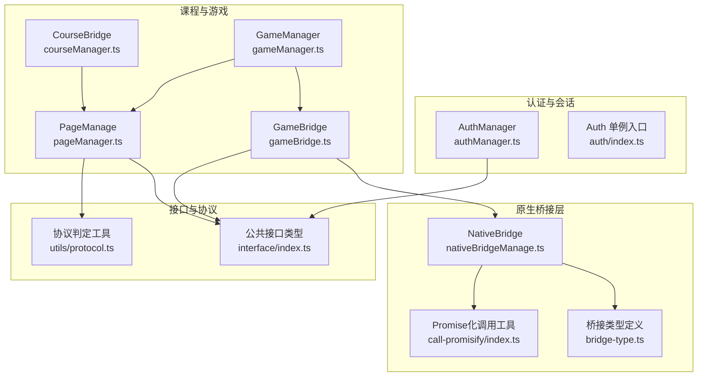
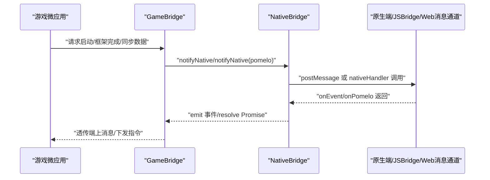
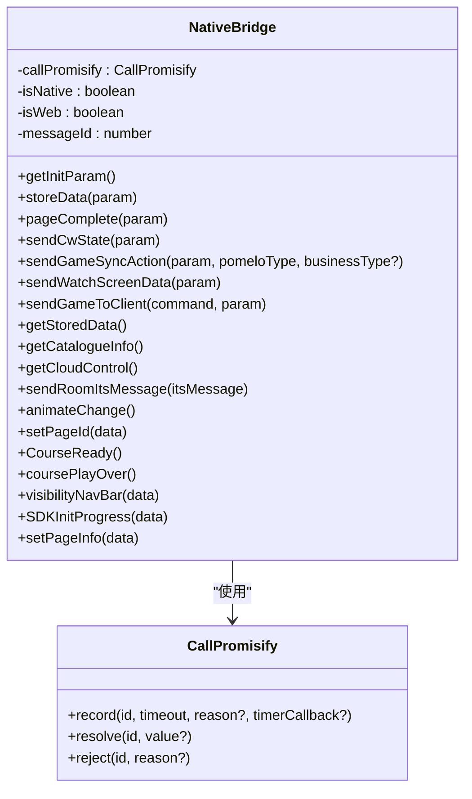
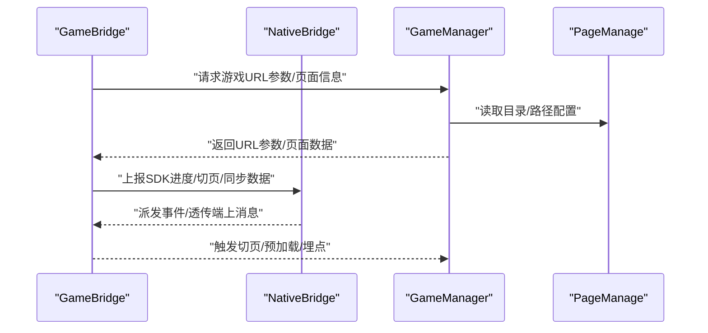
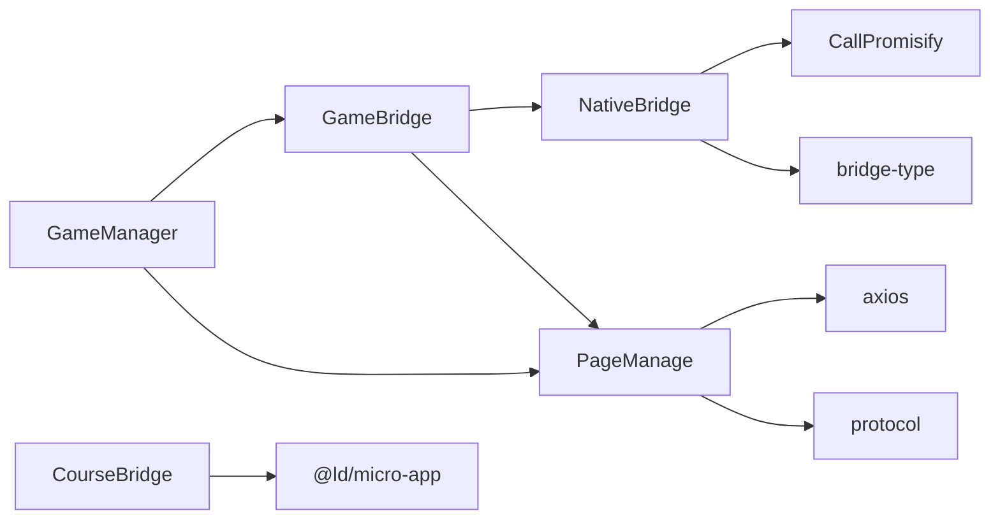

# 原生桥接功能

<cite>
**本文引用的文件**   
- [index.ts](file://bridge/mcc-player/src/components/native-bridge/index.ts)
- [nativeBridgeManage.ts](file://bridge/mcc-player/src/components/native-bridge/nativeBridgeManage.ts)
- [bridge-type.ts](file://bridge/mcc-player/src/components/native-bridge/bridge-type.ts)
- [authManager.ts](file://bridge/mcc-player/src/components/auth/authManager.ts)
- [index.ts](file://bridge/mcc-player/src/components/auth/index.ts)
- [courseManager.ts](file://bridge/mcc-player/src/components/course-bridge/courseManager.ts)
- [type.ts](file://bridge/mcc-player/src/components/course-bridge/type.ts)
- [gameManager.ts](file://bridge/mcc-player/src/components/game-manage/gameManager.ts)
- [gameBridge.ts](file://bridge/mcc-player/src/components/game-manage/gameBridge.ts)
- [type.ts](file://bridge/mcc-player/src/components/game-manage/type.ts)
- [pageManager.ts](file://bridge/mcc-player/src/components/page/pageManager.ts)
- [type.ts](file://bridge/mcc-player/src/components/page/type.ts)
- [index.ts](file://bridge/mcc-player/src/libs/call-promisify/index.ts)
- [index.ts](file://bridge/mcc-player/src/interface/index.ts)
- [protocol.ts](file://bridge/mcc-player/src/utils/protocol.ts)
</cite>

## 目录
1. [简介](#简介)
2. [项目结构](#项目结构)
3. [核心组件](#核心组件)
4. [架构总览](#架构总览)
5. [组件详解](#组件详解)
6. [依赖关系分析](#依赖关系分析)
7. [性能考量](#性能考量)
8. [故障排查指南](#故障排查指南)
9. [结论](#结论)
10. [附录](#附录)

## 简介
本文件面向“原生桥接功能模块”，系统化梳理并说明以下内容：
- 原生能力的封装与暴露机制：如何在浏览器环境中通过统一桥接层与原生端通信，覆盖设备访问、系统调用与平台特定能力抽象。
- 认证管理器的设计与实现：用户身份验证、权限控制与会话管理的职责边界与扩展思路。
- 原生 API 的设计原则：安全性、稳定性与兼容性的权衡与落地。
- 调用方式与参数传递：同步调用、异步回调、错误处理与超时控制。
- 使用示例与最佳实践：如何正确使用原生能力，避免常见陷阱。
- 扩展方法与自定义实现：如何在现有桥接体系上新增命令、事件与适配新平台。

## 项目结构
围绕原生桥接的核心代码主要位于 bridge/mcc-player/src/components/native-bridge 与相关联的课程、游戏、页面管理模块。下图给出与原生桥接直接相关的模块关系概览：

**图表来源**
- [nativeBridgeManage.ts:26-395](file://bridge/mcc-player/src/components/native-bridge/nativeBridgeManage.ts#L26-L395)
- [bridge-type.ts:1-73](file://bridge/mcc-player/src/components/native-bridge/bridge-type.ts#L1-L73)
- [index.ts:1-80](file://bridge/mcc-player/src/libs/call-promisify/index.ts#L1-L80)
- [authManager.ts:1-9](file://bridge/mcc-player/src/components/auth/authManager.ts#L1-L9)
- [index.ts:1-17](file://bridge/mcc-player/src/components/auth/index.ts#L1-L17)
- [courseManager.ts:1-117](file://bridge/mcc-player/src/components/course-bridge/courseManager.ts#L1-L117)
- [gameManager.ts:1-368](file://bridge/mcc-player/src/components/game-manage/gameManager.ts#L1-L368)
- [gameBridge.ts:1-388](file://bridge/mcc-player/src/components/game-manage/gameBridge.ts#L1-L388)
- [pageManager.ts:1-498](file://bridge/mcc-player/src/components/page/pageManager.ts#L1-L498)
- [index.ts:1-71](file://bridge/mcc-player/src/interface/index.ts#L1-L71)
- [protocol.ts:1-66](file://bridge/mcc-player/src/utils/protocol.ts#L1-L66)

**章节来源**
- [nativeBridgeManage.ts:26-395](file://bridge/mcc-player/src/components/native-bridge/nativeBridgeManage.ts#L26-L395)
- [bridge-type.ts:1-73](file://bridge/mcc-player/src/components/native-bridge/bridge-type.ts#L1-L73)
- [index.ts:1-80](file://bridge/mcc-player/src/libs/call-promisify/index.ts#L1-L80)
- [authManager.ts:1-9](file://bridge/mcc-player/src/components/auth/authManager.ts#L1-L9)
- [index.ts:1-17](file://bridge/mcc-player/src/components/auth/index.ts#L1-L17)
- [courseManager.ts:1-117](file://bridge/mcc-player/src/components/course-bridge/courseManager.ts#L1-L117)
- [gameManager.ts:1-368](file://bridge/mcc-player/src/components/game-manage/gameManager.ts#L1-L368)
- [gameBridge.ts:1-388](file://bridge/mcc-player/src/components/game-manage/gameBridge.ts#L1-L388)
- [pageManager.ts:1-498](file://bridge/mcc-player/src/components/page/pageManager.ts#L1-L498)
- [index.ts:1-71](file://bridge/mcc-player/src/interface/index.ts#L1-L71)
- [protocol.ts:1-66](file://bridge/mcc-player/src/utils/protocol.ts#L1-L66)

## 核心组件
- 原生桥接管理器：负责消息监听、消息分发、原生调用、Pomelo 透传、超时与回调管理。
- 原生命令与通知枚举：统一定义原生侧与前端之间的命令、事件与消息类型。
- Promise 化调用工具：为原生调用提供统一的超时与回调管理。
- 认证管理器：当前实现为空，作为未来扩展点预留。
- 课程桥接：与课件微应用通信，封装 setData/setGlobalData 等异步交互。
- 游戏桥接：协调原生、课件与游戏微应用，处理同步数据、互动授权、端到游戏透传等。
- 页面管理：负责目录拉取、资源路径解析、远程/本地回退策略与埋点。
- 公共接口与协议工具：统一角色、初始化参数、初始化进度、协议判定等。

**章节来源**
- [nativeBridgeManage.ts:26-395](file://bridge/mcc-player/src/components/native-bridge/nativeBridgeManage.ts#L26-L395)
- [bridge-type.ts:1-73](file://bridge/mcc-player/src/components/native-bridge/bridge-type.ts#L1-L73)
- [index.ts:1-80](file://bridge/mcc-player/src/libs/call-promisify/index.ts#L1-L80)
- [authManager.ts:1-9](file://bridge/mcc-player/src/components/auth/authManager.ts#L1-L9)
- [courseManager.ts:1-117](file://bridge/mcc-player/src/components/course-bridge/courseManager.ts#L1-L117)
- [gameBridge.ts:1-388](file://bridge/mcc-player/src/components/game-manage/gameBridge.ts#L1-L388)
- [pageManager.ts:1-498](file://bridge/mcc-player/src/components/page/pageManager.ts#L1-L498)
- [index.ts:1-71](file://bridge/mcc-player/src/interface/index.ts#L1-L71)
- [protocol.ts:1-66](file://bridge/mcc-player/src/utils/protocol.ts#L1-L66)

## 架构总览
下图展示原生桥接在运行时的关键交互流程：前端通过统一桥接层向原生端发送命令，原生端返回事件或数据，桥接层进行消息分发与 Promise 化处理，并由上层模块（课程、游戏、页面）消费。

**图表来源**
- [nativeBridgeManage.ts:144-205](file://bridge/mcc-player/src/components/native-bridge/nativeBridgeManage.ts#L144-L205)
- [gameBridge.ts:48-110](file://bridge/mcc-player/src/components/game-manage/gameBridge.ts#L48-L110)

**章节来源**
- [nativeBridgeManage.ts:144-205](file://bridge/mcc-player/src/components/native-bridge/nativeBridgeManage.ts#L144-L205)
- [gameBridge.ts:48-110](file://bridge/mcc-player/src/components/game-manage/gameBridge.ts#L48-L110)

## 组件详解

### 原生桥接管理器（NativeBridge）
- 职责
  - 统一消息监听与分发：支持 Web 环境的 postMessage 与原生 JSBridge 通道。
  - 原生调用封装：提供 notifyNative 与 callNative，前者用于无需返回的调用，后者用于需要返回值的异步调用。
  - Pomelo 透传：封装与服务端通信的消息类型，支持两类透传通道。
  - 事件总线：基于 EventEmitter，向上层模块派发 AllNotifyMessage 与 GameNotifyMessage。
  - 超时与回调：通过 CallPromisify 实现 Promise 化调用与超时处理。
- 关键实现要点
  - 消息监听：根据 URL 参数判断来源（app/web），分别绑定 window.jsHandler 或 window.addEventListener('message')。
  - 发送消息：优先使用 window.htHammer/nativeHandler，其次使用 window.webkit.messageHandlers.nativeHandler，最后在 Web 环境使用 window.parent.postMessage。
  - 命令封装：提供 getInitParam、storeData、pageComplete、sendCwState、sendGameSyncAction、sendWatchScreenData、setPageId、SDKInitProgress、visibilityNavBar、animateChange、courseReady、coursePlayOver 等常用命令。
  - 游戏透传：对 GameNotifyType 类型的消息进行特殊派发，便于游戏侧订阅。

**图表来源**
- [nativeBridgeManage.ts:26-395](file://bridge/mcc-player/src/components/native-bridge/nativeBridgeManage.ts#L26-L395)
- [index.ts:1-80](file://bridge/mcc-player/src/libs/call-promisify/index.ts#L1-L80)

**章节来源**
- [nativeBridgeManage.ts:26-395](file://bridge/mcc-player/src/components/native-bridge/nativeBridgeManage.ts#L26-L395)
- [index.ts:1-80](file://bridge/mcc-player/src/libs/call-promisify/index.ts#L1-L80)

### 原生命令与通知类型（bridge-type）
- 命令类型（CommandType）：定义从前端到原生的命令集合，如获取初始化参数、存储数据、上报 SDK 进度、切页、课件状态同步、游戏同步动作、观看端数据请求等。
- 通知类型（NotifyType）：定义从原生到前端的事件集合，如尺寸变化、目录信息、存储数据、初始化参数、云控配置、页面切换、课件状态变更、观看端请求等。
- 游戏通知类型（GameNotifyType）：定义从原生到游戏的事件集合，如授权/取消授权、暂停/恢复、设置 FPS 等。
- 常量：PomeloMessage、PostTeacherPomeloMessage、OnEvent、OnPomelo 等，用于区分消息类型与透传通道。

**章节来源**
- [bridge-type.ts:1-73](file://bridge/mcc-player/src/components/native-bridge/bridge-type.ts#L1-L73)

### Promise 化调用工具（CallPromisify）
- 职责：为异步调用提供统一的 Promise 化封装，支持超时、批量 resolve/reject、定时器清理。
- 关键点：按消息 ID 维护待处理的回调队列，超时触发 reject 并回调 timerCallback，正常返回则 resolve。

**章节来源**
- [index.ts:1-80](file://bridge/mcc-player/src/libs/call-promisify/index.ts#L1-L80)

### 认证管理器（AuthManager）
- 当前实现：空壳类，作为未来扩展点预留。
- 建议职责：用户身份验证、权限校验、会话生命周期管理、令牌刷新与失效处理、跨端会话一致性保障。

**章节来源**
- [authManager.ts:1-9](file://bridge/mcc-player/src/components/auth/authManager.ts#L1-L9)
- [index.ts:1-17](file://bridge/mcc-player/src/components/auth/index.ts#L1-L17)

### 课程桥接（CourseBridge）
- 职责：与课件微应用通信，封装 setData、setGlobalData 等异步交互，统一事件派发。
- 关键点：基于 microApp 的 addDataListener/removeDataListener，处理 msgId、resolve 回调与事件派发。

**章节来源**
- [courseManager.ts:1-117](file://bridge/mcc-player/src/components/course-bridge/courseManager.ts#L1-L117)
- [type.ts:1-55](file://bridge/mcc-player/src/components/course-bridge/type.ts#L1-L55)

### 游戏桥接（GameBridge）与游戏管理（GameManager）
- GameBridge
  - 职责：统一处理游戏微应用与原生端的交互，包括启动参数、框架完成、同步数据、互动授权、端到游戏透传、观看端数据请求等。
  - 重要流程：onGameSyncData/recvSyncData 负责心跳与操作数据的合并与广播；recvClientToGame/recvWatchScreen 负责端到游戏透传与观看端数据请求。
- GameManager
  - 职责：管理游戏资源路径、游戏页映射、预加载与切页逻辑、与原生端的 SDK 进度上报、与页面管理器的联动。
  - 关键点：根据课件目录构建游戏页映射表，计算上下页关系；根据页面类型决定是否暂停/恢复游戏引擎；在游戏页上报埋点。

**图表来源**
- [gameBridge.ts:322-339](file://bridge/mcc-player/src/components/game-manage/gameBridge.ts#L322-L339)
- [gameManager.ts:99-124](file://bridge/mcc-player/src/components/game-manage/gameManager.ts#L99-L124)
- [pageManager.ts:194-307](file://bridge/mcc-player/src/components/page/pageManager.ts#L194-L307)

**章节来源**
- [gameBridge.ts:1-388](file://bridge/mcc-player/src/components/game-manage/gameBridge.ts#L1-L388)
- [gameManager.ts:1-368](file://bridge/mcc-player/src/components/game-manage/gameManager.ts#L1-L368)
- [pageManager.ts:1-498](file://bridge/mcc-player/src/components/page/pageManager.ts#L1-L498)

### 页面管理（PageManage）
- 职责：拉取课件目录、解析资源路径、处理本地/远程回退策略、设置全局数据、埋点上报。
- 关键点：支持多 CDN 回退、本地根目录存在性检测、Axios 拦截器与状态校验、全局数据注入给课件与游戏。

**章节来源**
- [pageManager.ts:1-498](file://bridge/mcc-player/src/components/page/pageManager.ts#L1-L498)
- [type.ts:1-52](file://bridge/mcc-player/src/components/page/type.ts#L1-L52)
- [protocol.ts:1-66](file://bridge/mcc-player/src/utils/protocol.ts#L1-L66)

### 公共接口与类型（interface/index.ts）
- 角色（Role）、初始化参数（InitParam）、初始化进度（INIT_STEP）、事件常量（AllNotifyMessage、GameNotifyMessage）、错误捕获事件等。
- 作用：为桥接层与上层模块提供统一的类型约束与约定。

**章节来源**
- [index.ts:1-71](file://bridge/mcc-player/src/interface/index.ts#L1-L71)

## 依赖关系分析
- 模块耦合
  - GameBridge 强依赖 NativeBridge 与 PageManage，弱依赖 GameManager。
  - GameManager 依赖 GameBridge、PageManage、NativeBridge 与桥接类型。
  - CourseBridge 依赖 microApp 与 CallPromisify。
  - PageManage 依赖 axios、protocol 工具与 microApp。
- 外部依赖
  - 原生通道：window.htHammer/nativeHandler、window.webkit.messageHandlers.nativeHandler、window.parent.postMessage。
  - 微应用通信：@ld/micro-app 的 setData/addDataListener/setGlobalData。
- 潜在风险
  - 原生通道差异导致的兼容性问题。
  - Promise 化调用未及时清理定时器引发的内存泄漏。
  - 事件风暴导致的性能瓶颈。

**图表来源**
- [gameBridge.ts:22-42](file://bridge/mcc-player/src/components/game-manage/gameBridge.ts#L22-L42)
- [gameManager.ts:65-72](file://bridge/mcc-player/src/components/game-manage/gameManager.ts#L65-L72)
- [courseManager.ts:6-12](file://bridge/mcc-player/src/components/course-bridge/courseManager.ts#L6-L12)
- [pageManager.ts:1-11](file://bridge/mcc-player/src/components/page/pageManager.ts#L1-L11)
- [nativeBridgeManage.ts:26-30](file://bridge/mcc-player/src/components/native-bridge/nativeBridgeManage.ts#L26-L30)
- [index.ts:1-80](file://bridge/mcc-player/src/libs/call-promisify/index.ts#L1-L80)
- [bridge-type.ts:1-73](file://bridge/mcc-player/src/components/native-bridge/bridge-type.ts#L1-L73)
- [protocol.ts:1-66](file://bridge/mcc-player/src/utils/protocol.ts#L1-L66)

**章节来源**
- [gameBridge.ts:22-42](file://bridge/mcc-player/src/components/game-manage/gameBridge.ts#L22-L42)
- [gameManager.ts:65-72](file://bridge/mcc-player/src/components/game-manage/gameManager.ts#L65-L72)
- [courseManager.ts:6-12](file://bridge/mcc-player/src/components/course-bridge/courseManager.ts#L6-L12)
- [pageManager.ts:1-11](file://bridge/mcc-player/src/components/page/pageManager.ts#L1-L11)
- [nativeBridgeManage.ts:26-30](file://bridge/mcc-player/src/components/native-bridge/nativeBridgeManage.ts#L26-L30)
- [index.ts:1-80](file://bridge/mcc-player/src/libs/call-promisify/index.ts#L1-L80)
- [bridge-type.ts:1-73](file://bridge/mcc-player/src/components/native-bridge/bridge-type.ts#L1-L73)
- [protocol.ts:1-66](file://bridge/mcc-player/src/utils/protocol.ts#L1-L66)

## 性能考量
- 超时与重试
  - 建议为 callNative 设置合理超时时间，并在超时回调中进行降级处理或重试。
- 事件风暴
  - 对高频事件（如心跳）进行节流/去抖，避免过多回调堆积。
- 资源加载
  - PageManage 的多 CDN 回退与本地根目录检测需结合缓存策略，减少重复请求。
- 内存管理
  - 确保 CallPromisify 在 reject 时清理定时器，避免内存泄漏。

[本节为通用建议，无需列出章节来源]

## 故障排查指南
- 原生通道不可用
  - 症状：调用 app 接口异常。
  - 排查：确认 window.htHammer/nativeHandler、webkit.messageHandlers.nativeHandler、postMessage 是否可用。
  - 参考路径：[nativeBridgeManage.ts:196-204](file://bridge/mcc-player/src/components/native-bridge/nativeBridgeManage.ts#L196-L204)
- 调用无响应或超时
  - 症状：callNative 一直 pending。
  - 排查：检查消息 ID 生成、Promise 记录与 resolve 流程，确认超时回调是否触发。
  - 参考路径：[nativeBridgeManage.ts:156-175](file://bridge/mcc-player/src/components/native-bridge/nativeBridgeManage.ts#L156-L175)，[index.ts:11-20](file://bridge/mcc-player/src/libs/call-promisify/index.ts#L11-L20)
- 事件未到达
  - 症状：上层模块未收到事件。
  - 排查：确认 handleMessage 是否正确解析 JSON、switch 分支是否命中、emit 的事件名是否一致。
  - 参考路径：[nativeBridgeManage.ts:65-90](file://bridge/mcc-player/src/components/native-bridge/nativeBridgeManage.ts#L65-L90)
- 课件/游戏资源加载失败
  - 症状：页面空白或白屏。
  - 排查：检查本地根目录是否存在、CDN 回退链路、Axios 拦截器状态码判断。
  - 参考路径：[pageManager.ts:274-306](file://bridge/mcc-player/src/components/page/pageManager.ts#L274-L306)

**章节来源**
- [nativeBridgeManage.ts:156-204](file://bridge/mcc-player/src/components/native-bridge/nativeBridgeManage.ts#L156-L204)
- [index.ts:11-20](file://bridge/mcc-player/src/libs/call-promisify/index.ts#L11-L20)
- [pageManager.ts:274-306](file://bridge/mcc-player/src/components/page/pageManager.ts#L274-L306)

## 结论
原生桥接模块通过统一的桥接层与多种通信通道，实现了前端与原生端的稳定交互；配合课程、游戏与页面管理模块，形成了完整的教学场景闭环。当前认证管理器处于可扩展状态，建议尽快补齐鉴权与会话能力。后续可在以下方面持续优化：
- 完善认证与权限体系，统一令牌与会话管理。
- 增强错误监控与日志上报，提升可观测性。
- 优化资源加载与事件处理，降低延迟与卡顿。
- 扩展原生命令集，覆盖更多平台特性与设备能力。

[本节为总结，无需列出章节来源]

## 附录

### 原生 API 设计原则
- 安全性
  - 严格校验来源与参数，避免跨域或越权调用。
  - 对敏感操作（如存储数据、授权）增加二次确认与审计。
- 稳定性
  - 提供超时与重试机制，保证在网络波动下的可用性。
  - 对高频事件进行限流，防止事件风暴。
- 兼容性
  - 多通道并存（JSBridge、postMessage、原生注入），自动降级。
  - 明确的错误码与提示，便于定位问题。

[本节为通用指导，无需列出章节来源]

### 调用方式与参数传递
- 同步调用
  - 适用于无需返回值的命令，如 CourseReady、visibilityNavBar、SDKInitProgress。
  - 参考路径：[nativeBridgeManage.ts:345-348](file://bridge/mcc-player/src/components/native-bridge/nativeBridgeManage.ts#L345-L348)
- 异步回调
  - 适用于需要返回值的命令，通过 callNative 返回 Promise，内部使用 CallPromisify 管理超时。
  - 参考路径：[nativeBridgeManage.ts:156-175](file://bridge/mcc-player/src/components/native-bridge/nativeBridgeManage.ts#L156-L175)，[index.ts:11-20](file://bridge/mcc-player/src/libs/call-promisify/index.ts#L11-L20)
- 错误处理
  - 超时触发 reject 并回调 timerCallback；网络异常与状态码错误在拦截器中统一处理。
  - 参考路径：[nativeBridgeManage.ts:169-174](file://bridge/mcc-player/src/components/native-bridge/nativeBridgeManage.ts#L169-L174)，[pageManager.ts:141-153](file://bridge/mcc-player/src/components/page/pageManager.ts#L141-L153)

**章节来源**
- [nativeBridgeManage.ts:156-175](file://bridge/mcc-player/src/components/native-bridge/nativeBridgeManage.ts#L156-L175)
- [index.ts:11-20](file://bridge/mcc-player/src/libs/call-promisify/index.ts#L11-L20)
- [pageManager.ts:141-153](file://bridge/mcc-player/src/components/page/pageManager.ts#L141-L153)

### 使用示例与最佳实践
- 获取初始化参数
  - 调用 getInitParam，等待 Promise 返回后，将 InitParam 注入到页面与游戏模块。
  - 参考路径：[nativeBridgeManage.ts:211-214](file://bridge/mcc-player/src/components/native-bridge/nativeBridgeManage.ts#L211-L214)
- SDK 初始化进度上报
  - 在关键节点调用 SDKInitProgress，避免重复上报。
  - 参考路径：[nativeBridgeManage.ts:375-388](file://bridge/mcc-player/src/components/native-bridge/nativeBridgeManage.ts#L375-L388)
- 课件状态同步
  - 使用 sendCwState 上报课件实时数据；使用 getCatalogueInfo 拉取目录。
  - 参考路径：[nativeBridgeManage.ts:245-247](file://bridge/mcc-player/src/components/native-bridge/nativeBridgeManage.ts#L245-L247)，[nativeBridgeManage.ts:297-300](file://bridge/mcc-player/src/components/native-bridge/nativeBridgeManage.ts#L297-L300)
- 游戏同步数据
  - 在 GameBridge.onGameSyncData 中合并心跳与操作数据，并通过 Pomelo 透传。
  - 参考路径：[gameBridge.ts:116-163](file://bridge/mcc-player/src/components/game-manage/gameBridge.ts#L116-L163)
- 互动授权与观看端
  - 通过 GameNotifyType.OnInteractAction 与 recvWatchScreen 协调互动状态与观看端数据请求。
  - 参考路径：[gameBridge.ts:194-234](file://bridge/mcc-player/src/components/game-manage/gameBridge.ts#L194-L234)

**章节来源**
- [nativeBridgeManage.ts:211-214](file://bridge/mcc-player/src/components/native-bridge/nativeBridgeManage.ts#L211-L214)
- [nativeBridgeManage.ts:245-247](file://bridge/mcc-player/src/components/native-bridge/nativeBridgeManage.ts#L245-L247)
- [nativeBridgeManage.ts:297-300](file://bridge/mcc-player/src/components/native-bridge/nativeBridgeManage.ts#L297-L300)
- [gameBridge.ts:116-163](file://bridge/mcc-player/src/components/game-manage/gameBridge.ts#L116-L163)
- [gameBridge.ts:194-234](file://bridge/mcc-player/src/components/game-manage/gameBridge.ts#L194-L234)

### 扩展方法与自定义实现指南
- 新增原生命令
  - 在 bridge-type.ts 的 CommandType 中添加新命令枚举，在 nativeBridgeManage.ts 中新增对应方法。
  - 参考路径：[bridge-type.ts:3-22](file://bridge/mcc-player/src/components/native-bridge/bridge-type.ts#L3-L22)，[nativeBridgeManage.ts:211-214](file://bridge/mcc-player/src/components/native-bridge/nativeBridgeManage.ts#L211-L214)
- 新增事件类型
  - 在 bridge-type.ts 的 NotifyType/GameNotifyType 中添加事件枚举，在 handleMessage/emit 中补充分支。
  - 参考路径：[bridge-type.ts:24-47](file://bridge/mcc-player/src/components/native-bridge/bridge-type.ts#L24-L47)，[nativeBridgeManage.ts:74-88](file://bridge/mcc-player/src/components/native-bridge/nativeBridgeManage.ts#L74-L88)
- 新增原生通道
  - 在 sendToNative 中新增通道判断与调用逻辑，并在 index.ts 中提供单例入口。
  - 参考路径：[nativeBridgeManage.ts:182-205](file://bridge/mcc-player/src/components/native-bridge/nativeBridgeManage.ts#L182-L205)，[index.ts:1-17](file://bridge/mcc-player/src/components/native-bridge/index.ts#L1-L17)
- 认证与会话扩展
  - 在 authManager.ts 中实现登录、鉴权、令牌刷新与失效处理，并通过 Auth 单例对外暴露。
  - 参考路径：[authManager.ts:1-9](file://bridge/mcc-player/src/components/auth/authManager.ts#L1-L9)，[index.ts:1-17](file://bridge/mcc-player/src/components/auth/index.ts#L1-L17)

**章节来源**
- [bridge-type.ts:3-22](file://bridge/mcc-player/src/components/native-bridge/bridge-type.ts#L3-L22)
- [nativeBridgeManage.ts:182-205](file://bridge/mcc-player/src/components/native-bridge/nativeBridgeManage.ts#L182-L205)
- [index.ts:1-17](file://bridge/mcc-player/src/components/native-bridge/index.ts#L1-L17)
- [authManager.ts:1-9](file://bridge/mcc-player/src/components/auth/authManager.ts#L1-L9)
- [index.ts:1-17](file://bridge/mcc-player/src/components/auth/index.ts#L1-L17)